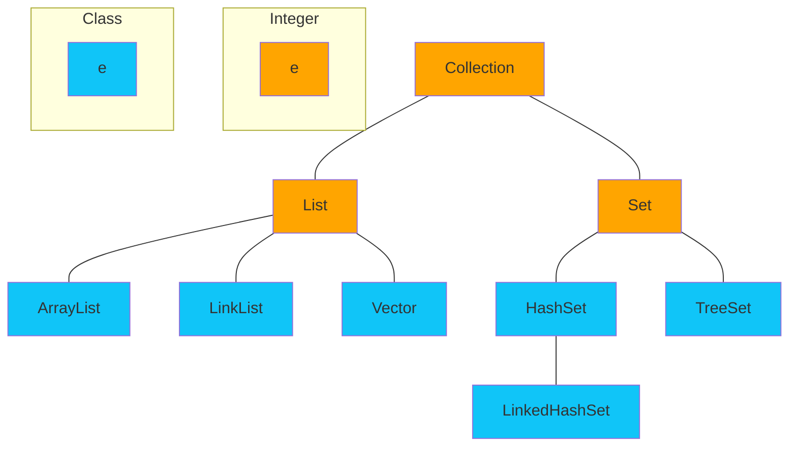
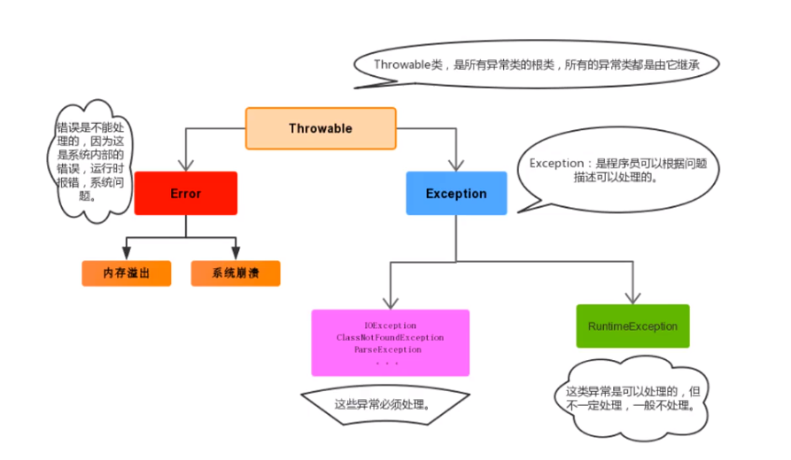
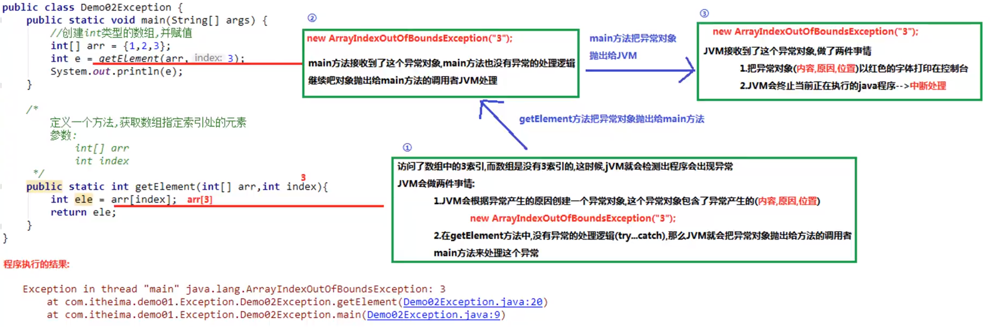
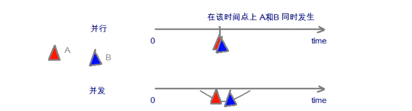
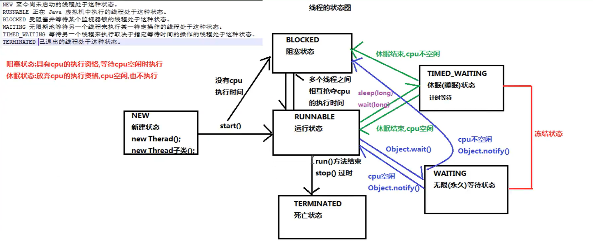
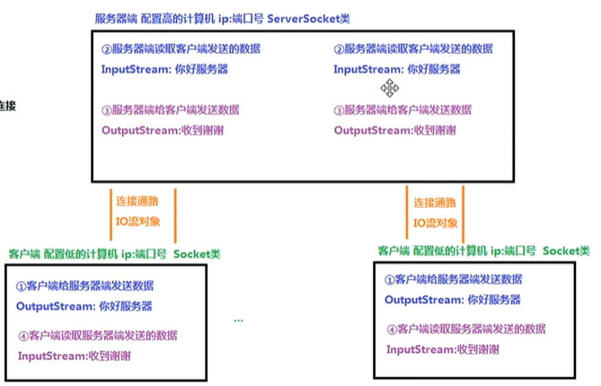

[toc]

# java

## 基础

1. 二进制

   1. ==十进制转换为二进制：除二取余，结果从下向上排列==
   2. ==二进制转换为十进制：从右到左依次序乘以位权==

2. 存储单元

   * 字节是我们常见计算机中最小存储单元，计算机存储的任何数据，都是以字节形式存储的
   * 8 bit (二进制位) 0000-0000表示为一个字节，1byte或者1B
   * ==8bit  =1B=1byte==、==1024B =1KB==、==1024KB=1MB==、==1024MB=1GB==、==1024GB=1T==

3. `JVM`

   * `java`虚拟机。所有的Java代码都运行在`jvm`上。
   * Java虚拟机本身不具有跨平台的功能，每个操作系统上都有不同版本的虚拟机

4. `JRE`和`JDK``

   * `jre：`Java运行时环境，包含`jvm`和运行时所需要的核心类库。
   * `jdk：`Java程序开发工具包。

5. Java开发程序的三个步骤

   * 编写源代码--->编译源程序--->运行
   * javac.exe编译器;Java.exe解释器
   * 编译：`javac 类名`
   * 反编译：`javap 类名.class`

6. 注释

   * `//`单行注释
   * `/**/`多行注释

7. 关键字的概念与特征:完全小写的字母;在增强版的记事本，也就是开发工具中带颜色的字体

8. 标识符的概念与规则

   * 标识符：是指程序中，我们自己定义的类容
   * 命名规则: `硬性规则`
     * 包含`英文字母26个（区分大小写）`、`0-9`、`$(美元符号)`和`_(下划线)`。
     * 不能以数字开头
     * 不能是关键字 
   * 命名规则 `软性规则`
     * 类命名规范：首字母大写，后面每个单词首字母大写(大驼峰)
     * 变量命名规范：首字母小写，后面每个单词首字母大写(小驼峰)
     * 方法命名规范：同变量名

9. 三元运算符：`(关系表达式) ? 表达式1 : 表达式2;`

9. 四种权限修饰符:Java中有四种权限修饰符,能访问的权限。

   |              | public | > protected | > (default) 表示不写 | > private |
   | ------------ | ------ | ----------- | -------------------- | --------- |
   | 同一个类     | 能访问 | 能访问      | 能访问               | 能访问    |
   | 同一个包     | 能访问 | 能访问      | 能访问               | 不能访问  |
   | 不同包子类   | 能访问 | 能访问      | 不能访问             | 不能访问  |
   | 不同包非子类 | 能访问 | 不能访问    | 不能访问             | 不能访问  |

10. 基本类型与字符串之间的转换

   基本类型转换为String总共有三种方式

   ```java
基本类型直接与””相连接即可;如:34+""
Integer.toString(12)
String.valueOf(12)
   ```

   String转换成对应的基本类型除了Character类之外,其他所有包装类都具有parseXxx静态方法可以将字符串参数转换为对应的基本类型:

   * `public static byte parseByte(String s)` :将字符串参数转换为对应的byte基本类型。
   * `public static short parseShort(String s)` :将字符串参数转换为对应的short基本类型。
   * `public static int parseInt(String s)` :将字符串参数转换为对应的int基本类型。
   * `public static long parseLong(String s)` :将字符串参数转换为对应的long基本类型。
   * `public static float parseFloat(String s)` :将字符串参数转换为对应的float基本类型。
   * `public static double parseDouble(String s)` :将字符串参数转换为对应的double基本类型。
   * `public static boolean parseBoolean (String s)` :将字符串参数转换为对应的boolean基本类型。

   ```java
package baozhuanglei;

public class Test02 {
    public static void main(String[] args) {
        //数据类型转换字符串
        int s = 12;
        String q = s+"";
        String w = Integer.toString(s);
        String e = String.valueOf(s);
        System.out.println(q+12+w+12+e+12);
        //字符串转换数据类型
        Integer str = Integer.parseInt("12");
        System.out.println(str+12);
    }
}
   ```


### 常量的概念与分类

**常量**：在程序运行期间，固定不变的量

**分类**

| 类型       | 含义                                     | 数据举例                 |
| ---------- | ---------------------------------------- | ------------------------ |
| 整数常量   | 所有的整数                               | 0、1、2、3....           |
| 小数常量   | 所有小数                                 | 0.0、0.2、0.5            |
| 字符常量   | 单引号引起来、只能写一个字符、必须有内容 | 'a'、' '、'好'           |
| 字符串常量 | 双引号引起来、可以写多个字符、也可以不写 | "A"、"Hello"、"你好"、"" |
| 布尔常量   | 只有两个值                               | true、false              |
| 空常量     | 只有一个值                               | null                     |

**变量**：常量是固定不变的数据,那么在程序中可以变化的量称为变量。

> 数学中,可以使用字母代替数字运算,例如x=1+5或者6=x+5。
>
> 程序中,可以使用字母保存数字的方式进行运算,提高计算能力,可以解决更多的问题。比如x保存5,x也可以保存6,这样x保存的数据是可以改变的,也就是我们所讲解的变量。

Java中要求一个变量每次只能保存一个数据,必须要明确保存的数据类型。

### 数据类型

Java的数据类型分为两类：

* 基本数据类型：包括整数、浮点数、字符、布尔
* 引用数据类型：类、数组、接口

### 基本数据类型

四类八种基本数据类型

| 数据类型     | 关键宇       | 内存占用 | 取值范围              |
| ------------ | ------------ | -------- | --------------------- |
| 字节型       | byte         | 1个字节  | -128-127              |
| 短整型       | short        | 2个字节  | -32768-32767          |
| 整型         | int(默认)    | 4个字节  | -2^31^-2^31^-1        |
| 长整型       | long         | 8个字节  | -2^63^-2^63^-1        |
| 单精度浮点数 | float        | 4个字节  | 1.4013E-45-3.4028E+38 |
| 双精度浮点数 | double(默认) | 8个字节  | 4.9E-324-1.7977E+308  |
| 字符型       | char         | 2个字节  | 0-65535               |
| 布尔类型     | boolean      | 1个字节  | true,false            |

> Java中的默认类型:整数类型是int、浮点类型是double

1. 字符串不是基本类型,而是引用类型。
2. 浮点型可能只是一个近似值,并非精确的值。
3. 数据范围与字节数不一定相关,例如flpat数据范围比long更加广泛,但是float是4字节, long是8字节。
4. 浮点数当中默认类型是double。如果一定要使用float类型,需要加上一个后缀F。如果是整数,默认为int类型,如果一定要使用long类型,需要加上一个后缀L。推荐使用大写字母后缀。

### 方法

==方法其实就是若干语句的功能集合==

1. 修饰符:现阶段的固定写法,public static

2. 方法名称:方法的名字,规则和变量一样,小驼峰

3. 方法体:方法需要做的事情,若干行代码

4. 方法上有横线表示这个方法已经过时不用，有新的方法。

5. 参数：参数类型:进入方法的数据是什么类型；参数名称:进入方法的数据对应的变量名称 ；参数如果有多个`,`使用逗号进行分隔

   1. 有参数：小括号当中有内容,当一个方法需要一些数据条件,才能完成任务的时候,就是有参数。
   2. 无参数：小括号当中留空。一个方法不需要任何数据条件,自己就能独立完成任务,就是无参数。

6. 返回值：return:两个作用,第一停止当前方法,第二将后面的返回值还给调用处；返回值也就是方法执行后最终产生的数据结果；return后面的“返回值”,必须和方法名称前面的“返回值类型”,保持对应；返回值类型:也就是方法最终产生的数据结果是什么类型。

   1. 对于有返回值的方法,可以使用单独调用、打印调用或者赋值调用。

      ```mermaid
      graph LR
      subgraph 无返回值的方法
      A[调用方法]
      B[找到方法]
      C[传递参数]
      D[执行方法]
      E[将返回值交还给调用处]
      end
      B==>C==>D==>E==什么都不带==>A==>B
      ```

   2. 但是对于无返回值的方法,只能使用单独调用,不能使用打印调用或者赋值调用。

      ```mermaid
      graph LR
      subgraph 有返回值的方法
      AA[调用方法]
      BB[找到方法]
      CC[传递参数]
      DD[执行方法]
      EE[将返回值交还给调用处]
      AA==>BB==>CC==>DD==>EE==带着返回值==>AA
      end
      ```

```java
修饰符 返回值类型 方法名称(参数类型参数名称, ...){
      方法体
      return 返回值;
}
```

#### 方法的调用

1. 单独调用：`sum(10,20);`

   1. 返回值类型为==void==的，只能单独调用。

2. 打印调用：` System.out.println(sum(10,20));`

3. 赋值调用：`int number = sum(10,20);`

4. 快捷键：快速打印for如循环`参数.fori`

   ```java
   public class Demoe2MethodDefine {
       public static void main(String[] args) {
           //单独调用
           sum(10,20);
           //打印调用
           System.out.println(sum(10,20));
           //赋值调用
           int number = sum(10,20);
       }
       //方法
       public static  int sum(int a,int b){
           return a+b;
       }
   }
   ```

### 重载

==多个方法的名称一样,但是参数列表不一样。==

1. 方法重载（Overload）与下列因素相关: ==参数的个数、类型不同、多类型顺序不同==
2. 方法的重载（Overload）与下列因素无关:==与参数的名称、返回值类型无关==

```java
public class Demo01MethodOverload {
    public static void main(String[] args) {
        System.out.println(sum(10, 20));
        System.out.println(sum(10, 20, 30));
        System.out.println(sum(10, 20, 30, 40));
    }
    public static int sum(int a, int b) {
        return a + b;
    }
    public static int sum(int a, int b, int c) {
        return a + b + c;
    }
    public static int sum(int a, int b, int c, int d) {
        return a + b + c + d;
    }
}
```

### 数组

==是一种容器,可以同时存放多个数据值。==

1. 数组特点：==数组是一种引用数据类型，数组当中的多个数据,类型必须统一，数组的长度在程序运行期间不可改变==

2. 数组初始化：在内存当中创建一个数组,并且向其中赋予一些默认值。 

3. 两种常见的初始化方式:

   1. 动态初始化(指定长度):在创建数组的时候,直接指定数组当中的数据元素个数。

      ```java
      数据类型[] 数组名称 = new 数据类型[数组长度]
      * 左侧数据类型:也就是数组当中保存的数据,全都是统一的什么类型
      * 左侧的中括号:代表我是一个数组
      * 左侧数组名称:给数组取一个名字
      * 右侧的new:代表创建数组的动作
      * 右侧数据类型:必须和左边的数据类型保持一致
      * 右侧中括号的长度:也就是数组当中,到底可以保存多少个数据,是一个int数字
          int[] Array = new int[100]//100是长度
      ```

   2. 静态初始化(指定内容):在创建数组的时候,不直接指定数据个数多少,而是直接将具体的数据内容进行指定。

      ```java
      标准格式：
      数据类型[] 数组名称 = new 数据类型[]{元素1,元素2,..};
      省略格式：
      数据类型[] 数组名称 = {元素1,元素2,..};
      注意事项:
      1. 虽然静态初始化没有直接告诉长度,但是根据大括号里面的元素具体内容,也可以自动推算出来长度。
      2. 静态初始化标准格式可以拆分成为两个步骤。
      3. 动态初始化也可以拆分成为两个步骤。
      4. 静态初始化一旦使用省略格式,就不能拆分成为两个步骤了。
      //标准格式：
      int[] Array = new int[]{1,2,3,4,5,6,7}
      //省略格式
      int[] Array = {1,2,3,4,5,6,7}
      ```

   3. 使用建议：==如果不确定数组当中的具体内容,用动态初始化;否则,已经确定了具体的内容,用静态初始化。==

      * 直接打印数组名称：==得到的是数组对应的，内存地址哈希值。==
      * 访问数组元素的格式:`数组名称[索引值]`

      * 索引值:就是一个int数字,代表数组当中元素的编号；索引值从0开始,一直到“数组的长度-1"为止。

   4. 【注意】

      使用动态初始化数组的时候,其中的元素将会自动拥有一个默认值。规则如下:

      | 数据类型 | 默认值 |
      | -------- | ------ |
      | 整数类型 | e      |
      | 浮点类型 | 0.0    |
      | 字符类型 | lueeee |
      | 布尔类型 | false  |
      | 引用类型 | null   |

      注意事项:静态初始化其实也有默认值的过程,只不过系统自动马上将默认值替换成为了大括号当中的具体数值。

4. Java内存划分

5. Java的内存需要划分成为5个部分:

   1. 栈(Stack):存放的都是方法中的局部变量。方法的运行一定要在栈当中运行
      * 局部变量:方法的参数,或者是方法()内部的变量
      * 作用域:一旦超出作用域,立刻从栈内存当中消失。
   2. 堆(Heap):凡是new出来的东西,都在堆当中。
      * 堆内存里面的东西都有一个地址值:16进制
      * 堆内存里面的数据,都有默认值==同动态数组初始化后元素类型一致==。
   3. 方法区(Method Area):存储.class相关信息,包含方法的信息。
   4. 本地方法栈(Native Method Stack):与操作系统相关。
   5. 寄存器(pc Register):与CPU相关。

#### 数组工具类

1. Arrays

   `java.util.Arrays`是一个与数组相关的工具类,里面提供了大量静态方法,用来实现数组常见的操作。

   * `public static String tostring(数组)`:将参数数组变成字符串(按照默认格式: [元素1,元素2,元素3...])

   * `public static void sort(数组)`:按照默认升序(从小到大)对数组的元素进行排序。

   备注:

   1. 如果是数值, sort默认按照升序从小到大
   2. 如果是字符串, sort默认按照字母升序
   3. 如果是自定义的类型,那么这个自定义的类需要有Comparable或者Comparator接口的支持。

   ```java
   package xuexijava.jichu;
   
   import java.util.Arrays;
   
   public class ShuZhu {
       public static void main(String[] args) {
           int[] ints = {10,20,70,60,40,30};
           System.out.println(Arrays.toString(ints));
           Arrays.sort(ints);
           System.out.println(Arrays.toString(ints));
       }
   }
   ```

2. Math

   `java.util.Math`类是数学相关的工具类,里面提供了大量的静态方法,完成与数学运算相关的操作。

   * `blic static double abs(double num)`:获取绝对值。
   * `public static double ceil (double num)`:向上（向整方向）取整。
   * `public static double floor(double num)`:向下取整。
   * `public static long round(double num)`:四舍五入。

   ```java
   package xuexijava.jichu;
   
   public class Math01 {
       public static void main(String[] args) {
           double a = -1.0;
           //取绝对值,原来有几位后面就有几位
           System.out.println(Math.abs(a));
           //向上取整
           System.out.println(Math.ceil(5.1));
           //向下取整
           System.out.println(Math.floor(5.1));
           //四舍五入，不带小数点
           System.out.println(Math.round(5.1));
           System.out.println(Math.round(5.5));
       }
   }
   ```

## 面向对象

面向过程：当需要实现一个功能的时候,每一个具体的步骤都要亲力亲为,详细处理每一个细节。

面向对象：当需要实现一个功能的时候,不关心具体的步骤,而是找一个已经具有该功能的人,来帮我做事儿

```java
import java.util.Arrays;
public class Demo01PrintArray {
    public static void main(String[] args) {
        int[] array = {10, 20, 30, 40, 50};
        //面向过程
        System.out.print("[");
        for (int i = 0; i < array.length; i++) {
            if (i == array.length-1) {
                System.out.print(array[i] + "]");
            } else {
                System.out.print(array[i] + ",");
            }
        }
        //面向对象
        System.out.println(Arrays.toString(array));
    }
}
```

### 类的定义

1. 类由成员变量（属性）和成员方法（行为）构成

   1. 成员变量：`String name; // 姓名；int age; // 年龄`
   2. 成员方法：`public void eat() // 吃饭;public void sleep(); // 睡觉public void study() ;//学 习`

2. 对象的创建及使用

   1. 导包:也就是指出需要使用的类,在什么位置。

      * import 包名称.类名称;

      * 对于和当前类属于同一个包的情况,可以省略导包语句不写。

   2. 创建：格式:

      * 类名称对象名=new类名称();

   3. 使用,分为两种情况。

      * 使用成员变量:对象名.成员变量名
      * 使用成员方法:对象名,成员方法名(参数)
      * (也就是,想用谁,就用对象名点儿谁。)

   4. 注意事项：

      如果成员变量没有进行赋值,那么将会有一个默认值,规则和数组一样。 

3. 成员变量和局部变量区别

   1. 定义的位置不一样【重点】
      * 局部变量:在方法的内部
      * 成员变量:在方法的外部,直接写在类当中
   2. 作用范围不一样【重点】
      * 局部变量:只有方法当中才可以使用,出了方法就不能再用
      * 成员变量:整个类全都可以通用。
   3. 默认值不一样【重点】
      * 局部变量:没有默认值,如果要想使用,必须手动进行赋值
      * 成员变量:如果没有赋值,会有默认值,规则和数组一样
   4. 内存的位置不一样(了解)
      * 局部变量:位于栈内存
      * 成员变量:位于堆内存
   5. 生命周期不一样(了解)
      * 局部变量:随着方法进栈而诞生,随着方法出栈而消失
      * 成员变量:随着对象创建而诞生,随着对象被垃圾回收而消失
   6. 方法的参数是局部变量
      * 面向对象三大特征：继承，封装，多态

### 封装性

1. 方法本身就是一种封装

2. 关键字private也是一种封

   * 用private关键字将需要保护的成员变量进行修饰。一旦使用了==private==进行修饰,那么本类当中仍然可以随意访问。但是!超出了本类范围之外就不能再直接访问了。

   * 间接访问==private==成员变量,就是定义一对儿==Getter/Setter==方法

   * 必须叫==setXxx==或者是==getXxx==命名规则。

     * 对于Getter来说,不能有参数,返回值类型和成员变量对应;
     * 对于Setter来说,不能有返回值,参数类型和成员变量对应。 

   * 对于基本类型当中的boolean值, Getter方法一定要写成isxxx的形式,而setXxx规则不变。

     ```java
     package xuexijava.mainxiangduixing;
     public class Preson {
         private String name;
         private int age;
         public void show(){
             System.out.println(name + age);
         }
         public String getName() {
             return name;
         }
         public int getAge() {
             return age;
         }
         //传输数据
         public void setName(String name) {
             this.name = name;
         }
         //获取数据
         public void setAge(int age) {
             this.age = age;
         }
     }
     ```

     ```java
     package xuexijava.mainxiangduixing;
     
     public class Mode01 {
         public static void main(String[] args) {
             Preson preson = new Preson();
             preson.setName("哈哈");
             preson.setAge(20);
             preson.show();
         }
     }
     ```

### 构造方法

==构造方法是专门用来创建对象的方法,当我们通过关键字new来创建对象时,其实就是在调用构造方法。==

```java
//格式：
public 类名称(参数类型 参数名称) {
       方法体   
}
```

1. 注意事项：

   1. 构造方法的名称必须和所在的类名称完全一样,就连大小写也要一样
   2. 构造方法不要写返回值类型,连void都不写
   3. 构造方法不能return一个具体的返回值
   4. 如果没有编写任何构造方法,那么编译器将会默认赠送一个构造方法,没有参数
   5. 一旦编写了至少一个构造方法,那么编译器将不再赠送
   6. 构造方法也是可以进行重载的。

2. 标准类

   1. 一个标准的类通常要拥有下面四个组成部分（这样标准的类也叫做Java Bean）:

      1. 所有的成员变量都要使用private关键字修饰
      2. 为每一个成员变量编写一对儿Getter/Setter方法
      3. 编写一个无参数的构造方法
      4. 编写一个全参数的构造方法

      ```java
      package xuexijava.mainxiangduixing;
      
      public class Student {
          private String name;
          public int age;
      
          public Student() {
          }
      
          public Student(String name, int age) {
              this.name = name;
              this.age = age;
          }
      
          public String getName() {
              return name;
          }
      
          public void setName(String name) {
              this.name = name;
          }
      
          public int getAge() {
              return age;
          }
      
          public void setAge(int age) {
              this.age = age;
          }
      }
      //调用类
      class dome02{
          public static void main(String[] args) {
              Student stu1 = new Student();
              stu1.setName("啊哈");
              stu1.setAge(22);
              System.out.println(stu1.getName()+stu1.getAge());
              System.out.println("=================");
              Student stu2 = new Student("窝火",23);
              System.out.println(stu2.getName()+stu2.getAge());
              stu2.setAge(24);
              System.out.println("=================");
              System.out.println(stu2.getName()+stu2.getAge());
          }
      }
      ```

## API

1. Scanner：负责键盘输入
2. Random: 负责随机数生成
3. ArrayList: 集合用途跟数组差不多，比数组好用

### Scanner

==Scanner类的功能:可以实现键盘输入数据,到程序当中。==

引用类型的一般使用步骤;

1. 导包import 包路径.类名称;如果需要使用的目标类,和当前类位于同一个包下,则可以省略导包语句不写。
   * 只有java.Lang包下的内容不需要导包,其他的包都需要import语句。
2. 创建：
   * 类名称 对象名 = new 类名称();
3. 使用
   * 对象名,成员方法名() 

==system.in从键盘上输入==

获取键盘输入的一个int数字: int num = sc.nextInt();

获取键盘输入的一个字符串: String str = sc.next();

```java
package xuexijava.mainxiangduixing;

import java.util.Scanner;

public class dome03 {
    public static void main(String[] args) {
        //System.in表示重建盘输入
        Scanner sc = new Scanner(System.in);
        int num = sc.nextInt();
        System.out.println(num);
        String nbmp = sc.next();
        System.out.println(nbmp);
    }
}
```

### 匿名对象

匿名对象就是只有右边的对象,没有左边的名字和赋值运算符

`new 类名称();`

注意事项:匿名对象只能使用唯一的一次,下次再用不得不再创建一个新对象。

使用建议:如果确定有一个对象只需要使用唯一的一次,就可以用匿名对象。

```java
package xuexijava.mainxiangduixing;

public class Dome04 {
    String name;
    public void show(){
        System.out.println(name);
    }
}
class Dome05{
    public static void main(String[] args) {
        //匿名对象
        new Dome04().name = "哈哈哈";
    }
}
```

### Random

==Random类用来生成随机数字。==使用起来也是三个步骤:

1. 导包import java.util. Random;
2. 创建
   * Random r = new Random(); //小括号当中留空即可
3. 使用获取一个随机的int数字(范围是int所有范围,有正负两种): 
   * int num = r.nextInt()
4. 获取一个随机的int数字(参数代表了范围,左闭右开区间): 
   * int num = r.nextInt(3)实际上代表的含义是: [0,3),也就是0~2

```java
package xuexijava.mainxiangduixing;
//导包
import java.util.Random;

public class ModeRandom {
    public static void main(String[] args) {
        //创建
        Random random = new Random();
        //使用
        int r = random.nextInt();
        System.out.println(r);
    }
}
```

### ArrayList

==数组的长度不可以发生改变。但是Arraylist集合的长度是可以随意变化的。对于Arraylist来说,有一个尖括号`<E>`代表泛型。==

1. 泛型:也就是装在集合当中的所有元素,全都是统一的什么类型。

2. 注意:

   1. 泛型只能是引用类型,不能是基本类型。
   2. 创建了一个Arraylist集合,集合的名称是list,里面装的全都是String字符串类型的数据

3. 备注:从JDK 1.7+开始,右侧的尖括号内部可以不写内容,但是<>本身还是要写的。

4. 注意事项:对于Arraylist集合来说,直接打印得到的不是地址值,而是内容。如果内容是空,得到的是空的中括号: []

   ```java
   package xuexijava.caishuzi;
   
   import java.util.ArrayList;
   
   public class Mode01 {
       public static void main(String[] args) {
           ArrayList<String> list = new ArrayList<>();
           System.out.println(list);
           list.add("as");
           list.add("bs");
           list.add("cs");
           list.add("ds");
           System.out.println(list);
       }
   }
   ```

#### arraylist常用方法:

1. 向集合当中添加元素,参数的类型和泛型一致。返回值代表添加是否成功。

   ```java
   public boolean add(E e);
   //备注:对于ArrayList集合来说, add添加动作一定是成功的,所以返回值可用可不用。但是对于其他集合来说, add添加动作不一定成功。
   ```

2. 从集合当中获取元素,参数是索引编号,返回值就是对应位置的元素。

   ```java
   public E get(int index)
   ```

3. 从集合当中删除元素,参数是索引编号,返回值就是被删除掉的元素。

   ```java
   public E remove(int index)
   ```

4. 获取集合的尺寸长度,返回值是集合中包含的元素个数

   ```java
   public int size()
   ```

5. 基本操作

   1. **添加元素**
      - `void add(E e)`：向列表末尾添加一个元素。
      - `boolean addAll(Collection<? extends E> c)`：将指定集合中的所有元素按其在集合中的顺序添加到列表末尾。
      - `boolean addAll(int index, Collection<? extends E> c)`：将指定集合中的所有元素按其在集合中的顺序添加到列表的指定位置。
   2. **删除元素**
      - `boolean remove(Object o)`：移除列表中首次出现的指定元素（如果存在）。
      - `E remove(int index)`：移除列表中指定位置的元素，并返回该元素。
      - `boolean removeAll(Collection<?> c)`：移除列表中包含的所有指定集合中的元素。
      - `boolean retainAll(Collection<?> c)`：只保留列表中包含的所有指定集合中的元素。
   3. **替换元素**
      - `E set(int index, E element)`：将列表中指定位置的元素替换成指定的元素，并返回旧元素。
   4. **访问元素**
      - `E get(int index)`：返回列表中指定位置的元素。
      - `int indexOf(Object o)`：返回列表中首次出现的指定元素的索引；如果列表不包含此元素，则返回 `-1`。
      - `int lastIndexOf(Object o)`：返回列表中最后一次出现的指定元素的索引；如果列表不包含此元素，则返回 `-1`。
   5. **查询列表**
      - `boolean contains(Object o)`：如果此列表包含指定元素，则返回 `true`。
      - `boolean containsAll(Collection<?> c)`：如果此列表包含指定集合中的所有元素，则返回 `true`。
      - `boolean isEmpty()`：如果此列表不包含任何元素，则返回 `true`。
      - `int size()`：返回列表中的元素数量。
   6. **排序和搜索**
      - `void sort(Comparator<? super E> c)`：根据指定比较器对列表元素进行排序。
      - `int compareTo(List<? extends E> otherList)`：比较两个列表的顺序。
      - `int binarySearch(List<E> key, Comparator<? super E> c)`：根据指定比较器搜索列表，返回指定元素的索引。
   7. **子列表**
      - `List<E> subList(int fromIndex, int toIndex)`：返回列表的一个视图，从 `fromIndex` 到 `toIndex`（不包括 `toIndex`）。
   8. **清空列表**
      - `void clear()`：移除列表中的所有元素。

**例：**

```java
package xuexijava.caishuzi;

import java.util.ArrayList;

public class ArrayList01 {
    public static void main(String[] args){
        ArrayList<String> list = new ArrayList<>();
        System.out.println(list);
        //像集合中添加数据
        boolean success= list.add("哈哈哈");
        System.out.println(list);
        //查看添加动作是否成功
        System.out.println(success);

        list.add("哈哈哈");
        list.add("啊啊啊");
        list.add("黑猫警长");
        list.add("大耳贼");

        System.out.println(list);
        //返回对应位置的数据
        String name = list.get(2);
        System.out.println(name);
        //删除对应位置的数据
        String remo = list.remove(3);
        //查看删除的数据
        System.out.println(remo);
        //查看集合的长度
        int size = list.size();
        System.out.println(size);
    }
}
```

#### 向集合Arraylist当中存储基本类型数据

1. 必须使用基本类型对应的“包装类”。基本类型 包装类(引用类型,包装类都位于java.Lang包下)

2. 从JDK 1.5+开始,支持自动装箱、自动拆箱。

   * 自动装箱:基本类型-->包装类型
   * 自动拆箱:包装类型…>基本类型

3. | 基本数据类型 | 引用类            |
   | ------------ | ----------------- |
   | byte         | Byte              |
   | short        | Short             |
   | int          | Integer【特殊】   |
   | long         | Long              |
   | float        | Float             |
   | double       | Double            |
   | char         | Character【特殊】 |
   | boolean      | Boolean           |

4. 存储自定义对象

   ```java
   package xuexijava.caishuzi;
   
   import java.util.ArrayList;
   
   public class Student01 {
       public static void main(String[] args) {
           ArrayList<Student> list = new ArrayList<>();
           Student stu = new Student("哈哈",20);
           Student sta = new Student("嘿嘿",21);
           Student stb = new Student("丫丫",22);
           Student stc = new Student("呀呀",23);
   //        //set是重新赋值
   //        stu.setName("哈哈");
   //        Student a = stu.getName();
   //        list.add(a);
   //        stu.setAge(20);
   //        stu.setName("嘿嘿");
   //        stu.setAge(21);
   //        stu.setName("丫丫");
   //        stu.setAge(22);
           list.add(stu);
           list.add(sta);
           list.add(stb);
           list.add(stc);
   
           for (int i = 0; i < list.size(); i++) {
               Student a = list.get(i);
               System.out.println(a.getName()+a.getAge());
           }
       }
   }
   ```

## 字符串

### 字符串概述和特点

==程序当中所有的双引号字符串,都是String类的对象。(就算没有new,也照样是。)==

1. 字符串的特点;

   1. 字符串的内容永不可变。【重点】
   2. 正是因为字符串不可改变,所以字符串是可以共享使用的。
   3. 字符串效果上相当于是char[]字符数组,但是底层原理是byte[]字节数组。
   4. 字符串是常量，它们的值在创建之后不能更改。字符串缓冲区支持可变的字符串。因为String对象是不可变的,所以可以共享。

   ```java
   String str = "abc";
   等效于:
   char data[] = l'a', 'b', 'c'l;
   String str = new String (data);
   ```

2. 创建字符串构造方法和直接创建

   1. 构造方法
      1. `public String()`:创建一个空白字符串,不含有任何内容。
      2. `public String(char[] array)`:根据字符数组的内容,来创建对应的字符串。
      3. `public String(byte[] array)`:根据字节数组的内容,来创建对应的字符串。
   2. 直接创建
      1. `String str = "Hello"`注意:直接写上双引号,就是字符串对象。

   ```java
   package xuexijava.mainxiangduixing;
   
   public class String01 {
       public static void main(String[] args) {
           //使用空参构造
           String str1 = new String();//小括号留空,说明字符串什么内容都没有。
           System.out.println(str1);
   
           //根据字符数组创建字符串
           char[] charArray = {'a','b','c'};
           String str2 = new String(charArray);
           System.out.println(str2);
   
           //根据字节数组创建字符串
           byte[] byteArray = {97,98,99,100};
           String str3 = new String(byteArray);
           System.out.println(str3);
   
           //直接创建
           String str4 = "Hello";
           System.out.println(str4);
       }
   }
   ```

3. 字符串常量池

   1. 字符串常量池:程序当中直接写上的双引号字符串,就在字符串常量池中。

   2. `==`

      1. 对于基本类型来说,`==`是进行数值的比较。
      2. 对于引用类型来说,`==`是进行【地址值】的比较。
      3. 双引号直接写的字符串，在常量池中；new的不在常量池中

      ```java
      public static void main(String[] args){
          String str1 ="abc";
          String str2 ="abc";
          
          char[] charArray = {'a','b','c'};
          String str3 = new String(charArray);
          
          System.out.println(str1==str2);//true
          System.out.println(str1==str3);//flase
          System.out.println(str2==str3);//flase
      }
      ```

### 字符串相关方法

1. 比较方法

   ==`==`是进行对象的地址值比较,如果确实需要字符串的内容比较,可以使用两个方法:==

   1. `public boolean equals(Object obj):`参数可以是任何对象,只有参数是一个字符串并且内容相同的才会给true;否则返回false.

      1. 注意事项：
         1. 任何对象都能用Object进行接收。
         2. equals方法具有对称性,也就是a.equals(b)和b.equals(a)效果一样。
         3. 如果比较双方一个常量一个变量,推荐把常量字符串写在前面。
            * 推荐:` "abc".equals(str)` 不推荐:` str.equals("abc")`：报错控制指针错误

   2. `public boolean equalsIgnoreCase(String str)`:忽略大小写,进行内容比较。只有英文字母区分大小写。

      ```java
      package xuexijava.mainxiangduixing;
      
      public class String02 {
          public static void main(String[] args) {
              String str1 = "Hello";
              String str2 = "Hello";
              String str4 = "hello";
      
              char[] charArray = {'H','e','l','l','o'};
              String str3 = new String(charArray);
              System.out.println("Hello".equals(str1));
              System.out.println(str1.equals(str3));
      
              System.out.println(str1.equalsIgnoreCase(str4));
          }
      }
      ```

2. 获取方法

   1. `public int length()`:获取字符串当中含有的字符个数,拿到字符串长度。

   2. `public String concat(String str)`:将当前字符串和参数字符串拼接成为返回值新的字符串。

   3. `public char charAt(int index)`:获取指定索引位置的单个字符。(索引从0开始。)

   4. `public int indexof(String str)`:查找参数字符串在本字符串当中首次出现的索引位置,如果没有返回-1值。

      ```java
      package xuexijava.mainxiangduixing;
      
      public class String03 {
          public static void main(String[] args) {
              String str = "qwerty";
              //判断长度
              System.out.println(str.length());
              //拼接字符串
              String str1 = str.concat("qwe123rty");
              System.out.println(str1);
              //索引位置
              System.out.println(str1.charAt(6));
              //查看数字字符首次出现的位置
              System.out.println(str1.indexOf("er"));
              System.out.println(str1.indexOf("1"));
          }
      }
      ```

3. 截取方法

   1. `public String substring(int index)`:截取从参数位置一直到字符串末尾,返回新字符串。从左到右依次删除个数

   2. `public String substring(int begin, int end)`:截取从begin开始,一直到end结束,中间的字符串。

      * **备注**: [begin, end),包含左边,不包含右边。

      ```java
      System.out.println(str1.substring(6));
      System.out.println(str1.substring(6,7));
      ```

4. 转换方法

   1. `public char[] toCharArray()`:将当前字符串拆分成为字符数组作为返回值。

   2. `public byte[] getBytes()`:获得当前字符串底层的字节数组。

   3. `public String replace(CharSequence oldString, CharSequence newString)`:将所有出现的老字符串替换成为新的字符串,返回替换之后的结果新字符串。

      * **备注**: CharSequence意思就是说可以接受字符串类型。

      ```java
      char[] charArray = str1.toCharArray();
      System.out.println(charArray[0]);
      byte[] bytes = str1.getBytes();
      for (int i = 0; i < bytes.length; i++) {
          System.out.println(bytes[i]);
      }
      //替换
      System.out.println(str1.replace("123","456"));
      ```

5. 分割方法

   1. `public String[] split(String regex)`:按照参数的规则,将字符串切分成为若干部分。

   2. 注意事项:

      * split方法的参数其实是一个“正则表达式”,今后学习。今天要注意:如果按照英文句点“."进行切分,必须写`\\.`(两个反斜杠)

      ```java
      String str3 = "AAA,BBB,CCC";
      String str4 = "AAA.BBB.CCC";
      String[] charq = str3.split(",");
      for (int i = 0; i < charq.length; i++) {
          System.out.println(charq[i]);
      }
      String[] charw = str4.split("\\.");
      for (int i = 0; i < charw.length; i++) {
          System.out.println(charw[i]);
      }
      ```

## 静态关键字static

### static

==如果一个成员变量使用了static关键字,那么这个变量不再属于对象自己,而是属于所在的类。多个对象共享同一份数据==

1. static修饰方法

   1. 一旦使用static修饰成员方法,那么这就成为了静态方法。静态方法不属于对象,而是属于类的。

   2. 如果没有static关键字,那么必须首先创建对象,然后通过对象才能使用它。

   3. 如果有了static关键字,那么不需要创建对象,直接就能通过类名称来使用它。

   4. 无论是成员变量,还是成员方法。如果有了static,都推荐使用类名称进行调用。

      1. 静态变量:类名称.静态变量
      2. 静态方法:类名称.静态方法()
         * 对于本类中的静态方法，可以省略类名称

   5. 注意事项:

      1. 静态不能直接访问非静态。
         * 原因:因为在内存当中是【先】有的静态内容, 【后】有的非静态内容。==“先人不知道后人,但是后人知道先人。==
      2. 静态方法当中不能用this。原因: this代表当前对象,通过谁调用的方法,谁就是当前对象。

      ```java
      package xuexijava.jichu;
      
      public class MclassDiaoyong {
          public static void main(String[] args) {
              Mclass mclass = new Mclass();// 首先创建对象
              // 然后才能使用没有static关键字的内容
              mclass.fangFa();
              //对于静态方法来说,可以通过对象名进行调用,也可以直接通过类名称来调用。
              mclass.staticFangfa(); //正确,不推荐,这种写法在编译之后也会被javac翻译成为“类名称.静态方法名”
              Mclass.staticFangfa();// 正确,推
          }
      }
      ```

      ```java
      package xuexijava.jichu;
      
      public class Mclass {
          public void fangFa(){
              System.out.println("成员方法");
          }
          public static void staticFangfa(){
              System.out.println("静态方法");
          }
      }
      ```

2. 静态代码块

   1. 特点:当第一次用到本类时,静态代码块执行唯一的一次。

   2. 静态内容总是优先于非静态,所以静态代码块比构造方法先执行。

      1. 静态代码块的典型用途:==用来一次性地对静态成员变量进行赋值。==

      ```java
      static {
          //静态代码块的内容
      }
      ```

## 继承

==面向对象的三大特征:封装性、继承性、多态性。继承是多态的前提,如果没有继承,就没有多态。==

1. 继承主要解决的问题就是:==共性抽取。==

2. 继承关系当中的特点:

   1. 子类可以拥有父类的“内容”
   2. 子类还可以拥有自己专有的内容。

3. 格式：

   ```java
    定义父类的格式: (一个普通的类定义)
   public class 父类名称{
       //....
   }定义子类的格式:
   public class 类名 extends 父类名{
       //...
   }
   ```

   

### 继承中成员变量的访问特点

==在父子类的继承关系当中,如果成员变量重名,则创建子类对象时,访问有两种方式:==

1. 直接通过子类对象访问成员变量:
   * 等号左边是谁就优先用谁,没有则向上找。
2. 间接通过成员方法访问成员变量:
   * 该方法属于谁,就优先用谁，没有则向上找。
3. 区分子类中重名的三种变量
   * 局部变量:直接写成员变量名

   * 本类的成员变量:this.成员变量名

   * 父类的成员变量:super.成员变量名

4. 在父子类的继承关系当中,创建子类对象,访问成员方法的规则:
   * 创建的对象是谁,就优先用谁,如果没有则向上找。

5. 注意事项:无论是成员方法还是成员变量,如果没有都是向上找父类,绝对不会向下找子类的。

### 覆盖

重写(Override)概念:==在继承关系当中,方法的名称一样,参数列表也一样。==

* 覆盖(Override) :方法的名称一样,参数列表【也一样】。重写、覆写。
* 重载(Overload) :方法的名称一样,参数列表【不一样】

1. 方法的覆盖重写特点:==创建的是子类对象,则优先用子类方法。==

2. 方法覆盖重写的注意事项;

   1. 必须保证父子类之间方法的名称相同,参数列表也相同。
      * 写在方法前面,用来检测是不是有效的正确覆盖重写。安全保证
      * 这个注解就算不写,只要满足要求,也是正确的方法覆盖重写。
   2. 子类方法的返回值必须【小于等于】父类方法的返回值范围。
      * 提示: java.Lang.Object类是所有类的公共最高父类(祖宗类),java.Lang.String就是object的子类。
   3. 子类方法的权限必须【大于等于】父类方法的权限修饰符。
      * 小展提示: public > protected > (default) > private备注: (default)不是关键字default,而是什么都不写,留空。

3. 修饰符权限大小关系：public > protected > (default) > private

4. 设计原则:对于已经投入使用的类,尽量不要进行修改。推荐定义一个新的类,来重复利用其中共性内容，并且添加改动新内容。

5. 继承关系中,父子类构造方法的访问特点:

   1. 子类构造方法当中有一个默认隐含的"super()"调用,所以一定是先调用的父类构造,后执行的子类构造。
   2. 子类构造可以通过super关键字来调用父类重载构造。
   3. super的父类构造调用,必须是子类构造方法的第一个语句。不能一个子类构造调用多次super构造。

   ==总结:子类必须调用父类构造方法,不写则赠送super();写了则用写的指定的super调用, super只能有一个,还必须是第一个==

### super关键字

==super关键字用来访问父类内容==

1. 在子类的成员方法中,访问父类的成员变量。`super.成员变量名`
2. 在子类的成员方法中,访问父类的成员方法。`super.成员方法名`
3. 在子类的构造方法中,访问父类的构造方法。`super();`

### this关键字

当方法的局部变量和类的成员变量重名的时候,根据“就近原则”,优先使用局部变量；如果需要访问本类当中的成员变量,需要使用格式:this.成员变量名“；通过谁调用的方法,谁就是this

1. this.属性名
   * 大部分时候，普通方法访问其他方法、成员变量时无须使用 this 前缀，但如果方法里有个局部变量和成员变量同名，但程序又需要在该方法里访问这个被覆盖的成员变量，则必须使用 this 前缀。
2. this.方法名
   * this 关键字最大的作用就是让类中一个方法，访问该类里的另一个方法或实例变量。
3. this( ).访问构造方法
   * this( ) 用来访问本类的构造方法（构造方法是类的一种特殊方法，方法名称和类名相同，没有返回值。），括号中可以有参数，如果有参数就是调用指定的有参构造方法。
4. this关键字用来访问本类内容
   * 在本类的成员方法中,访问本类的成员变量。
   * 在本类的成员方法中,访问本类的另一个成员方法。
   * 在本类的构造方法中,访问本类的另一个构造方法。
   * 注意：在第三种用法当中要注意,this(...)调用也必须是构造方法的第一个语句。

### 抽象

* 抽象方法:就是加上abstract关键字,然后去掉大括号,直接分号结束。
* 抽象类:抽象方法所在的类,必须是抽象类才行。在class之前写上abstract即可。

```java
public abstract class Animal1T{
    //这是一个抽象方法,代表吃东西,但是具体是什么(大括号的内容)不确定。
    public abstract void eat();
    //这是普通的成员方法
    public void normalMethod();
}
```

**使用：**

1. 不能直接创建new抽象类对象。
2. 必须用一个子类来继承抽象父类。
3. 子类必须覆盖重写抽象父类当中所有的抽象方法。覆盖重写(实现) :子类去掉抽象方法的abstract表键字,然后补上方法体大括号。
4. 创建子类对象进行使用。
5. 抽象类不能创建对象,如果创建,编译无法通过而报错。只能创建其非抽象子类的对象。理解:假设创建了抽象类的对象,调用抽象的方法,而抽象方法没有具体的方法体,没有意义。
6. 抽象类中,可以有构造方法,是供子类创建对象时,初始化父类成员使用的。理解:子类的构造方法中,有默认的super(),需要访问父类构造方法。
7. 抽象类中,不一定包含抽象方法,但是有抽象方法的类必定是抽象类。理解:未包含抽象方法的抽象类,目的就是不想让调用者创建该类对象,通常用于某些特殊的类结构设t.
8. 抽象类的子类,必须重写抽象父类中所有的抽象方法,否则,编译无法通过而报错,除非该子类也是抽象类。理解:假设不重写所有抽象方法,则类中可能包含抽象方法,那么创建对象后,调用抽象的方法,没有意 

## 接口

==接口就是多个类的公共规范；接口是一种引用数据类型,最重要的内容就是其中的:抽象方法。==

如何定义一个接口的格式。`public interface 接口名称{//接口内容}`

```java
public interface 接口名称 {
}
```

备注:换成了关键字interface之后,编译生成的字节码文件仍然是: .java --> .class.

1. 如果是Java 7,那么接口中可以包含的内容有：常量、抽象方法
2. 如果是Java 8,还可以额外包含有：默认方法、静态方法
3. 如果是Java9,还可以额外包含有：私有方法 

### 定义接口的方法

使用接口的时候,需要注意

1. 接口是没有静态代码块或者构造方法的。
2. 一个类的直接父类是唯一的,但是一个类可以同时实现多个接口。
3. 格式：

```java
public class MyInterfaceImpl implements MyInterfaceA, MyInterfaceB{
    //覆盖重写所有抽象方法
}
```

3. 如果实现类所实现的多个接口当中,存在重复的抽象方法,那么只需要覆盖重写一次即可。

4. 如果实现类没有覆盖重写所有接口当中的所有抽象方法,那么实现类就必须是一个抽象类。

5. 如果实现类锁实现的多个接口当中,存在重复的默认方法,那么实现类一定要对冲突的默认方法进行覆盖重写。

6. 一个类如果直接父类当中的方法,和接口当中的默认方法产生了冲突,优先用父类当中的方法。

7. 类与类之间是单继承的。直接父类只有一个。

8. 类与接口之间是多实现的。一个类可以实现多个接口。

9. 接口与接口之间是多继承的。

   注意事项

   1. 多个父接口当中的抽象方法如果重复,没关系。
   2. 多个父接口当中的默认方法如果重复,弗么子接口必须进行默认方法的覆盖重写,【而且带着default关键字】。

#### 接口定义抽象方法和使用

在任何版本的Java中,接口都能定义抽象方法。

格式:`public abstract 返回值类型方法名称(参数列表);`

注意事项

1. 接口当中的抽象方法,修饰符必须是两个固定的关健字: public abstract
2. 这两个关键字修饰符,可以选择性地省略。(今天刚学,所以不推荐。)
3. 方法的三要素可以谁便定义

```java
public interface MyInterfaceAbs {
    //抽象方法
    public abstract void chouXiangFangFa();
    //抽象方法
    abstract void chouXiangFangFa1();
    //抽象方法
    void chouXiangFangFa2();
}
```

接口使用步骤;

1. 接口不能直接使用,必须有一个“实现类"来"实现”该接口。

   格式:

   `public class 实现类名称implements接口名称{}`

2. 接口的实现类必须覆盖重写(实现)接口中所有的抽象方法。现:去掉abstract关键字,加上方法体大括号。

3. 创建实现类的对象,进行使用。

```java
/*
*实现类，子类，
*/
public class Sxian  implements MyInterfaceAbs{
    public void chouXiangFangFa(){
        //方法体
    }
    
    public void chouXiangFangFa1(){
        //方法体
    }
    
    public void chouXiangFangFa2(){
        //方法体
    }
    
    public static void main(String[] args) {
        Sxian sxian = new Sxian();
        sian.chouXiangFangFa();
    }
}
```

#### 接口定义默认方法和使用

从Java 8开始,接口里允许定义默认方法。

格式:

`public default 返回值类型 方法名称(参数列表){方法体}`

备注:接口当中的默认方法,可以解决接口升级的问题。

默认方法会被实现类继承

1. 接口的默认方法,可以通过接口实现类对象,直接调用
2. 接口的默认方法,也可以被接口实现类进行覆盖重写。

```java
public default void  Abs(){
        //方法体
    }
```

#### 接口定义静态方法和使用

从Java 8开始

接口当中允许定义静态方法。

格式:

`public static 返回值类型方法名称(参数列表) {方法体}`

提示:就是将abstract或者default换成static即可,带上方法体。

注意:不能通过接口实现类的对象来调用接口当中的静态方法。

```java
public static void Asb(){
     //静态方法
    }
//调用
接口名称.Asb();
```

#### 接口定义私有方法和使用

问题描述:

我们需要抽取一个共有方法,用来解决两个默认方法之间重复代码的问题。但是这个共有方法不应该让实现类使用,应该是私有化的。

解决方案:从==Java 9==开始,接口当中允许定义私有方法。

1.普通私有方法,解决多个默认方法之间重复代码问题

格式:

`private返回值类型方法名称(参数列表) {方法体}`

2.静态私有方法,解决多个静态方法之间重复代码问题

`private static 返回值类型 方法名称(参数列表) {方法体}`

```java
package jiekou;

public interface Syff {
    public static void aSd(){
        System.out.println("静态方法1");
        rtq();
    }
    public static void sAd(){
        System.out.println("静态方法2");
        rtq();
    }

    public default void qWe(){
        System.out.println("默认方法1");
        rty();
    }
    public default void wQe(){
        System.out.println("默认方法2");
        rty();
    }
    //解决多个默认方法代码重复
    private void rty(){
        System.out.println("aaa");
        System.out.println("bbb");
        System.out.println("ccc");
    }
    //解决多个静态方法代码重复
    private static void rtq(){
        System.out.println("aaa");
        System.out.println("bbb");
        System.out.println("ccc");
    }
}
```

```java
package jiekou;

public class Syffimpl implements Syff{
    public static void main(String[] args) {
        Syffimpl syffimpl = new Syffimpl();
        syffimpl.qWe();
        syffimpl.wQe();
        Syff.aSd();
        Syff.sAd();
    }
}
```

#### 接口的常量定义和使用

接口当中也可以定义"成员变量”,但是必须使用public static final三个关键字进行修饰。

从效果上看,这其实就是接口的【常量】。

格式:

`public static final 数据类型 常量名称 = 数据值;`

备注:

一旦使用final关健字进行修饰,说明不可改变。

注意事项:

1. 接口当中的常量,可以省略public static final,注意:不写也照样是这样。
2. 接口当中的常量,必须进行赋值;不能不赋值。
3. 接口中常量的名称,使用完全大写的字母,用下划线进行分隔。(推荐命名规则)

```java
//定义
public static final int NUM_NUT=20;
//调用
接口名.常量名
```

## 多态

extends继承或者implements实现,是多态性的前提。

代码当中体现多态性,其实就是一句话:父类引用指向子类对象。

`父类名 对象名 = new 子类名();`或者`接口名 对象名 = new 实现类名();`

```java
//父类
public class Fu {
    public void show(){
        System.out.println("父类方法");
    }
    public void showe(){
        System.out.println("父类特有方法");
    }
}
//子类
public class Zi extends Fu{
    @Override
    public void show() {
        System.out.println("子类方法");
    }
}
//实现类
public class DuoTai {
    public static void main(String[] args) {
        Fu obj = new Zi();
        obj.show();
        obj.showe();
    }
}
```

1. 多态中成员变量的使用特点
   1. 直接通过对象名称访问成员变量：看等号左边是谁,优先用谁,没有则向上找，成员变量不能进行覆盖重写
   2. 间接通过成员方法访问成员变量：看该方法属于谁,优先用谁,没有则向上找。
2. 在多态的代码当中,成员方法的访问规则是:看new的是谁,就优先用谁,没有则向上找。
   1. 成员变量:编译看左边,运行还看左边。
   2. 成员方法:编译看左边,运行看右边。

==使用多态的好处：类型不会改变==

### 对象向上转型

1. 对象的向上转型,其实就是多态写法:对象一旦向上转型为父类,那么就无法调用子原本特有的内容。
   1. 格式:`父类名称对象名=new子类名称()`:
   2. 含义:右侧创建一个子类对象,把它当做父类来看待使用。
   3. 注意事项:==向上转型一定是安全的。==从小范围转向了大范围,

==类似于:double num = 100; //正确, int --> double, 自动类型转==

```java
//父类
public class Fu {
    public void show(){
        System.out.println("父类方法");
    }
}
//子类
public class Zi extends Fu{
    @Override
    public void show() {
        System.out.println("子类方法");
    }
    public void showe(){
        System.out.println("父类特有方法");
    }
}
//实现类
public class DuoTai {
    public static void main(String[] args) {
        Fu obj = new Zi();
        obj.show();
    }
}
```

### 对象向下转型

1. 对象的向下转型,其实是一个【还原】的动作。
   1. 格式:`子类名称 对象名 = (子类名称)父类对象:`
   2. 含义:将父类对象,【还原】成为本来的子类对象。

==`类似于:int num = (int) 10.0: // 可以int num = (int) 10.5;//不可以,精度损失`;ClassCastException:类转换异常==

```java
//父类
public class Fu {
    public void show(){
        System.out.println("父类方法");
    }
}
//子类
public class Zi extends Fu{
    @Override
    public void show() {
        System.out.println("子类方法");
    }
    public void showe(){
        System.out.println("父类特有方法");
    }
}
//实现类
public class DuoTai {
    public static void main(String[] args) {
        Fu obj = new Zi();
        obj.show();
        Zi one = (zi)obj;
        one.showe();
    }
}
```

### instanceof关键字

如何才能知道一个父类引用的对象,本来是什么子类?

格式:`对象名 instanceof 类名称`

这将会得到一个boolean值结果,也就是判断前面的对象能不能当做后面类型的实例。

```java
对象名 instanceof 子类名//结果为真或假（true/false）
```

### final关键字

最终的不可变的

常见四种用法：可以用来修饰一个类;可以用来修饰一个方法;还可以用来修饰一个局部变量;还可以用来修饰一个成员变量

1. 用于修饰类
   1. 当final关键字用来修饰一个类的时候
   2. 格式:`public final class 名称(){}`
   3. 含义:当前这个类不能有任何的子类。

==一个类如果是final的,那么其中所有的成员方法都无法进行覆盖重写==

2. 用于修饰一个成员方法
   1. 当final关键字用来修饰一个方法的时候,这个方法就是最终方法,也就是不能被覆盖重写。
   2. 格式:`修饰符 final 返回值类型 方法名称(参数列表) {//方法体}`

==对于类、方法来说, abstract关键字和final关键字不能同时使用,因为矛盾。==

* **abstract:**抽象表示一定要覆盖重写

* **final:**表示不能被覆盖重写

3. 用于修饰局部变量

==一旦使用final用来修饰局部变量,那么这个变量就不能进行更改:“一次赋值,终生不变”==

*  **对于基本类型来说**,不可变说的是变量当中的数据不可改变对

*  **对于引用类型来说**,不可变说的是变量当中的地址值不可改变

4. 用于修饰成员变量

==对于成员变量来说,如果使用final关键字修饰,那么这个变量也照样是不可变。==

1. 由于成员变量具有默认值,所以用了final之后必须手动赋值,不会再给默认值了。
2. 对于final的成员变量,要么使用直接赋值,要么通过构造方法赋值。二者选其一。
3. 必须保证类当中所有重载的构造方法,都最终会对final的成员变量进行赋值。

## 内部类

果一个事物的内部包含另一个事物,那么这就是一个类内部包含另一个类。

分类：

1. 成员内部类
2. 局部内部类(包含匿名内部类)

### 成员内部类

成员内部类的定义

格式:

```java
修饰符 class 外部类名称(){
    修饰符class内部类名称(){
       //方法体 
    }
    //方法体
}
```

注意:内用外,随意访问:外用内,需要内部类对象。

编译后的文件夹有`内部类名$外部类名.class`、`内部类名.class`两个文件

**使用：**如何使用成员内部类?有两种方式:

**间接方式:**在外部类的方法当中,使用内部类:然后main只是调用外部类的方法。

**直接方式：**

格式：

`外部类名称.内部类名称 对象名 = new外部类名称().new内部类名称();`

内部类同名变量访问：如果出现了重名现象,那么格式是:`外部类名称.this.外部类成员变量名`

```java
package neibulei;

public class Nei {

    int num=10;

    public class ZiNei{

        int num = 20;

        public void show(){
            int num = 30;
            System.out.println(num);//就近原则访问
            System.out.println(this.num);//访问本类成员变量
            System.out.println(Nei.this.num);//访问外部类成员变量
        }
    }

    public void show(){
        System.out.println("外部类方法");
    }
}
```

```java
package neibulei;

public class Implementation {
    public static void main(String[] args) {
        Nei.ZiNei obj = new Nei().new ZiNei();
        obj.show();
    }
}
```

### 局部类：

如果一个类是定义在一个方法内部的,那么这就是一个局部内部类。

“局部”,只有当前所属的方法才能使用它,出了这个方法外面就不能用了。

**定义格式:**

```java
修饰符 class 外部类名称{
    修饰符 返回值类型 外部类方法名称(参数列表) {
        //方法体
        class 局部内部类名称{
            //类中的各种
        }
    }
}
```

**使用方法：**

```java
修饰符 class 外部类名称{
    修饰符 返回值类型 外部类方法名称(参数列表) {
        //方法体
        class 局部内部类名称{
            //类中的各种
        }
        局部内部类名称 对象名 = new 局部内部类名称();
        对象名.局部内部类中方法；
    }
}
```

定义一个类的时候,权限修饰符规则:

1. 外部类: public / (default)
2. 成员内部类: public / protected / (default) / private
3. 局部内部类:什么都不能写

### 局部内部类

局部内部类,如果希望访问所在方法的局部变量,那么这个局部变量必须是【有效final的】。访问所在方法的局部变量

备注:从Java 8+开始,只要局部变量事实不变,那么final关键字可以省略。

原因；

1. new出来的对象在堆内存当中。
2. 局部变量是跟着方法走的,在栈内存当中。
3. 方法运行结束之后,立刻出栈,局部变量就会立刻消失。
4. 但是new出来的对象会在堆当中持续存在,直到垃圾回收消失。

### 匿名内部类

如果接口的实现类(或者是父类的子类)只需要使用唯一的一次,

那么这种情况下就可以省略掉该类的定义,而改为使用【匿名内部类】

匿名内部类的定义格式

```java
接口名称 对象名 = new 接口名称(){
    //覆盖重写所有抽象方法
};
```

```java
public interface NiMing {
    public abstract void show();
}
```

```java
public class NiMingLei {
    public static void main(String[] args) {
        NiMing obj = new NiMing() {
            @Override
            public void show() {
                System.out.println("匿名内部类");
            }
        };
        obj.show();
    }
}
```

==匿名对象直接在后面点方法名`new 类名（）.方法名`匿名对象调用方法只能调用一次==

对格式“new接口名称() (..)"进行解析

1. new代表创建对象的动作
2. 接口名称就是匿名内部类需要实现哪个接口
3. (..)这才是匿名内部类的内容

另外还要注意几点问题;

1. 匿名内部类,在【创建对象】的时候,只能使用唯一一次。如果希望多次创建对象,而且类的内容一样的话,那么就必须使用单独定义的实现类了。
2. 匿名对象,在【调用方法】的时候,只能调用唯一—次。如果希望同一个对象,调用多次方法,那么必须给对象起个名字。
3. 匿名内部类是省略了【实现类/子类名称】,但是匿名对象是省略了【对象名称】

**强调：**,匿名内部类和匿名对象

## Object类

### toString方法

打印地址值

使用需要重写toString方法，要看是否重写了toString方法就new该对象，然后输出。

1. toString方法会返回一个“以文本方式表示”此对象的字符串。结果是一个简明但易于读懂的信息表达式。建议所有子类都重写此方法。

Object类是toString方法返回一个字符串，该字符串由类名（对象是该类的一个实例）、at标记符“@”和此对象哈希码的无符号十六进制表示组成。换句话说，该方法返回一个字符串，它的值等于：

```
getClass().getName()+``'@'``+Integer.toHexString(hashCode())；
```

返回：该对象的字符串表示形式

2. 因为它是Object里面已经有了的方法，而所有类都是继承Object，所以“所有对象都有这个方法”；

它通常只是为了方便输出，比如`System.out.println(xx)`，括号里面的“xx”如果不是String类型的话，就自动调用xx的`toString()`方法；

总而言之，它只是sun公司开发java的时候为了方便所有类的字符串操作而特意加入的一个方法。


### equals方法

所有类默认继承了object类,所以可以使用Object类的equals方法

boolean equals(Object obj)指示其他某个对象是否与此对象"相等”。

Object类equals方法的源码:

```java
public boolean equals(Object obj){ 
    return (this == obj)
};
```

**参数:**object obj:可以传递任意的对象

**方法体:**

`==`比较运算符,返回的就是一个布尔值 true, false

基本数据类型:比较的是值

引用数据类型:比较的是两个对象的地址值

this是谁?那个对象调用的方法,方法中的this就是那个对象;p1调用的equals方法,所以this就是P1

obj是谁?传逐过来的参数p2

this == obj  --->  pl==p2

**重写equals方法：**

```java
//比较两个对象的属性
@Override
public boolean equals(Object obj){
    //向下转型
    //本类 对象名 = (本类名)obj
    Person p = (Person)obj;
    boolean b = this.name.equals(p.name) && this.age.equals(p.age);
    return b;
}
```

**重点：**空null不能调用方法

1. Object类介绍Object类是所有类的父类。一个类都会直接或者间接的继承自该类该类中提供了一些非常常用的方法!

2. toString()方法

   A:作用:打印对象的信息

   B:重写前:打印的是包名类名@地址值

   C:重写后:打印的是对象中的属性值

3. equals()方法

   A:作用:比较两个对象的

   B:重写前:比较的是对象的地址值

   C:重写后:比较的是对象中的属性值

4. Objects类

   1. equals()方法比较两个对象是否相同,但是加了一些健壮性的判断!

### Date类

**空参数构造方法**：

Date()获取的就是当前系统的日期和时间

```java
package Date;

import java.util.Date;

public class Mode01 {
    public static void main(String[] args) {
        mode01();
        mode02();
        mode03();
    }
    //Date类的成员方法Long getTime()
    // 把日期转换为秒(相当于System.currentTimeMillis())
    // 返回自1970年1月1日00:00:00 GMT以来此Date对象表示的毫秒数。
    private static void mode03() {
        Date date = new Date();
        long time = date.getTime();
        System.out.println(time);
    }

    //Date类的带参数构造方法:Date(Long date)
    // 传递毫秒值,把毫秒转换为Date日期
    private static void mode02() {
        Date date = new Date(0l);
        System.out.println(date);
        Date date1 = new Date(125715141317l);
        System.out.println(date1);
    }
    //Date类的空数构造方法:Date()获取的就是当前系统的日期和时间
    public static void mode01() {
        Date date = new Date();
        System.out.println(date);
    }
}
```

### DateFormat类

`java.text.DateFormat`是日期/时间格式化子类的抽象类,我们通过这个类可以帮我们完成日期和文本之间的转换,也就是可以在Date对象与String对象之间进行来回转换。

* 格式化:按照指定的格式,从Date对象转换为String对象。
* 解析:按照指定的格式,从String对象转换为Date对象。

DateFormat是日期/时间格式化子类的抽象类,它以与语言无关的方式格式化并解析日期或时间。格式化子类（如SimpleDateFormat)允许进行格式化(也就是日期->文本)、解析(文本->日期)和标准化。将日期表示为Date对象,或者表示为从GMT (格林尼治标准时间) 1970年1月1日00:00:00这一刻开始的毫秒数。

作用:格式化(也就是日期->文本)、解析(文本->日期)

成员方法:

* String format(Date date) 按照指定的模式,把0ate日期,格式化为符合模式的字符串
* Date parse(String source)把符合模式的字符串,解析为Date日期

DateFormat类是一个抽象类,无法直接创建对象使用,可以使用DateFormat的子类java.text.SimpleDateFormat

| 标识字母（区分大小写） | 含义 |
| ---------------------- | ---- |
| y                      | 年   |
| M                      | 月   |
| d                      | 日   |
| H                      | 时   |
| m                      | 分   |
| s                      | 秒   |

写对应的模式,会把模式替换为对应的日期和时间

"Уyyy-MM-dd HH:mm:SS""yyyy年MM月da日 HH时mm分ss秒"

注意:模式中的字母不能更改,连接模式的符号可以改变

```java
package Date;

import java.text.ParseException;
import java.text.SimpleDateFormat;
import java.util.Date;
import java.util.Scanner;

public class Mode03 {
    public static void main(String[] args) throws ParseException {
        //1.使用Scanner类中的方法next,获取出生日期
        Scanner scanner = new Scanner(System.in);
        System.out.println("请输入你的年龄：格式：yyyy--MM--dd");
        String str = scanner.next();
        //2,使用DateFormat类中的arse,把字符串的出生日期解析为Date格式
        SimpleDateFormat simpleDateFormat = new SimpleDateFormat("yyyy--MM--dd");
        //3.把String类型转换为Date格式
        Date date = simpleDateFormat.parse(str);
        //3.把Date格式的出生日期转换为毫秒值
        long date1 = date.getTime();
        //获取当前时间并转换为毫秒值
        long date2 = new Date().getTime();
        //用当前时间减去输入的时间
        long test = date2 - date1;
        //test/1000/60/60/24/365将毫秒值转换为年
        System.out.println("你现在已经"+test/1000/60/60/24/365+"岁");
    }
}
```

### Calendar类

日历类

Calendar类是一个抽象类,它为特定瞬间与一组诸如YEAR、MONTH、DAY_OF_MONTH、 HOUR等日历字段之间的转换提供了一些方法,并为操作日历字段(例如获得下星期的日期)提供了一些方法。瞬间可用毫秒值来表示,它是距历元(即格林威治标准时间1970年1月1日的00:00:00.000,格里高利历)的偏移量。

与其他语言环境敏感类一样,Calendar提供了一个类方法getInstance,以获得此类型的一个通用的对象。Calendar的getInstance方法返回一个Calendar对象,其日历字段已由当前日期和时间初始化:

`Calendar rightNow = Calendar.getInstance ():`

根据Calenda类的API文档,常用方法有:

* `public int get(int field)` :返回给定日历字段的值。

* `public void set(int field, int value) `:将给定的日历字段设置为给定值。

* `public abstract void add(int field, int amount)` :根据日历的规则,为给定的日历字段添加或减去指定的时间量。

* `public Date getTime() :`返回一个表示此Calendar时间值(从历元到现在的毫秒偏移量)的Date对象。

Calendar类中提供很多成员常量,代表给定的日历字段:

| 字段值       | 含义                      |
| ------------ | ------------------------- |
| YEAR         | 年                        |
| MONTH        | 月（从0开始，可以+1使用） |
| DAY_OF_MONTH | 月中的几天（几号）        |
| HOUR         | 时（12小时制）            |
| HOUR_OF_DAY  | 时（24小时制）            |
| MINUTE       | 分                        |

```JAVA
java.util.GregorianCalendar[time=1655449507745,areFieldsSet=true,areAllFieldsSet=true,lenient=true,zone=sun.util.calendar.ZoneInfo[id="Asia/Shanghai",offset=28800000,dstSavings=0,useDaylight=false,transitions=31,lastRule=null],firstDayOfWeek=1,minimalDaysInFirstWeek=1,ERA=1,YEAR=2022,MONTH=5,WEEK_OF_YEAR=25,WEEK_OF_MONTH=3,DAY_OF_MONTH=17,DAY_OF_YEAR=168,DAY_OF_WEEK=6,DAY_OF_WEEK_IN_MONTH=3,AM_PM=1,HOUR=3,HOUR_OF_DAY=15,MINUTE=5,SECOND=7,MILLISECOND=745,ZONE_OFFSET=28800000,DST_OFFSET=0]
```

int field:日历类的字段,可以使用calendar类的静态成员变量获取

```JAVA
public static final int YEAR = 1; 年 
public static final int MoNTH = 2; 月
public static final int DATE = 5; 月中的某一天
public static final int DAY_OF_MONTH = 5;月中的某一天
public static final int HoUR = 10;
public static final int MINUTE = 12;
public static final int SECOND = 13;时分秒
```

```java
package Calendar;

import java.util.Calendar;
import java.util.Date;

public class Calendarc {

    public static void main(String[] args) {
        Calendar right = Calendar.getInstance();//返回子类对象
        /*
        public int get(int field)方法
        Calendar.YEAR获取静态属性
        public int get(int field):返回给定日历字段的值。
        参数:传递指定的日历字段(YEAR, MONTH...)
        返回值:日历字段代表具体的值
        */
        int a = right.get(Calendar.YEAR);
        System.out.println(a);
        int b = right.get(Calendar.MARCH);
        System.out.println(b+1);
        int c = right.get(Calendar.DAY_OF_MONTH);
        System.out.println(c);
        int d = right.get(Calendar.HOUR);
        System.out.println(d);
        int e = right.get(Calendar.MINUTE);
        System.out.println(e);
        int f = right.get(Calendar.SATURDAY);
        System.out.println(f);
        /*
        public void set(int field, int value):将给定的日历字段设置为给定值。
        参数:
        int field:传递指定的日历字段(YEAR, MONTH...)
        int value:传递的字段设置的具体的值
        * */
        right.set(Calendar.YEAR,1997);
        int aa = right.get(Calendar.YEAR);
        System.out.println(aa);
        right.set(Calendar.MARCH,5);
        right.set(Calendar.HOUR,11);
        int bb = right.get(Calendar.MARCH);
        System.out.println(bb+1);
        int dd = right.get(Calendar.HOUR);
        System.out.println(dd);
        //同时设置年月日,可以使用set的重载方法

        right.set(1997,11,12);
        int cc = right.get(Calendar.YEAR);
        System.out.println(cc);
        int zz = right.get(Calendar.MARCH);
        int xx = right.get(Calendar.HOUR);
        xx=xx+1;
        System.out.println(cc+","+zz+","+xx);
        /*
        public abstract void add(int field, int amount):根据日历的规则,为给定的日历字段添加或减去指定的时间量。
        把指定的字段增加/减少指定的值参数:
        int field:传递指定的日历字段(YEAR, MONTH...)
        int amount :增加/减少的值正数:增加负数:减少
        * */
        right.add(Calendar.YEAR,2);
        int ccc = right.get(Calendar.YEAR);
        System.out.println(ccc);
        /*
        public Date getTime():返回一个表示此calendar时间值(从历元到现在的毫秒偏移量)的Date对象。
        把日历对象,转换为日期对象
        * */
        Date date = right.getTime();
        System.out.println(date);
    }
}
```

### System类

java.lang.System类中提供了大量的静态方法,可以获取与系统相关的信息或系统级操作,在System类的API文档中,常用的方法有:

* public static long currentTimeMillis() :返回以毫秒为单位的当前时间。
* public static void arraycopy(Object src, int srcPos, Object dest, int destPos, int length)将数组中指定的数据拷贝到另一个数组中

```java
package Calendar.System;

public class Test01 {
    public static void main(String[] args) {
        //程序执行一次耗费多少毫秒
        long s =System.currentTimeMillis();
        for (int i =0 ; i <= 9999; i++){
            System.out.println(i);
        }
        long x =System.currentTimeMillis();
        System.out.println(x-s);
        /*
        public static void arraycopy(Object src, int srcPos, Object dest, int destPos, int length):
        参数:
        将数组中指定的数据拷贝到另一个数组中。
        src-源数组。
        srcPos -源数组中的起始位置。
        dest -目标数组。
        destPos -目标数据中的起始位置。
        Length-要复制的数组元素的数量。
        * */
        int[] a = new int[]{1,2,3,4};
        int[] c = new int[5];
        System.arraycopy(a,0,c,1,4);
        for (int i = 0; i < c.length; i++) {
            System.out.print(c[i]);
        }
    }
}
```

### StringBuilder原理

String类代表字符串。Java程序中的所有字符串字面值(如"abe" )都作为此类的实例实现。

字符串是常量;它们的值在创建之后不能更改。字符串缓冲区支持可变的字符串。因为String对象是不可变的,所以可以共享。例如:

`String str = "abc";`等效于:`char data[] = ['a', 'b', 'c'];String str = new String (data);`

宇符串是常量;它们的值在创建之后不能更改。字符串的底层是一个被final修饰的数组,不能改变,是一个常量private final byte[] value;


StringBuilder类字符串缓冲区,可以提高字符串的操作效率(看成一个长度可以变化的字符串)底层也是一个数组,但是没有被final修饰,可以改变长度`byte[] value = new byte[16];`

StringBuilder在内存中始终是一个数组,占用空间少,效率高如果超出了StringBuilder的容量,会自动的扩容

根据StringBuilder的API文档,常用构造方法有2个:

* public StringBuilder() :构造-空的StringBuilder容器。
* public StringBuilder(String str) :构造一个StringBuilder容器,并将字符串添加进去。

```java
package Calendar.System;

public class test02 {
    public static void main(String[] args) {
        StringBuilder builder = new StringBuilder();
        System.out.println(builder);
        StringBuilder builder1 = new StringBuilder("fhgfh");
        System.out.println(builder1);
    }
}
```

StringBuilder常用的方法有2个:

* `public StringBuilder append(...)` :添加任意类型数据的字符串形式,并返回当前对象自身。

* `public String toString() :`当前StringBuilder对象转换为String对象。

append方法

append方法具有多种重载形式,可以接收任意类型的参数。任何数据作为参数都会将对应的字符串内容添加到StringBuilder中。例如:

```java
public class Test03 {
    public static void main(String[] args) {
        StringBuilder but1 = new StringBuilder();
        but1.append("abs");
        System.out.println(but1);
        //链式编程:方法的返回值是一个对象,可以根据对象继续调用方法
        System.out.println("abc".toUpperCase().toLowerCase().toUpperCase(). toLowerCase(). toUpperCase());
        but1.append ("abc") . append (1) . append (true) . append (8.8) . append (12);
        System.out.println(but1);
    }
}

```

reverse()

```java
but1.reverse();//反转字符串
System.out.println(but1);
```

tostring()

StringBuilder和String可以相互转换:

String->StringBuilder:可以使用StringBuilder的构造方法StringBuilder(String str)构造一个字符串生成器,并初始化为指定的字符串内容。StringBuilder->String:可以使用StringBuilder中的tostring方法public String tostring():当前StringBuilder对象转换为String对象。

```java
package Calendar.System;

import java.util.Arrays;

public class Test05 {
    public static void main(String[] args) {
        String str = "hello";
        //将String转换为StringBuilder
        StringBuilder sb = new StringBuilder(str);
        System.out.println(sb);
        //向对象中添加数据
        sb.append("word");
        //将StringBuilder转换为String
        String b = sb.toString();
        System.out.println(b);
    }
}
```

## 包装类

Java提供了两个类型系统,基本类型与引用类型,使用基本类型在于效率,然而很多情况,会创建对象使用,因为对象可以做更多的功能,如果想要我们的基本类型像对象一样操作,就可以使用基本类型对应的包装类,如下:

| 基本类型 | 对应的包装类(位于java.lang包中) |
| -------- | ------------------------------- |
| byte     | Byte                            |
| short    | Short                           |
| int      | Integer                         |
| long     | Long                            |
| floa     | Float                           |
| double   | Double                          |
| char     | Character                       |
| boolean  | Boolean                         |

装箱:把基本类型的数据,包装到包装类中(基本类型的数据->包装类)

构造方法:

* Integer(int value)构造一个新分配的Integer 对象,它表示指定的int值。
* Integer(String s)构造一个新分配的Integer对象,它表示String参数所指示的int值。

传递的字符串,必须是基本类型的字符串,否则会抛出异常“100"正确 "a"抛异常

静态方法:

* static Integer valueOf(int i)返回一个表示指定的int 值的Integer 实例。
* static Integer valueOf(String s)返回保存指定的String 的值的Integer对象。

拆箱:在包装类中取出基本类型的数据(包装类->基本类型的数据)

成员方法:

* int intValue()以int型返回 Integer的值。

```java
package baozhuanglei;

public class Test01 {
    public static void main(String[] args) {
        //装箱
        Integer str =  new Integer(1);
        System.out.println(str);
        Integer str1 =  new Integer("1");
        System.out.println(str1);
        Integer str2 = Integer.valueOf(1);
        System.out.println(str2);
        Integer str3 =Integer.valueOf("1");
        System.out.println(str3);
        //拆箱
        int str4 = str3.intValue();
        System.out.println(str4);
    }
}
```

### 自动装箱与自动拆箱

由于我们经常要做基本类型与包装类之间的转换,从Java 5 (JDK 1.5)开始,基本类型与包装类的装箱、拆箱动作可以自动完成。例如:

```java
Integer i = 4;//自动装箱。当于Integer i = Integer.valueof (4);
i =i+ 5;//等号右边:将i对象转成基本数值(自动拆箱) i.intValue() + 5;
//加法运算完成后,再次装箱,把基本数值转成对象。
```

## 集合

### Collection集合

集合:集合是java中提供的一种容器,可以用来存储多个数据。集合和数组既然都是容器,它们有啥区别呢?

* 数组的长度是固定的。==集合的长度是可变的。==
* 数组中存储的是同一类型的元素,可以存储基本数据类型值。==集合存储的都是对象==。而且对象的类型可以不一致。在开发中一般当对象多的时候,使用集合进行存储。

#### 集合框架

JAVASE提供了满足各种需求的API,在使用这些API前,先了解其继承与接口操作架构,才能了解何时采用哪个类,以及类之间如何彼此合作,从而达到灵活应用。

集合按照其存储结构可以分为两大类,分别是==单列集合==`java.util.Collection`和==双列集合==`java.util.Map`,今天我们主要学习Collection集合,在day04时讲解Map集合。

* Collection :单列集合类的根接口,用于存储一系列符合某种规则的元素,它有两个重要的子接口,分别是`java.util.List`和`java.util.Set` 。其中, `List`的特点是元素有序、元素可重复。`Set`的特点是元素无序,而且不可重复。`List`接口的主要实现类有`java.util.Arraylist` 和`java.util.LinkedList`,`Set`接口的主要实现类有`java.util.HashSet` 和`java.util.TreeSet`。从上面的描述可以看出JDK中提供了丰富的集合类库,为了便于初学者进行系统地学习,接下来通过一张图来描述整个集合类的继承体系。



#### 集合框架的学习方式:

1.学习顶层:学习顶层接口/抽象类中共性的方法所有的子类都可以使用

2.使用底层:底层不是接口就是抽象类,无法创建对象使用,需要使用底层的子类创建对象使用

**Collection接口**

* 定义的是所有单列集合中共性的方法
* 所有的单列集合都可以使用共性的方法
* 没有带索引的方法

**List接口**

1. 有序的集合(存储和取出元素顺序相同)
2. 允许存储重复的元素
3. 有索引,可以使用普通的for循环遍历

* ArrayList :底层是数组实现的,查询快、增删慢

* LinkedList:底层是链表实现的,查询慢、增删快

**Set接口**

1. 不允许存储重复元素
2. 没有索引(不能使用普通的for循环遍历)
3. 无序的集合(存健和取出元素的顺序有可能不一致)

* HashSet:底层是哈希表+(红黑树)实现的,无索引、不可以存储重复元素、存取无序

* LinkedHashSet :底层是哈希表+链表实现的,无索引、不可以存储重复元素、可以保证存取顺序

* TreeSet:底层是二叉树实现。一般用于排序

**Collection集合常用方法**

1. boolean add(E e);                       向集合中添加元素
2. boolean remove(E e);                 删除集合中的某个元素
3. void clear()；                                清空集合所有的元素
4. boolean contains(E e);                判断集合中是否包含某个元素
5. boolean isEmpty0;                      判断集合是否为空
6. int size();                                       获取集合的长度
7. Object[] toArray();                       将集合转成一个数组

```java
package Calendar.jihe;

import java.util.ArrayList;
import java.util.Arrays;
import java.util.Collection;

public class Test01 {
    public static void main(String[] args) {
        Collection<String> collection = new ArrayList<>();
        //添加
        collection.add("a");
        collection.add("b");
        collection.add("c");
        collection.add("d");
        collection.add("e");
        System.out.println(collection);
        //删除
        collection.remove("a");
        System.out.println(collection);
        //清空
        collection.clear();
        System.out.println(collection);
        //添加
        collection.add("a");
        collection.add("b");
        collection.add("c");
        collection.add("d");
        collection.add("e");
        System.out.println(collection);
        //断集合中是否包含某个元素
        System.out.println(collection.contains("c"));
        //判断集合是否为空
        boolean s = collection.isEmpty();
        System.out.println(s);
        //获取集合的长度
        int a = collection.size();
        System.out.println(a);
        //将集合转成一个数组
        /*
        Object[] arr = collection.toArray();
        */
        System.out.println(Arrays.toString(collection.toArray()));
    }
}
```

#### Iterator接口

在程序开发中,经常需要遍历集合中的所有元素。针对这种需求,JDK专门提供了一个接口java.util.Iterator。Iterator接口也是Java集合中的一员,但它与Collection、Map接口有所不同,Collection接口与Map接口主要用于存储元素,而Iterator主要用于选代访问(即遍历) Collection中的元素,因此Iterator对象也被称为选代器。

想要遍历Collection集合,那么就要获取该集合迭代器完成选代操作,下面介绍一下获取迭代器的方法:

* `public Iterator iterator()` :获取集合对应的迭代器,用来遍历集合中的元素的。

### List集合

`java.util.List`接口继承自`Collection`接口,是单列集合的一个重要分支,习惯性地会将实现了`List`接口的对象称为List集合。在List集合中允许出现重复的元素,所有的元素是以一种线性方式进行存储的,在程序中可以通过索引来访问集合中的指定元素。另外, List集合还有一个特点就是元素有序,即元素的存入顺序和取出顺序一致。

* List接口特点：

  1. 它是一个元素存取有序的集合。例如,存元素的顺序是11、22、33,那么集合中,元素的存储就是按照11、22、33的顺序完成的。
  2. 它是一个带有索引的集合,通过索引就可以精确的操作集合中的元素(与数组的索引是一个道理)。
  3. 集合中可以有重复的元素,通过元素的equals方法,来比较是否为重复的元素。

  #### List接口中常用方法

  List作为Collection集合的子接口,不但继承了Collection接口中的全部方法,而且还增加了一些根据元素索引来操作集合的特有方法，如下：

  1. `public void add(int index, E element)`:将指定的元素，添加到该集合中的指定位置上。

  2. `public E get(int index)` :返回集合中指定位置的元素。

  3. `public E remove(int index)` :移除列表中指定位置的元素,返回的是被移除的元素。

  4. `public E set(int index, E element)` :用指定元素替换集合中指定位置的元素,返回值的更新前的元素。

     注意：操作索引防止越界异常

     ```java
     public class ListDemo{
         public static void main(String[] args){
             //创建List集合对象
             List<String> list = new ArrayList<String>();
             //往尾部添加指定元素
             list.add("");
             //往指定位置添加指定元素
             list.add(1,"");
             //移除列表中指定位置的元素
             list.remove();
             //用指定元素替换集合中指定位置的元素
             list.set(1,""); 
         }
     }
     ```

  #### List遍历

  `public E get(int index)` :返回集合中指定位置的元素。

  1. 普通for循环

     ````java
     for(int i=0;i<list.size();i++){
         String s = list.get(i);
         System.out.println(s);
     }
     ````

  2. 迭代器

     ```java
     Iterator<String> it = list.iterator();
     while(it.hasNext()){
         String s = list.gir(i);
         System.out.println(s);
     }
     ```

  3. 增强for循环

     ```java
     for(String s : list){
         System.out.println(s);
     }
     ```

### Arraylist集合

`java.util.ArrayList` 集合数据存储的结构是数组结构。元素增删慢，查找快，由于日常开发中使用最多的功能为查询数据、遍历数据,所以ArrayLilst是最常用的集合。许多程序员开发时非常随意地使用ArrayList完成任何需求,并不严谨,这种用法是不提倡的。

### LinkedList集合

`java.util.LinkedList` 集合数据存储的结构是链表结构。方便元素添加、删除的集合。

1. 常用方法
   * `public void addFirst(E e)`：将指定元素插入此列表的开头。
   * `public void addLast(E e)`：将指定元素添加到此列表的结尾。
   * `public E getFirst()`：返回此列表的第一个元素。
   * `public E getLast()`：返回此列表的最后一个元素。
   * `public E removefirst()`：移除并返回此列表的第一个元素。
   * `public E removeLast()`:移除并返回此列表的最后一个元素。
   * `public E pop()`：从此列表所表示的堆栈处弹出一个元素。
   * `public void push(E e)`：将元素推入此列表所表示的堆栈。
   * `Ipublic boolean isEmpty()`：如果列表不包含元素，则返回true。

### 哈希值

* 哈希表是由数组+链表+红黑树实现的。
  1. 哈希值:是一个十进制的整数,由系统随机给出(就是对象的地址值,是一个逻辑地址,是模拟出来得到地址,不是数据实际存储的物理地址)在object类有一个方法,可以获取对象的哈希值
     * int hashCode()返回该对象的哈希码值。
     * hashCode方法的源码：public native int hashCode();
     * native：代表该方法调用的是本地操作系统的方法
  2. toString方法的源码
     * return getClass().getName()+“@”+Integer.toHexString(hashCode());
  3. String类的哈希值
     * String类重写Object类的hashCode方法

#### HashSet集合

1. 介绍

   1. Set接口的特点：

      1. 不允许存储重复元素
      2. 没有索引，没有带索引的方法，也不能使用普通for循环遍历

   2. java.util.HashSet集合 implements Set接口

      * HashSet特点：

      1. 不允许存储重复元素

      2. 没有索引，没有带索引的方法，也不能使用普通for循环遍历

      3. 是一个无序集合，存储元素和取出元素的顺序有可能不一致

      4. 底层是一个哈希结构表（查询速度非常快）

         ```java
         Set<Integer> set = new HashSet<>();
         //使用add方法往集合中添加元素
         set.add(1);
         set.add(3);
         set.add(2);
         set.add(1);
         //使用迭代器变量set集合
         Iterator<Integer> it = set.iterator();
         where(it.hasNext()){
             Interator n = it.next();
             System.out.println(n);//123
         }
         //使用增强for循环遍历set集合
         for (Integer i : set){
             System.out.println(i);
         }
         ```

2. HashSet存储数据结构

   1. 哈希表
      * 哈希表初始容量为16
      * 数组结构：把元素进行了分组，（想同哈希值的元素是一组）；链表/红黑树：把相同哈希值的元素连接到一起
      * 如果链表的长度超过了8位，那么会把链表转换为红黑树（提高查询速度）

3. Set集合不重复原理

   1. Set集合在调用add方法时，add方法会调用元素的hashCode方法和equals方法，判断元素是否重复
      * 先判断哈希值是否相同，哈希值不同存入集合
      * 哈希值相同在判断元素是否相同，元素相同不存入集合，不同存入集合

4. HashSet存储自定义类型元素

   1. 给HashSet中存放自定义类型元素时,需要重写对象中的hashCode和equals方法,建立自己的比较方式,才能保证HashSet集合中的对象唯一

5. LinkedHashSet集合

   1. java.util.LinkedHashSet集合 extends HashSet集合
   2. LinkedHashSet集合特点：
      * 底层是一个哈希表（数组+链表/红黑树）+链表：多了一条链表（记录元素的存储顺序），保证元素有序

6. 可变参数

   1. 使用前提：

      * 当方法的参数列表数据类型已经确定,但是参数的个数不确定,就可以使用可变参数。

   2. 使用格式:定义方法时使用

      * `修饰符 返回值类型 方法名（数据类型...变量名）{}`

   3. 可变參数的原理：

      * 可变参数底层就是一个数组,根据传递参数个数不同,会创建不同长度的数组,来存储这些参数传递的参数个数，可以是一个（不传递），1,2...多个

      ```java
      public class Demo{
          public static void main(String[] args){
              int i = ace(10,20);
              System.out.pringln(i);
          }
          
          publi static int ace(int...arr){
              int sum = 0;
              for (int i : arr){
                  sum += i;
              }
              return sum;
          }
      }
      ```

   4. 可变參数的注意事项

      1. 一个方法的参数列表，只能有一个可变参数

      2. 如果方法的参数有多个，那么可变参数必须写在参数列表的末尾

         ```java
         publi static int ace(String b,int...arr){}
         publi static int ace(Object...obj){}
         ```

### Collections集合

1. 工具类的方法

   * addAll：`public static <T> boolean addAll(Collection<T>c,T....elements)`往集合里添加一些元素

   * shuffle：`public static void shuffle(List<?> list)`打乱集合顺序

   * sort：`public static <T> void sort(List<T> list)`将集合中元素按照默认规则悱序

     * 被排序的集合里面存储元素，必须实现`Comparable`，重写接口中的方法`compareTo`定义排序接口排序规则：排序规则`自己(this)-参数：升序`

     ```java
     //原始用法
     ArrayList<String> list =new ArrayList<>();
     list.add("a");
     list.add("b");
     //addAll
     Collections.addAll(list,"a","b","c");
     //shuffle
     Collections.shuffle(list);
     //sort
     Collections.sort(list);
     System.out.println(list);
     ```

   * sort：`public static <T> void sort(List<T> list,Comparator<? super T>)`将集合中元素按照指定观则排序

     * Comparable：目己（this）和别人（参数），自己需要实现Comparable接口，重写比较的规则`compareTo`方法
     * Comparator：相于找一个第三万的裁判，比较两个

     ```java
     ArrayList<String> list =new ArrayList<>();
     Collections.sort(list,new Collections<Integer>(){
         @Override
         public int compare(Integer 01,Integer 02){
             return 01-02;//升序
             return 02-01;//降序
         }
     });
     ```

### Map集合

1. Map 常用子类

   1. `java.util.Map<k,v>`集合
      * Map集合的特点
      * Map集合是一个双列集台，一个元幸包吉两个值（一个key ，一个value）
      * Map集合中的元素，key和value的据类型可以相同，也可以不同
      * Map集合中的元素，key是不允许重复的，value是可以重复的
      * Map集合中的元素，key 和value一一对应
   2. `java.util.HashMap<k,v>`集合`implements Map<K,V>`接口
      * HashMap集合的特点
      * HashMap集底层罡唁希表：查询的速度特别的快
        * JDK 1.8 之前：数组+单项列表
        * JDK 1.8 之后：数组+单向链表/红黑树（链表的长度超过8）：提高查询的速度 。
      * HashMap集合是一个无序的集台，存储元素和取出元素的顺序有可能不一致
   3. `java.util.LinkedHashMap<k,v>`集合`extends HashMap<K,V>`接口
      * LinkedHashMap集合的特点
      * LinkedHashMap集合底层是哈希表+链表（保证迭代的顺序）
      * LinkedHashMap集合是一个有序的集合，存储元素和取出元素的顺序是一致的

2. Map 接囗中的用方法

   1. `public v put(K key, v value)` ：把指定的键与指定的值添加到 Map 集合中。

   2. `public v remove(0bject key)` ：把指定的键所对应的键值对元素在 Map 集合中删除，返回被除元素的值

   3. `public v get(Object key)` 根据指定的键，在 Map 集合中获取对应的值。

   4. `boolean containsKey(0bject key)` 判断集合中是否包含指定的键。

   5. `public Set<K> keyset()` ．获取 Map 合中所有的，存储到 Set 集合中。

   6. `public Set<Map.Entry<K,V>> entryset()` 获取到 Map 集合中所有的腱值对对象的集合（ Set 集合 ).

      ```java
      //创建Map对象
      HashMap<String ,String> map = new HashMap<String,String>();
      //多态写法 
      Map<String ,String> map = new HashMap<>();
      
      //添加元素到集合
      map.put("q","a");
      map.put("w","s");
      map.put("e","d");
      map.put("r","f");
      
      //public v remove(0bject key)
      System.out.println(map.remove("w"));
      
      //public v get(Object key)
      System.out.println(map.get("q"));
      
      //boolean containsKey(0bject key)
      System.out.println(map.containsKey("w"));
      ```

3. Map 集合遍历键找值方式

   1. 键找值方式：即通过元素中的键，获取键所对应的值

      1. 获取 Map 集中所有的集，由于键是唯一的，所以返回一个 Set 集合存储所有的踺。方法提示：`keyset()`
      2. 遍历键的 Set集合，得到每一个键
      3. 根据键，获取键所对应的值，方法提示： `get(K key)`

      ```java
      //创建Map对象
      //HashMap<String ,String> map = new HashMap<String,String>();
       Map<String,String> map = new HashMap<>();
      
      //添加元素到集合
      map.put("q","a");
      map.put("w","s");
      map.put("e","d");
      map.put("r","f");
      
      //获取所有键
      Set<String> keys = map.keySet();
      //遍历得到每一个键
      for (String key: keys){
          String value = map.get(key);
          System.out.print(value);
      }
      ```

4. Entry 键值对对象

   1. `Map.Entry<K,V>`:在Map接口中有一个内部接囗Entry
   2. 作用：当 Map 集合一创建，那么就会在 Map 集合中创建一个 Entry 对象，用来记录健与值（键值对对象，键与值的关系映射）
   3. `getKey()`获取 Entry 对象中的键
   4. `getValue()`获取 Entry 对象中的值

5. Map 集合遍历键值对方式

   1. Map集合中的方法：`Set<Map.Entry<K,V>> entrySet()` 返回此映射中包含的映射关系的 Set 视图。

   2. 使用Entry对象遍历

      1. 使用Map集合中的方法`entrySet()` ，把Map集合中多个 Entry 对象取出来，存储到一个 set 集合中
      2. 遍历 set 集合，获取每一个 Entry 对象
      3. 使用 Entry 对象中的方法 getKey()和 getValue() 获取键与值

      ```java
      //创建Map对象
      //HashMap<String ,String> map = new HashMap<String,String>();
       Map<String,String> map = new HashMap<>();
      
      //添加元素到集合
      map.put("q","a");
      map.put("w","s");
      map.put("e","d");
      map.put("r","f");
      
      //使用Map集合中的方法`entrySet()` ，把Map集合中多个 Entry 对象取出来，存储到一个 set 集合中
      Set<Map.Entry<String,String>> keys = map.entrySet();
      
      //增强for
      for ( Map.Entry<String,String> Key : keys){
          String value = Key.getKey();
          String values = Key.getValue();
          System.out.print(value);
          System.out.print(values);
      }
      
      //迭代器
      Iterator<Map.Entry<String,String>> it = keys.iterator();
      while (it.hasNext()){
          Map.Entry<String,String> entry = it.next();
          String value = entry.getKey();
          String values = entry.getValue();
          System.out.println(value+values);
      }
      ```

6. HashMap 存储自定义类型键值

   1. Map保证key是唯一的

      * 作为key元素，必须重写hashCode方法和equals方法，以保证key唯一
      * 重写快捷键`Alt+Insert`、然后一直下一步
      * 谁在前面谁是key

      ```java
      @Override
      public boolean equals(Object o) {
          if (this == o) return true;
          if (o == null || getClass() != o.getClass()) return false;
          Paream paream = (Paream) o;
          return age == paream.age && Objects.equals(name, paream.name);
      }
      
      @Override
      public int hashCode() {
          return Objects.hash(name, age);
      }
      ```

7. LinkedHashMap集合

   1. `java.util.LinkedHashMap<K,V> entends HashMap<k,v>`
   2. Map接口的哈希表和链接列表实现，具有可预知的迭代顺序
   3. 原理：哈希表+链表（记录元素的顺序）

8. Hashtable集合

   1. 此类实现一个哈希表，该哈希表将键映射到相应的值。任何非 null 对象都可以用作键或值。
   2. 线程同步，单线程，线程安全，速度慢。

9. JDK9对集合添加的优化

   1. List 接口， set 接口，Map 接口：里边增加了一个静态的方法of，可以给集合一次性舔加多个元素

   2. `static <E> List<E> Of (E…elements)`

   3. 使用前提：当集合中存储的元素的个已经确定了，不在改变时使用

   4. 注意:

      * of方法只适用于 list 接口， set 接囗，Map 接囗，不适用于接接口的实现类
      * of方法的返回值是一个不能改变的集合,集合不能再使用。add方法，put方法添加元素,会抛出异常
      * Set接口和Map方法在调用of方法的时候,不能有重复的元素,否则会抛出异常

      ```java
      List<String> list = List.of("1","2","3");
      Set<String> set = Set.of("1","2","3");
      Map<String,String> map = Map.of("1","Q","2","W");
      ```

10. Debug追踪

    1. 使用IDEA 的断点调试功能，查看程序的运行过程
    2. 双击行号红色圆点。右键Debug
    3. `ctrl+f12`终止Debug
    4. console 控制台模式

## 迭代

迭代:==即Collection集合元素的通用获取方式。在取元素之前先要判断集合中有没有元素,如果有,就把这个元素取出来,继续在判断,如果还有就再取出出来。一直把集合中的所有元素全部取出。这种取出方式专业术语称为迭代。==

Iterator接口的常用方法如下:

* `public E next();`返回选代的下一个元素。

* `public boolean hasNext();`如果仍有元素可以选代,则返回 true。

Iterator迭代器,是一个接口,我们无法直接使用,需要使用Iterator接口的实现类对象,获取实现类的方式比较特殊

collection接口中有一个方法,叫iterator(),这个方法返回的就是选代器的实现类对象

`Iterator<E> iterator()`返回在此collection 的元素上进行选代的选代器。

迭代器的使用步骤(重点):

1. 使用集合中的方法iterator()获取选代器的实现类对象,使用Iterator接口接收(多态)
2. 使用Iterator接口中的方法hasNext判断还有没有下一个元素
3. 使用Iterator接口中的方法next取出集合中的下一个元素

```java
package Calendar.jihe.diedia;

import java.util.ArrayList;
import java.util.Collection;
import java.util.Iterator;

public class Testo1 {
    public static void main(String[] args) {
        Collection<String> collection = new ArrayList<>();
        collection.add("a");
        collection.add("b");
        collection.add("c");
        collection.add("d");
        collection.add("e");
        /*
        Iterator<E>接口也是有泛型的,选代器的泛型跟着集合走,集合是什么泛型,选代器就是什么泛型
        多态 接口 实现类
        * */
        Iterator<String> arr = collection.iterator();
        for (int i = 0; i < collection.size(); i++) {
            if (arr.hasNext()){
                System.out.println(arr.next());
            }
        }
        while (arr.hasNext()){
            System.out.println(arr.next());
        }
    }
}
```

### 增强for循环

增强for循环(也称for each循环)是 JDK1.5 以后出来的一个高级for循环,专门用来遍历数组和集合的。它的内部原理其实是个Iterator选代器,所以在遍历的过程中,不能对集合中的元素进行增删操作。

`collection<E>extends Iterable<E>` :所有的单列集合都可以使用增强for
`public interface Iterable<T>`实现这个接口允许对象成为"foreach"语句的目标。

```java
for(元素数据类型 变量：Collection集合 or 数组){
    //代码块
}
```

```java
//使用增强for循环遍历集合
    public static void demo01() {
        ArrayList<String> lits = new ArrayList();
        lits.add("a");
        lits.add("b");
        lits.add("c");
        lits.add("d");
        for (String s : lits) {
            System.out.println(s);
        }
    }

    //使用增强for循环遍历数组
    public static void demo02() {
        int[] arr = {1, 2, 3, 4, 5, 6};
        for (int s : arr) {
            System.out.println(s);
        }
    }
```

## 泛型

泛型:是一种未知的数据类型,当我们不知道使用什么数据类型的时候,可以使用泛型泛型也可以看出是一个变量,用来接收数据类型

* E e: Element元素
* T t: Type类型

ArrayList集合在定义的时候,不知道集合中都会存储什么类型的数据,所以类型使用泛型

E:未知的数据类型

```java
public class ArrayList<E>{
    public boolean add(E e) {}
    public E get(int index){}
}
```

创建集合对象的时候,就会确定泛型的数据类型`ArrayList<String> list = new ArrayList<String>();`

会把数据类型作为参数传递,把String赋值给泛型E

```java
public class ArrayList<String>{
    public boolean add(String e) {}
    public String get(int index){}
}
```

`ArrayList<Student> list= new ArrayList<Student>;`

会把数据类型作为参数传递,把Student赋值给泛型E

```java
public class ArrayList<Stusent>{
    public boolean add(Stusent e) {}
    public Stusent get(int index){}
}
```

### 创建集合对象,使用泛型

好处:

1. 避免了类型转换的麻烦,存储的是什么类型,取出的就是什么类型
2. 把运行期异常(代码运行之后会抛出的异常),提升到了编译期(写代码的时候会报错)

弊端:

泛型是什么类型,只能存储什么类型的数据

```java
package enhanceFor.Generic;

import java.util.ArrayList;
import java.util.Collection;
import java.util.Iterator;
public class TheGeneric {
    public static void main(String[] args) {
        //使用泛型
        show01();
        //不使用泛型
        //show02();
    }
    //使用泛型
    private static void show01() {
        ArrayList<String> list = new ArrayList();
        list.add("abc");
        //list.add(1);Yadd(java.Lang.String)in Arraylist cannot be applied to (int)
    }
    //不使用
    private static void show02() {
        ArrayList list = new ArrayList();
        list.add("abc");
        list.add(1);
        //使用送代器遍历List集合
        // 获取选代器
        Iterator arr = list.iterator();
        while (arr.hasNext()){
            //取出元素也是Object类型
            Object obj = arr.next();
            System.out.println(obj);
            //想要使用String类特有的方法,Length获取字符串的长度;不能使用 多态 Object obj = "abc";
            // 需要向下转型
            String s = (String)obj;
            System.out.println(s.length());
        }
    }
}
```

### 定义和使用含有泛型的类

定义格式:

```java
修饰符 class 类名<代表泛型的变量>{}
```

定义一个含有泛型的类,模拟ArrayList集合泛型是一个未知的数据类型,当我们不确定什么什么数据类型的时候,可以使用泛型泛型可以接收任意的数据类型,可以使用Integer,String, Student...创建对象的时候确定泛型的数据类型

```java
package enhanceFor.Generic;

public class GenericClass<E> {
    private E name;

    public E getName() {
        return name;
    }

    public void setName(E name) {
        this.name = name;
    }
}
```

```java
package enhanceFor.Generic;

public class GenericClassTest {
    public static void main(String[] args) {
        GenericClass gen = new GenericClass();
        gen.setName("afhgfjgfa");
        Object obj = gen.getName();
        System.out.println(obj);

        GenericClass<String> gen1 = new GenericClass();
        gen.setName("afhgfjgfa");
        Object obj1 = gen.getName();
        System.out.println(obj);

        GenericClass<Integer> gen2 = new GenericClass();
        gen.setName("afhgfjgfa");
        Object obj2 = gen.getName();
        System.out.println(obj);
    }
}
```

### 含有泛型的方法

定义格式:

```java
修饰符 <代表泛型的变量> 返回值类型 方法名(参数){}
```

含有泛型的方法,在调用方法的时候确定泛型的数据类型传递什么类型的参数,泛型就是什么类型

```javascript
package enhanceFor.Generic;

public class GenericMethodTest {
    public static void main(String[] args) {
        GenericMethod arr = new GenericMethod();
        arr.show01("qwe");
        arr.show01(1);
        //静态方法,通过类名,方法名(参数)可以直接使用
        GenericMethod.show02("qwe");
        GenericMethod.show02(12);
    }
}
```

```java
package enhanceFor.Generic;

public class GenericMethod {
    //含有泛型的方法
    public <M> void show01 (M m){
        System.out.println(m);
    }
    //含有泛型的静态方法
    public static <E> void show02 (E e){
        System.out.println(e);
    }
}
```

含有泛型的接口,第一种使用方式:定义接口的实现类,实现接口,指定接口的泛型

```java
public interface Iterator<E> { 
    E next();
}
```

Scanner类实现了Iterator接口,并指定接口的泛型为String,所以重写的next方法泛型默认就是String

`public final class Scanner implements Iterator<String>{}`

### 泛型通配符

当使用泛型类或者接口时，传递的数据中，泛型类型不确定，可以通过通配符<?>表示。但是一旦使用泛型的通配符后,只能使用Object类中的共性方法,集合中元素自身方法无法使用。

#### 通配符基本

使用泛型的通配符：**不知道使用什么类型来接收的时候，此时可以使用？，？表示未知通配符。**此时只能接受数据，不能往该集合中存储数据。

泛型没有继承概念的

```java
public class Demoe5Generic {
    public static void main(String[] args){
        ArrayList<Integer> liste1 = new ArrayList<>();
        liste1.add(1);
        list01.add(2);
        ArrayList<String> list02 = new ArrayList<>();
        list02.add("a");
        list02.add("b");
        printArray(list01);
        printArray(list02);
    }
    /*
    定义一个方法，能遍历所有类型的ArrayList集合这时候我们不知道ArrayList集合使用什么数据类型,可以泛型的通配符?来接收数据类型
    注意：泛型没有继承概念的
    */
    public static void printArray(ArrayList<?> list){
        //使用迭代器遍历集合1
        Iterator<?> it = list.iterator();
        while(it.hasNext()){
            //it.next()方法,取出的元素是Object,可以接收任意的数据类型
            Object o = it.next();
            System.out.println(o);
        }
}
```

#### 通配符高级使用----受限泛型

之前设置泛型的时候，实际上是可以任意设置的，只要是类就可以设置。但是在JAVA的泛型中可以指定一个泛型的==上限==和==下限==。

* 泛型的上限：
  * 格式: `类型名称<? extends 类 > 对象名称`
  * 意义：只能接收该类型及其子类
* 泛型的下限：
  * 格式：`类型名称<? super 类 > 对象名称`
  * 意义：只能接收该类型及其父类型

```java
public class Demoe6Generic {
    /*
    泛型的上限限定： ? extends E代表使用的泛型只能是E类型的子类/本身
    泛型的下限限定：? super E   代表使用的泛型只能是E类型的父类/本身
    */
    public static void main(String[] args){
        fCollection<Integer> list1 = new ArrayList<Integer>();
        Collection<String> list2 = new ArrayList<String>();
        Collection<Number> list3 = new ArrayList<Number>();
        Collection<Object> list4 = new ArrayList<object>();
        getELement1(list1);
        getElement1(list2);//报错
        getElement1(list3);
        getELement1(list4);//报错
        
        getElement2(list1);//报错
        getElement2(list2);//报错
        getElement2(list3);
        getElement2(list4);
        /*
        类与类之间的继承关系Integer extends Number extends Object String extends Object
        */
    }
    //泛型的上限:此时的泛型?,必须是Number类型或者Number类型的子类
    public static void getElement1(Collection<? extends Number> coll){}
    //泛型的下限:此时的泛型?,必须是Number类型或者Number类型的父类
    public static void getElement2(Collection<? super Number> coll){}
}
```

Java中的枚举（`enum`）是一种特殊的类，用于定义一个固定集合的常量。从JDK 5.0开始，Java引入了枚举类型作为内置的类型之一，这使得枚举比传统的使用整数或字符串来表示一组固定值的做法更为安全和高效。

## instanceof

在Java中，`instanceof`是一个二元运算符，用于判断一个对象是否属于某个类或其子类（或者实现了某个接口）的实例。它的使用语法如下：

```java
object instanceof ClassName
```

- `object`：是要检查的对象实例。
- `ClassName`：是要判断的类名或接口名。

如果`object`是`ClassName`类的实例，或者`ClassName`的任何子类的实例（如果`ClassName`是一个类的话），或者实现了`ClassName`接口（如果`ClassName`是一个接口的话），那么`instanceof`表达式的结果就是`true`。否则，结果是`false`。

`instanceof`不仅检查对象是否为指定类的直接实例，还会检查对象是否为该类的任何子类的实例，这对于处理类的继承关系非常有用。它常用于确定是否可以安全地进行类型转换，以避免在运行时抛出`ClassCastException`异常。

例如：

```java
Animal animal = new Dog(); // 假设Dog是Animal的子类
if (animal instanceof Dog) {
    Dog dog = (Dog) animal; // 安全地转换为Dog类型，因为animal确实是Dog的实例
    dog.bark(); // 调用Dog特有的方法
}
```

在这个例子中，通过使用`instanceof`，我们先验证了`animal`变量是否指向一个`Dog`类型的对象，然后才进行了类型转换。这样可以确保转换是安全的。

## 枚举

### 枚举的定义

枚举类型使用`enum`关键字定义，它的语法类似于类的定义，但是有一些特别的规则：

```java
public enum Day {
    SUNDAY, MONDAY, TUESDAY, WEDNESDAY,
    THURSDAY, FRIDAY, SATURDAY;
}
```

在这个例子中，`Day`是一个枚举类型，它包含了七个枚举常量，代表一周中的每一天。每个常量都是枚举类型的实例，它们是在编译时创建的，且不可更改。

### 枚举的特点

1. **枚举类型是`java.lang.Enum`的子类**：这意味着你可以使用`Enum`类提供的方法，如`toString()`, `ordinal()`等。

2. **枚举值是自动公开的静态常量**：每个枚举常量都是`public`, `static`和`final`的。

3. **枚举不能被继承**：你不能继承枚举类型，也不能让枚举类型继承其他类。

4. **枚举可以有自己的构造函数、方法和属性**：这些可以像在普通类中那样定义，但构造函数必须是私有的。

5. **枚举可以实现接口**：你可以让枚举实现一个或多个接口，从而实现多态。

### 枚举的构造函数

枚举可以有构造函数，但必须是私有的。这使得外部代码无法直接创建枚举的新实例：

```java
public enum Color {
    RED(255, 0, 0),
    GREEN(0, 255, 0),
    BLUE(0, 0, 255);

    private int red;
    private int green;
    private int blue;

    private Color(int red, int green, int blue) {
        this.red = red;
        this.green = green;
        this.blue = blue;
    }

    // 可以添加方法来访问颜色的属性
    public int getRed() { return red; }
    public int getGreen() { return green; }
    public int getBlue() { return blue; }
}
```

### 枚举的使用

枚举常量可以像任何其他对象一样使用：

```java
Color myFavoriteColor = Color.BLUE;
System.out.println(myFavoriteColor.getRed());
```

枚举的使用提高了代码的可读性和安全性，因为编译器会检查是否使用了有效的枚举值。同时，枚举提供了一些实用的内置方法，如`values()`和`valueOf()`，用于获取枚举的所有值或根据字符串名称查找枚举常量。

总的来说，枚举在Java中提供了一种优雅的方式来处理一组固定的选择，它们在各种场景中都非常有用，例如状态管理、选项列表等。

## 异常

==指的是程序在执行过程中，出现的非正常的情况，是终会导砌 VM 的非正常停止。==

1. 异常体系
   * 异常根类：`java.lang.Throwable`其下两个子类
     * `java.lang.Error`**Error**:严重错误 Error ，无法通过处理的错误，只能事先避免、修改代码。
     * `java.lang.Exception`**Exception**:表示异常，异常产生后程序员可以通过代码方式纠正，使程序继续运行，是必须要处理的。

### 异常的分类

1. 编译时异常 checked 异常。在编译时，就会检查如果没有处理异常，则编译失败。（如日期格式化异常）

2. 运行时期异常 runtime 在运行时期，检查异常．在编译时期，运行异常不会被编译器检测（不报错 ). （如数学异常）

   

3. 异常的两种处理方式

   * `throws ParseException`：抛出异常、交给虚拟机处理，如果与虚拟机格式不匹配，还是会报异常

   * `try{可能会出现异常代码}catch(ParseException e){异常处理逻辑}`

   * 异常产生的过程

     

### 异常处理

java异常处理的五个关键字： try、 catch, finally、 throw、 throws

1. throw关键字:==用来在指定的方法中抛出一个指定的异常对==

   * 使用格式

     * `throw new xxxException("产生异常的原因")`

   * 注意

     * throw关键字必须写在方法内部

     * throw关键字后边new的对象必须是Exception或者Exception的子类对象

     * throw关键字抛出指定的异常对象，我们就必须处理这个异常对象

       * throw关键字后边创建的是RuntimeException或者RuntimeException的子类对象，我们可以不处理，交给jvm处理
       * throw关键字后边创建的是编译时异常，我们就必须处理，要么throws,要么try…catch

       ```java
       if (arr == null) {
           throw new NullPointerException("arr为空");
       }
       ```

2. Object非空判断requireNonNull

   * `public static <T> T requireNonNull(T obj)` ：查看指定引用对象不是null。

     ```java
     //requireNonNull源码
     public static <T> T requireNonNull(T obj){
         if (obj == null) {
             throw new NullPointerException();
         }
     }
     //使用方式
     Objects.requireNonNull(arr);
     ```

3. trows异常处理第一种方式

   * 声明异常，声明异常格式:==当法内部抛出异常对象的时候，那么我们就必须处理个异常对象==

     ```java
     修饰符 返回值类型 方法名（参数） thnows 异常类名1，异常类名2...{}
     ```

   * throws关键字必须写在方法声明处

   * throws关键字后边声明的异常必须是 Exception或者Exception的子类

   * 方法内部如果抛出多个异常对象,那么trows后边必须也明多个异常

     * 如果出的多个异常对象有子父类关系，那么直接明父类异常即可

   * 调用了一个声明抛出异常的方法,我们就必须的处理声明的异常

     * 要么继续使用throws声明抛出，交给方法的调用者处理,最终交给jvm==快捷键==`alt+回车`
     * 要么 try…catch己处理异常

     ```java
     public static void main(String[] args) throws FileNotFoundException {
           readFile("d:\\a.txt");
         }
     public static void readFile(String fileName) throws FileNotFoundException {
         if (!fileName.equals("c:\\a.txt")){
             throw new FileNotFoundException("传递路径错误");       
         } 
     }
     ```

4. try…catch异常处理第二种方式

   * **捕获异常**：java中对异常有针对性的浯句进行捕获，可以对出现的异常进行指定方式的处理。

     ```java
     try {
         编写可能会出现异常的代码
     }catch (异常类型 e){
         处理异常的代码
         //记录日志、打印异常信息、继续抛出异常
     }
     ```

     ```java
     public static void main(String[] args) throws FileNotFoundException {
         try {       
             readFile("d:\\a.txt");   
         } catch (FileNotFoundException e) {        
         }
     }
     ```

5. Throwable 中的处理异常方法

   * `public void printStackTrace()` ：打印异常的跟踪栈信息并输出到控制台==包含了异常的娄型，异常的原因，还包括异常出现的位置，在开发和调试阶段，都使用printStackTrace==

   * `public string getMessage()` ：获取异常的描还信息，原因：提示给用户的时候，就提示错误原因。

   * `public string toString()` ：获取异常的类型和异常描述信息（不用 )

     ```java
     try { 
     } catch (异常类型 e) {        
     e.printStackTrace()
     e.getMessage()
     e.toString()
     }
     ```

6. finally代码块

   * 有一些特定的代码无论异常是否发生，都需要执行；finally就是解决这个问题的，在finall代码块中存放的代码都是一定会被执行的。

   * 语法`try...catch...finally`

     ```java
     try { } catch (异常类型 e) {        
     }finally{
         无论是否异常都执行
     }
     ```

   * finally如果有return语句，那么永远返回finally中的结果

   * 如果父类抛出了多个异常，子类重写父类方法时，抛出和父类相同异常或者是父类异常的子类或者不抛出异常

   * 父类方法没有抛出异常，子类重写父类该方法时也不可抛出异常。此时子类产生该异常，只能捕获处理，不能声明抛出。

7. 多异常捕获

   * 格式：异常存在子父类关系，子类写在父类上边

     ```java
     try { 
         可能出现异常的代码
     } catch (异常类型A e) {
         处理异常代码
     } catch (异常类型B e) {
         处理异常代码
     }
     ```

8. 自定义异常类

   * 必须继承Exception或者RuntimeException

     ```java
     public class xxxExcption extends (Exception/RuntimeException){
         //空参数构造方法
         //带异常信息的构造方法
     }
     
     public class RegisterExcption extends Exception{
         public RegisterExcption(){
         //空参数构造方法
             super();
         }
         public RegisterExcption(String mages){
             //带异常信息的构造方法
             super(mages);
         }
     }
     ```

   * 案例

     ```java
     package com.Map.yichang;
     
     import java.util.Scanner;
     
     public class Gongju {
         static String[] usernames = {"一","二","三"};
     
         public static void main(String[] args) {
             seca();
         }
     
         public static void seca()  {
             Scanner scanner = new Scanner(System.in);
             System.out.println("输入名字");
             String username = scanner.next();
             sec(username);
         }
     
         public static void sec(String username)  {
             for (String name : usernames){
                 if (name.equals(username)){
                     try {
                         throw new RegisterExcption("已注册");
                     } catch (RegisterExcption e) {
                         seca();
                     }
                 }
             }
             System.out.println("成功");
         }
     }
     ```

# 多线程

1. 并发与并行

   * 并发：指两个或多个事件在**同一个时间段内**发生。任务交替执行

   * 并行：指两个或多个事件在**同一时刻**发生（同时发生）。任务同时执行

     

2. 进程概念

   * 进程：是指一个内存中运行的应用程序，每个进程都有一个独立的内存空间，一个应用程序可以同时运行多个进程；进程也是程序的一次执行过程，是系统运行程序的基本单位；系统运行一个程序即是一个进程从创建、运行到消亡的过程。

## 线程

1. 线程概念
   * 线程：线程是迸程中的一个执行单元，负当前进程中程序的执行，一个进程中至少有一个线程。一个进程中是可以有多个线程的，这个应用程序也可以称之为多线程程序
   * 简而言之：一个程序运行后至少有一个进程，一个进程中可以包含多个线程

2. 线程调度

   * **分时调度：**所有线程轮流使用 CPU 的使用权，平均分配每个线程占用 CPU 的时间。
   * **抢占式调度：**优先让优先级高的线程使用 CPU ，如果线程的优先级相同，那么会随机选择一个（线程随机性），java 使用的为抢占式调度。

3. 主线程

   * JVM执行main方法，main方法会进入到栈内存，JVM会找操作系统开辟一条main方法通向CPU的执行路径，CPU就可以通过这个路径来执行main方法，这个路径叫main(主线程)

4. 创建多线程第一种方式

   1. 定义Thread类的子类，并重写该类的 run() 方法，该 run() 方法的方法体就代表了线程需要完成的任务，因此吧 run() 方法称为线程执行体

   2. 创建Thread子类的实例，即创建了线程对象

   3. 调用线程对象的 start() 方法来启动该线程

      ```java
      MyThread myThread = new MyThread();
      myThread.start();//执行run()方法，开辟新的栈空间
      for (int i = 0; i <20 ; i++) {            
          System.out.println("一");
      }
      
      public class MyThread extends Thread{
          @Override
          public void run(){
              for (int i = 0; i <20 ; i++) {
                  System.out.println(i);
              }
          }
      }
      ```

   4. Thread类

      * **构造方法**

      * `public Thread()` ：分配一个新的线程对象

      * `public Thread(String  name）`：分配一个指定名字的新的线程对象

      * `public Thread(Runnable target) `：分配一个带有指定目标新的线程对象

      * `public Thread(Runnable target,string name ）`：分配一个带有指定目标新的线程对象并指定名字。

      * **常用方法**

      * `public String getName()` ：获取当前线程名称

      * `public void start()` ：导致此线程开始执行：Java 虚拟机调用此线程的 run 方法．

      * `public void run()` ：此线程要执行的任务在此处定义代码

      * `public static void sleep(long millis)` ：使当前正在执行的线程以指定的毫秒数暂停（暂时停止执行）

         ```java
         //有异常
         类名.sleep(时间);
         ```

      * `public static Thread currentThread()` ：返回对当前正在执行的线程对象的引用。

      * **改变线程名称**

         ```java
         //方法一.直接改
         setName("");
         //方法二.调用构造方法
         new 构造方法名("").start//开启线程
         ```

5. 创建线程的第二种方式

   1. 声明Runnable接口类，重写run()方法。

      ```java
      public class Runr implements Runnable{
          @Override
          public void run() {             
          }
      }
      
      Runr runr = new Runr();
      Thread thread = new Thread(runr);
      thread.start();
      ```

6. Thread 和 RunnabIe 的区别

   * 如里一个类承 Thread 孬则不适台资源共享。但是如实现了 Runnab 接口的话，则很容易的实现资共享。
   * 实现 Runnab 接口比继承 Thread 类所具有的优势
      1. 适合多个相同的程序代码的线程去共享同一个资源
      2. 可以避免 java 中的单承的局限性
      3. 增加程序的健壮性．实现解藕憬作，代码可以被多个线程共享，代码和线程独立。
      4. 线程池只能放入实现 Runnable 或 Callable 类线程，不能直接放入继承 Thread 的类。

7. 匿名内部类方式实现线程创建

   * 匿名内部类：格式`new 父类/接口（）{重写方法}`

      ```java
      public static void main(String[] args) {
          Thread thread =new Thread(new Runnable(){    
              public void run(){        
                  for (int i = 0; i < 20; i++) {            
                      System.out.println(i);              
                  }          
              }        
          });    
          thread.start();    
          System.out.println(thread.getName());    
      }
      ```

8. 解决线程安全

   * 同步代码块

      * `synchronized`关键字可以用于方法中的某个区块中，表示只对这个区块的资源实行互斥访问

         ```java
         创建一个锁对象
         synchronized(同步锁){
             需要同步操作的代码
         }
         ```

   * 同步方法

      * 同步方法：**使用步骤**

         1. 把访问了共享数据的代码抽取出来，放到一个方法中

         2. 在方法上添加`synchronized`修饰符、

         3. 锁对象是`this`

         4. 格式：定义方法的格式

            ```java
            修饰符 synchronized 返回值类型 方法名（参数列表）{
                可能会出现线程安全问题的代码（访问了共享数据的代码）
            }
            ```

      * 静态同步方法：加上static关键字，锁对象是`.class`类对象

   * Lock锁

      1. Lock中的方法

         * `void lock()`获取锁
         * `void nulock()`释放锁
         * `java.util.concurrent.locks.Lock implements ReentrantLock `

      2. 使用步骤

         1. 创建`ReentrantLock`对象：`Lock l = new ReentrantLock();`

         2. 在线程安全前调用`lock`

         3. 在线程安全后调用`nulock`

            ```java
            Lock l = new ReentrantLock();//多态用法
            l.lock();
            try {    
                 有问题的代码
            }catch (数据类型 e){            
                    解决方法
            }finally {
                l.nulock();   
            }
            ```

9. 线程状态

   

   * Object类中wait带参方法和notifyAll方法
      1. wait
         * `wait(毫秒)`：线程进入睡眠状态
      2. notify
         * `notify`：唤醒单个线程
         * `notifyAll`唤醒所有线程

### 等待唤醒机制

1. 线程间通信
   * 多个线程在处理同一个资源但是处理的动作（线程的任务）却不相同。
2. 等待唤醒机制
   * 调用 wait 和 noti 方法需要注意的节
     1. wait方法与notify 方法必须要由同一个锁对象调用。因为：对应的锁对象可以过 notify 唤醒使用同一个锁对象调用的 wait 方法后的线程
     2. wait方法与notify 方法是属于 Object 类的方法的。因为：锁对象可以是任意对象，而任意对象的所属类都是继承了 Object 类的
     3. wait方法与notify 方法必须要在同步代码块或者是同步函数中使用。因为：之须要过锁对象调用这 2 个方法。

### 线程池

1. 概念

   * 其实就是一个容纳多个线程的容器，其中的线程可以反复使用。省去了频繁创建线程对象的操作，无需反复创建线程而消耗过多资源。

2. 使用

   * 使用线程池中线对象的步骤

     1. 创建线程池对象
     2. 创建Runnable接口子类对象。(task)
     3. 提交Runnable 接口子类对象。 (take task)
     4. 关闭线程池（一般不做 )

     ```java
     public class XianChengChi {
         public static void main(String[] args) {
             //1创建对象
             ExecutorService executorService = Executors.newFixedThreadPool(2);
             //3使用线程
             executorService.submit(new ZiLei());
         }
     }
     //2创建子类对象
     public class ZiLei implements Runnable{
         @Override
         public void run() {
             System.out.println(Thread.currentThread().getName());//获取当前线程名称
         }
     }
     ```

3. 相关方法

   * `submit()`获取线程池中的某一个线程对并执行
   * `newFixedThreadPool()`返回线程池对象。（创建的是有界线程池，也就是池中的线程个数可以定最大数量）

### Lambda表达式

1. 函数式编程思

   * 只要能取到结果，谁去做的，怎么做的都不重要，重视的是结果，不重视过程

2. 冗余的`Runnable`代码

   1. 传统写法

      ==当需要启动一个线程去完成任务时，通常会通过`java.lang.Runnable` 接口来定义任务内容，并使用`java.lang.Thread` 类来启动该线程、代码如下：==

      ```java
      public class Dome {
          public static void main(String[] args) { 
              //匿名内部类
              Runnable task = new Runnable() {
                  @Override
                  public void run() {//覆盖重写抽象方法
                      System.out.println(Thread.currentThread().getName());
                  }
              };
              new Thread(task).start();//启动线程
          }
      }
      
      
      //lambda表达式
      new Thread(() -> System.out.println(Thread.currentThread().getName())).start();
      ```

#### Lambda

1. 标准格式

   1. Lambda 省去面向对象的条条框框,格式由 3 部分组成

      * 一些参数
      * 一个箭头
      * 一段代码

   2. 标准格式

      `(参数类型 参数名称) -> {代码语句}`

   3. 格式说明

      * 小括号内的浯法与传统方法参数列表一致：无参数则留空：多个参数则用逗号分隔。
      * `->`是新引入的浯法式代表指向动作。
      * 大括号内的浯法与传统方法体要求基本一致。

2. 无参数无返回值

   1. 案例：定义一个接口，内含一个抽象方法，且无参数，无返回值；调用方法进行输出。

      ```java
      //定义一个接口，内含一个抽象方法，且无参数，无返回值
      public interface Chi {
          void fangfa();
      }
      //调用方法进行输出。
      public class XianChengChi {
          public static void main(String[] args) {
              fa(() -> System.out.println("123"));
          }
          public static void fa(Chi chi){
              chi.fangfa();
          }
      }
      ```

3. 省略规则

   * 在 Lambda 标准格式的基础上，使用省略写法的规则为：
     1. 小括号内参数的类型可以省略
     2. 如果小括号内有且仅有一个参，则小括号可以省略。
     3. 如果大活号内有且仅有一个语句，则无论是否有返回匾．都可以省略大括号、 return 关键字及浯句分号。
   * 使用 Lambda 前提
     1. 用 Lambda 必须貝有接口，且要求接口中有且仅有一个抽象方法。
     2. 到 Lambda 必须具有上下又推断。

# File类

==`java.io.File`：是文件和目录路径名的抽象表示，主要用于文件和目录的创建、查找和删除等作==

1. 构造方法

   * `public File(String pathname)`：通过将给定的**路径名字符串**转换为抽象路径来创建新的File实例
   * `public File(String parent,String child)`：从**父路径名字符串和子路径名字符串**创建File实例
   * `public File(File parent,String child)`：从**父抽象路径名和子路径名字符串**创建File实例

   ```java
   String filestring = "D:\\aaa";
   File file = new File(filestring);
   
   File file = new File(父路径名,子路径名);
   
   File file = new File(filestring,子路径名);
   ```

2. 静态成员变量

   * `pathSeparator`:路径分隔符、Windows分号`;`、Linux冒号`:`
   * `separator`:文件名称分隔符、Windows反斜杠`;`、Linux正斜杠`:`

3. 获取功能方法

   * `public String gitAbsolutePath()`：返回此 File 的绝对路径名字符串
   * `public String gitPath()`：将此 FiIe 转换为路径名字符串
   * `public String gitName()`：返回由此 Flle 表示的文件或目录的名你
   * `public long length()`：返回由此 File 表示的文件的长度

   ```java
   File file = new File("D:/d/d/d.txt");
   System.out.println(file.getAbsoluteFile());//绝对路径
   System.out.println(file.getPath());//构造路径
   System.out.println(file.getName());//名称
   System.out.println(file.length());//长度
   ```

4. 判断功能方法：路径必须存在否则返回false

   * `public boolen exisit()`：此 File 表示的文件或目录是否实际存在
   * `public boolen isDirectory()`：此 File 表示的是否为目录
   * `public boolen isFile`：此 File 表示的是否为文件

   ```java
   File file = new File("D:/d/d/d.txt");
   System.out.println(file.exisit());//是否存在
   System.out.println(file.isDirectory());//是否为目录
   System.out.println(file.isFile());//是否为文件
   ```

5. 创建删除功能方法

   * `public boolen createNewFile()`：当且仅当具有该名称的文件尚不存在时，创建一个新的空文件
   * `public boolen delete()`：删除由此 File 表示的文件或目录。
   * `public boolen mkdir()`：创建由此 File 表示的目录
   * `public boolen mkdirs()`：创建由此 FiIe 表示的目录．包括任何必需但不存在的父目录

   ```java
   file.createNewFile()
   file.delete()
   file.mkdir()
   file.mkdirs()
   ```

6. 遍历（文件夹）目录功能 

   * `public String[] list() `：返回一个 String 数组，表示该 File 目录中的所有子文件或目录
   * `publlc File[] listFiles()`：返回一个 File 数组，表示该 FiIe 目录中的所有的子文件或目录。

   ```java
   String[] list = file.list()
   for(String fileName : list){
       System.out.println(fileName);
   }
   
   File[] list = file.listFiles()
   for(String fileName : list){
       System.out.println(fileName);
   }
   ```

7. 递归

   * ==指在当前方法内调用自己的这种现象==
   * 递归分类：
      * 递归分为两种， 直接递归和间接递归
      * 直接递归称为方法自身调用自已
      * 间归递归可以 A 方法调用 B 方法， B 方法调用 C 方法，C方法调用 A 方法
   * 注意事项
      * 递归一定 要有条件限定，保证递归能够停止下来，否则会发生栈内存溢出
      * 在递归中虽然有限定条件，但是递归次数不能太多。否则也会发生栈内存溢出。
      * 构造方法，禁止递归
   * 什么时候使用
      * 方法体不变，参数变化

8. 过滤器

   * FileFilter
      * 方法` boolean accept(File pathname)`：测试指定抽象路径是否应该包含在某个路径名列表中
      * 参数：
         * `pathname`使用ListFile方法遍历目录，得到每一个文件对象
      
   * FileNameFilter使用lamdba优化
      * 方法`boolean accept(File dir,String name)`：测试指定文件是否应该包含在某一文件列表中。
      * 参数：
         * `dir`构造方法在传递的被遍历对象
         * `name`使用ListFile方法遍历目录，获取的每一个文件或文件名对象
      
   * 两个过滤器接口是没有实现类的，需要我们自己写实现类，重写过滤方法`accept()`在方法中自己定义过滤规则
   
      ```java
      //实现类
      public class ShiXianL implements FileFilter {
          @Override
          public boolean accept(File pathname) {
              return true;
              return pathname.getName().toLowerCase().endsWith(".png");//返回后缀名为.png文件
          }
      }
      
      //方法
      public class GuoLvQ {
          public static void main(String[] args) {
              File file = new File("D:\\杨攀\\简历");
              gitAllFile(file);
          }
      
          private static void gitAllFile(File file) {
              File[] files = file.listFiles(new ShiXianL());//返回true会保存地址到数组，返回false，则返回false
              //使用匿名内部类
              File[] files = file.listFiles(new FileDilter(){
                   @Override    
                  public boolean accept(File pathname) {      
                      if (pathname.isDirectory()){          
                          return true;                      
                      }      
                      return pathname.getName().toLowerCase().endsWith(".png");   
                  }
              });
              //Lambda表达式
              File[] files = file.listFiles(pathname ->  pathname.isDirectory() || pathname.getName().toLowerCase().endsWith(".png"));
              for ( File f : files){
                  if (f.isDirectory()){
                      gitAllFile(f);
                  }else {
                      System.out.println(f);
                  }
              }
          }
      }
      ```

# IO流

1. 分类
   * 输入流：把数据从其他设备上读取到内存中的流。
   * 输出流：把数据从内存中写出到其他设备上的流
   * 格局数据的类型分为**字节流**和**字符流**

## 字节输出流

1. OutputStream

   * ==`java.io.0utputStream`抽象类是表示字节输出流的所有类的超类，将指定的字节信息写出到目的地。它定义了字节输出流的基本共性功能方法。==

     * `public void close()` ：关闭此输出流并释放与此流相关联的任何系统资源。

     * `public void flush()` ：刷新此输出流并强制任何缓冲的输出字节被写出。
     * `public void write(byte[] b) `：将 b.length 字节从指定的字节数组写入此输出流。
     * `public void write(byte[] b, int off, int len)` ：从指定的字节数组写入len字节，从偏移量 off 开始输出到此输出流。
     * `public abstract void write(int b)` ：将指定的字节输出流。

   * 写入数据到文件

     * 使用步骤

       1. 创建`FileOutputStream`对象，构造方法传递写入数据的目的地
       2. 调用`write()`方法，写入数据
       3. 释放资源

       ```java
       FileOutputStream fileOutputStream = new FileOutputStream("D:\\杨攀\\简历\\a.txt");      
       fileOutputStream.write(789);//存储为二进制
       fileOutputStream.close();
       //写入字符串
       byte[] as = "".getBytes()//将字符串转换为字符数组
       //追加写
       FileOutputStream fileOutputStream = new FileOutputStream("D:\\杨攀\\简历\\a.txt",true);
       //换行写
       fileOutputStream.write("\r\n".getBytes());
       ```

## 字节输入流

`java.io.InputStream`抽象类是表示用于读取字节输入流的所有类的超类，可以读取字节信息到内存中，它定义了字节输入流的基本共性功能方法。

* `publlc void close()`：关闭此输入流并释放与此流相关的任何系统资源
* `public abstract int read()`：从输入流读取数据的下一个字节
* `public int read(byte[] b)` ：从输入流中读取一些字节数，并将它们存储到字节数组 b 中

==close方法,当完成流的作时，必须调用此方法，释放系统资源==

1. FileInputStream类

   * `java.io.FileInputStream` 类是文件输入流，从文件中读取字节

   * 构造方法

      * `FileInputStream(File file)`：通过打开与实际文件的连接来创建一个 FilelnputStream ，该文件由文件系统中 File 对象 file 命名
      * `FileInputStream(String name)`：通过打开与实际文件的连接来创建一个 FilelnputStream ，该文件由文件系统中的路径名 name 命名

   * 使用步骤

      1. 创建对象

      2. 会把FileInputStream对象指定构造方法中要读取的文件

         ```java
         package com.io.sur;
         
         import java.io.FileInputStream;
         import java.io.IOException;
         
         public class SuRu {
             public static void main(String[] args) throws IOException {
                 //创建对象
                 FileInputStream fileInputStream = new FileInputStream("D:\\下载\\123\\1.txt");
                 int len = 0;//一个字节转义
                 while ((len = fileInputStream.read()) != -1){
                     System.out.print((char)len);
                 }
                 //释放资源
                 fileInputStream.close();
             }
         }
         ```

   * 读取多个字节

      * String类工作方法
   
      * `String(byte[] bytes)`：把字节数组转换为字符串

      * `String(byte[] bytes,int offset,int lengtf)`：把一部分字节数组转换为字符串

        ```java
        //创建对象
        FileInputStream fileInputStream = new FileInputStream("D:\\IdeaProjects\\javase\\javase\\src\\com\\io\\1.txt");
        byte[] bytes = new byte[2];//数组一般定义1024,1kb
        int len = fileInputStream.read(bytes);//读取一定数量的字节，并存入缓冲区数组
        System.out.println(len);
        System.out.println(new String(bytes,0,len));
        //释放资源
        fileInputStream.close();
        }
        }
        ```
   
      * 文件复制
   
        1. 记录毫秒`System.currentTimeMillis()`
   
           ```java
           package com.io.shuru;
           
           import java.io.FileInputStream;
           import java.io.FileOutputStream;
           import java.io.IOException;
           
           public class FuZhi {
               public static void main(String[] args) throws IOException {
                   long s =System.currentTimeMillis();
                   //输入流
                   FileInputStream fileInputStream = new FileInputStream("D:\\IdeaProjects\\javase\\javase\\src\\com\\io\\杨攀简历.png");
                   //输出流
                   FileOutputStream fileOutputStream = new FileOutputStream("D:\\IdeaProjects\\javase\\javase\\src\\com\\io\\shuru\\2.png");
                   byte[] bytes = new byte[1024];
                   int len =0;
                   while ((len = fileInputStream.read(bytes)) != -1){
                       fileOutputStream.write(bytes,0,len);
                   }
                   fileInputStream.close();
                   fileOutputStream.close();
                   long e =System.currentTimeMillis();
                   System.out.println(e-s);
               }
           }
           ```

## 字符输入

1. `java.io.Reader`抽象类是表示用于读取字符输入流的所有类的超类，可以读取字符信息到内存中，它定义了字符输入流的基本共性功能方法。

   * `publlc void close()`：关闭此流并释放与此流相关的任何系统资源

   * `public int read()`：从输入流读取个字符

   * `public int read(char[] cbuf)` ：从输入流中读取一些字符，并将它们存储到字节数组 cbuf 中

     ```java
     FileReader fileReader = new FileReader("D:\\IdeaProjects\\javase\\javase\\src\\com\\io\\1.txt");
     char[] chars=new char[1024];
     int len = 0;
     while ((len = fileReader.read())!=-1){
         System.out.print((char) len);    
     }
     fileReader.close();
     ```

## 字符输出

1. `java.io.writer` 抽象类是表示用于与出字符流的所有奎的超类将指定的字符信与出到目的地。它定义了字节输出流的基本共性功能方法。

   * `void witer(int c)`写入单个字符。
   * `void write(char[] cbuf)` 写入字符数组
   * `abstract void write(char[] cbuf, int Off,int len)`的字符个数。
   * `void write(String str)` 写入字符串
   * `void writer(String str,int off,int len)`写入字符串的某一部分， off 字符串的开始索引 ,len 写的字符个数
   * ` void flush()` 刷新该流的缓冲。
   * `void close()` 关闭此流但要先刷新它.

2. `FileWriter`

   * `File writer(Fi1e file) `：创建一个新的 FileWriter ，给定要读取的 FiIe 对象。

   * `Filewriter(String fileName ）`：创一个新的 FiIeWriter ，给定要读取的文件的名称

     ```java
     //创建对象
     //写入数据
     //刷新到文件，释放资源
     FileWriter fileWriter  = new FileWriter("D:\\IdeaProjects\\javase\\javase\\src\\com\\io\\1.txt");      
     fileWriter.write(97);
     fileWriter.close();//先刷新再关闭
     //其他方法
     char[] cs = {'a','s','d','f','g','h','j'};
     fileWriter.write(cs);     
     fileWriter.write(cs,1,3);
     String len = "asdfghjk";
     fileWriter.write(len);
     fileWriter.write(len,1,6);
     ```

3. 续写换行

   * `FileWriter(String fileName,boolean append)`写入数据的目的地

   * `FileWriter(File file,boolean append)`true续写

   * 换行win`\r\n`linunx`/n`mac`/r`

     ```java
     public class Zifushuc {
         public static void main(String[] args) throws IOException {
             FileWriter fileWriter  = new FileWriter("D:\\IdeaProjects\\javase\\javase\\src\\com\\io\\1.txt");
             fileWriter.write(97+"\r\n");
             char[] cs = {'a','s','d','f','g','h','j'};
             fileWriter.write(cs);
             fileWriter.write("\r\n");
             fileWriter.write(cs,1,3);
             fileWriter.write("\r\n");
             String len = "asdfghjk";
             fileWriter.write(len+"\r\n");
             fileWriter.write(len+"\r\n",1,3);
             fileWriter.close();
         }
     }
     ```

     

### 其他

1. `try...catch...finally`处理流中的异常

   ```java
   public class Try {
       public static void main(String[] args) {
           FileWriter fileWriter = null;
           try {
               fileWriter = new FileWriter("D:\\IdeaProjects\\javase\\javase\\src\\com\\io\\1.txt");
               for (int i = 0; i < 20; i++) {
                   fileWriter.write("我不爱你");
               }
           }catch (IOException e){
               System.out.println(e);
           }finally {
               if(fileWriter != null){
                   try {
                       fileWriter.close();
                   } catch (IOException e) {
                       e.printStackTrace();
                   }
               }
           }
       }
   }
   ```

2. jdk9处理流异常

   ```java
   //jdk7
   public class Try {
       public static void main(String[] args) {
           try(FileWriter fileWriter = new FileWriter("D:\\IdeaProjects\\javase\\javase\\src\\com\\io\\1.txt");){
               for (int i = 0; i < 20; i++) {
                   fileWriter.write("我不爱你");
               }
           }catch (IOException e){
               System.out.println(e);
           }
       }
   }
   //jdk9
   public class Try {
       public static void main(String[] args) throws IOException {
           FileWriter fileWriter = new FileWriter("D:\\IdeaProjects\\javase\\javase\\src\\com\\io\\1.txt");
           try(fileWriter){
               for (int i = 0; i < 20; i++) {
                   fileWriter.write("我不爱你");
               }
           }catch (IOException e){
               System.out.println(e);
           }
       }
   }
   ```

3. 使用`Properties`集合，存储、遍历取出集合中的数据
   1. `java.util.Properties集合 extends Hashtable<k,v> impelements Map<k,v>`
   
      * Properties类表示一个持久的属性集。Properties可以保存在流中或者从流中加载
      * Properties集合是唯一一个和IO流相结合的集合
      * 属性列表中每个键及其对应的值都是一个字符串：==Properties集含是一个双列隼合，key和value默认都是字符串==
   
   1. 方法
      
      * `store`：把集合中的临时数据，持久化写入到硬盘中存储
      
        ```java
        void store(OutpuntStream out,String commrnts)
        void store(Writer writer,String commrnts)
        OutpuntStream out:字节输出流，不能写中文
        Writer writer：字符输出流，可以写中午
        String commrnts：Unicode编码，一般使用“”空字符串
        //
            FileWriter fileWriter = new FileWriter("D:\\IdeaProjects\\javase\\javase\\src\\com\\io\\1.txt");
                properties.store(fileWriter,"iwv");
                fileWriter.close();
        ```
      
      * `load`：把硬盘中保存的文件（键值对），读取到集合中使用
      
        ```java
        void load(InputStream inStream):字节输入不能含中文
        void load(Reader reader)：字节输入，可以有中文
        健与值可以使用=、空格连接
        可以使用#注释
        默认字符串不用再加引号
        // 
        FileInputStream fileInputStream = new FileInputStream("D:\\IdeaProjects\\javase\\javase\\src\\com\\io\\1.txt");
                Properties pro = new Properties();
                pro.load(fileInputStream);
                Set<String> strings = pro.stringPropertyNames();
                for (String key : strings){
                    //通过key获取value
                    String property = pro.getProperty(key);
                    System.out.println(key+"="+property);
                }
                fileInputStream.close();
            }
        ```
      
      * `Object setProperty(String key, String value)  `调用 Hashtable 的方法 put。
      
      * `String getProperty(String key)`通过key找到value值，此方法相当于Map 集合中的get(key)方法
      
      * `Set<String> stringPropertyNames()`返回此属性列表中的键集，其中该键及其对应值是字符串,此方法相当于Map集合中的keyset方法
      
      ```java
      private static void shot01() {
          Properties properties = new Properties();
          properties.setProperty("a","a1");
          properties.setProperty("b","b1");
          properties.setProperty("c","c1");
          properties.setProperty("d","d1");
          //取出的键存到set集合中
          Set<String> strings = properties.stringPropertyNames();
          //遍历集合
          for (String key : strings){    
              //通过key获取value        
              String property = properties.getProperty(key);        
              System.out.println(key+"="+property);        
          }    
      }
      ```

## 缓冲流

对基本流的增强，增加了缓冲区

### 字节缓冲流

1. 输入流`BufferedInputStream(InputStream in)`

2. 输出流`BufferedOutputStream(OutputStream out)`

   ```java
    private static void shout02() throws IOException {
           //输入
           FileInputStream fileInputStream = new FileInputStream("D:\\IdeaProjects\\javase\\javase\\src\\com\\io\\1.txt");
           BufferedInputStream inputStream = new BufferedInputStream(fileInputStream,1024);
           byte[] bytes =new byte[1024];
           int len = 0;
           while ((len = inputStream.read(bytes))!=-1){
               System.out.println(new String(bytes,0,len));
           }
           inputStream.close();
           //输出
           FileOutputStream fileOutputStream = new FileOutputStream("D:\\IdeaProjects\\javase\\javase\\src\\com\\io\\1.txt");
           BufferedOutputStream outputStream = new BufferedOutputStream(fileOutputStream,1024);
           outputStream.write("写入".getBytes());
           outputStream.close();
       }
   ```

### 字符缓冲流

1. 输入流`BufferedReader(Reader reader)`

   * `void readLine`读取一行文本

2. 输出流`BufferedWriter(Writer witer)`

   * `void newLine()`换行

   ```java
   private static void shuru01() throws IOException {
           //输入
           FileReader fileReader = new FileReader("D:\\IdeaProjects\\javase\\javase\\src\\com\\io\\1.txt");
           BufferedReader reader = new BufferedReader(fileReader,1024);
           String lin;
           while ((lin=reader.readLine())!= null){
               System.out.println(lin);
           }
           reader.close();
           //输出
           FileWriter fileWriter = new FileWriter("D:\\IdeaProjects\\javase\\javase\\src\\com\\io\\1.txt");
           BufferedWriter writer = new BufferedWriter(fileWriter,1024);
           char[] chares = {'我','爱','学','习','啊'};
           for (int i = 0; i < 10; i++) {
               writer.write(chares);
               writer.newLine();
           }
           writer.close();
       }
   ```

### 转换流

1. 字符编码和字符集

   * **字符编码**：`character Encoding` ：就是一套自然语言的字符与二进制数之间的对应规则。编码：生活中文字和计算机中二进制的对应规则
   * **字符集**： `Charset` ：也叫编码表。是一个系支持的所有字符的集合，包括各国家文字、标点符号、图形符号、数字等

2. `InputStreamReader`和`OutputStreamWriter`：字节的操作

   * 流转流`java.io.InputStreamReader`  是Reader 的子类，是从字节流到字符流的桥梁。它读取字节并使用指定的字符地将其解码为字符，它的字符集可以由名称指定，也可以平台的默认字符集

   * 构造方法

     * `InputStreamReader(InputStrean in) `：创建一个使用默认字符集的字符流．
     * `InputStrearReader(InputStrean in ,String charsetNane)` ：创建一个。指定字符集的字符流。

     ```java
     package com.io.huanchong;
     
     import java.io.*;
     
     public class ZuanHuan {
         public static void main(String[] args) throws IOException {
            show01();//写入
             show02();//输出
         }
     
         private static void show02() throws IOException {
             OutputStreamWriter streamWriter = new OutputStreamWriter(new FileOutputStream("D:\\IdeaProjects\\javase\\javase\\src\\com\\io\\1.txt"),"utf-8");
             streamWriter.write("我和你在一起");
             streamWriter.close();
         }
     
         private static void show01() throws IOException {
             InputStreamReader isr = new InputStreamReader(new FileInputStream("D:\\IdeaProjects\\javase\\javase\\src\\com\\io\\1.txt"),"UTF-8");
             int lin = 0;
             while ((lin = isr.read())!= -1){
                 System.out.print((char) lin);
             }
             isr.close();
         }
     }
     ```

3. 序列化和反序列化

   * 序列化：把对象以流的方式写入到文件中保存

   * 构造方法

     * `ObjectOutputStream(OutputStream out)`
     * 特有成员方法
     * `writeObject(Object obj)`将指定的对象写入 `0bject0utputStream`

     ```java
     //使用步骤
     //创建对象，传递字节流
     //使用writeObject方法，把对象写入文件中，创建对象；对象必须实现Serializable接口
     //释放资源
     private static void show04() throws IOException {
             ObjectOutputStream stream = new ObjectOutputStream(new FileOutputStream("D:\\IdeaProjects\\javase\\javase\\src\\com\\io\\1.txt"));
             stream.writeObject(new Oerson("我",18));
             stream.close();
         }
     ```

   * 反序列化：把文件在保存的对象以流的方式读取出来

   * 构造方法

     * `ObjectInputStream(InputStream in)`
     * 特有成员方法
     * `readObject()`：从`ObjectInputStream`中读取对象

     ```java
     private static void show03() throws IOException, ClassNotFoundException {
             ObjectInputStream act = new ObjectInputStream(new FileInputStream("D:\\IdeaProjects\\javase\\javase\\src\\com\\io\\1.txt"));
             Object o = act.readObject();
             act.close();
             System.out.println(o);//直接输出调用toString方法
             Oerson p = (Oerson)o;
             System.out.println(p.getAge()+p.getName());
         }
     ```

4. transient关键字-瞬态关键字

   * 修饰成员变量，不能被序列化
   * 反序列化时，序列号不一样会报`InvaliClassEXception`:可以在成员类中定义序列号：`private static final long serialVersionUID = 42l;`

# 网络编程

## 服务器客户端通信

* 通信步骤：服务器先启动服务器不会主动的请求客户端，必须使用客户请求服务器，客户端和服务器端就会立建立一个逻辑连接，这个链接包含一个对象，这个对象就可以就是==IO==对象，客户端和服器端就可以使用==IO==对象通信，通信的对象不仅仅是字符，所有==IO==对象是字节流对象

   

   服务器必须明确的两件事

   * 多个客户端同时和服务器进行交互，服务器必须明确和那个客户端进行的交互在服务器端有一个方叫 `accept` 客户端获取到请求的客户端对象
   * 多个客户端同时和服务器进行交互，就需要使用多个==IO==流对象
      1. 服务器是没有==IO==流的，服务器可以获取到请求的客户揣对象 Socket，使用每个客户端 Socket 中提供的==IO==流和客户端进行交互
      2. 服务器使用客户端的字节输入流读取客户端发送的数倨
      3. 服务器使用客户端的字节输出流给客户端回写数据

### Socket类

* 客户端`java.net.Socket`：创建 Socket 对象，向服务端发出连接请求，服务端响应请求，两者建立链接开始通信。

   * 实现了套接字：包含了IP地址和端口号的网络单位

   * 构造方法

      * `Socket(String host,int port)`创建一个流套接字并将其链接到指定服务器端口
      * `String host`：服务器主机名/IP地址
      * `int port`：服务器端口号

   * 成员方法

      * `OutputStream getOutputStream()` 返回此套接字的输出流
      * `InputStream getInputStream()` 返回此套接字的输入流
      * `void close()` 关闭此套接字

   * 实现步骤

      1. 创建Socket对象,绑定服务器ip,端口
      2. 获取对象//输出流，输出给服务器
      3. 使用对象方法write，给服务器发送数据
      4. 获取对象//输入流，输入给本地
      5. 使用read，读取服务器回写数据
      6. 释放资源

      ```java
      package com.io.wl.kh;
      
      import java.io.IOException;
      import java.io.InputStream;
      import java.io.OutputStream;
      import java.net.Socket;
      
      public class Doemkh {
          public static void main(String[] args) throws IOException {
              Socket socket = new Socket("127.0.0.1",8888);
              OutputStream outputStream = socket.getOutputStream();
              outputStream.write("你好".getBytes());
              socket.shutdownOutput();//对于 TCP 套接字，任何以前写入的数据都将被发送，并且后跟 TCP 的正常连接终止序列
              InputStream inputStream = socket.getInputStream();
              byte[] bytes = new byte[1024];
              int len = inputStream.read(bytes);
              System.out.println(new String(bytes,0,len));
              socket.close();
          }
      }
      
      ```

* 服务器`java.net.ServerSocket`：创建 serversocket 对象，相当于开启一个服务，并等待客户端的链接。

   * 构造方法
   * `ServerSocket(int port)`创建绑定的套接字

* 成员方法

   * `Socket accept()`侦听并接收此套接字

* 实现步骤

   1. 创建对象，指定端口
   2. 使用对象方法，获取客户端请求对象
   3. 获取网络输入流
   4. 使用read方法，读取数据
   5. 使用输出流，获取输出流
   6. 使用wite，回写数据
   7. 释放资源。

   ```java
   package com.io.wl.fw;
   
   import java.io.IOException;
   import java.io.InputStream;
   import java.io.OutputStream;
   import java.net.ServerSocket;
   import java.net.Socket;
   
   public class Doemfw {
       public static void main(String[] args) throws IOException {
           ServerSocket server = new ServerSocket(8888);
           Socket socket = server.accept();
           InputStream in = socket.getInputStream();
           byte[] bytes = new byte[1024];
           int len = 0;
           //启动服务器会调用一次read()方法，因数组(bety[] b)中没有可用字节数，会报IOException并存储到数组中
           //read()方法读取完客户端传的数据，已读取输入数据len的请求数量、检测到文件结束标记、抛出异常前，默认实现将一直阻塞，因为IOException，存在数组中没有抛出。
           while ((len = in.read(bytes))!= -1){
               System.out.println(new String(bytes,0,len));
           }
   //        int len = in.read(bytes);
   //        System.out.println(new String (bytes,0,len));
           OutputStream out = socket.getOutputStream();
           out.write("xiexie".getBytes());
           server.close();
           out.close();
   
       }
   }
   
   ```
   
* `public int read()`

* 从输入流中读取数据的下一个字节。返回 0 到 255 范围内的 int 字节值。如果因为已经到达流末尾而没有可用的字节，则返回值 -1。在输入数据可用、检测到流末尾或者抛出异常前，此方法一直阻塞。

* **“如果已经到达流末尾而没有可用的字符，则返回值 -1”**

   这意味着当调用`read(byte[] b)`方法尝试从某个输入流（如文件流、网络流等）读取数据时，如果当前流的位置已经处于数据的末尾，即所有有效数据已被读取完毕，没有更多的字节可供读取，那么该方法会返回一个特殊的值`-1`。这个返回值标识了流的“结束状态”，告诉调用者已经没有更多的数据可读，无需继续尝试。

   **“在输入数据可用、检测到流末尾或者抛出异常前，此方法一直阻塞”**

   这句话说明了该方法在执行过程中的阻塞特性。当调用`read(byte[] b)`方法时，如果当前流中没有立即可用的数据（即数据尚未到达或尚未准备好），该方法不会立即返回。相反，它会进入阻塞状态，即暂停执行，等待数据变为可用。阻塞会持续到以下三种情况之一发生：

   1. **输入数据可用：** 当有新的字节数据到达输入流，方法解除阻塞，读取这些数据到提供的字节数组`b`中，并返回实际读取的字节数。

   2. **检测到流末尾：** 如果在阻塞期间，系统检测到流已经到达末尾（如文件已全部读取或网络连接已关闭），则方法立即解除阻塞，返回值为`-1`，表示没有更多数据可读。

   3. **抛出异常：** 在等待数据期间，如果遇到无法恢复的错误（如磁盘故障、网络中断、权限问题等），方法会抛出相应的异常（如`IOException`），终止阻塞状态。此时，程序需要捕获并妥善处理这些异常。

   总结来说，`public int read(byte[] b)`方法在读取输入流时具有阻塞特性，它会在没有可用数据时等待，直到有数据到来、检测到流已结束或发生异常。当流结束且没有可用字符时，方法返回`-1`，以此告知调用者流已读完。在实际编程中，应充分理解并正确处理这种阻塞行为以及可能出现的异常情况。

### 文件上传

* 案例：客户端

  ```java
  package com.io.wl.shnagchuanxiazai;
  
  import java.io.FileInputStream;
  import java.io.IOException;
  import java.io.InputStream;
  import java.io.OutputStream;
  import java.net.Socket;
  
  public class Khd {
      public static void main(String[] args) throws IOException {
          // 1.创建一个本地字节输入流FileInputStream对象,构造方法中绑定要读取的数据源
          FileInputStream fileInputStream = new FileInputStream("D:\\测试\\本地\\杨攀简历.pdf");
          // 2.创建一个客户端Socket对象,构造方法中绑定服务器地址和端囗号
          Socket socket = new Socket("127.0.0.1", 8888);
          // 3.使用Socket中的方法get0utputStream获取网络字节输出流0utputStream对象
          OutputStream outputStream = socket.getOutputStream();
          // 4.使用本地字节输入流FileInputStream对象中的方法read读取本地文件
          byte[] bytes = new byte[1024];
          int len = 0;
          while ((len = fileInputStream.read(bytes)) != -1){
              // 5.使用网络字节输出流0utputStream对象中的方法write,就把读取到的文件上传到服务器
              outputStream.write(bytes,0,len);
          }
          socket.shutdownOutput();
          // 6.使用Socket中的万法getInputStream,获取网络字节输入流IntputStream对象
          InputStream inputStream = socket.getInputStream();
          // 7.使用网络字节输入流IntputStream对象中的方法read读取服务器回写的数据
          while ((len = inputStream.read(bytes)) != -1){
              System.out.println(new String(bytes,0,len));
          }
          // 8.释放资源（FileIntputStream,Socket）
          fileInputStream.close();
          socket.close();
      }
  }
  ```

* 服务器

  ```java
  package com.io.wl.shnagchuanxiazai;
  
  import java.io.*;
  import java.net.ServerSocket;
  import java.net.Socket;
  
  // 1.创建一个本地字节输入流FileInputStream对象,构造方法中绑定要读取的数据源
  public class Fwq {
      public static void main(String[] args) throws IOException {
          // 1.创建一个服务器端ServerSocket对象,和系统要指定的端囗
          ServerSocket serverSocket = new ServerSocket(8888);
          // 2.使用ServerSocket中的方法accept,获取客户端Socket对象
          Socket socket = serverSocket.accept();
          // 3.使用Socket中的方法getInputStream获取网络字节输入流InputStream对象
          InputStream inputStream = socket.getInputStream();
          // 4.判断文件夹是否纯在，不存在则创建
          File file = new File("D:\\测试\\服务器");
          if (file.exists()){
              file.mkdirs();
          }
          // 5.创建一个本地字节输出流FileOutputStream对象,构造方法中绑定要读要输出的目的地
          FileOutputStream fileOutputStream = new FileOutputStream(file+"\\1.pdf");
          // 6.使用网络字节输入流InputStream对象中的方法read,读取客户端上传的文件
          byte[] bytes = new byte[1024];
          int len = 0;
          while ((len = inputStream.read(bytes))!= -1){
              // 7.使用本地字节输出流File0utputStream对象中的方法write,把读取到的文件保存到服务器
              fileOutputStream.write(bytes,0,len);
          }
          // 8.使用Socket中的万法getOutputStream,获取网络字节输出流OuttputStream对象
          // 9.使用网络字节输出流OutputStream对象中的方法wite，给客户端会写数据
          socket.getOutputStream().write("上传成功".getBytes());
          socket.shutdownOutput();
          // 10.释放资源(FileOutputStream,Socket,ServerSocket)
          fileOutputStream.close();
          socket.close();
          serverSocket.close();
      }
  }
  ```

* 优化服务器端代码

  1. 写一个文件命名规则
  2. 服务器处于一直开启状态
  3. 使用多线程，多个客户端开启访问速度变快，但run方法是继承接口不能抛出异常只能try{}.记得开启多线程`.start()`

  ```java
  package com.io.wl.shnagchuanxiazai;
  
  import java.io.*;
  import java.net.ServerSocket;
  import java.net.Socket;
  
  // 1.创建一个本地字节输入流FileInputStream对象,构造方法中绑定要读取的数据源
  public class Fwq {
      public static void main(String[] args) throws IOException {
          // 1.创建一个服务器端ServerSocket对象,和系统要指定的端囗
          ServerSocket serverSocket = new ServerSocket(8888);
          while (true){
              // 2.使用ServerSocket中的方法accept,获取客户端Socket对象
              Socket socket = serverSocket.accept();
              new Thread(new Runnable() {
                  @Override
                  public void run() {
                      try {
                          // 3.使用Socket中的方法getInputStream获取网络字节输入流InputStream对象
                          InputStream inputStream = socket.getInputStream();
                          // 4.判断文件夹是否纯在，不存在则创建
                          File file = new File("D:\\测试\\服务器");
                          if (file.exists()){
                              file.mkdirs();
                          }
                          // 5.创建一个本地字节输出流FileOutputStream对象,构造方法中绑定要读要输出的目的地
                          String st = "love"+System.currentTimeMillis()+".pdf";
                          FileOutputStream fileOutputStream = new FileOutputStream(file+"\\"+st);
                          // 6.使用网络字节输入流InputStream对象中的方法read,读取客户端上传的文件
                          byte[] bytes = new byte[1024];
                          int len = 0;
                          while ((len = inputStream.read(bytes))!= -1){
                              // 7.使用本地字节输出流File0utputStream对象中的方法write,把读取到的文件保存到服务器
                              fileOutputStream.write(bytes,0,len);
                          }
                          // 8.使用Socket中的万法getOutputStream,获取网络字节输出流OuttputStream对象
                          // 9.使用网络字节输出流OutputStream对象中的方法wite，给客户端会写数据
                          socket.getOutputStream().write("上传成功".getBytes());
                          socket.shutdownOutput();
                          // 10.释放资源(FileOutputStream,Socket,ServerSocket)
                          fileOutputStream.close();
                          socket.close();
                      }catch (IOException e){
                          System.out.println(e);
                      }
                  }
              }).start();
          }
      }
  }
  ```

### 模拟B/S

```java
package com.webfangxianshi;

import java.io.*;
import java.net.ServerSocket;
import java.net.Socket;

public class fwq {
    public static void main(String[] args) throws IOException {
        ServerSocket serverSocket = new ServerSocket(8080);
        while (true){
            Socket socket = serverSocket.accept();
            new Thread(new Runnable() {
                @Override
                public void run() {
                    try {
                        InputStream inputStream = socket.getInputStream();
//                        byte[] bytes = new byte[1024];
//                        int len = 0;
//                        while ((len = inputStream.read(bytes))!= -1){
//                            System.out.println(new String(bytes,0,len));
//                        }
                        BufferedReader bufferedReader = new BufferedReader(new InputStreamReader(inputStream));
                        String line = bufferedReader.readLine();
                        String[] arr = line.split(" ");
                        String htmlpath = arr[1].substring(1);
                        FileInputStream fileInputStream = new FileInputStream(htmlpath);
                        System.out.println(fileInputStream);
                        OutputStream outputStream = socket.getOutputStream();
                        outputStream.write("HTTP/1.1 200 OK\r\n".getBytes());
                        outputStream.write("Content-Type:text/html\r\n".getBytes());
                        outputStream.write("\r\n".getBytes());

                        byte[] bytes = new byte[1024];
                        int len = 0;
                        while ((len = fileInputStream.read(bytes))!= -1){
                            outputStream.write(bytes,0,len);
                        }
                        fileInputStream.close();
                        socket.close();
                        outputStream.close();
                    }catch (IOException e){
                        System.out.println(e);
                    }
                }
            }).start();
        }
    }
}
```

# 函数式接口

函数式接口在 java 中是指：==有且仅有一个油象方法的接口==。

函数式接口，即适用于函数式编程场景的接口。而 java 中的函数式编程体现就是 Lambda ，所以函数式接口就是可以用于 Lambda 使用的接口。只有确保接口中有且仅有一个抽象方法， Java 中的 Lambda 才能顺利地进行推导。

* 格式

  ```java
  @FunctionalInterface
  public interface MyLambda {
      public abstract void method();
  }
  ```

* `@FunctionalInterface `注解

  1. 作用，检测一个接口是否为函数式接口
  2. 是：编译成功
  3. 否：编译失败（接口中没有抽象方法，或者抽象方法不止一个）

* 函数式接口使用：一般作为方法的参数和返回值类型

  * 实现接口是三种方式

    1. 定义一个方法，参数使用函数式接口、调用该方法、创建一个实现类

       ```java
       //实现类
       public class MyLambdaimper implements MyLambda{
       
           @Override
           public void method() {
               System.out.println();
           }
       }
       //测试类
       public class Doem {
           public static void main(String[] args) {
               show(new MyLambdaimper());
           }
       }
       ```

    2. 调用实现方法、使用匿名内部类

       ```java
       public class Doem {
           public static void main(String[] args) {
               //匿名内部类应该与接口同名
               show(new MyLambda(){
                   @Override
                   public void method(){
                       System.out.println("");
                   }
               });
           }
           //实现方法
           private static void show(MyLambda myLambda) {
               myLambda.method();
           }
       }
       ```

    3. 使用lambda

       ```java
       show(()->System.out.println());
       //实现方法
       private static void show(MyLambda myLambda) {
               myLambda.method();
           }
       ```

### 常用函数式接口

在`java.util.function`包中

* 所有操作步骤
  1. 创建方法
  2. 调用方法，使用Lambda表达式

1. Supplier接口

   * 指定接口的泛型是什么类型，那么接口中的`get()`方法就返回什么类型的数据

   ```java
   //方法
   private static String getStrings(Supplier<String> sup) {
           return sup.get();
       }
   //Lambda表达式
   getStrings(()->"aaa")；
   ```

2. Consumer接口

   * 接收一个类型为 `T` 的参数，并对其执行某种操作

   ```java
   //方法
   private static void method(String name,Consumer<String> con) {
           con.accept(name);
       }
   //Lambda表达式
   method("阿打算",(String name)-> System.out.println(name));
   //默认方法：andThen可以连接多个Consumer，在对数据进行操作
   private static void method(String name,Consumer<String> con1,Consumer<String> con1) {
           con1.andThen.con2.accept(name);
       }
   ```

   * 默认方法

   * andThen

      * 可以连接多个Consumer，在对数据进行操作

      ```java
      private static void method(String name,Consumer<String> con1,Consumer<String> con1) {     
          con1.andThen.con2.accept(name);    
      }
      ```

3. Predicate接口

   * 对某种数据类型的数据进行判断，从而得到一个Boolean值

   ```java
   private static boolean show(String s,Predicate<String> pr) {     
       return pr.test(s);    
   }
   
   String s = "helloWorld";
   boolean b = show(s,srt->srt.length()>5);
   System.out.println(b);
   
   //抽象方法
   test//符合条件返回true 不符合返回false
   ```

   * 默认方法

   * and

      * 表示并且关系，联系两个判断条件

      ```java
      //方法
      private static boolean show(String s,Predicate<String> pr1,Predicate<String> pr2) {     
          return pr1.and(pr2).test(s);
      }
      //Lambda
      boolean b = show(s,(srt)->srt.length()>5,(str)->str.contains("a"));
      ```

   * or

      * 表示逻辑或。有一个true为true,只有全为false才为false

      ```java
      //方法
      private static boolean show(String s,Predicate<String> pr1,Predicate<String> pr2) {     
          return pr1.or(pr2).test(s);
      }
      //Lambda
      boolean b = show(s,(srt)->srt.length()>5,(str)->str.contains("a"));
      ```

   * negate

      * 表示取反，结果为true则返回false

      ```java
      //方法
      private static boolean show(String s,Predicate<String> pr1,Predicate<String> pr2) {     
          return pr1.or(pr2).negate().test(s);
      }
      //Lambda
      boolean b = show(s,(srt)->srt.length()>5,(str)->str.contains("a"));
      ```

4. Function接口

   * 将一个类型的数据转换为另一个类型的数据

   ```java
   private static void showe(String se, Function<String,Integer> s) {     
       Integer sa= s.apply(se);    
       System.out.println(se+10);    
       System.out.println(sa+10);
   }
   
   String ss = "10";
   showe(ss,in-> Integer.parseInt(in));
   ```

   * 默认方法

   * andThen

      * 链接多个Function，对数据进行操作

      ```java
      private static void showe(String se, Function<String,Integer> s1,Function<Integer,String> s2) {     
          String ss= s1.andThen(s2).apply(se);
      }
      ```

# 流思想Stream

它提供了对集合、数组或其他数据源元素进行高效、灵活的处理方式。`Stream` 不是数据结构，而是一种数据处理管道，通过一系列的中间操作（Intermediate Operations）把数据源中的数据转换成另一种形式，最后通过终止操作（Terminal Operation）得出最终结果。

* `Stream` 的主要特点包括：

   1. **延迟计算（Lazy evaluation）**：只有在真正需要的时候才执行计算，而不是一次性加载所有数据，有助于提高性能和节省资源。
   2. **链式操作（Method chaining）**：支持多步骤操作的链接，形成流水线式的处理流程。
   3. **内部迭代（Internal iteration）**：不同于传统的外部迭代（如for-each循环），Stream API采用内部迭代，简化了代码并提升了代码的可读性和简洁性。

* 使用流的步骤，==获取一个数据源—>数据转换—>执行操作获取结果==

* 获取流的两种方式

   1. **从集合（Collection）获取Stream：**
      所有的实现了`Collection`接口的类（如`List`, `Set`, `Queue`等）都提供了默认方法`stream()`，可以直接调用此方法来获取对应集合元素的Stream流。

      ```java
      List<String> list = Arrays.asList("A", "B", "C");
      Stream<String> streamFromList = list.stream();
      
      Set<Integer> set = new HashSet<>(Arrays.asList(1, 2, 3));
      Stream<Integer> streamFromSet = set.stream();
      ```

   2. **从数组获取Stream：**
      Java 8的`Stream`接口提供了静态方法`Stream.of()`，可以将一组值转化为Stream流。

      ```java
      Integer[] array = {1, 2, 3, 4, 5};
      Stream<Integer> streamFromArray = Stream.of(array);
      // 或者直接传入数组元素
      Stream<Integer> streamFromArrayDirect = Stream.of(1, 2, 3, 4, 5);
      ```

   3. **从Map获取Stream：**
      可以通过Map的keySet(), values()或entrySet()方法获得键、值或键值对的集合，再调用stream()方法获取Stream。

      ```java
      Map<String, Integer> map = new HashMap<>();
      // 获取键的Stream
      Stream<String> keysStream = map.keySet().stream();
      // 获取值的Stream
      Stream<Integer> valuesStream = map.values().stream();
      // 获取键值对（Map.Entry）的Stream
      Stream<Map.Entry<String, Integer>> entriesStream = map.entrySet().stream();
      ```

   4. **生成无限流：**
      除了从现有集合或数组获取流之外，还可以通过Stream API中的`generate()`、`iterate()`等方法生成无限流。

      ```java
      // 生成一个无限递增的整数流
      Stream<Integer> infiniteStream = Stream.iterate(0, n -> n + 1);
      ```

### 常用方法

==分为延迟方法和终结方法：除了`count`和`forEach`都是延迟方法==

1. **创建Stream的方法：**

   - `Arrays.stream(array)`：从数组创建流。
   - `Collection.stream()`：从集合（如List、Set等）创建流。
   - `Stream.of(elements...)`：从一组值创建流。
   - `IntStream.range(start, end)` 和 `LongStream.rangeClosed(start, end)`：创建范围内的数值流。
   - `Stream.generate(supplier)` 和 `IntStream.generate(supplier)` 等：生成无限流。
   - `Stream.iterate(seed, predicate)`：基于初始值和一个生成下一项的函数迭代创建流。

2. **中间操作（Intermediate Operations）：**
   这些方法会返回一个新的Stream，并不会执行任何操作，直到遇到终止操作。
   - `filter(predicate)`：过滤出满足条件的元素。

      ```java 
      Stream<String> stream = Stream.of("张三","李四","王五","杨六","赵七");
      Stream<String> sa = stream.filter(name->name.startsWith("张"));
      sa.forEach(System.out::println);//方法引用
      ```

   - `map(func)`：对每个元素应用一个函数，生成新的Stream。

      ```java
      Stream<String> stream = Stream.of("1","2","3","4","5");
      Stream<Integer> sa = stream.map(s->Integer.parseInt(s));
      sa.forEach(System.out::println);//方法引用
      ```

   - `flatMap(func)`：扁平化映射，将每个元素转换成多个元素，并将所有结果合并到同一个Stream中。

   - `distinct()`：去除重复元素。

   - `sorted()`：对流中的元素进行排序。

   - `peek(consumer)`：允许对每个元素进行预览式的消费，通常用于调试。

   - `limit(n)`：限制Stream的最大长度，只保留前n个元素。

      ```java
      Stream<String> stream = Stream.of("1","2","3","4","5");
      Stream<String> stream1 = stream.limit(2);
      stream1.forEach(System.out::println);
      ```

   - `skip(n)`：跳过Stream中的前n个元素。

      ```java
      Stream<String> stream = Stream.of("1","2","3","4","5");
      Stream<String> stream1 = stream.skip(2);
      stream1.forEach(System.out::println);
      ```

3. **短路操作（Short-circuiting Operations）：**
   - `anyMatch(predicate)`：如果流中至少有一个元素匹配给定的谓词，则返回true。
   - `allMatch(predicate)`：如果流中所有元素都匹配给定的谓词，则返回true。
   - `noneMatch(predicate)`：如果流中没有元素匹配给定的谓词，则返回true。
   - `findFirst()` 和 `findAny()`：找到并返回第一个满足条件的元素（非确定性操作，可能在并行流中有差异）。

4. **终止操作（Terminal Operations）：**
   这些操作会消耗Stream并产生结果，执行完后Stream不能再被使用。
   - `forEach(consumer)`：遍历并消费流中的每一个元素。

      ```java
      Stream stream = Stream.of("张三","李四","王五","杨六","赵七");        
      stream.forEach(name-> System.out.println(name));
      ```

   - `forEachOrdered(consumer)`：确保遍历顺序与流的自然顺序或排序顺序一致。

   - `toArray()`：将Stream转换为数组。

   - `collect(collector)`：收集Stream到某种形式的结果，例如收集到集合、构建汇总结果等。

   - `reduce(identity, accumulator, combiner)`：对流中的元素应用累加器函数来累积一个单一结果。

   - `min(Comparator)` 和 `max(Comparator)`：查找流中的最小或最大元素。

   - `count()`：计算流中元素的数量，返回值为`long`。

      ```java
      Stream<String> stream = Stream.of("1","2","3","4","5");
      System.out.println(stream.count());
      ```

5. **并行流操作：**
   Java Stream API还支持将流的操作并行化，提高大规模数据处理性能，但上述分类中的大部分方法都可以在并行流上使用，并不需要单独归类。例如，可以通过调用`.parallel()`方法将串行流转换为并行流。

6. **组合**

   * `concat`：将两个流组成一个新流

      ```java
      Stream<String> stream = Stream.of("1","2","3","4","5");
      Stream<String> stream1 = Stream.of("张三","李四","王五","杨六","赵七");
      Stream<String> stream2 = Stream.concat(stream1,stream);
      ```

## 方法引用

 双冒号`::`为引用运符，而它所在的表达式被称为方法引用·如果 Lambda 要表达的函方已经存在于早个方法的实现中，那么则可以通过双冒号睾引用该方法作为 Lambda 的替代者

* Lambda表达式写法：`s->System.out.println(s)`
* 方法引用写法：`System.out::println`

第一种浯义是指：拿到参数之后经 Lambda 之手，继而传递给 `system.out.println` 方法去处理

第二种等效写法的浯义是指：接让 `system.out` 对象中的 `println` 方 法来取 代 `Lambda`。 两种与法的执行戏果完全一样，而第二种方法引用的写法复用了已有方案

1. 通过对象名引用成员方法

   ```java
   //接口
   @FunctionalInterface
   public interface Doem03 {
       void show01(String sm);
   }
   //对象类
   public class Deom01 {
       public void shost(String str) {
           System.out.println(str.toUpperCase());
       }
   }
   //实现类
   public class Demot {
       public static void main(String[] args) {
           Deom01 b = new Deom01();
           showe(b::shost);
       }
   
       public static void showe(Doem03 de) {
           de.show01("Hell");
       }
   }
   ```

2. 通过类名称引用静态方法

   ```java
   //接口
   int show(int nam);
   //实现类
   System.out.println(shem(-20, Math::abs));
   public static int shem(int nam, Doem03 de) {
           return de.show(nam);
       }
   ```

3. 通过 super 引用父类成员方法

   ```java
   //static修饰的方法可以继承，但是不能被子类重写
   //super通过方法引用时需要使用父类方法，所以使用super的方法不能被static修饰
   //子类
   public class Demot extends Deom01{
       public static void main(String[] args) {
           new Demot().ss();
       }
       private  void ss() {
           showe(super::shost);
       }
       public static void showe(Doem03 de) {
           de.show01("Hell");
       }
       @Override
       public void shost(String str){
           System.out.println(str.toUpperCase());
       }
   }
   //父类
   public class Deom01 {
       public  void shost(String str) {
           System.out.println(str.toUpperCase()+"父");
       }
   }
   //接口
   @FunctionalInterface
   public interface Doem03 {
       void show01(String sm);
   }
   ```

4. 通过 this 引用成员方法

   ```java
   //与super引用一样
   private  void ss() {
           showe(this::shost);
       }
   ```

5. 类的构造器引用

   * 由于构造器的名称与类名完全一样，并不固定。所以构造器引用使用`类名称::new`的格式表示。首先是一个简单的 `Person` 类

   ```java
   //接口
   @FunctionalInterface
   public interface PersonImper {
       Person show(String name);
   }
   //对象类
   public class Person {
       private String name;
   
       public Person(String name) {
           this.name = name;
       }
   
       public Person() {
       }
   
       public String getName() {
           return name;
       }
   
       @Override
       public String toString() {
           return "Person{" +
                   "name='" + name + '\'' +
                   '}';
       }
   
       public void setName(String name) {
           this.name = name;
       }
   }
   //实现类
   public class PersonExten {
       public static void main(String[] args) {
           //lambda
           showe("哈妮克孜",(name)->new Person(name));
           //方法引用
           showe("陈卓璇",Person::new);
       }
   
       private static void showe(String naem,PersonImper pi) {
           Person person =pi.show(naem);
           System.out.println(person.getName());
       }
   }
   ```

6. 数组的构造器引用

   * 数组也是`Object`的子类对象，所以同样具有构造器，只是语法稍有不同。如果对应到 `Lambda`的使用场景中时．要一个函数式接口

   ```java
   //接口
   @FunctionalInterface
   public interface PersonImper {
       //Person show(String name);
       int[] intle(int len);
   }
   //实现类
   public class ShuZu {
       public static int[] keke(int lent,PersonImper pd){
           return pd.intle(lent);
       }
   
       public static void main(String[] args) {
           System.out.println(keke(6, s -> new int[s]).length);
           System.out.println(keke(7, int[]::new).length);
   
       }
   }
   ```

## Junit单元测试

### 白盒测试（也称为结构测试或透明盒测试）

**概念**：白盒测试是一种测试方法，其中测试人员对被测软件的内部结构、代码逻辑和实现细节有深入的了解。测试的重点在于检查代码路径、逻辑分支、循环、条件语句等是否按照预期工作，以及是否存在逻辑错误、安全漏洞或性能问题。

**特点**：
- 测试者需要访问源代码。
- 设计测试用例时依据的是代码结构、控制流程图、逻辑覆盖等。
- 目标是达到尽可能高的代码覆盖率，包括语句覆盖、分支覆盖、路径覆盖等。
- 适合于早期发现开发阶段的错误，因为可以在代码编写完成后立即进行。

### 黑盒测试（也称为功能测试或行为测试）

**概念**：黑盒测试是从最终用户的角度出发，测试软件的功能和行为，而不考虑内部结构或实现细节。测试者仅依据软件的需求规范和功能描述来设计测试用例，验证软件的输入与输出是否符合预期。

**特点**：
- 测试者无需了解内部代码，只需知道软件的输入、输出及功能要求。
- 测试用例设计基于功能规格、用户故事或业务流程。
- 重点在于验证软件是否满足用户需求，界面操作是否正确，以及系统间的交互是否符合预期。
- 适用于验证软件的整体功能表现，接近用户实际使用场景。

### Junit使用

1. 定义一个测试类（测试用例）
   * 测试类名：被测试的类名Test
   * 包名：xxx.xxx.test
2. 测试方法
   * 方法名：test测试方法名
   * 返回值：void
   * 参数列表：空参数
3. 给方法添加：`@Test`
4. 断言：`Assert.assertEquals(21,a)`
5. `@Before`在所有方法执行前都先执行该方法
6. `@After`在所有方法执行后都执行该方法

## 反射

Java反射（Reflection）是一种强大的特性，它允许程序在运行时检查和操作类、接口、字段和方法的信息。这意味着你可以在程序执行过程中动态地创建对象、调用方法、改变字段值等，即便这些操作在编写原始代码时并未明确指定。反射为Java程序提供了高度的灵活性和动态性。以下是Java反射机制的一些核心功能和用途：

1. **获取类的信息**：
   
   - 你可以使用 `Class.forName(String className)` 静态方法，通过提供类的全限定名来获取一个 `Class` 对象，这个对象包含了关于类的全部信息。
   - 也可以通过对象的 `.getClass()` 方法或基本类型的 `.class` 属性来获取 `Class` 对象。
   
2. **创建对象**：
   - 利用 `Class` 对象的 `newInstance()` 方法（对于有默认构造函数的类）创建类的新实例。
   
   - 使用 `getConstructor()` 或 `getDeclaredConstructor()` 获取构造函数对象，并通过它传递参数来创建实例。
   
   - 获取构造方法
   
     * `Constructor<?>[] getConstructors()`
   
     * `Constructor<T> getConstructor(类<?>...parameterTypes)`
   
     * `Constructor<T> getDeclaredConstructor(类<?>...parameterTypes)`
   
     * `Constructor<?>[] getDeclaredConstructors()`
   
       ```java
       Class personClass = Person.class;
       Constructor constructor = personClass.getConstructor(String.class,int.class);
       Object obj = constructor.newInstance("张三",24);
       System.out.println(obj);
       ```
   
     * 创建对象：`T newInstance(Object...initargs)`
   
     * 创建空参对象：`personClass.newInstance`
   
3. **访问和修改字段（Field）**：
   - 使用 `getDeclaredField(String name)` 获取类的指定字段（包括私有字段），然后通过 `setAccessible(true)` 方法解除私有访问限制，最后调用 `getField()` 或 `setField()` 方法访问或修改字段值。

   - 获取成员变量的值
   
     * `Field[] getFields()`
   
       ```java
       Class personClaa = Person.class;        
       Field[] fields = personClaa.getFields();  //获取所有被public修饰的成员变量     
       for (Field field : fields) {
           System.out.println(field);
       }
       ```
   
     * `Field[] getField(String name)`
   
       ```java
       Field b = personClaa.getField("a");    //  获取叫“a”的成员变量且被public修饰
       Person person =new Person();           //获取对象
       Object value = b.get(person);          //获取成员变量的值
       System.out.println(b);
       ```
   
     * `Field[] getDeclaredFields()`
   
       ```java
       Field[] fields = personClaa.getDeclaredFields(); //获取所有成员变量
       for (Field field : fields) {
           System.out.println(field);    
       }
       ```
   
     * `Field[] getDeclaredFields()`
   
       ```java
       Field fields = personClaa.getDeclaredField("age");//获取叫“age”的成员变量
       //忽略访问修饰符的安全检测
       fields.setAccessible(true);//暴力反射
       Person person =new Person();
       Object value = fields.get(person);
       System.out.println(value);
       ```
   
     * 设置值：`void set(Object obj,Object value)`
   
     * 获取值：`get(Object obj)`
   
     * 暴力反射：`fields.setAccessible(true)`
   
4. **调用方法（Method）**：
   
   - 利用 `getMethod(String name, Class<?>... parameterTypes)` 或 `getDeclaredMethod(String name, Class<?>... parameterTypes)` 获取方法对象，之后调用 `invoke(Object obj, Object... args)` 方法在特定对象上调用该方法。
   
   - 获取成员方法
   
     * `Method[] getMethod()`
   
     * `Method[] getMethod(String name, Class<?>... parameterTypes)`
   
     * `Method[] getDeclaredMethod()`
   
     * `Method[] getDeclaredMethod(String name, Class<?>... parameterTypes)`
   
       ```java
       Class personClass = Person.class;
       Method method = personClass.getMethod("eat");
       Person p = new Person();
       method.invoke(p);
       ```
   
     * 执行方法：`Object invoke(object obj,object...args)`
   
     * 获取方法名称：`String getName`
   
5. **处理注解（Annotation）**：
   
   - 可以通过反射读取类、方法、字段上的注解信息，这对于运行时配置和元数据处理非常有用。
   
6. **生成动态代理**：
   - 利用 `java.lang.reflect.Proxy` 类可以为任意接口生成动态代理对象，这对于实现AOP（面向切面编程）、日志记录、权限控制等非常有用。

尽管反射提供了极大的灵活性，但也有一些注意事项：
- 性能开销：反射操作比直接的Java代码执行要慢。

- 安全性：反射可以绕过Java的访问控制机制，可能引入安全风险。

- 使用时机：应当谨慎使用反射，因为它可能导致代码难以理解和维护，通常在框架开发、插件系统或需要高度动态性的场景中使用更为合适。

  * 获取class对象的方式

    1. `Class.forName("全类名")`

       ```java
       Class cls = Class.forName("包名.类名")
       ```

    2. `类名.class`

       ```java
       Class cls = 类名.class

    3. `对象.getClass()`

       ```java
       类名 p = new 类名（）
       Class cls = p.getClass
       ```

## 注解

### JDK内置注解

1. **`@Override`**:
   - 用于标明一个方法是重写父类中的方法或者实现接口中的方法。编译器会检查带有此注解的方法是否确实存在与父类或接口中，有助于避免因拼写错误导致的未正确重写问题。
2. **`@Deprecated`**:
   - 标记已过时的类、方法或字段，表明这些元素由于各种原因（如安全性、性能或有更好的替代方案）不建议使用。编译器会发出警告，提示开发者应避免使用这些过时的元素。
3. **`@SuppressWarnings`**:
   - 用于抑制编译器产生的警告信息。开发者可以指定想要抑制的警告类型，例如“unchecked”常用于抑制泛型未检查的警告。
4. **`@FunctionalInterface`** (从JDK 1.8开始):
   - 用于标注一个接口为函数式接口，即接口中只有一个抽象方法。如果接口不符合此规则，编译器会报错。这个注解帮助确保接口符合Lambda表达式的使用要求。

### 自定义注解

1. 格式
   * 元注解：`public @interface 注解名{}`
   * 属性：接口中可以定义的成员方法。
     * 接口中的抽象方法：要求
     * 返回值类型
       * 基本数据类型
       * String
       * 枚举
       * 注解
       * 以上类型的数组
     * 定义了属性，在使用时需要给属性赋值
       * 如果定义属性时，使用 default 关字给属性默认初始化值，则使用注解时，可以不进行属性的赋值。
       * 如果只有一个属性需要赋值，并且属性的名称是 value ，则 va1ue 可以省略， 直接定义值即可。
       * 数组赋值时，值使用{}包裹。如果数组中只有一个值，则{}可以省略

### 定义自定义注解

1. **使用`@interface`关键字**：定义注解类型就像定义一个接口一样，但需使用`@interface`关键字。

2. **注解元素**：在注解体内可以定义元素（也叫成员变量），这些元素的类型必须是基本类型、String、Class、枚举、注解或者这些类型的数组。每个元素都需要指定默认值。

3. **元注解**：自定义注解本身可以被其他注解所修饰，这些用来修饰注解的注解被称为元注解。常用的元注解包括：
   - `@Retention`：指定注解的生命周期，可选值有`SOURCE`（源码级别，编译时会被丢弃）、`CLASS`（编译时级别，保留在.class文件中，但JVM不保留）、`RUNTIME`（运行时级别，可通过反射访问）。
   - `@Target`：指定注解可以应用的元素类型，如`METHOD`、`FIELD`、`TYPE`等。
   - `@Documented`：指示这个注解应该被包含在生成的JavaDoc文档中。
   - `@Inherited`：指示子类可以继承父类的该注解。

### 示例

下面是一个简单的自定义注解示例，该注解用于标记一个方法的日志级别：

```java
import java.lang.annotation.Retention;
import java.lang.annotation.RetentionPolicy;
import java.lang.annotation.Target;
import java.lang.annotation.ElementType;

@Retention(RetentionPolicy.RUNTIME)
@Target(ElementType.METHOD)
public @interface Loggable {
    String level() default "INFO";
}
```

### 使用自定义注解

1. **应用注解**：自定义注解可以应用于它所声明的元素类型上。

```java
public class MyClass {
    @Loggable(level = "DEBUG")
    public void myMethod() {
        // 方法实现
    }
}
```

2. **处理注解**：要读取和响应自定义注解，通常需要通过反射API。例如，在运行时检查方法是否带有特定注解并读取其值：

```java
public class AnnotationProcessor {
    public static void process(Class<?> clazz) {
        for (Method method : clazz.getDeclaredMethods()) {
            if (method.isAnnotationPresent(Loggable.class)) {
                Loggable loggable = method.getAnnotation(Loggable.class);
                System.out.println("Method " + method.getName() + " should be logged at level: " + loggable.level());
            }
        }
    }
}
```

# 设计模式

> ## 设计模式遵循的原则有6个：

1. 开闭原则（Open Close Principle）

   对扩展开放，对修改关闭

2. 里氏代换原则（Liskov Substitution Principle）

   只有当衍生类可以替换掉基类，软件单位的功能不受到影响时，基类才能真正被复用，而衍生类也能够在基类的基础上增加新的行为。

3. 依赖倒转原则（Dependence Inversion Principle）

   这个是开闭原则的基础，对接口编程，依赖于抽象而不依赖于具体。

4. 接口隔离原则（Interface Segregation Principle）

   使用多个隔离的借口来降低耦合度。

5. 迪米特法则（最少知道原则）（Demeter Principle）

   一个实体应当尽量少的与其他实体之间发生相互作用，使得系统功能模块相对独立。

6. 合成复用原则（Composite Reuse Principle）

   原则是尽量使用合成/聚合的方式，而不是使用继承。继承实际上破坏了类的封装性，超类的方法可能会被子类修改。

## 工厂模式

Java中的工厂模式是一种创建型设计模式，其主要目的是将对象的创建过程封装起来，隐藏具体的创建逻辑，使得客户端代码无需直接指定要创建对象的确切类，而是通过调用工厂方法来获取所需的对象实例。工厂模式有助于解耦对象的创建过程与使用过程，提升代码的灵活性、可扩展性和可维护性。

工厂模式通常包含以下几种变体：

### 1. 简单工厂模式

**组成部分**：

- 抽象产品（接口或抽象类）：定义产品的一组通用接口或行为。
- 具体产品（类）：实现抽象产品，提供具体的产品实现。
- 工厂类（通常是静态方法或单例类）：包含创建产品对象的逻辑，根据传入的参数或其他条件决定创建并返回何种具体产品的实例。

**工作原理**：
客户端不直接创建产品对象，而是调用工厂类提供的静态方法或通过工厂类的唯一实例调用方法，传递必要的参数（如产品类型标识）。工厂方法根据这些参数判断应该创建哪个具体产品的实例，并返回该实例给客户端。客户端只知道如何使用抽象产品接口，对具体产品的创建细节无感知。

### 2. 工厂方法模式

**组成部分**：

- 抽象产品（接口或抽象类）：同简单工厂模式。
- 具体产品（类）：同简单工厂模式。
- 抽象工厂（接口或抽象类）：声明一个创建产品的方法，通常命名为`createProduct()`。
- 具体工厂（类）：实现抽象工厂，提供创建具体产品的方法。

**工作原理**：
与简单工厂模式的区别在于，工厂方法模式将工厂类进一步抽象为接口或抽象类，然后由各个具体的工厂类来实现这个接口或继承抽象类，每个具体工厂负责创建一种具体产品。客户端不再依赖单一的工厂类，而是依赖抽象工厂，可以根据需求实例化相应的具体工厂，然后通过工厂对象调用`createProduct()`方法获取产品实例。这样，如果需要添加新的产品类型，只需新增一个具体产品类和对应的工厂类即可，无需修改已有代码。

在 Java 中实现简单工厂模式（也称为工厂方法模式的简化版本）通常涉及到创建一个工厂类，这个类负责根据某些条件返回不同类型的对象实例。下面是一个简单的例子，我们将创建一个形状接口 `Shape` 和几个实现这个接口的具体形状类，如 `Circle`、`Rectangle` 和 `Square`。然后，我们创建一个 `ShapeFactory` 类来根据用户的需求返回这些形状的实例。

首先，定义 `Shape` 接口：

```java
public interface Shape {
    void draw();
}
```

接着，创建几个具体的形状类，它们都实现了 `Shape` 接口：

```java
public class Circle implements Shape {
    @Override
    public void draw() {
        System.out.println("Drawing a circle");
    }
}

public class Rectangle implements Shape {
    @Override
    public void draw() {
        System.out.println("Drawing a rectangle");
    }
}

public class Square implements Shape {
    @Override
    public void draw() {
        System.out.println("Drawing a square");
    }
}
```

现在，我们创建 `ShapeFactory` 类，它有一个静态方法 `getShape`，这个方法接收一个字符串参数，根据这个参数返回相应的形状实例：

```java
public class ShapeFactory {
    public static Shape getShape(String shapeType) {
        if (shapeType == null) {
            return null;
        }
        if (shapeType.equalsIgnoreCase("CIRCLE")) {
            return new Circle();
        } else if (shapeType.equalsIgnoreCase("RECTANGLE")) {
            return new Rectangle();
        } else if (shapeType.equalsIgnoreCase("SQUARE")) {
            return new Square();
        }
        return null;
    }
}
```

最后，在主程序中使用 `ShapeFactory` 来获取形状实例并调用它们的 `draw` 方法：

```java
public class Main {
    public static void main(String[] args) {
        Shape circle = ShapeFactory.getShape("CIRCLE");
        circle.draw();

        Shape rectangle = ShapeFactory.getShape("RECTANGLE");
        rectangle.draw();

        Shape square = ShapeFactory.getShape("SQUARE");
        square.draw();
    }
}
```

当运行上面的 `Main` 类时，控制台会输出每个形状被绘制的信息。这就是简单工厂模式的基本应用，它允许你在不修改客户端代码的情况下添加新的形状类型，只需要在 `ShapeFactory` 中添加对应的逻辑即可。然而，如果需要添加大量不同的类型，这种方法可能会导致 `ShapeFactory` 的 `getShape` 方法变得非常庞大和难以维护。这时，考虑使用更高级的设计模式，如工厂方法模式或抽象工厂模式，可能更为合适。

### 3. 抽象工厂模式

**组成部分**：

- 抽象产品族（接口或抽象类）：定义产品族中不同类型的抽象产品，如`AbstractProductA`和`AbstractProductB`。
- 具体产品族（类）：实现抽象产品族中的各个产品接口，如`ConcreteProductA1`、`ConcreteProductA2`、`ConcreteProductB1`、`ConcreteProductB2`等。
- 抽象工厂（接口或抽象类）：声明创建产品族中各类型产品的方法，如`createProductA()`和`createProductB()`。
- 具体工厂（类）：实现抽象工厂，提供创建某一特定产品族中各类型产品的方法。

**工作原理**：
抽象工厂模式用于处理具有多种产品族（即相关或相互依赖的产品集合）的情况。客户端依赖于抽象工厂，通过具体工厂来获取一个完整的产品族（即一系列相关的产品对象）。当需要更换整个产品族时，只需要改变具体工厂的实例即可，无需修改客户端代码。这种模式适用于需要支持多种不同平台或环境，每个平台或环境都需要一套特定产品组合的情况。

总结来说，Java中的工厂模式通过引入一个专门负责对象创建的工厂角色，将对象的创建过程从客户端代码中分离出来，实现了对象的创建与使用之间的解耦。简单工厂模式、工厂方法模式和抽象工厂模式分别针对不同复杂度和需求场景提供了不同程度的抽象和封装，帮助开发者构建更灵活、易于维护和扩展的软件系统。

## 代理模式

Java中的代理模式（Proxy Pattern）是一种结构型设计模式，它允许你在访问一个对象时，通过另一个称为“代理”的对象来间接地操作目标对象。代理模式的核心思想是在不改变原始类代码的情况下，通过引入代理类来给原始类附加功能。代理模式在Java中通常用于以下几种情况：

1. **控制对对象的访问**：
   - 代理可以检查权限，决定是否允许客户端访问目标对象。
   - 代理可以缓存结果，避免重复计算或访问昂贵的资源。

2. **远程代理**：
   - 当目标对象位于不同的地址空间时，代理可以作为本地代表。

3. **虚拟代理**：
   - 代理可以用于延迟加载大对象或资源密集型对象，直到真正需要时才加载。

4. **智能引用**：
   - 代理可以追踪对象的引用次数，实现自动垃圾回收。

代理模式通常涉及以下三个角色：

- **Subject（抽象主题）**：这是所有代理对象和真实对象都应该实现的接口。它定义了一个公共接口，以便在任何时候都可以用一个代理对象替换一个真实对象。

- **RealSubject（真实主题）**：这是代理所代表的真实对象，实现了Subject接口，并包含具体的业务逻辑。

- **Proxy（代理）**：这也是一个实现了Subject接口的对象，它的职责是在访问真实对象之前或之后执行一些额外的操作，如权限检查、缓存、日志记录等。

在Java中，代理模式可以通过静态代理或动态代理来实现：

### 静态代理

**静态代理**：需要手动编写代理类，代理类和真实对象都实现相同的接口或继承相同的抽象类。这种方式比较直接，但是每增加一个接口都需要创建一个代理类。

在Java中实现静态代理相对直接。静态代理的主要特点是代理类和被代理的接口或类是在编译时就已经确定的，而不是像动态代理那样在运行时生成的。下面我将展示如何为一个简单的接口`MyService`创建一个静态代理类。

首先，我们定义`MyService`接口：

```java
public interface MyService {
    void doSomething();
    String doAnything(String input);
}
```

接着，实现`MyService`接口：

```java
public class MyServiceImpl implements MyService {
    @Override
    public void doSomething() {
        System.out.println("Doing something...");
    }

    @Override
    public String doAnything(String input) {
        return "Result of doing anything with: " + input;
    }
}
```

然后，创建一个静态代理类`MyServiceProxy`，它也实现了`MyService`接口，并在其方法中调用真实对象的方法：

```java
public class MyServiceProxy implements MyService {
    private final MyService realService;

    public MyServiceProxy(MyService realService) {
        this.realService = realService;
    }

    @Override
    public void doSomething() {
        System.out.println("Before doSomething");
        realService.doSomething();
        System.out.println("After doSomething");
    }

    @Override
    public String doAnything(String input) {
        System.out.println("Before doAnything");
        String result = realService.doAnything(input);
        System.out.println("After doAnything");
        return result;
    }
}
```

在上述代码中，`MyServiceProxy`类持有`MyServiceImpl`的一个引用（或任何实现了`MyService`接口的对象），并在其方法中调用该引用的方法，同时可以添加额外的行为，如日志记录。

最后，在主程序中使用`MyServiceProxy`：

```java
public class Main {
    public static void main(String[] args) {
        // 创建真实的服务实例
        MyService realService = new MyServiceImpl();

        // 创建代理实例
        MyService proxyService = new MyServiceProxy(realService);

        // 通过代理对象调用方法
        proxyService.doSomething();
        String result = proxyService.doAnything("test");
        System.out.println(result);
    }
}
```

当你运行`Main`类时，你会看到在方法调用前后都有日志输出，这表明静态代理正在按预期工作。

静态代理在需要为一组固定的方法添加额外功能时非常有用，但缺点是对于每个接口都需要创建一个代理类，如果接口数量较多，代码量可能会变得较大。

### 动态代理

**动态代理**：利用反射和Java的动态代理机制（如使用`java.lang.reflect.Proxy`类和`InvocationHandler`接口），可以在运行时动态生成代理类。这种方式不需要为每个接口写代理类，但是实现稍微复杂一些。

动态代理有两种主要实现方式：

- **JDK动态代理**：适用于实现了接口的对象。

  在Java中，使用JDK动态代理来创建一个动态代理类是一个常见的需求，尤其是当需要在不修改现有代码的基础上添加新的行为时。下面我将展示如何使用JDK动态代理来实现一个简单的例子。

  假设我们有一个接口`MyService`，它定义了一些方法，而我们想要在不修改这个接口实现的情况下，为这些方法添加日志记录的功能。我们可以使用JDK动态代理来达到这个目的。

  首先，定义`MyService`接口：

  ```java
  public interface MyService {
      void doSomething();
      String doAnything(String input);
  }
  ```

  然后，实现这个接口：

  ```java
  public class MyServiceImpl implements MyService {
      @Override
      public void doSomething() {
          System.out.println("Doing something...");
      }
  
      @Override
      public String doAnything(String input) {
          return "Result of doing anything with: " + input;
      }
  }
  ```

  接下来，我们创建一个代理类，它会使用`java.lang.reflect.InvocationHandler`接口来处理代理对象上的方法调用：

  ```java
  import java.lang.reflect.InvocationHandler;
  import java.lang.reflect.Method;
  
  public class MyServiceProxy implements InvocationHandler {
      private final Object target;
  
      public MyServiceProxy(Object target) {
          this.target = target;
      }
  
      @Override
      public Object invoke(Object proxy, Method method, Object[] args) throws Throwable {
          // 在方法调用前的操作，例如日志记录
          System.out.println("Before method call: " + method.getName());
  
          // 调用目标方法
          Object result = method.invoke(target, args);
  
          // 在方法调用后的操作
          System.out.println("After method call: " + method.getName());
  
          return result;
      }
  }
  ```

  最后，我们使用`java.lang.reflect.Proxy`类来创建一个动态代理对象：

  ```java
  import java.lang.reflect.Proxy;
  
  public class Main {
      public static void main(String[] args) {
          // 创建真实的服务实例
          MyService realService = new MyServiceImpl();
  
          // 创建代理处理器
          MyServiceProxy proxyHandler = new MyServiceProxy(realService);
  
          // 使用Proxy类创建动态代理对象
          MyService proxyService = (MyService) Proxy.newProxyInstance(
                  MyService.class.getClassLoader(),
                  new Class[]{MyService.class},
                  proxyHandler
          );
  
          // 通过代理对象调用方法
          proxyService.doSomething();
          String result = proxyService.doAnything("test");
          System.out.println(result);
      }
  }
  ```

  在这个例子中，`MyServiceProxy`类实现了`InvocationHandler`接口，当通过动态代理对象调用任何方法时，都会调用`invoke`方法。在这个方法里，我们可以在实际调用目标方法前后执行任意代码，例如添加日志记录。

  当你运行`Main`类时，你会看到在方法调用前后都有日志输出，这表明动态代理正在按预期工作。

- **CGLIB动态代理**：适用于没有实现接口的对象，通过字节码技术为一个类创建子类。

代理模式在Java开发中非常常见，尤其是在框架中，如Spring的AOP（面向切面编程）就广泛使用了动态代理来实现横切关注点（如事务管理、日志记录等）。

# 关键字

## static

**static关键字主要有两种作用：**

第一，为某特定数据类型或对象分配单一的存储空间，而与创建对象的个数无关。

第二，实现某个方法或属性与类而不是对象关联在一起

具体而言，在Java语言中，static主要有4中使用情况：成员变量、成员方法、代码块和内部类

### （1）static成员变量：

Java类提供了两种类型的变量：用static关键字修饰的静态变量和不用static关键字修饰的实例变量。静态变量属于类，在内存中只有一个复制，只要静态变量所在的类被加载，这个静态变量就会被分配空间，因此就可以被使用了。对静态变量的引用有两种方式，分别是“类.静态变量"和”对象.静态变量"

实例变量属于对象，只有对象被创建后，实例变量才会被分配内存空间，才能被使用，它在内存中存在多个复制，只有用“对象.实例变量”的方式来引用。

### （2）static成员方法：

Java中提供了static方法和非static方法。static方法是类的方法，不需要创建对象就可以被调用，而非static方法是对象的方法，只有对象被创建出来后才可以被使用

static方法中不能使用this和super关键字，不能调用非static方法，只能访问所属类的静态成员变量和成员方法，因为当static方法被调用时，这个类的对象可能还没被创建，即使已经被创建了，也无法确定调用哪个对象的方法。同理，static方法也不能访问非static类型的变量。

## instanceof关键字

如何才能知道一个父类引用的对象,本来是什么子类?

格式:

`对象名 instanceof 类名称`

这将会得到一个boolean值结果,也就是判断前面的对象能不能当做后面类型的实例。

```java
对象名 instanceof 子类名//结果为真或假（true/false）
```

## final关键字

最终的不可变的

**常见四种用法：**

1. 可以用来修饰一个类
2. 可以用来修饰一个方法
3. 还可以用来修饰一个局部变量
4. 还可以用来修饰一个成员变量

### 用于修饰类

当final关键字用来修饰一个类的时候,

格式:

`public final class 名称(){}`

含义:当前这个类不能有任何的子类。

==一个类如果是final的,那么其中所有的成员方法都无法进行覆盖重写==

### 用于修饰一个成员方法

当final关键字用来修饰一个方法的时候,这个方法就是最终方法,也就是不能被覆盖重写。

格式:

`修饰符 final 返回值类型 方法名称(参数列表) {//方法体}`

==对于类、方法来说, abstract关键字和final关键字不能同时使用,因为矛盾。==

**abstract:**抽象表示一定要覆盖重写

**final:**表示不能被覆盖重写

### 用于修饰局部变量

一旦使用final用来修饰局部变量,那么这个变量就不能进行更改。

“一次赋值,终生不变”

**对于基本类型来说**,不可变说的是变量当中的数据不可改变对于

**对于引用类型来说**,不可变说的是变量当中的地址值不可改变

### 用于修饰成员变量

对于成员变量来说,如果使用final关键字修饰,那么这个变量也照样是不可变。

1. 由于成员变量具有默认值,所以用了final之后必须手动赋值,不会再给默认值了。
2. 对于final的成员变量,要么使用直接赋值,要么通过构造方法赋值。二者选其一。
3. 必须保证类当中所有重载的构造方法,都最终会对final的成员变量进行赋值。

## private关键字

* 用private关键字将需要保护的成员变量进行修饰。一旦使用了==private==进行修饰,那么本类当中仍然可以随意访问。但是!超出了本类范围之外就不能再直接访问了。

* 间接访问==private==成员变量,就是定义一对儿==Getter/Setter==方法

## super关键字

==super关键字用来访问父类内容==

1. 在子类的成员方法中,访问父类的成员变量。`super.成员变量名`
2. 在子类的成员方法中,访问父类的成员方法。`super.成员方法名`
3. 在子类的构造方法中,访问父类的构造方法。`super();`

## this关键字

当方法的局部变量和类的成员变量重名的时候,根据“就近原则”,优先使用局部变量；如果需要访问本类当中的成员变量,需要使用格式:this.成员变量名“；通过谁调用的方法,谁就是this

1. this.属性名
   * 大部分时候，普通方法访问其他方法、成员变量时无须使用 this 前缀，但如果方法里有个局部变量和成员变量同名，但程序又需要在该方法里访问这个被覆盖的成员变量，则必须使用 this 前缀。
2. this.方法名
   * this 关键字最大的作用就是让类中一个方法，访问该类里的另一个方法或实例变量。
3. this( ).访问构造方法
   * this( ) 用来访问本类的构造方法（构造方法是类的一种特殊方法，方法名称和类名相同，没有返回值。），括号中可以有参数，如果有参数就是调用指定的有参构造方法。
4. this关键字用来访问本类内容
   * 在本类的成员方法中,访问本类的成员变量。
   * 在本类的成员方法中,访问本类的另一个成员方法。
   * 在本类的构造方法中,访问本类的另一个构造方法。
   * 注意：在第三种用法当中要注意,this(...)调用也必须是构造方法的第一个语句。
