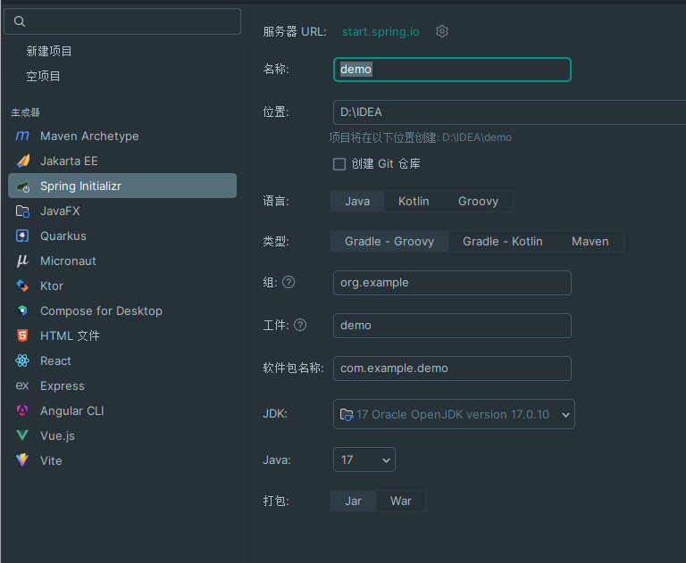
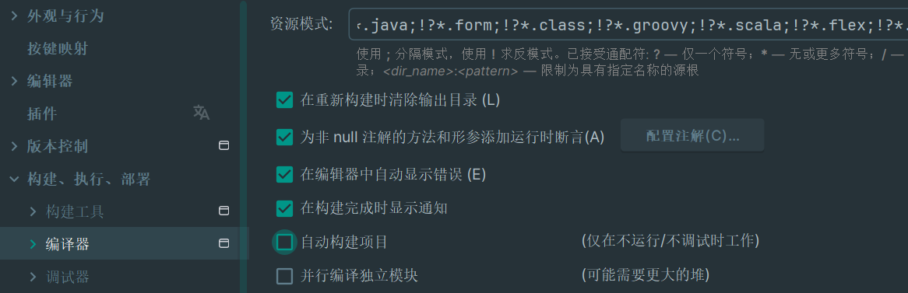
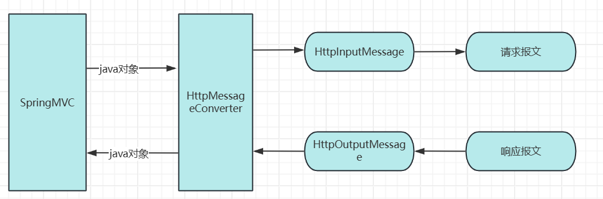

# SpringBoot

[toc]

# 搭建

1. 选择`spring initializr`
2. 输入名称、下一步
3. 选择版本springboot的版本
4. 勾选需要的依赖



## 代码说明

1. 优点
   * 快速构建一个独立的 spring 应用程序
   * 嵌入的 Tomcat 、Jetty 或者 Undertow, 无须部署 WAR 文件；
   * 提供 starter POMs 来简化 Maven 配置和减少版本冲突所带来的问题；
   * 对 spring 和第三方库提供默认配置，也可修改默认值，简化框架配置；
   * 提供生产就绪型功能，如指标、健康检查和夕卜部配置；
   * 无需配置 XML ，无代码生成，开箱即用

2. 自定义SpringApplication

   1. 就是实例化SpringApplication

      ```java
      SpringApplication app = new SpringApplication(SpringInitializrApplication.class);
      app.run(args);
      ```

   2. 更改启动横幅

      * 将启动横幅图片命名为`banner.jpg`、放置在resources文件夹下

   3. 修改端口：在配置文件中`Application.propertios`

      ```properties
      server.port=端口名称
      server.port=8088
      ```

# 配置文件

* SpringBoot 使用一个全局的配置文件核心配置文件，配置文件名在约定的情况下名字是固定的；

* 配置文件的作用：修改 SpringBoot 自动配置的默认值； Springboot在底层都给我们自动配置好；

   * `Application.propertios`

   * `Application.yml`

   * 两种配置文件的格式

   * 在 springboot 框架中， resource 文件夹里可以存放配置的文件有两种： properties 和 yml

      1. `application.properties` 的用法：扁平的 k/v 格式。

         ```properties
         server.port=8088
         server.servlet.context-path=/springboot ##访问路径前置
         ```

      2. `application.yml` 的用法：树型结构。

         ```yaml
         server:
               port: 8088
               servlet:
                       context-path: /tuling
         ```

         两种前者是，而后者是 yml 的，建议使用后者，因为它的可读性更强·可以看到要转换成 YML 我们只需吧 properies 里按。去拆分即可。

1. YAML 语法
   1. k:( 空格 )v: 表示一对键值对（空格必须有）；
   2. yaml文件中有特殊符号用单引号`‘’`进行转义
   3. 以空格的缩进来控制层级关系；只要是左对齐的一列数据，都是同一个层级的
   4. 属性和值也是大小写敏感；支持json写法
   5. **配置文件加载顺序**
      * 如果同时存在不同后缀的文件按照这个顺序加载主配置文件：互补配置：
      * 后一个配置可以覆盖前一个配置
      * 最好是只使用一个配置文件
         1. **命令行参数** (`--spring.config.additional-location` 或 `--spring.profiles.active`)
            - 这些是在运行应用程序时通过命令行传递的参数，具有最高的优先级。
         2. **`java:comp/env` 的JNDI属性**
            - Java Naming and Directory Interface (JNDI) 可以用来在应用服务器环境中查找和访问命名服务和资源。
         3. **`JAVA` 系统的环境属性**
            - 通过 `-Dproperty=value` 形式在Java虚拟机(JVM)启动时设置的系统属性。
         4. **操作系统的环境变量**
            - 操作系统级别的环境变量，如 `SPRING_APPLICATION_JSON` 可以用来传递配置。
         5. **JAR包外部的`application-XXX.properties` 或 `application-XXX.yml` 配置文件**
            - 存在于运行JAR包外部的配置文件，这些文件可以被指定的配置位置覆盖。
         6. **JAR包内部的`application-XXX.properties` 或 `application-XXX.yml` 配置文件**
            - 包含在JAR包内的配置文件，通常位于`/src/main/resources`目录下。
         7. **JAR包外部的`application.properties` 或 `application.yml` 配置文件**
            - 直接位于运行JAR包外部的主配置文件。
         8. **JAR包内部的`application.properties` 或 `application.yml` 配置文件**
            - JAR包内默认的主配置文件。
   6. **Profile 文件的加载**
      * Profile 的意思是配置，对于应用程序来说，不同的环需要不同的配置
      * SpringBoot 框架提供了多 profile 的管理功能，我们可以使用 profile 功能来区分不同环境的配置
   
2. 配置文件值注入
   1. 测试

      ```java
      @SpringBootTest
      class WebappbootApplicationTests {
          @Autowired
          private User user;
          @Test
          void contextLoads() {
              System.out.println(user);
          }
      }
      ```

   2. 配置文件.yml

      ```yaml
      user:
        id: 1
        username: 李苏辛
      ```

   3. 实体

      ```java
      @Component//交给spring进行管理
      //@ConfigurationProperties(prefix = "user")
      public class User {
          @Value("${user.id}")
          private int id;
          @Value("${user.username}")
          private String ussername;
      
          public int getId() {
              return id;
          }
      
          public void setId(int id) {
              this.id = id;
          }
      
          public String getUssername() {
              return ussername;
          }
      
          public void setUssername(String ussername) {
              this.ussername = ussername;
          }
      
          @Override
          public String toString() {
              return "User{" +
                      "id=" + id +
                      ", ussername='" + ussername + '\'' +
                      '}';
          }
      }
      ```

      1. 可以通过`@Value+SPEL`的方式直接绑定springboot配置文件中的值
      2. `@ConfigurationProperties(prefix = "user")`：作用 常用于bean属性和yml配置文件的绑定
      3. prefix：可以指定配置文件中的某一个节点，该节点中的子节点将自动和属性进行绑定

   4. 加入配置文件的提示

      1. 加入依赖`pom.xml`

         ```xml
         <dependency>            
             <groupId>org.springframework.boot</groupId>    
             <artifactId>spring-boot-configuration-processor</artifactId>    
             <scope>true</scope>    
         </dependency>
         <!--会生成META-INF 元数据 用于idea自动提示配置文件-->
         ```

      2. 在idea的设置里面勾选：`processtng`

      3. `@Value`：不支持

3. 配置文件占位符

   1. 可以直接使用`${}`进行本地数据调用

      ```yaml
      user:
        id: 1
        username: 李苏辛
      id: ${user.id}2
      ```

   2. 可以使用`random.`进行随机数产生

      1. `random.value`：随机值
      2. `random.int`：随机int值
      3. `random.long`：
      4. `random.uuid`：
      5. `random.int(2)`：随机产生两位整数
      6. `random.imt[1,10]`：随机产生1到10的随机数

4. 数据校验

   1. 添加pom.xml依赖

      ```xml
      <dependency>
          <groupId>org.springframework.boot</groupId>
          <artifactId>spring-boot-starter-validation</artifactId>    
      </dependency>
      ```

   2. 在实现类上加入注解`@Validated`、属性上使用注解校验数据的注解，如非空`@NotNull`

      ```java
      import jakarta.validation.constraints.NotNull;
      import org.springframework.validation.annotation.Validated;
      
      @Validated
      public class User {
          @NotNull
          private int id;
          @NotNull
          private String username;
      }
      
      ```

   3. 指定外部的配置文件、在实体类上加入

      ```java
      @PropertySource("classpath:配置文件路径")//只能是后缀名为properties的配置文件

5. SpringBoot 自动配置原理

   ==Spring Boot 3 的自动配置原理是基于一系列的设计原则和机制，以减少开发人员在配置 Spring 应用程序时的负担。以下是一些关键概念和步骤，解释了 Spring Boot 如何实现自动配置：==
   
   1. Spring Boot Starter
      * Spring Boot 引入了 Starter 模块的概念，这些模块是预先打包好的依赖集合，用于快速启动常见的应用场景，如 Web 服务、数据库连接、安全等。每个 Starter 包含了场景所需的所有依赖以及相关的自动配置类。
   
   2. 自动配置入口
      * 在应用的启动类上，`@SpringBootApplication` 注解隐式包含了 `@EnableAutoConfiguration`，这指示 Spring Boot 启用自动配置功能。这个注解会触发自动配置类的发现和加载过程。
   
   3. 自动配置类
      * 自动配置类通常位于 `spring-boot-autoconfigure` 模块中，每个类负责一个特定的功能领域。例如，`WebMvcAutoConfiguration` 负责 Web MVC 的配置，`DataSourceAutoConfiguration` 处理数据源的配置。
   
   4. 条件注解
   
      自动配置类使用条件注解来确定它们是否应该被激活。这些注解包括：
   
      * `@ConditionalOnClass`：检查类路径上是否存在特定的类。
      * `@ConditionalOnBean`：检查容器中是否存在特定类型的 Bean。
      * `@ConditionalOnMissingBean`：只有当容器中没有指定类型的 Bean 时才激活配置。
      * `@ConditionalOnProperty`：基于配置属性的存在与否或属性值来决定是否激活。
   
   5. 属性绑定
      * Spring Boot 会自动将配置文件中的属性绑定到相应的 Java 对象中，通常是通过 `@ConfigurationProperties` 注解来完成的。例如，`DataSourceProperties` 可以绑定到 `application.properties` 或 `application.yml` 文件中的 `spring.datasource.*` 属性。
   
   6. 自动配置的加载
      * 在 Spring Boot 应用启动时，自动配置类会被扫描和加载。Spring Boot 使用 `AutoConfigurationImportSelector` 来确定哪些自动配置类应该被添加到 Spring 应用上下文中。
   
   7. 配置优先级和覆盖
      * 自动配置提供了默认的配置，但用户可以随时通过配置文件或代码中的 `@Bean` 方法覆盖这些默认配置。Spring Boot 也支持配置的优先级，更具体的配置会覆盖更通用的配置。
   
   8. 调试自动配置
      * 为了帮助调试和理解哪些自动配置类被激活，Spring Boot 提供了一个调试工具，可以通过在配置文件中设置 `debug=true` 来生成自动配置报告，显示哪些自动配置类已经被激活，哪些没有。
   
   通过这些机制，Spring Boot 能够在启动时分析应用的类路径和配置文件，然后自动添加和配置所需的组件，从而大大减少了配置的工作量，让开发者能够专注于业务逻辑的实现。

Spring Boot 配置文件中可以包含大量配置项，用于调整应用的行为、连接外部系统、配置日志记录、安全管理等等。然而，因为 Spring Boot 是高度模块化的，你实际使用的配置项取决于你引入的应用场景（Starter）和模块。以下是 Spring Boot 中一些常见的配置项示例，按类别整理：

1. 服务器配置 (server)

```properties
server.port=8080
server.address=0.0.0.0
server.tomcat.uri-encoding=UTF-8
server.servlet.context-path=/myapp配置启动项目直接访问地址
```

2. 日志配置 (logging)

```properties
logging.level.root=INFO
logging.level.org.springframework=DEBUG
logging.file.name=myapp.log
logging.pattern.console=%d{yyyy-MM-dd HH:mm:ss.SSS} %clr(%5p) %clr(${PID:- }{magenta}) %clr(---){faint} %clr([%15.15t]){faint} %clr(%-40.40logger{39}){cyan} %clr(:){faint} %m%n${LOG_LEVEL_PATTERN:-%5p} %clr(${PID:- }{magenta}) %date %clr{faint}([%thread]){faint} %logger{36} : %msg%n
```

3. Spring MVC 配置 (spring.mvc)

```properties
spring.mvc.view.prefix=/WEB-INF/views/
spring.mvc.view.suffix=.jsp
```

4. 数据源配置 (spring.datasource)

```properties
spring.datasource.url=jdbc:mysql://localhost:3306/mydb?useSSL=false&serverTimezone=UTC
spring.datasource.username=root
spring.datasource.password=secret
spring.datasource.driver-class-name=com.mysql.cj.jdbc.Driver
```

5. JPA/Hibernate 配置 (spring.jpa)

```properties
spring.jpa.hibernate.ddl-auto=update
spring.jpa.show-sql=true
spring.jpa.properties.hibernate.dialect=org.hibernate.dialect.MySQL5Dialect
```

6. 邮件配置 (spring.mail)

```properties
spring.mail.host=smtp.example.com
spring.mail.username=user
spring.mail.password=password
spring.mail.properties.mail.smtp.auth=true
```

7. 安全配置 (spring.security)

```properties
spring.security.user.name=admin
spring.security.user.password=admin
```

8. 缓存配置 (spring.cache)

```properties
spring.cache.type=redis
```

9. Redis 配置 (spring.redis)

```properties
spring.redis.host=localhost
spring.redis.port=6379
```

10. 消息队列配置 (spring.rabbitmq)

```properties
spring.rabbitmq.host=localhost
spring.rabbitmq.port=5672
spring.rabbitmq.username=guest
spring.rabbitmq.password=guest
```

11. 环境配置 (spring.profiles)

```properties
spring.profiles.active=dev
```

12. Actuator 配置 (management.endpoints)

```properties
management.endpoints.web.exposure.include=*
management.endpoint.health.show-details=always
```

13. Swagger 配置 (springfox)

```properties
springfox.documentation.swagger.v2.path=/api-docs
```

14. AOP 配置 (spring.aop)

```properties
spring.aop.proxy-target-class=true
```

15. Thymeleaf 配置 (spring.thymeleaf)

```properties
spring.thymeleaf.mode=HTML5
spring.thymeleaf.encoding=UTF-8
spring.thymeleaf.content-type=text/html
spring.thymeleaf.cache=false
```

16. Quartz 配置 (spring.quartz)

```properties
spring.quartz.job-store-type=jdbc
```

请注意，上面列出的配置项可能不会全部适用于你的具体应用，因为这取决于你引入的 Starter 和应用的实际需求。此外，Spring Boot 不断更新，新的版本可能会增加或移除某些配置项。你应该参考最新版的 Spring Boot 文档以获取最准确的信息。

如果你需要查看你应用中所有可用的配置属性，可以使用 `--spring.config.show-unsupported=true` 启动选项，或者在应用中添加 `spring-boot-configuration-processor` 依赖并启用配置处理器。但是，最常用的方法是运行应用并访问 `http://localhost:8080/actuator/env`（假设你启用了 Actuator 并且使用默认端口和上下文路径），这将显示应用中所有配置属性的列表和值。

# 热部署与日志

## 热部署

为了进一步提高开发效率， springboot 为我们提供了全局项目热部署，日后在开发过程中修改了部分代码以及相关配置文件后，不需要每次重启使修改生效，在项目中开启了 springb t 全局热部署之后只需要在修改之后等待几秒即可使修改生效。

1. 开启热部署

   1. 引入依赖

      ```xml
      <dependency>
          <groupId>org.springframework.boot</groupId>
          <artifactId>spring-boot-devtools</artifactId>
          <optional>true</optional>
      </dependency>
      ```

   2. 修改idea配置

      ==当我们修改了类文件后， idea 不会自动编译，得修改 idea 设置。==

      * FiIe-Settings-Compiler-Build Project automatically:勾选自动构建项目

         

      * ctrl + shift + alt +/选择 Registry, 勾上 CompiIer aut0Make allow when app running

      * ctrl + shift + alt +/选择 Registry,value值设为0

         
   
      * 勾选：设置一>高级设置一>编译器一>编译器中的一个选项
   
   3. 启动项目测试热部署是否生效
   

## 日志

因为日志框架多而不同，可能会在一个项目内使用多个日志框架就需要使用==日志门面（slf4j）==整合日志，不实现日志功能、使用日志门面中的==桥接器==桥接日志、在使用==适配器==在不需要改变代码的前提下，使项目用同一种日志输出。

1. 导入响应依赖

2. 在项目中使用日志门面进行日志输出

3. 配置不同框架日志输出的配置文件

4. 在pom.xml中添加一种日志到另一种日志的适配器

   案例

   1. 导入依赖

      ```xml
      <!--        log4j日志-->
              <dependency>
                  <groupId>log4j</groupId>
                  <artifactId>log4j</artifactId>
              </dependency>
      <!--        slf4j核心依赖-->
              <dependency>
                  <groupId>org.slf4j</groupId>
                  <artifactId>slf4j-api</artifactId>
              </dependency>
      <!--        slf4j到log4j的桥接器-->
              <dependency>
                  <groupId>org.slf4j</groupId>
                  <artifactId>slf4j-log4j12</artifactId>
              </dependency>
      ```

   2. 编写两个mian方法使用不同的日志框架，但是使用slf4j桥接不同的日志
   
      ```java
      //jul是jdk自带的日志
      import org.apache.commons.logging.Log;
      import org.apache.commons.logging.LogFactory;
      //jul日志加jcl门面
      public class Jcl {
          public static void main(String[] args) {
              Log log = LogFactory.getLog(Jcl.class);
              System.out.println(log.getClass());
              log.info("jcl");
          }
      }
      //log4j
      import org.slf4j.Logger;
      import org.slf4j.LoggerFactory;
      public class Logj {
          public static void main(String[] args) {
              Logger logger = LoggerFactory.getLogger(Logj.class);
              System.out.println(logger.getClass());
              logger.info("log4j==");
          }
      }
   
   3. 导入不同配置文件
   
      ```properties
      # log4j名称：log4j.properties
      # 设置全局日志级别为 INFO
      log4j.rootLogger=trace , ConsoleAppender
      # 控制台日志 Appender 配置
      log4j.appender.ConsoleAppender=org.apache.log4j.ConsoleAppender
      log4j.appender.ConsoleAppender.layout=org.apache.log4j.PatternLayout
      log4j.appender.ConsoleAppender.layout.ConversionPattern=%d{yyyy-MM-dd HH:mm:ss} %-5p %c{1}:%L - %m%n
      
      #jul：commons-logging.properties
      org.apache.commons.logging.log = org.apache.commons.logging.impl.Jdk14Logger
      ```
   
   4. 导入日志适配器依赖，统一日志
   
      ```xml
      <dependency>
          <groupId>org.slf4j</groupId>
          <artifactId>jcl-over-slf4j</artifactId>    
      </dependency>
      ```

### springBoot默认日志(logback)加slf4j

1. 日志级别

   1. 使用logback步骤

      1. 声明日志记录器，在web层写在方法里面

         ```java
         Logger logger = LoggerFactory.getLogger(HelloController.class);//用log4j
         logger.日志级别("123456");
         ```

   2. Spring Boot 支持以下日志级别：

      - **OFF**：关闭日志记录。
      - **ERROR**：记录错误信息，通常表示程序出现了严重的问题。==异常==
      - **WARN** 或 **WARNING**：记录警告信息，表示潜在的问题。==警告==
      - **INFO**：记录一般的信息，用于跟踪应用程序的运行状态。==信息==
      - **DEBUG**：记录详细的调试信息，主要用于开发阶段。==调试==
      - **TRACE**：记录最详细的跟踪信息，通常用于问题排查。==跟踪==

   3. 在配置文件中配置：在 `application.properties` 或 `application.yml` 文件中，你可以使用以下格式来设置日志级别：

      1. **application.properties 示例：**

         ```
         logging.level.org.springframework=INFO
         logging.level.com.yourcompany.yourapp=DEBUG
         ```

      2. **application.yml 示例：**

         ```
         logging:
           level:
             org.springframework: INFO
             com.yourcompany.yourapp: DEBUG
         ```

         这里 `org.springframework` 和 `com.yourcompany.yourapp` 分别是 Spring 框架和你的应用的包名。`INFO` 和 `DEBUG` 是日志级别。

2. 日志格式

   ```properties
   2024-07-19T00:25:21.684+08:00  INFO 3376 --- [webappboot] [nio-8080-exec-1] o.e.w.controller.HelloController         : 123456
   2024-07-19T00:25:21.684+08:00 DEBUG 3376 --- [webappboot] [nio-8080-exec-1] o.e.w.controller.HelloController         : 123456789
   日期时间；毫秒精度，易于排序     日志级别 进程ID              线程名称                    记录日志的类                            日志信息               
   ```

   1. 修改日志格式

      * 在 `application.properties` 文件中修改日志格式，但这通常仅限于控制台输出的格式。要修改文件输出的日志格式，你通常需要使用日志框架特定的配置文件，如 `logback-spring.xml` 对于 Logback。

         然而，对于控制台输出，你可以在 `application.properties` 文件中使用以下配置来修改日志格式：

         ```properties
         logging.pattern.console=%d{yyyy-MM-dd HH:mm:ss.SSS} [%thread] %-5level %logger{36} - %msg%n
         ```

         这里的配置项 `logging.pattern.console` 控制控制台输出的日志格式。`%d`, `%thread`, `%level`, `%logger`, 和 `%msg` 是 Logback 的转换词，它们分别代表日期和时间、线程名、日志级别、日志记录器的名称以及日志消息。

         1. `%clr`和`{faint}`包裹起来的类容设置颜色，而`{设置的颜色}`

      * 修改文件输出的日志格式，你将需要在 `logback-spring.xml` 文件中进行配置，因为在 `application.properties` 中的 `logging.pattern.file` 属性在 Spring Boot 中是不被识别的。因此，对于文件输出的日志格式，你仍然需要在 `logback-spring.xml` 文件中配置 `<encoder>` 的 `<pattern>`。

         例如，在 `logback-spring.xml` 文件中，你可以这样配置文件输出的日志格式：

         ```xml
         <configuration>
              <appender name="STDOUT" class="ch.qos.logback.core.ConsoleAppender">
                 <!-- encoder -->
                 <encoder>
                     <pattern>%d{HH:mm:ss.SSS} [%thread] %-5level %logger{36} - %msg%n</pattern>
                 </encoder>
             </appender>
             
             <appender name="FILE" class="ch.qos.logback.core.rolling.RollingFileAppender">
                 <file>logs/application.log</file>
                 <rollingPolicy class="ch.qos.logback.core.rolling.TimeBasedRollingPolicy">
                     <fileNamePattern>logs/application.%d{yyyy-MM-dd}.log</fileNamePattern>
                     <maxHistory>30</maxHistory>
                 </rollingPolicy>
                 <encoder>
                     <pattern>%date %level [%thread] %logger{10} [%file:%line] %msg%n</pattern>
                 </encoder>
             </appender>
             
             <root level="INFO">
                 <appender-ref ref="STDOUT" />
                 <appender-ref ref="FILE" />
             </root>
         </configuration>
         ```

         这样，你就可以在 `application.properties` 中控制控制台输出的日志格式，而在 `logback-spring.xml` 中控制文件输出的日志格式。如果你需要统一控制台和文件输出的日志格式，你可以在 `logback-spring.xml` 文件中配置，同时在 `application.properties` 中禁用控制台输出或仅使用文件输出。

   2. 设置日志文件输出

      ```properties
      logging.file.name=myapp.log #日志输出名字，可以在前面加上路径
      logging.file.path=日志存放路径 #不可以指定日志名称，必须指定一个物理文件夹的路径，默认使用spring.log文件名
      ```

      * `logging.file.name`:优先加载，没有`logging.file.name`才会加载`logging.file.path`

3. 日志归档

   1. 通过修改`application.properties`或`application.yml`文件来配置日志的归档。Spring Boot默认使用Logback作为日志框架，因此可以利用Logback的配置语法来进行设置。

      ```properties
      logging.file.name=logs/app.log //日志路径加名字
      logging.logback.rollingpolicy.file-name-pattern=logs/app-%d{yyyy-MM-dd}.log
      logging.logback.rollingpolicy.max-history=30  //日志存放时间，单位天
      logging.pattern.console
      logging.file.max-size=50kb   //日志大小
      ```

      * `logging.file.name`: 设置日志文件的基本名称和位置。
      * `logging.logback.rollingpolicy.file-name-pattern`: 指定日志文件的命名模式，其中`%d{yyyy-MM-dd}`表示按照日期格式滚动日志文件。
      * `logging.logback.rollingpolicy.max-history`: 设置要保留的旧日志文件的最大数量，例如上述例子中设置为30，意味着会保留过去30天的日志文件。

4. 自定义日志配置文件

   1. 在resource目录下直接新建logback.xml在里面配置日志相关信息、==使用了logback.xml后application.properties文件中的所有logging都将失效==

   2. 下面是一个相对全面的`logback.xml`配置文件示例，包括了常用的日志输出到控制台和文件、日志滚动策略、日志等级控制等特性。我将为每个主要部分添加注释以便于理解：

      ```xml
      <configuration scan="true" scanPeriod="1 minute" debug="false">
      
          <!-- 定义日志文件的位置和名称 -->
          <property name="LOGS" value="./logs"/>
      
          <!-- 控制台日志输出配置 -->
          <appender name="STDOUT" class="ch.qos.logback.core.ConsoleAppender">
              <encoder>
                  <!-- 日志输出格式 -->
                  <pattern>%d{yyyy-MM-dd HH:mm:ss.SSS} [%thread] %-5level %logger{36} - %msg%n</pattern>
              </encoder>
          </appender>
      
          <!-- 文件日志输出配置 -->
          <appender name="FILE" class="ch.qos.logback.core.rolling.RollingFileAppender">
              <file>${LOGS}/app.log</file>
              <rollingPolicy class="ch.qos.logback.core.rolling.TimeBasedRollingPolicy">
                  <!-- 滚动策略，每天生成一个新的日志文件 -->
                  <fileNamePattern>${LOGS}/app.%d{yyyy-MM-dd}.log</fileNamePattern>
                  <!-- 保留最近30天的日志 -->
                  <maxHistory>30</maxHistory>
              </rollingPolicy>
              <encoder>
                  <!-- 文件日志输出格式 -->
                  <pattern>%d{yyyy-MM-dd HH:mm:ss.SSS} [%thread] %-5level %logger{36} - %msg%n</pattern>
              </encoder>
          </appender>
      
          <!-- 设置根logger的级别 -->
          <root level="INFO">
              <!-- 将日志输出到控制台和文件 -->
              <appender-ref ref="STDOUT"/>
              <appender-ref ref="FILE"/>
          </root>
      
          <!-- 设置特定包下的logger级别 -->
          <logger name="com.example.package" level="DEBUG" additivity="false">
              <appender-ref ref="FILE"/>
          </logger>
      
      </configuration>
      ```

      在这个配置文件中：

      - `<configuration>` 元素设置了扫描配置文件的频率，以及是否开启debug模式。
      - `<property>` 元素用于定义日志文件的基础路径。
      - `<appender>` 元素定义了不同的日志输出目的地，包括控制台和文件。
      - `<encoder>` 元素定义了日志信息的输出格式。
      - `<rollingPolicy>` 子元素配置了日志滚动策略，如基于时间的滚动。
      - `<root>` 元素设置了应用程序的根日志级别，以及它应该使用哪些appender。
      - `<logger>` 元素允许你针对特定的包或类设置日志级别。

      这个`logback.xml`文件应放在Spring Boot项目的`src/main/resources`目录下，或者类路径中其他Spring Boot能够找到的地方。

5. 日志的其他框架切换

   1. logback集成在`starter-web`依赖里面

   2. 需要其他日志框架则添加相应依赖、场景响应器

   3. log4g2

      ```xml
              <dependency>
                  <groupId>org.springframework.boot</groupId>
                  <artifactId>spring-boot-starter-log4j2</artifactId>
              </dependency>
      ```

   4. 排除已有的场景响应器

      1. 鼠标右键、分析、图标、找到场景响应器选中`shift-delete`

      2. 或者在依赖下添加xml

         ```xml
         <dependency>
                     <groupId>org.springframework.boot</groupId>
                     <artifactId>spring-boot-starter-web</artifactId>
                     <exclusions>
                         <exclusion>
                             <artifactId>spring-boot-starter-logging</artifactId>
                             <groupId>org.springframework.boot</groupId>
                         </exclusion>
                     </exclusions>
                 </dependency>
         ```

# Boot与Web

## CURD

1. mvc快速使用
   1. mvc案例
   
      步骤
   
      1. 在service层定义操作，使用注解`@Component`将类添加到spring的bean中
      2. 在controller层也就是web层添加注解`@CrossOrigin`解决跨域、`@RestController`表明该类为mvc控制类，解析处理http请求、`@RequestMapping`定义访问路径、`@Autowired`注入一个spring的bean
         * 访问注解
            * `@GetMapping`：查询、`@PostMapping`：新增、`@PutMapping`：修改、`@DeleteMapping`：删除
            * `@PathVariable`：用于将 URL 路径中的变量映射到方法参数上
            * `@RequestBody`：返回值为JSON对象是在方法的值上加入、以便接收JSON对象
      3. 定义一个返回浏览器的json数据的类`Rserult`：包含返回的响应头、响应信息、数据
      4. 给Rserult类添加get、set方法、构造器
      
      ```java
      package org.example.spring_demo1.controller;
      
      import org.example.spring_demo1.main.Rseult;
      import org.example.spring_demo1.main.Student;
      import org.example.spring_demo1.service.UserService;
      import org.springframework.beans.factory.annotation.Autowired;
      import org.springframework.web.bind.annotation.*;
      
      @RestController
      @RequestMapping("/web")
      @CrossOrigin
      public class HelloController {
      
          @Autowired
          private UserService userService;
      
          //添加
          @PostMapping("/a")
          public Rseult saves(@RequestBody Student student){
              userService.addStudent(student);
              return new Rseult<>(200,"成功1");
          }
          //查询
          @GetMapping("/b/{id}")
          public Rseult savess(@PathVariable Integer id){
              if (id == null) {
                  throw new IllegalArgumentException("ID cannot be null");
              }
              userService.getStudent(id);
              return new Rseult<>(200,"成功2");
          }
          //修改
          @PutMapping("/updates")
          public Rseult updates(@RequestBody Student student){
              userService.updateStudent(student);
              return new Rseult<>(200,"成功3");
          }
          //删除
          @DeleteMapping("/deletess/{id}")
          public Rseult deletess(@PathVariable Integer id){
              userService.deletes(id);
              return new Rseult<>(200,"成功4");
          }
      }
      
      //Rserult类
      package org.example.webappboot.main;
      
      public class Rseult<T> {
          private Integer code;
          private String message;
          private T date;
      
          public Integer getCode() {
              return code;
          }
      
          public void setCode(Integer code) {
              this.code = code;
          }
      
          public String getMessage() {
              return message;
          }
      
          public void setMessage(String message) {
              this.message = message;
          }
      
          public T getDate() {
              return date;
          }
      
          public void setDate(T date) {
              this.date = date;
          }
      
          public Rseult(Integer code, String message, T date) {
              this.code = code;
              this.message = message;
              this.date = date;
          }
          public Rseult(Integer code, String message) {
              this.code = code;
              this.message = message;
          }
      }
      //service类
      package org.example.spring_demo1.service;
      
      import org.example.spring_demo1.main.Student;
      import org.springframework.stereotype.Component;
      
      import java.util.ArrayList;
      import java.util.List;
      import java.util.stream.Collectors;
      
      @Component
      public class UserService {
          private static List<Student> list =new ArrayList<Student>();
      
          static {
              Student student = new Student(1,"张三","123654","1");
              list.add(student);
              Student student1 = new Student(2,"李四","123654","1");
              list.add(student1);
              Student student2 = new Student(3,"王五","123654","1");
              list.add(student2);
          }
          //添加
          public void addStudent(Student student){
              list.add(student);
              for (Student student1 : list) {
                  System.out.println(student1);
              }
          }
          //查询
          public void getStudent(Integer id){
              for (Student student1 : list) {
                  if (student1.getId() == id){
                      System.out.println(student1);
                  }
              }
          }
          //更新
          public void updateStudent(Student student){
              int i = student.getId();//传入的数据为包装类的引用类型，需要强转为基本数据类型
              list.set(i-1, student);
              for (Student student1 : list) {
                  System.out.println(student1);
              }
          }
          //删除
          public void deletes(Integer id){
              int i = id;
              list.remove(i-1);
              for (Student student1 : list) {
                  System.out.println(student1);
              }
          }
      }
      ```

## RestTemplate

微服务、服务与服务之间的调用（resttemplate负责将普通对象转换为json传输出去，将传入的数据转换为json传入的模板类）;resttemplate无法实现负载均衡、因为一个模块的访问地址为死地址，spring cloud 下的feign可以实现。

* 所有的实体类应该在每一个模块上都有，尽量减少模块与模块之间的耦合
* `@RequestBody`以字符串形式输入输出、就是将数据转换为json

1. resttemplate与WebClient的差异

   * webclient 依赖 webflux，webclient 请求远程服务是无阻塞的，响应的。
   * RestTemplate 它是阻塞的，需要等待请求应后才能执行下一句代码（基于springmvc只能使用）

2. 调用（11.30）

   1. 在web层进行进行调用

      * 先声明RestTemplate

      * 当bean 没有无参构造函数时，spring将自动拿到有参的构造函数，参数进行自动注入

         ```java
         private final RestTemplate restTemplate;
         
         public VisitController(RestTemplateBuilder restTemplateBuilder) {
             this.restTemplate = restTemplateBuilder.build();
         }
         ```

   2. 在web层进行操作传入参数
   
      1. 相关方法
   
         | DELETE  | delete                           |
         | ------- | -------------------------------- |
         | GET     | getForObject<br>getForEntity     |
         | HEAD    | headForHeaders                   |
         | OPTIONS | optionsForAllow                  |
         | POST    | postForLocation<br>postForObject |
         | PUT     | put                              |
         | any     | exchange<br>execute              |
   
      2. 方法实例
   
         ```java
         package org.example.spring_demo2.controller;
         
         import com.fasterxml.jackson.core.JsonProcessingException;
         import com.fasterxml.jackson.databind.ObjectMapper;
         import org.example.spring_demo2.main.Rseult;
         import org.example.spring_demo2.main.Student;
         import org.springframework.boot.web.client.RestTemplateBuilder;
         import org.springframework.http.*;
         import org.springframework.web.bind.annotation.CrossOrigin;
         import org.springframework.web.bind.annotation.RequestMapping;
         import org.springframework.web.bind.annotation.RestController;
         import org.springframework.web.client.RestTemplate;
         
         @RequestMapping("/visit")
         @RestController
         @CrossOrigin
         public class VisitController {
             private final RestTemplate restTemplate;
         
             public VisitController(RestTemplateBuilder restTemplateBuilder) {
                 this.restTemplate = restTemplateBuilder.build();
             }
         
             //添加
             @RequestMapping("/add")
             public String add() throws JsonProcessingException {
                 Student student = new Student(4,"哈哈","654321","2");
                 HttpHeaders headers = new HttpHeaders();
                 headers.setContentType(MediaType.APPLICATION_JSON);
                 HttpEntity<Student> requestEntity = new HttpEntity<>(student, headers);
                 ResponseEntity<Rseult> rseultResponseEntity = restTemplate.postForEntity("http://localhost:8080/web/a", requestEntity, Rseult.class);
                 System.out.println(rseultResponseEntity.toString());
                 return rseultResponseEntity.getBody().toString();
             }
         
             //查询
             @RequestMapping("/seletes")
             public String seletes(){
                 Rseult forObject = restTemplate.getForObject("http://localhost:8080/web/b/{id}", Rseult.class, 1);
                 System.out.println(forObject.toString());
                 return forObject.toString();
             }
         
             //更新
             @RequestMapping("/updates")
             public String updates() throws JsonProcessingException {
                 Student student = new Student(4, "呵呵", "654321", "2");
                 HttpHeaders headers = new HttpHeaders();
                 headers.setContentType(MediaType.APPLICATION_JSON);
                 ObjectMapper mapper = new ObjectMapper();
                 String jsonStudent = mapper.writeValueAsString(student);
                 HttpEntity<String> requestEntity = new HttpEntity<>(jsonStudent, headers);
                 //restTemplate.put("http://localhost:8080/web/updates",requestEntity,Rseult.class);//没有返回值
                 ResponseEntity<Rseult> exchange = restTemplate.exchange("http://localhost:8080/web/updates", HttpMethod.PUT, requestEntity, Rseult.class);
                 return exchange.toString();
         
             }
             //删除
             @RequestMapping("/deletes")
             public String deletes(){
                 //restTemplate.delete("http://localhost:8080/web/deletess/",4,Rseult.class);//没有返回值
                 ResponseEntity<Rseult> exchange = restTemplate.exchange("http://localhost:8080/web/deletess/{id}", HttpMethod.DELETE, null, Rseult.class, 1);
                 return exchange.toString();
             }
         }
         ```
   
      3. RestTemplateBuilder用于的实例
   
         1. `RestTemplateBuilder` 可以帮助您创建一个或多个 `RestTemplate` 实例，并允许您在创建过程中进行各种配置。以下是一些您可以使用 `RestTemplateBuilder` 进行的配置示例：
   
            1. **设置连接和读取超时**：
               ```java
               RestTemplate restTemplate = new RestTemplateBuilder()
                   .setConnectTimeout(Duration.ofMillis(1000)) // 连接超时时间
                   .setReadTimeout(Duration.ofMillis(2000)) // 读取超时时间
                   .build();
               ```
   
            2. **添加消息转换器**：
               ```java
               RestTemplate restTemplate = new RestTemplateBuilder()
                   .additionalMessageConverters(Arrays.asList(new StringHttpMessageConverter(Charset.forName("UTF-8"))))
                   .build();
               ```
   
            3. **添加拦截器**：
               ```java
               RestTemplate restTemplate = new RestTemplateBuilder()
                   .interceptors((request, body, execution) -> {
                       request.getHeaders().add("X-Custom-Header", "CustomHeaderValue");
                       return execution.execute(request, body);
                   })
                   .build();
               ```
   
            4. **设置错误处理**：
               ```java
               RestTemplate restTemplate = new RestTemplateBuilder()
                   .errorHandler(new DefaultResponseErrorHandler())
                   .build();
               ```
   
            5. **使用自定义的 `HttpClient`**：
               ```java
               RestTemplate restTemplate = new RestTemplateBuilder()
                   .rootUri("http://example.com")
                   .httpClient(new HttpClientBuilder().build())
                   .build();
               ```
   
            6. **设置 SSL 配置**：
               ```java
               RestTemplate restTemplate = new RestTemplateBuilder()
                   .sslContext(SSLContext.getDefault())
                   .sslSocketFactory(new SSLSocketFactory())
                   .sslHostnameVerifier(new NoopHostnameVerifier())
                   .build();
               ```
   
            7. **使用代理服务器**：
               ```java
               RestTemplate restTemplate = new RestTemplateBuilder()
                   .proxy(new HttpComponentsClientHttpRequestFactory().getProxySelector())
                   .build();
               ```
   
            8. **使用自定义的 `ClientHttpRequestFactory`**：
               ```java
               RestTemplate restTemplate = new RestTemplateBuilder()
                   .requestFactory(() -> new HttpComponentsClientHttpRequestFactory())
                   .build();
               ```
   
            9. **设置根 URI**：
               ```java
               RestTemplate restTemplate = new RestTemplateBuilder()
                   .rootUri("http://api.example.com/v1/")
                   .build();
               ```
   
            这些只是 `RestTemplateBuilder` 提供的一些配置选项。您可以在创建 `RestTemplate` 实例时根据需要选择性地应用这些配置项。如果您有多个不同的服务需要与之交互，并且每个服务可能需要不同的配置（例如不同的超时时间或者消息转换器），那么使用 `RestTemplateBuilder` 来创建多个配置不同的 `RestTemplate` 实例是非常有用的。
   
   3. postman
   
      1. Postman设置中文的方法
      2. 下载和安装中文语言包
         1. **访问GitHub仓库**：首先，您需要访问GitHub上的==Postman中文语言包==仓库。
         2. **下载语言包**：找到适合您Postman版本的语言包，下载并将其保存在电脑上。
         3. **解压语言包**：下载完成后，解压下载的文件，您会看到一个名为`zh_CN`的文件夹。
      3. 应用语言包
         1. **打开Postman**：启动Postman应用程序。
         2. **备份旧的语言文件**：为了防止出现问题，建议先备份Postman安装目录下的`app`文件夹。对于Windows用户，这个路径通常是`C:\Users\<用户名>\AppData\Local\Postman\app-<版本号>\resources\app`；对于Mac用户，路径则是`/Applications/Postman.app/Contents/Resources/app` 。
         3. **覆盖原有文件**：将您刚刚解压的`zh_CN`文件夹复制到Postman的应用资源目录下，替换原有的`app`文件夹。这一步可能会提示您是否确认替换，选择确认即可。
         4. **重启Postman**：完成覆盖后，关闭并重新启动Postman应用程序。
      4. 设置禁止自动更新
         1. **删除更新文件**：在Postman的根目录下，找到一个名为`Update.exe` 的文件，并将其删除。这样可以防止Postman在后台自动更新回英文版本。
         2. **修改hosts文件**：为了阻止Postman连接到更新服务器，您需要修改系统的hosts文件。在Windows中，路径是`C:\Windows\System32\drivers\etc\hosts`；在Mac中，路径是`/private/etc/hosts`。使用文本编辑器打开hosts文件，在文件的末尾添加一行： `0.0.0.0 dl.pstmn.io` 。这行代码可以阻止Postman连接到更新服务器。
      5. 验证设置
         1. **查看界面**：现在，您应该可以看到Postman的界面已经是中文显示了。
         2. **检查更新设置**：在Postman的设置中，检查更新的选项是否被设置为禁用。如果是，那么您的设置就成功了。

## 通过MockMvc测试接口

MockMvc 是由 spring-test 包提供，实现了对 Http 请求的模拟，能够直接使用网络的形式，转换到 Controller 的调用，使得测试速度快、不依赖网络环境。同时提供了一套验证的工具，结果的验证十分方便。

**SpringBoot中使用**

编写测试类。实例化 MockMvc 有两种形式，一种是使用 StandaloneMockMvcBuiIder, 另外一种是使用 DefauItMockMvcBuildero

1. 测试类及初始化 MockMvc 初始化：

   1. 注解

      * `@SpringBootTest`：spring提供的用于测试的注解

      * `@AutoConfigureMockMvc`：用于做模拟mvc的，由spring-test提供,依赖junit5,无这个注解需要自己构建McokMvc类

      * `@Test`：junit5的测试

      * `alt+enter`选择注入语言引用、选择json；再次`alt+enter`编辑json数据，可以打开json编辑器。

         ```java
         package org.example.spring_demo1.test;
         
         import org.junit.jupiter.api.Test;
         import org.springframework.beans.factory.annotation.Autowired;
         import org.springframework.boot.test.autoconfigure.web.servlet.AutoConfigureMockMvc;
         import org.springframework.boot.test.context.SpringBootTest;
         import org.springframework.http.MediaType;
         import org.springframework.test.web.servlet.MockMvc;
         import org.springframework.test.web.servlet.request.MockMvcRequestBuilders;
         import org.springframework.test.web.servlet.result.MockMvcResultHandlers;
         import org.springframework.test.web.servlet.result.MockMvcResultMatchers;
         
         @SpringBootTest//spring提供的用于测试的注解
         @AutoConfigureMockMvc//用于做模拟mvc的，由spring-test提供,依赖junit5,无这个注解需要自己构建McokMvc类
         public class MockMvcTest {
             //注入MockMvc
             @Autowired
             MockMvc mockMvc;
         
             @Test//junit5的测试
             public void testMockMvc() throws Exception {//GET
                 //发起一个模拟请求，不依赖网络，不依赖网络服务，不需要启动 web 应用
                 mockMvc.perform(
                         MockMvcRequestBuilders.get("/web/b/{id}",1)//发送了一个git请求，MockMvcRequestBuilders，这个类下面有所有的请求方式、请求路径一定要写全
                                 .accept(MediaType.APPLICATION_JSON)//设置响应的文本类型
                 ).andExpect(MockMvcResultMatchers.status().isOk())//设置断言状态，就是设置返回状态码，这里是200
                         .andDo(MockMvcResultHandlers.print());//对响应的返回值进行处理
             }
             
             @Test
             public void testMockMvcPost() throws Exception {//POST
                 String jsonTest = "{\n" +
                         "  \"id\":4,\n" +
                         "  \"username\":\"七七\",\n" +
                         "  \"password\":\"123654\",\n" +
                         "  \"classg\":\"2\"\n" +
                         "}";
                 mockMvc.perform(
                                 MockMvcRequestBuilders.post("/web/a" )
                                         .accept(MediaType.APPLICATION_JSON)
                                         .contentType(MediaType.APPLICATION_JSON)//设置请求的文本类型
                                         .content(jsonTest)//设置传入的数据
                         ).andExpect(MockMvcResultMatchers.status().isOk())
                         .andDo(MockMvcResultHandlers.print());
             }
         }
         ```

## 通过swagger调用

Swagger是一个用于生成、描述和调用RESTful接口的Web服务框架。它主要的作用是将项目中的所有接口展现在页面上，方便后端程序员和其他开发者进行接口的调用和测试。通过几个注解返回一个接口页面

1. 添加依赖

   ```xml
   <dependency><!--只需要第一个依赖就可以了-->
       <groupId>org.springdoc</groupId>    
       <artifactId>springdoc-openapi-starter-webmvc-ui</artifactId>    
       <version>2.2.0</version>    
   </dependency>
   <!-- 其他依赖项 -->
   <dependency>
       <groupId>jakarta.servlet</groupId>    
       <artifactId>jakarta.servlet-api</artifactId>    
       <version>6.0.0</version>    
       <scope>provided</scope>    
   </dependency>
   ```

2. 添加配置文件`application.yml`

   ```yaml
   springdoc:
     swagger-ui:
       path: /swagger-ui.html
       tags-sorter: alpha
       operations-sorter: alpha
     packages-to-scan: org.example.spring_demo1.controller
     api-docs:
       enabled: true
   ```

3. 编写配置类

   ```java
   import io.swagger.v3.oas.models.OpenAPI;
   import io.swagger.v3.oas.models.info.Info;
   import org.springdoc.core.models.GroupedOpenApi;
   import org.springframework.context.annotation.Bean;
   import org.springframework.context.annotation.Configuration;
   //关于Swagger的配置类
   @Configuration//标记为配置类
   public class SpringRestApi {
       @Bean//分组
       public GroupedOpenApi publicApi() {//需要的接口目录进行
           return GroupedOpenApi.builder()
                   .group("api")
                   .pathsToMatch("/**") // 可以根据需要调整路径
                   .build();
       }
       @Bean
       public OpenAPI springShopOpenAPI() {//项目信息
           return new OpenAPI()
                   .info(new Info().title("My API")
                           .description("My application description")
                           .version("1.0"));
       }
   }
   ```

4. 在启动类上添加注解`@OpenAPIDefinition`

5. **访问 Swagger UI**一旦应用程序启动，您可以通过访问以下 URL 来打开 Swagger UI 页面：

   - **Swagger UI**: `http://localhost:8080/swagger-ui.html`
   - **ReDoc UI**: `http://localhost:8080/redoc-ui.html`

6. 所有注解

   * OpenAPI 注解
      1. **`@Tag`**
         - 用于给一组相关的 API 接口添加标签，方便在文档中组织和分类。
         - 示例：`@Tag(name = "Users", description = "Operations about users")`
      2. **`@Operation`**
         - 用于描述特定 HTTP 操作的元数据，如 GET, POST, PUT, DELETE 等。
         - 示例：`@Operation(summary = "Get user by ID", description = "Returns a single user")`
      3. **`@Parameter`**
         - 用于描述请求参数的元数据。
         - 示例：`@Parameter(name = "id", description = "User ID", required = true)`
      4. **`@RequestBody`**
         - 用于描述请求体的内容。
         - 示例：`@RequestBody(description = "User details") User user`
      5. **`@ApiResponse`**
         - 用于描述响应的状态码和可能返回的数据类型。
         - 示例：`@ApiResponse(responseCode = "200", description = "Successful operation", content = @Content(mediaType = "application/json"))`
      6. **`@ApiResponses`**
         - 用于描述多个可能的响应状态码。
         - 示例：`@ApiResponses(value = { @ApiResponse(responseCode = "200", description = "Success"), @ApiResponse(responseCode = "404", description = "Not Found") })`
      7. **`@Schema`**
         - 用于描述数据模型或对象的结构。
         - 示例：`@Schema(description = "User object")`
   * Springdoc 特有的注解
      1. **`@ApiIgnore`**
         - 用于排除某个类或方法不被文档化。
         - 示例：`@ApiIgnore`
      2. **`@ApiImplicitParams`**
         - 用于描述一组隐式参数。
         - 示例：`@ApiImplicitParams({ @ApiImplicitParam(name = "page", value = "Page number") })`
      3. **`@ApiImplicitParam`**
         - 用于描述单个隐式参数。
         - 示例：`@ApiImplicitParam(name = "page", value = "Page number")`
      4. **`@ApiSecurity`**
         - 用于描述安全要求。
         - 示例：`@ApiSecurity(value = "JWT")`
      5. **`@ApiModel`**
         - 用于描述模型类的结构。
         - 示例：`@ApiModel(description = "User model")`
      6. **`@ApiModelProperty`**
         - 用于描述模型属性的元数据。
         - 示例：`@ApiModelProperty(value = "First name of the user") private String firstName;`
   * 配置类注解
      1. `@Bean`
         - 用于声明 Spring Bean。在 Springdoc 的配置类中，您可能会使用 `@Bean` 来配置 Swagger UI 的定制项，如 `GroupedOpenApi`。
         - 示例：`@Bean public GroupedOpenApi publicApi() { ... }`

## SpringBoot与AOP

1. AOP 的作用及其优势(面向切面编程)
   * 作用：在程序运行期间，在不修改源码的情况下对方法进行功能强
   * 优势：减少重复代码，提高开发效率，并且便于维护

**在springboot中使用步骤**

1. 添加场景启动器

   ```xml
   <dependency>
       <groupId>org.springframework.boot</groupId>
       <artifactId>spring-boot-starter-aop</artifactId>
   </dependency>
   ```

2. 添加切面类

就可以直接使用aop了

### mvc自动配置

1. 原理

   spring Boot 为 spring MVC 提供了自动配置，可与大多数应用程序完美配合

   自动配置在 Spring 的默认值之上添加了以下功能

   * 包含 `ContentNegotiatingViewResolver` 和`BeanNameViewResolver`

      * 内置视图解析器：所有视图解析器，都会根据返回的视图名称进行解析视图

   * 支持提供静态资源，包括对 WebJars 的支持。

      * `webjars`：将前端资源（如 JavaScript 和 CSS 文件）打包成 JAR 包的工具。这些 JAR 包可以在 Maven 中央仓库中找到，并通过 Maven 或 Gradle 等构建工具进行依赖管理。WebJars 的目标是简化前端资源的管理和使用，确保所有项目中使用的前端资源都有统一的版本控制，从而避免版本冲突问题。

      * webjars 官网： `https://www.webiars.orq/`

      * 当访问 /webjars/** 时就会去 classpath :/META-I N F/resources/webjars/ 对应进行映射

      * 在静态资源目录下面的index.html页面会自动成为首页显示

      * 通过配置文件指定具体的静态资源地址：

         ```properties
         spring.web.resources.static-locations=classpath:/静态地址目录/
         ```

   * 自动注册 `Converter`，`GenericConverter`和`Formatter` Bean 类。

      * 自定义类型转换器（前端传输过来的是文本，后端转换为日期，等等其他格式）

   * 支持`HttpMessageConverters`。

      * 负责http请求和响应的报文处理，就是将json转换为对象，对象转换为json

         

   * 自动注册`MessageCodesResolver`。

      * 修改 4xx 错误下格式换转换出错类型转换出错的错误代码

   * 静态`index.html`支持。

      * 在 springboot 中可以直接返回 html 的视图

      * 因为在`WebMvcAutoConfiguration`自动置类配置

         ```properties
         spring.mvc.view.prefix=前缀
         spring.mvc.view.suffix=后缀
         ```

   * 自动使用 `configurableWebBindingInitializerbean`。

      * 将对应的传输进来的数据转换为JavaBean

2. 自定义视图解析器

   Spring Boot 3 并不是一个已经发布的版本，截至我最后更新的知识（2023年初），Spring Boot的最新稳定版本是2.x系列。不过，我们可以假设你是指在最新的Spring Boot 2.x版本中配置视图解析器，并且这个过程对于未来的版本也应该类似。

   在 Spring Boot 中配置视图解析器通常是为了支持Web应用中的模板引擎，如Thymeleaf、FreeMarker等。这里以Thymeleaf为例来说明如何配置视图解析器。

   1. 添加依赖

      首先确保你的项目中添加了 Thymeleaf 的依赖。如果你使用的是Maven，可以在 `pom.xml` 文件中添加如下依赖：

      ```xml
      <dependency>
          <groupId>org.springframework.boot</groupId>
          <artifactId>spring-boot-starter-thymeleaf</artifactId>
      </dependency>
      ```

      如果使用 Gradle，则在 `build.gradle` 文件中添加：

      ```properties
      implementation 'org.springframework.boot:spring-boot-starter-thymeleaf'
      ```

   2. 配置 Thymeleaf

      Spring Boot 默认会自动配置 Thymeleaf，但你可以通过修改 `application.properties` 或 `application.yml` 文件来自定义配置。例如，如果你想更改视图的前缀和后缀，可以添加以下配置：

      ```yaml
      # application.yml
      spring:
        thymeleaf:
          prefix: classpath:/templates/
          suffix: .html
      ```

      或者在 `application.properties` 文件中：

      ```properties
      spring.thymeleaf.prefix=classpath:/templates/
      spring.thymeleaf.suffix=.html
      ```

      这些配置指定了模板文件的位置。默认情况下，Spring Boot 期望 HTML 文件位于 `src/main/resources/templates/` 目录下。

   3. 使用视图

      在控制器中，你可以通过返回一个字符串来指定视图名称。Spring Boot 会自动根据视图解析器的配置来查找对应的模板文件。

      ```java
      @GetMapping("/hello")
      public String hello(Model model) {
          model.addAttribute("name", "World");
          return "hello"; // This will look for a template file named hello.html in the configured location.
      }
      ```

      在这个例子中，Spring Boot 将寻找名为 `hello.html` 的模板文件。

   4. 自定义视图解析器

      如果你需要进一步自定义视图解析器的行为，可以通过实现 `WebMvcConfigurer` 接口来配置：

      ```java
      @Configuration
      public class WebConfig implements WebMvcConfigurer {
      
          @Override
          public void configureViewResolvers(ViewResolverRegistry registry) {
              ThymeleafViewResolver resolver = new ThymeleafViewResolver();
              resolver.setTemplateEngine(templateEngine());
              registry.viewResolver(resolver);
          }
      
          @Bean
          public TemplateEngine templateEngine() {
              ThymeleafTemplateEngine engine = new ThymeleafTemplateEngine();
              engine.setTemplateResolver(templateResolver());
              return engine;
          }
      
          @Bean
          public ITemplateResolver templateResolver() {
              ClassLoaderTemplateResolver resolver = new ClassLoaderTemplateResolver();
              resolver.setPrefix("/templates/");
              resolver.setSuffix(".html");
              resolver.setTemplateMode(TemplateMode.HTML);
              resolver.setCharacterEncoding("UTF-8");
              resolver.setCacheable(false); // Set to false if you want to disable caching, true otherwise.
              return resolver;
          }
      }
      ```

      这段代码创建了一个自定义的 `ThymeleafViewResolver` 和相关组件来处理视图解析。


### 定制springMVC的自动配置

1. 定制`ViewController`

   1. 首先，您需要创建一个配置类，该类将使用 `@Configuration` 注解来指示这是一个配置类，并使用 `@EnableAutoConfiguration` 或 `@SpringBootApplication` 来启用自动配置功能。
   2. 接下来，您可以使用 `@ConditionalOnClass` 和 `@ConditionalOnMissingBean` 等注解来控制自动配置类的行为。这些注解可以帮助您决定何时激活配置。
   3. 如果您想根据应用程序的属性或表达式来控制自动配置类的激活，可以使用 `@ConditionalOnProperty` 或 `@ConditionalOnExpression`。
   4. 如果您希望在配置类中导入其他的配置类，可以使用 `@Import` 注解。
      * ==在大多情兄 SpringBoot 在自动配置中标记了很多`@ConditionalOnMissingBean(xxxxxxx.class)`（意思就是如果容器中没有，当前的@Bean才会生效）只需要在自配置类中配置对应的`@Bean`就可以覆盖默认的自动配置；也就是在自己的配置类中的返回值返回的什么类型，就覆盖掉自动配置类中的该类型==

2. 定制`configurePathMatch`

   1. **创建自定义 `PathMatcher`**：

      * 由于 `setUseRegisteredSuffixPatternMatch` 方法已被移除，您需要自己实现 `PathMatcher` 接口或继承 `AntPathMatcher` 类，并根据需要重写方法来实现自定义的路径匹配逻辑

         ```java
         import org.springframework.util.PathMatcher;
         
         public class CustomPathMatcher extends AntPathMatcher {
         
             public CustomPathMatcher() {
                 super();
                 // 设置自定义的路径匹配行为
                 setCaseSensitive(false); // 设置路径匹配不区分大小写
                 setUseTrailingSlashMatch(true); // 允许尾随斜杠匹配
             }
         
             // 如果需要重写父类的方法，可以在这里实现
         }
         ```

   2. 配置 `WebMvcConfigurer`：

      * 在您的配置类中实现 `WebMvcConfigurer` 接口，并覆盖 `configurePathMatch` 方法来设置自定义的 `PathMatcher`。

         ```java
         import org.springframework.context.annotation.Configuration;
         import org.springframework.web.servlet.config.annotation.WebMvcConfigurer;
         import org.springframework.web.util.PathMatcher;
         import org.springframework.web.servlet.config.annotation.PathMatchConfigurer;
         
         @Configuration
         public class WebConfig implements WebMvcConfigurer {
         
             @Override
             public void configurePathMatch(PathMatchConfigurer configurer) {
                 // 设置自定义的 PathMatcher
                 configurer.setPathMatcher(new CustomPathMatcher());
             }
         }
         ```

         

3. 定制拦截器`Interceptor`

   1. 创建自定义拦截器：首先，您需要创建一个实现了 `HandlerInterceptor` 接口的类。这个类将包含三个主要的方法：`preHandle`、`postHandle` 和 `afterCompletion`。

      ```java
      import org.springframework.web.servlet.HandlerInterceptor;
      import org.springframework.web.servlet.ModelAndView;
      
      public class CustomInterceptor implements HandlerInterceptor {
      
          @Override
          public boolean preHandle(HttpServletRequest request, HttpServletResponse response, Object handler) throws Exception {
              // 在请求处理之前执行的操作
              System.out.println("Pre-handle: " + request.getRequestURI());
              return true; // 返回 true 表示继续处理请求；返回 false 表示停止处理请求
          }
      
          @Override
          public void postHandle(HttpServletRequest request, HttpServletResponse response, Object handler, ModelAndView modelAndView) throws Exception {
              // 请求处理之后执行的操作，但在视图渲染之前
              System.out.println("Post-handle: " + request.getRequestURI());
          }
      
          @Override
          public void afterCompletion(HttpServletRequest request, HttpServletResponse response, Object handler, Exception ex) throws Exception {
              // 请求完成之后执行的操作
              System.out.println("After completion: " + request.getRequestURI());
          }
      }
      ```

   2. 配置拦截器：接下来，您需要配置拦截器。在 Spring Boot 3 中，您可以使用 `WebMvcConfigurer` 接口来配置拦截器。

      ```java
      import org.springframework.context.annotation.Configuration;
      import org.springframework.web.servlet.config.annotation.InterceptorRegistry;
      import org.springframework.web.servlet.config.annotation.WebMvcConfigurer;
      
      @Configuration
      public class WebConfig implements WebMvcConfigurer {
      
          @Override
          public void addInterceptors(InterceptorRegistry registry) {
              // 添加自定义的拦截器
              registry.addInterceptor(new CustomInterceptor())//拦截器类
                  .addPathPatterns("/example/**") // 指定拦截哪些路径
                  .excludePathPatterns("");//排除那些不拦截
          }
      }
      ```

   3. 说明

      - `addInterceptors(InterceptorRegistry registry)` 方法用于添加拦截器。
      - `addInterceptor(new CustomInterceptor())` 用于添加自定义的拦截器实例。
      - `addPathPatterns("/example/**")` 用于指定哪些路径会被此拦截器拦截。您可以根据需要添加多个路径模式。

4. 定制`addViewControllers`

   * `addViewControllers` 方法用于简化视图控制器的配置。这个方法允许您快速地将 URL 映射到特定的视图，而不需要显式地创建控制器类。这在您只需要将请求映射到静态视图页面时非常有用。

   * 使用 `addViewControllers` 方法，您需要实现 `WebMvcConfigurer` 接口，并覆盖 `addViewControllers` 方法。以下是一个简单的示例：

      ```java
      import org.springframework.context.annotation.Configuration;
      import org.springframework.web.servlet.config.annotation.ViewControllerRegistry;
      import org.springframework.web.servlet.config.annotation.WebMvcConfigurer;
      
      @Configuration
      public class WebConfig implements WebMvcConfigurer {
      
          @Override
          public void addViewControllers(ViewControllerRegistry registry) {
              // 映射 URL 到视图
              registry.addViewController("/").setViewName("index");
              registry.addViewController("/home").setViewName("home");
              registry.addViewController("/about").setViewName("about");
          }
      }
      ```

   * 说明

      - `addViewController` 方法用于添加视图控制器映射。
      - 第一个参数是 URL 路径。
      - `setViewName` 方法用于设置对应的视图名称。

   * 示例解释

      1. 当访问根路径 `/` 时，将显示名为 `index` 的视图。
      2. 当访问 `/home` 时，将显示名为 `home` 的视图。
      3. 当访问 `/about` 时，将显示名为 `about` 的视图。

5. 定制CORS配置

   addCors：跨域映射全局跨域

   `@CrossOrigin`：对单个方法或者Controller进行跨域请求：`@CrossOrigin(可以在这里加入允许那些来源具有跨域权限)`

   1. 全局跨域请求映射

      ```java
      @Override
      public void addCorsMappings(CorsRegistry registry) {
          registry.addMapping("/**")//映射服务器中那些http接口运行跨域访问    
              .allowedOrigins("")//配置那些来源有权跨域
              .allowedMethods();//运行跨域的方法
      }
      ```

6. 定制`WebMvcConfigurer`原理

   * 实现 `WebMvcConfigurer` 接口可以扩现，又既保留SpringBoot的自动配置

      1. 在WebMvcAut0Configuration 也有一 个实现了 WebMvcConfigurer的配置类
      2. WebMvcAutoConfigurationAdapter 它也是利用这种方式去进行扩展，所以我们通过查看这个类我们发现它帮我们实现了其他不常用的方法，帮助我们进行自动配置．我们只需定制（拦截器、视图控制器、Cors、在开发中需要额外定制的功能）

      ```java
         @Configuration(proxyBeanMethods = false)
          @Import({EnableWebMvcConfiguration.class})
          @EnableConfigurationProperties({WebMvcProperties.class, WebProperties.class})
          @Order(0)
          public static class WebMvcAutoConfigurationAdapter implements WebMvcConfigurer, ServletContextAware {
      ```

   * 导入`EnableWebMvcConfiguration`

      ```java
      @Import({EnableWebMvcConfiguration.class})
      ```

   * `EnableWebMvcConfiguration` 它的父类上 `setConfigurers` 使用`@Autowired`

      1. 它会去容器中将所有实现了 WebMvcConfigur 接囗的 Bean 都自注入进来，添加到 configurers 变量中

      ```java
      public class DelegatingWebMvcConfiguration extends WebMvcConfigurationSupport {
          private final WebMvcConfigurerComposite configurers = new WebMvcConfigurerComposite();
      
          @Autowired(required = false)
          public void setConfigurers(List<WebMvcConfigurer> configurers) {
              if (!CollectionUtils.isEmpty(configurers)) {
                  this.configurers.addWebMvcConfigurers(configurers);
              }
          }
      ```

   * 添加到delegates委派器中

      ```java
      public void addWebMvcConfigurers(List<WebMvcConfigurer> configurers) {
              if (!CollectionUtils.isEmpty(configurers)) {
                  this.delegates.addAll(configurers);
              }
          }
      ```

   * 底层调用 WebMvcConfigurer 对应的方法时，就是去拿到之前注入到`delegates`的`WebMvcConfigurer`依次调用

      ```java
      public void addInterceptors(InterceptorRegistry registry) {
              Iterator var2 = this.delegates.iterator();
      
              while(var2.hasNext()) {
                  WebMvcConfigurer delegate = (WebMvcConfigurer)var2.next();
                  delegate.addInterceptors(registry);
              }
          }
      ```

   * 当添加了`@EnableWebMvc` 就不会使用 SpringMVC 自动配置类的默认配置，默认配置就失效了

      * 原理：在`@EnableWebMvc` 中`@Import(DelegatingwebMvcConfiguration.eass)`

         ```java
         @Retention(RetentionPolicy.RUNTIME)
         @Target({ElementType.TYPE})
         @Documented
         @Import({DelegatingWebMvcConfiguration.class})
         public @interface EnableWebMvc {
         }
         ```

      * 在 DelegatingWebMvcConfiguration中继承了

         ```java
         @Configuration(proxyBeanMethods = false)
         public class DelegatingWebMvcConfiguration extends WebMvcConfigurationSupport {
         ```

      * 在 `WebMvcAutoConfiguration` 中`@ConditionalOnMissingBean({WebMvcConfigurationSupport.class})`

         * 当容器中不存在 `WebMvcConfiguraoonSupport` 这个 Bean 的时候当前配置类才会生效

         * 正因为通过`@EnableWebMvc`导入`DelegatingWebMvcConfiguration extends WebMvcConfigurationSupport` 从而才使得自动配置类失效

            ```java
            @AutoConfiguration(after = {DispatcherServletAutoConfiguration.class, TaskExecutionAutoConfiguration.class,ValidationAutoConfiguration.class})
            @ConditionalOnWebApplication(type = Type.SERVLET)
            @ConditionalOnClass({Servlet.class, DispatcherServlet.class, WebMvcConfigurer.class})
            @ConditionalOnMissingBean({WebMvcConfigurationSupport.class})
            @AutoConfigureOrder(-2147483638)
            @ImportRuntimeHints({WebResourcesRuntimeHints.class})
            public class WebMvcAutoConfiguration {
            ```

### 定制JSON

1. 定制JSON

   Spring Boot 提供了与三个 JSON 映射库的集成：

   * Gson
   * Jackson :性能最好，是springboot默认使用的Json库
   * JSON-B

   **Jackson使用**

   1. 在POJO对象类的属性上加`@JsonIgnore`，表示该属性不进行json转换
   2. 在属性上加`@JsonFormat(pattern = "格式")`表示当前属性按照当前注解上的格式进行格式化
      * 日期格式化
   3. `@JsonInclude(JsonInclude.Include.NON_NULL)`当前属性不为空就进行json转换，为空则不进行序列化
   4. `@JsonProperty(别名)`设置当前属性名的别名

   **更具自己的需求进行序列化和反序列化**

   1. 当自定义序列化和反序列化注解就失效了

   2. Spring Boot 还提供了 `JsonObjectSerializer(序列化)` 和 `JsonObjectDeserializer（反序列化）`基类，这些基类在序列化对象时为标准 Jackson 版本提供了有用的替代方案。

      ```java
      @JsonComponent
      public class JsonStudent {
          //序列化
          public static class Serializer extends JsonObjectSerializer<Student> {
              @Override
              protected void serializeObject(Student value, JsonGenerator jgen, SerializerProvider provider) throws IOException {
                  jgen.writeObject("属性名","属性值");
              }
          }
          //反序列化
          public static class Deserializer extends JsonObjectDeserializer<Student> {
      
              @Override
              protected Student deserializeObject(JsonParser jsonParser, DeserializationContext context, ObjectCodec codec, JsonNode tree) throws IOException {
                  Student student = new Student();
                  student.setId((tree.findValue("").asInt()));
                  return student;
              }
          }
      }
      ```

2. JSON国际化

   1. 步骤

      1. 添加国际化资源文件
      2. 配置 messageResource 设置国际化资源文件
      3. 需要去解析情求头中的 accept-language 或者 解析url参数中的`?locale=`
      4. 将本地语言进行缓存
      5. 通过messageResource 获取国际化信息

   2. 实现

      1. 在resources新建静态资源

         1. 新建在`src/main/resources/自命名`目录下创建JSON文件或者`.properties`文件，例如：

            - `messages_en.json`或`messages_en_US.properties`: 英语版JSON文件
            - `messages_zh.json`或`messages_zh_CN.properties`: 中文版JSON文件
            - `messages.properties`：这三个文件必须都存在

            

         2. 在Springboot的自动配置类中提供了`messageResourceAutoConfiguration`所以，不需要再去配置`messageResource`

            ```java
            @AutoConfiguration
            //如果自己配置 了@Bean 名名字叫 `messageSource` 的 bean 就会用自定义的
            @ConditionalOnMissingBean(
                name = {"messageSource"},
                search = SearchStrategy.CURRENT
            )
            @AutoConfigureOrder(Integer.MIN_VALUE)
            //@Conditional 自定又条件匹配 会传入一个实现了 Condition 接口的一个类 ResourceBundleCondition
            //ResourceBundleConditiont 会重写 matches.如果该方法返回为 true 就匹配成功
            @Conditional({ResourceBundleCondition.class})
            @EnableConfigurationProperties
            @ImportRuntimeHints({MessageSourceRuntimeHints.class})
            public class MessageSourceAutoConfiguration {
            ```

            1. 在配置文件中配置、或者将资源文件放在`messages`文件夹下

               ```properties
               spring.messages.basename=json.messages
               ```

               ```properties
               spring.messages.basename=messages #此配置指定了资源文件的基础名称
               spring.messages.encoding=UTF-8 #此配置指定了资源文件的字符编码方式。
               spring.messages.fallbackToSystemLocale=true #此配置项控制当找不到与请求的Locale匹配的资源文件时，是否回退到系统的默认Locale。
               ```

         3. 解析

            1. **spring.mvc.locale-resolution**:

               - **含义**：此配置项用于指定如何解析用户的`Locale`信息。
               - **示例**：你可以设置`spring.mvc.locale-resolution=cookie`来使用Cookie来存储用户的语言偏好。

            2. **spring.mvc.default-locale**:

               - **含义**：此配置项用于指定应用的默认`Locale`。
               - **示例**：你可以设置`spring.mvc.default-locale=en_US`来设置默认语言为美式英语。

               ```properties
               spring.mvc.locale-resolution=cookie
               spring.mvc.default-locale=en_US  #设置死语言
               ```

               * 只有当`Accept-Language为null`时才会使用配置文件中的`spring.mvc.default-locale`

            3. 使用请求头中的accept-language来设置语言，`messageResource`获取国际化信息

               ```java
               @Autowired
               private MessageSource messageSource;
               
               @GetMapping("/b/{id}")    
               public Rseult savess(@PathVariable Integer id) throws JsonProcessingException {
                   String message = messageSource.getMessage("student.getmapping.message", null, LocaleContextHolder.getLocale());
                   //LocaleContextHolder.getLocale()获取请求头的kocale的信息
                   List s = userService.getStudent(id);
                       return new Rseult<>(200,message,s);    
               }
               ```

         4. 不适使用请求头携带的accept-language，使用自定义传参的方式进行设置国际化

            1. 自定义一个Bean，在配置类中

               ```java
               @Bean
                   public LocaleResolver localeResolver(){
                       //new一个CookieLocaleResolver
                       CookieLocaleResolver cookieLocaleResolver = new CookieLocaleResolver("Locale");
                       return cookieLocaleResolver;
                   }
               ```

            2. 添加拦截器，获取请求中的信息，需要先自定义一个拦截器在配置拦截器`WebMvcConfigurer`

               ```java
               @Configuration
               public class JsonConfigInterceptors implements WebMvcConfigurer {
                   @Override
                   public void addInterceptors(InterceptorRegistry registry) {
                       registry.addInterceptor(new CustomInterceptor())
                               .addPathPatterns("/**");
                       registry.addInterceptor(new LocaleChangeInterceptor())//配置访问的Locale
                               .addPathPatterns("/**");
                   }
               }
               ```

            3. 使用`messageResource`获取国际化信息

               ```java
               @Autowired
               private MessageSource messageSource;
               
               @GetMapping("/b/{id}")    
               public Rseult savess(@PathVariable Integer id) throws JsonProcessingException {
                   String message = messageSource.getMessage("student.getmapping.message", null, LocaleContextHolder.getLocale());
                   //LocaleContextHolder.getLocale()获取请求头的kocale的信息
                   List s = userService.getStudent(id);
                       return new Rseult<>(200,message,s);    
               }
               ```

               

3. JSON异常处理

   1. 原理

      

   2. html

      * 在static目录下新建error文件夹，里面放对应响应头，`Status`为名的`.html`、例`404.html`文件，当访问出现异常就会直接返回对应错误代码的页面。
      *  `server.error.include-stacktrace` 用于 Spring Boot 应用程序中控制当发生异常时错误详情的显示程度。
         1. **`never`**：当设置为 `never` 时，无论在什么环境下，错误响应都不会包含堆栈跟踪信息。
         2. **`on_error`**：当设置为 `on_error` 时，只有当应用程序运行在非生产环境（即 `spring.profiles.active` 不包含 `production`）时，错误响应才会包含堆栈跟踪信息。
         3. **`always`**：当设置为 `always` 时，无论在什么环境下，错误响应都将包含堆栈跟踪信息。

   3. AJAX

      * 新建通义异常处理类，只能有一个全局异常处理类
   
      * 基于springboot自动配置的异常处理

         ```java
         /**
          * 自定义错误控制器，用于处理 HTTP 错误。
          * 此类扩展了 Spring Boot 的 AbstractErrorController，用于自定义错误处理逻辑。
          */
         @Controller
         @RequestMapping("${server.error.path:${error.path:/error}}")
         @EnableConfigurationProperties(ServerProperties.class)
         public class QJYCchuli extends AbstractErrorController {
         
             /**
              * 构造函数。
              *
              * @param errorAttributes 错误属性服务，提供关于错误的信息。
              * @param errorViewResolvers 错误视图解析器列表，用于渲染错误页面。
              */
             public QJYCchuli(ErrorAttributes errorAttributes, List<ErrorViewResolver> errorViewResolvers) {
                 super(errorAttributes, errorViewResolvers);
             }
         
             /**
              * 处理浏览器异常。
              * 当用户在浏览器中访问发生错误的 URL 时，此方法将被调用。
              *
              * @param request  HTTP 请求。
              * @param response HTTP 响应。
              * @return ModelAndView 对象，包含视图名称和模型数据。
              */
             @RequestMapping(produces = "text/html")
             public ModelAndView errorHtml(HttpServletRequest request, HttpServletResponse response) {
                 // 获取 HTTP 错误状态
                 HttpStatus status = this.getStatus(request);
         
                 // 获取错误属性，即关于错误的详细信息
                 Map<String, Object> model = Collections.unmodifiableMap(this.getErrorAttributes(request, getErrorAttributeOptions()));
         
                 // 设置 HTTP 响应的状态码
                 response.setStatus(status.value());
         
                 // 尝试解析错误视图
                 ModelAndView modelAndView = this.resolveErrorView(request, response, status, model);
         
                 // 如果视图解析成功，则返回解析的结果；否则，创建一个新的 ModelAndView 并使用 "error" 视图
                 return modelAndView != null ? modelAndView : new ModelAndView("error", model);
             }
         
             /**
              * 处理 AJAX 异常。
              * 当 AJAX 请求发生错误时，此方法将被调用。
              *
              * @param request HTTP 请求。
              * @return 自定义错误结果对象，通常用于非 HTML 请求（如 JSON/XML）。
              */
             @RequestMapping
             @ResponseBody
             public Rseult error(HttpServletRequest request) {
                 // 获取 HTTP 错误状态
                 HttpStatus status = this.getStatus(request);
         
                 // 如果状态是 NO_CONTENT，则直接返回一个简单的 No Content 消息
                 if (status == HttpStatus.NO_CONTENT) {
                     return new Rseult(204, "No Content");
                 }
         
                 // 获取错误属性，即关于错误的详细信息
                 Map<String, Object> body = this.getErrorAttributes(request, getErrorAttributeOptions());
         
                 // 从错误属性中获取状态码
                 String code = getErrorCode(body);
         
                 // 从错误属性中获取错误消息
                 String message = getErrorMessage(body);
         
                 // 返回一个自定义的错误结果对象
                 return new Rseult(Integer.parseInt(code), message);
             }
         
             /**
              * 获取错误属性选项。
              * 这些选项定义了哪些错误属性应该被包括在返回给客户端的数据中。
              *
              * @return 错误属性选项。
              */
             private ErrorAttributeOptions getErrorAttributeOptions() {
                 // 定义要包括的错误属性选项
                 ErrorAttributeOptions options = ErrorAttributeOptions.of(
                         ErrorAttributeOptions.Include.EXCEPTION, // 包括异常信息
                         ErrorAttributeOptions.Include.STACK_TRACE, // 包括堆栈跟踪
                         ErrorAttributeOptions.Include.MESSAGE, // 包括错误消息
                         ErrorAttributeOptions.Include.BINDING_ERRORS // 包括绑定错误
                 );
         
                 // 返回配置好的错误属性选项
                 return options;
             }
         
             /**
              * 获取状态码，如果为 null 则提供默认值。
              *
              * @param body 错误属性映射，其中包含了关于错误的各种信息。
              * @return 状态码字符串。
              */
             private String getErrorCode(Map<String, Object> body) {
                 // 尝试从错误属性映射中获取 "status" 键对应的值
                 Object codeObj = body.get("status");
         
                 // 如果找到了 "status" 键对应的值，则返回其字符串表示形式
                 if (codeObj != null) {
                     return codeObj.toString();
                 }
         
                 // 如果 "status" 键对应的值为 null，则返回默认状态码 500 的字符串表示形式
                 return Integer.toString(HttpStatus.INTERNAL_SERVER_ERROR.value());
             }
         
             /**
              * 获取错误消息，如果为 null 则提供默认值。
              *
              * @param body 错误属性映射，其中包含了关于错误的各种信息。
              * @return 错误消息字符串。
              */
             private String getErrorMessage(Map<String, Object> body) {
                 // 尝试从错误属性映射中获取 "message" 键对应的值
                 Object messageObj = body.get("message");
         
                 // 如果找到了 "message" 键对应的值，则返回其字符串表示形式
                 if (messageObj != null) {
                     return messageObj.toString();
                 }
         
                 // 如果 "message" 键对应的值为 null，则返回默认错误消息
                 return "An error occurred.";
             }
         }
         ```
      
      * 基于`@ControllerAdvice`的全局异常处理
      
         ```java
         //异常类、
         // 定义一个自定义异常类，继承自 RuntimeException
         public class CustomException extends RuntimeException {
         
             // 定义一个错误代码字段
             private final String errorCode;
         
             // 构造函数接收一个错误消息和错误代码
             public CustomException(String message, String errorCode) {
                 super(message);  // 将错误消息传递给父类构造函数
                 this.errorCode = errorCode;  // 设置错误代码
             }
         
             // 获取错误代码的方法
             public String getErrorCode() {
                 return errorCode;
             }
         }
         ```
         
         ```java
         //全局异常处理类
         import org.springframework.http.HttpStatus;
         import org.springframework.http.ResponseEntity;
         import org.springframework.web.bind.annotation.ControllerAdvice;
         import org.springframework.web.bind.annotation.ExceptionHandler;
         import org.springframework.web.bind.annotation.ResponseBody;
         import org.springframework.web.bind.annotation.ResponseStatus;
         
         // 使用 @ControllerAdvice 注解标记这是一个全局异常处理器
         @ControllerAdvice
         public class GlobalExceptionHandler {
         
             // 处理 CustomException 异常
             @ExceptionHandler(CustomException.class)
             @ResponseBody  // 表示方法的返回结果直接写入HTTP响应体
             @ResponseStatus(HttpStatus.BAD_REQUEST)  // 设置HTTP响应状态码为400 Bad Request
             public ResponseEntity<String> handleCustomException(CustomException ex) {
                 // 返回一个包含错误信息的JSON对象
                 return ResponseEntity.status(HttpStatus.BAD_REQUEST)
                                      .body("{\"error\": \"" + ex.getErrorCode() + "\", \"message\": \"" + ex.getMessage() + "\"}");
             }
         
             // 处理所有未捕获的其他异常
             @ExceptionHandler(Exception.class)
             @ResponseBody  // 表示方法的返回结果直接写入HTTP响应体
             @ResponseStatus(HttpStatus.INTERNAL_SERVER_ERROR)  // 设置HTTP响应状态码为500 Internal Server Error
             public ResponseEntity<String> handleAllUncaughtExceptions(Exception ex) {
                 // 返回一个通用的错误信息
                 return ResponseEntity.status(HttpStatus.INTERNAL_SERVER_ERROR)
                                      .body("{\"error\": \"500\", \"message\": \"Internal Server Error\"}");
             }
         }
         ```
         
      * 使用 `@ControllerAdvice` 注解实现全局异常处理的例子。这种处理方式可以让你在一个地方集中处理所有控制器中的异常，使得代码更加整洁并且易于维护。
      
         首先，我们需要创建一个全局异常处理器类。在这个类中，我们将定义如何处理不同类型的异常。这里我们使用 `@ExceptionHandler` 注解来指定每个方法处理哪种类型的异常，并且使用 `@ResponseStatus` 来设置 HTTP 响应状态码。
         
         假设你已经有了一个自定义的响应类 `Rseult`，我们可以这样定义全局异常处理器：
         
         ```java
         package org.example.spring_demo1.config;
         
         import jakarta.servlet.http.HttpServletRequest;
         import org.example.spring_demo1.main.Rseult;
         import org.springframework.http.HttpStatus;
         import org.springframework.http.ResponseEntity;
         import org.springframework.web.bind.annotation.ControllerAdvice;
         import org.springframework.web.bind.annotation.ExceptionHandler;
         import org.springframework.web.bind.annotation.ResponseStatus;
         import org.springframework.web.bind.annotation.RestControllerAdvice;
         
         /**
          * 全局异常处理器，用于统一处理应用中的各种异常。
          */
         @ControllerAdvice
         @RestControllerAdvice
         public class GlobalExceptionHandler {
         
             /**
              * 处理 ArithmeticException 异常。
              * 当除数为零时，会抛出此类异常。
              *
              * @param ex 异常对象
              * @param request HTTP 请求对象
              * @return 自定义的错误响应
              */
             @ExceptionHandler(ArithmeticException.class)
             @ResponseStatus(HttpStatus.BAD_REQUEST)
             public ResponseEntity<Rseult> handleArithmeticException(ArithmeticException ex, HttpServletRequest request) {
                 // 日志记录
                 System.err.println("ArithmeticException caught: " + ex.getMessage());
                 
                 // 创建自定义的错误响应
                 Rseult result = new Rseult(400, "Arithmetic Exception: " + ex.getMessage());
                 
                 // 返回错误响应
                 return new ResponseEntity<>(result, HttpStatus.BAD_REQUEST);
             }
         
             /**
              * 处理 IllegalArgumentException 异常。
              * 当非法参数传递到方法中时，会抛出此类异常。
              *
              * @param ex 异常对象
              * @param request HTTP 请求对象
              * @return 自定义的错误响应
              */
             @ExceptionHandler(IllegalArgumentException.class)
             @ResponseStatus(HttpStatus.BAD_REQUEST)
             public ResponseEntity<Rseult> handleIllegalArgumentException(IllegalArgumentException ex, HttpServletRequest request) {
                 // 日志记录
                 System.err.println("IllegalArgumentException caught: " + ex.getMessage());
                 
                 // 创建自定义的错误响应
                 Rseult result = new Rseult(400, "Illegal Argument Exception: " + ex.getMessage());
                 
                 // 返回错误响应
                 return new ResponseEntity<>(result, HttpStatus.BAD_REQUEST);
             }
             
             /**
              * 处理所有未被捕获的异常。
              * 
              * @param ex 异常对象
              * @param request HTTP 请求对象
              * @return 自定义的错误响应
              */
             @ExceptionHandler(Exception.class)
             @ResponseStatus(HttpStatus.INTERNAL_SERVER_ERROR)
             public ResponseEntity<Rseult> handleException(Exception ex, HttpServletRequest request) {
                 // 日志记录
                 System.err.println("Exception caught: " + ex.getMessage());
                 
                 // 创建自定义的错误响应
                 Rseult result = new Rseult(500, "Internal Server Error: " + ex.getMessage());
                 
                 // 返回错误响应
                 return new ResponseEntity<>(result, HttpStatus.INTERNAL_SERVER_ERROR);
             }
         }
         ```
         
         说明
         
         - **`@ControllerAdvice`**: 标记该类为全局异常处理器。
         - **`@RestControllerAdvice`**: 结合了 `@ControllerAdvice` 和 `@ResponseBody`，用于处理 REST 控制器中的异常。
         - **`@ExceptionHandler`**: 指定该方法用于处理特定类型的异常。
         - **`@ResponseStatus`**: 设置 HTTP 响应状态码。
         - **`ResponseEntity`**: 用于构建 HTTP 响应实体，包括状态码、头部信息和响应体。
         
         如何使用
         
         1. 将上面的代码保存为 `GlobalExceptionHandler.java` 文件。
         2. 确保它位于正确的包路径下，通常是与你的控制器位于同一个包或者子包中。
         3. 运行你的应用并触发会导致异常的操作，看看全局异常处理器是否正确工作。
         
         如果你有任何具体的需求或者想要了解更多的细节，请随时告诉我。

### 嵌入servlet容器

==Spring Boot 包含对嵌入式 Tomcat ， Jetty 和 Undertow 服务器的支持。大多数开发人员使用适当的“启动器"来获取完全配置的实例。默认情况下，嵌入式服务器在port上侦听HTTP请求`8080` 。==

#### 嵌入式servlet容器配置修改

1. 内置的默认servlet容器就是tomcat

   1. 可以通过 server.xxx 来进行 web 服务配置，没有带服务器名称的则是通用配置
   2. 通过带了具体的服务器名称则是单独对该服务器进行设置，比如 server.tomcat.xxx 就是专门针对 tomcat 的配置

2. ==嵌入式Tomcat服务器的配置通常涉及对Tomcat本身及其与Spring Boot框架集成时的一些细节进行调整。==

3. 在Spring Boot项目中，嵌入式Tomcat服务器的配置通常是通过`application.properties`或`application.yml`文件来进行的。

   **使用** `application.properties`

   在`src/main/resources/application.properties`文件中添加如下配置：

   ```properties
   # 修改Tomcat端口
   server.port=8081
   
   # 设置Tomcat的最大线程数
   server.tomcat.max-threads=200
   
   # 设置Tomcat的连接超时时间（毫秒）
   server.connection-timeout=20000
   
   # 设置Tomcat的上下文路径,访问服务器时作为前缀
   server.servlet.context-path=/myapp
   
   # 禁用Tomcat的管理控制台
   server.tomcat.manager.enabled=false
   
   # 设置Tomcat的会话超时时间（分钟）
   server.session.timeout=30
   
   # 其他Tomcat特定的配置
   # 这个配置项指定了一个请求头的名字，用于获取客户端的真实IP地址。
   # 当应用程序位于代理服务器后面时，代理服务器可能会在请求头中添加这个字段。
   # 如果请求中包含这个字段，则使用该字段的值作为客户端的IP地址。
   server.tomcat.remote-ip-header=x-forwarded-for
   
   # 这个配置项指定了一个请求头的名字，用于获取客户端请求的协议类型（HTTP 或 HTTPS）。
   # 当应用程序位于代理服务器后面时，代理服务器可能会在请求头中添加这个字段。
   # 如果请求中包含这个字段，则使用该字段的值来确定请求的协议类型。
   server.tomcat.protocol-header=x-forwarded-proto
   
   # 这个配置项指定了一个值，用于确定当protocol-header字段的值为该值时，
   # 应用程序应该认为请求是通过HTTPS发送的。
   # 这在处理负载均衡器或代理服务器转发的请求时很有用。
   server.tomcat.protocol-header-https-value=https
   
   # 这个配置项指定了一个正则表达式，用于匹配内部代理服务器的IP地址。
   # 如果请求的remote-ip-header字段的值与这个正则表达式匹配，则该IP被视为内部代理的地址，
   # 而不是客户端的真实IP地址。
   # 这个配置项可以帮助应用程序正确识别客户端的真实IP地址。
   server.tomcat.internal-proxies=10\.\d{1,3}\.\d{1,3}\.\d{1,3}|192\.168\.\d{1,3}\.\d{1,3}|169\.254\.\d{1,3}\.\d{1,3}|127\.\d{1,3}\.\d{1,3}\.\d{1,3}
   ```

   **使用** `application.yml`

   在`src/main/resources/application.yml`文件中添加如下配置：

   ```yaml
   server:
     port: 8081
     tomcat:
       max-threads: 200
       connection-timeout: 20000
     servlet:
       context-path: /myapp
     session:
       timeout: 30
     tomcat:
       manager:
         enabled: false
       remote-ip-header: x-forwarded-for
       protocol-header: x-forwarded-proto
       protocol-header-https-value: https
       internal-proxies: 10\.\d{1,3}\.\d{1,3}\.\d{1,3}|192\.168\.\d{1,3}\.\d{1,3}|169\.254\.\d{1,3}\.\d{1,3}|127\.\d{1,3}\.\d{1,3}\.\d{1,3}
   ```

   **动态配置**

   除了使用配置文件外，您还可以通过编程的方式动态配置Tomcat，这通常是在Spring Boot的`@Configuration`类中完成的。例如：

   ```java
   /**
    * 配置嵌入式Tomcat服务器。
    */
   @Configuration
   public class TomcatConfig {
   
       /**
        * 创建并配置嵌入式Tomcat服务器工厂。
        *
        * @return 返回配置好的ConfigurableServletWebServerFactory实例。
        */
       @Bean
       public ConfigurableServletWebServerFactory servletContainer() {
           // 创建TomcatServletWebServerFactory实例
           TomcatServletWebServerFactory factory = new TomcatServletWebServerFactory();
   
           // 设置Tomcat连接器的最大线程数
           factory.setMaxThreads(200);
   
           // 设置连接超时时间（毫秒）
           factory.setConnectionTimeout(20000L);
   
           // 返回配置好的工厂实例
           return factory;
       }
   }
   ```

#### 注册servlet三大组件（监听器、过滤器/拦截器）

在springboot的启动类上加上注解`@ServletComponentScan`才会servlet的注解类

1. servlet：Servlet 提供了一种标准的、基于 Java 的方法来处理 HTTP 请求和生成动态 Web 内容

   * 注解方式

      1. 新建servlet类，加注解`@webservlet`

      2. 继承httpservlet类

      3. 实现方法

         ```java
         public class D0Getdopost extends HttpServlet {
             @Override
             protected void doGet(HttpServletRequest req, HttpServletResponse resp) throws ServletException, IOException {
                 super.doGet(req, resp);
             }
         
             @Override
             protected void doPost(HttpServletRequest req, HttpServletResponse resp) throws ServletException, IOException {
                 super.doPost(req, resp);
             }
         }
         ```

   * springboot提供的注册

      1. 新建配置类

      2. 注册一个servlet声明的Bean

      3. 将已经创建好的servlet类传入当前Bean

      4. 方法返回值`ServletRegistrationBean`

         ```java
         @Configuration
         public class servlrtBeanConfig {
             @Bean
             public ServletRegistrationBean MyServlet(){
                 ServletRegistrationBean<Servlet> bean = new ServletRegistrationBean<>();
                 bean.setServlet(new ServletServlet());
                 return bean;
             }
         }
         ```

1. listener：监听器（监听机制）

   * 注解方式
      1. 新建servlet类，加注解`@weblistener`
      2. 实现接口`ServletContextListener`
      3. 实现接口中的方法
         * `contextInitialized(ServletContextEvent sce)`：servletcontext：对象被销毁之前会调用该方法 
         * `contextDestroyed(ServletContextEvent sce)`：servletcontext：对象创建后会调用该方法
   * springboot提供的注册
      1. 新建配置类
      2. 注册一个listener声明的Bean
      3. 将已经创建好的listener类传入当前Bean
      4. 方法返回值`ServletListenerRegistrationBean`

1. filter：过滤器

   * 注解方式
      1. 新建servlet类，加注解`@webfilter`
      2. 实现接口`Filter`
      3. 复写方法

         1. 在方法`doFilter`中写`filterChain.doFilter(servletRequest,servletResponse);`为放行
         2. **init(FilterConfig config)**：该方法在过滤器实例被创建后立即调用，用于进行初始化操作。`FilterConfig` 对象提供了访问过滤器配置信息的方法。
         3. **doFilter(ServletRequest request, ServletResponse response, FilterChain chain)**：这是过滤器的主要业务逻辑所在，每当一个请求匹配到该过滤器时，就会调用此方法。参数 `chain` 代表了过滤器链中的下一个过滤器，你可以选择调用 `chain.doFilter(request, response)` 来将请求传递给下一个过滤器或目标资源。
         4. **destroy()**：当过滤器实例不再需要时，容器会调用这个方法释放过滤器所占用的资源
   * springboot提供的注册
      1. 新建配置类
      2. 注册一个filer声明的Bean
      3. 将已经创建好的filter类传入当前Bean
      4. 方法返回值`FilterRegistrationBean`

#### 切换其他嵌入式Servlet容器

Spring Boot 包含对嵌入式 Tomcat ， Jetty 和 lJndertow 服务器的支持

* tomcat （默认）

* Jetty(socket)

* Undertow（响应式）

   1. 移除tomcat

   2. 添加其他容器依赖

      ```xml
      <dependency>            
          <groupId>org.springframework.boot</groupId>    
          <artifactId>spring-boot-starter-web</artifactId>    
          <!--移除依赖-->    
          <exclusions>    
              <exclusion>        
                  <groupId>org.springframework.boot</groupId>           
                  <artifactId>spring-boot-starter-tomcat</artifactId>            
              </exclusion>        
          </exclusions>    
      </dependency>
      <!--添加依赖-->
      <dependency>
          <groupId>org.springframework.boot</groupId>    
          <artifactId>spring-boot-starter-jetty</artifactId>    
      </dependency>
      ```

#### 嵌入式Servlet容器自动配置原理

1. 为什么可以根据配置的依赖自动使用对应的 servlet 容器？

   ```java
   public class ServletWebServerFactoryAutoConfiguration {
   ```

   1. 通过`@Import`导入`Enbeddedxxx`

      ```java
      @Import({BeanPostProcessorsRegistrar.class, 
               ServletWebServerFactoryConfiguration.EmbeddedTomcat.class, 
               ServletWebServerFactoryConfiguration.EmbeddedJetty.class, 
               ServletWebServerFactoryConfiguration.EmbeddedUndertow.class})
      public class ServletWebServerFactoryAutoConfiguration {
      ```

   2. 每个`Enbeddedxxx`中都配置了相应的`@ConditionalOnClass`会根据当前servlet容器start依赖判断classpath 是否存在对应的类，如果存在就使用对应的servlet容器。比如`EmbeddedTomcat`

      ```java
      @Configuration(proxyBeanMethods = false)
      //只要添加了 tomcat 的场景启动器 则改注解才会生效
      @ConditionalOnClass({Servlet.class, Tomcat.class, UpgradeProtocol.class})
      @ConditionalOnMissingBean(value = {ServletWebServerFactory.class},search = SearchStrategy.CURRENT   )
      static class EmbeddedTomcat {
      ```

   3. 如果没有对应的tomcat场景启动器该注解就不会生效

      ```java
      @ConditionalOnClass({Servlet.class, Tomcat.class, UpgradeProtocol.class})
      ```

2. 嵌入式 servlet 容器是怎么启动的

   1. 自动配的中根据不同的依赖，启动对应一个`Enbeddedxxx` ，然后配置一个对应的 servlet 容器工厂类，比如 tomcat：`TomcatServletWebServerFactory`
   2. 在 springBoott 应用启动的时候，就会调用容器 refresh 方法， onRefresh 调用 getWebServer. 创建 servlet 及启动

#### 使用外部Servlet容器

1. 需要安装外部的servlet容器

   步骤

   1. 下载外部servlet容器

   2. 打包方式，对项目进行打包

      1. 打包是不对当前项目正在使用的servlet容器进行打包

      2. pom.xml中

         ```xml
           <dependency>
             <groupId>org.springframework.boot</groupId>    
             <artifactId>spring-boot-starter-tomcat</artifactId>   
             <scope>provided</scope>tomcat不参与项目打包  
         </dependency>
         ```

   3. 在boot项目中创建一个类

      ```
      //tomcat 启动时就会调用 configure 方法，从而在 springboot 启动的基础上启动 springboot
      public class TomactStattSpringBoot extends SpringBootServletInitializer {
          @Override
          protected SpringApplicationBuilder configure(SpringApplicationBuilder builder) {
              return builder.sources(SpringDemo1Application.class);//启动类
          }
      }
      ```

## 使用Freemarker

FreeMarker 是一个用于生成输出文本的模板引擎,类似与jsp

1. 使用

   添加相应的场景启动器就可以使用

   ```xml
   <dependency>
               <groupId>org.springframework.boot</groupId>
               <artifactId>spring-boot-starter-freemarker</artifactId>
           </dependency>
   ```

2. 设置全局配置依赖之后直接在HTML页面中使用FreeMarker的语法，但是要放在静态资源目录下

   ```properties
   # 开启Freemarker模板缓存
   spring.freemarker.cache=true
   # 设置模板文件的字符编码
   spring.freemarker.charset=UTF-8
   # 设置模板输出的内容类型
   spring.freemarker.content-type=text/html
   # 将HttpServletRequest中的所有属性暴露给Freemarker模板
   spring.freemarker.expose-request-attributes=true
   # 将HttpSession中的所有属性暴露给Freemarker模板
   spring.freemarker.expose-session-attributes=true
   # 启用Spring宏助手功能，允许在模板中使用如 @{...} 之类的语法
   spring.freemarker.expose-spring-macro-helpers=true
   # 指定Freemarker模板的加载路径，此处表示模板文件位于类路径下的 /templates/ 目录中
   spring.freemarker.template-loader-path=classpath:/templates/
   ```

# boot 集成mybatis

## 整合Druid

操作步骤

1. 编辑启动器

2. 勾选JDBC、数据库驱动、mybatis

3. 添加数据源DBCP、C3PO、BoneCP、Druid

   ```xml
   <!--druid连接池-->
   <dependency>
       <groupId>com.alibaba</groupId>
       <artifactId>druid</artifactId>
       <version>1.2.3</version>
   </dependency>
   <!--启动器-->
   <dependency>
       <groupId>com.alibaba</groupId>
       <artifactId>druid-spring-boot-starter</artifactId>
       <version>1.2.20</version> <!-- 确保使用最新的版本 -->    
   </dependency>
   <!--boot3的启动器-->
   <dependency>
       <groupId>com.alibaba</groupId>
       <artifactId>druid-spring-boot-3-starter</artifactId>
       <version>1.2.20</version>
   </dependency>
   ```

4. 编辑配置文件

   ```yaml
   spring:
     ## 数据库
     datasource:
       username: root # 数据库用户名
       password: 219798 # 数据库密码
       url: jdbc:mysql://localhost:3306/school # 数据库连接URL（请补全具体的数据库名称）
       driver-class-name: com.mysql.cj.jdbc.Driver # 配置MySQL的JDBC驱动类
       type: com.alibaba.druid.pool.DruidDataSource # 指定数据源类型为Druid
   
       # 数据源其他配置
       druid:
         initial-size: 5 # 初始创建的连接数
         min-idle: 5 # 最小空闲连接数
         max-active: 20 # 最大活动连接数
         max-wait: 60000 # 获取连接的最大等待时间，单位为毫秒
         time-between-eviction-runs-millis: 60000 # 两次连接空闲检查之间的时间间隔，单位为毫秒
         min-evictable-idle-time-millis: 300000 # 连接在池中可空闲的最大时间，超过该时间的连接将被回收，单位为毫秒
         test-while-idle: true # 在连接空闲时进行验证
         test-on-borrow: false # 在获取连接时进行验证
         test-on-return: false # 在归还连接时进行验证
         pool-prepared-statements: true # 是否缓存PreparedStatement，默认为false
         max-pool-prepared-statement-per-connection-size: 20 # 每个连接缓存PreparedStatement的最大数量
         filters: stat,wall # 配置监控统计拦截的filters，去掉后监控界面sql无法统计；`wall`用于防火墙
         use-global-data-source-stat: true # 启用全局的数据源统计功能
         connection-properties: druid.stat.mergeSql=true;druid.stat.slowSqlMillis=500 # 配置合并SQL和慢SQL的阈值（单位为毫秒）
      ## 初始化运行sql脚本
     sql:
       init:
         schema-locations: classpath:sql/student.sql # 指定了模式初始化的SQL脚本位置。
         mode: always # 确保每次启动时都会执行这些脚本。
         continue-on-error: true # 设置为true，即使脚本执行失败也会继续执行后续操作。
   ```

5. 创建数据库配置类==使用了druid的启动器就不在需要创建配置类==

   ```java
   @Configuration
   @ConditionalOnProperty("spring.data")
   public class DruidConfigData {
       @Bean
       //会绑定 application.yml 所有 spring.datasource 开头的配置绑定到 DataSource
       //@ConfigurationProperties (prefixspring.datasource")
       public DataSource dataSource(DataSourceProperties properties){
           // 根据配置动态构建一个 DataSource
           return properties.initializeDataSourceBuilder().build();
           //return new DruidDataSource();
       }
   }
   //配置监控台：监控台访问地址：localhost:8080:druid/datasourcehtml
   //过滤器 监控那些访问
   ```

6. 配置监控台

   ```java
   @Configuration
   public class DataConfigMonitor {
   
       //监控器
       @Bean
       public ServletRegistrationBean statViewServlet(){
           ServletRegistrationBean servletRegistrationBean = new ServletRegistrationBean();
           servletRegistrationBean.setServlet( new StatViewServlet());
           servletRegistrationBean.addUrlMappings("/druid/*");
           //添加ip白名单
           servletRegistrationBean.addInitParameter("李苏辛","127.0.0.1");
           //添加 IP 黑名单，当白名单和黑名单重复时，黑名单优先级更高
           //servletRegistrationBean.addInitParameter("李苏辛","127.0.0.1");
           //添加控制台管理用户
           servletRegistrationBean.addInitParameter("loginUsername","admin");
           servletRegistrationBean.addInitParameter("loginPassword","123456");
           //是否能够重置数据
           servletRegistrationBean.addInitParameter("reseEnable","false");
           return servletRegistrationBean;
       }
       //过滤器
       public FilterRegistrationBean statFilter(){
           FilterRegistrationBean filterRegistrationBean = new FilterRegistrationBean(new WebStatFilter());
           //添加过滤规则
           filterRegistrationBean.addUrlPatterns("/*");
           //忽硌过滤格式
           filterRegistrationBean.addInitParameter("exclusions","*.js,*.gif,/druid/*");
           return filterRegistrationBean;
       }
   }
   ```

   * 或者使用`yml`
   
      ```yaml
      spring:
        ## 数据库
        datasource:
          druid:
            stat-view-servlet:
              enabled: true # 开启监控台
      ```
   
   * druid的一些配置
   
      ```yaml
      spring: # Spring 框架相关的配置
        datasource: # 数据源相关的配置
          druid: # Druid 数据源相关的配置
            initial-size: 5 # 初始建立连接大小
            min-idle: 5 # 最小空闲连接数
            max-active: 20 # 最大连接池数量
            max-wait: 60000 # 获取连接时最大等待时间，单位毫秒
            time-between-eviction-runs-millis: 60000 # 连接空闲多长时间后进行一次清理，单位毫秒
            min-evictable-idle-time-millis: 300000 # 连接空闲多长时间后可被清除，单位毫秒
            test-while-idle: true # 申请连接前检测连接是否有效
            test-on-borrow: false # 申请连接时进行连接有效性检查
            test-on-return: false # 归还连接时进行连接有效性检查
            pool-prepared-statements: true # 开启 PSCache，并指定 Statement 初始化大小
            max-pool-prepared-statement-per-connection-size: 20 # 每个连接上PSCache的最大语句数目
            filters: stat,wall,slf4j # 配置监控统计拦截的filter，常用的有stat,log4j,slf4j
            web-stat-filter: # Web 监控页面的配置
              enabled: true # 是否启用StatViewServlet
              url-pattern: "/*" # 访问路径匹配
              exclusions: "/druid/*,js,css,/favicon.ico,/error" # 不统计的请求路径
            stat-view-servlet: # 展示Druid的统计信息
              enabled: true # 是否启用StatViewServlet
              url-pattern: "/druid/*" # 访问路径匹配
              reset-enable: true # 是否允许Reset清空统计数据
              login-username: admin # 登录Druid监控后台的用户名称
              login-password: admin # 登录Druid监控后台的用户密码
      ```
   
   * 访问地址`http://localhost:8080/druid/index.html`、

## 整合mybatis

1. 配置自动代码生成器==主要是生成SQL==

   ```XML
   <plugin>
       <groupId>org.mybatis.generator</groupId>
       <artifactId>mybatis-generator-maven-plugin</artifactId>
       <version>1.4.2</version>
       <!-- 使用最新稳定版本 -->
       <configuration>
           <configurationFile>${project.basedir}/src/main/resources/generatorConfig.xml</configurationFile>
           <overwrite>true</overwrite> <!-- 生成时覆盖已有文件 -->
           <verbose>true</verbose> <!-- 输出日志 -->
       </configuration>
       <dependencies>
           <dependency>
               <groupId>mysql</groupId>
               <artifactId>mysql-connector-java</artifactId>
               <version>8.0.28</version> <!-- 使用与你的 MySQL 版本兼容的驱动版本 -->
           </dependency>
       </dependencies>
   </plugin>
   ```

2. 定义文件生成来指定生成哪些文件以及生成规则`generatorConfig.xml`

   ```xml
   <?xml version="1.0" encoding="UTF-8"?>
   <!DOCTYPE generatorConfiguration
           PUBLIC "-//mybatis.org//DTD MyBatis Generator Configuration 1.0//EN"
           "http://mybatis.org/dtd/mybatis-generator-config_1_0.dtd">
   
   <generatorConfiguration>
       <!--生成上下文 配置生成规则
                      id 随意写
                      targetRuntime 生成策略
                              值
                              MyBatis3DynamicSql  默认的，会生成带动态的sql的CRUD
                              MyBatis3 生成通用查询，可以指定动态where条件
                              MyBatis3Simple 只生成简单的CRUD-->
       <context id="dbTables" targetRuntime="MyBatis3Simple">
   
           <!--配置数据源-->
           <jdbcConnection driverClass="com.mysql.jdbc.Driver"
                           connectionURL="jdbc:mysql://localhost:3306/school"
                           userId="root"
                           password="your_password" />
   
           <!--生成文件-->
           <!--pojo对象类-->
           <!--targetPackage: 这个属性用来指定生成的Java模型类将会放置在哪一个包（package）下。
               targetProject: 这个属性用来指定生成的Java文件应该放置在项目的哪个目录下-->
           <javaModelGenerator targetPackage="org.example.webappboot.main" targetProject="src/main/java"/>
           <!--mapper xml映射文件-->
           <sqlMapGenerator targetPackage="org.example.webappboot.mapper" targetProject="src/main/resources"/>
           <!--mapper接口-->
           <!--type属性可以接受以下几种值：
                    ANNOTATEDMAPPER: 生成带有注解的接口，配合使用JDK动态代理实现Mapper接口的方法。
                    MAPPER: 类似于ANNOTATEDMAPPER，但是使用MyBatis提供的内部代理机制而非JDK动态代理。
                    XMLMAPPER: 默认的值，生成一个简单的Java接口，并且为每个SQL语句声明一个方法。这些方法的实现通过XML配置文件来定义。需要配置sqlMapGenerator-->
           <javaClientGenerator targetPackage="org.example.webappboot.mapper" targetProject="src/main/java" type="XMLMAPPER"/>
   
           <!-- 指定需要生成映射的表，tableName 是数据库表名，domainObjectName 是对应的实体类名称 -->
           <table tableName="student" domainObjectName="Student" mapperName="StudentMapper"/>
       </context>
   </generatorConfiguration>
   ```

3. 添加maven插件的方式：执行`mvn mybatis-generator:generate`、生成代码

4. 在启动类上添加注解`@MapperScan("mapper接口所在的包路径")`

5. 在全局配置文件中配置Mapper.xml的位置`mybatis:mapper-locations:*Mapper.xml位置`

   ```yaml
     # 设置使用mybatis
     mybatis:
       # 指定mapper.xml的位置
       mapper-locations: classpath:mapper/*.xml
       # 指定model对象的包
       type-aliases-package: com.example.demo.model
       # 配置全局的mybatis属性
       configuration:
         map-underscore-to-camel-case: true # 开启驼峰命名自动映射，即数据库字段名为user_name，java对象属性为userName
         cache-enabled: false # 关闭全局缓存，默认为true
   ```

6. 编写server层

7. 编写controller层

定制mybatis

1. 使用 mybatis 全局配置文件
2. 可以使用 application.yml 中配 mconfiguration + ConfigurationCustomizer

## 自定义Starter

场景启动器

在Spring Boot中，创建自定义的starter可以简化依赖管理和配置。starter本质上是一个Maven或Gradle项目，它包含了一些依赖和其他配置文件。下面是如何创建一个自定义的Spring Boot Starter：

**步骤1**：创建一个新的Maven项目

首先，你需要创建一个新的Maven项目作为你的starter的基础。在这个项目中，你可以添加任何需要的依赖项，并且提供一些默认的配置。

步骤2：定义依赖关系

在`pom.xml`中添加需要的依赖。例如，如果你的starter是为了支持某个特定的服务，那么你需要添加该服务的客户端库或其他相关依赖。

```xml
<dependencies>
    <!-- 添加所需的服务客户端库 -->
    <dependency>
        <groupId>com.example</groupId>
        <artifactId>service-client-library</artifactId>
        <version>1.0.0</version>
    </dependency>
</dependencies>
```

**步骤3**：提供自动配置

为了让Spring Boot能够自动配置你的starter，你需要在`src/main/resources/META-INF/spring.factories`下创建一个文件，名为`org.springframework.boot.autoconfigure.EnableAutoConfiguration`，并在其中声明你的自动配置类。

```properties
org.springframework.boot.autoconfigure.EnableAutoConfiguration=\
    com.example.yourstarter.YourAutoConfiguration
```

同时，在`src/main/java/com/example/yourstarter`目录下创建一个自动配置类，这个类通常会使用`@ConditionalOnClass`、`@ConditionalOnBean`、`@ConditionalOnMissingBean`等注解来决定是否激活某些bean。

```java
@Configuration
@ConditionalOnClass(YourServiceClient.class)
@EnableConfigurationProperties(YourProperties.class)
public class YourAutoConfiguration {

    @Autowired
    private YourProperties properties;

    @Bean
    public YourServiceClient yourServiceClient() {
        return new YourServiceClient(properties);
    }
}
```

**步骤4**：定义属性类

通常情况下，你还需要定义一个配置类来存储用户可以通过`application.properties`或`application.yml`文件设置的属性。

```java
@ConfigurationProperties(prefix = "your.prefix")
public class YourProperties {
    // 属性定义
}
```

**步骤5**：发布starter

最后，你可以将这个starter打包并发布到Maven仓库中，这样其他开发者就可以通过添加一个简单的依赖来使用你的starter了。

```xml
<dependency>
    <groupId>com.example</groupId>
    <artifactId>your-starter</artifactId>
    <version>1.0.0</version>
</dependency>
```

**注意事项**：

- 确保你的starter名称唯一，并遵循命名约定。
- 提供清晰的文档说明如何使用你的starter。
- 在开发过程中进行充分的测试以确保starter的稳定性和可靠性。

### 实现步骤

1. 创建一个springboot项目

2. 在项目中创建两个maven模块

   1. 命名为`启动器名称-spring-boot-starter`和`启动器名称-spring-boot-autoconfig`

      * `启动器名称-spring-boot-starter`在pom文件中引入`启动器名称-spring-boot-autoconfig`和引入当前starter还需要的其他类库
      * `启动器名称-spring-boot-autoconfig`编写配置文件

   2. 在`启动器名称-spring-boot-autoconfig`的resources目录下新建`META-INF`目录和`spring.factories`

      * 在文件中编写

         ```properties
         org.springframework.boot.autoconfigure.EnableAutoConfiguration=\
             全包名.配置类名
         ```

3. 将当前的两个maven模块全部安装`inside`到本地厂库，才能在自己的其他项目中使用，或者打包发布到远程的maven仓库。

## GraaIVM

将springboot的应用程序编译成本地可执行的镜像文件，GraaIVM不在依赖JVM

### 使用步骤

1. 安装`GraaIVM SDK`
   * 下载对应版本文件解压缩、在github上
2. 配置环境变量
   * graaIVM：解压后的目录
   * JAVA_HONE：`graaIVM`
   * path：`%graaIVM%\bin`
   * 测试`Java -version`,`gu+ --version`
3. 安装Native Image工具
   * `gu install native image`
4. 安装exe生成的支持环境
   * 下载Visal Studio Installer，选择C++桌面开发，和windows11 SDK然后进行下载安装，安装后重启
5. 打开Visal Studio Installer，进入项目根目录执行`mvn - Pnative native:compile`

## 集成中间件

### Redis

集成Redis到Spring Boot项目中是一个常见的操作，可以用来实现缓存数据、消息队列等功能。下面是如何将Redis集成到Spring Boot应用中的步骤：

1. **添加依赖**

首先，你需要在项目的`pom.xml`或`build.gradle`中添加Spring Data Redis的依赖。

对于Maven，可以在`pom.xml`中添加如下依赖：

```xml
<dependency>
    <groupId>org.springframework.boot</groupId>
    <artifactId>spring-boot-starter-data-redis</artifactId>
</dependency>
```

2. **配置Redis连接**

```yaml
# application.yml 示例
spring:
  redis:
    host: localhost
    port: 6379
    password: yourpassword # 如果有密码的话
    database: 0 # 如果使用数据库的话，默认是0
```

3. **使用Spring Data Redis**

现在你可以在Spring Boot应用中使用Spring Data Redis提供的特性了。例如，你可以创建一个`StringRedisTemplate`或`RedisTemplate<String, String>`的bean来操作Redis。

```java
import org.springframework.context.annotation.Bean;
import org.springframework.context.annotation.Configuration;
import org.springframework.data.redis.connection.RedisConnectionFactory;
import org.springframework.data.redis.core.RedisTemplate;
import org.springframework.data.redis.serializer.StringRedisSerializer;

@Configuration
public class RedisConfig {

    @Bean
    public RedisTemplate<String, String> redisTemplate(RedisConnectionFactory factory) {
        RedisTemplate<String, String> template = new RedisTemplate<>();
        template.setConnectionFactory(factory);
        template.setKeySerializer(new StringRedisSerializer());
        template.setValueSerializer(new StringRedisSerializer());
        template.setHashKeySerializer(new StringRedisSerializer());
        template.setHashValueSerializer(new StringRedisSerializer());
        template.afterPropertiesSet();
        return template;
    }
}
```

4. **使用Redis进行缓存**

一旦配置完成，你就可以在业务逻辑中使用Redis了。比如，你可以用`@Cacheable`、`@CachePut`和`@CacheEvict`等注解来缓存方法的结果。

```java
import org.springframework.beans.factory.annotation.Autowired;
import org.springframework.stereotype.Service;

@Service
public class MyService {

    @Autowired
    private RedisTemplate<String, String> redisTemplate;

    public void setCache(String key, String value) {
        redisTemplate.opsForValue().set(key, value);
    }

    public String getCache(String key) {
        return (String) redisTemplate.opsForValue().get(key);
    }
}
```

# 启动原理

# 小知识

1. `@RestController`：是`@Controller`加上`@ResponseBody`

   ```java
   package org.example.webappboot.controller;
   
   import org.springframework.web.bind.annotation.RequestMapping;
   import org.springframework.web.bind.annotation.RestController;
   
   @RestController
   @RequestMapping("/web")
   public class HelloController {
   
       @RequestMapping("/string")
       public String save(){
           return "123456123123";
       }
   }
   
   
   package org.example.webappboot;
   
   import org.springframework.boot.SpringApplication;
   import org.springframework.boot.autoconfigure.SpringBootApplication;
   
   @SpringBootApplication
   public class WebappbootApplication {
   
       public static void main(String[] args) {
           SpringApplication.run(WebappbootApplication.class, args);
       }
   }
   ```

### 解决跨域问题

1. 创捷工具类

   ```java
   package org.example.webappboot.config;
   
   import org.springframework.context.annotation.Configuration;
   import org.springframework.web.servlet.config.annotation.CorsRegistry;
   import org.springframework.web.servlet.config.annotation.WebMvcConfigurer;
   
   @Configuration
   public class WebConfig implements WebMvcConfigurer {
   
       @Override
       public void addCorsMappings(CorsRegistry registry) {
           registry.addMapping("/**") // 允许所有路径
                   .allowedOrigins("http://localhost:5173") // 允许来自 http://localhost:5173 的请求
                   .allowedMethods("GET", "POST", "PUT", "DELETE", "OPTIONS") // 允许的 HTTP 方法
                   .allowedHeaders("*") // 允许所有的请求头
                   .allowCredentials(true) // 是否允许携带 cookie
                   .maxAge(3600); // 预检请求的有效期
       }
   }
   ```

2. 在web层的控制类上加注解`@CrossOrigin`

### 对对象进行序列化、转为JSON对象

```java
ObjectMapper mapper = new ObjectMapper();
String s = mapper.writeValueAsString(student);//转换为json对象
HttpHeaders headers = new HttpHeaders();
headers.setContentType(MediaType.APPLICATION_JSON);//添加请求头
HttpEntity<Student> requestEntity = new HttpEntity<>(student, headers);//拼接请求头和请求体，作为返回值JSON对象
Student student1 = mapper.readValue(s,Student.class);//JSON转换为Student对象
```

