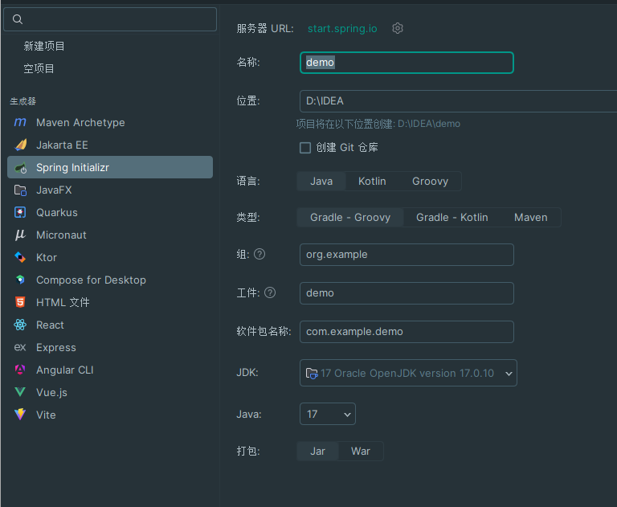
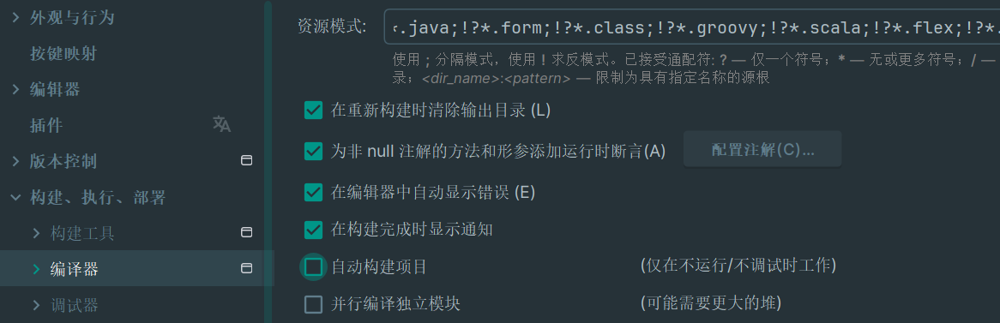

# SpringBoot

[toc]

## 搭建

1. 选择`spring initializr`
2. 输入名称、下一步
3. 选择版本springboot的版本
4. 勾选需要的依赖



### 代码说明

1. 优点
   * 快速构建一个独立的 spring 应用程序
   * 嵌入的 Tomcat 、Jetty 或者 Undertow, 无须部署 WAR 文件；
   * 提供 starter POMs 来简化 Maven 配置和减少版本冲突所带来的问题；
   * 对 spring 和第三方库提供默认配置，也可修改默认值，简化框架配置；
   * 提供生产就绪型功能，如指标、健康检查和夕卜部配置；
   * 无需配置 XML ，无代码生成，开箱即用

2. 自定义SpringApplication

   1. 就是实例化SpringApplication

      ```java
      SpringApplication app = new SpringApplication(SpringInitializrApplication.class);
      app.run(args);
      ```

   2. 更改启动横幅

      * 将启动横幅图片命名为`banner.jpg`、放置在resources文件夹下

   3. 修改端口：在配置文件中`Application.propertios`

      ```properties
      server.port=端口名称
      server.port=8088
      ```

## 配置文件

* SpringBoot 使用一个全局的配置文件核心配置文件，配置文件名在约定的情况下名字是固定的；

* 配置文件的作用：修改 SpringBoot 自动配置的默认值； Springboot在底层都给我们自动配置好；

   * `Application.propertios`

   * `Application.yml`

   * 两种配置文件的格式

   * 在 springboot 框架中， resource 文件夹里可以存放配置的文件有两种： properties 和 yml

      1. `application.properties` 的用法：扁平的 k/v 格式。

         ```properties
         server.port=8088
         server.servlet.context-path=/springboot ##访问路径前置
         ```

      2. `application.yml` 的用法：树型结构。

         ```yaml
         server:
               port: 8088
               servlet:
                       context-path: /tuling
         ```

         两种前者是，而后者是 yml 的，建议使用后者，因为它的可读性更强·可以看到要转换成 YML 我们只需吧 properies 里按。去拆分即可。

1. YAML 语法
   1. k:( 空格 )v: 表示一对键值对（空格必须有）；
   2. yaml文件中有特殊符号用单引号`‘’`进行转义
   3. 以空格的缩进来控制层级关系；只要是左对齐的一列数据，都是同一个层级的
   4. 属性和值也是大小写敏感；支持json写法
   5. **配置文件加载顺序**
      * 如果同时存在不同后缀的文件按照这个顺序加载主配置文件：互补配置：
      * 后一个配置可以覆盖前一个配置
      * 最好是只使用一个配置文件
         1. **命令行参数** (`--spring.config.additional-location` 或 `--spring.profiles.active`)
            - 这些是在运行应用程序时通过命令行传递的参数，具有最高的优先级。
         2. **`java:comp/env` 的JNDI属性**
            - Java Naming and Directory Interface (JNDI) 可以用来在应用服务器环境中查找和访问命名服务和资源。
         3. **`JAVA` 系统的环境属性**
            - 通过 `-Dproperty=value` 形式在Java虚拟机(JVM)启动时设置的系统属性。
         4. **操作系统的环境变量**
            - 操作系统级别的环境变量，如 `SPRING_APPLICATION_JSON` 可以用来传递配置。
         5. **JAR包外部的`application-XXX.properties` 或 `application-XXX.yml` 配置文件**
            - 存在于运行JAR包外部的配置文件，这些文件可以被指定的配置位置覆盖。
         6. **JAR包内部的`application-XXX.properties` 或 `application-XXX.yml` 配置文件**
            - 包含在JAR包内的配置文件，通常位于`/src/main/resources`目录下。
         7. **JAR包外部的`application.properties` 或 `application.yml` 配置文件**
            - 直接位于运行JAR包外部的主配置文件。
         8. **JAR包内部的`application.properties` 或 `application.yml` 配置文件**
            - JAR包内默认的主配置文件。
   6. **Profile 文件的加载**
      * Profile 的意思是配置，对于应用程序来说，不同的环需要不同的配置
      * SpringBoot 框架提供了多 profile 的管理功能，我们可以使用 profile 功能来区分不同环境的配置
   
2. 配置文件值注入
   1. 测试

      ```java
      @SpringBootTest
      class WebappbootApplicationTests {
          @Autowired
          private User user;
          @Test
          void contextLoads() {
              System.out.println(user);
          }
      }
      ```

   2. 配置文件.yml

      ```yaml
      user:
        id: 1
        username: 李苏辛
      ```

   3. 实体

      ```java
      @Component//交给spring进行管理
      //@ConfigurationProperties(prefix = "user")
      public class User {
          @Value("${user.id}")
          private int id;
          @Value("${user.username}")
          private String ussername;
      
          public int getId() {
              return id;
          }
      
          public void setId(int id) {
              this.id = id;
          }
      
          public String getUssername() {
              return ussername;
          }
      
          public void setUssername(String ussername) {
              this.ussername = ussername;
          }
      
          @Override
          public String toString() {
              return "User{" +
                      "id=" + id +
                      ", ussername='" + ussername + '\'' +
                      '}';
          }
      }
      ```

      1. 可以通过`@Value+SPEL`的方式直接绑定springboot配置文件中的值
      2. `@ConfigurationProperties(prefix = "user")`：作用 常用于bean属性和yml配置文件的绑定
      3. prefix：可以指定配置文件中的某一个节点，该节点中的子节点将自动和属性进行绑定

   4. 加入配置文件的提示

      1. 加入依赖`pom.xml`

         ```xml
         <dependency>            
             <groupId>org.springframework.boot</groupId>    
             <artifactId>spring-boot-configuration-processor</artifactId>    
             <scope>true</scope>    
         </dependency>
         <!--会生成META-INF 元数据 用于idea自动提示配置文件-->
         ```

      2. 在idea的设置里面勾选：`processtng`

      3. `@Value`：不支持

3. 配置文件占位符

   1. 可以直接使用`${}`进行本地数据调用

      ```yaml
      user:
        id: 1
        username: 李苏辛
      id: ${user.id}2
      ```

   2. 可以使用`random.`进行随机数产生

      1. `random.value`：随机值
      2. `random.int`：随机int值
      3. `random.long`：
      4. `random.uuid`：
      5. `random.int(2)`：随机产生两位整数
      6. `random.imt[1,10]`：随机产生1到10的随机数

4. 数据校验

   1. 添加pom.xml依赖

      ```xml
      <dependency>
          <groupId>org.springframework.boot</groupId>
          <artifactId>spring-boot-starter-validation</artifactId>    
      </dependency>
      ```

   2. 在实现类上加入注解`@Validated`、属性上使用注解校验数据的注解，如非空`@NotNull`

      ```java
      import jakarta.validation.constraints.NotNull;
      import org.springframework.validation.annotation.Validated;
      
      @Validated
      public class User {
          @NotNull
          private int id;
          @NotNull
          private String username;
      }
      
      ```

   3. 指定外部的配置文件、在实体类上加入

      ```java
      @PropertySource("classpath:配置文件路径")//只能是后缀名为properties的配置文件

5. SpringBoot 自动配置原理

   ==Spring Boot 3 的自动配置原理是基于一系列的设计原则和机制，以减少开发人员在配置 Spring 应用程序时的负担。以下是一些关键概念和步骤，解释了 Spring Boot 如何实现自动配置：==
   
   1. Spring Boot Starter
      * Spring Boot 引入了 Starter 模块的概念，这些模块是预先打包好的依赖集合，用于快速启动常见的应用场景，如 Web 服务、数据库连接、安全等。每个 Starter 包含了场景所需的所有依赖以及相关的自动配置类。
   
   2. 自动配置入口
      * 在应用的启动类上，`@SpringBootApplication` 注解隐式包含了 `@EnableAutoConfiguration`，这指示 Spring Boot 启用自动配置功能。这个注解会触发自动配置类的发现和加载过程。
   
   3. 自动配置类
      * 自动配置类通常位于 `spring-boot-autoconfigure` 模块中，每个类负责一个特定的功能领域。例如，`WebMvcAutoConfiguration` 负责 Web MVC 的配置，`DataSourceAutoConfiguration` 处理数据源的配置。
   
   4. 条件注解
   
      自动配置类使用条件注解来确定它们是否应该被激活。这些注解包括：
   
      * `@ConditionalOnClass`：检查类路径上是否存在特定的类。
      * `@ConditionalOnBean`：检查容器中是否存在特定类型的 Bean。
      * `@ConditionalOnMissingBean`：只有当容器中没有指定类型的 Bean 时才激活配置。
      * `@ConditionalOnProperty`：基于配置属性的存在与否或属性值来决定是否激活。
   
   5. 属性绑定
      * Spring Boot 会自动将配置文件中的属性绑定到相应的 Java 对象中，通常是通过 `@ConfigurationProperties` 注解来完成的。例如，`DataSourceProperties` 可以绑定到 `application.properties` 或 `application.yml` 文件中的 `spring.datasource.*` 属性。
   
   6. 自动配置的加载
      * 在 Spring Boot 应用启动时，自动配置类会被扫描和加载。Spring Boot 使用 `AutoConfigurationImportSelector` 来确定哪些自动配置类应该被添加到 Spring 应用上下文中。
   
   7. 配置优先级和覆盖
      * 自动配置提供了默认的配置，但用户可以随时通过配置文件或代码中的 `@Bean` 方法覆盖这些默认配置。Spring Boot 也支持配置的优先级，更具体的配置会覆盖更通用的配置。
   
   8. 调试自动配置
      * 为了帮助调试和理解哪些自动配置类被激活，Spring Boot 提供了一个调试工具，可以通过在配置文件中设置 `debug=true` 来生成自动配置报告，显示哪些自动配置类已经被激活，哪些没有。
   
   通过这些机制，Spring Boot 能够在启动时分析应用的类路径和配置文件，然后自动添加和配置所需的组件，从而大大减少了配置的工作量，让开发者能够专注于业务逻辑的实现。

Spring Boot 配置文件中可以包含大量配置项，用于调整应用的行为、连接外部系统、配置日志记录、安全管理等等。然而，因为 Spring Boot 是高度模块化的，你实际使用的配置项取决于你引入的应用场景（Starter）和模块。以下是 Spring Boot 中一些常见的配置项示例，按类别整理：

1. 服务器配置 (server)

```properties
server.port=8080
server.address=0.0.0.0
server.tomcat.uri-encoding=UTF-8
server.servlet.context-path=/myapp
```

2. 日志配置 (logging)

```properties
logging.level.root=INFO
logging.level.org.springframework=DEBUG
logging.file.name=myapp.log
logging.pattern.console=%d{yyyy-MM-dd HH:mm:ss.SSS} %clr(%5p) %clr(${PID:- }{magenta}) %clr(---){faint} %clr([%15.15t]){faint} %clr(%-40.40logger{39}){cyan} %clr(:){faint} %m%n${LOG_LEVEL_PATTERN:-%5p} %clr(${PID:- }{magenta}) %date %clr{faint}([%thread]){faint} %logger{36} : %msg%n
```

3. Spring MVC 配置 (spring.mvc)

```properties
spring.mvc.view.prefix=/WEB-INF/views/
spring.mvc.view.suffix=.jsp
```

4. 数据源配置 (spring.datasource)

```properties
spring.datasource.url=jdbc:mysql://localhost:3306/mydb?useSSL=false&serverTimezone=UTC
spring.datasource.username=root
spring.datasource.password=secret
spring.datasource.driver-class-name=com.mysql.cj.jdbc.Driver
```

5. JPA/Hibernate 配置 (spring.jpa)

```properties
spring.jpa.hibernate.ddl-auto=update
spring.jpa.show-sql=true
spring.jpa.properties.hibernate.dialect=org.hibernate.dialect.MySQL5Dialect
```

6. 邮件配置 (spring.mail)

```properties
spring.mail.host=smtp.example.com
spring.mail.username=user
spring.mail.password=password
spring.mail.properties.mail.smtp.auth=true
```

7. 安全配置 (spring.security)

```properties
spring.security.user.name=admin
spring.security.user.password=admin
```

8. 缓存配置 (spring.cache)

```properties
spring.cache.type=redis
```

9. Redis 配置 (spring.redis)

```properties
spring.redis.host=localhost
spring.redis.port=6379
```

10. 消息队列配置 (spring.rabbitmq)

```properties
spring.rabbitmq.host=localhost
spring.rabbitmq.port=5672
spring.rabbitmq.username=guest
spring.rabbitmq.password=guest
```

11. 环境配置 (spring.profiles)

```properties
spring.profiles.active=dev
```

12. Actuator 配置 (management.endpoints)

```properties
management.endpoints.web.exposure.include=*
management.endpoint.health.show-details=always
```

13. Swagger 配置 (springfox)

```properties
springfox.documentation.swagger.v2.path=/api-docs
```

14. AOP 配置 (spring.aop)

```properties
spring.aop.proxy-target-class=true
```

15. Thymeleaf 配置 (spring.thymeleaf)

```properties
spring.thymeleaf.mode=HTML5
spring.thymeleaf.encoding=UTF-8
spring.thymeleaf.content-type=text/html
spring.thymeleaf.cache=false
```

16. Quartz 配置 (spring.quartz)

```properties
spring.quartz.job-store-type=jdbc
```

请注意，上面列出的配置项可能不会全部适用于你的具体应用，因为这取决于你引入的 Starter 和应用的实际需求。此外，Spring Boot 不断更新，新的版本可能会增加或移除某些配置项。你应该参考最新版的 Spring Boot 文档以获取最准确的信息。

如果你需要查看你应用中所有可用的配置属性，可以使用 `--spring.config.show-unsupported=true` 启动选项，或者在应用中添加 `spring-boot-configuration-processor` 依赖并启用配置处理器。但是，最常用的方法是运行应用并访问 `http://localhost:8080/actuator/env`（假设你启用了 Actuator 并且使用默认端口和上下文路径），这将显示应用中所有配置属性的列表和值。

## 热部署与日志

### 热部署

为了进一步提高开发效率， springboot 为我们提供了全局项目热部署，日后在开发过程中修改了部分代码以及相关配置文件后，不需要每次重启使修改生效，在项目中开启了 springb t 全局热部署之后只需要在修改之后等待几秒即可使修改生效。

1. 开启热部署

   1. 引入依赖

      ```xml
      <dependency>
          <groupId>org.springframework.boot</groupId>
          <artifactId>spring-boot-devtools</artifactId>
          <optional>true</optional>
      </dependency>
      ```

   2. 修改idea配置

      ==当我们修改了类文件后， idea 不会自动编译，得修改 idea 设置。==

      * FiIe-Settings-Compiler-Build Project automatically:勾选自动构建项目

         

      * ctrl + shift + alt +/选择 Registry, 勾上 CompiIer aut0Make allow when app running

      * ctrl + shift + alt +/选择 Registry,value值设为0

         
   
      * 勾选：设置一>高级设置一>编译器一>编译器中的一个选项
   
   3. 启动项目测试热部署是否生效
   

### 日志

因为日志框架多而不同，可能会在一个项目内使用多个日志框架就需要使用==日志门面（slf4j）==整合日志，不实现日志功能、使用日志门面中的==桥接器==桥接日志、在使用==适配器==在不需要改变代码的前提下，使项目用同一种日志输出。

1. 导入响应依赖

2. 在项目中使用日志门面进行日志输出

3. 配置不同框架日志输出的配置文件

4. 在pom.xml中添加一种日志到另一种日志的适配器

   案例

   1. 导入依赖

      ```xml
      <!--        log4j日志-->
              <dependency>
                  <groupId>log4j</groupId>
                  <artifactId>log4j</artifactId>
              </dependency>
      <!--        slf4j核心依赖-->
              <dependency>
                  <groupId>org.slf4j</groupId>
                  <artifactId>slf4j-api</artifactId>
              </dependency>
      <!--        slf4j到log4j的桥接器-->
              <dependency>
                  <groupId>org.slf4j</groupId>
                  <artifactId>slf4j-log4j12</artifactId>
              </dependency>
      ```

   2. 编写两个mian方法使用不同的日志框架，但是使用slf4j桥接不同的日志
   
      ```java
      //jul是jdk自带的日志
      import org.apache.commons.logging.Log;
      import org.apache.commons.logging.LogFactory;
      //jul日志加jcl门面
      public class Jcl {
          public static void main(String[] args) {
              Log log = LogFactory.getLog(Jcl.class);
              System.out.println(log.getClass());
              log.info("jcl");
          }
      }
      //log4j
      import org.slf4j.Logger;
      import org.slf4j.LoggerFactory;
      public class Logj {
          public static void main(String[] args) {
              Logger logger = LoggerFactory.getLogger(Logj.class);
              System.out.println(logger.getClass());
              logger.info("log4j==");
          }
      }
   
   3. 导入不同配置文件
   
      ```properties
      # log4j名称：log4j.properties
      # 设置全局日志级别为 INFO
      log4j.rootLogger=trace , ConsoleAppender
      # 控制台日志 Appender 配置
      log4j.appender.ConsoleAppender=org.apache.log4j.ConsoleAppender
      log4j.appender.ConsoleAppender.layout=org.apache.log4j.PatternLayout
      log4j.appender.ConsoleAppender.layout.ConversionPattern=%d{yyyy-MM-dd HH:mm:ss} %-5p %c{1}:%L - %m%n
      
      #jul：commons-logging.properties
      org.apache.commons.logging.log = org.apache.commons.logging.impl.Jdk14Logger
      ```
   
   4. 导入日志适配器依赖，统一日志
   
      ```xml
      <dependency>
          <groupId>org.slf4j</groupId>
          <artifactId>jcl-over-slf4j</artifactId>    
      </dependency>
      ```

#### springBoot默认日志(logback)加slf4j

1. 日志级别

   1. 使用logback步骤

      1. 声明日志记录器，在web层写在方法里面

         ```java
         Logger logger = LoggerFactory.getLogger(HelloController.class);//用log4j
         logger.日志级别("123456");
         ```

   2. Spring Boot 支持以下日志级别：

      - **OFF**：关闭日志记录。
      - **ERROR**：记录错误信息，通常表示程序出现了严重的问题。==异常==
      - **WARN** 或 **WARNING**：记录警告信息，表示潜在的问题。==警告==
      - **INFO**：记录一般的信息，用于跟踪应用程序的运行状态。==信息==
      - **DEBUG**：记录详细的调试信息，主要用于开发阶段。==调试==
      - **TRACE**：记录最详细的跟踪信息，通常用于问题排查。==跟踪==

   3. 在配置文件中配置：在 `application.properties` 或 `application.yml` 文件中，你可以使用以下格式来设置日志级别：

      1. **application.properties 示例：**

         ```
         logging.level.org.springframework=INFO
         logging.level.com.yourcompany.yourapp=DEBUG
         ```

      2. **application.yml 示例：**

         ```
         logging:
           level:
             org.springframework: INFO
             com.yourcompany.yourapp: DEBUG
         ```

         这里 `org.springframework` 和 `com.yourcompany.yourapp` 分别是 Spring 框架和你的应用的包名。`INFO` 和 `DEBUG` 是日志级别。

2. 日志格式

   ```properties
   2024-07-19T00:25:21.684+08:00  INFO 3376 --- [webappboot] [nio-8080-exec-1] o.e.w.controller.HelloController         : 123456
   2024-07-19T00:25:21.684+08:00 DEBUG 3376 --- [webappboot] [nio-8080-exec-1] o.e.w.controller.HelloController         : 123456789
   日期时间；毫秒精度，易于排序     日志级别 进程ID              线程名称                    记录日志的类                            日志信息               
   ```

   1. 修改日志格式

      * 在 `application.properties` 文件中修改日志格式，但这通常仅限于控制台输出的格式。要修改文件输出的日志格式，你通常需要使用日志框架特定的配置文件，如 `logback-spring.xml` 对于 Logback。

         然而，对于控制台输出，你可以在 `application.properties` 文件中使用以下配置来修改日志格式：

         ```properties
         logging.pattern.console=%d{yyyy-MM-dd HH:mm:ss.SSS} [%thread] %-5level %logger{36} - %msg%n
         ```

         这里的配置项 `logging.pattern.console` 控制控制台输出的日志格式。`%d`, `%thread`, `%level`, `%logger`, 和 `%msg` 是 Logback 的转换词，它们分别代表日期和时间、线程名、日志级别、日志记录器的名称以及日志消息。

         1. `%clr`和`{faint}`包裹起来的类容设置颜色，而`{设置的颜色}`

      * 修改文件输出的日志格式，你将需要在 `logback-spring.xml` 文件中进行配置，因为在 `application.properties` 中的 `logging.pattern.file` 属性在 Spring Boot 中是不被识别的。因此，对于文件输出的日志格式，你仍然需要在 `logback-spring.xml` 文件中配置 `<encoder>` 的 `<pattern>`。

         例如，在 `logback-spring.xml` 文件中，你可以这样配置文件输出的日志格式：

         ```xml
         <configuration>
              <appender name="STDOUT" class="ch.qos.logback.core.ConsoleAppender">
                 <!-- encoder -->
                 <encoder>
                     <pattern>%d{HH:mm:ss.SSS} [%thread] %-5level %logger{36} - %msg%n</pattern>
                 </encoder>
             </appender>
             
             <appender name="FILE" class="ch.qos.logback.core.rolling.RollingFileAppender">
                 <file>logs/application.log</file>
                 <rollingPolicy class="ch.qos.logback.core.rolling.TimeBasedRollingPolicy">
                     <fileNamePattern>logs/application.%d{yyyy-MM-dd}.log</fileNamePattern>
                     <maxHistory>30</maxHistory>
                 </rollingPolicy>
                 <encoder>
                     <pattern>%date %level [%thread] %logger{10} [%file:%line] %msg%n</pattern>
                 </encoder>
             </appender>
             
             <root level="INFO">
                 <appender-ref ref="STDOUT" />
                 <appender-ref ref="FILE" />
             </root>
         </configuration>
         ```

         这样，你就可以在 `application.properties` 中控制控制台输出的日志格式，而在 `logback-spring.xml` 中控制文件输出的日志格式。如果你需要统一控制台和文件输出的日志格式，你可以在 `logback-spring.xml` 文件中配置，同时在 `application.properties` 中禁用控制台输出或仅使用文件输出。

   2. 设置日志文件输出

      ```properties
      logging.file.name=myapp.log #日志输出名字，可以在前面加上路径
      logging.file.path=日志存放路径 #不可以指定日志名称，必须指定一个物理文件夹的路径，默认使用spring.log文件名
      ```

      * `logging.file.name`:优先加载，没有`logging.file.name`才会加载`logging.file.path`

3. 日志归档

   1. 通过修改`application.properties`或`application.yml`文件来配置日志的归档。Spring Boot默认使用Logback作为日志框架，因此可以利用Logback的配置语法来进行设置。

      ```properties
      logging.file.name=logs/app.log //日志路径加名字
      logging.logback.rollingpolicy.file-name-pattern=logs/app-%d{yyyy-MM-dd}.log
      logging.logback.rollingpolicy.max-history=30  //日志存放时间，单位天
      logging.pattern.console
      logging.file.max-size=50kb   //日志大小
      ```

      * `logging.file.name`: 设置日志文件的基本名称和位置。
      * `logging.logback.rollingpolicy.file-name-pattern`: 指定日志文件的命名模式，其中`%d{yyyy-MM-dd}`表示按照日期格式滚动日志文件。
      * `logging.logback.rollingpolicy.max-history`: 设置要保留的旧日志文件的最大数量，例如上述例子中设置为30，意味着会保留过去30天的日志文件。

4. 自定义日志配置文件

   1. 在resource目录下直接新建logback.xml在里面配置日志相关信息、==使用了logback.xml后application.properties文件中的所有logging都将失效==

   2. 下面是一个相对全面的`logback.xml`配置文件示例，包括了常用的日志输出到控制台和文件、日志滚动策略、日志等级控制等特性。我将为每个主要部分添加注释以便于理解：

      ```xml
      <configuration scan="true" scanPeriod="1 minute" debug="false">
      
          <!-- 定义日志文件的位置和名称 -->
          <property name="LOGS" value="./logs"/>
      
          <!-- 控制台日志输出配置 -->
          <appender name="STDOUT" class="ch.qos.logback.core.ConsoleAppender">
              <encoder>
                  <!-- 日志输出格式 -->
                  <pattern>%d{yyyy-MM-dd HH:mm:ss.SSS} [%thread] %-5level %logger{36} - %msg%n</pattern>
              </encoder>
          </appender>
      
          <!-- 文件日志输出配置 -->
          <appender name="FILE" class="ch.qos.logback.core.rolling.RollingFileAppender">
              <file>${LOGS}/app.log</file>
              <rollingPolicy class="ch.qos.logback.core.rolling.TimeBasedRollingPolicy">
                  <!-- 滚动策略，每天生成一个新的日志文件 -->
                  <fileNamePattern>${LOGS}/app.%d{yyyy-MM-dd}.log</fileNamePattern>
                  <!-- 保留最近30天的日志 -->
                  <maxHistory>30</maxHistory>
              </rollingPolicy>
              <encoder>
                  <!-- 文件日志输出格式 -->
                  <pattern>%d{yyyy-MM-dd HH:mm:ss.SSS} [%thread] %-5level %logger{36} - %msg%n</pattern>
              </encoder>
          </appender>
      
          <!-- 设置根logger的级别 -->
          <root level="INFO">
              <!-- 将日志输出到控制台和文件 -->
              <appender-ref ref="STDOUT"/>
              <appender-ref ref="FILE"/>
          </root>
      
          <!-- 设置特定包下的logger级别 -->
          <logger name="com.example.package" level="DEBUG" additivity="false">
              <appender-ref ref="FILE"/>
          </logger>
      
      </configuration>
      ```

      在这个配置文件中：

      - `<configuration>` 元素设置了扫描配置文件的频率，以及是否开启debug模式。
      - `<property>` 元素用于定义日志文件的基础路径。
      - `<appender>` 元素定义了不同的日志输出目的地，包括控制台和文件。
      - `<encoder>` 元素定义了日志信息的输出格式。
      - `<rollingPolicy>` 子元素配置了日志滚动策略，如基于时间的滚动。
      - `<root>` 元素设置了应用程序的根日志级别，以及它应该使用哪些appender。
      - `<logger>` 元素允许你针对特定的包或类设置日志级别。

      这个`logback.xml`文件应放在Spring Boot项目的`src/main/resources`目录下，或者类路径中其他Spring Boot能够找到的地方。

5. 日志的其他框架切换

   1. logback集成在`starter-web`依赖里面

   2. 需要其他日志框架则添加相应依赖、场景响应器

   3. log4g2

      ```xml
              <dependency>
                  <groupId>org.springframework.boot</groupId>
                  <artifactId>spring-boot-starter-log4j2</artifactId>
              </dependency>
      ```

   4. 排除已有的场景响应器

      1. 鼠标右键、分析、图标、找到场景响应器选中`shift-delete`

      2. 或者在依赖下添加xml

         ```xml
         <dependency>
                     <groupId>org.springframework.boot</groupId>
                     <artifactId>spring-boot-starter-web</artifactId>
                     <exclusions>
                         <exclusion>
                             <artifactId>spring-boot-starter-logging</artifactId>
                             <groupId>org.springframework.boot</groupId>
                         </exclusion>
                     </exclusions>
                 </dependency>
         ```

## Boot与Web

### CURD


### RestTemplate


## boot 集成mybatis

### 整合Druid


### 整合mybatis


## 小知识

1. `@RestController`：是`@Controller`加上`@ResponseBody`


```java
package org.example.webappboot.controller;

import org.springframework.web.bind.annotation.RequestMapping;
import org.springframework.web.bind.annotation.RestController;

@RestController
@RequestMapping("/web")
public class HelloController {

    @RequestMapping("/string")
    public String save(){
        return "123456123123";
    }
}


package org.example.webappboot;

import org.springframework.boot.SpringApplication;
import org.springframework.boot.autoconfigure.SpringBootApplication;

@SpringBootApplication
public class WebappbootApplication {

    public static void main(String[] args) {
        SpringApplication.run(WebappbootApplication.class, args);
    }

}

```

### 解决跨域问题

1. 创捷工具类

   ```java
   package org.example.webappboot.config;
   
   import org.springframework.context.annotation.Configuration;
   import org.springframework.web.servlet.config.annotation.CorsRegistry;
   import org.springframework.web.servlet.config.annotation.WebMvcConfigurer;
   
   @Configuration
   public class WebConfig implements WebMvcConfigurer {
   
       @Override
       public void addCorsMappings(CorsRegistry registry) {
           registry.addMapping("/**") // 允许所有路径
                   .allowedOrigins("http://localhost:5173") // 允许来自 http://localhost:5173 的请求
                   .allowedMethods("GET", "POST", "PUT", "DELETE", "OPTIONS") // 允许的 HTTP 方法
                   .allowedHeaders("*") // 允许所有的请求头
                   .allowCredentials(true) // 是否允许携带 cookie
                   .maxAge(3600); // 预检请求的有效期
       }
   }
   ```

2. 在web层的控制类上加注解`@CrossOrigin`
