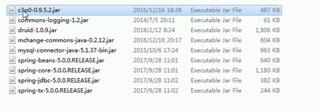
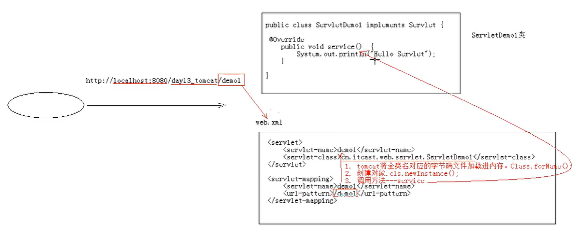
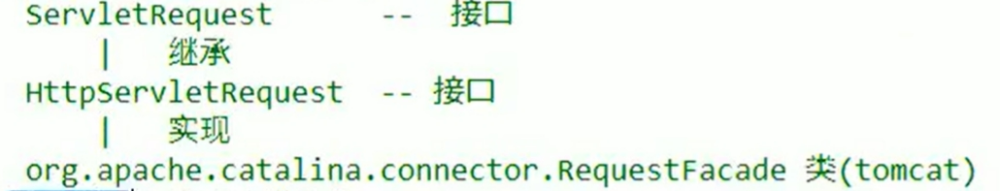

# javaweb

[toc]


## JDBC

定义了所有关系型数据库的规则（接口）

```java
package com.jdbc;

import java.sql.Connection;
import java.sql.DriverManager;
import java.sql.Statement;

public class MysqlJdbc {
    public static void main(String[] args) throws Exception {
        //注册驱动,mysql5以后可以省略注册驱动
        Class.forName("com.mysql.cj.jdbc.Driver");
        //获取数据库连接对象
        Connection con = DriverManager.getConnection("jdbc:mysql://localhost:3306/test","root","219798");
        //定义sql语句
        String sql = "update student set user = '王八蛋' where Telephonenumber=123456789012345678";
        //获取执行sql的对象Ststement
        Statement stem = con.createStatement();
        //执行sql
        int count = stem.executeUpdate(sql);
        //释放资源
        stem.close();
        con.close();
    }
}
```

Java的JDBC（Java Database Connectivity）是一组用于执行SQL语句的Java API，它为多种数据库提供了统一的访问方式。以下是JDBC编程中常用的一些类和接口的简要说明：

### 执行SQL语句的Java API

1. `java.sql.DriverManager`

- **作用**：管理数据库驱动程序的加载与注册。它是JDBC的入口点，用于建立与数据库的连接。
- **常用方法**：
  - `getConnection(String url, String user, String password)`：根据给定的数据库URL、用户名和密码建立数据库连接。
  - url语法：`jdbc:mysql://ip:端口/数据库名称`
  - 本机MySQL服务端口是3306，可以省略ip和端口号：`jdbc:mysql:///数据库名称`

2. `java.sql.Connection`

- **作用**：代表与数据库的连接。所有与数据库交互的操作都是基于这个连接对象进行的。
- **常用方法**：
  - `createStatement()`：创建一个`Statement`对象，用于执行静态SQL语句。
  - `prepareStatement(String sql)`：创建一个`PreparedStatement`对象，用于执行预编译的SQL语句。
  - `prepareCall(String sql)`：创建一个`CallableStatement`对象，用于调用数据库中的存储过程。
  - `close()`：关闭数据库连接。
  - `setAutoCommit(boolean autoCommit)`：开启事务
  - `commit()`：提交事务
  - `eollback()`：回滚事务

3. `java.sql.Statement`

- **作用**：用于执行静态SQL语句并返回结果的对象。
- **常用方法**：
  - `executeQuery(String sql)`：执行查询语句，并返回一个`ResultSet`对象。
  - `executeUpdate(String sql)`：执行INSERT、UPDATE或DELETE语句，返回受影响的行数。
  - `execute(String sql)`：执行SQL语句，根据不同的SQL类型返回不同的结果。

4. `java.sql.PreparedStatement`

- **作用**：预编译的`Statement`，比普通`Statement`更安全且性能更好，因为它允许参数化查询，防止SQL注入。
- **常用方法**与`Statement`类似，额外提供了设置参数的方法，如`setInt(int parameterIndex, int x)`等。

5. `java.sql.ResultSet`

- **作用**：保存查询结果的数据表，是一个游标指向型的数据集合。

- **常用方法**：
  
  - `next()`：移动到下一行。
  
  - `getString(int columnIndex)`、`getInt(int columnIndex)`等：获取当前行指定列的数据。
  
    ```java
    String sql1 = "select * from student";
    ResultSet set = stem.executeQuery(sql1);
    System.out.println(set.getString(2));
    System.out.println(set.getString("password"));
    ```
  
  - 遍历

6. `java.sql.SQLException`

- **作用**：JDBC操作中可能会抛出的异常，用于处理数据库访问过程中发生的错误。

7. `java.sql.CallableStatement`

- **作用**：用于调用数据库存储过程的接口，是`PreparedStatement`的子接口，具有预编译和参数化的特性。
- **常用方法**除了具备`PreparedStatement`的功能外，还提供了`registerOutParameter(int parameterIndex, int sqlType)`等方法来注册输出参数。

在实际开发中，使用JDBC进行数据库操作通常包括以下步骤：
1. 加载数据库驱动。
2. 通过`DriverManager.getConnection()`获取数据库连接。
3. 创建`Statement`、`PreparedStatement`或`CallableStatement`对象。
4. 执行SQL语句。
5. 处理`ResultSet`（如果有的话）。
6. 关闭资源（`ResultSet`、`Statement`、`Connection`）。

==注意，从Java 7开始，推荐使用try-with-resources语句来自动管理资源，确保即使在发生异常时也能正确关闭资源。==

```java
package com.jdbc;

import java.sql.*;

public class MysqlJdbc {
    public static void main(String[] args){
        Connection con =null;
        Statement stem = null;
        try {
            //注册驱动
            //Class.forName("com.mysql.cj.jdbc.Driver");
            //获取数据库连接对象
            con = DriverManager.getConnection("jdbc:mysql://localhost:3306/test", "root", "219798");
            //定义sql语句
            String sql = "update student set user = '王八' where Telephonenumber=123456789012345678";
            String sql1 = "select * from student";
            //获取执行sql的对象Ststement
            stem = con.createStatement();
            //执行sql
            //int count = stem.executeUpdate(sql);
            ResultSet set = stem.executeQuery(sql1);
            while (set.next()) {
                System.out.println(set.getString(2) + "-------" + set.getString("password"));
            }
            //释放资源
        } catch (SQLException e) {
            throw new RuntimeException(e);
        } finally {
        if (stem != null){
            try {
                stem.close();
            } catch (SQLException e) {
                throw new RuntimeException(e);
            }
        }
            if (con != null) {
                try {
                    con.close();
                } catch (SQLException e) {
                    throw new RuntimeException(e);
                }
            }
        }
    }
}
```

### JDBC工具类

* 工具类

```java
package com.jdbc;

import org.junit.After;

import java.io.FileReader;
import java.io.IOException;
import java.net.URL;
import java.sql.*;
import java.util.Properties;

public class JdbcUtils {
    //使用静态代码块，读取配置文件
    private static String url;
    private static String user;
    private static String password;
    private static String driver;
    static {
        try {
        //创建集合
        Properties pro = new Properties();
        //获取src路径下的文件----->类加载器ClassLoader
        ClassLoader classLoader = JdbcUtils.class.getClassLoader();
        //传入文件名获取文件名的URL路径,只能获取src这一级以下的
        URL urlle = classLoader.getResource("jdbc.properties");
        //将URL转换为字符串文件
        String path = urlle.getPath();
        pro.load(new FileReader(path));
        url = pro.getProperty("url");
        user = pro.getProperty("user");
        password = pro.getProperty("password");
        driver = pro.getProperty("driver");
        //注册驱动
        Class.forName(driver);
        } catch (IOException e) {
            throw new RuntimeException(e);
        } catch (ClassNotFoundException e) {
            throw new RuntimeException(e);
        }
    }
    public static Connection getConnection(){
        //使用配置文件的方式连接数据库对象
        try {
            return DriverManager.getConnection(url, user, password);
        } catch (SQLException e) {
            throw new RuntimeException(e);
        }
    }

    public static void close(Connection con,Statement stem){
        if (stem != null){
            try {
                stem.close();
            } catch (SQLException e) {
                throw new RuntimeException(e);
            }
        }
        if (con != null) {
            try {
                con.close();
            } catch (SQLException e) {
                throw new RuntimeException(e);
            }
        }
    }

    public static void close(Connection con, Statement stem, ResultSet set){
        if (stem != null){
            try {
                stem.close();
            } catch (SQLException e) {
                throw new RuntimeException(e);
            }
        }
        if (con != null) {
            try {
                con.close();
            } catch (SQLException e) {
                throw new RuntimeException(e);
            }
        }
        if (set != null) {
            try {
                set.close();
            } catch (SQLException e) {
                throw new RuntimeException(e);
            }
        }
    }
}
```

* 配置文件

```properties
url=jdbc:mysql://localhost:3306/test
user=root
password=219798
driver=com.mysql.cj.jdbc.Driver
```

* 测试类

```java
package com.jdbc;

import java.sql.Connection;
import java.sql.ResultSet;
import java.sql.SQLException;
import java.sql.Statement;

public class JdbcTest {
    public static void main(String[] args) {
        Connection con =null;
        Statement stem = null;
        ResultSet set=null;
        con = JdbcUtils.getConnection();
        String sql = "update student set user = '王八' where Telephonenumber=123456789012345678";
        String sql1 = "select * from student";
        //获取执行sql的对象Ststement
        try {
            stem = con.createStatement();
        //执行sql
        //int count = stem.executeUpdate(sql);
        set = stem.executeQuery(sql1);
        while (set.next()) {
            System.out.println(set.getString(2) + "-------" + set.getString("password"));
        }
        } catch (SQLException e) {
            throw new RuntimeException(e);
        }
        JdbcUtils.close(con,stem,set);
    }
}
```

### Jdbc事务管理

* `PreparedStatement`解决sql注入问题，使用？作为占位符

  1. 定义sql
  2. 获取执行sql执行语句对象
  3. 给？赋值
     * 方法：setXxx（参数1，参数2）
     * Xxx：数据类型
     * 参数1：第几个问号，从1开始
     * 参数2：？的值
  4. 执行sql不需要传值

  ```java
  String sql1 = "select * from student where user=? and password=?";
  pstm = con.prepareStatement(sql1);
  pstm.setString(1,"王八");
  pstm.setString(2,"12345678");
  set = pstm.executeQuery();
  ```

* 使用Connection来进行事务管理

  1. 事务：包含多个步骤的业务操作，如果这个业务被事务管理，则这些步骤要么同时成功，要么同时失败
  2. `setAutoCommit(boolean autoCommit)`：开启事务：在所有操作前开启
  3. `commit()`：提交事务：在所有操作完提交
  4. `eollback()`：回滚事务：再出现异常时回滚

### 数据库连接池

1. 数据源(连接池)作用

   1. 数据源（连接池)是提高程序性能如出现的
   2. 事先实例化数据源，初始化部分连接资源
   3. 使用连接资源时从数据源中获取
   4. 使用完毕后将连接资源归还给数据源
   5. 常见的数据源(连接池)：==DBCP、C3PO、BoneCP、Druid==等

2. 开发步骤

   1. 导包

      

   2. 创建数据源对象

   3. 设置数据源的基本链接数据

3. 手动创建==C3P0==数据源

   ```java
   @Test
       //测试手动创建 c3p0 数据源（两个包）1.c3p0、mchange-commons-java
       public void text2() throws Exception {
           ComboPooledDataSource dataSource = new ComboPooledDataSource();
           dataSource.setDriverClass("com.mysql.jdbc.Driver");
           dataSource.setJdbcUrl("jdbc:mysql://localhost:3306/glwc");
           dataSource.setUser("root");
           dataSource.setPassword("219798");
           Connection connection = dataSource.getConnection();
           System.out.println(connection);
           connection.close();
       }
   ```

4. 手动创建==druid==数据源

   ```java
   @Test
       //测试手动创建 druid 数据源
       public void text3() throws Exception {
           DruidDataSource dataSource = new DruidDataSource();
           dataSource.setDriverClassName("com.mysql.jdbc.Driver");
           dataSource.setUrl("jdbc:mysql://localhost:3306/glwc");
           dataSource.setUsername("root");
           dataSource.setPassword("219798");
           Connection connection = dataSource.getConnection();
           System.out.println(connection);
           connection.close();
       }
   ```

5. 抽取==Jdbc.properties==文件

   * jdbc.properties文件内容

   ```dir
   url=jdbc:mysql://localhost:3306/test
   username=root
   password=219798
   driver=com.mysql.cj.jdbc.Driver
   #初始化连接数
   initialSize=5
   #最大连接数
   maxActive=10
   #最大等待时间
   maxWait=3000
   ```

   * 测试文件

   ```java
   package com.jdbc;
   
   import com.alibaba.druid.pool.DruidDataSourceFactory;
   import org.junit.Test;
   
   import javax.sql.DataSource;
   import java.io.InputStream;
   import java.sql.Connection;
   import java.util.Properties;
   
   public class JsbcDruid {
       @Test
       //测试手动创建 druid 数据源(加载配置文件),druid
       public void text4() throws Exception {
           //读取配置文件
           Properties pro = new Properties();
           InputStream is = JsbcDruid.class.getClassLoader().getResourceAsStream("Jdbc.properties");
           pro.load(is);
           DataSource dataSource = DruidDataSourceFactory.createDataSource(pro);
           Connection connection = dataSource.getConnection();
           System.out.println(connection);
           connection.close();
       }
   }
   
   ```

工具类

1. 提供方法

   1. 获取连接方法
   2. 释放资源
   3. 获取连接池的方法

   ```java
   package com.jdbc;
   
   import com.alibaba.druid.pool.DruidDataSourceFactory;
   
   import javax.sql.DataSource;
   import java.io.IOException;
   import java.io.InputStream;
   import java.sql.Connection;
   import java.sql.ResultSet;
   import java.sql.SQLException;
   import java.sql.Statement;
   import java.util.Properties;
   
   public class JdbcDruidUtils {
       private static DataSource dataSource;
   
       static {
           try {
               Properties pro = new Properties();
               InputStream is = JsbcDruid.class.getClassLoader().getResourceAsStream("Jdbc.properties");
               pro.load(is);
               dataSource = DruidDataSourceFactory.createDataSource(pro);
           } catch (IOException e) {
               throw new RuntimeException(e);
           } catch (Exception e) {
               throw new RuntimeException(e);
           }
       }
       //获取连接
       public static Connection getConnection(){
           try {
               return dataSource.getConnection();
           } catch (SQLException e) {
               throw new RuntimeException(e);
           }
       }
   
       public static void close(Connection connection,Statement statement){
           close(connection,statement,null);
       }
       public static void close(Connection connection, Statement statement ,ResultSet resultSet){
           if (connection != null){
               try {
                   connection.close();
               } catch (SQLException e) {
                   throw new RuntimeException(e);
               }
          }
   
           if (statement != null){
               try {
                   statement.close();
               } catch (SQLException e) {
                   throw new RuntimeException(e);
               }
           }
           if (resultSet != null){
               try {
                   resultSet.close();
               } catch (SQLException e) {
                   throw new RuntimeException(e);
               }
           }
       }
       //获取连接的方法
       public static DataSource getDataSource(){
           return dataSource;
       }
   }
   ```
   
2. 测试

   ```java
   package com.jdbc;
   
   import java.sql.Connection;
   import java.sql.PreparedStatement;
   import java.sql.SQLException;
   
   public class JdbcDruidUtilsTest {
   
       public static void main(String[] args) {
           Connection connection =null;
           PreparedStatement preparedStatement =null;
           try {
               connection = JdbcDruidUtils.getConnection();
               String sql = "insert into student value(?,?,?,?)";
               preparedStatement = connection.prepareStatement(sql);
               preparedStatement.setString(1,"杨攀");
               preparedStatement.setString(2,"510821199809132312");
               preparedStatement.setString(3,"outtuqqwe");
               preparedStatement.setString(4,"18582969757");
               //执行SQl
               preparedStatement.executeUpdate();
           } catch (SQLException e) {
               throw new RuntimeException(e);
           }finally {
            JdbcDruidUtils.close(connection,preparedStatement);
           }
       }
   }

#### JDBCTemplate

1. 需要的包`commons-logging`、`spring-tx`、`spring Beans`、`spring-core`、`spring-jdbc`

2. 测试

   ```java
   JdbcTemplate jdbcTemplate = new JdbcTemplate(JdbcDruidUtils.getDataSource());        
   String sql = "update student set user = ? where studentnumber = 18582969757";
   jdbcTemplate.update(sql,"李苏辛");
   ```

3. 方法

   * `update()`：执行sql语句==增、删、改==

     ```java
     String sql = "update student set user = ? where studentnumber = 18582969757";
     jdbcTemplate.update(sql,"李苏辛");
     ```

   * `queryForMap()`：将查询语句封装成Map集合

     ```java
     String sql ="select * from student where user= ?";        
     Map<String,Object>  map =jdbcTemplate.queryForMap(sql,"李苏辛");//结果集为1
     ```

   * `queryForList()`：将查询语句封装成List集合

     ```java
     String sql ="select * from student where user= ? or user = ?";        
     List<Map<String,Object>> list = jdbcTemplate.queryForList(sql,"李苏辛","王五");
     ```

   * `query()`：将查询语句封装成JavaBean对象

     ```java
     String sql ="select * from student where user= ? or user = ?";        
     List<Posern> list = jdbcTemplate.query(sql,new BeanPropertyRowMapper<Posern>(Posern.class),"李苏辛","王五");

   * `queryForObject()`：将查询语句封装成对象，查询所有记录

     ```java
     String sql = "select count(user) from student";        
     Long tory = jdbcTemplate.queryForObject(sql,Long.class);

## xml

### 基础

**概念：**可扩展标记语言

* 存储数据
  1. 配置文件
  2. 在网络中传输 

**语法：**

1. xml文档的后缀名.xml
2. xml第一行必须定义为文档声明`<?xml version='1.0' ?>`
3. xml文档中有且仅有一个根标签
4. 性值必须使用引号(单双都可)引起来
5. 标签必须正确关闭
6. xml标签名称区分大小写

**组成部分：**

1. **文档声明**

   1. 格式:`<?xml属性列表?>`
   2. 属性列表:
      * version :版本号,必须的属性
      * encoding :编码方式。告知解析引擎当前文档使用的字符集,默认值: ISO-8859-1
      * standalone : 是否独立
        * 取值:
          * yes :不依赖其他文件
          * no:依赖其他文件

2. **指令(了解):结合css的**

   `<?xml-stylesheet type="text/css" href="a.css" ?>`

3. **标签:标签名称自定义的**

   规则:

   1. 名称可以包含字母、数字以及其他的字符
   2. 名称不能以数字或者标点符号开始
   3. 名称不能以字母xml(或者XML、Xml等等)开始
   4. 名称不能包含空格

4. 属性:

   ==id属性值唯一==

5. 文本:

   CDATA区:在该区域中的数据会被原样展示

   格式:`<![CDATA[数据]]>`

### 约束

规定xml文档的书写规则

* 作为框架的使用者(程序员)
  1. 能够在xml中引入约束文档
  2. 能够简单的读懂约束文档.

* 分类:
  1. DTD:一种简单的约束技术
  2. Schema:一种复杂的约束技术
  
* DTD :
  * 引入dtd文档到xml文档中
    * 内部dtd:将约束规则定义在xml文档中
    * 外部dtd:将约束的规则定义在外部的dtd文件中
      * 本地:`<!DOCTYPE 根标签名 SYSTEM "dtd文件的位置">`
      *  网络:`<!DOCTYPE 根标签名 PUBLIC "dtd文件名字”"dtd文件的位置URL">`
    
    ```dtd
    <!ELEMENT students (student*)><!--students为父标签，可以有多个student标签，也可以没有-->
    <!-- <!ELEMENT students (student+)>//students为父标签，最少需要一个student标签 -->
    <!ELEMENT student (name,age,sex)><!-- sutudent标签里面有的标签-->
            <!ELEMENT name (#PCDATA)><!-- 最低一级标签-->
            <!ELEMENT age (#PCDATA)>
            <!ELEMENT sex (#PCDATA)>
    <!ATTLIST student number ID #REQUIRED><!-- student标签拥有一个number属性为ID-->
    ```
  
* schema

  * 解决dtd无法限制内容的缺陷

    ```xml-xsd
    <?xml version="1.0" ?>
    <xsd:schema xmlns="http://www.lisuxin.cn/xml"
                xmlns:xsd="http://www.w3.org/2001/XMLSchema"
                targetNamespace="http://www.lisuxin.cn/xml" elementDefault="qualified">
        <xsd:element name="students" type="studentsType"/>
        <!-- 定义了一个students元素，元素类型为studentsType-->
        <xsd:complexType name="studentsType">
            <!--因为studentsType是自定义类型需要声明-->
            <xsd:sequence>
                <xsd:element name="student" type="studentType" minOccurs="0" maxOccurs="unbounded"/>
                <!-- 定义了一个students元素，元素类型为studentsType,最少出现0次，最多出现unbounded次-->
            </xsd:sequence>
        </xsd:complexType>
        <xsd:complexType name="studentType">
            <xsd:sequence>
                <xsd:element name="name" type="xsd:String"/>
                <xsd:element name="age" type="ageType"/>
                <xsd:element name="sex" type="sexType"/>
            </xsd:sequence>
            <xsd:attribute name="number" type="numberType" use="required"/>
        </xsd:complexType>
        <xsd:simpleType name="sexType">
            <xsd:restriction>
                <base>xsd:String</base>
                <xsd:enumeration value="male"/>
                <xsd:enumeration value="female"/>
            </xsd:restriction>
        </xsd:simpleType>
        <xsd:simpleType name="ageType">
            <xsd:restriction>
                <base>xsd:Integer</base>
                <xsd:minInclusive value="0"/>
                <xsd:maxInclusive value="256"/>
            </xsd:restriction>
        </xsd:simpleType>
        <xsd:simpleType name="numberType">
            <xsd:restriction>
                <base>xsd:String</base>
                <xsd:pattern value="heima_\d{4}"/>
            </xsd:restriction>
        </xsd:simpleType>
    </xsd:schema>
    ```

  * xml

    1. 填写 xml 文档的根元素
    2. 引入xsi前缀`xmlns:xsi="http://www.w3.org/2001/XMLSchema-instance"`
    3. 引入xsd文件命名空间`xsi:schemaLocation = "http://www.lisuxin.cn/xml student.xsd"`
    4. 为每一个 xsd 约束声明一个前缀，作为析识 `xmlns="http://www.lisuxin.cn/xml"`

    ```xml
    <students xmlns:xsi="http://www.w3.org/2001/XMLSchema-instance"
              xmlns="http://www.lisuxin.cn/xml"
              xsi:schemaLocation = "http://www.lisuxin.cn/xml student.xsd">
            
        <a:student number="001">
            <a:name>zzz</a:name>
            <a:age>11</a:age>
            <a:sex>male</a:sex>
        </a:student>
    </students>
    ```

### 解析

* 操作xml文档
  1. 解析：将文档中的数据读取到内存中
  2. 写入：将内存中的数据保存到xml文档中。做持久化存储
  3. 解析xml文档的方式
     1. DOM：将标记语言文档一次加载进内存，在内存中形成一个DOM树
        * 优点：操作方便：可以进行所有crud操作
        * 缺点：一次性加载进内存，消耗内存
     2. SAX：逐行读取，基于事件驱动。
        * 优点：不占内存
        * 缺点：不能读取
  4. 常见解析器
     1. jaxp:两种思想都支持
     2. dom4j:
     3. jsoup:html解析器
     4. pull:sax方式的，安卓内置的
  
* Jsoup

  1. 使用步骤

     1. 导包`jsoup`
     2. 获取对象`docution`
     3. 获取对应标签Element对象
     4. 获取数据

     ```java
     //获取document对象，根据xml文档获取
     //获取xml的path
     String path = JsuopMain.class.getClassLoader().getResource("atudent.xml").getPath();
     //解析xml文档，加载文档进内存，获取Dom树--->Document
     Document document = Jsoup.parse(new File(path), "utf-8");
     //获取Element对象
     Elements name = document.getElementsByTag("name");
     //获取第一个name的Element对象
     Element element = name.get(0);
     //获取数据
     System.out.println(element.text());
     ```

  2. 对象

     * Jsoup：工具类，可以解析html获XML文档，返回Document
       * 方法
       
       * parse：解析html获XML文档，返回Document
         
       * parse(File in,String Charsetname)：解析xml或者html文件的
         
       * parse(String html):解析xml或者html字符串
         
       * parse(URL rul,int timeoutMillis)：通过网络路径获取指定的html或xml文档对象
         
         ```java
         Document document = Jsoup.parse(new File(path), "utf-8");
         
         String str = "<students>\n" +
                         "    <student number=\"001\">\n" +
                         "        <name>zzz</name>\n" +
                         "        <age>11</age>\n" +
                         "        <sex>male</sex>\n" +
                         "    </student>\n" +
                         "    <student number=\"002\">\n" +
                         "        <name>zz1</name>\n" +
                         "        <age>11</age>\n" +
                         "        <sex>mal1</sex>\n" +
                         "    </student>\n" +
                         "</students>";
         Document document = Jsoup.parse(str);
         ```
       
     * Document：文档对象。代表内存中的DOM树
     
       * getElementById(String id)：根据id属性值获取唯一的Element对象
     
       * getElementsByTag(String tagName)：根据标签名称获取元素对象集合
     
       * getElementsByAttribute(String key)：根据属性名称获取元素对象集合
     
       * getElementsByAttributeValue(String key,String value)：根据对应的属性名和属性值获取元素对象集合
     
         ```java
         Document document = Jsoup.parse(new File(path), "utf-8");        
         //获取Element对象
         Elements name = document.getElementsByTag("name");
     
     * Elements：元素的Element对象的集合，可以当做`ArrayList<Element>`来使用
     
     * Element：元素对象
     
       1. 获取子元素对象
     
          * getElementById(String id)：根据id属性值获取唯一的Element对象
          * getElementsByTag(String tagName)：根据标签名称获取元素对象集合
          * getElementsByAttribute(String key)：根据属性名称获取元素对象集合
          * getElementsByAttributeValue(String key,String value)：根据对应的属性名和属性值获取元素对象集合
     
       2. 获取属性值
     
          * String attr(String key)：根据属性名称获取属性值
     
       3. 获取文本内容
     
          * String text()：获取文本内容
          * String html()：获取标签体的所有内容（包括子标签和子标签字符串内容）
     
          ```java
          Elements name = document.getElementsByTag("name");
          String ele_name = name.attr("value");
          name.text();
          name.html();
     
     * Node：节点对象
     
       * 是Document和Element的父类
     
  3. 根据选择器查询
  
     * selector：选择器
  
     * 导包``
  
       ```java
       document.select("name");//标签选择        
       document.select("#it");//id属性
       document.select("student[number=\"001\"]");//获取标签为student且number等于001
       document.select("student[number=\"001\"]>sex");//获取标签为student且number等于001，的sex的子标签
  
  4. 根据Xpath查询
  
     * XPath 是一门在 XML 文档中查找信息的语言。
  
     * 导包`commons-lang3`、`JsoupXpath`
  
       ```java
       //获取document对象，根据xml文档获取
       //获取xml的path
       String path = JsuopMain.class.getClassLoader().getResource("atudent.xml").getPath();
       //解析xml文档，加载文档进内存，获取Dom树--->Document
       Document documents = Jsoup.parse(new File(path), "utf-8");
       //根据document对象创建JXDocument对象
       JXDocument jxDocument = new JXDocument(documents);
       //查询所有student标签
       List<JXNode> jxNodes = jxDocument.selN("//student");
       for (JXNode jxNode : jxNodes) {
           System.out.println(jxNode);    
       }
       ```
  
     * 查询参考手册

## Servlet

* 运行在服务器上的小程序、规则（接口）   
* Servlet就是一个接口，定义了Java类被浏览器访问到（tomcat识别）的规则
* 自定义一个类实现Servlet接口，复写方法

### 快速入门

1. 创建javaee项目

2. 定义一个类，实现`Servlet`接口

3. 实现接口中的抽象方法

   * 提供服务的方法

      ```
      @Override
      public void service(ServletRequest servletRequest, ServletResponse servletResponse) throws ServletException, IOException {
          System.out.println("123");
      }
      ```

4. 配置Servlet

   * 在`web.xml`中配置

      ```xml
      <?xml version="1.0" encoding="UTF-8"?>
      <web-app xmlns="https://jakarta.ee/xml/ns/jakartaee"
               xmlns:xsi="http://www.w3.org/2001/XMLSchema-instance"
               xsi:schemaLocation="https://jakarta.ee/xml/ns/jakartaee https://jakarta.ee/xml/ns/jakartaee/web-app_5_0.xsd"
               version="5.0">
          <!--配置Servlet-->
          <servlet>
              <servlet-name>Demo01</servlet-name>
              <servlet-class>com.wenapp.servlet.ServletDome01</servlet-class>
              <!--tomcat将全类名对应的字节码文件加载进内存。class.forName-->
              <!--创建对象class.newInstance()-->
              <!--调用方法-->
          </servlet>
          <servlet-mapping>
              <servlet-name>Demo01</servlet-name>
              <url-pattern>/Demo01</url-pattern>
          </servlet-mapping>
      </web-app>
      ```

### 执行原理

1. 当服务器接收到浏览器请求后，会解析请求URL路径，获取访问的Servlet的资源路径
2. 查找`web.xml`文件，是否有对应的`<url-pattern>`标签体内容
3. 如果有，则找对应的`<servlet-class>`全类名
4. tomcat会将字节码加载进内存，并创建对象
5. 调用方法



### 生命周期方法

* 生命周期

   1. 创建
      1. 默认情况下，第一次访问被创建
      2. 可以配置创建时机
         1. 第一次访问被创建
            * `<load-on-startup>`值为负数
         2. 在服务器启动的时候被创建
            * `<load-on-startup>`值为0或正整数
      3. servlet 的 init 方 法， 只执行一次，说明一个 servlet 在内存中只存在一个对象， servlet是单例的
         * 多个用户同时访问时，可能存在线程安全问题。
         * 解决：尽量不要在 servlet 中定义成员变量。即使定义了成员变量，也不要对修改值
   2. 提供服务
   3. 被销毁

   ```java
    /**
        * 初始化方法
        * 在Servlet被创建时，执行，只会执行一次
        * @param servletConfig
        * @throws ServletException
        */
       @Override
       public void init(ServletConfig servletConfig) throws ServletException {
   
       }
   
    /**
        * 提供服务的方法
        * 每一次Servlet被访问时执行，执行多次
        * @param servletRequest
        * @param servletResponse
        * @throws ServletException
        * @throws IOException
        */
       @Override
       public void service(ServletRequest servletRequest, ServletResponse servletResponse) throws ServletException, IOException {
   
       }
   
    /**
        * 销毁方法
        * 在服务器关闭时执行，只执行一次
        */
       @Override
       public void destroy() {
   
       }

* 其他方法

   ```java
   /**
        * 获取ServletConfig对象
        * ServletConfig：Servlet的配置对象
        * @return
        */
       @Override
       public ServletConfig getServletConfig() {
           return null;
       }
   
   /**
        * 获取servlet信息，版本等等
        * @return
        */
       @Override
       public String getServletInfo() {
           return null;
       }

### 注解配置

* servlet3.0以上:不使用xml配置

   ```java
   @WebServlet(urlPatterns = "/Demo03")//写在类名上面
   @WebServlet("/Demo03")
   @WebServlet("访问资源路径")
   ```

### 体系结构

`servlet接口`—>`Genericserv1et抽象类`—>`Httpservlet抽象类`

* Genericserv1et ：将 servlet 接囗中其他的方法做了默认空实现，只将 service() 方法作为抽象

   * 将来定义 servlet 类时，可以继承 Genericserv1et, 实现 service() 方法即可

* HttpServlet ：对 http 协议的一种封装，简化操作. 

   1. 定义类继承Httpserv1et
   2. 复写 d0Get/dopost 方法

   ```java
   public class D0Getdopost extends HttpServlet {
       @Override
       protected void doGet(HttpServletRequest req, HttpServletResponse resp) throws ServletException, IOException {
           super.doGet(req, resp);
       }
   
       @Override
       protected void doPost(HttpServletRequest req, HttpServletResponse resp) throws ServletException, IOException {
           super.doPost(req, resp);
       }
   }

### servlet配置

* urlpartten:servlet访问路径
   1. 一个 servlet 可以定义多个访问路径路径`@webservlet （{" /d4" ，" /dd4"}`
   2. 定义规则：
      1. `/xxx`
      2. `/xxx/xxx` ：多层路径，目录结构
      3. `*.do`

### HTTP

* 既念： `Hyper Text Transfer Protoc01` 超文本传输协议
   * 传输协议：定义了，客户端和服务器端通信时，发送数据的格式
   * 特点:
      1. 基于 TCP / IP 的高级协议
      2. 默认端囗号：80
      3. 基于请求/响应模型的：一次请求对应一次响应
      4. 无状态的：每次请求之间相互独立，不能交互数据
   * 历史版本：
      * 1.0：每一次请求响应都会建立新的连接
      * 1.1：复用连接
   
* 请求消息数据格式
   1. 请求行
      * 请求方式 请求url 请求协议/版本
      * GET /login .html HTTP/1.1
         * 请求方式：
            * HTTP 协议有7中请求方式，常用的有 2 种
               * GET ：
                  1. 请求参数在请求行中，在 url 后。
                  2. 请求的 url 长度有限制的
                  3. 不太安全
               * POST ：
                  1. 请求参数在请求体中
                  2. 请求的 url 长度没有限制的
                  3. 相对安全
   2. 请求头：客户端浏览器告诉服务器一些信息
      * 请求头名称：请求头值
      * 常见的请求头
         1. `User-Agent` ：浏览器告诉服务器，我访问你使用的浏览器版本信息
            * 可以在服务器端获取该头的信息，解决浏览器的兼容性问题
         2. `Referer` ： `http：//localhost/login.html`
            * 告诉服务器，我（当前请求）从哪里来？
               * 作用：
                  1. 防盗链
                  2. 统计工作
   3. 请求空行
      * 空行
   4. 请求体（正文）
      * 封装 POST 请求消息的请求参数的
   
* 响应消息数据格式：服务器端项发送客户端数据
   * 响应行_状态码
   
      1. 组成：==协议/版本    响应状态码    响应状态描述==
   
      2. 响应状态码：服务器告诉客户端浏览器本次请求和响应的一个状态
   
         * 状态码都是三位数字
   
         * 分类
   
            1. 1xx（信息性状态码）
   
               - **100 Continue**：请求者应当继续提出请求。服务器返回此代码表示已收到请求的第一部分，正在等待其余部分。
   
            2. 2xx（成功状态码）
   
               - **200 OK**：请求已成功处理。
               - **201 Created**：请求成功并且服务器创建了新的资源。
               - **202 Accepted**：服务器已接受请求，但尚未处理。
               - **204 No Content**：请求成功，但没有返回内容。
   
            3. 3xx（重定向状态码）
   
               - **301 Moved Permanently**：请求的页面已永久移动到新位置。
               - **302 Found**：请求的页面临时移动到新位置。
               - **304 Not Modified**：自从上次请求后，请求的页面未修改过。
   
            4.  4xx（客户端错误状态码）
   
               - **400 Bad Request**：请求无效或无法理解。
               - **401 Unauthorized**：请求要求用户的身份认证。
               - **403 Forbidden**：服务器理解请求客户端的请求，但是拒绝执行此请求。
               - **404 Not Found**：服务器无法找到请求的资源。
               - **405 Method Not Allowed**：请求行中指定的请求方法不能被用于请求相应的资源。
               - **408 Request Timeout**：服务器等候请求时发生超时。
               - **409 Conflict**：请求的资源与服务器上的现有资源冲突。
               - **410 Gone**：请求的资源已永久删除，不再可用。
               - **418 I'm a teapot**：（幽默代码）服务器应返回此代码表示它是一个茶壶，不能泡咖啡。
   
            5. 5xx（服务器错误状态码）
   
               - **500 Internal Server Error**：服务器遇到了意料不到的情况，无法完成对请求的处理。
               - **501 Not Implemented**：服务器不支持实现请求所需的功能。
               - **502 Bad Gateway**：作为网关或者代理工作的服务器从上游服务器收到了无效的响应。
               - **503 Service Unavailable**：服务器目前无法使用（由于超载或停机维护）。
               - **504 Gateway Timeout**：作为网关或者代理工作的服务器未能及时从上游服务器获得请求。
   
               ==如1xx表示信息提示、2xx表示成功、3xx表示重定向、4xx表示客户端错误、5xx表示服务器错误。==
   
   * 响应头
   
      1. 格式：==头名称： 值==
      2. 常见响应头
         1. Content 一 Type ：服务器告诉客户端本次响应体数据格式以及编码格式
         2. content-disposition ：服务器告诉客户端以什么格式打开响应体数据；值：
            * in 一 line ：默认值，在当前页面内打开
            * attachment；filename=xxx ：以附件形式打开响应体。文件下载
   
   * 响应空行
   
   * 响应体：传输的数据

### Request

==请求消息数据==

1. request对象和response对象的原理

   * request 和 response对象是由服务器创建的。我们来使用它们
   * request 对是来获取请求消息，response 对是来设置响应消息

2. request对象继承体系结构

   

   #### request 功能

   **获取请求消息数据**

   1. 获取请求行数据

      ==GET /day14/dem01?name=zhangsan HTTP/1.1==

      方法：

      1. 获取求方式： GET：
      
         * `String getMethod()`
      
      2. 获取虚拟目录： /虚拟目录名称 
      
         * `string getContextPath()`
      
      3. 获取 Servlet 路径： /demo1
      
         *  `string getServletPath()`
      
      4. 获取 get 方式请求参数： name=zhangsan
      
         * `string getQueryString()`
      
      5. 获取求 URI ： /dayla/demo1
         *  `string getRequestURI()` ：/dayla/demo1
         * `StringBuffer getRequestURL()`：http:/ locaIhost/day14/dem01
      
      6. 获取协议及版本： HTTP/1.1：
      
         * `string getprotocol()`
      
      7. 获取客户机的 IP 地址：
      
         * `string getRemoteAddr()`
      
         ```java
         package com.wenapp.request;
         
         import jakarta.servlet.ServletException;
         import jakarta.servlet.annotation.WebServlet;
         import jakarta.servlet.http.HttpServlet;
         import jakarta.servlet.http.HttpServletRequest;
         import jakarta.servlet.http.HttpServletResponse;
         
         import java.io.IOException;
         
         @WebServlet("/Demo1")
         public class Rquest extends HttpServlet {
             @Override
             protected void doGet(HttpServletRequest req, HttpServletResponse resp) throws ServletException, IOException {
                 System.out.println(req.getMethod());
                 System.out.println(req.getContextPath());
                 System.out.println(req.getServletPath());
                 System.out.println(req.getQueryString());
                 System.out.println(req.getRequestURI());
                 System.out.println(req.getRequestURL());
             }
         
             @Override
             protected void doPost(HttpServletRequest req, HttpServletResponse resp) throws ServletException, IOException {
         
             }
         }

   2. 获取请求头数据

      方法：

      * `string getHeader(string name)` ：诵过求头的名称获取旧求头的值 
      * `Enumeration<String> getHeaderNames()` ：获取所有的求头名称

   3. 获取请求体数据
      * 请求体：只有 ==POST==请求方式，才有请求体，在请求体中封装了 POST 请求的请求爹数
      
      * 步骤：
         1. 获取流对象
            * `BufferedReader getReader()` ：获取字符输入流，只能作字符数据
            * `servletlnputstream getlnputstream()` ：获取字节输入流，可以作所有类型数据
         
         2. 在从流对象中拿数据
         
            ```java
            package main.java.com.wenapp.request;
            
            import jakarta.servlet.*;
            import jakarta.servlet.http.*;
            import jakarta.servlet.annotation.*;
            
            import java.io.BufferedReader;
            import java.io.IOException;
            
            @WebServlet(name = "Requsetdome", value = "/Requsetdome")
            public class Requsetdome extends HttpServlet {
                @Override
                protected void doGet(HttpServletRequest request, HttpServletResponse response) throws ServletException, IOException {
            
                }
            
                @Override
                protected void doPost(HttpServletRequest request, HttpServletResponse response) throws ServletException, IOException {
                    BufferedReader br = request.getReader();
                    String line=null;
                    while ((line = br.readLine()) != null){
                        System.out.println(line);
                    }
                }
            }
   
   **其他功能**
   
   1. 获取请求参数通用方式：不论get 还是 post 请求方式都可以使用下列方法来获取请求参数
      * `String getParameter(String name)` ：根据数名称获取参数值 username=zs&password=123
   
      * `string[] getparametervalues(string name)` ：根据数名称获取值的数组 hobby=xx&hobby=game
   
      * `Enumeration<String> getparameterNames()` ：获取所有请求参数的参数名称
   
      * `Map<String,String[]> getparametermap()` ：获取所有参数的 map 集合
   
      * 中文乱码：在获取参数前`request.setCharacterEncoding("utf-8");`
   
      * `hasMoreElements()`方法
   
         * 作用**：`hasMoreElements()` 方法返回一个布尔值，表示是否还有更多的元素可以获取。如果是 `true`，则表示调用 `nextElement()` 方法会成功返回下一个元素；如果是 `false`，则表示已经没有更多的元素，再调用 `nextElement()` 可能会抛出 `NoSuchElementException` 异常。**
         * 用途**：通常与 `nextElement()` 方法一起使用，在循环中遍历集合的元素，直到没有更多元素为止。
   
         ```java
         @WebServlet(name = "Tongyong", value = "/Tongyong")
         public class Tongyong extends HttpServlet {
             @Override
             protected void doGet(HttpServletRequest request, HttpServletResponse response) throws ServletException, IOException {
                 this.doPost(request,response);
             }
         
             @Override
             protected void doPost(HttpServletRequest request, HttpServletResponse response) throws ServletException, IOException {
                 //根据参数名称获取参数值
                 String username = request.getParameter("username");
                 System.out.println(username);
                 System.out.println("-------------------------");
                 //根据参数名称获取参数值的数组
                 String[] hobbies = request.getParameterValues("hobby");
                 for (String hobby : hobbies) {
                     System.out.println(hobby);
                 }
                 System.out.println("-------------------------");
                 //获取所有请求的参数名称
                 Enumeration<String> parameterNames = request.getParameterNames();
                 while (parameterNames.hasMoreElements()){
                     String name = parameterNames.nextElement();
                     System.out.println(name);
                     System.out.println(request.getParameter(name));
                 }
                 System.out.println("-------------------------");
                 //获取所有参数的Map集合
                 Map<String, String[]> parameterMap = request.getParameterMap();
                 Set<String> strings = parameterMap.keySet();
                 for (String string : strings) {
                     //获取键获取值
                     String[] strings1 = parameterMap.get(string);
                     System.out.println(strings1);
                     for (String s : strings1) {
                         System.out.println(s);
                     }
                 }
         
             }
         }
   
   2. 请求转发
   
      1. 通过 request 对象获取请求转发器对象：`RequestDispatcher getRequestDispatcher(String path)`
   
      2. 使用 RequestDispatcher 对象来进行转发：`forward(servletRequest request ，servletResponse response ）`
   
         ```java
         request.getRequestDispatcher("转发地址").forward(request,response);
         ```
   
      3. 特点
   
         1. 浏览器地址栏路径不生变化
         2. 只能转茇到当前服器内部资源中
         3. 转是一次请求
   
   3. 共享数据
   
      * 域对象：一个有作范的对象，可以在厄过内共享数据
   
      * reqdest域 ：代表一次请求的范围，一般用于请求转友的多个资源中共享数据
   
      * 方法：
         1. void setAttribute (String name,Object Obj) ：存储数据
         2. Object getAttitude(String name) ：通过获取值
         3. void removeAttribute( String name) ：通过移除监对
         
         ```java
         //存储
         request.setAttribute("name","zhangsan");
         //获取
         request.getAttribute("name");
         ```
   
   4. 获取`servletContext`：`request.getServletContext();`
   
   5. 在idea中新建无servlet需要在==文件和代码模板==中添加
   
   6. 登录方法
   
      ```java
      package denglu.jdbc;
      
      import denglu.dao.User;
      import org.springframework.dao.DataAccessException;
      import org.springframework.jdbc.core.BeanPropertyRowMapper;
      import org.springframework.jdbc.core.JdbcTemplate;
      
      public class UserDao {
          //声明JdbcTemplate对象共用
          private JdbcTemplate template = new JdbcTemplate(denglu.jdbc.JdbcUtils.getDataSource());
      
          //登录方法
          public User login(User loginuser) {
              try {
                  String sql = "select * from student where username = ? and password = ?";
                  User user = template.queryForObject(sql,
                          new BeanPropertyRowMapper<User>(User.class),
                          loginuser.getUsername(), loginuser.getPassword());
                  return user;
              } catch (DataAccessException e) {
                  return null;
              }
          }
      }
      ```
   
   7. 步骤
   
      1. 创建数据库
      2. 创建实体类
      3. 创建数据库连接池
      4. 创建`sql访问`方法类
      5. 使用servlet进行访问sql类
   
   8. BeanUtils,简化数据封装==包==`commons-beanutils`
   
      ```java
      //获取所有请求参数
              Map<String, String[]> parameterMap = request.getParameterMap();
              //创建user对象
              User loginusers = new User();
              //使用BeanUtils封装
              try {
                  BeanUtils.populate(loginusers,parameterMap);
              } catch (IllegalAccessException e) {
                  throw new RuntimeException(e);
              } catch (InvocationTargetException e) {
                  throw new RuntimeException(e);
              }
      ```
   
      * 用于封装JavaBean的
      * JavaBean标准的 java 类
         1. 要求：
            1. 类必须被 public 修饰
            2. 必须提供空参的构造器
            3. 成员变量必须使用 private 修饰
            4. 提供公共 setter 和 getter 方法
         2. 功能：封装数据
      * 概念：
         * 成员变量
         * 属性： setter 和 getter 方法截取后的产物
            * 例如： getusername 〈）．> username——> username
      * 方法
         1. setproperty()
         2. getproperty()
         3. populate(Object 0bj,Map map) ：将 map 集合的键值对信息，封装到对应的 javaBean 对象中
   

### Respons

==响应消息数据==

* 功能：设置响应消息

   1. 设置响应行

      1. 格式： HTTP/I.1 200 ok
      2. 设置状态码： `setStatus(int sc)`

   2. 设置响应头： `setHeader(String name,string value)` 

   3. 设置响应体：

      * 使用步骤：

      1. 获取输出流
         * 字符输出流： `printwriter getwriter()`
         * 字节输出流： `Serv1etOutputStream getOutputStream()`
      2. 使用输出流，将数据输出到客户端浏览器

* 重定向

   1. 重定向：资源跳转方式

   2. 实现

      ```java
      //实现方式1
      //设置状态码
      response.setStatus(302);
      //设置响应头
      response.setHeader("location","/hello-servlet");
      
      //实现方式2
      //简单从重定向方法
      response.sendRedirect("/hello-servlet");
      ```

   3. 特点：==转发（Forward）和重定向（Redirect）是Web开发中实现页面跳转的两种常见机制，它们在处理流程、URL表现、数据共享、性能以及应用场景上有显著差异：==

      1. 转发（Forward）

         * 特点**：**
         * **单次请求**：客户端向服务器发送一次请求，服务器接收后内部将请求转发给另一个资源处理，整个过程对客户端透明。
         * **地址栏不变**：浏览器的地址栏显示的仍然是初始请求的URL，用户感知不到中间的跳转过程。
         * **数据共享**：请求数据（如请求参数、session等）可以在转发过程中被后续资源访问，因为它们属于同一个请求上下文。
         * **局限于服务器内部**：转发只能在同一服务器的应用程序内部进行，不能跨域。
         * **效率较高**：相较于重定向，因为减少了客户端与服务器之间的往返次数。

      2. 重定向（Redirect）
         - **特点**：
         - **两次请求**：客户端首先向服务器发起请求，服务器响应时告诉客户端去访问另一个URL，然后客户端再次发送请求到新的地址。
         - **地址栏变化**：浏览器地址栏会显示重定向后的URL，用户可以看到URL的变化。
         - **数据不共享**：因为涉及两次独立的请求，所以请求数据不会自动传递给新的请求，需要通过查询字符串、session或其他机制来传递。
         - **广泛适用**：不仅可以用于同一服务器的不同应用之间，还可以重定向到完全不同的服务器或域。
         - **应用场景**：适合于登录验证后跳转、POST提交后防止刷新重复提交、支付成功后的页面跳转等。
         - **效率较低**：需要客户端与服务器之间进行额外的通信，因此比转发慢。

      3. 应用场景
         - **转发**常用于服务器内部的页面流转，如控制器之间的调用、视图的切换等，特别是当需要保留请求上下文信息时。
         - **重定向**适用于需要客户端明确知道新的访问位置，或者出于安全考虑需要断开原请求与新请求之间直接关联的场景，如用户登录成功后的主页跳转、表单提交后的确认页展示等。

         ==选择转发还是重定向取决于具体的业务需求，比如是否需要保持请求数据、是否希望用户看到地址变更、是否需要跨域等。==

      

   4. 路径写法

      * 相对路径

         * 相对路径是相对于当前文件或工作目录的位置来描述目标文件或目录的路径。它不包含根目录信息，而是基于当前文件的位置来定位其他文件。在网页开发中，如果当前页面和目标资源在同一目录或不同子目录下，可以使用相对路径。例如，如果当前页面是`index.html`，要链接到同一目录下的`styles.css`，可以这样写：
            ```html
            <link rel="stylesheet" href="styles.css">
            ```

         * 如果`styles.css`位于上一级目录，路径可以写作：
            ```html
            <link rel="stylesheet" href="../styles.css">
            ```

         * 在文件系统中，相对路径也是类似的概念，例如，从当前目录的子目录`documents`回到上级目录并进入`pictures`目录，路径可以写作：
            ```java
            ../pictures
            ```

      * 绝对路径

         * 绝对路径提供了一个完整的路径，从根目录开始，一直到目标文件或目录的完整路径。这个路径是固定的，不依赖于当前的工作目录。在网页开发中，绝对路径用于定位互联网上的资源，从协议（如http://或https://）开始，一直到文件名，例如：
            ```
            https://www.example.com/images/logo.png
            ```

         * 在文件系统中，绝对路径同样是从根目录（在Windows中可能是C:\，在Unix/Linux系统中是/）开始，例如：

            ```
            C:\Users\John\Pictures\vacation.jpg
            ```

      - **绝对路径**提供了从根目录到文件的完整路径，无论当前工作目录在哪里，路径都是不变的。
      - **相对路径**则是相对于当前工作目录或当前文件的位置来描述目标位置，更灵活但也依赖于当前的上下文环境。

   5. 动态获取虚拟目录

      ```java
      request.getContextPath();

* 服务器输出字符数据到浏览器

   * 步骤

      1. 获取输出流`PrintWriter writer = response.getWriter();`

      2. 输出数据`writer.write();`

      3. 解决输出乱码

         ```java
         //实现方法1
         //获取流对象之前，设置流的默认编码：ISO-8859-1 设置为： GBK
         response.setCharacterEncoding("utf-8");
         //告诉浏览器，务器发送的消息体数据的编码。建议浏览器使用该编码解码
         response.setHeader("content-type","text/html;charset=utf8");
         
         //实现方法2
         response.setContentType("text/html;charset=utf8");

* 服务器输出字节数据到浏览器

   * 步骤

      ```java
      //获取字节输出流
      ServletOutputStream outputStream = response.getOutputStream();
      //输出数据
      outputStream.write("4564".getBytes());
      //getBytes()以字节数组的方式输出，getBytes(设置编码格式)
      ```

* 验证码

   * 创建一个简单的验证码功能涉及到生成随机字符串以及将其渲染为图像。下面是一个基本的Java示例，演示如何生成一个包含随机字符的简单验证码图片。这个例子使用了Java的`BufferedImage`类来创建图像，并用`Graphics2D`来绘制文字。

      请注意，这个示例主要用于教学目的，实际应用中可能需要更复杂的逻辑来提高安全性，比如使用更复杂字体、颜色、线条干扰等。

      ```java
      import java.awt.*;
      import java.awt.font.FontRenderContext;
      import java.awt.geom.AffineTransform;
      import java.awt.image.BufferedImage;
      import java.io.File;
      import java.io.OutputStream;
      import java.util.Random;
      
      import javax.imageio.ImageIO;
      
      public class SimpleCaptcha {
      
          private static final String CHARACTERS = "ABCDEFGHIJKLMNOPQRSTUVWXYZabcdefghijklmnopqrstuvwxyz0123456789";
          private static final int CAPTCHA_WIDTH = 200;
          private static final int CAPTCHA_HEIGHT = 60;
          private static final int CHAR_LENGTH = 6;
          private static final int FONT_SIZE = 50;
          private static final int FONT_STYLE = Font.BOLD;
      
          public static void main(String[] args) throws Exception {
              String captchaText = generateCaptchaText();
              BufferedImage captchaImage = generateCaptchaImage(captchaText);
              
              // 保存到文件
              File outputfile = new File("captcha.png");
              ImageIO.write(captchaImage, "png", outputfile);
              
              // 或者输出到OutputStream，例如响应到HTTP客户端
              // OutputStream out = ...;
              // ImageIO.write(captchaImage, "png", out);
              
              System.out.println("Generated captcha text: " + captchaText);
          }
      
          private static String generateCaptchaText() {
              StringBuilder sb = new StringBuilder();
              Random random = new Random();
              for (int i = 0; i < CHAR_LENGTH; i++) {
                  int index = random.nextInt(CHARACTERS.length());
                  sb.append(CHARACTERS.charAt(index));
              }
              return sb.toString();
          }
      
          private static BufferedImage generateCaptchaImage(String captchaText) throws Exception {
              BufferedImage image = new BufferedImage(CAPTCHA_WIDTH, CAPTCHA_HEIGHT, BufferedImage.TYPE_INT_RGB);
              Graphics2D g = image.createGraphics();
              
              // 设置背景色
              g.setColor(Color.WHITE);
              g.fillRect(0, 0, CAPTCHA_WIDTH, CAPTCHA_HEIGHT);
              
              // 设置字体
              Font font = new Font("Arial", FONT_STYLE, FONT_SIZE);
              g.setFont(font);
              
              // 设置颜色
              g.setColor(Color.BLACK);
              
              // 防止过于规则，可以加入一些随机变换
              AffineTransform transform = new AffineTransform();
              Random r = new Random();
              transform.rotate(r.nextFloat() * 0.1, (double)CAPTCHA_WIDTH / 2, (double)CAPTCHA_HEIGHT / 2);
              g.setTransform(transform);
              
              FontRenderContext context = g.getFontRenderContext();
              int x = 20;
              for (char ch : captchaText.toCharArray()) {
                  int charWidth = (int)font.getStringBounds(String.valueOf(ch), context).getWidth();
                  g.drawString(String.valueOf(ch), x, CAPTCHA_HEIGHT / 2 + FONT_SIZE / 2);
                  x += charWidth;
              }
              
              // 可以进一步增加干扰线等元素以增强安全性
              
              g.dispose();
              return image;
          }
      }
      ```

      这段代码首先定义了验证码的文本生成规则和图像尺寸，然后通过`generateCaptchaText`方法随机生成一个指定长度的字符串，接着在`generateCaptchaImage`方法中使用这个字符串来创建一个图像，绘制文本到图像上，并简单地应用了旋转变换以增加辨识难度。最后，生成的验证码图像可以保存到文件或输出到网络流中。

   * 实现点击

      ```javascript
      <script>
          window.onload = function () {
          //获取对象
          var img = document.getElementById("");
          //绑定单机事件
          img.onclick = function(){
              //加时间戳
              var data = new Date().getTime();
              img.src = "资源路径"
          }
      }
      </script>
      ```

### ServletContext

1. 概念：代表整个web应用，可以和程序的容器（服务器）来通信

2. 获取：

   1. 通过request来获取`request.getServletContext()`

   2. 通过HttpServlet获取：`this.getServletContext()`

      ```java
      ServletContext servletContext = request.getServletContext();
      ServletContext servletContext1 = this.getServletContext();
      ```

3. 功能：

   1. 获取MIME类型

      * MIME类型：在互联网通信过程中定义的一种文件数据类型

      * 格式：大类型/小类型  text/html   image/jpeg

      * 获取：`String getMimeType(String file)`

         ```java
         ServletContext servletContext = request.getServletContext();
         String filename = "a.jpg";
         String mimeType = servletContext.getMimeType(filename);

   2. 域对象：共享数据

      * `setAttribute(String name,Object value)`

      * `getAttribute(String name)`

      * `removeAttribute(String name)`：跟具名称移除值

      * SelectContext对象范围：所有用户所有请求的数据

         ```java
         servletContext.setAttribute("name","123");
         servletContext.getAttribute("name");
         servletContext.removeAttribute("name");

   3. 获取文件的真实（服务器）路径

      1. 方法：`String getRealPath(String path)`

         ```java
         servletContext.getRealPath("/WEB-IF下路径");
         ```

4. 文件上传下载

   ```java
   protected void doPost(HttpServletRequest request, HttpServletResponse response) throws ServletException, IOException {     
       //获取请求参数，文件名称    
       String filename = request.getParameter("filename");  
       
       //使用字节输入流加载文件进内存    
       //找到文件服务器路径    
       ServletContext servletContext = request.getServletContext();    
       String realPath = servletContext.getRealPath("/txt/" + "servletContext.txt");    
       //使用字节流关联    
       FileInputStream fileInputStream = new FileInputStream(realPath);
       
       //设置response的响应头    
       //设置响应头类型：content-type    
       String mimeType = servletContext.getMimeType(filename);    
       response.setHeader("content-type",mimeType);    
       //设置响应头打开方式：content-disposition    
       response.setHeader("content-disposition","attachment;filename="+"servletContext.txt");
       
       //将输入流的数据写出到输出流中    
       ServletOutputStream outputStream = response.getOutputStream();    
       byte[] bytes = new byte[1024*8];    
       int len = 0;
       while ((len = fileInputStream.read(bytes))!= -1){    
           outputStream.write(bytes,0,len);   
       }    
   }
   ```

   1. 解决下载名字中文乱码问题
      * 使用编码工具类，更具浏览器的不同返回不同的编码格式
      * `文件名称 = 工具类名.方法名（）`

## 会话技术

1. 会话：一次会话中包含多次请求和响应。
   * 一次会话：==浏览器第一次给服务器资源发送请求，会话建立，直到有一方断开为止==
2. 功能：在一次会话的范围内的多次请求间，共享数据
3. 方式：
   * 客户端会话技术： Cookie
   * 服务器端会话技术： Session

### Cookie

1. 概念：客户端会话技术

2. 快速入门：

   1. 使用步骤

      1. 创建Cookie对象，绑定数据

      * `new Cookie(String name,String value)`

      2. 发送Cookie对象

      * `response.addCookie(Cookie cookie)`

      3. 获取Cookie对象，拿到数据

      * `Cookie[] request.getCookies()`

   2. 实现原理

      * 基于响应头set-cookie和请求头cookie实现

   3. cookie细节

      1. 一次发送多个cookie
         1. 可以创建多个 cookie 对象，使用 response 用多次调用 addcookie 方法，发送 cookie 即可。
      2. cookie在浏览器中存储的时间
         1. 默认情况下，当浏览器关闭后， cookie 数据被销毁
         2. 持久化存储：`setmaxAge(int seconds)`
            * 正数：将 cookie 数据写到硬盘的文件中。持久化存储。并指定 cookie 存活时间，时间到后，cookie 文件自动失效（以秒计时）
            * 负数：默认值
            * 零：删除cookie信息
            
            ```java
            //创建cookie对象
            Cookie name = new Cookie("name", "123");
            //持久化
            name.setMaxAge(60);
            //将cookie写入浏览器
            response.addCookie(name);
            //获取cookie
            Cookie[] cookies = request.getCookies();        
            if (cookies != null) {//判断获取的cookie信息不为空
                for (Cookie cookie : cookies) {    
                    String name = cookie.getName();        
                    String value = cookie.getValue();        
                    System.out.println(name + ":" + value);        
                }    
            }
      3. cookie存储中文
         * 在 tomcat 8 之前 cookie 中不能直接存储中文数据。
            * 需要将中文数据转码一般采用 URL 编码（％ E3 ）
         * 在tomcat 8 之后，cookie 支持中文数据。
      4. cookie获取的范围
         1. 同一个tomcat服务器下
         2. 默认倩况下 cookie 不能共享
         3. setpath(string path)：设置 cookie 的获取 范围。 默认情况下，设置当前的虚拟目录
            * 如果要共享，则可以将 path 设置为"/"
         4. 不同tomcat服务器下
         5. `setDomain(string path)`：如果设置一级域名相同，那么多个服务器之间 cookie 可以共享
      5. cookie特点和案例
         1. 作用
            * cookie 存储数据在客户端浏览器
            * 浏览器对于单个cookie 的大小有限制（ 一般4kb ）以及对同一个域名下的总 cookie 数量也有限制（ 一般20 个）
         2. 特点
            * cookie 一般用于存出少量的不太敏感的数据
            * 在不登录的倩况下，完成服务器对客户端的身份识别

3. URL编解码

   * 主要用于不能解析的特殊编码

   * 编码

      ```java
      URLEncoder.encode(需要编码的字符串,"编译的字符集");//字符集utf-8、GBK
      ```

   * 解码

      ```java
      URLDecoder.decode(需要解码的字符串,"编译的字符集");//字符集utf-8、GBK
      ```

### Session

1. 概念：服务器端会话技术，在一次会话的多次请求间共享数据，将数据保存在服务器端的对象中。HttpSession

2. 快速入门：

   1. 获取 `HttpSession` 对象
      * `HttpSession session=request.getsession()`
   2. 使用 Httpsession 对象
      1. `Object getAttribute(String name)`
      2. `void setAttribute(String name, Object value)`
      3. `void removeAttribute(String name)`

3. 原理：

   * session 的实现是依赖于 cookie 的。

4. session细节

   1. 当客户端关闭后，服器不关闭，两次获取的 session 对象默认情况下不是同一个

      * 想要相同可以使用cookie持久化的方式

         ```java
         HttpSession session = request.getSession();
         session.setAttribute("name","9757");
         
         Cookie jsessionid = new Cookie("JSESSIONID", session.getId());
         jsessionid.setMaxAge(60);
         response.addCookie(jsessionid);
         
         HttpSession session = request.getSession();
         System.out.println(session.getAttribute("name"));
         ```

   2. 当客户端不关闭后，服器关闭，两次获取的 session 对象不是同一个；但是可以确保数据不丢失

      * session 的钝化：在服器正常关闭之前， session 对系列化到硬盘上
      * session 的活化：在服器启动后，将 session 文件转化为内存中的 session 对象即可。

   3. session的失效时间

      1. 服务器关闭

      2. session对象调用 `invalidate()` 。

      3. session 默认失效时间 30 分钟

         * 选择性配置修改tomcat的web.xml

            ```xml
            <session-config>
                <session-timeout>3Ø</session-timeout>
            </session-config
            ```

5. session特点

   1. session 用于存储一次会话的多次请求的数据，存在服务器端
   2. session 可以存储任意类型，任意大小的数据

6. session 与 cookie 的区别：

   1. session 存储数据在服务器端，cookie 在客户端
   2. session 没有数据大小限制， cookie 有
   3. session 数据安全，cookie 相对不安全

## JSP

1. 概念

   * Java Server Pages ：java 服务器端页面 
      * 可以理解为：一个特殊的页面，其中既可以指定定义 html 标签，又可以定义 java 代码
      * 用于简化书写！！！

2. 原理 

   * 本质是一个Servlet

3. Jsp 的脚本：Jsp 定义 Java 代码的方式

   1. `<％代码％>`：定义的 java 代码，在 service 方法中。 service 方法中可以定义什么，该脚本中就可以定义什么。
   2. `<％！代码％>`：定义的 java 代码，在 jsp 转换后的 java 类的成员位置。
   3. `<％=代码％>`：定义的 java 代码，会出到页面上。输出语句中可以定义什么，该脚本中就可以定义什么

4. Jsp内置对象

   * 在 jsp 页面中不需要获取和创建，可以直接使用的对象

   * jsp 一共有 9 个内置对象。
      * `request`
      
      * `response`
      
      * `out`：字符输出流对。可以将数据输出到页面上。和`response.getwriter() `类似
         * 区别：在 tomcat 服务器真正结客户端做出响应之前，会先找 response 缓冲区数据，再找 out 缓冲区数据。(前四个为域对象)
         
         | 变量名      | 真实类型            | 作用                                       |
         | ----------- | ------------------- | ------------------------------------------ |
         | pageContext | pageContext         | 当前页面共享据，还可以获取其他八个内置对象 |
         | request     | HttpservletRequest  | 一次请求访问的多个资源（转发）             |
         | session     | HttpSession         | 一次会话的多个请求                         |
         | application | ServletContext      | 所有用户间共享数据                         |
         | response    | HttpServletResponse | 响应对象                                   |
         | page        | Object              | 当前页面（servlet）的对象this              |
         | out         | JspWiter            | 输出对象，数据输出到页面上                 |
         | config      | ServletConfig       | servlet的配置对象                          |
         | exception   | Throwable           | 异常对象                                   |
         
         

5. 指令

   * 作用：用于配置 Jsp 页面，导入资源文件
   * 格式：`<%@指令名称 属性名1=属性值1 属性名2=属性值2`
   * 分类：
      1. page：配置JSP页面
         * contentType ：等同于 response. setContentType()
            1. 设置响应体的 mime 类型以及字符集
            2. 设置当前 jsp 页面的编码（只能是高级的 IDE 才能生效，如果使用低级工貝，则需要设置 pageEncoding 属性设置当前页面的字符集）
         * import ：导包
         * errorPage ：当前页面发生异常后，会自动跳转到指定的错误页面
         * isErrorPage ：标识当前也是是否是错误页面。
            * true ：是，可以使用内对象exception
            * false：否。默认值。不可以使用内置对 exception 。
      2. include：页面包含的。导入页面的资源文件,该页面可以被其他页面包含`<%@include file="页面"%>`
      3. taglib：导入资源
         * `<%@ taglib prefix='' uri=""%>`
         * prefix：前缀，自定义的

6. 注释

   1. html注释：`<!-- -->`：只能注释html标签
   2. jsp注释：`<%-- --%>`：可以注释所有

### MVC开发模式

==将开发分为三个部分==

1. MVC（Model-View-Controller）开发模式是一种软件架构模式，主要用于开发易于维护和灵活的用户界面。这种模式的核心在于将应用程序的输入逻辑、业务逻辑和界面显示逻辑分离，通过将这三者分开，可以提高代码的可读性、可维护性和可测试性。
   
   1. **模型（Model）**
      - 模型代表应用程序的核心功能，通常包含数据结构和业务规则。
      - 模型直接处理数据，执行业务逻辑，并与数据库或其他数据源进行交互。
      - 模型是独立于用户界面的，这意味着同一模型可以被多个视图共享。
   
   2. **视图（View）**
      - 视图负责渲染模型中的数据，它是用户与应用程序交互的界面。
      - 视图并不处理任何业务逻辑，只负责显示数据，可以是HTML网页、图表、列表等任何形式的用户界面。
      - 视图可以根据模型数据的变化动态更新，以反映最新的状态。
   
   3. **控制器（Controller）**
      - 控制器作为模型和视图之间的桥梁，处理用户的输入，控制应用的流程，并且调用模型和视图完成用户的需求。
      - 控制器接收到用户请求后，根据请求类型调用相应的模型组件处理请求，然后确定调用哪个视图来渲染返回的数据。
      - 控制器还可以处理客户端的表单提交，验证用户输入，并将数据传递给模型进行处理。
   
   MVC模式的优点包括：
   
   - **更好的模块化**：每个部分都有明确的责任范围，这使得代码更容易理解、开发和测试。
   - **易于维护和扩展**：由于各个部分的职责分离，修改一个部分通常不会影响其他部分。
   - **重用性**：模型组件可以在多个视图中重用，而视图也可以在不同的场景中使用。
   - **灵活性**：视图和控制器的改变不会影响到模型，这意味着你可以自由地更改界面而无需担心底层数据结构。

### EL表达式

1. 概念： Expression Language 表达式语言

2. 作用：替换和简化 jsp 页面中 java 代码的编写

3. 语法．`${表达式}`

4. 注意：

   * jsp 默认支持 el 表达式的。如果要忽略 el 表达式
      1. 设置jsp 中 page 指令中： `isELIgnored="true"`忽当前 jsp 页面中所有的 el 达式
      2. `\${表达式}`：忽当前这个 el 表达式
      3. 启用EL解析器`<%@ page language="java" contentType="text/html; charset=UTF-8" pageEncoding="UTF-8" isELIgnored="false"%>`

5. 使用

   1. 运算

      运算符

      1. 算数运算符：`+ - * /(div) %(mod)`
      2. 比较运算符：`> < >= <= == !=`
      3. 逻辑运算符： `&&(and)  ||(or)  !(not)`
      4. 空运算符： empty
         * 功能：用于判断字符串、集合、数组对象是否为 null 或者长度是否为 0
         * `${empty list)`：判断字符串、集合、数组对象是否为 null 或者长度是否为 0
         * `${not empty list)`：判断字符串、集合、数组对象是否不为 null 并且长度大于 0

   2. 获取值

      1. el 表达式只能从域对中获取值

      2. 语法：

         * `${域名称，键名}`：从指定域中获取指定誕的值

            域名称：

            1. pageScope             ———〉 pageContext．
            2. requestScope        ———〉request
            3. sessionscope         ———〉session
            4. applicationscope   ———〉application (Servletcontext)

         * 举例：在 request 域中存储了 `name=张三`

         * 获取： `${requestScope.name}`

      3. ${键名}：示依次从最小的域中查找是否有该键对应的值，直到找到为止。

   3. 获取对象、List 集合、Map 集合的值

      1. 对象：`${域名称.键名.属性名}`

         * 本质上会去调用对象的 getter 方法

            ```java
            User user =new User();
            request.setAttribute("u",user);
            //对象
            ${requestScope.u.name};
            ```

      2. List集合：`${域名称.键名[索引]]}`

         ```java
         List list = new ArrayList();
         list.add(4);
         list.add(user);
         request.setAttribute("list",list);
         //List集合
         ${requestScope.list};
         ${requestScope.list[]};
         ${requestScope.list[1].naem};//存入对象获取
         ```

      3. Map集合`${域名称.键名.key名称}`

         ```java
         Map map = new HashMap();
         map.put("a","b");
         map.put("user",user);
         request.setAttribute("map",map);
         //map集合
         ${requestScope.map.a};//结果为b
         ${requestScope.map["a"]};//结果为b
         ${requestScope.map.user.naem};
         ```

6. 隐式对象： 

   * el 表达式中有 11 个隐式对象
   * pageContext ：获取 jsp 其他八个内置对
   * `${pageContext.request.contextpath}`：动态获取虚拟目录

### JSTL标签

1. 概念：JavaServer Pages Tag Library JSP 标准标签库

   * 是由 Apache 组织提供的开源的免费的 jsp 标签 <标签>

2. 作用：用于笥化和替换 jsp 页面上的 java 代码

3. 使用步骤：

   1. 导入jstl 相关 jar 包

      ```xml
      <!-- https://mvnrepository.com/artifact/javax.servlet.jsp.jstl/jstl -->
      <dependency>
          <groupId>javax.servlet.jsp.jstl</groupId>
          <artifactId>jstl</artifactId>
          <version>1.2</version>
      </dependency>
      <dependency>
                  <groupId>org.glassfish.web</groupId>
                  <artifactId>jstl-impl</artifactId>
                  <version>1.2</version>
                  <scope>runtime</scope>
              </dependency>
      ```

   2. 引人标签库： taglib 指令 `<%@ taglib %>`、`<%@ taglib prefix="c" uri="http://java.sun.com/jsp/jstl/core" %>`

   3. 使用标签

4. 常用的 JSTL 标签

   1. if             ：相当于 java 代码的 if 语句

      1. 属性：
         * test必须属性，接收boolean表达式
         * 如果表达式的为true,则显示，如果为false，则不显示标签体内容
         * 一般情况下，test属性值会结合el表达式一起使用
      2. 注意
         * c:if标签么有else，想要else，则可以在定义一个c:if

      ```jsp
      <c:if test=""></c:if>
      ```

   2. choose   ：相当于 java 代码的 switch 语句

      1. 属性：
         * choose相当于switch声明
         * when：相当于case
         * otherwise相当于default

      ```jsp
      <c:choose>
          <c:when test=""></c:when>
          <c:otherwise></c:otherwise>
      </c:choose>

   3. foreach  ：相当于 java 代码的 for 语句

      1. 属性
         * begin:开始值
         * edn:结束值
         * var:临时变量
         * step:步长
         * varDtatus:循环状态对象
            * index:容器中元素的索引，从0开始
            * count:循环次数，从1开始

      ```jsp
      <c:forEach begin="" end="" var="" step=""></c:forEach>
      ```

      2. 高级for
         * items:容器对象
         * var:容器中元素的临时变量
         * varDtatus:循环状态对象
            * index:容器中元素的索引，从0开始
            * count:循环次数，从1开始

      ```jsp
      <c:forEach items="${list}" var="str" varStatus="s">
          ${str}
      </c:forEach>

### 三层架构

软件设计中的三层架构是一种常见的软件架构模式，主要用于提高系统的可维护性、可扩展性和复用性。这种架构模式将应用程序划分为三个主要的逻辑层，每一层都有特定的责任和功能。以下是三层架构的详细介绍：

1. **表示层（Presentation Layer 或 UI 层）**：
   - 这一层负责与用户交互，包括展示数据和收集用户输入。
   - 它处理用户界面的布局、样式和所有可视化的元素。
   - 表示层不包含业务逻辑，而是调用业务逻辑层来处理数据和业务规则。

2. **业务逻辑层（Business Logic Layer 或 BLL / Service Layer）**：
   - 这一层包含了应用程序的核心业务逻辑。
   - 它处理业务流程、数据验证、计算以及规则的执行。
   - 业务逻辑层可以调用数据访问层来获取或存储数据，同时也可以与表示层交互以响应用户操作。

3. **数据访问层（Data Access Layer 或 DAL / DAO）**：
   - 这一层负责与数据存储进行交互，如数据库、文件系统或其他持久化存储。
   - 它提供了数据的读取、写入、更新和删除等操作的抽象接口。
   - 数据访问层应该实现对底层数据存储的具体细节的封装，使得上层不需要关心具体的数据库技术。

在三层架构中，各层之间的通信通常是通过接口或API来进行的，这样可以确保层与层之间的松散耦合。如果某一层需要修改或替换，其他层受到的影响最小，有助于简化维护和升级过程。

此外，实体类（Model）通常在各层之间传递，用于封装数据和业务规则。实体类的设计应该与数据访问层的数据库结构相匹配，但并不直接暴露数据库的细节给上层。

三层架构的主要优点包括：

- **可维护性**：清晰的分层使得代码更易于理解、测试和维护。
- **可扩展性**：当需求变化时，可以独立地修改某一层而不影响其他层。
- **复用性**：业务逻辑和数据访问组件可以在多个项目中复用。


## 过滤器、监听器

### Filter：过滤器

1. 概念

   * 生活中的过滤器：净水器,空气净化器，土匪
   * web 中的过滤器：当访问服务器的资源时，过滤器可以将请求拦截下来，完成一些特殊的功能。
   * 过滤器的作用：
      * 一般用于完成通用的操作。如：登录验证、统一编码处理、敏感字符过漶….

2. 快熟入门

   1. 步骤：

      1. 定义一个类实现接口`Filter`

      2. 复写方法

         1. 在方法`doFilter`中写`filterChain.doFilter(servletRequest,servletResponse);`为放行

      3. 配置拦截路径

         1. web.xml

            ```xml
            <filter>
                    <filter-name></filter-name>
                    <filter-class></filter-class>
                </filter>
                <filter-mapping>
                    <filter-name></filter-name>
                    <!--要过滤的目录-->
                    <url-pattern></url-pattern>
                    <dispatcher></dispatcher>
                </filter-mapping>
            ```

         2. 注解`@WebFilter("/*")`

3. 过滤器细节

   1. 过滤器执行流程

      1. 执行过滤器
      2. 执行放行后的资源
      3. 回来执行过滤器放行代码下边的代码

   2. 过漶器生命周期方法

      1. init ：在服务器启动后，会会创建Filter, 然后调用 init 方法。只执行一次。用于加载资源
      2. doFilter ：每一次请求被拦截资源时，会执行。执行多次
      3. destroy ：在服务器关闭后， Fi1ter 对象被销毁。如果服务器是正常关闭，则会执行 destroy 方法。只执行一次。用于释放资源

   3. 过滤器配置详解

      1. 拦截路径配置：拦截路径写在`@WebFilter("/*")`里面

         * 貝体资源路径：`/index.jsp` 只有访问`index.jsp`资源时, 过滤器才会被执行
         * 拦截目录：`/user/*`访问 /user 下的所有资源时，过滤器都会被执行
         * 后缀名拦截． `*.jsp`访问所有后缀名为 jsp 资源时，过滤器都会被执行
         * 拦截所有资源：`/*`访问所有资源时，过滤器都会被执行

      2. 拦截方式配置：资源被访问的方式

         * 注解配置

            设置`dispatcherTypes`属性:`@WebFilter(value = "/*",dispatcherTypes ={DispatcherType.ASYNC,DispatcherType.ERROR})`

            1. REQUEST ：默认值。浏览器直接求资源
            2. FORWARD ：转友访问资源
            3. INCLUDE ：包含访问资源
            4. ERROR ：错误跳转资源
            5. ASYNC ：异步访问资源

         * web.xml配置

            * 设置`<dispatcher></dispatcher>`标签即可

   4. 过滤器链（配置多个过滤器）

      * 执行顺序：如果有两个过滤器：过滤器 1 和过滤器 2
         1. 过滤器 1
         2. 过滤器 2
         3. 资源执行
         4. 过滤器 2
         5. 过滤器 1
      * 过滤器先后顺序问题：
         1. 注解配置：按照类名的字符串比较规则比较，值小的先执行
            * 如： AFi1ter 和 BFi1ter, AFi1ter 就先执行了。
         2. web.xml 配置： `<filter-mapping>`谁定义在上 边， 谁先执行

#### 动态代理

1. 代理模式

   * 真实对象：被代理的对象
   * 代理对象：
   * 代理模式：代理对象代理真实对象，达到增强真实对象功能的目的

2. 实现方法

   1. 静态代理：有一个类文件描述代理模式

   2. 动态代理：在内存中形成代理类、不修改源码的情况下对方法进行增强

      * 实现步骤
         1. 代理对和真实对实现相同的接囗
         2. 代理对= `proxy.newlnstance();`
         3. 使用代理对调用方法。
      * 增强方式
         1. 增强参数列表
         2. 增强返回值类型
         3. 增强方法体执行逻辑

      ```java
      //接口
      public interface daili {
          public String sale(double money);
      }
      //真实对象
      public class Dailimode implements daili{
          @Override
          public String sale(double money) {
              System.out.println("花了多少钱？"+money+"啥");
              return "钱";
          }
      }
      //代理
      public class DailiTest {
          public static void main(String[] args) {
              //1.创建真实对象
              Dailimode dailimode = new Dailimode();
              //创建增强对象
              //2.使用动态代理增强对象
              daili dailimode1 = (daili) Proxy.newProxyInstance(//强制转换为真实对象类型（接口）
                      dailimode.getClass().getClassLoader(),
                      dailimode.getClass().getInterfaces(),
                      new InvocationHandler() {
                  /*
                  三个参数
                       1 ．类加载器：真实对象 getClass().getC1assLoader()
                       2 ．接囗数组：真实对象 getC1ass().get1nterfaces()
                       3 处理器： new InvocationHandIer()
                   */
                  @Override
                  public Object invoke(Object proxy, Method method, Object[] args) throws Throwable {
                      /*
                      代理逻辑编写的方法：代理对象调用的所有方法都会触发该方法执行
                         参数：
                            1.proxy：代理对象
                            2.method ：代理对象调用的方法，被封装为的对象
                            3.args：代理对象调用方法时，传递的实际参数
                       */
                      //判断是否是要增强的方法
                      if (method.getName().equals("sale")){
                          //增强参数
                          double money = (double) args[0];
                          money = money*0.85;
                          //增强方法体就是在使用真实对象调用该方法前后加逻辑代码
                          //使用真实对象调用该方法
                          Object obj = method.invoke(dailimode, money);//当前方法，在这个前面为前置增强，后面为后置增强
                          //增强返回值
                          return obj+"给我钱";
                      }else {
                          Object obj = method.invoke(dailimode, args);
                          return obj;
                      }
                  }
              });
              //调用方法
              String qian = dailimode1.sale(8000);
              System.out.println(qian);
          }
      }
      ```

3. 将文本中的字符按行存入list集合

   ```java
    private List<String> list = new ArrayList<String>();
   
       @Override
       public void init(FilterConfig filterConfig) throws ServletException {
           try {
               //获取文件真实路径
               ServletContext servletContext = filterConfig.getServletContext();
               String realPath = servletContext.getRealPath("/txt/TXT.txt");
               //读取文件
               BufferedReader br = new BufferedReader(new FileReader(realPath));
               //将文件按每一行添加到list中
               String line = null;
               while ((line = br.readLine()) != null) {
                   list.add(line);
               }
               //释放资源
               br.close();
               System.out.println(list);
           } catch (FileNotFoundException e) {
               throw new RuntimeException(e);
           } catch (IOException e) {
               throw new RuntimeException(e);
           }
       }
   ```

### 监听器

Java 提供了多种监听器，主要用于响应不同类型的事件，尤其是在图形用户界面（GUI）编程和 web 开发中。监听器是观察者模式的一种应用，它们等待特定的事件发生，一旦事件触发，就会调用监听器中定义的方法。

在 Java 中，监听器通常用于以下领域：

1. **Swing/AWT GUI 监听器**：
   - `ActionListener`：响应按钮点击、菜单选择等动作事件。
   - `ItemListener`：响应复选框、单选按钮等控件的值改变事件。
   - `WindowListener` / `WindowFocusListener`：响应窗口打开、关闭、激活等事件。
   - `MouseListener` / `MouseMotionListener`：响应鼠标点击、移动等事件。
   - `KeyListener`：响应键盘按键事件。

2. **JavaBeans 属性变更监听器**：
   - `PropertyChangeListener`：响应 JavaBeans 属性的改变事件。

3. **AWT Event Delegation Model 监听器**：
   - `FocusListener`：响应获得焦点和失去焦点事件。
   - `ComponentListener`：响应组件大小、位置变化事件。
   - `ContainerListener`：响应组件添加或移除事件。

4. **Web 监听器（Servlet/JSP）**：
   - `ServletContextListener`：响应 Web 应用的初始化和销毁事件。
   - `HttpSessionListener`：响应 HTTP 会话的创建和销毁事件。
   - `ServletRequestListener`：响应请求的开始和结束事件。
   - `ServletRequestAttributeListener`：响应请求属性的添加、移除事件。
   - `HttpSessionAttributeListener`：响应会话属性的添加、移除事件。
   - `ServletContextAttributeListener`：响应应用上下文属性的添加、移除事件。

5. **Java Persistence API (JPA) 监听器**：
   - 实体监听器：响应实体的持久化、更新、删除等事件。
   - 属性转换器：用于实体属性的转换。

6. **JavaMail 监听器**：
   - `MessageCountAdapter`：响应邮件数量的变化事件。

7. **Java WebSocket 监听器**：
   - `WebSocketListener`：响应 WebSocket 连接、关闭、错误和消息事件。

8. **JavaFX 监听器**：
   - `EventHandler`：响应各种 UI 事件，如点击、拖放、键盘输入等。

请注意，监听器的使用取决于你正在使用的 Java 平台或框架。例如，Swing 和 AWT 监听器适用于桌面应用，而 Servlet 监听器则用于 web 开发。每种监听器都有其特定的用途和事件模型，了解这些模型有助于在适当的情境下正确地使用监听器。在编写监听器时，你需要实现特定的接口，并重写其中的方法以响应事件。

#### Listener

* 事件监听机制

   * 事件：一件事倩
   * 事件源：事件发生的地方
   * 监听器一个对象
   * 注册监听：将事件、事件源、监听器绑定在一起。当事件源上发生某个事件后，执行监听器代码

* `ServletContextListener`监听`ServletContext`的创建与销毁

   * 方法：

      * `contextInitialized(ServletContextEvent sce)`：servletcontext：对象被销毁之前会调用该方法 
      * `contextDestroyed(ServletContextEvent sce)`：servletcontext：对象创建后会调用该方法

   * 步骤：

      1. 创建一个类实现`ServletContextListener`接口

      2. 复写方法

      3. 配置

         1. web.xml

            ```xml
            <listener>
                    <listener-class></listener-class>
                </listener>
                <!--指定初始化参数-->
                <context-param>
                    <param-name></param-name>
                    <param-value></param-value>
                </context-param>
            ```

         2. 注解：`@WebListener`

web三大件==servlet、监听器、过滤器==

## 日志

1. log4j

   ```properties
   # 设置全局日志级别为 INFO
   log4j.rootLogger=INFO, ConsoleAppender, FileAppender
   
   # 控制台日志 Appender 配置
   log4j.appender.ConsoleAppender=org.apache.log4j.ConsoleAppender
   log4j.appender.ConsoleAppender.Target=System.out
   log4j.appender.ConsoleAppender.layout=org.apache.log4j.PatternLayout
   log4j.appender.ConsoleAppender.layout.ConversionPattern=%d{yyyy-MM-dd HH:mm:ss} %-5p %c{1}:%L - %m%n
   
   # 文件日志 Appender 配置
   log4j.appender.FileAppender=org.apache.log4j.RollingFileAppender
   log4j.appender.FileAppender.File=/path/to/your/logfile.log
   log4j.appender.FileAppender.MaxFileSize=10MB
   log4j.appender.FileAppender.MaxBackupIndex=10
   log4j.appender.FileAppender.layout=org.apache.log4j.PatternLayout
   log4j.appender.FileAppender.layout.ConversionPattern=%d{yyyy-MM-dd HH:mm:ss} %-5p %c{1}:%L - %m%n
   
   # 设置特定包的日志级别
   log4j.logger.com.example.package=DEBUG
   ```

   

## 项目结构

在Java Web项目中，合理的包名分类可以提高代码的可读性和可维护性。以下是一种常见的包名分类方式：

1. **controller**：存放控制器类（Controller），处理HTTP请求和响应，通常包含Servlet或Spring MVC的Controller。

2. **service**：存放业务逻辑层类（Service），负责处理具体的业务逻辑，如数据处理、业务规则等。

3. **dao** 或 **repository**：存放数据访问层类（DAO，Data Access Object），负责与数据库交互，进行数据的增删改查操作。

4. **model** 或 **entity**：存放实体类（Entity），代表数据库中的表或者需要处理的数据结构，通常包含属性和简单的getter/setter方法。

5. **util**：存放工具类（Utility），如日期处理、字符串处理、文件上传下载等通用功能的实现。

6. **config**：存放配置类，如数据库连接配置、Spring框架配置、MVC配置等。

7. **exception**：存放自定义异常类，用于处理程序中可能出现的各种异常情况。

8. **filter**：存放过滤器类（Filter），用于对请求和响应进行预处理和后处理，如登录验证、编码转换等。

9. **listener**：存放监听器类（Listener），用于监听应用程序的启动、停止、会话创建销毁等事件。

10. **interceptor**：如果使用Spring MVC，可以存放拦截器类（Interceptor），用于在请求处理前后的拦截操作。

例如，一个典型的包结构可能如下所示：

```
com.example.project
|-- controller
|   |-- UserController.java
|-- service
|   |-- UserService.java
|-- dao
|   |-- UserDao.java
|-- model
|   |-- User.java
|-- util
|   |-- DateUtil.java
|-- config
|   |-- DatabaseConfig.java
|-- exception
|   |-- CustomException.java
|-- filter
|   |-- LoginFilter.java
|-- listener
|   |-- AppListener.java
|-- interceptor
    |-- AuthInterceptor.java
```


