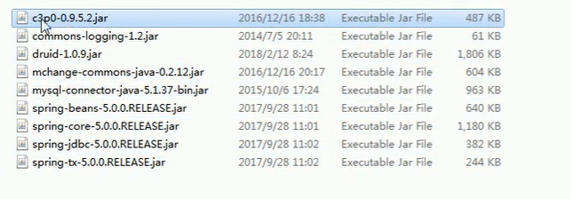
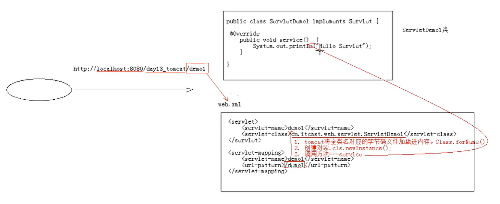
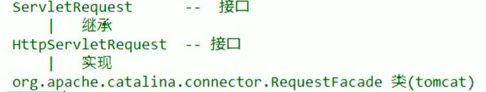

# javaweb

[toc]


## JDBC

定义了所有关系型数据库的规则（接口）

```java
package com.jdbc;

import java.sql.Connection;
import java.sql.DriverManager;
import java.sql.Statement;

public class MysqlJdbc {
    public static void main(String[] args) throws Exception {
        //注册驱动,mysql5以后可以省略注册驱动
        Class.forName("com.mysql.cj.jdbc.Driver");
        //获取数据库连接对象
        Connection con = DriverManager.getConnection("jdbc:mysql://localhost:3306/test","root","219798");
        //定义sql语句
        String sql = "update student set user = '王八蛋' where Telephonenumber=123456789012345678";
        //获取执行sql的对象Ststement
        Statement stem = con.createStatement();
        //执行sql
        int count = stem.executeUpdate(sql);
        //释放资源
        stem.close();
        con.close();
    }
}
```

Java的JDBC（Java Database Connectivity）是一组用于执行SQL语句的Java API，它为多种数据库提供了统一的访问方式。以下是JDBC编程中常用的一些类和接口的简要说明：

### 执行SQL语句的Java API

1. `java.sql.DriverManager`

- **作用**：管理数据库驱动程序的加载与注册。它是JDBC的入口点，用于建立与数据库的连接。
- **常用方法**：
  - `getConnection(String url, String user, String password)`：根据给定的数据库URL、用户名和密码建立数据库连接。
  - url语法：`jdbc:mysql://ip:端口/数据库名称`
  - 本机MySQL服务端口是3306，可以省略ip和端口号：`jdbc:mysql:///数据库名称`

2. `java.sql.Connection`

- **作用**：代表与数据库的连接。所有与数据库交互的操作都是基于这个连接对象进行的。
- **常用方法**：
  - `createStatement()`：创建一个`Statement`对象，用于执行静态SQL语句。
  - `prepareStatement(String sql)`：创建一个`PreparedStatement`对象，用于执行预编译的SQL语句。
  - `prepareCall(String sql)`：创建一个`CallableStatement`对象，用于调用数据库中的存储过程。
  - `close()`：关闭数据库连接。
  - `setAutoCommit(boolean autoCommit)`：开启事务
  - `commit()`：提交事务
  - `eollback()`：回滚事务

3. `java.sql.Statement`

- **作用**：用于执行静态SQL语句并返回结果的对象。
- **常用方法**：
  - `executeQuery(String sql)`：执行查询语句，并返回一个`ResultSet`对象。
  - `executeUpdate(String sql)`：执行INSERT、UPDATE或DELETE语句，返回受影响的行数。
  - `execute(String sql)`：执行SQL语句，根据不同的SQL类型返回不同的结果。

4. `java.sql.PreparedStatement`

- **作用**：预编译的`Statement`，比普通`Statement`更安全且性能更好，因为它允许参数化查询，防止SQL注入。
- **常用方法**与`Statement`类似，额外提供了设置参数的方法，如`setInt(int parameterIndex, int x)`等。

5. `java.sql.ResultSet`

- **作用**：保存查询结果的数据表，是一个游标指向型的数据集合。

- **常用方法**：
  
  - `next()`：移动到下一行。
  
  - `getString(int columnIndex)`、`getInt(int columnIndex)`等：获取当前行指定列的数据。
  
    ```java
    String sql1 = "select * from student";
    ResultSet set = stem.executeQuery(sql1);
    System.out.println(set.getString(2));
    System.out.println(set.getString("password"));
    ```
  
  - 遍历

6. `java.sql.SQLException`

- **作用**：JDBC操作中可能会抛出的异常，用于处理数据库访问过程中发生的错误。

7. `java.sql.CallableStatement`

- **作用**：用于调用数据库存储过程的接口，是`PreparedStatement`的子接口，具有预编译和参数化的特性。
- **常用方法**除了具备`PreparedStatement`的功能外，还提供了`registerOutParameter(int parameterIndex, int sqlType)`等方法来注册输出参数。

在实际开发中，使用JDBC进行数据库操作通常包括以下步骤：
1. 加载数据库驱动。
2. 通过`DriverManager.getConnection()`获取数据库连接。
3. 创建`Statement`、`PreparedStatement`或`CallableStatement`对象。
4. 执行SQL语句。
5. 处理`ResultSet`（如果有的话）。
6. 关闭资源（`ResultSet`、`Statement`、`Connection`）。

==注意，从Java 7开始，推荐使用try-with-resources语句来自动管理资源，确保即使在发生异常时也能正确关闭资源。==

```java
package com.jdbc;

import java.sql.*;

public class MysqlJdbc {
    public static void main(String[] args){
        Connection con =null;
        Statement stem = null;
        try {
            //注册驱动
            //Class.forName("com.mysql.cj.jdbc.Driver");
            //获取数据库连接对象
            con = DriverManager.getConnection("jdbc:mysql://localhost:3306/test", "root", "219798");
            //定义sql语句
            String sql = "update student set user = '王八' where Telephonenumber=123456789012345678";
            String sql1 = "select * from student";
            //获取执行sql的对象Ststement
            stem = con.createStatement();
            //执行sql
            //int count = stem.executeUpdate(sql);
            ResultSet set = stem.executeQuery(sql1);
            while (set.next()) {
                System.out.println(set.getString(2) + "-------" + set.getString("password"));
            }
            //释放资源
        } catch (SQLException e) {
            throw new RuntimeException(e);
        } finally {
        if (stem != null){
            try {
                stem.close();
            } catch (SQLException e) {
                throw new RuntimeException(e);
            }
        }
            if (con != null) {
                try {
                    con.close();
                } catch (SQLException e) {
                    throw new RuntimeException(e);
                }
            }
        }
    }
}
```

### JDBC工具类

* 工具类

```java
package com.jdbc;

import org.junit.After;

import java.io.FileReader;
import java.io.IOException;
import java.net.URL;
import java.sql.*;
import java.util.Properties;

public class JdbcUtils {
    //使用静态代码块，读取配置文件
    private static String url;
    private static String user;
    private static String password;
    private static String driver;
    static {
        try {
        //创建集合
        Properties pro = new Properties();
        //获取src路径下的文件----->类加载器ClassLoader
        ClassLoader classLoader = JdbcUtils.class.getClassLoader();
        //传入文件名获取文件名的URL路径,只能获取src这一级以下的
        URL urlle = classLoader.getResource("jdbc.properties");
        //将URL转换为字符串文件
        String path = urlle.getPath();
        pro.load(new FileReader(path));
        url = pro.getProperty("url");
        user = pro.getProperty("user");
        password = pro.getProperty("password");
        driver = pro.getProperty("driver");
        //注册驱动
        Class.forName(driver);
        } catch (IOException e) {
            throw new RuntimeException(e);
        } catch (ClassNotFoundException e) {
            throw new RuntimeException(e);
        }
    }
    public static Connection getConnection(){
        //使用配置文件的方式连接数据库对象
        try {
            return DriverManager.getConnection(url, user, password);
        } catch (SQLException e) {
            throw new RuntimeException(e);
        }
    }

    public static void close(Connection con,Statement stem){
        if (stem != null){
            try {
                stem.close();
            } catch (SQLException e) {
                throw new RuntimeException(e);
            }
        }
        if (con != null) {
            try {
                con.close();
            } catch (SQLException e) {
                throw new RuntimeException(e);
            }
        }
    }

    public static void close(Connection con, Statement stem, ResultSet set){
        if (stem != null){
            try {
                stem.close();
            } catch (SQLException e) {
                throw new RuntimeException(e);
            }
        }
        if (con != null) {
            try {
                con.close();
            } catch (SQLException e) {
                throw new RuntimeException(e);
            }
        }
        if (set != null) {
            try {
                set.close();
            } catch (SQLException e) {
                throw new RuntimeException(e);
            }
        }
    }
}
```

* 配置文件

```properties
url=jdbc:mysql://localhost:3306/test
user=root
password=219798
driver=com.mysql.cj.jdbc.Driver
```

* 测试类

```java
package com.jdbc;

import java.sql.Connection;
import java.sql.ResultSet;
import java.sql.SQLException;
import java.sql.Statement;

public class JdbcTest {
    public static void main(String[] args) {
        Connection con =null;
        Statement stem = null;
        ResultSet set=null;
        con = JdbcUtils.getConnection();
        String sql = "update student set user = '王八' where Telephonenumber=123456789012345678";
        String sql1 = "select * from student";
        //获取执行sql的对象Ststement
        try {
            stem = con.createStatement();
        //执行sql
        //int count = stem.executeUpdate(sql);
        set = stem.executeQuery(sql1);
        while (set.next()) {
            System.out.println(set.getString(2) + "-------" + set.getString("password"));
        }
        } catch (SQLException e) {
            throw new RuntimeException(e);
        }
        JdbcUtils.close(con,stem,set);
    }
}
```

### Jdbc事务管理

* `PreparedStatement`解决sql注入问题，使用？作为占位符

  1. 定义sql
  2. 获取执行sql执行语句对象
  3. 给？赋值
     * 方法：setXxx（参数1，参数2）
     * Xxx：数据类型
     * 参数1：第几个问号，从1开始
     * 参数2：？的值
  4. 执行sql不需要传值

  ```java
  String sql1 = "select * from student where user=? and password=?";
  pstm = con.prepareStatement(sql1);
  pstm.setString(1,"王八");
  pstm.setString(2,"12345678");
  set = pstm.executeQuery();
  ```

* 使用Connection来进行事务管理

  1. 事务：包含多个步骤的业务操作，如果这个业务被事务管理，则这些步骤要么同时成功，要么同时失败
  2. `setAutoCommit(boolean autoCommit)`：开启事务：在所有操作前开启
  3. `commit()`：提交事务：在所有操作完提交
  4. `eollback()`：回滚事务：再出现异常时回滚

### 数据库连接池

1. 数据源(连接池)作用

   1. 数据源（连接池)是提高程序性能如出现的
   2. 事先实例化数据源，初始化部分连接资源
   3. 使用连接资源时从数据源中获取
   4. 使用完毕后将连接资源归还给数据源
   5. 常见的数据源(连接池)：==DBCP、C3PO、BoneCP、Druid==等

2. 开发步骤

   1. 导包

      

   2. 创建数据源对象

   3. 设置数据源的基本链接数据

3. 手动创建==C3P0==数据源

   ```java
   @Test
       //测试手动创建 c3p0 数据源（两个包）1.c3p0、mchange-commons-java
       public void text2() throws Exception {
           ComboPooledDataSource dataSource = new ComboPooledDataSource();
           dataSource.setDriverClass("com.mysql.jdbc.Driver");
           dataSource.setJdbcUrl("jdbc:mysql://localhost:3306/glwc");
           dataSource.setUser("root");
           dataSource.setPassword("219798");
           Connection connection = dataSource.getConnection();
           System.out.println(connection);
           connection.close();
       }
   ```

4. 手动创建==druid==数据源

   ```java
   @Test
       //测试手动创建 druid 数据源
       public void text3() throws Exception {
           DruidDataSource dataSource = new DruidDataSource();
           dataSource.setDriverClassName("com.mysql.jdbc.Driver");
           dataSource.setUrl("jdbc:mysql://localhost:3306/glwc");
           dataSource.setUsername("root");
           dataSource.setPassword("219798");
           Connection connection = dataSource.getConnection();
           System.out.println(connection);
           connection.close();
       }
   ```

5. 抽取==Jdbc.properties==文件

   * jdbc.properties文件内容

   ```dir
   url=jdbc:mysql://localhost:3306/test
   username=root
   password=219798
   driver=com.mysql.cj.jdbc.Driver
   #初始化连接数
   initialSize=5
   #最大连接数
   maxActive=10
   #最大等待时间
   maxWait=3000
   ```

   * 测试文件

   ```java
   package com.jdbc;
   
   import com.alibaba.druid.pool.DruidDataSourceFactory;
   import org.junit.Test;
   
   import javax.sql.DataSource;
   import java.io.InputStream;
   import java.sql.Connection;
   import java.util.Properties;
   
   public class JsbcDruid {
       @Test
       //测试手动创建 druid 数据源(加载配置文件),druid
       public void text4() throws Exception {
           //读取配置文件
           Properties pro = new Properties();
           InputStream is = JsbcDruid.class.getClassLoader().getResourceAsStream("Jdbc.properties");
           pro.load(is);
           DataSource dataSource = DruidDataSourceFactory.createDataSource(pro);
           Connection connection = dataSource.getConnection();
           System.out.println(connection);
           connection.close();
       }
   }
   
   ```

工具类

1. 提供方法

   1. 获取连接方法
   2. 释放资源
   3. 获取连接池的方法

   ```java
   package com.jdbc;
   
   import com.alibaba.druid.pool.DruidDataSourceFactory;
   
   import javax.sql.DataSource;
   import java.io.IOException;
   import java.io.InputStream;
   import java.sql.Connection;
   import java.sql.ResultSet;
   import java.sql.SQLException;
   import java.sql.Statement;
   import java.util.Properties;
   
   public class JdbcDruidUtils {
       private static DataSource dataSource;
   
       static {
           try {
               Properties pro = new Properties();
               InputStream is = JsbcDruid.class.getClassLoader().getResourceAsStream("Jdbc.properties");
               pro.load(is);
               dataSource = DruidDataSourceFactory.createDataSource(pro);
           } catch (IOException e) {
               throw new RuntimeException(e);
           } catch (Exception e) {
               throw new RuntimeException(e);
           }
       }
       //获取连接
       public static Connection getConnection(){
           try {
               return dataSource.getConnection();
           } catch (SQLException e) {
               throw new RuntimeException(e);
           }
       }
   
       public static void close(Connection connection,Statement statement){
           close(connection,statement,null);
       }
       public static void close(Connection connection, Statement statement ,ResultSet resultSet){
           if (connection != null){
               try {
                   connection.close();
               } catch (SQLException e) {
                   throw new RuntimeException(e);
               }
          }
   
           if (statement != null){
               try {
                   statement.close();
               } catch (SQLException e) {
                   throw new RuntimeException(e);
               }
           }
           if (resultSet != null){
               try {
                   resultSet.close();
               } catch (SQLException e) {
                   throw new RuntimeException(e);
               }
           }
       }
       //获取连接的方法
       public static DataSource getDataSource(){
           return dataSource;
       }
   }
   ```
   
2. 测试

   ```java
   package com.jdbc;
   
   import java.sql.Connection;
   import java.sql.PreparedStatement;
   import java.sql.SQLException;
   
   public class JdbcDruidUtilsTest {
   
       public static void main(String[] args) {
           Connection connection =null;
           PreparedStatement preparedStatement =null;
           try {
               connection = JdbcDruidUtils.getConnection();
               String sql = "insert into student value(?,?,?,?)";
               preparedStatement = connection.prepareStatement(sql);
               preparedStatement.setString(1,"杨攀");
               preparedStatement.setString(2,"510821199809132312");
               preparedStatement.setString(3,"outtuqqwe");
               preparedStatement.setString(4,"18582969757");
               //执行SQl
               preparedStatement.executeUpdate();
           } catch (SQLException e) {
               throw new RuntimeException(e);
           }finally {
            JdbcDruidUtils.close(connection,preparedStatement);
           }
       }
   }

#### JDBCTemplate

1. 需要的包`commons-logging`、`spring-tx`、`spring Beans`、`spring-core`、`spring-jdbc`

2. 测试

   ```java
   JdbcTemplate jdbcTemplate = new JdbcTemplate(JdbcDruidUtils.getDataSource());        
   String sql = "update student set user = ? where studentnumber = 18582969757";
   jdbcTemplate.update(sql,"李苏辛");
   ```

3. 方法

   * `update()`：执行sql语句==增、删、改==

     ```java
     String sql = "update student set user = ? where studentnumber = 18582969757";
     jdbcTemplate.update(sql,"李苏辛");
     ```

   * `queryForMap()`：将查询语句封装成Map集合

     ```java
     String sql ="select * from student where user= ?";        
     Map<String,Object>  map =jdbcTemplate.queryForMap(sql,"李苏辛");//结果集为1
     ```

   * `queryForList()`：将查询语句封装成List集合

     ```java
     String sql ="select * from student where user= ? or user = ?";        
     List<Map<String,Object>> list = jdbcTemplate.queryForList(sql,"李苏辛","王五");
     ```

   * `query()`：将查询语句封装成JavaBean对象

     ```java
     String sql ="select * from student where user= ? or user = ?";        
     List<Posern> list = jdbcTemplate.query(sql,new BeanPropertyRowMapper<Posern>(Posern.class),"李苏辛","王五");

   * `queryForObject()`：将查询语句封装成对象，查询所有记录

     ```java
     String sql = "select count(user) from student";        
     Long tory = jdbcTemplate.queryForObject(sql,Long.class);

## xml

### 基础

**概念：**可扩展标记语言

* 存储数据
  1. 配置文件
  2. 在网络中传输 

**语法：**

1. xml文档的后缀名.xml
2. xml第一行必须定义为文档声明`<?xml version='1.0' ?>`
3. xml文档中有且仅有一个根标签
4. 性值必须使用引号(单双都可)引起来
5. 标签必须正确关闭
6. xml标签名称区分大小写

**组成部分：**

1. **文档声明**

   1. 格式:`<?xml属性列表?>`
   2. 属性列表:
      * version :版本号,必须的属性
      * encoding :编码方式。告知解析引擎当前文档使用的字符集,默认值: ISO-8859-1
      * standalone : 是否独立
        * 取值:
          * yes :不依赖其他文件
          * no:依赖其他文件

2. **指令(了解):结合css的**

   `<?xml-stylesheet type="text/css" href="a.css" ?>`

3. **标签:标签名称自定义的**

   规则:

   1. 名称可以包含字母、数字以及其他的字符
   2. 名称不能以数字或者标点符号开始
   3. 名称不能以字母xml(或者XML、Xml等等)开始
   4. 名称不能包含空格

4. 属性:

   ==id属性值唯一==

5. 文本:

   CDATA区:在该区域中的数据会被原样展示

   格式:`<![CDATA[数据]]>`

### 约束

规定xml文档的书写规则

* 作为框架的使用者(程序员)
  1. 能够在xml中引入约束文档
  2. 能够简单的读懂约束文档.

* 分类:
  1. DTD:一种简单的约束技术
  2. Schema:一种复杂的约束技术
  
* DTD :
  * 引入dtd文档到xml文档中
    * 内部dtd:将约束规则定义在xml文档中
    * 外部dtd:将约束的规则定义在外部的dtd文件中
      * 本地:`<!DOCTYPE 根标签名 SYSTEM "dtd文件的位置">`
      *  网络:`<!DOCTYPE 根标签名 PUBLIC "dtd文件名字”"dtd文件的位置URL">`
    
    ```dtd
    <!ELEMENT students (student*)><!--students为父标签，可以有多个student标签，也可以没有-->
    <!-- <!ELEMENT students (student+)>//students为父标签，最少需要一个student标签 -->
    <!ELEMENT student (name,age,sex)><!-- sutudent标签里面有的标签-->
            <!ELEMENT name (#PCDATA)><!-- 最低一级标签-->
            <!ELEMENT age (#PCDATA)>
            <!ELEMENT sex (#PCDATA)>
    <!ATTLIST student number ID #REQUIRED><!-- student标签拥有一个number属性为ID-->
    ```
  
* schema

  * 解决dtd无法限制内容的缺陷

    ```xml-xsd
    <?xml version="1.0" ?>
    <xsd:schema xmlns="http://www.lisuxin.cn/xml"
                xmlns:xsd="http://www.w3.org/2001/XMLSchema"
                targetNamespace="http://www.lisuxin.cn/xml" elementDefault="qualified">
        <xsd:element name="students" type="studentsType"/>
        <!-- 定义了一个students元素，元素类型为studentsType-->
        <xsd:complexType name="studentsType">
            <!--因为studentsType是自定义类型需要声明-->
            <xsd:sequence>
                <xsd:element name="student" type="studentType" minOccurs="0" maxOccurs="unbounded"/>
                <!-- 定义了一个students元素，元素类型为studentsType,最少出现0次，最多出现unbounded次-->
            </xsd:sequence>
        </xsd:complexType>
        <xsd:complexType name="studentType">
            <xsd:sequence>
                <xsd:element name="name" type="xsd:String"/>
                <xsd:element name="age" type="ageType"/>
                <xsd:element name="sex" type="sexType"/>
            </xsd:sequence>
            <xsd:attribute name="number" type="numberType" use="required"/>
        </xsd:complexType>
        <xsd:simpleType name="sexType">
            <xsd:restriction>
                <base>xsd:String</base>
                <xsd:enumeration value="male"/>
                <xsd:enumeration value="female"/>
            </xsd:restriction>
        </xsd:simpleType>
        <xsd:simpleType name="ageType">
            <xsd:restriction>
                <base>xsd:Integer</base>
                <xsd:minInclusive value="0"/>
                <xsd:maxInclusive value="256"/>
            </xsd:restriction>
        </xsd:simpleType>
        <xsd:simpleType name="numberType">
            <xsd:restriction>
                <base>xsd:String</base>
                <xsd:pattern value="heima_\d{4}"/>
            </xsd:restriction>
        </xsd:simpleType>
    </xsd:schema>
    ```

  * xml

    1. 填写 xml 文档的根元素
    2. 引入xsi前缀`xmlns:xsi="http://www.w3.org/2001/XMLSchema-instance"`
    3. 引入xsd文件命名空间`xsi:schemaLocation = "http://www.lisuxin.cn/xml student.xsd"`
    4. 为每一个 xsd 约束声明一个前缀，作为析识 `xmlns="http://www.lisuxin.cn/xml"`

    ```xml
    <students xmlns:xsi="http://www.w3.org/2001/XMLSchema-instance"
              xmlns="http://www.lisuxin.cn/xml"
              xsi:schemaLocation = "http://www.lisuxin.cn/xml student.xsd">
            
        <a:student number="001">
            <a:name>zzz</a:name>
            <a:age>11</a:age>
            <a:sex>male</a:sex>
        </a:student>
    </students>
    ```

### 解析

* 操作xml文档
  1. 解析：将文档中的数据读取到内存中
  2. 写入：将内存中的数据保存到xml文档中。做持久化存储
  3. 解析xml文档的方式
     1. DOM：将标记语言文档一次加载进内存，在内存中形成一个DOM树
        * 优点：操作方便：可以进行所有crud操作
        * 缺点：一次性加载进内存，消耗内存
     2. SAX：逐行读取，基于事件驱动。
        * 优点：不占内存
        * 缺点：不能读取
  4. 常见解析器
     1. jaxp:两种思想都支持
     2. dom4j:
     3. jsoup:html解析器
     4. pull:sax方式的，安卓内置的
  
* Jsoup

  1. 使用步骤

     1. 导包`jsoup`
     2. 获取对象`docution`
     3. 获取对应标签Element对象
     4. 获取数据

     ```java
     //获取document对象，根据xml文档获取
     //获取xml的path
     String path = JsuopMain.class.getClassLoader().getResource("atudent.xml").getPath();
     //解析xml文档，加载文档进内存，获取Dom树--->Document
     Document document = Jsoup.parse(new File(path), "utf-8");
     //获取Element对象
     Elements name = document.getElementsByTag("name");
     //获取第一个name的Element对象
     Element element = name.get(0);
     //获取数据
     System.out.println(element.text());
     ```

  2. 对象

     * Jsoup：工具类，可以解析html获XML文档，返回Document
       * 方法
       
       * parse：解析html获XML文档，返回Document
         
       * parse(File in,String Charsetname)：解析xml或者html文件的
         
       * parse(String html):解析xml或者html字符串
         
       * parse(URL rul,int timeoutMillis)：通过网络路径获取指定的html或xml文档对象
         
         ```java
         Document document = Jsoup.parse(new File(path), "utf-8");
         
         String str = "<students>\n" +
                         "    <student number=\"001\">\n" +
                         "        <name>zzz</name>\n" +
                         "        <age>11</age>\n" +
                         "        <sex>male</sex>\n" +
                         "    </student>\n" +
                         "    <student number=\"002\">\n" +
                         "        <name>zz1</name>\n" +
                         "        <age>11</age>\n" +
                         "        <sex>mal1</sex>\n" +
                         "    </student>\n" +
                         "</students>";
         Document document = Jsoup.parse(str);
         ```
       
     * Document：文档对象。代表内存中的DOM树
     
       * getElementById(String id)：根据id属性值获取唯一的Element对象
     
       * getElementsByTag(String tagName)：根据标签名称获取元素对象集合
     
       * getElementsByAttribute(String key)：根据属性名称获取元素对象集合
     
       * getElementsByAttributeValue(String key,String value)：根据对应的属性名和属性值获取元素对象集合
     
         ```java
         Document document = Jsoup.parse(new File(path), "utf-8");        
         //获取Element对象
         Elements name = document.getElementsByTag("name");
     
     * Elements：元素的Element对象的集合，可以当做`ArrayList<Element>`来使用
     
     * Element：元素对象
     
       1. 获取子元素对象
     
          * getElementById(String id)：根据id属性值获取唯一的Element对象
          * getElementsByTag(String tagName)：根据标签名称获取元素对象集合
          * getElementsByAttribute(String key)：根据属性名称获取元素对象集合
          * getElementsByAttributeValue(String key,String value)：根据对应的属性名和属性值获取元素对象集合
     
       2. 获取属性值
     
          * String attr(String key)：根据属性名称获取属性值
     
       3. 获取文本内容
     
          * String text()：获取文本内容
          * String html()：获取标签体的所有内容（包括子标签和子标签字符串内容）
     
          ```java
          Elements name = document.getElementsByTag("name");
          String ele_name = name.attr("value");
          name.text();
          name.html();
     
     * Node：节点对象
     
       * 是Document和Element的父类
     
  3. 根据选择器查询
  
     * selector：选择器
  
     * 导包``
  
       ```java
       document.select("name");//标签选择        
       document.select("#it");//id属性
       document.select("student[number=\"001\"]");//获取标签为student且number等于001
       document.select("student[number=\"001\"]>sex");//获取标签为student且number等于001，的sex的子标签
  
  4. 根据Xpath查询
  
     * XPath 是一门在 XML 文档中查找信息的语言。
  
     * 导包`commons-lang3`、`JsoupXpath`
  
       ```java
       //获取document对象，根据xml文档获取
       //获取xml的path
       String path = JsuopMain.class.getClassLoader().getResource("atudent.xml").getPath();
       //解析xml文档，加载文档进内存，获取Dom树--->Document
       Document documents = Jsoup.parse(new File(path), "utf-8");
       //根据document对象创建JXDocument对象
       JXDocument jxDocument = new JXDocument(documents);
       //查询所有student标签
       List<JXNode> jxNodes = jxDocument.selN("//student");
       for (JXNode jxNode : jxNodes) {
           System.out.println(jxNode);    
       }
       ```
  
     * 查询参考手册

## Servlet

* 运行在服务器上的小程序、规则（接口）   
* Servlet就是一个接口，定义了Java类被浏览器访问到（tomcat识别）的规则
* 自定义一个类实现Servlet接口，复写方法

### 快速入门

1. 创建javaee项目

2. 定义一个类，实现`Servlet`接口

3. 实现接口中的抽象方法

   * 提供服务的方法

      ```
      @Override
      public void service(ServletRequest servletRequest, ServletResponse servletResponse) throws ServletException, IOException {
          System.out.println("123");
      }
      ```

4. 配置Servlet

   * 在`web.xml`中配置

      ```xml
      <?xml version="1.0" encoding="UTF-8"?>
      <web-app xmlns="https://jakarta.ee/xml/ns/jakartaee"
               xmlns:xsi="http://www.w3.org/2001/XMLSchema-instance"
               xsi:schemaLocation="https://jakarta.ee/xml/ns/jakartaee https://jakarta.ee/xml/ns/jakartaee/web-app_5_0.xsd"
               version="5.0">
          <!--配置Servlet-->
          <servlet>
              <servlet-name>Demo01</servlet-name>
              <servlet-class>com.wenapp.servlet.ServletDome01</servlet-class>
              <!--tomcat将全类名对应的字节码文件加载进内存。class.forName-->
              <!--创建对象class.newInstance()-->
              <!--调用方法-->
          </servlet>
          <servlet-mapping>
              <servlet-name>Demo01</servlet-name>
              <url-pattern>/Demo01</url-pattern>
          </servlet-mapping>
      </web-app>
      ```

### 执行原理

1. 当服务器接收到浏览器请求后，会解析请求URL路径，获取访问的Servlet的资源路径
2. 查找`web.xml`文件，是否有对应的`<url-pattern>`标签体内容
3. 如果有，则找对应的`<servlet-class>`全类名
4. tomcat会将字节码加载进内存，并创建对象
5. 调用方法



### 生命周期方法

* 生命周期

   1. 创建
      1. 默认情况下，第一次访问被创建
      2. 可以配置创建时机
         1. 第一次访问被创建
            * `<load-on-startup>`值为负数
         2. 在服务器启动的时候被创建
            * `<load-on-startup>`值为0或正整数
      3. servlet 的 init 方 法， 只执行一次，说明一个 servlet 在内存中只存在一个对象， servlet是单例的
         * 多个用户同时访问时，可能存在线程安全问题。
         * 解决：尽量不要在 servlet 中定义成员变量。即使定义了成员变量，也不要对修改值
   2. 提供服务
   3. 被销毁

   ```java
    /**
        * 初始化方法
        * 在Servlet被创建时，执行，只会执行一次
        * @param servletConfig
        * @throws ServletException
        */
       @Override
       public void init(ServletConfig servletConfig) throws ServletException {
   
       }
   
    /**
        * 提供服务的方法
        * 每一次Servlet被访问时执行，执行多次
        * @param servletRequest
        * @param servletResponse
        * @throws ServletException
        * @throws IOException
        */
       @Override
       public void service(ServletRequest servletRequest, ServletResponse servletResponse) throws ServletException, IOException {
   
       }
   
    /**
        * 销毁方法
        * 在服务器关闭时执行，只执行一次
        */
       @Override
       public void destroy() {
   
       }

* 其他方法

   ```java
   /**
        * 获取ServletConfig对象
        * ServletConfig：Servlet的配置对象
        * @return
        */
       @Override
       public ServletConfig getServletConfig() {
           return null;
       }
   
   /**
        * 获取servlet信息，版本等等
        * @return
        */
       @Override
       public String getServletInfo() {
           return null;
       }

### 注解配置

* servlet3.0以上:不使用xml配置

   ```java
   @WebServlet(urlPatterns = "/Demo03")//写在类名上面
   @WebServlet("/Demo03")
   @WebServlet("访问资源路径")
   ```

### 体系结构

`servlet接口`—>`Genericserv1et抽象类`—>`Httpservlet抽象类`

* Genericserv1et ：将 servlet 接囗中其他的方法做了默认空实现，只将 service() 方法作为抽象

   * 将来定义 servlet 类时，可以继承 Genericserv1et, 实现 service() 方法即可

* HttpServlet ：对 http 协议的一种封装，简化操作. 

   1. 定义类继承Httpserv1et
   2. 复写 d0Get/dopost 方法

   ```java
   public class D0Getdopost extends HttpServlet {
       @Override
       protected void doGet(HttpServletRequest req, HttpServletResponse resp) throws ServletException, IOException {
           super.doGet(req, resp);
       }
   
       @Override
       protected void doPost(HttpServletRequest req, HttpServletResponse resp) throws ServletException, IOException {
           super.doPost(req, resp);
       }
   }

### servlet配置

* urlpartten:servlet访问路径
   1. 一个 servlet 可以定义多个访问路径路径`@webservlet （{" /d4" ，" /dd4"}`
   2. 定义规则：
      1. `/xxx`
      2. `/xxx/xxx` ：多层路径，目录结构
      3. `*.do`

### HTTP

* 既念： `Hyper Text Transfer Protoc01` 超文本传输协议
   * 传输协议：定义了，客户端和服务器端通信时，发送数据的格式
   * 特点:
      1. 基于 TCP / IP 的高级协议
      2. 默认端囗号：80
      3. 基于请求/响应模型的：一次请求对应一次响应
      4. 无状态的：每次请求之间相互独立，不能交互数据
   * 历史版本：
      * 1.0：每一次请求响应都会建立新的连接
      * 1.1：复用连接
* 请求消息数据格式
   1. 请求行
      * 请求方式 请求url 请求协议/版本
      * GET /login .html HTTP/1.1
         * 请求方式：
            * HTTP 协议有7中请求方式，常用的有 2 种
               * GET ：
                  1. 请求参数在请求行中，在 url 后。
                  2. 请求的 url 长度有限制的
                  3. 不太安全
               * POST ：
                  1. 请求参数在请求体中
                  2. 请求的 url 长度没有限制的
                  3. 相对安全
   2. 请求头：客户端浏览器告诉服务器一些信息
      * 请求头名称：请求头值
      * 常见的请求头
         1. `User-Agent` ：浏览器告诉服务器，我访问你使用的浏览器版本信息
            * 可以在服务器端获取该头的信息，解决浏览器的兼容性问题
         2. `Referer` ： `http：//localhost/login.html`
            * 告诉服务器，我（当前请求）从哪里来？
               * 作用：
                  1. 防盗链
                  2. 统计工作
   3. 请求空行
      * 空行
   4. 请求体（正文）
      * 封装 POST 请求消息的请求参数的
* 响应消息数据格式
   * 响应行_状态码
   * 响应头

### Request

==请求消息数据==

1. request对象和response对象的原理

   * request 和 response对象是由服务器创建的。我们来使用它们
   * request 对是来获取请求消息，response 对是来设置响应消息

2. request对象继承体系结构

   

   #### request 功能

   **获取请求消息数据**

   1. 获取请求行数据

      ==GET /day14/dem01?name=zhangsan HTTP/1.1==

      方法：

      1. 获取求方式： GET：
      
         * `String getMethod()`
      
      2. 获取虚拟目录： /虚拟目录名称 
      
         * `string getContextPath()`
      
      3. 获取 Servlet 路径： /demo1
      
         *  `string getServletPath()`
      
      4. 获取 get 方式请求参数： name=zhangsan
      
         * `string getQueryString()`
      
      5. 获取求 URI ： /dayla/demo1
         *  `string getRequestURI()` ：/dayla/demo1
         * `StringBuffer getRequestURL()`：http:/ locaIhost/day14/dem01
      
      6. 获取协议及版本： HTTP/1.1：
      
         * `string getprotocol()`
      
      7. 获取客户机的 IP 地址：
      
         * `string getRemoteAddr()`
      
         ```java
         package com.wenapp.request;
         
         import jakarta.servlet.ServletException;
         import jakarta.servlet.annotation.WebServlet;
         import jakarta.servlet.http.HttpServlet;
         import jakarta.servlet.http.HttpServletRequest;
         import jakarta.servlet.http.HttpServletResponse;
         
         import java.io.IOException;
         
         @WebServlet("/Demo1")
         public class Rquest extends HttpServlet {
             @Override
             protected void doGet(HttpServletRequest req, HttpServletResponse resp) throws ServletException, IOException {
                 System.out.println(req.getMethod());
                 System.out.println(req.getContextPath());
                 System.out.println(req.getServletPath());
                 System.out.println(req.getQueryString());
                 System.out.println(req.getRequestURI());
                 System.out.println(req.getRequestURL());
             }
         
             @Override
             protected void doPost(HttpServletRequest req, HttpServletResponse resp) throws ServletException, IOException {
         
             }
         }

   2. 获取请求头数据

      方法：

      * `string getHeader(string name)` ：诵过求头的名称获取旧求头的值 
      * `Enumeration<String> getHeaderNames()` ：获取所有的求头名称

   3. 获取请求体数据
      * 请求体：只有 ==POST==请求方式，才有请求体，在请求体中封装了 POST 请求的请求爹数
      
      * 步骤：
         1. 获取流对象
            * `BufferedReader getReader()` ：获取字符输入流，只能作字符数据
            * `servletlnputstream getlnputstream()` ：获取字节输入流，可以作所有类型数据
         
         2. 在从流对象中拿数据
         
            ```java
            package main.java.com.wenapp.request;
            
            import jakarta.servlet.*;
            import jakarta.servlet.http.*;
            import jakarta.servlet.annotation.*;
            
            import java.io.BufferedReader;
            import java.io.IOException;
            
            @WebServlet(name = "Requsetdome", value = "/Requsetdome")
            public class Requsetdome extends HttpServlet {
                @Override
                protected void doGet(HttpServletRequest request, HttpServletResponse response) throws ServletException, IOException {
            
                }
            
                @Override
                protected void doPost(HttpServletRequest request, HttpServletResponse response) throws ServletException, IOException {
                    BufferedReader br = request.getReader();
                    String line=null;
                    while ((line = br.readLine()) != null){
                        System.out.println(line);
                    }
                }
            }
   
   **其他功能**
   
   1. 获取请求参数通用方式：不论get 还是 post 请求方式都可以使用下列方法来获取请求参数
      * `String getParameter(String name)` ：根据数名称获取参数值 username=zs&password=123
   
      * `string[] getparametervalues(string name)` ：根据数名称获取值的数组 hobby=xx&hobby=game
   
      * `Enumeration<String> getparameterNames()` ：获取所有请求参数的参数名称
   
      * `Map<String,String[]> getparametermap()` ：获取所有参数的 map 集合
   
      * 中文乱码：在获取参数前`request.setCharacterEncoding("utf-8");`
   
      * `hasMoreElements()`方法
   
         * 作用**：`hasMoreElements()` 方法返回一个布尔值，表示是否还有更多的元素可以获取。如果是 `true`，则表示调用 `nextElement()` 方法会成功返回下一个元素；如果是 `false`，则表示已经没有更多的元素，再调用 `nextElement()` 可能会抛出 `NoSuchElementException` 异常。**
         * 用途**：通常与 `nextElement()` 方法一起使用，在循环中遍历集合的元素，直到没有更多元素为止。
   
         ```java
         @WebServlet(name = "Tongyong", value = "/Tongyong")
         public class Tongyong extends HttpServlet {
             @Override
             protected void doGet(HttpServletRequest request, HttpServletResponse response) throws ServletException, IOException {
                 this.doPost(request,response);
             }
         
             @Override
             protected void doPost(HttpServletRequest request, HttpServletResponse response) throws ServletException, IOException {
                 //根据参数名称获取参数值
                 String username = request.getParameter("username");
                 System.out.println(username);
                 System.out.println("-------------------------");
                 //根据参数名称获取参数值的数组
                 String[] hobbies = request.getParameterValues("hobby");
                 for (String hobby : hobbies) {
                     System.out.println(hobby);
                 }
                 System.out.println("-------------------------");
                 //获取所有请求的参数名称
                 Enumeration<String> parameterNames = request.getParameterNames();
                 while (parameterNames.hasMoreElements()){
                     String name = parameterNames.nextElement();
                     System.out.println(name);
                     System.out.println(request.getParameter(name));
                 }
                 System.out.println("-------------------------");
                 //获取所有参数的Map集合
                 Map<String, String[]> parameterMap = request.getParameterMap();
                 Set<String> strings = parameterMap.keySet();
                 for (String string : strings) {
                     //获取键获取值
                     String[] strings1 = parameterMap.get(string);
                     System.out.println(strings1);
                     for (String s : strings1) {
                         System.out.println(s);
                     }
                 }
         
             }
         }
   
   2. 请求转发
   
      1. 通过 request 对象获取请求转发器对象：`RequestDispatcher getRequestDispatcher(String path)`
   
      2. 使用 RequestDispatcher 对象来进行转发：`forward(servletRequest request ，servletResponse response ）`
   
         ```java
         request.getRequestDispatcher("转发地址").forward(request,response);
         ```
   
      3. 特点
   
         1. 浏览器地址栏路径不生变化
         2. 只能转茇到当前服器内部资源中
         3. 转是一次请求
   
   3. 共享数据
   
      * 域对象：一个有作范的对象，可以在厄过内共享数据
   
      * reqdest域 ：代表一次请求的范围，一般用于请求转友的多个资源中共享数据
   
      * 方法：
         1. void setAttribute (String name,Object Obj) ：存储数据
         2. Object getAttitude(String name) ：通过获取值
         3. void removeAttribute( String name) ：通过移除监对
         
         ```java
         //存储
         request.setAttribute("name","zhangsan");
         //获取
         request.getAttribute("name");
         ```
   
   4. 获取`servletContext`：`request.getServletContext();`
   
   5. 在idea中新建无servlet需要在==文件和代码模板==中添加
   
   6. 登录方法
   
      ```java
      package denglu.jdbc;
      
      import denglu.dao.User;
      import org.springframework.dao.DataAccessException;
      import org.springframework.jdbc.core.BeanPropertyRowMapper;
      import org.springframework.jdbc.core.JdbcTemplate;
      
      public class UserDao {
          //声明JdbcTemplate对象共用
          private JdbcTemplate template = new JdbcTemplate(denglu.jdbc.JdbcUtils.getDataSource());
      
          //登录方法
          public User login(User loginuser) {
              try {
                  String sql = "select * from student where username = ? and password = ?";
                  User user = template.queryForObject(sql,
                          new BeanPropertyRowMapper<User>(User.class),
                          loginuser.getUsername(), loginuser.getPassword());
                  return user;
              } catch (DataAccessException e) {
                  return null;
              }
          }
      }
      ```
   
   7. 步骤
   
      1. 创建数据库
      2. 创建实体类
      3. 创建数据库连接池
      4. 创建`sql访问`方法类
      5. 使用servlet进行访问sql类
   
   8. BeanUtils,简化数据封装==包==`commons-beanutils`
   
      ```java
      //获取所有请求参数
              Map<String, String[]> parameterMap = request.getParameterMap();
              //创建user对象
              User loginusers = new User();
              //使用BeanUtils封装
              try {
                  BeanUtils.populate(loginusers,parameterMap);
              } catch (IllegalAccessException e) {
                  throw new RuntimeException(e);
              } catch (InvocationTargetException e) {
                  throw new RuntimeException(e);
              }
      ```
   
      * 用于封装JavaBean的
      * JavaBean标准的 java 类
         1. 要求：
            1. 类必须被 public 修饰
            2. 必须提供空参的构造器
            3. 成员变量必须使用 private 修饰
            4. 提供公共 setter 和 getter 方法
         2. 功能：封装数据
      * 概念：
         * 成员变量
         * 属性： setter 和 getter 方法截取后的产物
            * 例如： getusername 〈）．> username——> username
      * 方法
         1. setproperty()
         2. getproperty()
         3. populate(Object 0bj,Map map) ：将 map 集合的键值对信息，封装到对应的 javaBean 对象中
   

### Respons

==响应消息数据==


### ServletContext

## Cookie

## Session

## JSON

## AJAX

## redis

## Jedis

## Nginx
