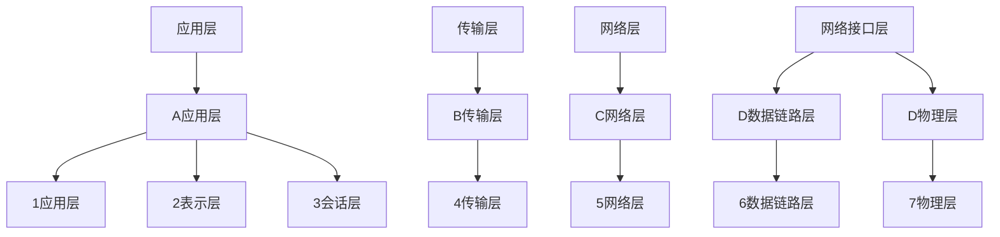
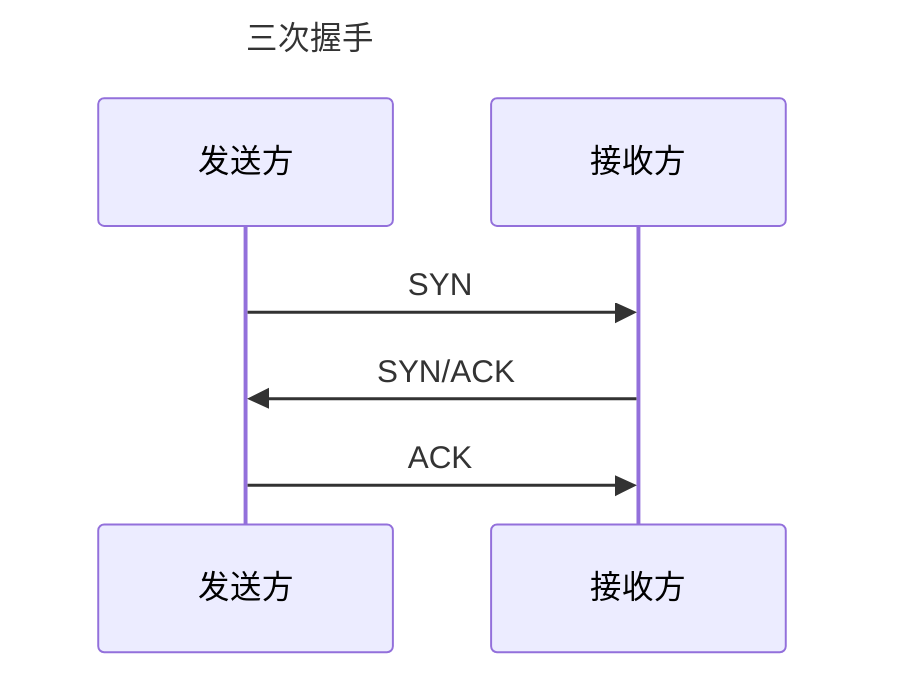
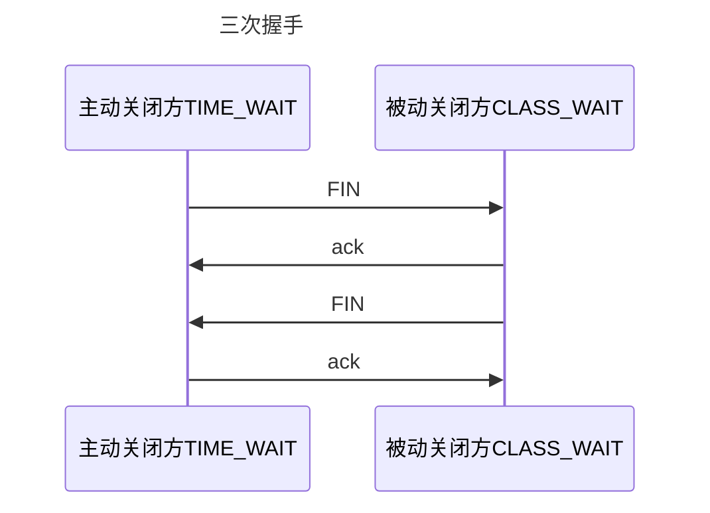

[toc]

## 一、Java基础篇

### 1.接口和抽象类的区别

（1）抽象类可以有构造方法，而接口没有

（2）抽象类可以有抽象方法和具体方法，接口只能有抽象方法

（3）抽象类的成员4种权限修饰符都可以修饰，接口只能用private

### 2.重载和重写的区别

重载发生在同一个类中，方法名相同、参数列表、返回类型、权限修饰符可以不同

重写发生在子类中，方法名相、参数列表、返回类型都相同，权限修饰符要大于父类方法，声明异常范围要小于父类方法，但是final和private修饰的方法不可重写

### 3. == 和equals的区别

==比较基本类型，比较的是值，==比较引用类型，比较的是内存地址

equlas是Object类的方法，本质上与==一样，但是有些类重写了equals方法，比如String的equals被重写后，比较的是内存地址，另外重写了equlas后，也必须重写hashcode()方法

### 4.异常处理机制

（1）使用try、catch、finaly捕获异常，finaly中的代码一定会执行，捕获异常后程序会继续执行

（2）使用throws声明该方法可能会抛出的异常类型，出现异常后，程序终止

### 5. HashMap原理

1.`HashMap`在`Jdk1.8`以后是基于数组+链表+红黑树来实现的，特点是，key不能重复，可以为null，线程不安全

2.`HashMap`的扩容机制：

`HashMap`的默认容量为16，默认的负载因子为0.75，当`HashMap`中元素个数超过容量乘以负载因子的个数时，就创建一个大小为前一次两倍的新数组，再将原来数组中的数据复制到新数组中。当数组长度到达64且链表长度大于8时，链表转为红黑树

3.`HashMap`存取原理：

（1）计算key的hash值，然后进行二次hash，根据二次hash结果找到对应的索引位置

（2）如果这个位置有值，先进性equals比较，若结果为true则取代该元素，若结果为false，就使用高低位平移法将节点插入链表（JDK8以前使用头插法，但是头插法在并发扩容时可能会造成环形链表或数据丢失，而高低位平移发会发生数据覆盖的情况）

### 6.想要线程安全的HashMap怎么办？

（1）使用ConcurrentHashMap

（2）使用HashTable

（3）Collections.synchronizedHashMap()方法

### 7. ConcurrentHashMap原如何保证的线程安全？

JDK1.7:使用分段锁，将一个Map分为了16个段，每个段都是一个小的hashmap，每次操作只对其中一个段加锁

JDK1.8:采用CAS+Synchronized保证线程安全，每次插入数据时判断在当前数组下标是否是第一次插入，是就通过CAS方式插入，然后判断f.hash是否=-1，是的话就说明其他线程正在进行扩容，当前线程也会参与扩容；删除方法用了synchronized修饰，保证并发下移除元素安全

### 8. HashTable与HashMap的区别

（1）HashTable的每个方法都用synchronized修饰，因此是线程安全的，但同时读写效率很低

（2）HashTable的Key不允许为null

（3）HashTable只对key进行一次hash，HashMap进行了两次Hash

（4）HashTable底层使用的数组加链表

### 9. ArrayList和LinkedList的区别

ArratList的底层使用动态数组，默认容量为10，当元素数量到达容量时，生成一个新的数组，大小为前一次的1.5倍，然后将原来的数组copy过来；

因为数组有索引，所以ArrayList查找数据更快，但是添加数据效率更低

LinkedList的底层使用链表，在内存中是离散的，没有扩容机制；LinkedList在查找数据时需要从头遍历，所以查找慢，但是添加数据效率更高

### 10.如何保证ArrayList的线程安全？

（1）使用collentions.synchronizedList（）方法为ArrayList加锁

（2）使用Vector，Vector底层与Arraylist相同，但是每个方法都由synchronized修饰，速度很慢

（3）使用juc下的CopyOnWriterArrayList，该类实现了读操作不加锁，写操作时为list创建一个副本，期间其它线程读取的都是原本list，写操作都在副本中进行，写入完成后，再将指针指向副本。

### 11. String、StringBuffer、StringBuilder的区别

String 由 char[] 数组构成，使用了 final 修饰，对 String 进行改变时每次都会新生成一个 String 对象，然后把指针指向新的引用对象。

StringBuffer可变并且线程安全；

StringBuiler不可变并且线程不安全。

操作少量字符数据用 String；单线程操作大量数据用 StringBuilder；多线程操作大量数据用 StringBuffer

### 12. java、只有值传递

值传递：对形参的修改不会影响实参

引用传递：对形参的修改能够影响实参

## 二.Java多线程篇

### 1.进程和线程的区别

进程：系统运行的基本单位，包含多个线程

线程：独立运行的最小单位，是进程的实体，多个线程共享同一进程内的系统资源

### 2. 什么是线程上下文切换

当一个线程被剥夺cpu使用权时，切换到另外一个线程执行

### 3.什么是死锁

死锁指多个线程在执行过程中，因争夺资源造成的一种相互等待的僵局

### 4.死锁的必要条件

互斥条件：同一资源同时只能由一个线程读取

不可抢占条件：不能强行剥夺线程占有的资源

请求和保持条件：请求其他资源的同时对自己手中的资源保持不放

循环等待条件：在相互等待资源的过程中，形成一个闭环

想要预防死锁，只需要破坏其中一个条件即可，银行家算法可以预防死锁

### 5. Synchrpnized和lock的区别

（1）synchronized是关键字，lock是一个类

（2） synchronized在发生异常时会自动释放锁，lock需要手动释放锁

（3）synchronized是可重入锁、非公平锁、不可中断锁，lock是可重入锁，可中断锁，可以是公平锁

### 6. sleep()和wait()的区别

(1)wait()是Object的方法，sleep()是Thread类的方法

(2)wait()会释放锁，sleep()不会释放锁

(3)wait()要在同步方法或者同步代码块中执行，sleep()没有限制

(4)wait()要调用notify()或notifyall()唤醒,sleep()自动唤醒

### 7. yield()和join()区别

yield()调用后线程进入就绪状态

A线程中调用B线程的join() ,则B执行完前A进入阻塞状态

### 8.线程池七大参数

核心线程数：线程池中的基本线程数量

最大线程数：当阻塞队列满了之后，逐一启动

最大线程的存活时间：当阻塞队列的任务执行完后，最大线长的回收时间

最大线程的存活时间单位

阻塞队列：当核心线程满后，后面来的任务都进入阻塞队列

线程工厂：用于生产线程

任务拒绝策略：阻塞队列满后，拒绝任务，有四种策略（1）抛异常（2）丢弃任务不抛异常（3）打回任务（4）尝试与最老的线程竞争

### 9.Java内存模型

JMM（Java内存模型 ）屏蔽了各种硬件和操作系统的内存访问差异，实现让Java程序在各平台下都能达到一致的内存访问效果，它定义了JVM如何将程序中的变量在主存中读取

具体定义为：所有变量都存在主存中，主存是线程共享区域；每个线程都有自己独有的工作内存，线程想要操作变量必须从主从中copy变量到自己的工作区，每个线程的工作内存是相互隔离的

由于主存与工作内存之间有读写延迟，且读写不是原子性操作，所以会有线程安全问题

### 10.保证并发安全的三大特性？

原子性：一次或多次操作在执行期间不被其他线程影响

可见性：当一个线程在工作内存修改了变量，其他线程能立刻知道

有序性：JVM对指令的优化会让指令执行顺序改变，有序性是禁止指令重排

### 11. volatile

保证变量的可见性和有序性，不保证原子性。使用了 volatile 修饰变量后，在变量修改后会立即同步到主存中，每次用这个变量前会从主存刷新。

单例模式双重校验锁变量为什么使用 volatile 修饰？ 禁止 JVM 指令重排序，new Object()分为三个步骤：申请内存空间，将内存空间引用赋值给变量，变量初始化。如果不禁止重排序，有可能得到一个未经初始化的变量。

### 12.线程使用方式

(1)继承 Tread 类

(2)实现 Runnable 接口

(3)实现 Callable 接口：带有返回值

### 13. ThreadLocal原理

原理是为每个线程创建变量副本，不同线程之间不可见，保证线程安全。每个线程内部都维护了一个Map，key为threadLocal实例，value为要保存的副本。

但是使用ThreadLocal会存在内存泄露问题，因为key为弱引用，而value为强引用，每次gc时key都会回收，而value不会被回收。所以为了解决内存泄漏问题，可以在每次使用完后删除value或者使用static修饰ThreadLocal，可以随时获取value

### 14.什么是CAS锁

CAS锁可以保证原子性，思想是更新内存时会判断内存值是否被别人修改过，如果没有就直接更新。如果被修改，就重新获取值，直到更新完成为止。这样的缺点是

（1）只能支持一个变量的原子操作，不能保证整个代码块的原子操作

（2）CAS频繁失败导致CPU开销大

（3）ABS问题:线程1和线程2同时去修改一个变量，将值从A改为B，但线程1突然阻塞，此时线程2将A改为B,然后线程3又将B改成A,此时线程1将A又改为B,这个过程线程2是不知道的，这就是ABA问题，可以通过版本号或时间戳解决

### 15. Synchronized锁原理和优化

Synchronize是通过对象头的markwordk来表明监视器的，监视器本质是依赖操作系统的互斥锁实现的。操作系统实现线程切换要从用户态切换为核心态，成本很高，此时这种锁叫重量级锁，在JDK1.6以后引入了偏向锁、轻量级锁、重量级锁

偏向锁：当一段代码没有别的线程访问，此时线程去访问会直接获取偏向锁

轻量级锁：当锁是偏向锁时，有另外一个线程来访问，偏向锁会升级为轻量级锁，这个线程会通过自旋方式不断获取锁，不会阻塞，提高性能

重量级锁：轻量级锁自旋一段时间后线程还没有获取到锁，线程就会进入阻塞状态，该锁会升级为重量级锁，重量级锁时，来竞争锁的所有线程都会阻塞，性能降低

注意，锁只能升级不能降级

### 16. JUC常用辅助类

CountDownLatch:设定一个数，当调用CountDown()时数量减一，当调用await() 时判断计数器是否为0，不为0就阻塞，直到计数器为0

CyclicBarrier：设定一个数,当调用await() 时判断计数器是否达到目标值，未达到就阻塞，直到计数器达到目标值

Semaphore:设定一个信号量，当调用acquire()时判断是否还有信号，有就信号量减一线程继续执行，没有就阻塞等待其他线程释放信号量，当调用release()时释放信号量，唤醒阻塞线程

### 17.如何根据 CPU 核心数设计线程池线程数量

IO 密集型：核心数*2

计算密集型： 核心数+1

为什么加 1？即使当计算密集型的线程偶尔由于缺失故障或者其他原因而暂停时，这个额外的线程也能确保 CPU 的时钟周期不会被浪费。

## 三.JVM篇

### 1. JVM运行时数据区（内存结构）

线程私有区：

（1）虚拟机栈：每次调用方法都会在虚拟机栈中产生一个栈帧，每个栈帧中都有方法的参数、局部变量、方法出口等信息，方法执行完毕后释放栈帧

（2）本地方法栈：为native修饰的本地方法提供的空间，在HotSpot中与虚拟机合二为一

（3）程序计数器：保存指令执行的地址，方便线程切回后能继续执行代码

线程共享区：

（4）堆内存：Jvm进行垃圾回收的主要区域，存放对象信息，分为新生代和老年代

（5）方法区：存放类信息、静态变量、常量、运行时常量池等信息。JDK1.8之前用持久代实现，JDK1.8后用元空间实现，元空间使用的是本地内存，而非在JVM内存结构中

### 2.什么情况下会内存溢出？

堆内存溢出：（1）当对象一直创建而不被回收时（2）加载的类越来越多时（3)虚拟机栈的线程越来越多时

栈溢出：方法调用次数过多，一般是递归不当造成

### 3. JVM有哪些垃圾回收算法？

（1）标记清除算法： 标记不需要回收的对象，然后清除没有标记的对象，会造成许多内存碎片。

（2）复制算法： 将内存分为两块，只使用一块，进行垃圾回收时，先将存活的对象复制到另一块区域，然后清空之前的区域。用在新生代

（3）标记整理算法： 与标记清除算法类似，但是在标记之后，将存活对象向一端移动，然后清除边界外的垃圾对象。用在老年代

### 4. GC如何判断对象可以被回收？

（1）引用计数法：已淘汰，为每个对象添加引用计数器，引用为0时判定可以回收，会有两个对象相互引用无法回收的问题

（2）可达性分析法：从GCRoot开始往下搜索，搜索过的路径称为引用链，若一个对象GCRoot没有任何的引用链，则判定可以回收

GCRoot有：虚拟机栈中引用的对象，方法区中静态变量引用的对象，本地方法栈中引用的对象

### 5.典型垃圾回收器

G1 ：JDK1.9以后的默认垃圾回收器，支持并发，采用标记整理+复制算法，注重响应速度

### 6.类加载器和双亲委派机制

从父类加载器到子类加载器分别为：

BootStrapClassLoader 加载路径为：JAVA_HOME/jre/lib

ExtensionClassLoader 加载路径为：JAVA_HOME/jre/lib/ext

ApplicationClassLoader 加载路径为：classpath

还有一个自定义类加载器

当一个类加载器收到类加载请求时，会先把这个请求交给父类加载器处理，若父类加载器找不到该类，再由自己去寻找。该机制可以避免类被重复加载，还可以避免系统级别的类被篡改

### 7.类加载过程

（1）加载 ：加载字节码文件，将字节码中的静态变量和常量转换到方法区中，在堆中生成class对象作为方法区入口

（2）连接：

验证：验证字节码文件的正确性。

准备：正式为类变量在方法区中分配内存，并设置初始值。

解析：将符号引用（如类的全限定名）解析为直接引用（类在实际内存中的地址）。（）

（3）初始化 ：执行类构造器（不是常规的构造方法），为静态变量赋初值并初始化静态代码块。

### 8. JVM中有哪些引用？

强引用：new的对象。哪怕内存溢出也不会回收

软引用：只有内存不足时才会回收

弱引用：每次垃圾回收都会回收

虚引用：必须配合引用队列使用，一般用于追踪垃圾回收动作

### 9.对象头中有哪些信息

对象头中有两部分，一部分是MarkWork,存储对象运行时的数据，如GC分代年龄、GC标记、锁的状态、线程ID等；另外一部分是指向对象类型的指针，如果是数组，还有一个部分存放数组长度

### 10. JVM内存参数

-Xmx[]:堆空间最大内存

-Xms[]:堆空间最小内存，一般设置成跟堆空间最大内存一样的

-Xmn[]:新生代的最大内存

-xx[use 垃圾回收器名称]：指定垃圾回收器

-xss:设置单个线程栈大小

一般设堆空间为最大可用物理地址的百分之80

### 11. JVM类初始化顺序

父类静态代码块和静态成员变量->子类静态代码块和静态成员变量->父类代码块和普通成员变量->父类构造方法->子类代码块和普成员变量->子类构造方法

## 四.Mysql篇

### 1. MyIAm和InnoDB的区别

InnoDB支持事务，MyIAm不支持

`InnoDB`支持外键，`MyIAm`不支持

`InnoDB`是聚簇索引，`MyIAm`是非聚簇索引

`InnoDB`支持行锁和表锁，`MyIAm`只支持表锁

`InnoDB`不支持全文索引，`MyIAm`支持

`InnoDB`支持自增和`MVCC`模式的读写，`MyIAm`不支持

### 2. mysql事务特性

原子性：一个事务内的操作统一成功或失败

一致性：事务前后的数据总量不变

隔离性：事务与事务之间相互不影响

持久性：事务一旦提交发生的改变不可逆

### 3.事务靠什么保证

原子性：由undolog日志保证，他记录了需要回滚的日志信息，回滚时撤销已执行的sql

一致性：由其他三大特性共同保证，是事务的目的

隔离性：由MVCC保证

持久性：由redolog日志和内存保证，mysql修改数据时内存和redolog会记录操作，宕机时可恢复

### 4.事务的隔离级别

在高并发情况下，并发事务会产生脏读、不可重复读、幻读问题，这时需要用隔离级别来控制

读未提交： 允许一个事务读取另一个事务已提交的数据，可能出现不可重复读，幻读。

读提交： 只允许事务读取另一个事务没有提交的数据可能出现不可重复读，幻读。

可重复读： 确保同一字段多次读取结果一致，可能出现欢幻读。

可串行化： 所有事务逐次执行，没有并发问日

Inno DB 默认隔离级别为可重复读级别，分为快照度和当前读，并且通过间隙锁解决了幻读问题。

### 5.什么是快照读和当前读

*快照读读取的是当前数据的可见版本，可能是会过期数据，不加锁的select就是快照都

*当前读读取的是数据的最新版本，并且当前读返回的记录都会上锁，保证其他事务不会并发修改这条记录。如update、insert、delete、select for undate（排他锁）、select lockin share mode（共享锁） 都是当前读

### 6.MVCC是什么

MVCC是多版本并发控制，为每次事务生成一个新版本数据，每个事务都由自己的版本，从而不加锁就决绝读写冲突，这种读叫做快照读。只在读已提交和可重复读中生效。

实现原理由四个东西保证，他们是

undolog日志：记录了数据历史版本

readView:事务进行快照读时产生的视图，记录了当前系统中活跃的事务id，控制哪个历史版本对当前事务可见

隐藏字段DB_TRC_ID： 最近修改记录的事务ID

隐藏字段DB_Roll_PTR： 回滚指针，配合undolog指向数据的上一个版本

### 7. MySQL有哪些索引

主键索引：一张表只能有一个主键索引，主键索引列不能有空值和重复值

唯一索引：唯一索引不能有相同值，但允许为空

普通索引：允许出现重复值

组合索引：对多个字段建立一个联合索引，减少索引开销，遵循最左匹配原则

全文索引：myisam引擎支持，通过建立倒排索引提升检索效率，广泛用于搜索引擎

### 8.聚簇索引和非聚簇索引的区别

聚簇索引：将索引和值放在了一起，根据索引可以直接获取值，如果主键值很大的话，辅助索引也会变得很大

非聚簇索引：叶子节点存放的是数据行地址，先根据索引找到数据地址，再根据地址去找数据

他们都是b+数结构

### 9.B和B+数的区别，为什么使用B+数

二叉树：索引字段有序，极端情况会变成链表形式

AVL数：树的高度不可控

B数：控制了树的高度，但是索引值和data都分布在每个具体的节点当中，若要进行范围查询，要进行多次回溯，IO开销大

B+树：非叶子节点只存储索引值，叶子节点再存储索引+具体数据，从小到大用链表连接在一起，范围查询可直接遍历不需要回溯7

### 10. MySQL有哪些锁

基于粒度：

*表级锁：对整张表加锁，粒度大并发小

*行级锁：对行加锁，粒度小并发大

*间隙锁：间隙锁，锁住表的一个区间，间隙锁之间不会冲突只在可重复读下才生效，解决了幻读

基于属性：

*共享锁：又称读锁，一个事务为表加了读锁，其它事务只能加读锁，不能加写锁

*排他锁：又称写锁，一个事务加写锁之后，其他事务不能再加任何锁，避免脏读问题

### 11. MySQL如果做慢查询优化

（1）分析sql语句，是否加载了不需要的数据列

（2）分析sql执行计划，字段有没有索引，索引是否失效，是否用对索引

（3）表中数据是否太大，是不是要分库分表

### 12.哪些情况索引会失效

（1）where条件中有or，除非所有查询条件都有索引，否则失效

（2）like查询用%开头，索引失效

（3）索引列参与计算，索引失效

（4）违背最左匹配原则，索引失效

（5）索引字段发生类型转换，索引失效

（6）mysql觉得全表扫描更快时（数据少），索引失效

### 13. Mysql内连接、左连接、右连接的区别

内连接取量表交集部分，左连接取左表全部右表匹部分，右连接取右表全部坐表匹部分

## 五.Spring系列(spring全家桶)

### 1. Bean 的作用域

（1）Singleton:一个IOC容器只有一个

（2）Prototype:每次调用getBean()都会生成一个新的对象

（3）request:每个http请求都会创建一个自己的bean

（4）session:同一个session共享一个实例

（5）application:整个serverContext只有一个bean

（6）webSocket:一个websocket只有一个bean

### 2. Bean 生命周期

实例化 Instantiation->属性赋值 Populate->初始化 Initialization->销毁 Destruction

在这四步的基础上面，Spring 提供了一些拓展点：

*Bean 自身的方法: 包括了 Bean 本身调用的方法和通过配置文件中的 init-method 和 destroy-method 指定的方法

*Bean 级生命周期接口方法:包括了 BeanNameAware、BeanFactoryAware、InitializingBean 和 DiposableBean 这些接口的方法

*容器级生命周期接口方法:包括了 InstantiationAwareBeanPostProcessor 和 BeanPostProcessor 这两个接口实现，一般称它们的实现类为“后处理器”。

*工厂后处理器接口方法: 包括了 AspectJWeavingEnabler, ConfigurationClassPostProcessor, CustomAutowireConfigurer 等等非常有用的工厂后处理器接口的方法。工厂后处理器也是容器级的。在应用上下文装配配置文件之后立即调用。

### 3. Spring 事务原理？

spring事务有编程式和声明式，我们一般使用声明式，在某个方法上增加@Transactional注解，这个方法中的sql会统一成功或失败。

原理是：

当一个方法加上@Transactional注解，spring会基于这个类生成一个代理对象并将这个代理对象作为bean，当使用这个bean中的方法时，如果存在@Transactional注解，就会将事务自动提交设为false，然后执行方法，执行过程没有异常则提交，有异常则回滚、

### 4.spring事务失效场景

（1）事务方法所在的类没有加载到容器中

（2）事务方法不是public类型

（3）同一类中，一个没有添加事务的方法调用另外以一个添加事务的方法，事务不生效

（4）spring事务默认只回滚运行时异常，可以用rollbackfor属性设置

（5）业务自己捕获了异常，事务会认为程序正常秩序

### 5. spring事务的隔离级别

default:默认级别，使用数据库自定义的隔离级别

其它四种隔离级别与mysql一样

### 6. spring事务的传播行为

（1）支持当前事务，如果不存在，则新启一个事务

（2）支持当前事务，如果不存在，则抛出异常

（3）支持当前事务，如果不存在，则以非事务方式执行

（4）不支持当前事务，创建一个新事物

（5）不支持当前事务，如果已存在事务就抛异常

（6）不支持当前事务，始终以非事务方式执行

### 7. Spring IoC

### 8. spring用了哪些设计模式

`BeanFactory`用了工厂模式，`AOP`用了动态代理模式，`RestTemplate`用来模板方法模式，`SpringMVC`中`handlerAdaper`用来适配器模式，Spring里的监听器用了观察者模式

### 9. SpringMV工作原理

`SpringMVC`工作过程围绕着前端控制器`DispatchServerlet`，几个重要组件有`HandleMapping`（处理器映射器）、`HandleAdapter`（处理器适配器）、`ViewReslover`（试图解析器）

工作流程：

（1）DispatchServerlet接收用户请求将请求发送给HandleMapping

（2）HandleMapping根据请求url找到具体的handle和拦截器，返回给DispatchServerlet

（3）DispatchServerlet调用HandleAdapter,HandleAdapter执行具体的controller，并将controller返回的ModelAndView返回给DispatchServler

（4）DispatchServerlet将ModelAndView传给ViewReslover,ViewReslover解析后返回具体view

（5）DispatchServerlet根据view进行视图渲染，返回给用户

### 10. springboot自动配置原理

启动类`@SpringbootApplication`注解下，有三个关键注解

（1）`@springbootConfiguration`:表示启动类是一个自动配置类

（2）`@CompontScan`:扫描启动类所在包外的组件到容器中

（3）`@EnableConfigutarion`:最关键的一个注解，他拥有两个子注解，其中`@AutoConfigurationpackageu`会将启动类所在包下的所有组件到容器中，`@Import`会导入一个自动配置文件选择器，他会去加载META_INF目录下的`spring.factories`文件，这个文件中存放很大自动配置类的全类名，这些类会根据元注解的装配条件生效，生效的类就会被实例化，加载到`ioc容器`中

### 11. springboot常用注解

`@RestController` ：修饰类，该控制器会返回Json数据

`@RequestMapping("/path")` ：修饰类，该控制器的请求路径

`@Autowired `: 修饰属性，按照类型进行依赖注入

`@PathVariable` : 修饰参数，将路径值映射到参数上

`@ResponseBody` :修饰方法，该方法会返回`Json`数据

`@RequestBody`（需要使用Post提交方式） :修饰参数，将`Json`数据封装到对应参数中

`@Controller@Service@Compont`: 将类注册到`ioc`容器

## 六.Redis系列

### 1. redis为什么快？

（1）完全基于内存操作，数据都存在内存中

（2）采用单线程，避免了不必要的上下文切换带来的性能问题，也不用考虑锁的问题

（3）基于非阻塞的io多路复用机制

（4）数据结构简单，对数据操作简单

### 2. redis持久化机制

（1）快照持久化RDB

redis的默认持久化机制，通过父进程fork一个子进程，子进程将redis的数据快照写入一个临时文件，等待持久化完毕后替换上一次的rdb文件。整个过程主进程不进行任何的io操作。持久化策略可以通过save配置单位时间内执行多少次操作触发持久化。所以RDB的优点是保证redis性能最大化，恢复速度数据较快，缺点是可能会丢失两次持久化之间的数据

（2）追加持久化`AOF`

以日志形式记录每一次的写入和删除操作，策略有每秒同步、每次操作同步、不同步，优点是数据完整性高，缺点是运行效率低，恢复时间长

### 3. Redis如何实现key的过期删除？

采用的定期过期+惰性过期

定期删除 ：Redis 每隔一段时间从设置过期时间的 key 集合中，随机抽取一些 key ，检查是否过期，如果已经过期做删除处理。

惰性删除 ：Redis 在 key 被访问的时候检查 key 是否过期，如果过期则删除。

### 4. Redis数据类型

String 常用命令： set,get,decr,incr,mget等

Hash 常用命令： hget,hset,hgetall 等

List 常用命令： lpush,rpush,lpop,rpop,lrange 等

Set 常用命令： sadd,spop,smembers,sunion 等

SortSet 常用命令： zadd,zrange,zrem,zcard 等

### 5. Redis缓存穿透如何解决？

缓存穿透是指频繁请求客户端和缓存中都不存在的数据，缓存永远不生效，请求都到达了数据库。

解决方案：

（1）在接口上做基础校验，比如id<=0就拦截

（2）缓存空对象：找不到的数据也缓存起来，并设置过期时间，可能会造成短期不一致

（3）布隆过滤器：在客户端和缓存之间添加一个过滤器，拦截掉一定不存在的数据请求

### 6. Redis如何解决缓存击穿？

缓存击穿是值一个key非常热点，key在某一瞬间失效，导致大量请求到达数据库

解决方案：

（1）设置热点数据永不过期

（2）给缓存重建的业务加上互斥锁，缺点是性能低

### 7. Redis如何解决缓存雪崩？

缓存雪崩是值某一时间Key同时失效或redis宕机，导致大量请求到达数据库

解决方案：

（1）搭建集群保证高可用

（2）进行数据预热，给不同的key设置随机的过期时间

（3）给缓存业务添加限流降级，通过加锁或队列控制操作redis的线程数量

（4）给业务添加多级缓存

### 8. Redis分布式锁的实现原理

原理是使用setnx+setex命令来实现，但是会有一系列问题：

（1）任务时常超过缓存时间，锁自动释放。可以使用Redision看门狗解决

（2）加锁和释放锁的不是同一线程。可以在Value中存入uuid，删除时进行验证。但是要注意验证锁和删除锁也不是一个原子性操作，可以用lua脚本使之成为原子性操作

（3）不可重入。可以使用Redision解决（实现机制类似AQS,计数）

（4）redis集群下主节点宕机导致锁丢失。使用红锁解决

### 9. Redis集群方案

(1)主从模式：个master节点，多个slave节点，master节点宕机slave自动变成主节点

(2)哨兵模式：在主从集群基础上添加哨兵节点或哨兵集群，用于监控master节点健康状态，通过投票机制选择slave成为主节点

(3)分片集群：主从模式和哨兵模式解决了并发读的问题，但没有解决并发写的问题，因此有了分片集群。分片集群有多个master节点并且不同master保存不同的数据，master之间通过ping相互监测健康状态。客户端请求任意一个节点都会转发到正确节点，因为每个master都被映射到0-16384个插槽上，集群的key是根据key的hash值与插槽绑定

### 10. Redis集群主从同步原理

主从同步第一次是全量同步：slave第一次请求master节点会根据replid判断是否是第一次同步，是的话master会生成RDB发送给slave。

后续为增量同步：在发送RDB期间，会产生一个缓存区间记录发送RDB期间产生的新的命令,slave节点在加载完后，会持续读取缓存区间中的数据

### 11. Redis缓存一致性解决方案

更新数据库时把缓存给删除是最优方案，可以更大概率避免并发问题，但是依旧会有缓存删除失败的问题。可以使用分布式事务，或者在删除失败后把key发送到rabbitMQ中进行异步删除重试

## 七、计算机网络系列

### 1. TCP/IP模型

### 2.浏览器输入地址后做了什么？

<table>
    <tr>
        <td style="text-align: center;">过程</td>
        <td style="text-align: center;">使用的协议</td>
    </tr>
    <tr>
        <td style="text-align: center;">1.浏览器查找域名或ip地址
             {DNS查找过程：浏览器缓存、路由器缓存、DNS缓存}
        </td>
        <td rowspan="2">DNS：获取域名对应IP</td>
    </tr>
    <tr>
        <td style="text-align: center;">2.浏览器向web服务器发送一个HTTP请求
             {cookies会随着请求发给服务器}</td>
    </tr>
    <tr>
        <td style="text-align: center;">3.服务器处理请求
             {请求 处理请求 & 他当场参数cookles,生成一个HTML响应}
        </td>
        <td rowspan="3">
            .TCP：与服务器建立TCP链接
             .IP：建立TCP协议时，需要发送数据，发送数据在网络层使用IP协议
             .OPSF：IP数据包在路由器之间，路由选择使用OPSF协议
             .ARP：路由器在与服务器通信时，需要将ip地址转换为MAC地址，需要使用ARP协议
             .HTTP：在TCP建立完成后，使用HTTP协议访问网页
        </td>
    </tr>
    <tr>
        <td style="text-align: center;">
            4.服务器发回一个HTML响应
        </td>
    </tr>
     <tr>
        <td style="text-align: center;">
            5.浏览器开始显示HTML
         </td>
    </tr>
</table>

### 3.三次握手

### 4.为什么TCP不能两次握手

假设是两次握手，若客户端发起的连接请求阻塞在网络中，会造成该报文的重传，这时服务收到连接请求后会立刻进入连接状态，当双方传输完数据结束连接后，第一次阻塞的请求突然又到达了服务端，此时服务端又进入连接状态，而客户端不会响应服务端的连接确认报文

### 5. TCP四次挥手

### 6.为什么要进入时间等待状态？

若客户端发送确认释放包后直接关闭，而服务端因为某种原因没有收到客户端的确认释放包，就会一直发送确认请求，而客户端永远不会再响应该请求。

### 7.TCP 滑动窗口

TCP 流量控制，主要使用滑动窗口协议，滑动窗口是接受数据端使用的窗口大小，用来告诉发送端接收端的缓存大小，以此可以控制发送端发送数据的大小，从而达到流量控制的目的。如果TCP发送方收到接收方的零窗口通知后，会启动持续计时器。计时器超时后向接收方发送零窗口探测报文，如果响应仍为0，就重新计时，不为0就打破死锁

### 8.TCP拥塞控制

发送方会维护一个拥塞窗口大小的状态变量，大小取决于网络的拥塞程度。发送方的发送窗口大小是取接收方接收窗口和拥塞窗口中较小的一个

拥塞控制有四种算法：

慢开始：从小到大主键发送窗口，每收到一个确认报文窗口大小指数增长

拥塞避免：当窗口大小到达一定阈值时，转为拥塞避免，每收到一个确认报文窗口大小+1。若此时网络超时，就把阈值调小一半，重新慢开始

快重传：要求接收方收到请求后要立即回复

快恢复：发送方连续收到多个确认时，就把拥塞避免阈值减小，然后直接开始拥塞避免

### 9.TCP超时重传

发送方在发送按数据后一定时间内没有收到接收方响应报文，就会重新发送刚刚的报文，接收到收到报文后会对该报文的序列号进行检验，已存在就抛弃

### 10.TCP可靠传输的实现

TCP是靠滑动窗口协议和连续ARQ协议配合流量控制和拥塞控制来保证的可靠传输。

ARQ是停止等待协议和自动重传请求，它规定TCP要为每一次传输的包编号，每发送一个包，要等待对方确认后才能发送下一个分组，若一段时间对方没有确认，就重新发送刚刚的报文。接收方会对数据包排序，把有序数据传给应用层，返回缺失的第一个ACK确认序列号给发送方,接收到收到报文后会对该报文的序列号进行检验，重复就丢弃。

流量控制是.....拥塞窗口上......（上面已经说了）

### 11.TCP报头有哪些信息

### **12.状态码**

1xx:请求正在处理

2xx:请求成功处理

3xx:请求重定向 301：永久重定向 302：临时重定向 304：使用本地缓存

4xx:客户端错误 400：请求格式错误 403：没有访问权限 404：请求资源不存在

5xx:服务端错误

### 13.socket通信流程

（1）服务端创建socket并调用bind()方法绑定ip和端口号

（2）服务端调用listen()方法建立监听，此时服务的scoket还没有打开

（3）客户端创建socket并调用connect()方法像服务端请求连接

（4）服务端socket监听到客户端请求后，被动打开，调用accept()方法接收客户端连接请求，当accept()方法接收到客户端connect()方法返回的响应成功的信息后，连接成功

（5）客户端向socket写入请求信息，服务端读取信息

（6）客户端调用close()结束链接，服务端监听到释放连接请求后，也结束链接

## 八.linux系列

### 1.linux常用命令

ifconfig:查看网络接口详情

ping：查看与某主机是否能联通

ps -ef|grep 进程名称：查看进程号

lost -i 端口 ：查看端口占用情况

top:查看系统负载情况，包括系统时间、系统所有进程状态、cpu情况

free:查看内存占用情况

kill:正常杀死进程，发出的信号可能会被阻塞

kill -9:强制杀死进程，发送的是exit命令，不会被阻塞

### 2.linux的io模型

IO是数据的读取和写入，用户进程读取一次IO请求分为两个阶段：等待数据到达内核缓冲区和将内核空间数据拷贝到进程空间，当用户去内核中拷贝数据时，要从用户态转为核心态

5中io模型:

### (1)同步阻塞IO模型

用户进程发起io调用后会被阻塞，等待内核数据准备完毕时就被唤醒，将内核数据复制到用户进程。这两个阶段都是阻塞的

### (2)同步非阻塞IO模型

用户进程发起IO调用后，若内核数据还未准备好，进程不会被阻塞,而是给用户进程返回一个error，进程会继续干别的事，每隔一段时间就去看看内核数据是否准备好。不过将内核数据复制到用户进程这个阶段依旧是阻塞的

### (3)IO多路复用模型

同步非阻塞IO要不停的查看内核中数据是否准备好，十分消耗cpu。IO多路复用让一个线程去监控一个fd文件，每个用户进程都有一个fd文件描述符，将自己的文件描述符写入这个fd文件，当某个用户进程需要的数据准备好后，这个线程就去通知用户进程。

### (4)信号IO模型

当用户进程发起IO调用后，会向内核注册一个信号处理函数，进程不会被阻塞，当内核数据准备就绪时就返回一个信号给用户进程，进程就可以直接在这个信号处理函数中获取内核数据进行拷贝。拷贝这个阶段依旧是阻塞的

### （5）异步非阻塞模型

前面四种全是同步的。进程在发起IO调用后，无论数据是否到达，都直接返回结果。内核数据准备好时，由内核将数据复制给用户进程。两个阶段都是非阻塞的
