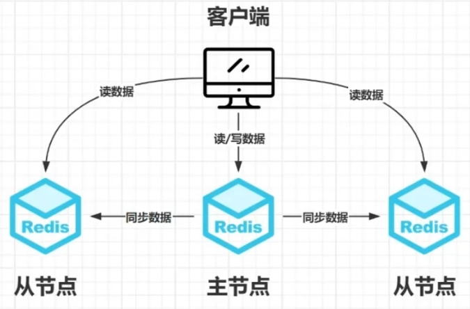
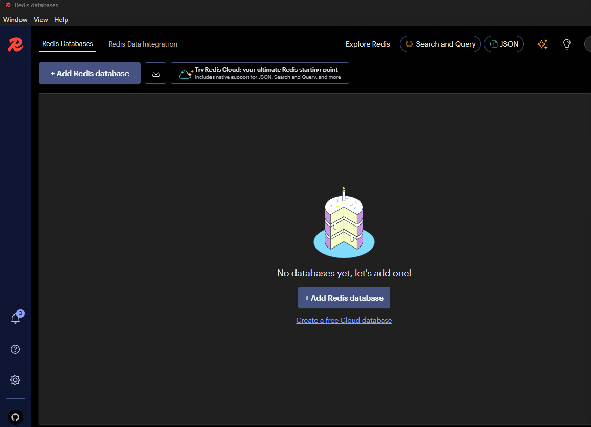
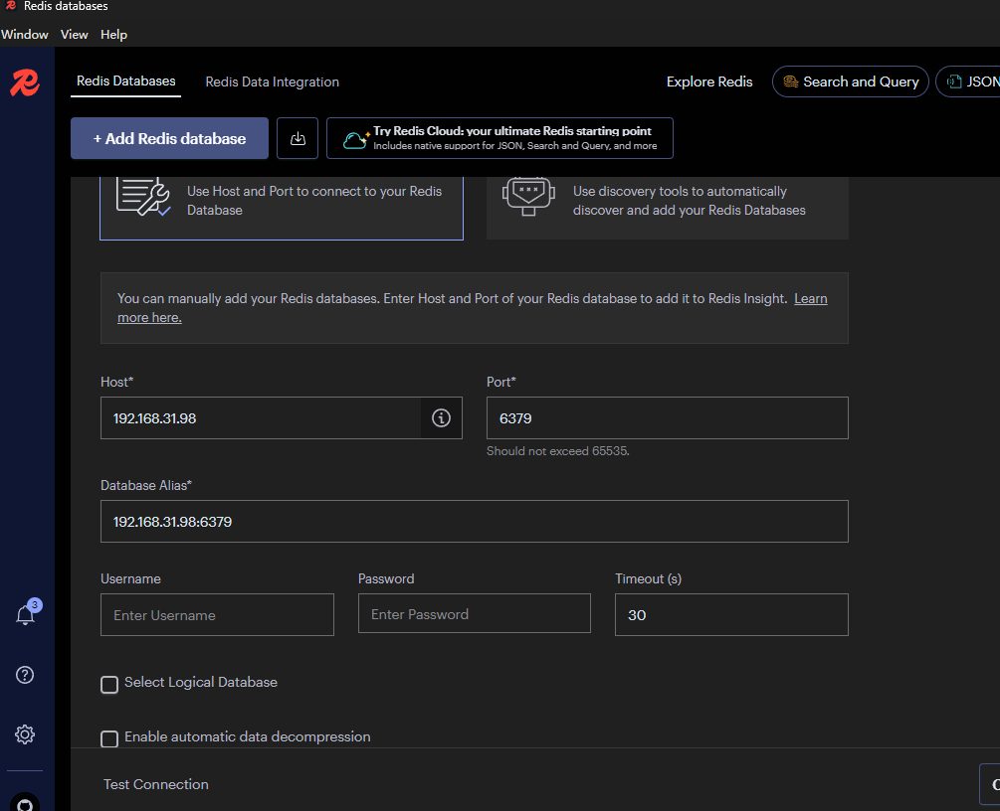

[toc]

1. redis

   ==Redis 是一个基于内存的 key-value 键值存储的、可持久化的数据库，并目提供了非常丰富的数据结构，同时还支持非常丰富的功能==

# 部署

==在linux环境下安装Redis==

Redis多种部署模式，每种模式特定的用途和优缺点。

**单机部署**

* **定义**：
   * 单机部署是指在一个单独的服务器上运行一个Redis实例。
   * **特点**：
   * **简单**：配置简单，易于管理和维护。
   * **性能**：性能较高，因为没有额外的网络开销。
   * **可靠性**：可靠性较低，一旦该服务器出现故障，整个系统将不可用。
   * **扩展性**：难以水平扩展，存储容量和处理能力受限于单台服务器。
   * **适用场景**：
   * 适用于小型项目或测试环境，对数据可靠性和高可用性要求不高。

**主从部署**

* **定义**：
   * 主从部署是指一个主节点（Master）和一个或多个从节点（Slave）的部署模式。主节点负责写操作，从节点负责读操作。
   * **特点**：
   * **读写分离**：主节点处理写操作，从节点处理读操作，可以分担读取压力。
   * **数据备份**：从节点可以作为数据备份，提高数据的可靠性。
   * **故障恢复**：主节点故障时，可以通过手动或自动切换到从节点继续服务。
   * **复杂度**：配置相对简单，但需要管理主从同步和故障切换。
   * **适用场景**：
   * 适用于中型项目，对读性能有一定要求，但对高可用性和数据一致性要求不是特别高的场景。

**哨兵部署**

* **定义**：
   * 哨兵部署是在主从部署的基础上，引入哨兵（Sentinel）来实现自动故障检测和恢复。
   * **特点**：
   * **自动故障检测**：哨兵会持续监控主从节点的健康状态，检测故障。
   * **自动故障转移**：当主节点故障时，哨兵会自动将其中一个从节点提升为主节点，保证服务的连续性。
   * **高可用性**：提高了系统的高可用性，减少了人工干预。
   * **复杂度**：配置和管理相对复杂，需要配置哨兵节点和主从节点。
   * **适用场景**：
   * 适用于对高可用性要求较高的场景，特别是在主节点故障时需要快速恢复服务的情况。

**集群部署**

* **定义**：
   * 集群部署是指多个Redis节点组成的分布式系统，每个节点负责一部分数据，通过分片（Sharding）实现数据的水平扩展。
   * **特点**：
   * **水平扩展**：可以通过增加节点来扩展存储容量和处理能力。
   * **高可用性**：每个分片都有多个副本，可以实现数据冗余和故障恢复。
   * **复杂度**：配置和管理较为复杂，需要处理数据分片、节点通信和故障恢复等问题。
   * **性能**：在网络良好的情况下，性能较好，但在跨节点操作时可能会有额外的网络开销。
   * **适用场景**：
   * 适用于大型项目，对数据容量和处理能力有高要求，且需要高可用性的场景。

**总结**

- **单机部署**：简单易用，适合小规模或测试环境。
- **主从部署**：读写分离，提高读性能，适合中型项目。
- **哨兵部署**：自动故障检测和恢复，提高高可用性，适合对高可用性有较高要求的场景。
- **集群部署**：水平扩展，高可用性，适合大规模项目。

## 防火墙

在生产环境中，建议不要直接卸载防火墙，而是应该适当地配置防火墙规则，以允许Redis服务所需的端口（默认为6379）通过。这样做可以确保你的Redis实例既能够对外提供服务，又不会因为开放了不必要的端口而增加安全风险。

以下是在不同类型的防火墙中开放Redis端口的基本步骤：

**对于`iptables`防火墙：**

1. 打开终端。
2. 输入命令来添加新的规则，允许Redis的默认端口6379：
   ```
   sudo iptables -A INPUT -p tcp --dport 6379 -j ACCEPT
   ```
3. 保存iptables规则：
   - 在某些发行版中，可以使用 `sudo service iptables save` 或者 `sudo iptables-save > /etc/iptables/rules.v4`。
4. 重启iptables服务以应用更改：
   ```
   sudo systemctl restart iptables
   ```

**对于`firewalld`防火墙：**

1. 打开终端。
2. 使用以下命令来添加端口到公共区域：
   ```
   sudo firewall-cmd --zone=public --add-port=6379/tcp --permanent
   ```
3. 重新加载firewalld配置以使更改生效：
   ```
   sudo firewall-cmd --reload
   ```

通过以上步骤，你可以确保Redis能够在保持防火墙开启的情况下正常运行，同时减少潜在的安全威胁。

## 单机部署

### 检查安装gcc环境

==Redis是由C语言编写，它的运行环境需要C环境,因此需要安装gcc==

```bash
--关闭防火墙
systemctl stop firewalld.service
--状态
firewall-cmd --state
--卸载防火墙
yum remove firewalld(测试环境)

--检查版本
gcc --version
--安装gcc
yum install gcc
```

### 下载安装Redis

```bash
--安装文件归类
mkdir -p /opt/software/redis

--进入redis文件夹，使用wget下载
cd /opt/software/redis
wget https://download.redis.io/redis-stable.tar.gz

--解压下载的redis包
tar -zxvf redis-stable.tar.gz

--进入redis-stable目录，然后使用make install编译并安装，安装完成后 /usr/local/bin会生成相应服务
cd redis-stable
make install

--检查是否成功生成
ll /usr/local/bin
```

* 文件介绍
   * `redis-benchmark`：性能测试工具
   * `redis-check-aof`：修复有问题的aof文件
   * `redis-check-rdb`：修复有问题的rdb文件
   * `redis-sentinel`：redis集群使用
   * `redis-server`：Redis服务器启动命令
   * `redis-cli`：客户端操作入口

### 启动Redis

到这里其实我们可以在使用 /opt/software/redis/redis-stable/src 或者 /usr/local/bin 目录下的 `redis-server` 启动redis服务了

```bash
--Redis源码路径下启动
./src/redis-server

--使用usr/local/bin路径下启动（该目录下）
redis-server
```

1. 启动报错

   ```
   28779:C 26 Nov 2024 05:57:22.596 # WARNING Memory overcommit must be enabled! Without it, a background save or replication may fail under low memory condition. Being disabled, it can also cause failures without low memory condition, see https://github.com/jemalloc/jemalloc/issues/1328. To fix this issue add 'vm.overcommit_memory = 1' to /etc/sysctl.conf and then reboot or run the command 'sysctl vm.overcommit_memory=1' for this to take effect.
   28779:C 26 Nov 2024 05:57:22.596 * oO0OoO0OoO0Oo Redis is starting oO0OoO0OoO0Oo
   28779:C 26 Nov 2024 05:57:22.596 * Redis version=7.4.1, bits=64, commit=00000000, modified=0, pid=28779, just started
   28779:C 26 Nov 2024 05:57:22.596 # Warning: no config file specified, using the default config. In order to specify a config file use redis-server /path/to/redis.conf
   28779:M 26 Nov 2024 05:57:22.596 # Failed to configure LOCALE for invalid locale name.
   ```

2. **方法一：**临时更改

   * 更改 `LC_COLLATE`，可以直接在命令行中设置环境变量。例如，将其更改为 `C`（默认排序方式）或者 `en_US.UTF-8`，可以使用如下命令：这种方法只对当前的 shell 会话有效，一旦关闭终端窗口或注销登录，设置就会失效。

     ```bash
     export LC_COLLATE=C
     在 C locale 中，字符串排序是基于字节值的，即 ASCII 码值。这意味着排序是按字符的二进制值进行的，而不是根据特定语言的规则。
     或者
     export LC_COLLATE=en_US.UTF-8
     ```

3.  **方法二：**永久更改

   * 编辑 `~/.bashrc`这个文件中的设置仅影响特定用户的 shell 会话。

     ```bash
     使用文本编辑器打开 `~/.bashrc` 文件：
     vi ~/.bashrc
     在文件末尾添加：
     export LC_COLLATE=C
     保存并退出编辑器。
     让更改生效，可以重新加载 `.bashrc` 文件：
     source ~/.bashrc
     ```

   * 验证更改、无论选择哪种方法，都可以通过运行 `locale` 命令来验证更改是否成功：

     ```bash
     locale
     ```

### 配置Redis

前面的启动方式无法再后台运行，退出之后直接关闭了 Redis 服务，所以我们还需要针对 Redis 做一些设置。

```bash
--修改当前Redis目录下的Redis.conf文件
vim Redis.conf
```

需要修改的内容如下：如果大家使用 vim 打开后没有行号，可以在打开 vim 后输入：`": set number"`

```bash
bind * -::*                      #87行，修改bind项，* -::*支持远程链接
daemonize yes                    #309行，开启守护进程，后台运行
logfile /opt/software/redis/redis-stable/redis.log   #355行，指定日志文件目录
dir /opt/software/redis          #510行，指定工作目录
requirepass 密码                 #1044行，给默认用户设置密码，主要是使用redis-cli连接redis-server时，需要通过密码进行链接
protected-mode no                #111行，允许远程连接       如果不设置密码必须将此设置关闭。
```

修改完成后，使用配置文件启动 Redis, 并使用 redis-cli 连接测试，需要注意由于前面我们配置了安全密码，所以连接后需要先验证密码，否则会报错。

```bash
--使用redis.conf配置文件的方式启动
redis-server redis.conf
--关闭redis
redis-cli shutdown
--远程链接
redis-cli -h redis所在地址 -p redis的端口（默认6379） -a 用户密码
```

写入和输出

```bash
set
get
# 查看所有
keys *
```


## 主从部署（响度均衡）



主从部署，是指将一台 Redis 服务器的数据，复制到其他的 Redis 服务器。前者称为主节点 (Master), 后者称为从节点（ Slave ）；数据的复制是单向的，只能由主节点到从节点。默认情况下，每台 Redis 服务器都是主节点；且一个主节点可以有多个从节点（或没有从节点 ), 但一个从节点只能有一个主节点。

**主从部署的作用**

* 数据冗余：主从复制实现了数据的热备份，是持久化之外的一种数据冗余方式。
* 故障恢复：当主节点出现问题时，可以由从节点提供服务，实现快速的故障恢复；实际上是一种服务的冗余。
* 负载均衡：在主从复制的基础上，配合读写分离，可以由主节点提供写服务，由从节点提供读服务（即写 Redis 数据时应用连接主节点，读 Redis 数据时应用连接从节点），分担服务器负载；尤其是在写少读多的场景下，通过多个从节点分担读负载，可以大大提高 Redis 服务器的并发量。
* 高可用基石：除了上述作用以夕卜，主从复制还是哨兵和集群能够实施的基础，因此说主从复制是 Redis 高可用的基础。

**配置**

1. 在主节点与从节点同样安装redis,配置与主节点一样

2. 在从节点的redis.conf文件中加入配置

   ```bash
   # 进入安装目录
   cd redis-stable
   # 找到replicaof添加配置
   replicaof 主节点IP地址 端口
   # --add-port=6379/tcp表示放行6379端口的tcp访问，--permanent表示永久生效
   firewall-cmd --zone=public --add-port=6379/tcp --permanent
   #重新载入防火墙规则使其生效
   firewall-cmd --reload
   ```

3. 查看主节点（从节点）信息

   ```bash
   # 从节点不支持写的请求
   info replication
   ```

## 哨兵部署（响度均衡）

1. 每个机器都安装redis按照配置配置完，配置主从部署

2. 在每一个机器上都修改redis安装目录下的`sentinel.conf`配置文件，配置完成后最先启动主节点

   ```bash
   protected-mode no                                                             # 关闭保护模式
   daemonize yes                                                                 # 指定sentinel为后台启动
   logfile "安装目录redis/sentinel.log"                                           # 指定日志存放路径
   dir /opt/                                                                     # 指定数据库存放路径
   sentinel monitor mymaster 主节点IP 端口 需要几个配置同意主节点已失效，才执行故障转移  # 修改，指定该哨兵监控主节点
   sentinel down-after-milliseconds mymaster 时间毫秒                             # 判定服务器 down 掉的时间周期，默认 30000 毫秒（30秒）
   sentinel failover-timeout mymaster 时间毫秒                                    # 故障节点的最大超时时间为 180000 （180秒）
   ```

3. 启动redis哨兵

   ```bash
   redis-server redis.conf
   redis-sentinel sentinel.conf
   ```

4. 查看哨兵状态

   ```bash
   # 清除不再存在的 Sentinel 实例
   redis-cli -p 26379 sentinel reset mymaster
   # 查看哨兵状态
   redis-cli -p 26379 info sentinel
   # 查看所有（主）从服务器状态
   redis-cli -p 26379 sentinel slaves mymaster
   ```

5. 查看当前节点信息

   ```
   redis-cli info replication
   ```

6. 关闭哨兵

   ```
   redis-cli shutdown
   redis-cli -p 26379 shutdown
   ```

## 集群部署（响度均衡）

==Redis 集群部署是一种通过将数据分布到多个 Redis 实例上来实现高可用性和水平扩展的架构。与单个 Redis 实例相比，集群部署可以提供更高的性能、更好的容错能力和更大的存储容量。Redis 集群通过分片（sharding）和复制（replication）来实现这些特性。==

1. 创建每个节点信息的存储目录(配置文件文件夹)（每个节点都创建）

   ```bash
   mkdir -p 地址/文件夹名
   mkdir -p /export/server/redis-stable/cluster
   mkdir -p /export/server/redis/cluster
   ```

2. 在配置文件文件夹里面创建两个不同端口的配置文件

   ```bash
   vim redis安装目录/cluster/redis_端口.conf
   vim ./cluster/redis_6379.conf
   vim ./cluster/redis_6380.conf
   ```

3. 配置文件内容

   ```bash
   # 6379与6380配置仅仅端口号不同
   # 允许所有IP访问
   bind * -::*
   # 修改为允许后台运行
   daemonize yes
   # 关闭保护模式(允许远程连接)
   protected-mode no
   # 开启集群模式
   cluster-enabled yes
   # 集群节点超时间
   cluster-node-timeout 5000
   # 指定数据文件存储位置（数据存储目录）
   dir "/export/server/redis/cluster"
   # 开启aof模式持久化
   appendonly yes
   
   # 修改端口号
   port 6379
   # 日志存放
   logfile "/export/server/redis-stable/cluster/redis6379.log"
   # 集群节点信息文件配置
   cluster-config-file nodes_6379.conf
   # AOF文件名
   appendfilename "appendonly6379.aof"
   # RBD文件名
   dbfilename "dump6379.rdb"
   ```

4. 通过配置文件启动redis(redis安装目录)

   ```bash
   redis-server ./cluster/redis_6379.conf
   redis-server ./cluster/redis_6380.conf
   ```

5. 检查服务

   ```bash
   ps aux | grep redis
   ```

6. 创建主节点和从节点的集群

   ```bash
   # 开放端口6379、6380、16379、16380等等端口后在执行
   redis-cli --cluster create --cluster-replicas 每个主节点存在的副本 主节1IP:端口1 主节1IP:端口2 主节2IP:端口1 主节2IP:端口2
   redis-cli --cluster create --cluster-replicas 1 192.168.31.98:6379 192.168.31.98:6380 192.168.31.97:6379 192.168.31.97:6380 192.168.31.96:6379 192.168.31.96:6380
   ```

7. 查看集群信息

   ```bash
   redis-cli cluster info
   ```

8. 查看单个节点信息

   ```bash
   redis-cli info replication
   ```

9. 查看集群节点身份信息

   ```bash
   redis-cli cluster nodes
   ```

10. 停止redis服务

    ```bash
    redis-cli -p 6379 shutdown
    redis-cli -p 6380 shutdown
    ```

    

# 客户端工具

## Redis insight

1. 下载

   ```
   https://redis.io/insight/
   ```

2. 安装

3. 链接

   

   点击==add==

   

## Tiny RDM

1. 下载`https://redis.tinycraft.cc/zh/`

2. 安装

3. 链接

## SpringBoot 连接 Redis

1. 引入依赖

   ```xml
   <dependency><!--默认客户端操作redis，引入客户端依赖-->
     <groupId>org.springframework.boot</groupId>
     <artifactId>spring-boot-starter-data-redis</artifactId>
   </dependency>
   <dependency><!--redis连接池-->
     <groupId>org.apache.commons</groupId>
     <artifactId>commons-lang3</artifactId>
   </dependency>
   <dependency><!--简化实体类开发-->
     <groupId>org.projectlombok</groupId>
     <artifactId>lombok</artifactId>
   </dependency>
   ```

2. 创建实体类实现接口`java.io.Serializable;`序列化

   ```java
   public class Student implements Serializable{
       private Integer id;
       private String username;
       private String password;
       private String classg;
   ```

3. 在Controller类里面注入RedisTemplate，进行存入取出

   ```java
   package org.example.webappboot.controller;
   
   import org.example.webappboot.main.Student;
   import org.example.webappboot.mapper.StudentMapper;
   import org.springframework.beans.factory.annotation.Autowired;
   import org.springframework.data.redis.core.RedisTemplate;
   import org.springframework.web.bind.annotation.GetMapping;
   import org.springframework.web.bind.annotation.PathVariable;
   import org.springframework.web.bind.annotation.RequestMapping;
   import org.springframework.web.bind.annotation.RestController;
   import java.util.List;
   
   @RestController
   @RequestMapping("/mybatis")
   public class MybatisController {
   
       @Autowired
       private StudentMapper studentMapper;
   
       @Autowired
       private RedisTemplate redisTemplate;
   
       @RequestMapping("/all")
       public List<Student> getAll(){
           redisTemplate.opsForValue().set("student",studentMapper.selectAll());
           return studentMapper.selectAll();
       }
   
       @GetMapping("/st/{key}")
       public List<Student> getst(@PathVariable("key") String keys){
       return (List<Student>)redisTemplate.opsForValue().get(keys);
       }
   }
   ```

4. 在启动类上加注解`@EnableCaching`

5. 先查询redis在查询数据库

   ```
   @RequestMapping("/all")
       public List<Student> getAll() {
           List<Student> students = (List<Student>) redisTemplate.opsForValue().get("student");
           if (students == null) {
               redisTemplate.opsForValue().set("student", studentMapper.selectAll());
               System.out.println("1");
               return studentMapper.selectAll();
           }
           System.out.println("2");
           return students;
       }
   ```

6. 配置

   ```yml
     data:
       redis:
         database: 0                 # 使用的数据库
         host: 192.168.31.98         # 地址
         port: 6379                  # 端口
   ```

7. CRUD

   ```Java
   // 查询
   List<Student> students = (List<Student>) redisTemplate.opsForValue().get("student");
   // 增加
   redisTemplate.opsForValue().set("student", studentMapper.selectAll());
   // 删除
   @DeleteMapping("/delect/{key}")
       public boolean delect(@PathVariable("key") String key){
           redisTemplate.delete(key)//删除
           return redisTemplate.hasKey(key);//判断key是否存在，删除成功返回fales
       }
   // 跟新
   @PostMapping("/zj")
       public void set(@RequestBody Student student) {
           redisTemplate.opsForValue().set("student", student);
       }
   redisTemplate.opsForValue().set("student", student);
   ```

   

# 数据结构

## 基本数据结构

1. 字符串（String）

   1. 基本操作

      ```
      SET key value:设置指定的key值
      GET key :获取指定key的值
      EXISTS KEY:判断指定key 是否存在
      DEL key:删除指定的 key
      ```

   2. 批量设置

      ```
      MSET key value [key value ...]:同时设置一个或多个键值对
      MSET key [key2]:获取所有（一个或多个）给定key的值
      ```

   3. 数值操作

      ```
      INCR key：将key中存储的数字增一
      DECR key：将key中存储的数字减一
      ```

   4. 设置过期时间

      ```
      EXPIRE key seconds: 给指定的key设置过期时间
      SETNX key seconds value: 设置值并设置过期时间
      TTL key：查看剩余过期时间
      ```

   5. 在springboot中的操作

      ```java
      //opsForValue()所有操作都是string类型的
      redisTemplate.opsForValue().set(key, value);//写入
      redisTemplate.opsForValue().get(key);//获取
      redisTemplate.opsForValue().increment();//累加值
      redisTemplate.opsForValue().decrement();//减值
      redisTemplate.opsForValue().setIfAbsent();//分布式锁,当key不存在
      redisTemplate.opsForValue().setIfAbsent(,Duration.ofSeconds(时间));//设置过期时间
      ```

2. 列表（List）

   1. 应用场景

      ```
      最新文章、最新动态
      LPUSH、LRANGE
      实现栈（先进先出）
      LPUSH、LPOP
      实现队列（先进后出）
      RPUSH、LPOP
      ```

   2. 基本操作

      ```
      RPUSH key value[...]：在列表中添加一个或多个值
      LPOP key：移出并获取列表的第一个元素
      RPOP key：移除并获取列表最后一个元素
      LLEN key：获取列表长度
      ```

   3. 操作范围

      ```
      LRANGE key start stop：获取列表指定范围内的元素
      ```

   4. 在springboot中的操作

      ```java
      redisTemplate.opsForList().leftPush("",);//插入数据,从头部开始
      redisTemplate.opsForList().range("",0,1);//获取下标0-1的数据
      redisTemplate.opsForList().leftPop("");//获取全部数据从头部开始
      redisTemplate.opsForList().size();//获取长度
      ```

3. 哈希（Hash）

   1. 应用场景

      ```
      对象数据类型存储场景,各类信息
      HSET(设置单个字段的值)、HMSET(设置多个字段的值)、HGET(获取单个字段的值)、HMGET(获取多个字段的值)。
      HSET(单个值)、HINCR(加数量)、HLEN(所有数量)、HDEL()、HGETALL()。
      ```

   2. 基本操作

      ```
      HSET key field value：将哈希表key中的字段field的值设置为value
      HMSET key field1 value1[field2 value2]：同时将多个field-value(域-值)对设置到哈希表key中
      HVALS key：获取哈希表中所有值
      HDEL key field1 [field2]：删除一个或多个哈希表字段
      HEXISTS key field：查看哈希表中key，指定的字段是否存在
      HGETALL key：获取在哈希表中指定key的所有字段和值
      ```

   3. 在springboot中操作

      ```java
      redisTemplate.opsForHash().put("对象:值","对象","值");//增加
      HashMap<Object, Object> hashMap = new HashMap<>();//创建对象
      hashMap.put("对象","值");//向对象里面添加值
      redisTemplate.opsForHash().putAll("对象:值",hashMap);//将对象添加到key里面
      redisTemplate.opsForHash().increment();//修改key,里面某个对象的值
      redisTemplate.opsForHash().size();//查看key的长度
      redisTemplate.opsForHash().delete();//删除key
      redisTemplate.opsForHash().entries();//查看key里面的所有值
      ```

4. 集合（Set）

   1. 基本操作

      ```
      SADD key member1 [member2]：向集合中添加一个或多个成员
      SMEMBERS key：返回集合中所有成员
      SISMEMBER key member：判断member元素是否是集合key的成员
      SPOP key：移除并返回集合中的一个随机元素
      SREM key member1 [member2]：移除集合中一个或多个成员
      SCARD：获取刚刚添加元素的用户
      ```

   2. 集

      ```
      交集
      SINTER key1 [...]：返回给定所有集合的交集
      并集
      SUNION key1 [key2]：返回给定所有集合的并集
      差集
      SDIFF key1 [key2]：返回给定所有集合的差集
      ```

   3. 在springboot中操作

      ```java 
      redisTemplate.opsForSet().add();//添加
      redisTemplate.opsForSet().members();//返回集合中所有的成员
      redisTemplate.opsForSet().pop();//移除并返回集合中的一个随机元素
      redisTemplate.opsForSet().randomMember();//随机抽取一个元素
      redisTemplate.opsForSet().randomMembers();//随机抽取指定数量的元素
      redisTemplate.opsForSet().remove();//删除
      redisTemplate.opsForSet().isMember();//检查某个用户是否添加
      redisTemplate.opsForSet().size();//查看当前集合下有多少个元素
      ```

5. 有序集合（Sorted Set）

   1. 基本操作

      ```
      ZADD key score menberl [score2 menber2]：向有序集合添加一个或者多个成员，或者史新己存在的成员分数
      ZCARD key ：获取有序集合的元素个数
      ZREM key menber [member]：移除有序集合中的一个或多个成员
      ZSCORE key member ：获取指定有序集合中指定元素的 score 值
      ZRANGE key start stop ：通过索引区间返回有序集合成指定区间内的成员(score从低到高）
      ZREVRANGE key start stop ：通过索引区间返回有序集合成指定区间内的成员 (score 从高到低）
      ```

   2. 在springboot中的操作

      ```java
      redisTemplate.opsForZSet().add();//用于向有序集合中添加一个或多个成员，或者更新已存在成员的分数。
      redisTemplate.opsForZSet().incrementScore();//为有序集合中指定成员的分数增加给定值
      redisTemplate.opsForZSet().reverseRange();//返回有序集合中指定排名区间内的成员，成员按分数从高到低排序
      redisTemplate.opsForZSet().reverseRangeWithScores();//类似于 reverseRange()，但是它返回的是一个包含成员及其分数的 Tuple 对象集合，同样是从高分到低分排序。
      redisTemplate.opsForZSet().unionAndStore();//计算多个有序集合的并集，并将结果存储在一个新的有序集合中
      ```

## 高级数据结构

1. 位图

   1. 基本操作

      ```
      setbit key offset val: 给指定key的值的第offset赋值val 时间复杂度：0(1)
      getbit key offset ：获取指定key的第offset 位时间复杂度：0(1)
      bitcount key sta rt end: 返回指定 key 中[ start, end ]中为 1 的数量时间复杂度： 0 (n)BITPOS k ey b it start end: 查找字符串中第一个设置为 1 或 9 的位的位置
      ```

2. 超日志

   1. 基本操作

      ```
      
      ```

3. 地理位置

   1. 基本操作

      ```
      
      ```

4. 发布订阅

   1. 基本操作

      ````
      ````

      

# 其他

## 缓存穿透、击穿、雪崩问题


## Redis 数据库和缓存一致性问题


## Redis 事务


## Redis 持久化