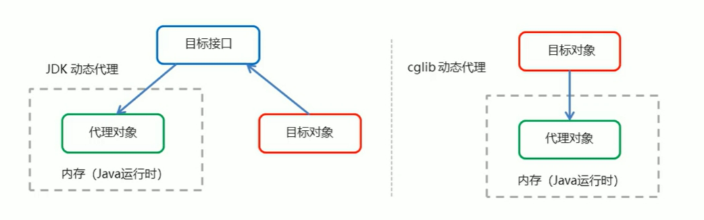
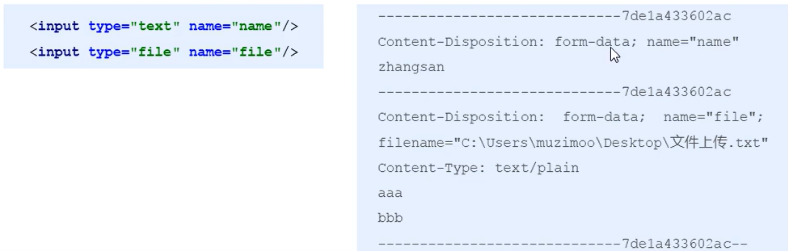

# JAVA后端框架

[toc]

## Spring

### 开发步骤

1. 导入 Spring开发的基本包坐标

   ```xml
   <dependency>
         <groupId>org.springframework</groupId>
         <artifactId>spring-context</artifactId>
         <version>6.1.7</version>
       </dependency>
   ```

2. 编写 Dao 接口和实现类

3. 创建 Spring 核心配置文件

4. 在Spring 配置文件中配置UserDaolmpl

5. 使用 Spring的 API 获得 Bean 实例

### 配置文件

1. `<ben>`标签

   1. 基本配置

      1. 概念：用于配置对象交由Spring 来创建。默认情况下它调用的是类中的无参构造函数,如果没有无参构造函数则不能创建成功。
      2. 基本属性：
         * id: Bean实例在Spring容器中的唯一标识
         * class: Bean的全限定名称

   2. 范围配置

      1. scope：指对象的作用范围，取值如下：

         |    取值范围    | 说明                                                         |
         | :------------: | :----------------------------------------------------------- |
         |   singleton    | 默认值单列的                                                 |
         |   prototype    | 多列的                                                       |
         |    request     | WEB 项目中，Spring 创建一个 Bean 的对象，将对象存入到 request 域中 |
         |    session     | WEB 项目中，Spring 创建一个 Bean 的对象，将对象存入到session 域中、 |
         | global session | WEB项目中,应用在Portlet环境,如果没有Portlet环境那么globalSession相当于session |

      2. 当scope的取值为singleton时
      
         1. Bean的实例化个数：1个
         2. Bean的实例化时机:当Spring核心文件被加载时,实例化配置的Bean实例
         3. Bean的生命周期：
            * 对象创建：当应用加载，创建容器时，对象就被创建了
            * 对象运行：只要容器在，对象一直活着
            * 对象销毁：当应用卸载，销毁容器时，对象就被销毁了
      
      3. 当scope的取值为prototype时
      
         1. Bean的实例化个数：多个
         2. Bean的实例化时机:当调用getBean()方法时实例化Bean
            * 对象创建：当使用对象时，创建新的对象实例
            * 对象运行：只要对象在使用中，就一直活着
            * 对象销毁：当对象长时间不用时，被 Java的垃圾回收器回收了
      
   3. Bean生命周期
   
      1. init-method:指定类中的初始化方法名称
   
         ```xml
             <bean id="userDao" class="com.glwc.UserDom.UserDaoImpl" init-method="init"/>
         ```
   
      2. destroy-method: 指定类中销毁方法名称
   
         ```xml
             <bean id="userDao" class="com.glwc.UserDom.UserDaoImpl"  destroy-method="destory"/>
         ```
   
   4. 实例化2种方式
   
      1. 无参构造方法实例化
      
         1. 配置
      
            ```xml
            <bean id="userDao" class="com.glwc.factory.StaticFaction"  factory-method="getUserDao"/>
            ```
      
      2. 工厂静态方法实例化
      
      3. 工厂实例方法实例化
   
2. 依赖注入

   1. 概念：他是Spring框架核心IOC的具体实现

      1. 在编写程序时，通过控制反转，把对象的创建交给了 Spring，但是代码中不可能出现没有依赖的情况。IOC解耦只是降低他们的依赖关系,但不会消除。例如:业务层仍会调用持久层的方法。
      2. 那这种业务层和持久层的依赖关系,在使用Spring之后,就让Spring来维护了。简单的说,就是坐等框架把持久层对象传入业务层,而不用我们自己去获取。

   2. 注入方式

      1. 构造方法

      2. set方法

         1. P命名空间注入本质也是set方法注入,但比起上述的set方法注入更加方便,主要体现在配置文件中,如下:首先，需要引入P命名空间：

            ```xml
            xmlns:p="http://www.springframework.org/schema/p"
            ```

         2. 其次，需要修改注入方式

            ```xml
            <bean id="userService" class="com.itheima.service.impl.UserServiceImpl" p:userDao-ref="userDao"/>
            ```
      
   3. 数据类型

      * 普通数据类型；引用数据类型；集合数据类型

3. import和知识要点

   1. 实际开发中, Spring的配置内容非常多,这就导致Spring配置很繁杂且体积很大,所以,可以将部分配置拆解到其他配置文件中,而在Spring主配置文件通过import标签进行加载

      ```xml
      <import resource="applicationContext-xxx.xml"/>
      ```

   2. 相应配置

      ```xml
      <bean>标签
          id属性：在容器中Bean实例的唯一标识，不允许重复
          class属性:要实例化的Bean的全限定名
          scope属性:Bean的作用范围，常用是Singleton (默认)和prototype
          <property>标签：属性注入
              name属性：属性名称
              value属性：注入的普通属性值
              ref属性：注入的对象引用值
              <list>标签
              <map>标签
              <properties>标签
           <constructor-arg>标签
      <impart>标签:导入其他的spring的分文件
      ```

      

### 相应API

1. ==ApplicationContext==的继承体系

   1. `applicationContext：`接口类型，代表应用上下文，可以通过其实例获得Spring 容器中的 Bean 对象

2. ==ApplicationContext==的实现类

   1. `ClassPathXmlApplicationContext:`它是从类的根路径下加载配置文件推荐使用这种
   2. `FileSystemXmlApplicationContext:`它是从磁盘路径上加载配置文件，配置文件可以在磁盘的任意位置。
   3. `AnnotationConfigApplicationContext:`当使用注解配置容器对象时，需要使用此类来创建spring 容器。它用来读取注解。

3. getBean()方法使用

   ```java
   //id类型
   public object getBean(String name) throws BeansException {
       assertBeanFactoryActive ();
       return getBeanFactory().getBean(name);
   } 
   //class类型
   public <T> T getBean(Class<T> requiredType) throws BeansException {
       assertBeanFactoryActive ();
       return getBeanFactory().getBean(requiredType);
   }
   ```

4. 其中,当参数的数据类型是字符串时,表示根据Bean的id从容器中获得Bean实例,返回是Object,需要强转。当参数的数据类型是Class类型时,表示根据类型从容器中匹配Bean实例,当容器中相同类型的Bean有多个时,则此方法会报错。

5. 重点API

   ```java
   ApplicationContext app = new ClasspathXmlApplicationContext("xml文件");
   app.getBean ("id");//某个类型的ben存在多个
   app.getBean (Class);//某个类型的ben只存在一个
   ```

### 配置数据源

1. 数据源(连接池)作用

   1. 数据源（连接池)是提高程序性能如出现的
   2. 事先实例化数据源，初始化部分连接资源
   3. 使用连接资源时从数据源中获取
   4. 使用完毕后将连接资源归还给数据源
   5.  常见的数据源(连接池)：==DBCP、C3PO、BoneCP、Druid==等

2. 开发步骤

   1. 导包

   2. 创建数据源对象

   3. 设置数据源的基本链接数据

3. 手动创建==C3P0==数据源

   ```java
   @Test
       //测试手动创建 c3p0 数据源（两个包）1.c3p0、mchange-commons-java
       public void text2() throws Exception {
           ComboPooledDataSource dataSource = new ComboPooledDataSource();
           dataSource.setDriverClass("com.mysql.jdbc.Driver");
           dataSource.setJdbcUrl("jdbc:mysql://localhost:3306/glwc");
           dataSource.setUser("root");
           dataSource.setPassword("219798");
           Connection connection = dataSource.getConnection();
           System.out.println(connection);
           connection.close();
       }
   ```

4. 手动创建==druid==数据源

   ```java
   @Test
       //测试手动创建 druid 数据源
       public void text3() throws Exception {
           DruidDataSource dataSource = new DruidDataSource();
           dataSource.setDriverClassName("com.mysql.jdbc.Driver");
           dataSource.setUrl("jdbc:mysql://localhost:3306/glwc");
           dataSource.setUsername("root");
           dataSource.setPassword("219798");
           Connection connection = dataSource.getConnection();
           System.out.println(connection);
           connection.close();
       }
   ```

5. 抽取==Jdbc.properties==文件

   ```java
    @Test
       //测试手动创建 druid 数据源(加载配置文件)
       public void text4() throws Exception {
           //读取配置文件
           ResourceBundle resourceBundle = ResourceBundle.getBundle("jdbc");//不需要扩展名，读取的是基本名称，resoureces下面的名称
           String diver = resourceBundle.getString("jdbc.diver");
           String url = resourceBundle.getString("jdbc.url");
           String username = resourceBundle.getString("jdbc.username");
           String password = resourceBundle.getString("jdbc.password");
           DruidDataSource dataSource = new DruidDataSource();
           dataSource.setDriverClassName(diver);
           dataSource.setUrl(url);
           dataSource.setUsername(username);
           dataSource.setPassword(password);
           Connection connection = dataSource.getConnection();
           System.out.println(connection);
           connection.close();
       }
   ```

   * jdbc.properties文件内容

   ```dir
   jdbc.diver=com.mysql.jdbc.Driver
   jdbc.url=jdbc:mysql://localhost:3306/glwc
   jdbc.username=root
   jdbc.password=219798
   ```

6. Spring配置数据源

   ```java
   @Test
       //配置spring产生数据源
       public void text5() throws Exception {
           ApplicationContext app = new ClassPathXmlApplicationContext("applicationContext.xml");
           DataSource dataSource = app.getBean(DataSource.class);
           Connection connection = dataSource.getConnection();
           System.out.println(connection);
           connection.close();
       }
   ```

7. spring加载jdbc.properties

   ```xml
   <?xml version="1.0" encoding="UTF-8"?>
   <beans xmlns="http://www.springframework.org/schema/beans"
          xmlns:xsi="http://www.w3.org/2001/XMLSchema-instance"
          xmlns:context="http://www.springframework.org/schema/context"
          xsi:schemaLocation=
                  "http://www.springframework.org/schema/beans http://www.springframework.org/schema/beans/spring-beans.xsd
                   http://www.springframework.org/schema/context http://www.springframework.org/schema/context/spring-context.xsd">
       <!--修改context-->
   <!--    加载外部propretise文件-->
       <context:property-placeholder location="classpath:jdbc.properties"/>
       <!--配置数据源-->
       <bean id="dataSource" class="com.mchange.v2.c3p0.ComboPooledDataSource">
           <property name="driverClass" value="${jdbc.diver}"/>
           <property name="jdbcUrl" value="${jdbc.url}"/>
           <property name="user" value="${jdbc.username}"/>
           <property name="password" value="${jdbc.password}"/>
       </bean>
   </beans>
   ```

8. 在xml中加载配置文件

   1. 引入spring的命名空间和约束路径
   2. `context`和`spring-context.xsd`
   3. `<context:property-placeholder location="classpath:jdbc.properties"/>`

### 注解开发

==Spring是轻代码而重配置的框架，配置比较繁重，影响开发效率，所以注解开发是一种趋势，注解代替xml配置文件可以简化配置，提高开发效率。==

1. 原始注解

   ==Spring原始注解主要是替代`<Bean>`的配置==

   | 注解           | 解释                                           |
   | -------------- | ---------------------------------------------- |
   | @Component     | 使用在类上用于实例化Bean                       |
   | @Controller    | 使用在web层类上用于实例化Bean                  |
   | @Service       | 使用在service层类上用于实例化Bean              |
   | @Repository    | 使用在dao层类上用于实例化Bean                  |
   | @Autowired     | 使用在字段上用于根据类型依赖注入               |
   | @Qualifier     | 结合@Autowired一起使用用于根据名称进行依赖注入 |
   | @Resource      | 相当于@Autowired+@Qualifier,按照名称进行注入   |
   | @Value         | 注入普通属性                                   |
   | @Scope         | 标注Bean的作用范围                             |
   | @PostConstruct | 使用在方法上标注该方法是Bean的初始化方法       |
   | @PreDestroy    | 使用在方法上标注该方法是Bean的销毁方法         |

2. 配置组件扫描

   ==使用注解进行开发时,需要在applicationContext.xml中配置组件扫描,作用是指定哪个包及其子包下的Bean需要进行扫描以便识别使用注解配置的类、字段和方法。==

   ```xml
   <context:component-scan base-package="com.glwc"/>
   ```

3. 新注解

   | 注解            | 解释                                                         |
   | --------------- | ------------------------------------------------------------ |
   | @Configuration  | 用于指定当前类是一个Spring配置类,当创建容器时会从该类上加载注解 |
   | @ComponentScan  | 用于指定Spring在初始化容器时要扫描的包。作用和在Spring的xml配置文件中的<context:component-scan base-package="com.itheima"/>一样 |
   | @Bean           | 使用在方法上,标注将该方法的返回值存储到Spring容器中          |
   | @PropertySource | 用于加载.properties文件中的配置                              |
   | @lmport         | 用于导入其他配置类                                           |

   ```java
   package com.glwc.config;
   
   import org.springframework.context.annotation.*;
   //Spring核心配置类
   @Configuration
   //加载扫描包
   @ComponentScan("com.glwc")
   @Import({DataSourceConfig.class})
   public class SpringConfigtiong {
   }
   
   package com.glwc.config;
   
   import com.mchange.v2.c3p0.ComboPooledDataSource;
   import org.springframework.beans.factory.annotation.Value;
   import org.springframework.context.annotation.Bean;
   import org.springframework.context.annotation.PropertySource;
   
   import javax.sql.DataSource;
   import java.beans.PropertyVetoException;
   
   //加载配置文件
   @PropertySource("classpath:jdbc.properties")
   public class DataSourceConfig {
       @Value("${jdbc.driver}")
       private String driver;
       @Value("${jdbc.url}")
       private String url;
       @Value("${jdbc.username}")
       private String username;
       @Value("${jdbc.password}")
       private String password;
   
       @Bean("dataSource")//SPringle会将当前方法的返回值存储到SPringle容器中
       public DataSource getDataSource() throws PropertyVetoException {
           ComboPooledDataSource dataSource = new ComboPooledDataSource();
           dataSource.setDriverClass(driver);
           dataSource.setJdbcUrl(url);
           dataSource.setUser(username);
           dataSource.setPassword(password);
           return dataSource;
       }
   }
   ```

4. 在Spring框架中，依赖注入（Dependency Injection, DI）可以通过使用注解的方式来进行，这种方式被称为基于注解的依赖注入（Annotation-based Dependency Injection）。Spring提供了多种注解来支持这一功能，下面列出了一些常用的注解：

   1. **@Component**：
      - 这个注解用于标记一个类作为组件，Spring容器会自动检测并管理这个类的实例。通常配合@ComponentScan注解使用，让Spring能够扫描到被标记的组件。

   2. **@Repository**、**@Service**、**@Controller** 和 **@RestController**：
      - 这些注解都是@Component的特殊化版本，分别用于数据访问层、业务逻辑层、常规控制层和RESTful控制层的组件。

   3. **@Autowired**：
      - 用于字段、构造函数或者方法参数的依赖注入。Spring会自动寻找类型匹配的bean并注入。

   4. **@Resource**：
      - 也是用于依赖注入，但默认按照名称查找bean，如果未指定名称，则使用变量名或方法名作为bean的名称。当没有找到匹配的bean时，才会退而求其次按类型查找。

   5. **@Qualifier**：
      - 当存在多个相同类型的bean时，可以使用此注解指定具体注入哪一个bean。

   6. **@Inject**：
      - JSR-330标准的一部分，用于依赖注入，其行为类似于@Autowired，但优先级更高。

   7. **@Primary**：
      - 当Spring容器发现多个相同类型的bean时，带有此注解的bean将被优先考虑。

   8. **@Scope**：
      - 用于指定bean的作用域，例如单例（singleton）、原型（prototype）、请求（request）等。

   9. **@Configuration** 和 **@Bean**：
      - @Configuration注解用于标记类作为配置类，@Bean注解用于在配置类中定义bean。这些bean会被添加到Spring的IoC容器中。

   通过这些注解，Spring框架能够自动管理和注入依赖，从而简化了配置，并使得代码更加清晰和可维护。使用注解进行依赖注入已经成为现代Spring应用的标准实践。

5. Spring框架提供了大量的注解来简化Java EE应用程序的开发，以下是一些常见的Spring注解及其用途：

   1. **核心注解**:
      - `@Component`: 标记一个类作为Spring容器中的一个组件。
      - `@Repository`: 用于数据访问层，通常用于DAO层。
      - `@Service`: 用于业务逻辑层。
      - `@Controller`: 用于Web层，处理HTTP请求。
      - `@RestController`: 结合了`@Controller`和`@ResponseBody`，用于构建RESTful服务。
      - `@Configuration`: 标记类可以当作配置类，其中包含`@Bean`方法。

   2. **依赖注入注解**:
      - `@Autowired`: 自动装配bean，可以用于字段、构造器、方法参数。
      - `@Resource`: 类似于`@Autowired`，但默认按名称查找bean，也可按类型查找。
      - `@Qualifier`: 配合`@Autowired`使用，用于消除模糊匹配，指定要注入的具体bean。
      - `@Inject`: JSR-330标准注解，用于依赖注入。
      - `@Primary`: 当有多个相同类型的bean时，优先使用带有此注解的bean进行注入。
      - `@Bean`: 在`@Configuration`类中使用，定义一个bean并注册到Spring容器中。

   3. **作用域注解**:
      - `@Scope`: 定义bean的作用域，如singleton、prototype等。
      - `@Singleton`: 表示bean是单例模式。
      - `@Prototype`: 表示每次请求都会创建一个新的bean实例。

   4. **生命周期注解**:
      - `@PreDestroy`: 指定在容器销毁bean之前调用的方法。
      - `@PostConstruct`: 指定在依赖注入完成后调用的方法。

   5. **条件注解**:
      - `@Conditional`: 根据条件决定是否创建bean。
      - `@Profile`: 根据环境配置（如dev, test, prod）来决定是否加载bean。

   6. **切面编程注解**:
      - `@Aspect`: 标记一个切面类。
      - `@Pointcut`: 定义切点表达式。
      - `@Before`: 前置通知。
      - `@After`: 后置通知。
      - `@Around`: 环绕通知。
      - `@AfterReturning`: 返回后通知。
      - `@AfterThrowing`: 异常后通知。

   7. **数据访问注解**:
      - `@Transactional`: 用于开启事务管理。
      - `@RepositoryRestResource`: RESTful方式暴露仓库接口。
      - `@Query`: 用于定义自定义的JPA查询语句。

   8. **Web相关注解**:
      - `@RequestMapping`: 映射HTTP请求到处理方法。
      - `@GetMapping`, `@PostMapping`, `@PutMapping`, `@DeleteMapping`: 分别对应GET, POST, PUT, DELETE请求。
      - `@PathVariable`: 从URL中获取路径变量。
      - `@RequestParam`: 获取请求参数。
      - `@RequestBody`: 从请求体中获取数据。
      - `@ResponseBody`: 将返回值直接写入HTTP响应体。

   9. **测试注解**:
      - `@RunWith(SpringRunner.class)`: 用于Spring Boot测试，配合JUnit。
      - `@SpringBootTest`: 定义Spring Boot测试类。
      - `@Test`: 标记测试方法。
      - `@MockBean`: 用于创建模拟bean。
      - `@SpyBean`: 创建bean的间谍实例，用于部分模拟。

   以上只是Spring框架中的一部分注解，实际上Spring还提供了许多其他注解来满足不同的应用场景。

#### 什么是依赖注入（IOC）

将方法的返回值放入到bean中，通过bean拿、不需要在实例化对象

### 集成junit

1. 导入坐标

   ```xml
   <!--        Spring集成junit-->
           <dependency>
               <groupId>org.springframework</groupId>
               <artifactId>spring-test</artifactId>
               <version>6.0.7</version>
               <scope>test</scope>
           </dependency>
   ```

2. 测试Java

   ```java
   package com.glwc.web;
   
   import com.glwc.config.SpringConfigtiong;
   import com.glwc.service.UserService;
   import org.junit.Test;
   import org.junit.runner.RunWith;
   import org.springframework.beans.factory.annotation.Autowired;
   import org.springframework.test.context.ContextConfiguration;
   import org.springframework.test.context.junit4.SpringJUnit4ClassRunner;
   
   import javax.sql.DataSource;
   import java.sql.SQLException;
   
   @RunWith(SpringJUnit4ClassRunner.class)
   @ContextConfiguration(classes = {SpringConfigtiong.class})
   public class SpringJunitTest {
   
       @Autowired
       private UserService userService;
   
       @Autowired
       private DataSource dataSource;
   
       @Test
       public void test() throws SQLException {
           userService.save();
           System.out.println(dataSource.getConnection());
       }
   }
   ```

### 集成Web环境、监听器

1. 基本三层架构环境
   * web层，业务层，dao层
   
2. 要有tomcat才能继承extends==HttpServlet== 注意tomcat版本

3. ApplicationContext应用上下文获取方

   * 应用上下文对象是通过new ClasspathXmlApplicationContext(spring配置文件)方式获取的,但是每次从容器中获得Bean时都要编写new ClasspathXmlApplicationContext(spring配置文件),这样的弊端是配置文件加载多次，应用上下文对象创建多次。

   * 在Web项目中，可以使用ServletContextListener监听Web应用的启动，我们可以在Web应用启动时，就加载Spring的配置文件,创建应用上下文对象ApplicationContext,在将其存储到最大的域servletContext域中,这样就可以在任意位置从域中获得应用上下文ApplicationContext对象了。

   * 配置监听器

     ```xml
     <!--    配置监听器-->
         <listener>
             <listener-class>com.yply.listener.ConTextLoaderListener</listener-class>
         </listener>
     ```

     ```java
     package com.yply.listener;
     
     import com.yply.config.SpringConfigtiong;
     import org.springframework.context.ApplicationContext;
     import org.springframework.context.annotation.AnnotationConfigApplicationContext;
     import org.springframework.context.support.ClassPathXmlApplicationContext;
     
     import javax.servlet.ServletContext;
     import javax.servlet.ServletContextEvent;
     import javax.servlet.ServletContextListener;
     
     public class ConTextLoaderListener implements ServletContextListener {
         @Override
         public void contextInitialized(ServletContextEvent sce) {
             
             ApplicationContext app = new ClassPathXmlApplicationContext("applicationContext.xml");
             
             //ApplicationContext app = new AnnotationConfigApplicationContext(SpringConfigtiong.class);
             //将Spring的应用上下文的对象存储到ServletContext
             ServletContext servletContext = sce.getServletContext();
             servletContext.setAttribute("app",app);
             System.out.println("加载成功");
         }
     
         @Override
         public void contextDestroyed(ServletContextEvent sce) {
             ServletContextListener.super.contextDestroyed(sce);
         }
     }
     ```

   * 使用

     ```java
     ServletContext servletContext = this.getServletContext();
     ApplicationContext app = (ApplicationContext) servletContext.getAttribute("app");
     ```

4. web全局初始化参数

   1. ==web.xml==

      ```xml
      <!--    全局初始化参数-->
          <context-param>
              <param-name>namespace</param-name>
              <param-value>applicationContext.xml</param-value>
          </context-param>
      ```

   2. ==ConTextLoaderListener==

      ```java
      package com.yply.listener;
      
      import com.yply.config.SpringConfigtiong;
      import org.springframework.context.ApplicationContext;
      import org.springframework.context.annotation.AnnotationConfigApplicationContext;
      import org.springframework.context.support.ClassPathXmlApplicationContext;
      
      import jakarta.servlet.ServletContext;
      import jakarta.servlet.ServletContextEvent;
      import jakarta.servlet.ServletContextListener;
      
      public class ConTextLoaderListener implements ServletContextListener {
          @Override
          public void contextInitialized(ServletContextEvent sce) {
              ServletContext servletContext = sce.getServletContext();
              //读取web.xml的全局参数
              String contextInitParameter = servletContext.getInitParameter("namespace");
              
              ApplicationContext app = new ClassPathXmlApplicationContext(contextInitParameter);
              //ApplicationContext app = new AnnotationConfigApplicationContext(SpringConfigtiong.class);
              //将Spring的应用上下文的对象存储到ServletContext
              servletContext.setAttribute("app",app);
          }
      }
      ```

5. ==Spring提供获取应用上下文的工具==

   1. 上面的分析不用手动实现,Spring提供了一个监听器ContextLoaderListener就是对上述功能的封装,该监听器内部加载Spring配置文件,创建应用上下文对象,并存储到ServletContext域中,提供了一个客户端工具WebApplicationContextUtils供使用者获得应用上下文对象。

   2. 所以我们需要做的只有两件事：

      1. 在web.xml中配置ContextLoaderListener监听器(导入spring-web坐标)

         * pom.xml

         ```xml
         <dependency>
                     <groupId>org.springframework</groupId>
                     <artifactId>spring-web</artifactId>
                     <version>6.0.1</version>
                 </dependency>
         ```

         * web.xml

         ```xml
         <!--    全局初始化参数-->
             <context-param>
                 <param-name>contextConfigLocation</param-name>
                 <param-value>classpath:applicationContext.xml</param-value>
             </context-param>
         <!--    配置监听器-->
             <listener>
                 <listener-class>org.springframework.web.context.ContextLoaderListener</listener-class>
             </listener>
         ```

         

      2. 使用WebApplicationContextUtils获得应用上下文对象ApplicationContext

         * web页面

         ```java
         package com.yply.web;
         
         import com.yply.config.SpringConfigtiong;
         import com.yply.sevice.UserService;
         import org.springframework.context.ApplicationContext;
         import org.springframework.context.annotation.AnnotationConfigApplicationContext;
         
         import jakarta.servlet.*;
         import jakarta.servlet.http.*;
         import org.springframework.web.context.WebApplicationContext;
         import org.springframework.web.context.support.WebApplicationContextUtils;
         
         import java.io.IOException;
         
         public class UserServlet extends HttpServlet {
             @Override
             protected void doGet(HttpServletRequest request, HttpServletResponse response) throws ServletException, IOException {
                 //ApplicationContext app = new AnnotationConfigApplicationContext(SpringConfigtiong.class);
                 //ApplicationContext app = new ClassPathXmlApplicationContext("applicationContext.xml");
                 ServletContext servletContext = this.getServletContext();
                 //ApplicationContext app = (ApplicationContext) servletContext.getAttribute("app");
                 //ApplicationContext app = WebApplicationContextUtils.getWebApplicationContextUtils(servletContext);
                 WebApplicationContext app = WebApplicationContextUtils.getWebApplicationContext(servletContext);
                 UserService userService = app.getBean(UserService.class);
                 userService.save();
             }
         }
         ```

6. Spring集成Web环境步骤

   1. 配置ContextLoaderListener监听器`导入spring-web`包
   2. 使用WebApplicationContextUtils获取应用上下文
   3. 注解`@ServletComponentScan()`

### jdbcTemplate

它是 spring 框架是供的一个对象，是对原始繁琐的 Jdbc API 对的简单封装，spring 框架们超共了很多的操作模板类·例如：操作关系型的 JdbcTempIate 和 HibernateTemplate, 操作 nosql 数据库的 RedisTemplate, 操作消息队列的JmsTemplate 等等。

1. 开发步骤

   1. 导入 spring-jdbc 和 spring-tx 坐标
   2. 创建数据库表和实体
   3. 创建 JdbcTemplate 对象
   4. 执行数据库操作

2. 快速入门

   ```java
   public class JdbcTemplatrTest {
       @Test
       //测试JdbcTemplate开发步骤
       public void test1() throws PropertyVetoException {
           //设置数据源
           ComboPooledDataSource dataSource = new ComboPooledDataSource();
           dataSource.setDriverClass("com.mysql.jdbc.Driver");
           dataSource.setJdbcUrl("jdbc:mysql://localhost:3306/school");
           dataSource.setUser("root");
           dataSource.setPassword("219798");
   
           JdbcTemplate jdbcTemplate = new JdbcTemplate();
           //设置数据源对象知道数据库在哪
           jdbcTemplate.setDataSource(dataSource);
           //执行操作
           int row = jdbcTemplate.update("insert into student values (?,?,?)", 1, "张三", 219798);
           System.out.println(row);
       }
   }
   ```

3. spring产生模板对象`applicationContext.xml`

   ```xml
   <!--数据源对象-->
       <bean id="dataSource" class="com.mchange.v2.c3p0.ComboPooledDataSource">
           <property name="driverClass" value="com.mysql.jdbc.Driver"/>
           <property name="jdbcUrl" value="jdbc:mysql://localhost:3306/school"/>
           <property name="user" value="root"/>
           <property name="password" value="219798"/>
       </bean>
   
       <!--jdbcTemplate模板对象-->
       <bean id="jdbcTemplate" class="org.springframework.jdbc.core.JdbcTemplate">
           <property name="dataSource" ref="dataSource"/>
       </bean>
   ```

   1. 测试使用

      ```java
      @Test
          //测试Spring产生的JdbcTemplate对象
          public void test2() throws PropertyVetoException {
              ClassPathXmlApplicationContext classPathXmlApplicationContext = new ClassPathXmlApplicationContext("applicationContext.xml");
              JdbcTemplate bean = classPathXmlApplicationContext.getBean(JdbcTemplate.class);
              String sql = "delete from student where username = '张三'";
              int updater = bean.update(sql);
              System.out.println(updater);
          }
      ```

   2. 抽取使用配置文件`jdbc.properties`

      ```properties
      jdbc.diver=com.mysql.jdbc.Driver
      jdbc.url=jdbc:mysql://localhost:3306/glwc
      jdbc.username=root
      jdbc.password=219798
      ```

   3. 模板对象

      ```xml
          <!--修改context-->
      <beans xmlns="http://www.springframework.org/schema/beans"
             xmlns:context="http://www.springframework.org/schema/context"
             xmlns:xsi="http://www.w3.org/2001/XMLSchema-instance"
             xsi:schemaLocation="http://www.springframework.org/schema/beans http://www.springframework.org/schema/beans/spring-beans.xsd
                                 http://www.springframework.org/schema/context http://www.springframework.org/schema/context/spring-context.xsd">
      <!--    加载外部propretise文件-->
          <context:property-placeholder location="classpath:jdbc.properties"/>
      <!--数据源对象-->
          <bean id="dataSource" class="com.mchange.v2.c3p0.ComboPooledDataSource">
              <property name="driverClass" value="${jdbc.diver}"/>
              <property name="jdbcUrl" value="${jdbc.url}"/>
              <property name="user" value="${jdbc.username}"/>
              <property name="password" value="${jdbc.password}"/>
          </bean>
      
          <!--jdbcTemplate模板对象-->
          <bean id="jdbcTemplate" class="org.springframework.jdbc.core.JdbcTemplate">
              <property name="dataSource" ref="dataSource"/>
          </bean>
      ```

   4. 告诉当前文件使用哪一个测试`@RunWith(SpringJUnit4ClassRunner.class)`使用spring-test进行单元测试

   5. 告诉当前文件使用的jdbc配置文件`@ContextConfiguration("classpath:applicationContext.xml")`

   6. 测试谁注入谁`@Autowired`

      ```java
      @RunWith(SpringJUnit4ClassRunner.class)
      @ContextConfiguration("classpath:applicationContext.xml")
      public class JdebcCURD {
          @Autowired
          private JdbcTemplate jdbcTemplate;
          @Test
          public void testUpdate(){
              jdbcTemplate.update("insert into student values (?,?,?)", 11, "张三", 219798);
          }
      }
      ```

4. 查询操作

   ```java
   //查询整张表
   @Test
       public void testQueryAll(){
           List<Student> query = jdbcTemplate.query("select * from student", new BeanPropertyRowMapper<Student>(Student.class));
           System.out.println(query);
       }
   //查询一个对象
   @Test
       public void testQueryOne(){
           Student student = jdbcTemplate.queryForObject("select * from student where password=?", new BeanPropertyRowMapper<Student>(Student.class), "219798");
           System.out.println(student);
       }
   //查询聚合函数
   @Test
       public void testQueryCount(){
           Long l = jdbcTemplate.queryForObject("select count(*) from student", Long.class);
           System.out.println(l);
       }
   ```

5. 获取自动生成的主键id

   ```java
   @Override
       public Long Seave(User user) {
           PreparedStatementCreator preparedStatementCreator = new PreparedStatementCreator() {
               //创建PreparedStatement
               @Override
               public PreparedStatement createPreparedStatement(Connection con) throws SQLException {
                   //使用原始JDBC完成PreparedStatement的创建
                   PreparedStatement preparedStatement = con.prepareStatement("insert into student values (?,?,?)",PreparedStatement.RETURN_GENERATED_KEYS);
                   preparedStatement.setObject(1,null);
                   preparedStatement.setString(2,user.getUsername());
                   preparedStatement.setString(3, user.getPassword());
                   return preparedStatement;
               }
           };
           //创建GeneratedKeyHolder()
           GeneratedKeyHolder generatedKeyHolder = new GeneratedKeyHolder();
           jdbcTemplate.update(preparedStatementCreator,generatedKeyHolder);
           long l = generatedKeyHolder.getKey().longValue();//获取生成的主键
           return l;//返回当前用户的id
       }
   ```

### aop

AOP 为 Aspect Oriented Programming 的缩写，意思为==面向切面编程==，是通过预编译方式和运行期动态代理实现程序功能的统一维护的一种技术。

AOP 是 OOP 的延续,是软件开发中的一个热点，也是 Spring 框架中的一个重要内容，是函数就编程的一种衍生范型。利用 AOP 可以对业务逻辑的各个部分进行隔离，从而使得业务逻各部分之间的耦合度降低，提高程序的可重用性，同时提高了开发的效率。

1. AOP 的作用及其优势
   * 作用：在程序运行期间，在不修改源码的情况下对方法进行功能强
   * 优势：减少重复代码，提高开发效率，并且便于维护

2. aop 底层实现

   * 常用动态代支术

      * JDK 代理：基于接口的动态代理技术
      * cglib代理：基于父类的动代理技术

      

   * JDK动态代理

      ```java
      //接口
      public interface jdk {
          void seave();
      }
      //目标类方法
      import com.aop.jdk.daili.jdk;
      public class JdkFangFa implements jdk {
          @Override
          public void seave() {
              System.out.println("111111111");
          }
      }
      //增强类
      public class ZhengQiangJdk {
          public void qian(){
              System.out.println("前");
          }
          public void hou(){
              System.out.println("后");
          }
      }
      //测试
      import java.lang.reflect.InvocationHandler;
      import java.lang.reflect.Method;
      import java.lang.reflect.Proxy;
      import com.aop.jdk.daili.jdk;
      public class JdkText {
          public static void main(String[] args) {
              JdkFangFa jdkFangFa = new JdkFangFa();
              ZhengQiangJdk zq = new ZhengQiangJdk();
              jdk jdkx = (jdk) Proxy.newProxyInstance(
                      jdkFangFa.getClass().getClassLoader(),
                      jdkFangFa.getClass().getInterfaces(),
                      new InvocationHandler() {
                          @Override
                          public Object invoke(Object proxy, Method method, Object[] args) throws Throwable {
                              zq.qian();
                              method.invoke(jdkFangFa,args);
                              zq.hou();
                              return null;
                          }
                      }
              );
               jdkx.seave();
          }
      }
      ```

   * cglib动态代理

      ```java
      //除测试外，其他一致，没有接口
      //测试
      import org.springframework.cglib.proxy.Enhancer;
      import org.springframework.cglib.proxy.MethodInterceptor;
      import org.springframework.cglib.proxy.MethodProxy;
      import java.lang.reflect.Method;
      
      public class JdkText {
          public static void main(String[] args) {
              JdkFangFa jdkFangFa = new JdkFangFa();
              ZhengQiangJdk zq = new ZhengQiangJdk();
              //基于cglib生成的动态代理
              //1.创建增强器，chlib提供的
              Enhancer enhancer = new Enhancer();
              //2.设置父类（目标）
              enhancer.setSuperclass(JdkFangFa.class);
              //3.设置回调
              enhancer.setCallback(new MethodInterceptor() {
                  @Override
                  public Object intercept(Object obj, Method method, Object[] args, MethodProxy proxy) throws Throwable {
                      zq.qian();
                      Object invoke = method.invoke(jdkFangFa, args);
                      zq.hou();
                      return invoke;
                  }
              });
              //3.创建代理对象
              JdkFangFa zqx = (JdkFangFa) enhancer.create();
              zqx.seave();
          }
      }
      ```

   * 相关概念

      1. Spring 的 AOP 实现底层就是对上面的动态代理的代码进行了封装，封装后我们只需要对需要关注的部分进代码编写，并通过配置的方式完成指定目析方法增强。
      2. 常用
         1. Target （目标对象）：代理的目标对象
         2. Proxy （代理）：一个类被 AOP 织入增强后，就产生一个结果代理类
         3. JoInpoint （连接点）：所谓连接点是指那些拦截到的点，在 spring 中，这些点指的是方法，因为 Spring 只支持方法类型的连接点
         4. Pointcut （切入点）：所谓切入点是指我们要对哪些 Joinpoint 进行拦截的定义
         5. Advice （通知／增强）：所谓通知是指拦截到 Joinpoint 之后所要做的事情就是通知
         6. Aspect （切面）：是切入点和通知（引介）的结合
         7. Weaving （织公）：是指把增强应用到目标对象来创建新的代理对象的过程。 spring 采用动态代理织入，而AspectJ 采编译期织入和类装载期织入

   * 开发明确事项和知识点

      1. 需要编写的内容
         * 编写核心业务代码（目析的目标方法）
         * 编写切面类，切面类中有通知（功能方法）
         * 在配置文件中，配置织入关系，将哪些通知与哪些连接点进行结合
      2. Aop技术实现的内容
         * Spring 框架监控切入点方法的执行，一旦监控到切入点方法被运行，使用代理机制， 动态创建目标对象的代理对象，根据通知类别，在代理对象的对应位置，将通知对应的功能织入，完成完整的代码逻辑运行。
      3. AOP 底层使用哪种代理方式
         * 在 spring 中，框架会根据目标类是否实现了接口来决定采那种动态代理的方式

3. xml方式实现

   * 快速入门

      * 步骤

      * 导入 AOP 相关坐标

      * 创建目标接囗和目标类（内部有切点）

      * 创建切面类（内部有增强方法）

      * 将目标类和切面类的对象创交给 spring

      * 在 applicationContextxml 中配置织入关系

      * 测试代码

      * 坐标

         ```xml
             <dependency>
               <groupId>org.aspectj</groupId>
               <artifactId>aspectjweaver</artifactId>
               <version>1.9.20.1</version>
               <scope>runtime</scope>
             </dependency>
         ```

      * 创建类

         ```java
         //接口
         public interface jdk {
             void seave();
         }
         //目标类方法
         import com.aop.jdk.daili.jdk;
         public class JdkFangFa implements jdk {
             @Override
             public void seave() {
                 System.out.println("111111111");
             }
         }
         //切面类
         public class ZhengQiangJdk {
             public void qian(){
                 System.out.println("前");
             }
             public void hou(){
                 System.out.println("后");
             }
         }
         ```

      * 在applicationContext.xml中配置

         ```xml
         <!--目标对象-->
             <bean id="targat" class="com.daili.impl.JdkFangFa"/>
             <!--切面对象-->
             <bean id="myAspect" class="com.daili.impl.ZhengQiangJdk"/>
             <!--配置织入：告诉spring框架那些方法（切点）需要进行那些增强-->
             <aop:config>
                 <!--声明切面-->
                 <aop:aspect ref="myAspect">
                     <!--切面：切点+通知-->
                     <aop:before method="qian" pointcut="execution(public void com.daili.impl.JdkFangFa.seave())"/>
                     <!--method:增强的方法、aop:before前置增强、pointcut="execution(需要增强的方法 全类名.需要增强的方法名)"-->
                     <!--pointcut="execution(public void com.daili.impl.JdkFangFa.seave())这就是切点表达式-->
                 </aop:aspect>
             </aop:config>
         ```

      * 测试

         ```java
         package com.text;
         
         import org.junit.Test;
         import org.junit.runner.RunWith;
         import org.springframework.beans.factory.annotation.Autowired;
         import org.springframework.stereotype.Component;
         import org.springframework.test.context.ContextConfiguration;
         import org.springframework.test.context.junit4.SpringJUnit4ClassRunner;
         import com.daili.jdk;
         
         @RunWith(SpringJUnit4ClassRunner.class)//引入用那个测试
         @ContextConfiguration("classpath:applicationContext.xml")//引入配置文件
         @Component
         public class AopText {
         
             @Autowired
             private jdk awq;
         
             @Test
             public void text1(){
                 awq.seave();
             }
         }
         ```

   * 切点表达式的写法

     * 表达式语法
     * `execution([修饰符] 返回值类型 包名.类名.方法名(参数))`
     * 访问修饰符可以省略
     * 返回值类型、包名、类名、方法名可以使用星号`*`代表任意
     * 包名与类名之间一个点`.`代表当前包下的类，两个点`..`表示当前包及其子包下的类
     * 参数列表可以使用两个点`..`表示任意个数，任意类型的参数列表
     
   * 通知种类

      1. 前置通知：`<aop:before>`：用于配置前置通知。指定增强的方法在切入点方法之前执行
      
      2. 后置通知：`<aop:after-returning>`：用于配置后置通知。指定增强的方法在切入点方法之后执行
      
      3. 环绕通知：`<aop:around>`：用于配置环绕通知。指定增强的方法在切入点方法之前和之后都执行
         * 方法必须携带参数`ProceedingJoinPoint joinPoint`
      
         * 增强方法
      
            ```java
            public void huanrao(ProceedingJoinPoint proceedingJoinPoint) throws Throwable {
                    System.out.println("前");
                    Object proceed = proceedingJoinPoint.proceed();
                    System.out.println("后");
                }
            ```
      
      4. 异常抛出通知：`<aop:throwing>`：用于配置异常抛出通知。指定增强的方法在出现异常时执行
      
      5. 最终通知：`<aop:after>`：用于配置最终通知。无论增强方式执行是否有异常都会执行
      
         ```java
         <aop:config>
                 <aop:aspect ref="myAspect">
                     <aop:before method="qian" pointcut="execution(public void com.daili.impl.JdkFangFa.seave())"/>
                 </aop:aspect>
             </aop:config>
         ```
      
   * 切点表达式的抽取

      1. 当多个增强的切点表达式相同时，可以将切点表达式进行抽取，在增强中使用 pointcut-ref 属性代替 pointcut 属性来引用抽取后的切点表达式

         ```xml
         <aop:config>    
             <aop:aspect ref="myAspect">    
                 <aop:before id="ass" pointcut="execution(public void com.daili.impl.JdkFangFa.seave())"/>
                 <aop:before method="qian" pointcut-ref="ass"/>
             </aop:aspect>    
         </aop:config>
         ```

4. 注解方式实现

   1. 快速入门

      1. 创建目标接囗和目标类（内部有切点）

      2. 创建切面类（内部有增强方法）

      3. 将目标类和切面类的对象创建交给 spring

      4. 在切面类中使用注解配置织入关系

      5. 在配首文件中开启组件扫描和 AOP 的自动代理

      6. 测试

      7. 在applictionContext.xml中配置

         ```xml
         <!--    组件扫描-->
             <context:component-scan base-package="com.zujie.daili"/>
         <!--    aop自动代理-->
             <aop:aspectj-autoproxy/>
         ```

      8. Java类

         ```java
         //接口
         public interface jdk {
             void seave();
         }
         
         //目标方法
         import com.zujie.daili.jdk;
         import org.springframework.stereotype.Component;
         
         @Component("mb")
         public class JdkFangFa implements jdk {
             @Override
             public void seave() {
                 System.out.println("111112222222221111111");
             }
         }
         //切面方法
         import org.aspectj.lang.annotation.Aspect;
         import org.aspectj.lang.annotation.Before;
         import org.springframework.stereotype.Component;
         
         @Component("zq")
         @Aspect//告知spring当前类为切面类
         public class ZhengQiangJdk {
             @Before("execution(void com.zujie.daili.impl.JdkFangFa.seave())")
             public void qian(){
                 System.out.println("前1221112121");
             }
             public void hou(){
                 System.out.println("后");
             }
         }
         //测试
         import com.zujie.daili.jdk;
         import org.junit.Test;
         import org.junit.runner.RunWith;
         import org.springframework.beans.factory.annotation.Autowired;
         import org.springframework.stereotype.Component;
         import org.springframework.test.context.ContextConfiguration;
         import org.springframework.test.context.junit4.SpringJUnit4ClassRunner;
         
         @RunWith(SpringJUnit4ClassRunner.class)//引入用那个测试
         @ContextConfiguration("classpath:applicationContext.xml")//引入配置文件
         @Component
         public class ZuJieText {
         
             @Autowired
             private jdk awq;
         
             @Test
             public void text1(){
                 awq.seave();
             }
         }
         ```

      9. 注解详解

         1. `@Component("mb")`：把当前类交给spring管理、类似`<bean id="targat" class="com.daili.impl.JdkFangFa"/>`
         2. `@Aspect`：告知spring当前类为切面类
         3. `@Before("execution(void com.zujie.daili.impl.JdkFangFa.seave())")`：前置通知

   2. 注解通知种类

      1. `@Before`：前置通知

      2. `@AfterReturning`：后置通知

      3. `@Around`：环绕通知

      4. `@AfterThrowing`：异常抛出通知

      5. `@After`：最终通知

      6. 切点表达式的抽取`@Pointcut`

         ```java
         @Before("chouqu()")//当前类中
         public void qian(){
             System.out.println("前1221112121");   
         }
         @Pointcut("execution(void com.zujie.daili.impl.JdkFangFa.seave())")
         public void chouqu(){}
         ```

### 事务控制

#### 编程式事务控制相关对象

1. PlatformTransactionManager：平台事务管理器

   * PlatformTransactionManager 接囗是 spring 事务管理器，它里面提供了我们常用的操作事务的方法。

      | 方法                                                         | 说明               |
      | ------------------------------------------------------------ | ------------------ |
      | `TransactionStatus getTransaction (TransactionDefination defination)` | 获取事务的状态信息 |
      | `void corrmit (TransactionStatus status ）`                  | 提交事务           |
      | `void rollback (Transactionstatus status)`                   | 回滚事务           |

   * PlatformTransactionManager 是接口类型不同的 Dao 层技术则有不同的实现类

2. TransactionDefinition

   * TransactionDefinition 是事务的定义信息对象里面有如下方法：

      | 方法                           | 说明               |
      | ------------------------------ | ------------------ |
      | `int getIsolationLevel()`      | 获得事务的隔离级别 |
      | `int getPropogationBehavior()` | 获得事务的传播行为 |
      | `int getTimeout()`             | 获得超时时间       |
      | `boolean isReadOnly()`         | 是否只读           |

   * 事务的隔离级别：==设置隔离级别，可解决事务并发产生的问题，如脏读、不可重复读和虚读==

      1. ISOLATION_DEFAULT
      2. ISOLATION_READ_UNCOMMITTED
      3. ISOLATION_READ_COMMITTED
      4. ISOLATION_REPEATABLE_READ
      5. ISOLATION_SERIALIZABLE

   * 事务传播行为

      1. REQUIRED: 如果当前没有事务，就新建一个事务，如果已经存在一个事务中，加入到这个事务中。一般的选择（默认值）
      2. SUPPORTS: 支持当前事务，如果当前没有事务，就以非事务方式执行（没有事务）
      3. MANDATORY: 使用当前的事务如果当前没有事务，就抛出异常
      4. REQUERSNEW: 新建事务，如果当前在事务中，把当前事务挂起。
      5. NOTSUPPORTED: 以非事务方式执行操作，如果当前存在事务，就把当前事务挂起。
      6. NEVER: 以非事务方式运行，如果当前存在事务，抛出异常
      7. NESTED: 如果当前存在事务，则在嵌套事务内执行。如果当前没有事务，则于 REQUIRED 类似的操作
      8. 超时时间：默认值是`-1` ，没有超时限制。如果有，以秒为单位进行设置
      9. 是否只读：建议查洵时设置为只读

3. TransactionStatus

   * TransactionStatus 接口提供的是事务具体的运行状态

      | 方法                         | 说明         |
      | ---------------------------- | ------------ |
      | `boolean hasSavepoint()`     | 是否存储回点 |
      | `boolean iscompleted()`      | 事务是否完成 |
      | `boolean isNewTransaction()` | 是否是新事务 |
      | `boolean isRollbackOnly()`   | 事务是否回滚 |

#### 声明式事务控制

==Spring 的声明式事务顾名思义就是采用声明的方式来处理事务。这里所说的声明，就是指在配置文件中声明，用在 Spring 配首文件中声明式的处理事务来代替代码式的处理事务。==

1. 基于 XML的

   * 配置文件applictionContext.xml

      ```xml
      <!--依赖注入-->
      <bean id="money" class="com.shiwu.com.dao.impl.MoneyDao">
          <property name="jdbcTemplate" ref="jdbcTemplate"/>    
      </bean>
      <bean id="iomoney" class="com.shiwu.com.service.impl.MoneyService">
          <property name="ioMoney" ref="money"/>    
      </bean>
      <!--声明事务-->
      <!--    平台事务管理器-->
      <bean id="transactionManager" class="org.springframework.jdbc.datasource.DataSourceTransactionManager">
          <property name="dataSource" ref="dataSource"/>    
      </bean>
      <!--    通知 事务增强-->
      <tx:advice id="interceptor" transaction-manager="transactionManager">
          <!--设置事务的属性信息-->
          <tx:attributes>    
              <tx:method name="*"/ isolation="DEFAULT" propagation="MANDATORY" timeout="-1" read-only="false">
              <!--name="*"那些方法被增强，可以每个方法单独一行控制-->
              <!--isolation="DEFAULT"隔离级别-->
              <!--propagation="MANDATORY"传播行为-->
              <!--timeout="-1"失效时间-->
              <!--read-only="false"是否只读-->
          </tx:attributes>
      </tx:advice>
      <!--    配置织入-->
      <aop:config>
          <aop:advisor advice-ref="interceptor" pointcut="execution(* com.shiwu.com.service.impl.MoneyService.*(..))"/>    
      </aop:config>
      ```

      1. `name="*"`：那些方法被增强
      2. `isolation="DEFAULT"`：隔离级别
      3. `propagation="MANDATORY"`：传播行为
      4. `timeout="-1"`：失效时间
      5. `read-only="false"`：是否只读

   * 相关代码

      ```java
      //service层接口
      public interface ServiceJie {
          void seave(String usernamechun,String usernamequ,int coin);
      }
      //service
      public class MoneyService implements ServiceJie {
          private IoMoney ioMoney;
          public void setIoMoney(IoMoney ioMoney) {
              this.ioMoney = ioMoney;
          }
          @Override
          public void seave(String usernamechun, String usernamequ, int coin) {
              ioMoney.chun(usernamechun,coin);
              int i = 1/0;
              ioMoney.shao(usernamequ,coin);
          }
      }
      //dao层接口
      public interface IoMoney {
          void chun(String usernamechun,int coin);
          void shao(String usernamequ,int coin);
      }
      //dao
      public class MoneyDao implements IoMoney {
      
          private JdbcTemplate jdbcTemplate;
          public void setJdbcTemplate(JdbcTemplate jdbcTemplate) {
              this.jdbcTemplate = jdbcTemplate;
          }
      
          @Override
          public void chun(String usernamechun, int coin) {
              jdbcTemplate.update("update bank set money=money+? where username=?",coin,usernamechun);
          }
      
          @Override
          public void shao(String usernamequ, int coin) {
              jdbcTemplate.update("update bank set money=money-? where username=?",coin,usernamequ);
          }
      }
      //测试
      public class MoneyTest {
          public static void main(String[] args) {
              ApplicationContext app = new ClassPathXmlApplicationContext("applicationContext.xml");
              ServiceJie serviceJie = app.getBean(ServiceJie.class);
              serviceJie.seave("破裂","和睦",500);
          }
      }
      ```

2. 基于注解的

   1. @Transactional控制事务（中间加入隔离级别）
   2. 使用 @Transactional 在需要进行事务控制的类或是方法上修饰，注解可用的属性同 xml 配置方式，例如隔离级别、传播行为等。
   3. 注解使用在类上，那么该类下的所有方法都使用同一套注解参数配使用在方法上
   4. 不同的方法，可以采用不同的事务参数配置
   5. 配置文件中要开启事务的注解驱动`<tx:annotation-driven transaction-manager="transactionManager"/>`

   ```java
   //测试
   public class MoneyTest {
       public static void main(String[] args) {
           ApplicationContext app = new ClassPathXmlApplicationContext("applicationContext.xml");
           ServiceJie serviceJie = app.getBean(ServiceJie.class);
           serviceJie.seave("破裂","和睦",500);}}
   //service层注解@Transactional控制事务（中间加入隔离级别）
   @Service("moneyService")
   public class MoneyService implements ServiceJie {
       @Autowired
       private IoMoney ioMoney;
       public void setIoMoney(IoMoney ioMoney) {
           this.ioMoney = ioMoney;
       }
       @Transactional
       @Override
       public void seave(String usernamechun, String usernamequ, int coin) {
           ioMoney.chun(usernamechun,coin);
           ioMoney.shao(usernamequ,coin);}}
   //dao
   @Repository("moneydao")
   public class MoneyDao implements IoMoney {
       @Autowired
       private JdbcTemplate jdbcTemplate;
       public void setJdbcTemplate(JdbcTemplate jdbcTemplate) {
           this.jdbcTemplate = jdbcTemplate;
       }
       @Override
       public void chun(String usernamechun, int coin) {
           jdbcTemplate.update("update bank set money=money+? where username=?",coin,usernamechun);
       }
       @Override
       public void shao(String usernamequ, int coin) {
           jdbcTemplate.update("update bank set money=money-? where username=?",coin,usernamequ);}}
   //xml配置事务驱动
       <!--    平台事务管理器-->
       <bean id="transactionManager" class="org.springframework.jdbc.datasource.DataSourceTransactionManager">
           <property name="dataSource" ref="dataSource"/>
       </bean>
       <!--配置事务的驱动-->
       <tx:annotation-driven transaction-manager="transactionManager"/>
   ```

## Mybatis

MyBatis 的简介

* 原始JDBC开发的问题如下：
   1. 数据库连接创建、释放频繁造成系统资源浪费从而影响系统性能
   1. sql 语句在代码中硬编码，造成代码不易维护，实际应用 sql 变化的可能较大， sql 变动需要改 java 代码
   1.  查询操作时，需要手动将结果集中的数据手动封装到实体中。插入操作时，需要手动将实体的数据设置到 sql 语句的占位符位置
* 应对上述问题给出的解决方案：
   1. 使用数据库连接池初始化连接资源
   2. 将 sql 语句抽取到 xml 配置文件中
   3. 使用反射、内省等底层技术，自动将实体与表进行属性与字段的自动映射
* mybatis
   * mybatis 是一个优秀的基于 java 的持久层眶架，它内部封装了jdbc，使开发者只需要关注 sql 语句本身，而不需要花费精力去处理加载驱动、创建连接、创建 statement 等繁杂的过程。
   * mybatis 通过XML或注解的方式将要执行的各种 statement 配置起来，并通过 java 对象和 statement 中 sql 的动态参数进行映射生成最终执行的 sql 语句
   * 最后 mybatis 框架执行sql 并将结果映射为 java 对象并返回。采用 ORM 思想解决了实体和数据库映射的问题， 对jdbc 进行了封装，屏蔽了 jdbc api 底层访问细节，使我们不用 jdbc api打交道，就可完成对数据库的持久化操作。

### MyBatis 的快速入门

1. 开发步骤

   1. 添加 MyBatis 的坐标
   2. 创建 user 数据表
   3. 编写 User 实体类
   4. 编写映射文件 UserMapper.xmI
   5. 编写核心配置文件 SqlMapConfig.xml
   6. 编写测试类

2. UserMapper.xml：主要描述sql语句

   ```xml
   <?xml version="1.0" encoding="UTF-8" ?>
   <!DOCTYPE mapper PUBLIC "-//mybatis.org//DTD Mapper 3.0//EN"
           "http://mybatis.org/dtd/mybatis-3-mapper.dtd">
   
   <mapper namespace="userMapper">
       <select id="student" resultType="com.mybatis.usermain.UserMybatis">
           select * from student
       </select>
           <insert id="insert" parameterType="com.mybatis.usermain.UserMybatis">
           insert into student values (#{id},#{username},#{password})
       </insert>
   </mapper>
   ```

   1. namespace：当前页面的访问名字
   2. id：当前sql语句的访问名称、与namespace组成访问唯一标识
   3. resultType：需要将当前查询的数据封装到的实体类的全路径
   4. parameterType：传入参数的实体类，使用实体的属性值进行传递。

3. SqlMapConfig.xml

   ```xml
   <?xml version="1.0" encoding="UTF-8" ?>
   <!DOCTYPE configuration PUBLIC "-//mybatis.org//DTD Config 3.0//EN"
           "http://mybatis.org/dtd/mybatis-3-config.dtd">
   <configuration>
   <!--配置数据源-->
       <environments default="developement"><!--指定默认环境名称-->
           <!--可以配置多个数据源-->
           <environment id="developement"><!--指定当前环境名称-->
               <transactionManager type="JDBC"/><!--指定事务管理类型是jdbc-->
               <dataSource type="POOLED"><!--指定当前数据源类型是数据连接池-->
                   <property name="driver" value="com.mysql.jdbc.Driver"/>
                   <property name="url" value="jdbc:mysql://localhost:3306/school"/>
                   <property name="username" value="root"/>
                   <property name="password" value="219798"/>
               </dataSource>
           </environment>
       </environments>
       <mappers>
           <!--加载映射文件-->
           <mapper resource="com/mybatis/usermybatis/UserMapper.xml"/>
       </mappers>
   </configuration>
   ```

4. 测试

   ```java
   package com.mybatis.web;
   
   import org.apache.ibatis.io.Resources;
   import org.apache.ibatis.session.SqlSession;
   import org.apache.ibatis.session.SqlSessionFactory;
   import org.apache.ibatis.session.SqlSessionFactoryBuilder;
   import org.junit.Test;
   
   import java.io.IOException;
   import java.io.InputStream;
   import java.util.List;
   
   public class UserMybatisTest {
       @Test
       public void test() throws IOException {
           //获得核心配置文件
           InputStream resourceAsStream = Resources.getResourceAsStream("SqlMapConfig.xml");
           //获得session工厂对象
           SqlSessionFactory sessionFactory = new SqlSessionFactoryBuilder().build(resourceAsStream);
           //获得session回话对象
           SqlSession sqlSession = sessionFactory.openSession();
           //执行操作
           List<Object> objects = sqlSession.selectList("userMapper.student");
           //打印数据
           System.out.println(objects);
           //关闭资源
           sqlSession.close();
       }
   }
   ```

### MyBatis 的增删改查操作

```xml-dtd
<?xml version="1.0" encoding="UTF-8" ?>
<!DOCTYPE mapper PUBLIC "-//mybatis.org//DTD Mapper 3.0//EN"
        "http://mybatis.org/dtd/mybatis-3-mapper.dtd">

<mapper namespace="userMapper">
<!--    查询-->
    <select id="student" resultType="com.mybatis.usermain.UserMybatis">
        select * from student
    </select>
<!--    新增-->
    <insert id="insert" parameterType="com.mybatis.usermain.UserMybatis">
        insert into student values (#{id},#{username},#{password})
    </insert>
<!--    修改-->
    <update id="update" parameterType="com.mybatis.usermain.UserMybatis">
        update student set username=#{} password=#{password} where id=#{id}
    </update>
<!--    删除-->
    <delete id="delect" parameterType="java.lang.Integer">
        delete from student where id=#{id}
    </delete>
</mapper>
```

1. namespace：当前页面的访问名字
2. id：当前sql语句的访问名称、与namespace组成访问唯一标识
3. resultType：需要将当前查询的数据封装到的实体类的全路径
4. parameterType：传入参数的实体类，使用实体的属性值进行传递。`#{属性名称}`、mybatis事务默认不提交`sqlSession.commit()`、提交事务
   1. 插入需要注意的问题
      1. 插入语句使用 inse 标签
      2. 在映射文件中使用 parameterType 属性指定要插入的数据类型
      3. Sql语句中使用`#{实体属性名}`方式引用实体中的属性值
      4. 插入操作使用的 API 是 `sqlSession.insert("命名空间 .id "，实体对象)`
      5. 插入操作涉及数据库变化，所以要使用 sqlsession 对象显示提交事务`sqISession.commit()`
   2. 修改需要注意的问题
      1. 修改语句使用 update 标签
      2. 修改操作使用的 API 是 `sqlSession.update("命名空间.id "，实体对象)`
   3. 删除需要注意的问题
      1. 删除语句使用 delecte 标签
      2. Sql 语句中使用`#{任意字符串}`方式引用
      3. 传递的单个参数删除操作使用的 API 是 `sqlSession.delete( "命名空间.id",ObJect);`
   4. 只要数据发生改变就需要提交事务

### MyBatis 的核心配置文件概述

* configuration 配置
* propetties 属性
* settings 设置
* typeAliases 类型别名 
* typeHandlers 类型处理器 
* 0bjectFactory 对象工厂 
* plugins 插件
* environments 环境 
   * environment 环境变量 
      * transactionManager 事务管理器。 
      * dataSource 数据源
* databaseIdProvider 数据库厂商标识。 
* mappers 映射器

```xml-dtd
<?xml version="1.0" encoding="UTF-8" ?>
<!DOCTYPE configuration PUBLIC "-//mybatis.org//DTD Config 3.0//EN"
        "http://mybatis.org/dtd/mybatis-3-config.dtd">
<configuration>
<!--    加载外部文件-->
    <properties resource="jdbc.properties"/>
<!--   配置实体类路径别名-->
    <typeAliases>
        <typeAlias type="com.mybatis.usermain.UserMybatis" alias="user"/>
    </typeAliases>
<!--配置数据源-->
    <environments default="developement">
        <!--可以配置多个数据源-->
        <environment id="developement">
            <transactionManager type="JDBC"/>
            <dataSource type="POOLED">
                <property name="driver" value="${jdbc.diver}"/>
                <property name="url" value="${jdbc.url}"/>
                <property name="username" value="${jdbc.username}"/>
                <property name="password" value="${jdbc.password}"/>
            </dataSource>
        </environment>
    </environments>
    <mappers>
        <!--加载映射文件-->
        <mapper resource="com/mybatis/usermybatis/UserMapper.xml"/>
    </mappers>
</configuration>
```

1. **environments 环境**：

   1. 数据库环境的配置，支持多环境配置
   2. `<environments default="developement">`：指定默认环境名称
   3. `<environment id="developement">`：指定当前环境名称
   4. `transactionManager type="JDBC"`：指定事务管理类型是jdbc
   5. `dataSource type="POOLED"`：指定当前数据源类型是数据连接池

2. **mappers **：该标签的作用是加载映射的，加载方式有如下几种：

   1. 使用相对于类路径的原引用，例如： `<mapper resource=”org/mybatis/builder/AuthorMapperxml"/>`
   2. 使用完全限定资源定位符(URL) ，例如： `<mapper url="file:///var/mappers/AuthorMapperxml"/>`
   3. 使用映射器接囗实现类完全限定类名，例如： `<mapper class="org/mybatis.builderAuthorMapper"/>`
   4. 将包内的映射器接囗实现全部注册为映射器，例如： `<package name="org/mybatis.builder"/>`

3. **properties**：加载外部文件

   `<properties resource="jdbc.properties"/>`

4. **typeAliases**：

   1. 类型别名是为 java 类型设置一个短的名字。原来的类型名称配首如下

      ```xml
      <typeAliases>
              <typeAlias type="com.mybatis.usermain.UserMybatis" alias="user"/>
          </typeAliases>
      ```

   2. 标签位置得放配置文件前面

#### 核心配置文件深入

1. `<typeHandlers>` 标签：配置类型转换器

   1. 你可以重写类型处理器或创建你自己类型处理器来处理不支持的或非标准的类型。具体做法为：实现`org.apache.ibatis.type.TypeHandler` 接口，或继承一个很便利的类`org apache.ibatis.type.BaseTypeHandler`, 然后可以选择性地将它映射到一个 JDBC 类型。例如需求：一个 Java 中的 Date 数据类型，我想将之存到数据库的时候存成一个 1970 年至今的毫秒数，取出来时转换为 java 的 Date ，即 java 的 Date 与数据库的 varchar  毫秒值之间转换

   2. 开发步骤
      1. 定义 转换类 继承`BaseTypeHandler<T>`
      
      2. 覆盖 4 个未实现的方法，其中 setNonNullParameter 为 java 程序设置数据到数据库的回调方法， getNullableResult为查询时 mysql 的字符串类型转换为 java 的 Type 类型的方法
      
      3. 在 MyBatis 核心配置文件中进行注册
      
      4. 测试转换是否正确
      
         * 转换类
      
            ```java
            public class TextTypeHandlers extends BaseTypeHandler<Date> {
                //将java类型转换为数据库类型
                @Override
                public void setNonNullParameter(PreparedStatement ps, int i, Date parameter, JdbcType jdbcType) throws SQLException {
                    long time = parameter.getTime();//获取当前时间
                    ps.setLong(i,time);//通过ps设置参数,i当前参数位置
                }
            
                //将数据库类型转换为java类型
                //String数据库中要转换的字段名称
                //ResultSet查询的结果集
                @Override
                public Date getNullableResult(ResultSet rs, String columnName) throws SQLException {
                    //获得结果集中需要的数据类型转换为Java需要的数据类型，返回
                    long aLong = rs.getLong(columnName);
                    Date date = new Date(aLong);
                    return date;
                }
                @Override
                public Date getNullableResult(ResultSet rs, int columnIndex) throws SQLException {
                    long aLong = rs.getLong(columnIndex);
                    Date date = new Date(aLong);
                    return date;
                }
                @Override
                public Date getNullableResult(CallableStatement cs, int columnIndex) throws SQLException {
                    long aLong = cs.getLong(columnIndex);
                    Date date = new Date(aLong);
                    return date;
                }
            }
            ```
      
         * 配置xml：位置尽量放在配置上面
      
            ```xml
                <typeHandlers>
                    <typeHandler handler="com.config.TextTypeHandlers"/>
                </typeHandlers>
            ```
      

2. plugins：标签

   1. MyBatis 可以使用第三方的插件来对功能进行扩展，分页助手 PageHelper 是将分页的复杂的操作进行封装，使用简单的方式即可获得分页的相关数据

   2. 开发步骤

      1. 导入通用 PageHelper 的坐标

      2. 在 mybatis 的核心配置文件中配置 PageHelper 插件

      3. 测试分页数据获取

         * 核心配置文件中配置xml

            ```xml
            <plugins>
                    <plugin interceptor="com.github.pagehelper.PageInterceptor">
            <!--        配置方言，就是配置数据源，来自那个数据库、尽量不需要配置-->
                    </plugin>
                </plugins>
            ```
            
         * 在查询前设置分页、写在service
         
            ```java
            PageHelper.startPage(分页查询的页面,查询的条数)；
            ```
         
         * 测试
         
            ```java
            @Test
                public void test1() throws IOException {
                    InputStream resourceAsStream = Resources.getResourceAsStream("SqlMapConfig.xml");
                    SqlSessionFactory sessionFactory = new SqlSessionFactoryBuilder().build(resourceAsStream);
                    SqlSession sqlSession = sessionFactory.openSession();
                    UserMybatisMapper mapper = sqlSession.getMapper(UserMybatisMapper.class);
                    //设置分页
                    PageHelper.startPage(1,3);
                    List<UserMybatis> students = mapper.selete();
                    for (UserMybatis student : students) {
                        System.out.println(student);
                    }
                }
            ```
   
   3. 获取分页相关数据
   
      ```java
          @Test
          public void test1() throws IOException {
              InputStream resourceAsStream = Resources.getResourceAsStream("SqlMapConfig.xml");
              SqlSessionFactory sessionFactory = new SqlSessionFactoryBuilder().build(resourceAsStream);
              SqlSession sqlSession = sessionFactory.openSession();
              UserMybatisMapper mapper = sqlSession.getMapper(UserMybatisMapper.class);
              //设置分页
              PageHelper.startPage(1,3);
              List<UserMybatis> students = mapper.selete();
              for (UserMybatis student : students) {
                  System.out.println(student);
              }
              //获得分页相关数据
              PageInfo<UserMybatis> info = new PageInfo<>(students);
              System.out.println(info.getPageNum());//当前页
              System.out.println(info.getPageSize());//每页显示条数
              System.out.println(info.getTotal());//总条数
              System.out.println(info.getPages());//总页数
              System.out.println(info.getPrePage());//上一页
              System.out.println(info.getNextPage());//下一页
              System.out.println(info.isIsFirstPage());//是否是第一个
              System.out.println(info.isIsLastPage());//是否是最后一个
          }
      ```
   
      1. info.getPageNum();//当前页
      2. info.getPageSize();//每页显示条数
      3. info.getTotal();//总条数
      4. info.getPages();//总页数
      5. info.getPrePage();//上一页
      6. info.getNextPage();//下一页
      7. info.isIsFirstPage();//是否是第一个
      8. info.isIsLastPage();//是否是最后一个

### 映射文件

将SQL动态化的标签

1. if：`<if test="password != null">`判断

   1. .xml

      ```xml
      <?xml version="1.0" encoding="UTF-8" ?>
      <!DOCTYPE mapper PUBLIC "-//mybatis.org//DTD Mapper 3.0//EN"
              "http://mybatis.org/dtd/mybatis-3-mapper.dtd">
      
      <mapper namespace="com.mybatis.dao.UserMybatisMapper">
      <!--    namespace接口全类名-->
          <!--    查询-->
          <select id="student" resultType="user" parameterType="user">
              select * from student
              <where>
              <if test="id != 0">
                  id = #{id}
              </if>
              <if test="username != null">
                  and username = #{username}
              </if>
              <if test="password != null">
                  and password = #{password}
              </if>
              </where>
          </select>
      </mapper>
      ```

   2. 接口

      ```java
      public interface UserMybatisMapper {List<UserMybatis> student(UserMybatis userMybatis) throws IOException;}
      
   3. 测试

      ```java
      public class UserMybatisPortTest {
          @Test
          public void test() throws IOException {
              UserMybatis userMybatis = new UserMybatis();
              userMybatis.setId(1);
              //userMybatis.setUsername("康芳");
              userMybatis.setPassword("ypxlkomx");
              InputStream resourceAsStream = Resources.getResourceAsStream("SqlMapConfig.xml");
              SqlSessionFactory sessionFactory = new SqlSessionFactoryBuilder().build(resourceAsStream);
              SqlSession sqlSession = sessionFactory.openSession();
              UserMybatisMapper mapper = sqlSession.getMapper(UserMybatisMapper.class);
              List<UserMybatis> students = mapper.student(userMybatis);
              System.out.println(students);
          }
      }
   
2. choose(when,otherwise)

3. trim(where,set)

4. foreach：循环执行 sql 的拼接

   1. collection="传入值的集，数组或者集合"：数组array,集合list

   2. open=""以什么开始前置固定不变的语句

   3. close=""后置固定语句

   4. item=""获取集合，中的每一项

   5. separator=","：以逗号进行拼接

      1. 接口

         ```java
         public interface UserMybatisMapper {List<UserMybatis> foreach(List<Integer> list)throws IOException;}
         ```

      2. .xml

         ```xml
         <?xml version="1.0" encoding="UTF-8" ?>
         <!DOCTYPE mapper PUBLIC "-//mybatis.org//DTD Mapper 3.0//EN"
                 "http://mybatis.org/dtd/mybatis-3-mapper.dtd">
         
         <mapper namespace="com.mybatis.dao.UserMybatisMapper">
             <select id="foreach" resultType="user" parameterType="list">
                 select * from student WHERE ID IN<foreach collection="list" open="(" close=")" item="id" separator=",">#{id}</foreach>
             </select>
         </mapper>
         
         ```

      3. 测试

         ```java
         public class UserMybatisPortTest {
             @Test
             public void test() throws IOException {
                 UserMybatis userMybatis = new UserMybatis();
                 userMybatis.setId(1);
                 //userMybatis.setUsername("康芳");
                 userMybatis.setPassword("ypxlkomx");
                 List<Integer> list = new ArrayList<Integer>();
                 list.add(1);
                 list.add(2);
                 InputStream resourceAsStream = Resources.getResourceAsStream("SqlMapConfig.xml");
                 SqlSessionFactory sessionFactory = new SqlSessionFactoryBuilder().build(resourceAsStream);
                 SqlSession sqlSession = sessionFactory.openSession();
                 UserMybatisMapper mapper = sqlSession.getMapper(UserMybatisMapper.class);
                 List<UserMybatis> students = mapper.student(userMybatis);
                 List<UserMybatis> foreach = mapper.foreach(list);
                 System.out.println(foreach);
                 System.out.println(students);}}
         ```

5. sql抽取

   1. `<sql id="">`：抽取

   2. `<include refid="cx"/>`：引入

      ```xml
      <?xml version="1.0" encoding="UTF-8" ?>
      <!DOCTYPE mapper PUBLIC "-//mybatis.org//DTD Mapper 3.0//EN"
              "http://mybatis.org/dtd/mybatis-3-mapper.dtd">
      
      <mapper namespace="com.mybatis.dao.UserMybatisMapper">
      <!--    namespace接口全类名-->
          <sql id="cx">select * from student</sql>
          <!--    查询-->
          <select id="student" resultType="user" parameterType="user">
              <include refid="cx"/>
              <where>
              <if test="id != 0">
                  id = #{id}
              </if>
              <if test="username != null">
                  and username = #{username}
              </if>
              <if test="password != null">
                  and password = #{password}
              </if>
              </where>
          </select>
          <select id="students" resultType="user" parameterType="int">
              <include refid="cx"/> where id = #{id}
          </select>
      
          <select id="foreach" resultType="user" parameterType="list">
              <include refid="cx"/> WHERE ID IN<foreach collection="list" open="(" close=")" item="id" separator=",">#{id}</foreach>
          </select>
      </mapper>
      ```

6. 映射文件配置

   1. `<select>`：查询
   2. `<insert>`：新增
   3. `<update>`：修改
   4. `<delete>`：删除
   5. `<where>`：where条件
   6. `<if>`：判断
   7. `<foreach>`：循环
   8. `<sql>`：截取

### MyBatis 的相应 API

#### API

1. `SqlSessionFactory build(lnputStream inputStream)`

   * 通过加载 mybatis的核心文件的输入流的形式构建一个SqlSessionFactory对象

      ```java
      String resource = "org/mybatis/builder/mybatis-config.xml";
      InputStream inputStream = Resources.getResourceAsStream(resource);
      SqlSessionFactoryBuilder builder = new SqlSessionFactoryBuilder();
      SqlSessionFactory factory = builder.build(inputStream);
      ```

   * 其中， Resources 工具类这个类在 `org.apache.ibatis.io` 包中。 Resources 类帮助你从类路径下、文件系统或一个 web URL 中加载资源文件。

2. SqlSession 工厂对象 SqISessionFactory

   * SqlSessionFactory 有多个个方法创建 Sqlsession 实例。常用的有如下两个：

      | 方法                            | 解释                                                         |
      | ------------------------------- | ------------------------------------------------------------ |
      | openSession()                   | 会默认开启一个事务，但事务不会自动提交，也就意味着需要手动提交该事务，更新操作数据才会持久化到数据库中 |
      | openSession(boolean autoCommit) | 参数为是否自动提交，如果设置为 true ，那么不需要手动提交事务 |

3. SqISession 会话对象

   * sqlSession 实例在 MyBatis 中是非常强大的一个类：在这里你会看到所有执行语句、提交或回滚事务和获取映射器实例的方法

      执行语句的方法有：

      ```java
      <T> T selectOne(String statement,Object parameter)//查询一个对象
      <E > List <E> selectList(String statement,Object parameter)//查询整张表
      int insert(String statement,Object parameter)//添加
      int update(String statement,Object parameter)//更新
      int delete(String statement,Object parameter)//删除
      ```

   * 操作事务的方法

      ```java
      void connit()//提交事务
      void rollback()//回滚
      ```

      

#### 实现

1. 传统实现方式`dao`层

   1. 创建接口，创建方法

   2. 创建实现类实现方法

      ```java
      public void test() throws IOException {
          InputStream resourceAsStream = Resources.getResourceAsStream("SqlMapConfig.xml");    
          SqlSessionFactory sessionFactory = new SqlSessionFactoryBuilder().build(resourceAsStream);
          SqlSession sqlSession = sessionFactory.openSession();
          List<UserMybatis> user = sqlSession.selectList("userMapper.student");
          return user;
      }
      ```

2. 接口代理方式实现

   1. 代理开发方式介绍

      采用 Mybatis 的代理开发方式实现 DAO 层的开发，这种方式是我们后面进入企业的主流。

      Mapper 接口开发方法只需程序员编写 Mapper 接口（相当于 Dao 接口），由 Mybatis 框架根据接口定义创建接口的动态代理对象，代理对的方法体同上边Dao接口实现类方法

      Mapper 接囗开发需要遵循以下规范：

      1. Mapper.xml 文件中的 namespace 与 mapper 接囗的全限定名相同
      2. Mapper 接囗方法名和 Mapper.xml 中定义的每个 statement的id相同
      3. Mapper 接囗方法的输入参数类型和 mapper.xml 中定义的每个 Sql 的 parameterType 的类型相同
      4. Mapper 接囗方法的输出参数类型和 mapper.xml 中定义的每个 Sql 的 resultType 的类型相同

   2. 代理开发方式实现

      1. 接口

         ```java
         public interface UserMybatisMapper {
             List<UserMybatis> student() throws IOException;
             List<UserMybatis> students(int id) throws IOException;
         }

      2. sql映射xml

         ```xml
         <?xml version="1.0" encoding="UTF-8" ?>
         <!DOCTYPE mapper PUBLIC "-//mybatis.org//DTD Mapper 3.0//EN"
                 "http://mybatis.org/dtd/mybatis-3-mapper.dtd">
         
         <mapper namespace="com.mybatis.dao.UserMybatisMapper">
         <!--    namespace接口全类名-->
             <!--    查询-->
             <select id="student" resultType="user">
                 select * from student
             </select>
             <select id="students" resultType="user" parameterType="int">
                 select * from student where id = #{id}
             </select>
         </mapper>
         ```

      3. 测试

         ```java
         public class UserMybatisPortTest {
             @Test
             public void test() throws IOException {
                 InputStream resourceAsStream = Resources.getResourceAsStream("SqlMapConfig.xml");
                 SqlSessionFactory sessionFactory = new SqlSessionFactoryBuilder().build(resourceAsStream);
                 SqlSession sqlSession = sessionFactory.openSession();
                 UserMybatisMapper mapper = sqlSession.getMapper(UserMybatisMapper.class);
                 List<UserMybatis> student = mapper.student();
                 List<UserMybatis> students = mapper.students(11);
                 System.out.println(student);
                 System.out.println(students);
             }
         }

### 多表联查

==配置实现==

#### 一对一

1. 步骤

   1. 在一个实体类中封装另外一个实体

   2. 在封装了其他实体的实体dao层接口中写相关方法

      ```java
      public interface UserDaoStudent {List<StudentUser> selectstudent()throws IOException;}

   3. 在映射配置文件中进行配置

      ```xml
      <mapper namespace="com.mybatis.duobiao.dao.UserDaoStudent">
          <!--type="studentUser"当前实体-->
          <resultMap id="studentuserselete" type="studentUser"><!--resultMap="studentuserselete"为下方-->
      <!--        手动指定字段与实体之间的关系-->
      <!--        colum：数据表的字段名，就是数据库表的字段-->
      <!--        property：就是封装的实体的属性名称-->
              <result column="id" property="id"/>
              <result column="username" property="username"/>
              <result column="password" property="password"/>
              <result column="classg" property="classg"/>
      <!--        <result column="grade" property="classAndGradeUser.grade"/>-->
      <!--        <result column="classg" property="classAndGradeUser.classg"/>-->
      <!--        第二种配置方式-->
      <!--        property：当前实体的属性名称-->
      <!--        javaType：当前实体的属性类型-->
              <association property="classAndGradeUser" javaType="classAndGradeUser">
                  <result column="grade" property="grade"/>
                  <result column="classg" property="classg"/>
              </association>
          </resultMap>
      <select id="selectstudent" resultMap="studentuserselete">
          select id,username,password,grade,s.classg from student s,classandgrade c where s.classg = c.classg
      </select>
      </mapper>

#### 一对多

1. 步骤

   1. 在一的实体中封装一个多的实体的list集合

   2. 在一对应的dao层的接口中实现方法

      ```java
      public interface UserDaoClass {List<ClassAndGradeUser> seleteclass()throws IOException;}

   3. 在一对应的映射文件中配置相应resultMap的List集合

      ```java
      <mapper namespace="com.mybatis.duobiao.dao.UserDaoClass">
          <resultMap id="classgrap" type="classAndGradeUser">
              <result column="grade" property="grade"/>
              <result column="classg" property="classg"/>
      <!--        配置集合信息-->
      <!--        property：集合名称-->
      <!--        ofType：当前集合的数据类型-->
              <collection property="studentUsers" ofType="studentUser">
      <!--            当前集合封装的实体数据-->
                  <result column="id" property="id"/>
                  <result column="username" property="username"/>
                  <result column="password" property="password"/>
                  <result column="classg" property="classg"/>
              </collection>
          </resultMap>
          <select id="seleteclass" resultMap="classgrap">
              select * from student s,classandgrade c where s.classg = c.classg
          </select>
      </mapper>

#### 多对多

1. 步骤
   1. 与一对多开发步骤一致
   2. 需要一张中间关系表，来链接查询
   3. 为中间链接表封装实体类
   4. 查询方法按照一对多来进行查询

### 注解开发

这几年来汪解开发越来越流行， Mybatis 也可以使用注解开发方式，这样我们就可以减碥写 Mappr 映射文件了。

| 注解       | 注解作用                                  |
| ---------- | ----------------------------------------- |
| `@Insert`  | 实现新增                                  |
| `@Update`  | 实现更新                                  |
| `@Delete`  | 实现删除                                  |
| `@Select`  | 实现查询                                  |
| `@Result`  | 实现结果集封装                            |
| `@Results` | 可以与`@Result`一起使用可以封装多个结果集 |
| `@One`     | 实现一对一结果集封装                      |
| `@Many`    | 实现一对多结果集封装                      |

1. 注解写在dao层接口的方法上

   ```java
   public interface UserMybatisMapper {
       @Select("select * from student")
       List<UserMybatis> selete()throws IOException;
   }
   ```

2. 在mybatis的配置xml中因为使用注解进行`CURD`，所以不需要使用加载映射文件，但是需要加载映射关系

   ```xml
   <mappers>
       <!--        加载映射关系指定的是包，就包含包下的接口，只能指定到包-->
       <package name="com.mybatis.dao"/>    
   </mappers>
   ```

3. 多表注解

   1. 使用`@Results`注解、`@Result`注解、`@one`注解、`@Many`注解组合完成复杂关系的配置

      | 注解              | 说明                                                         |
      | ----------------- | ------------------------------------------------------------ |
      | `@Results`        | 代替的是标签`< resultMap>`该注解中可以使用单个`@Result`注解，也可以使用`@Result`集合。使用格式`@Results(@Result(),@Result())`或`@Results({@Result(),@Result()})` |
      | `@Result`         | 代替了`<id>`标签`<result>`标签`@Result`中属性介绍<br>column：数据库的列名<br>property：需要装配的属性名<br>one：需要使用的`@One`注解：(@Result(one=@One)())<br>many：需要使用的`@Many`注解(@Result(many=@Many)()) |
      | `@One`（一对一）  | 代替了 `<assocation>`标签，是多表杳询的关键，在注解中用来指定子查询返回单一对象<br>`@One`注解介绍<br>select：指定用来多表查询的 sqlmapper<br>使用格式： `@Result(column="",property="",one=@One(select=""))` |
      | `@Many`（一对多） | 代替了< collection >标签，是多表查询的关键，在注解中用来指定子查询返回对象集合<br>使用格式： `@Result(property="",column="",many=@Many(select=""))` |

   2. 一对一

      1. 第一种写法

         ```java
         public interface UserDaoStudent {
             @Select("select id,username,password,grade,s.classg from student s,classandgrade c where s.classg = c.classg")
             @Results({@Result(column ="id",property = "id"),
                     @Result(column ="username",property = "username"),
                     @Result(column ="password",property = "password"),
                     @Result(column ="classg",property = "classg"),
                     @Result(column ="grade",property = "classAndGradeUser.grade"),
                     @Result(column ="classg",property = "classAndGradeUser.classg")})
             List<StudentUser> selectstudent()throws IOException;
         }
         ```

      2. 第二种写法

         ```java
         public interface UserDaoStudent {
             @Select("select * from student")
             @Results({@Result(column = "id", property = "id"),
                     @Result(column = "username", property = "username"),
                     @Result(column = "password", property = "password"),
                     @Result(column = "classg", property = "classg"),
                     @Result(property = "classAndGradeUser",//要封装的属性名称
                             column = "classg",//更具那个字段去查询另外一张表的数据
                             javaType = ClassAndGradeUser.class,//要封装的实体属性
                             //select:使用另外具有更具classg进行查询另外那张表的方法全名
                             one = @One(select = "com.mybatis.dao.UserMybatisMapper.classAndGradeUserSelect"))})
             List<StudentUser> selectstudent() throws IOException;
         }

   3. 一对多

      ```java
      public interface UserDaoClass {
      
          @Select("select * from classandgrade")
          @Results({@Result(column = "grade", property = "grade"),
                  @Result(column = "classg", property = "classg"),
                  @Result(property = "studentUsers",
                          column = "classg",
                          javaType = List.class,
                          many = @Many(select = "com.mybatis.dao.UserMybatisMapper.studentUserSelect"))})
          List<ClassAndGradeUser> seleteclass() throws IOException;
      }
      ```

### Generator

==Mybatis-Generator插件，自动生成代码==

1. 引入依赖

   ```xml
   <plugin>
       <groupId>org.mybatis.generator</groupId>
       <artifactId>mybatis-generator-maven-plugin</artifactId>
       <version>1.4.2</version>
       <!-- 使用最新稳定版本 -->
       <configuration>
           <configurationFile>${project.basedir}/src/main/resources/generatorConfig.xml</configurationFile>
           <overwrite>true</overwrite> <!-- 生成时覆盖已有文件 -->
           <verbose>true</verbose> <!-- 输出日志 -->
       </configuration>
       <dependencies>
           <dependency>
               <groupId>mysql</groupId>
               <artifactId>mysql-connector-java</artifactId>
               <version>8.0.28</version> <!-- 使用与你的 MySQL 版本兼容的驱动版本 -->
           </dependency>
       </dependencies>
   </plugin>
   ```

2. 定义文件生成来指定生成哪些文件以及生成规则`generatorConfig.xml`

   ```xml
   <?xml version="1.0" encoding="UTF-8"?>
   <!DOCTYPE generatorConfiguration
           PUBLIC "-//mybatis.org//DTD MyBatis Generator Configuration 1.0//EN"
           "http://mybatis.org/dtd/mybatis-generator-config_1_0.dtd">
   
   <generatorConfiguration>
       <!--生成上下文 配置生成规则
                      id 随意写
                      targetRuntime 生成策略
                              值
                              MyBatis3DynamicSql  默认的，会生成带动态的sql的CRUD
                              MyBatis3 生成通用查询，可以指定动态where条件
                              MyBatis3Simple 只生成简单的CRUD-->
       <context id="dbTables" targetRuntime="MyBatis3Simple">
           
           <!--配置数据源-->
           <jdbcConnection driverClass="com.mysql.jdbc.Driver"
                           connectionURL="jdbc:mysql://localhost:3306/school"
                           userId="root"
                           password="your_password" />
           
           <!--生成文件-->
           <!--pojo对象类-->
           <!--targetPackage: 这个属性用来指定生成的Java模型类将会放置在哪一个包（package）下。
               targetProject: 这个属性用来指定生成的Java文件应该放置在项目的哪个目录下-->
           <javaModelGenerator targetPackage="org.example.webappboot.main" targetProject="src/main/java"/>
           <!--mapper xml映射文件-->
           <sqlMapGenerator targetPackage="org.example.webappboot.mapper" targetProject="src/main/resources"/>
           <!--mapper接口-->
           <!--type属性可以接受以下几种值：
                    ANNOTATEDMAPPER: 生成带有注解的接口，配合使用JDK动态代理实现Mapper接口的方法。
                    MAPPER: 类似于ANNOTATEDMAPPER，但是使用MyBatis提供的内部代理机制而非JDK动态代理。
                    XMLMAPPER: 默认的值，生成一个简单的Java接口，并且为每个SQL语句声明一个方法。这些方法的实现通过XML配置文件来定义。需要配置sqlMapGenerator-->
           <javaClientGenerator targetPackage="org.example.webappboot.mapper" targetProject="src/main/java" type="XMLMAPPER"/>
   
           <!-- 指定需要生成映射的表，tableName 是数据库表名，domainObjectName 是对应的实体类名称 -->
           <table tableName="student" domainObjectName="Student" mapperName="StudentMapper"/>
       </context>
   </generatorConfiguration>
   ```

3. 生成代码

   1. 添加maven依赖的方式

      1. 添加依赖

         ```xml
         <dependency>
             <groupId>org.mybatis.generator</groupId>
             <artifactId>mybatis-generator-core</artifactId>
             <version>1.4.2</version>
         </dependency>
         ```

      2. 运行配置文件的代码

         ```java
         @Test
         public void Test() throws Exception {
             List<String> warnings = new ArrayList<>();
             Boolean overwrite = true;
             File configFile = new File("generatorConfig.xml");
             ConfigurationParser cp = new ConfigurationParser(warnings);
             Configuration config = cp.parseConfiguration(configFile);
             DefaultShellCallback callback = new DefaultShellCallback(overwrite);
             MybatisGenerator mybatisGenerator = new MybatisGenerator(config, callback, warnings);
             mybatisGenerator.generate(null);
         }
         ```

   2. 添加maven插件的方式：执行`mvn mybatis-generator:generate`

## Spring MVC

### 快速入门

1. 分析
   1. 导入SpringMVC包
   2. 配置Servlet
   3. 编写控制器`Controller`
   4. 将`Controller`使用注解配置到Spring容器中（@Controller）
   5. 配置组件扫描`Spring-mvc.xml`
   6. 执行访问测试 
2. 开发步骤
   1. 导入SpringMVC相关坐标
   2. 配置SpringMVC核心控制器`DispathcerServlet`
   3. 创建Controller类和视图页面
   4. 使用注解配置Controller类中业务方法的映射地址
   5. 配置SpringMVC核心文件spring-mvc.xml
   6. 客户端发起请求测试

==需求：客户端发起请求，服务器端接收请求，执行逻辑并进行视图跳转。==

1. pom.xml

   ```xml
   <dependency>
       <groupId>org.springframework</groupId>
       <artifactId>spring-webmvc</artifactId>
       <version>6.0.1</version>
   </dependency>
   ```

2. web.xml

   ```xml
   <!--    配置SpringMVC前端控制器-->
       <servlet>
           <servlet-name>DispatcherServlet</servlet-name>
           <servlet-class>org.springframework.web.servlet.DispatcherServlet</servlet-class>
   <!--        配置使用Spring-MVC.xml-->
           <init-param>
               <param-name>contextConfigLocation</param-name>
               <param-value>classpath:Spring-mvc.xml</param-value>
           </init-param>
   <!--        服务器创建时加载-->
           <load-on-startup>1</load-on-startup>
       </servlet>
   <!--    映射地址-->
       <servlet-mapping>
           <servlet-name>DispatcherServlet</servlet-name>
           <url-pattern>/</url-pattern>
       </servlet-mapping>
   ```

3. 配置文件Spring-mvc.xml

   ```xml
   <?xml version="1.0" encoding="UTF-8"?>
   <beans xmlns="http://www.springframework.org/schema/beans"
          xmlns:context="http://www.springframework.org/schema/context"
          xmlns:xsi="http://www.w3.org/2001/XMLSchema-instance"
          xsi:schemaLocation="http://www.springframework.org/schema/beans http://www.springframework.org/schema/beans/spring-beans.xsd
                              http://www.springframework.org/schema/context http://www.springframework.org/schema/context/spring-context.xsd">
   
       <context:component-scan base-package="com.yply.Controller"/>
   
   </beans>
   ```

4. 业务类

   ```java
   package com.yply.Controller;
   
   import org.springframework.stereotype.Controller;
   import org.springframework.web.bind.annotation.RequestMapping;
   
   @Controller
   public class UserController {
   
       @RequestMapping("/kaishi")
       public String save(){
           System.out.println("run ling......");
           return "success.jsp";
       }
   }
   ```

### 组件解析

1. 执行流程

   1. 用户发送请求至前端控制器DispatcherServlet。
   2. DispatcherServlet收到请求调用HandlerMapping处理器映射器。
   3. 处理器映射器找到具体的处理器(可以根据xml配置、注解进行查找),生成处理器对象及处理器拦截器(如果有则生成)一并返回给DispatcherServlet。
   4. DispatcherServlet调用HandlerAdapter处理器适配器。
   5. HandlerAdapter经过适配调用具体的处理器(Controller，也叫后端控制器)。
   6. Controller执行完成返回ModelAndView。
   7. HandlerAdapter将controller执行结果ModelAndView返回给DispatcherServlet。
   8. DispatcherServlet将ModelAndView传给ViewReslover视图解析器。
   9. ViewReslover解析后返回具体View。
   10. DispatcherServlet根据View进行渲染视图(即将模型数据填充至视图中) 。DispatcherServlet响应用户。

2. 注解解析

   * ==@RequestMapping==
     * 作用:用于建立请求URL和处理请求方法之间的对应关系
     * 位置：
       * 类上，请求URL的第一级访问目录。此处不写的话，就相当于应用的根目录
       * 方法上,请求URL的第二级访问目录,与类上的使用@ReqquestMapping标注的一级目录一起组成访问虚拟路径
     * 属性：
       * value：用于指定请求的URL。它和path属性的作用是一样的
       * method： 用于指定请求的方式
       * params:用于指定限制请求参数的条件。它支持简单的表达式。要求请求参数的key和value必须和配置的一模一样
     * 例如：
       * params = {"accountName"}，表示请求参数必须有accountName
       * params = {"moeny!100"}，表示请求参数中money不能是100

3. 配置XML资源解析器

   ```xml
   <!--    配置内部资源视图解析器-->
       <bean id="viewResolver" class="org.springframework.web.servlet.view.InternalResourceViewResolver">
   <!--        配置前缀后缀-->
           <property name="prefix" value="/jsp/"/>
           <property name="suffix" value=".jsp"/>
       </bean>
   ```

4. 文SpringMVC的相关组件

   1. 前端控制器： DispatcherServlet
   2. 处理器映射器: HandlerMapping
   3. 处理器适配器: HandlerAdapte
   4. r处理器： Handler
   5. 视图解析器：View Resolver
   6. 视图：View

### 数据响应

1. 页面跳转

   * 直接返回字符串

     * 此种方式会将返回的字符串与视图解析器的前后缀拼接后跳转。

       ```xml
       <!--        配置前缀后缀-->
       <property name="prefix" value="/jsp/"/>
       <property name="suffix" value=".jsp"/>
       ```

       ```java
       @RequestMapping("value = "/kaishi",method = RequestMethod.GET,params = {"username"}")
           public String save(){
               System.out.println("run ling......");
               return "success";
           }
       //method = RequestMethod.GET请求方式
       //params = {"username"}返回字符串
       ```

     * 转发地址`/WBE-INF/views/success.jsp`

     * 返回带有前缀的字符串

       * 转发：`forward:/WBE-INF/views/success.jsp`
       
       * 重定向：`redirect:/success.jsp`
       
     
   * 通过ModelAndView对象返回
   
     1. 方式一
   
        ```java
        @RequestMapping("/kaishile")
            public ModelAndView save1(){
                /*
                *model：模型 作用封装数据
                * view：视图 作用展示数据
                */
                ModelAndView modelAndView = new ModelAndView();
                //设置模型数据
                modelAndView.addObject("username","lalalla");
                //设置视图名称
                modelAndView.setViewName("success");
                return modelAndView;
            }
        ```
   
     2. 方式二
   
        ```java
            //一
            @RequestMapping("/kaishiit")
            public String save3(Model model){
                //设置模型数据
                model.addAttribute("username","qqqweeqe");
        
                return "success";
            }
        
            //二
            @RequestMapping("/kaishima")
            public ModelAndView save2(ModelAndView modelAndView){
                //设置模型数据
                modelAndView.addObject("username","lalalla");
                //设置视图名称
                modelAndView.setViewName("success");
                return modelAndView;
            }
        ```
   
     3. 方式三==非框架==
   
        ```java
        @RequestMapping("/kaishiqiu")
            public String save4(HttpServletRequest request){
                //设置模型数据
                request.setAttribute("username","qqqweeqe");
                return "success";
            }
        ```
   
2. 回写数据

   * 直接返回字符串

     ```java
         @RequestMapping("/kaishiyu")
         @ResponseBody //告知SpringMVC框架 不进行视图跳转 直接进行数据响应
         public String save6() throws IOException {
             //设置模型数据
             return "hello lly";
         }
     ```

   * 直接返回字符串`JSON`格式

     1. 导包`pom.xml`

        ```xml
        <!--        导入JSON格式转换工具-->
                <dependency>
                    <groupId>com.fasterxml.jackson.core</groupId>
                    <artifactId>jackson-core</artifactId>
                    <version>2.14.0</version>
                </dependency>
                <dependency>
                    <groupId>com.fasterxml.jackson.core</groupId>
                    <artifactId>jackson-databind</artifactId>
                    <version>2.14.0</version>
                </dependency>
                <dependency>
                    <groupId>com.fasterxml.jackson.core</groupId>
                    <artifactId>jackson-annotations</artifactId>
                    <version>2.14.0</version>
                </dependency>
        ```

     2. 要有user类，也就是源数据类

     3. 返回，出现中文乱码

        ```java
        @RequestMapping(value = "/kaishijson", produces = "application/json;charset=utf-8")
        //解决JSON返回出现中文乱码
            @ResponseBody
            public String save7() throws IOException {
                User user= new User();
                user.setUsername("李丽");
                user.setAge(38);
                //使用JSON的转换工具将对象转换成json格式字符串在返回
                ObjectMapper objectMapper = new ObjectMapper();
                String json = objectMapper.writeValueAsString(user);
                return json;
            }
        ```

   * 返回==对象==或==集合==

     1. 不用每次都json转换,需要在Spring-MVC.xml中进行相应配置
     
        ```xml
        <!--    配置处理器映射器JSON-->
            <bean class="org.springframework.web.servlet.mvc.method.annotation.RequestMappingHandlerAdapter">
                <property name="messageConverters">
                    <list>
                        <bean class="org.springframework.http.converter.json.MappingJackson2HttpMessageConverter"/>
                    </list>
                </property>
        </bean>
        ```
        
        ```java
        @RequestMapping(value = "/kaishijsonduixiang", produces = "application/json;charset=utf-8")
            @ResponseBody
            public User save8() throws IOException {
                User user= new User();
                user.setUsername("李丽");
                user.setAge(38);
        
                return user;
            }
        ```
     
   * 注解
   
     1. 在方法上添加==`@ResponseBody`==就可以返回json格式的字符串，但是这样配置比较麻烦，配置的代码比较多，因此,我们可以使用mvc的注解驱动代替上述配置。
   
        ```xml
        <!--mvc的注解驱动-->
        <mvc:annotation-driven/>
        ```
        
     2. 在SpringMVC的各个组件中,处理器映射器、处理器适配器、视图解析器称为SpringMVC的三大组件。使用`<mvc:annotation-driven>`自动加载==RequestMappingHandlerMapping== (处理映射器)和==RequestMappingHandlerAdapter== (处理适配器),可用在Spring-xml.xml配置文件中使用`<mvc:annotation-driven>`替代注解处理器和适配器的配置。同时使用`<mvc:annotation-driven>`默认底层就会集成jackson进行对象或集合的json格式字符串的转换。

### 请求

* 定义：==客户端请求参数的格式是: name=value&name=value......服务器端要获得请求的参数,有时还需要进行数据的封装, SpringMVC可以接收如下类型的参数:==
  
* method后决定请求类型`method="post"`写在表单里面。
  
* 所有的访问方式`http://localhost:8080/user/kaishiqing1?list=111&list=222&list=333`
  
  * 基本类型参数
  
    ```java
    @RequestMapping(value = "/kaishiqingqiu", produces = "application/json;charset=utf-8")
        @ResponseBody
        public void save9(String username,int age) throws IOException {
            System.out.println(username);
            System.out.println(age);
        }
    ```
  
  * POJO（javabean）类型参数：==Controller中的业务方法的POJO参数的属性名与请求参数的name一致,参数值会自动映射匹配。==
  
    ```java
    @RequestMapping(value = "/kaishiqing", produces = "application/json;charset=utf-8")
        @ResponseBody
        public void save10(User user) throws IOException {
            System.out.println(user);
            }
    ```
  
    1. toString方法;user类
  
    ```java
    @Override
        public String toString() {
            return "User{" +
                    "username='" + username + '\'' +
                    ", age=" + age +
                    '}';
        }
    ```
  
  * 数组类型参数:==Controller中的业务方法数组名称与请求参数的name一致,参数值会自动映射匹配。==
  
    ```java
    @RequestMapping(value = "/kaishiqing1", produces = "application/json;charset=utf-8")
        @ResponseBody
        public void save11(String[] list) throws IOException {
            System.out.println(Arrays.asList(list));
        }
    ```
  
  * 集合类型参数
  
    1. 原生：需要封装一共集合
    
       ```java
       package com.yply.daomain;
       
       import java.util.List;
       
       public class Vo {
           private List<User> userList;
       
           public List<User> getUserList() {
               return userList;
           }
       
           public void setUserList(List<User> userList) {
               this.userList = userList;
           }
       
           @Override
           public String toString() {
               return "Vo{" +
                       "userList=" + userList +
                       '}';
           }
       }
       ```
    
    2. 页面数据发送
    
       ```jsp
       <form action="${pageContext.request.contextPath}/user/kaishiqing2" method="post">
       <%--    表明第一个对象的username age--%>
           <input type="text" name="userList[0].username" /><br/>
           <input type="text" name="userList[0].age" /><br/>
           <input type="text" name="userList[1].username" /><br/>
           <input type="text" name="userList[1].age" /><br/>
           <input type="submit" value="提交"/>
       </form>
       ```
    
  * 获取ajax请求类型
  
    1. 页面
  
       ```jsp
        <script src="${pageContext.request.contextPath}/js/jquery-3.6.4.min.js"></script>
           <script>
               var userList = new Array();
               userList.push({username:"李丽",age:"18"});
               userList.push({username:"阿明",age:"19"});
               $.ajax({
                   type:"POST",
                   url:"${pageContext.request.contextPath}/user/kaishiqing3",
                   data:JSON.stringify(userList),
                   contentType:`application/json;charset=utf-8`
               });
           </script>
       ```
  
    2. 获取
  
       ```java
       @RequestMapping(value = "/kaishiqing3", produces = "application/json;charset=utf-8")
           @ResponseBody
           public void save13(@RequestBody List<User> userList) throws IOException {
               System.out.println(userList);
           }
       //@RequestBody请求体
       ```
  
    3. 静态资源访问
  
       ```xml
        <mvc:resources mapping="/js/**" location="/js/"/>
       ```
  
  * 开启静态资源访问
  
     1. 两种方式，让SpringMVC开放静态资源访问
  
        ```xml
        <mvc:resources mapping="/js/**" location="/js/"/>
        ```
  
     2. 把静资源交个tomcat来管理
  
        ```xml
        <mvc:default-servlet-handler/>
        ```
  
  * 配置全局乱码过滤器
  
     1. 在web.xml中配置全局过滤：需要先在Modules中将项目加入
  
        ```xml
            <filter>
                <filter-name>characterEncodingFilter</filter-name>
                <filter-class>org.springframework.web.filter.CharacterEncodingFilter</filter-class>
                <init-param>
                    <param-name>encoding</param-name>
                    <param-value>UTF-8</param-value> 
                </init-param>
            </filter>
            <filter-mapping>
                <filter-name>characterEncodingFilter</filter-name>
                <url-pattern>/*</url-pattern>
            </filter-mapping>
        ```
  
  * 参数绑定注解
  
     1. 作用：服务器与客户端的参数名称和业务方法不一致的时候使用
  
     1. 注解@RequestParam还有如下参数可以使用
  
     1. 在获取基本数据类型的时后都需加`@RequestParam`
  
        *  value: 与请求参数名称
        *  required ： 此在指定的请求参数是否页包周默认是 true, 提交时如果没有此参数则报错
        *  defaultValue: 当没有指定请求参数时 ， 则使用指默认值赋值
  
        ```java
        @RequestMapping(value = "/request")
            @ResponseBody
            public void save14(@RequestParam(value = "name",required = false,defaultValue = "lili") String username) throws IOException {
                System.out.println(username);
            }
        ```
  
  * `Restful`风格的参数获取
  
     1. Restful风格是一种软件架构风格 设计风格 ，而不是标准 ，只是提供了一组设计原则和约束条件 。主要用于客户端和服务器交互类的软件 ，基于这个风格设计的软件可以更简洁 ，更有层次 ，更易于实现缓机制等 。
  
     2. Restful风格的请求是使用==url+请求方式==表示一次请求目的的，HTTP 协议里面四个表示操作方式的司如下 ：
  
        * GET: 用于获取资源
        * POST: 用于新建资源
        * PUT: 用于更新资源
        * DELETE: 用于删除资源
  
        ```java
        @RequestMapping(value = "/pathvariable/{name}")
            @ResponseBody
            public void save15(@PathVariable(value = "name") String username) throws IOException {
                System.out.println(username);
            }
        ```
  
  * 自定义类型转换器
  
     1. 概念
        * Spring MVC 默认已经扌共了一些常用的类型转换器，例如客户端提交的字符串转换成 int 型进行参数设置。
        * 但是不是所有的数据类型都超共了转换器，没有提供的就需要自定义转换器，例如：日期类型的数需要自定义转换器。
  
     2. 自定义类型转换器开发步骤
        1. 定义转换器类实现 Converter 接口
        2. 在配首文件中声明转换器
        3. 在 `<annotation-driven>`中引 用转换 器
  
     3. 实现
  
        1. 获取前端字符串
  
           ```java
           package com.example.project.controller;
           
           import org.springframework.stereotype.Controller;
           import org.springframework.web.bind.annotation.RequestMapping;
           import org.springframework.web.bind.annotation.RequestParam;
           import org.springframework.web.bind.annotation.ResponseBody;
           
           import java.util.Date;
           
           @Controller
           @RequestMapping("/user")
           public class WebSpringMVC {
               @RequestMapping("/date")
               @ResponseBody
               public void dateseve(@RequestParam("date")Date date) {//或加上@RequestParam("date")
                   System.out.println(date);
               }
           }
           ```
  
        2. 实现接口，定义转换类
  
           ```java
           package com.example.project.service;
           
           import org.springframework.core.convert.converter.Converter;
           
           import java.text.ParseException;
           import java.text.SimpleDateFormat;
           import java.util.Date;
           
           public class DataConverter implements Converter<String, Date> {
           
               @Override
               public Date convert(String source) {
                   SimpleDateFormat simpleDateFormat = new SimpleDateFormat("yyyy-MM-dd");
                   Date date = null;
                   try {
                       date = simpleDateFormat.parse(source);
                   } catch (ParseException e) {
                       throw new RuntimeException(e);
                   }
                   return date;
               }
           }
           ```
  
        3. 在配置文件中声明
  
           ```java
               <!--声明转换器-->
               <bean id="conversionService" class="org.springframework.context.support.ConversionServiceFactoryBean">
                   <property name="converters">
                       <list>
                           <bean class="com.example.project.service.DataConverter"></bean>
                       </list>
                   </property>
  
        4. 在注解驱动中引用转换器
  
           ```java
           <!--注解解析mvc-->
               <mvc:annotation-driven conversion-service="conversionService"/>
           ```
  
        5. 在pom.xml中加入编译器就会在编译过程中保存方法参数的名称信息
  
           ```xml
             <build>
               <plugins>
                 <plugin>
                   <groupId>org.apache.maven.plugins</groupId>
                   <artifactId>maven-compiler-plugin</artifactId>
                   <version>3.8.1</version>
                   <configuration>
                     <source>1.8</source>
                     <target>1.8</target>
                     <compilerArgs>
                       <arg>-parameters</arg>
                     </compilerArgs>
                   </configuration>
                 </plugin>
               </plugins>
             </build>
  
  * 获取`Servlet`相关API
  
     1. 注入request、reaponse、session
  
        * 常用API
  
           ```java
           public void api(HttpServletRequest request, HttpServletResponse response, HttpSession session){}
           ```
  
  * 获得请求头信息
  
     1. `@RequestHeader`
  
        * 使用`@RequestHeader`可以获得清求头 信息， 相当于 web 阶 段学 习的 `request.getHeader(name)`
  
     2. @RequestHeader注解的属性如下
  
        * value: 请求头的名称
        * required ：是否必须携带此清求头
  
        ```java
        @RequestMapping("/qinqiutou")
            @ResponseBody
            public void qinqiutou(@RequestHeader("User-Agent") String qinqiutou){}
        ```
  
     3. `@CookieValue`可以获得 Cookie 的值
  
     4. @CookieValue注解的属性如下：
  
        * value: 指定 Cookie 的名称． 
        * required ：是否必须携带此Cookie
  
        ```java
        @RequestMapping("/cookie")
            @ResponseBody
            public void cookie(@CookieValue("JSESSIONID") String cookie){}
        ```
  
  * 文件上传
  
     1. 客户端表单实现
  
        1. 文件上传客户端三要素
  
           * 表单项 `type= "file"`
  
           * 表单的提交方式是 post
  
           * 表单的 enctpe 属性是多部分表单形式，及 enctype = "multipart/form-data"
  
              ```html
              <form action="${pageContext.request.contextPath}/user/sc" method="post" enctype="multipart/form-data">
                  名称：<input type="text" name="name"><br>
                  文件：<input type="file" name="file"><br>
                  <input type="submit" value="提交">
              </form>
              ```
  
     2. 上传原理
  
        * 当 form 表单修改为多部分表单时， `request.getParameter()` 将失效。
  
        * `enctype = "application/x-www-form-urlencoded"` 时， form 表单的内容格式是：`key=value&key=value&key=value`
  
        * 当 form 表单的 enctype 取值为 Mutilpart/form-data 时，求正文内容就变成多部分形式：
  
           
  
     3. 上传实现
  
        * 实现步骤
           * 导入 fileupload 和 i0 坐标
           * 配置文件上传解析器
           * 编与文件上传代码
  
        1. 单文件上传
  
           1. 导入 fileupload 和 i0 坐标
  
           2. 配置文件上传解析器
           
              ```xml
              <!--spring-web 6.0版本之前写法-->
              <bean id="multipartResolver" class="org.springframework.web.multipart.commons.CommonsMultipartResolver">
                  <property name="defaultEncoding" value="UTF-8"/><!-- 设置文件上传编码类型 -->
                  <property name="maxUploadSize" value="10000000"/> <!-- 设置最大上传总大小，单位字节 -->
                  <property name="maxUploadSizePerFile" value="10000000"/> <!-- 设置最大上传单个文件大小，单位字节 -->
              </bean>
              <!--spring-web 6.0版本之后写法-->
              <bean id="multipartResolver" class="org.springframework.web.multipart.support.StandardServletMultipartResolver"/>
              <!--spring-web 6.0版本之后需要在web.xml中配置大小-->
              <servlet>
                  <servlet-name>DispatcherServlet</servlet-name>
                  <servlet-class>org.springframework.web.servlet.DispatcherServlet</servlet-class>
                  <!--        配置使用Spring-MVC.xml-->
                  <init-param>
                    <param-name>contextConfigLocation</param-name>
                    <param-value>classpath:spring-mvc.xml</param-value>
                  </init-param>
                  <!--        服务器创建时加载-->
                  <load-on-startup>1</load-on-startup>
                  <!--设置文件上传位置和大小-->
                  <multipart-config>
                    <!--临时文件的目录-->
                    <location>d:/</location>
                    <!-- 上传文件最大2M -->
                    <max-file-size>2097152</max-file-size>
                    <!-- 上传文件整个请求不超过4M -->
                    <max-request-size>4194304</max-request-size>
                  </multipart-config>
                </servlet>
              ```
           
              * `StandardServletMultipartResolver` 本身不直接提供配置文件大小限制的功能，因为它主要依赖于底层 Servlet 容器（如 Tomcat、Jetty 等）来处理多部分请求和文件上传。这意味着文件大小限制、临时文件存储等设置需要在 Servlet 容器的级别进行配置。
           
                 以 Tomcat 为例，你可以在 `server.xml` 文件中配置 `Connector` 元素的 `maxSwallowSize` 和 `maxPostSize` 属性来控制上传文件的大小：
        
                 ```xml
                 <Connector port="8080" protocol="HTTP/1.1"
                            connectionTimeout="20000"
                            redirectPort="8443"
                            maxPostSize="10485760"  <!-- 设置为10MB -->
                            maxSwallowSize="-1"     <!-- 不限制读取请求体的大小 -->
                            acceptCount="100"
                            disableUploadTimeout="true"/>
           
           3. 编与文件上传代码
           
              ```java
              //spring-webmvc 6.0版本之前写法
              @RequestMapping(value = "/upload", method = RequestMethod.POST)
              public String handleFileUpload(@RequestParam("file") MultipartFile file,Model model) throws IOException {
                  if (!file.isEmpty()) {
                      // 处理文件...
                  } else {
                      model.addAttribute("message", "未上传文件");
                  }
                  return "uploadStatus";
              }
              //spring-webmvc 6.0版本之后写法
              @Controller
              public class FileUploadController {
              
                  @PostMapping("/upload")
                  public String handleFileUpload(@RequestParam("file") MultipartFile file) {
                      // 处理上传的文件
                      return "uploadResult";
                  }
              }
              ```
           
           4. 将文件保存到磁盘
           
              ```java
              @RequestMapping("/sc")
                  @ResponseBody
                  public void sc(String name, MultipartFile file) {
                      try {
                          //获取流
                          String originalFilename = file.getOriginalFilename();
                          //存储到响应位置
                          file.transferTo(new File("D://" + originalFilename));
                      } catch (IOException e) {
                          throw new RuntimeException(e);
                      }
                  }
           
        2. 多文件上传
        
           1. 使用数组进行接收`public void sc(String name, MultipartFile[] file) `
        
           2. 使用for进行遍历
        
              ```java
              for(MultipartFile multipartFile:file){
                  try {
                          //获取流
                          String originalFilename = multipartFile.getOriginalFilename();
                          //存储到响应位置
                          file.transferTo(new File("D://" + originalFilename));
                      } catch (IOException e) {
                          throw new RuntimeException(e);
                      }
              }
     
  * 知识要点
  
     1. MVC实现数据请求方式
  
        基本类型参数、POJO 类型参数、数组类型参数、集合类型参数
  
     2. MVC获取数据细节
  
        中文乱码问题、@RequestParam 和 @PathVariab1e、自定义类型转换器、获得 servletf 相关 API、@RequestHeader 和 @cookieVa1ue、文件上传
  

### 拦截器

1. 拦截器的作用

   * Spring MVC 的拦截器类似于 Servlet 开发中的过滤器 Filter, 用于对处理器进行==预处理和后处理==
   * 将拦截器按一定的顺序联结成一条链，这条链称为==拦截器链 (lnterceptor Chain)== 。在访可被拦截的方法或字段时，拦截器链中的拦截器就会按其之前定义的顺序被调用。拦截器也是 AOP 思想的具体实现。

2. interceptor和filter的区别

   * 使用范围
      1. 是 servl et 规范中的一部分，任何Java We b 工程都可以使用==filter==
      2. 是 SpringMVC 框架自己的，只有使用了SpringMVC 框架的工程才能用==interceptor==
   * 拦截范围
      1. 在 url-pattern 中配置了`/*`之后，可以对所有要访问的资源拦截==filter==
      2. 在 `<mvc:mapping path=""/>`中配置了`/**`之后，也可以多所有资源进行拦截，但是可以通过 `<mvc:exclude-mapping path=""/>`标签排除不需要拦截的资源==interceptor==

3. 快速入门

   1. 创建拦截器类实现 HandlerInterceptor 接口

   2. 配置拦截器测`spring-mvc.xml`

   3. 试拦截器的拦截效果

   4. 拦截器类

      ```java
      public class InterceptorFilter implements HandlerInterceptor {
          //在目标方法执行之前执行
          @Override
          public boolean preHandle(HttpServletRequest request, HttpServletResponse response, Object handler) throws Exception {
              return HandlerInterceptor.super.preHandle(request, response, handler);//返回值为false着拦截之后都不执行 
          }
      
          //在目标方法执行之后，视图对象返回之前执行
          @Override
          public void postHandle(HttpServletRequest request, HttpServletResponse response, Object handler, ModelAndView modelAndView) throws Exception {
              HandlerInterceptor.super.postHandle(request, response, handler, modelAndView);
          }
      
          //在整个流程执行完毕后执行
          @Override
          public void afterCompletion(HttpServletRequest request, HttpServletResponse response, Object handler, Exception ex) throws Exception {
              HandlerInterceptor.super.afterCompletion(request, response, handler, ex);
          }
      }
      ```

      * `preHandIe()`：方法将在请求处理之前进行调用，该方法的返回值是布尔值 Boolean 类型的，当它返回为 false 时，表示请求结束， 后续 的 lnterceptor 和 Controller 都不会再执行；当返回值为 true 时就会 继续调 用下 —Olnterceptor 的 preHandle 方法
      * `postHandIe()`：该方法是在当前清求进行处理之后被调用，前提是 preHandle 方法的返回值为true 时才能被调用，且它会在 DispatcherServlet 进行视图返回渲染之前被调用，所以我们可以在这个方法中对 Controller 处理之后的 ModelAndView 对象进行操作
      * `afterCompletionO`：该方法将在整个清求结束之后也就是在 DispatcherServlet 渲染了对应的视图之后执行，前提是 preHandle 方法的返回值为 true 时才能被调用
   
   5. 拦截器配置文件
   
      ```xml
      <!--配置springMVC拦截器-->
          <mvc:interceptors>
              <mvc:interceptor>
                  <!--对那些资源进行拦截-->
                  <mvc:mapping path="/**"/>
                  <!--排除不需要拦截的操作-->
                  <mvc:exclude-mapping path="/user/denglu"/>
                  <!--配置拦截器类位置-->
                  <bean class="com.example.project.filter.InterceptorFilter"/>
              </mvc:interceptor>
              <!--配置多个拦截器-->
              <mvc:interceptor>
                  <!--对那些资源进行拦截-->
                  <mvc:mapping path="/**"/>
                  <!--配置拦截器类位置-->
                  <bean class="com.example.project.filter.InterceptorFilter2"/>
              </mvc:interceptor>
          </mvc:interceptors>
      ```

### 异常处理

1. 异常处理思路
   * 系统中异常包括两类：预期异常和运行时异常 RuntimeException ，前者通过捕获异常从而获取异常信息，后者主要通过规范代码开发、测试等手段减少运行时发生的异常
   * 系统的 Dao 、 Service 、Controller 出现都通过 throws Exception 向上抛出，最后由 SpringMVC 前端控制器交由异常处理器进行异常处理
   
2. 异常处理两种方式
   * 使用 Spring MVC 提供的简单异常处理器 SimpleMappingExceptionResoIver
   
   * 实现 Spring 的异常处理接 QHandlerExceptionResolver 自定义自己的异常处理器
   
   * 简单异常处理器`spring-MVC.xml`
   
      * SpringMVC 已经定义好了该类型转换器，在使用时可以根据项目情兄行相应异常与视图的寸配置
   
      ```xml
      <!--配置异常处理器,name是异常，value是跳转视图-->
          <bean class="org.springframework.web.servlet.handler.SimpleMappingExceptionResolver">
              <property name="defaultErrorView" value="error"/><!--单个默认异常处理-->
              <property name="exceptionMappings"><!--配置多个异常处理-->
                  <map>
                      <entry key="" value=""/>
                  </map>
              </property>
          </bean>
      ```
   
   * 自定义异常处理步骤
   
      * 创建异常处理器类实现 HandlerExceptionResoIver
      
         ```java
         public class exceptionTest implements HandlerExceptionResolver {
             /*
             * 参数Exception:异常对象
             * 返回值ModelAndView:跳转到错误视图
             * */
             @Override
             public ModelAndView resolveException(HttpServletRequest request, HttpServletResponse response, Object handler, Exception ex) {
                 ModelAndView modelAndView = new ModelAndView();
                 if (ex instanceof ClassCastException){//对异常进行处理
                     modelAndView.addObject("","");
                 }
                 modelAndView.setViewName("error");//界面
                 return modelAndView;
             }
         }
         ```
      
      * 配置异常处理器
      
         ```java
         <!--配置自定义异常转换-->
             <bean class="com.example.project.exception.exceptionTest"/><!--自定义异常处理类路径-->
         ```

## ssm整合

1. 原始整合

   ==步骤：==

   1. 创建数据库
   2. 创建工程
   3. 导入坐标
   4. 编写mapper接口
   5. 编写service层接口
   6. 实现service接口
   7. 编写web层
   8. 编写前端页面
   9. 编写配置和映射文件

2. 整合

   1. 把数据源配置放在spring的配置文件中

      ```xml
          <bean id="dataSource" class="org.springframework.jdbc.datasource.DriverManagerDataSource">
              <property name="driverClassName" value="com.mysql.cj.jdbc.Driver"/>
              <property name="url" value="jdbc:mysql://localhost:3306/your_database"/>
              <property name="username" value="your_username"/>
              <property name="password" value="your_password"/>
          </bean>

   2. 把`SqlSessionFactory`交给管理

      1. 就可以直接注入mapper就是dao层

      ```xml
      <bean id="sqlSessionFactoryMaster" class="org.mybatis.spring.SqlSessionFactoryBean">
              <property name="databaseIdProvider">
                  <null />
              </property>
              <property name="dataSource" ref="dataSource" />
          <!--实体类包名-->
              <property name="typeAliasesPackage" value="com.example.project.mode" />
          </bean>
      ```

   3. 在spring的配置文件中配置mybatis包扫描

      ```xml
      <bean id="userMapperMaster" class="org.mybatis.spring.mapper.MapperFactoryBean">
              <property name="sqlSessionFactory" ref="sqlSessionFactoryMaster" />
          <!--配置到类名上-->
              <property name="mapperInterface" value="com.example.project.dao.UserStudentDao" />
          </bean>
      ```

3. 在没有`mapper.xml`文件的情况下整合Spring和MyBatis，主要通过使用注解来定义SQL映射。在这种模式下，你不再需要在`applicationContext.xml`或其他XML配置文件中显式地注册每个Mapper接口。相反，你可以利用`MapperScannerConfigurer`来自动扫描特定包下的所有Mapper接口。

   以下是在纯XML配置中的示例，展示如何在没有`mapper.xml`文件的情况下配置Spring和MyBatis：

   ```xml
   <beans xmlns="http://www.springframework.org/schema/beans"
          xmlns:xsi="http://www.w3.org/2001/XMLSchema-instance"
          xmlns:context="http://www.springframework.org/schema/context"
          xmlns:aop="http://www.springframework.org/schema/aop"
          xmlns:tx="http://www.springframework.org/schema/tx"
          xsi:schemaLocation="
              http://www.springframework.org/schema/beans
              http://www.springframework.org/schema/beans/spring-beans.xsd
              http://www.springframework.org/schema/context
              http://www.springframework.org/schema/context/spring-context.xsd
              http://www.springframework.org/schema/aop
              http://www.springframework.org/schema/aop/spring-aop.xsd
              http://www.springframework.org/schema/tx
              http://www.springframework.org/schema/tx/spring-tx.xsd">
   
       <!-- 数据源配置 -->
       <bean id="dataSource" class="org.springframework.jdbc.datasource.DriverManagerDataSource">
           <property name="driverClassName" value="com.mysql.cj.jdbc.Driver"/>
           <property name="url" value="jdbc:mysql://localhost:3306/your_database"/>
           <property name="username" value="your_username"/>
           <property name="password" value="your_password"/>
       </bean>
   
       <!-- SqlSessionFactory -->
       <bean id="sqlSessionFactory" class="org.mybatis.spring.SqlSessionFactoryBean">
           <property name="dataSource" ref="dataSource"/>
       </bean>
   
       <!-- 事务管理器 -->
       <bean id="transactionManager" class="org.springframework.jdbc.datasource.DataSourceTransactionManager">
           <property name="dataSource" ref="dataSource"/>
       </bean>
   
       <!-- 开启事务管理 -->
       <tx:annotation-driven transaction-manager="transactionManager"/>
   
       <!-- Mapper扫描配置 -->
       <bean class="org.mybatis.spring.mapper.MapperScannerConfigurer">
           <property name="basePackage" value="com.example.mappers"/>
           <property name="sqlSessionFactoryBeanName" value="sqlSessionFactory"/>
       </bean>
   
       <!-- 扫描带有@Component, @Service, @Controller等注解的类 -->
       <context:component-scan base-package="com.example"/>
   
   </beans>
   ```

   在这个配置中，`MapperScannerConfigurer`将自动扫描`com.example.mappers`包下的所有接口，这些接口上应该标记有`@Mapper`注解。这将自动创建和注册所有Mapper接口的代理对象。

   请注意，使用XML配置的方式在Spring 5.0之后被视为过时，推荐使用Java配置。但是，如果你正在维护一个基于XML配置的老项目，上述配置可以作为一个参考。在现代Spring应用中，特别是Spring Boot项目，通常会使用基于Java的配置方式。

## 所有配置文件

1. web.xml

   ```xml
   <!DOCTYPE web-app PUBLIC
           "-//Sun Microsystems, Inc.//DTD Web Application 2.3//EN"
           "http://java.sun.com/dtd/web-app_2_3.dtd" >
   
   <web-app xmlns="http://xmlns.jcp.org/xml/ns/javaee"
            xmlns:xsi="http://www.w3.org/2001/XMLSchema-instance"
            xsi:schemaLocation="http://xmlns.jcp.org/xml/ns/javaee http://xmlns.jcp.org/xml/ns/javaee/web-app_3_1.xsd"
            version="3.1">
     <display-name>Archetype Created Web Application</display-name>
     <!--全局乱码过滤器-->
     <filter>
       <filter-name>characterEncodingFilter</filter-name>
       <filter-class>org.springframework.web.filter.CharacterEncodingFilter</filter-class>
       <init-param>
         <param-name>encoding</param-name>
         <param-value>UTF-8</param-value>
       </init-param>
     </filter>
     <filter-mapping>
       <filter-name>characterEncodingFilter</filter-name>
       <url-pattern>/*</url-pattern>
     </filter-mapping>
     <!--初始化全局参数-->
     <context-param>
       <param-name>contextConfigLocation</param-name>
       <param-value>classpath:applicationContext.xml</param-value>
     </context-param>
     <!--spring的监听器-->
     <listener>
       <listener-class>org.springframework.web.context.ContextLoaderListener</listener-class>
     </listener>
   
     <!--springmvc 前端控制器-->
     <servlet>
       <servlet-name>dispatcherServlet</servlet-name>
       <servlet-class>org.springframework.web.servlet.DispatcherServlet</servlet-class>
       <init-param>
         <param-name>contextConfigLocation</param-name>
         <param-value>classpath:spring-mvc.xml</param-value>
       </init-param>
     </servlet>
     <servlet-mapping>
       <servlet-name>dispatcherServlet</servlet-name>
       <url-pattern>/</url-pattern>
     </servlet-mapping>
   </web-app>

2. applicationContext.xml

   ```xml
   <?xml version="1.0" encoding="UTF-8"?>
   <beans xmlns="http://www.springframework.org/schema/beans"
          xmlns:context="http://www.springframework.org/schema/context"
          xmlns:aop="http://www.springframework.org/schema/aop"
          xmlns:tx="http://www.springframework.org/schema/tx"
          xmlns:xsi="http://www.w3.org/2001/XMLSchema-instance"
          xsi:schemaLocation="http://www.springframework.org/schema/beans http://www.springframework.org/schema/beans/spring-beans.xsd
                              http://www.springframework.org/schema/context http://www.springframework.org/schema/context/spring-context.xsd
                              http://www.springframework.org/schema/aop http://www.springframework.org/schema/aop/spring-aop.xsd
                              http://www.springframework.org/schema/tx http://www.springframework.org/schema/tx/spring-tx.xsd">
   
       <!--1.加载jdbc.properties-->
       <context:property-placeholder location="classpath:jdbc.properties"/>
       <!--2.配置数据源对象-->
       <bean id="dataSource" class="org.springframework.jdbc.datasource.DriverManagerDataSource">
           <property name="driverClassName" value="${jdbc.diver}"/>
           <property name="url" value="${jdbc.url}"/>
           <property name="username" value="${jdbc.username}"/>
           <property name="password" value="${jdbc.password}"/>
       </bean>
       <!--3.配置jdbcTemplate模板对象-->
       <bean id="jdbcTemplate" class="org.springframework.jdbc.core.JdbcTemplate">
           <property name="dataSource" ref="dataSource"/>
       </bean>
       <!--配置service-->
       <bean id="RoleService" class="com.service.imp.RoleServiceImp">
           <property name="roleDao" ref="roleDao"/>
       </bean>
       <!--配置Dao-->
       <bean id="roleDao" class="com.dao.daoimp.Dao">
           <property name="jdbcTemplate" ref="jdbcTemplate"/>
       </bean>
   
   
   <!--    &lt;!&ndash;目标对象&ndash;&gt;-->
   <!--    <bean id="targat" class="com.daili.impl.JdkFangFa"/>-->
   <!--    &lt;!&ndash;切面对象&ndash;&gt;-->
   <!--    <bean id="myAspect" class="com.daili.impl.ZhengQiangJdk"/>-->
   <!--    &lt;!&ndash;配置织入：告诉spring框架那些方法（切点）需要进行那些增强&ndash;&gt;-->
   <!--    <aop:config>-->
   <!--        &lt;!&ndash;声明切面&ndash;&gt;-->
   <!--        <aop:aspect ref="myAspect">-->
   <!--            &lt;!&ndash;切面：切点+通知&ndash;&gt;-->
   <!--            <aop:before method="qian" pointcut="execution(public void com.daili.impl.JdkFangFa.seave())"/>-->
   <!--            &lt;!&ndash;method:增强的方法、aop:before前置增强、pointcut="execution(需要增强的方法 全类名.需要增强的方法名)"&ndash;&gt;-->
   <!--            <aop:after-returning method="qian" pointcut="execution(void com.daili.impl.JdkFangFa.seave())"/>-->
   <!--        </aop:aspect>-->
   <!--    </aop:config>-->
   <!--    组件扫描-->    
       <context:component-scan base-package="com.example.project">    
           <context:include-filter type="annotation" expression="org.springframework.stereotype.Controller"/><!--排除需要扫描的包-->
       </context:component-scan>
   <!--    aop自动代理-->
       <aop:aspectj-autoproxy/>
   
   <!--    <bean id="money" class="com.shiwu.com.dao.impl.MoneyDao">-->
   <!--        <property name="jdbcTemplate" ref="jdbcTemplate"/>-->
   <!--    </bean>-->
   <!--    <bean id="iomoney" class="com.shiwu.com.service.impl.MoneyService">-->
   <!--        <property name="ioMoney" ref="money"/>-->
   <!--    </bean>-->
   
   
       <!--    平台事务管理器-->
       <bean id="transactionManager" class="org.springframework.jdbc.datasource.DataSourceTransactionManager">
           <property name="dataSource" ref="dataSource"/>
       </bean>
       <!--配置事务的驱动-->
       <tx:annotation-driven transaction-manager="transactionManager"/>
       <!--    通知 事务增强-->
   <!--    <tx:advice id="interceptor" transaction-manager="transactionManager">-->
   <!--        <tx:attributes>-->
   <!--            <tx:method name="*"/>-->
   <!--        </tx:attributes>-->
   <!--    </tx:advice>-->
       <!--    配置织入-->
   <!--    <aop:config>-->
   <!--        <aop:advisor advice-ref="interceptor" pointcut="execution(* com.shiwu.com.service.impl.MoneyService.*(..))"/>-->
   <!--    </aop:config>-->
   </beans>

3. spring-mvc.xml

   ```xml
   <?xml version="1.0" encoding="UTF-8"?>
   <beans xmlns="http://www.springframework.org/schema/beans"
          xmlns:mvc="http://www.springframework.org/schema/mvc"
          xmlns:context="http://www.springframework.org/schema/context"
          xmlns:xsi="http://www.w3.org/2001/XMLSchema-instance"
          xsi:schemaLocation="
          http://www.springframework.org/schema/beans http://www.springframework.org/schema/beans/spring-beans.xsd
          http://www.springframework.org/schema/mvc http://www.springframework.org/schema/mvc/spring-mvc.xsd
          http://www.springframework.org/schema/context http://www.springframework.org/schema/context/spring-context.xsd">
   
       <!--1.注解驱动-->
       <mvc:annotation-driven/>
       <!--2.视图解析器-->
       <bean id="viewResolver" class="org.springframework.web.servlet.view.InternalResourceViewResolver">
           <property name="prefix" value="/pages/"/><!--静态页面目录-->
           <property name="suffix" value=".jsp"/><!--静态后缀名-->
       </bean>
       <!--3.静态资源访问权限-->
       <mvc:default-servlet-handler/><!--访问不到的直接访问静态资源-->
       <!--组件扫描 扫描Controller-->
       <context:component-scan base-package="com.web"/>
       <!--权限过滤器-->
       <mvc:interceptors>
       <mvc:interceptor>
           <!--对那些资源进行拦截-->
           <mvc:mapping path="/**"/>
           <!--排除不需要拦截的操作-->
           <mvc:exclude-mapping path="/user/denglu"/>
           <!--配置拦截器类位置-->
           <bean class="com.interceptor.interceptorUserTest"/>
       </mvc:interceptor>
       </mvc:interceptors>
       <!--配置异常处理器,name是异常，value是跳转视图-->
       <bean class="org.springframework.web.servlet.handler.SimpleMappingExceptionResolver">
           <property name="defaultErrorView" value="error"/><!--单个默认异常处理-->
           <property name="exceptionMappings"><!--配置多个异常处理-->
               <map>
                   <entry key="" value=""/>
               </map>
           </property>
       </bean>
       <!--配置自定义异常转换-->
       <bean class="com.exception.exceptionTest"/><!--自定义异常处理类路径-->
   </beans>
   ```

4. MybatisConfig.xml

   ```xml
   <?xml version="1.0" encoding="UTF-8" ?>
   <!DOCTYPE configuration PUBLIC "-//mybatis.org//DTD Config 3.0//EN"
           "http://mybatis.org/dtd/mybatis-3-config.dtd">
   <configuration>
   <!--    加载外部文件-->
       <properties resource="jdbc.properties"/>
   <!--    配置映射文件需要的数据类型全类名，配置别名-->
       <typeAliases>
           <typeAlias type="com.mybatis.usermain.UserMybatis" alias="user"/>
           <typeAlias type="com.mybatis.duobiao.main.ClassAndGradeUser" alias="classAndGradeUser"/>
       </typeAliases>
   <!--&lt;!&ndash;    配置类型处理器，做类型转换&ndash;&gt;-->
   <!--    <typeHandlers>-->
   <!--        <typeHandler handler="com.config.TextTypeHandlers"/>-->
   <!--    </typeHandlers>-->
   <!--    查询配置分页-->
       <plugins>
           <plugin interceptor="com.github.pagehelper.PageInterceptor">
   <!--        配置方言，就是配置数据源，来自那个数据库-->
           </plugin>
       </plugins>
   <!--配置数据源-->
       <environments default="developement">
           <!--可以配置多个数据源-->
           <environment id="developement">
               <transactionManager type="JDBC"/>
               <dataSource type="POOLED">
                   <property name="driver" value="${jdbc.diver}"/>
                   <property name="url" value="${jdbc.url}"/>
                   <property name="username" value="${jdbc.username}"/>
                   <property name="password" value="${jdbc.password}"/>
               </dataSource>
           </environment>
       </environments>
       <mappers>
           <!--加载映射文件-->
   <!--        <mapper resource="com/mybatis/usermybatis/UserMapper.xml"/>-->
   <!--        <mapper resource="com/mybatis/usermybatis/UserMappera.xml"/>-->
   <!--        加载映射关系指定的是包，就包含包下的接口，只能指定到包-->
           <package name="com.mybatis.dao"/>
           <package name="com.mybatis.duobiao.dao"/>
       </mappers>
   </configuration>

5. jdbc.properties

   ```properties
   jdbc.diver=com.mysql.jdbc.Driver
   jdbc.url=jdbc:mysql://localhost:3306/glwc
   jdbc.username=root
   jdbc.password=219798
   ```

6. log4j.properties

   1. 在早期版本的Log4j（1.x）中，配置通常是通过`log4j.properties`文件完成的。这是一个示例的`log4j.properties`配置文件：

      ```properties
      # Root logger option
      log4j.rootLogger=INFO, stdout, file
      
      # Direct log messages to stdout
      log4j.appender.stdout=org.apache.log4j.ConsoleAppender
      log4j.appender.stdout.Target=System.out
      log4j.appender.stdout.layout=org.apache.log4j.PatternLayout
      log4j.appender.stdout.layout.ConversionPattern=%d{ABSOLUTE} %5p %c{1}:%L - %m%n
      
      # Direct log messages to a log file
      log4j.appender.file=org.apache.log4j.DailyRollingFileAppender
      log4j.appender.file.File=./logs/app.log
      log4j.appender.file.Append=true
      log4j.appender.file.Threshold=DEBUG
      log4j.appender.file.layout=org.apache.log4j.PatternLayout
      log4j.appender.file.layout.ConversionPattern=%d{ABSOLUTE} %5p %c{1}:%L - %m%n
      
      # Set the log level for specific packages or classes
      log4j.logger.com.example.package=DEBUG
      ```

      在这个配置文件中：

      - `log4j.rootLogger`定义了根日志级别和使用的appender。在这个例子中，日志信息将被同时发送到控制台(stdout)和文件(file)。
        
      - `log4j.appender.stdout`和`log4j.appender.file`分别配置了控制台和文件输出的日志格式。

      - `log4j.logger.com.example.package`可以用来设置特定包或类的日志级别。

      需要注意的是，从Log4j 2.x开始，推荐使用XML、JSON或YAML格式的配置文件，因为它们提供了更强大的功能和更好的性能。不过，如果你正在使用Log4j 1.x，上述的`log4j.properties`配置应该足够满足大多数需求。

7. pom.xml

   ```xml
       <!--spring的依赖-->
       <dependency>
         <groupId>org.springframework</groupId>
         <artifactId>spring-context</artifactId>
         <version>6.1.7</version>
       </dependency>
       <!--spring集成web-->
       <dependency>
         <groupId>org.springframework</groupId>
         <artifactId>spring-web</artifactId>
         <version>6.1.7</version>
       </dependency>
       <!--spring的单元测试-->
       <dependency>
         <groupId>org.springframework</groupId>
         <artifactId>spring-test</artifactId>
         <version>6.1.7</version>
         <scope>test</scope>
       </dependency>
       <!--springMvc的依赖-->
       <dependency>
         <groupId>org.springframework</groupId>
         <artifactId>spring-webmvc</artifactId>
         <version>6.1.7</version>
       </dependency>
       <!--导入JSON格式转换工具-->
       <dependency>
         <groupId>com.fasterxml.jackson.core</groupId>
         <artifactId>jackson-core</artifactId>
         <version>2.14.0</version>
       </dependency>
       <dependency>
         <groupId>com.fasterxml.jackson.core</groupId>
         <artifactId>jackson-databind</artifactId>
         <version>2.14.0</version>
       </dependency>
       <dependency>
         <groupId>com.fasterxml.jackson.core</groupId>
         <artifactId>jackson-annotations</artifactId>
         <version>2.14.0</version>
       </dependency>
       <!--junit测试包-->
       <dependency>
         <groupId>junit</groupId>
         <artifactId>junit</artifactId>
         <version>4.13.2</version>
         <scope>test</scope>
       </dependency>
       <!--mysql驱动-->
       <dependency>
         <groupId>mysql</groupId>
         <artifactId>mysql-connector-java</artifactId>
         <version>8.0.31</version>
       </dependency>
   
       <!--C3P0数据源-->
       <dependency>
         <groupId>com.mchange</groupId>
         <artifactId>c3p0</artifactId>
         <version>0.9.5.5</version>
       </dependency>
       <!--druid数据源-->
       <dependency>
         <groupId>com.alibaba</groupId>
         <artifactId>druid</artifactId>
         <version>1.2.17</version>
       </dependency>
       <!--Spring集成junit-->
       <dependency>
         <groupId>org.springframework</groupId>
         <artifactId>spring-test</artifactId>
         <version>6.0.7</version>
         <scope>test</scope>
       </dependency>
       <!--10以上tomcat使用-->
       <!--TomcatApi-->
       <dependency>
         <groupId>org.apache.tomcat</groupId>
         <artifactId>tomcat-servlet-api</artifactId>
         <version>10.0.2</version>
       </dependency>
       <!--TomcatJsp-->
       <dependency>
         <groupId>org.apache.tomcat</groupId>
         <artifactId>tomcat-jsp-api</artifactId>
         <version>10.0.2</version>
       </dependency>
       <!--文件上传需要的坐标-->
       <dependency>
         <groupId>commons-fileupload</groupId>
         <artifactId>commons-fileupload</artifactId>
         <version>1.5</version>
       </dependency>
       <dependency>
         <groupId>commons-io</groupId>
         <artifactId>commons-io</artifactId>
         <version>2.16.0</version>
       </dependency>
       <!-- 适用于 Jakarta EE 10 的servlet-->
       <dependency>
         <groupId>jakarta.servlet</groupId>
         <artifactId>jakarta.servlet-api</artifactId>
         <version>6.0.0</version>
         <scope>provided</scope>
       </dependency>
       <!--Jdbc Template的依赖坐标-->
       <dependency>
         <groupId>org.springframework</groupId>
         <artifactId>spring-tx</artifactId>
         <version>6.1.7</version>
       </dependency>
       <dependency>
         <groupId>org.springframework</groupId>
         <artifactId>spring-jdbc</artifactId>
         <version>6.1.7</version>
       </dependency>
       <dependency>
         <groupId>org.aspectj</groupId>
         <artifactId>aspectjweaver</artifactId>
         <version>1.9.21.2</version>
       </dependency>
       <dependency>
         <groupId>junit</groupId>
         <artifactId>junit</artifactId>
         <version>RELEASE</version>
         <scope>compile</scope>
       </dependency>
       <dependency>
         <groupId>org.springframework</groupId>
         <artifactId>spring-test</artifactId>
         <version>6.1.7</version>
         <scope>compile</scope>
       </dependency>
       <dependency>
         <groupId>log4j</groupId>
         <artifactId>log4j</artifactId>
         <version>1.2.17</version>
       </dependency>
       <dependency>
         <groupId>org.mybatis</groupId>
         <artifactId>mybatis</artifactId>
         <version>3.5.15</version>
       </dependency>
   <!--    PageHelper 是将分页的复杂的操作进行封装-->
       <dependency>
         <groupId>com.github.pagehelper</groupId>
         <artifactId>pagehelper</artifactId>
         <version>6.0.0</version>
       </dependency>
   <!--    分页助手解析器-->
       <dependency>
         <groupId>com.github.jsqlparser</groupId>
         <artifactId>jsqlparser</artifactId>
         <version>0.9.1</version>
       </dependency>
   <!--    mybatis整合spring-->
       <dependency>
         <groupId>org.mybatis</groupId>
         <artifactId>mybatis-spring</artifactId>
         <version>3.0.1</version>
       </dependency>
   ```
