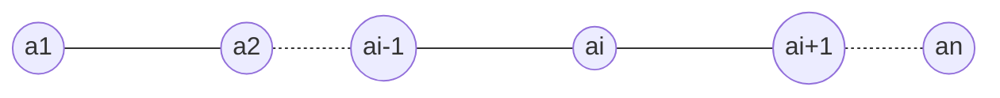

# 数据结构与算法

[toc]

> ## 线性表

### 1、知识框架

$$线性表 \begin{cases} 顺序存储 ---顺序表 \\ 链式存储 \begin{cases} \left.\begin{matrix} 单链表 \\ 双链表 \\ 循环链表 \end{matrix} \right\}指针实现 \\ 静态链表(借助数组实现)\end{cases} \end{cases}$$

### 2、定义

1. 线性表的数据集合为{a1,a2,…,an}，假设每个元素的类型均为DataType。其中，除第一个元素a1外，每一个元素有且只有一个直接前驱元素，除了最后一个元素an外，每一个元素有且只有一个直接后继元素。数据元素之间的关系是一对一的关系。
2. 在较复杂的线性表中，一个数据元素可以由若干个数据项组成。在这种情况下，常把数据元素称为**==记录==**，含有大量记录的线性表又称为**==文件==**




> ## 栈和队列

> ## 串、数组和广义表

> ## 树和二叉树

> ## 图

> ## 查找

> ## 排序


> ## 冒泡排序

```java
public class Test {
    public static void main(String[] args) {
        int[] array = new int[]{46,74,53,14,26,38,86,65,27,34};
        for (int i = 0; i < array.length; i++) {
            for (int j = 1; j < array.length; j++) {
                if (array[j - 1] < array[j]) {
                    int array1 = array[j];
                    array[j] = array[j - 1];
                    array[j - 1] = array1;
                }
            }
        }
        for (int i = 0; i < array.length; i++) {
            if (i == 0) {
                System.out.print("[" + array[i]);
            } else {
                System.out.print("," + array[i]);
            }
        }
        System.out.println("]");
    }
}
```

> ## 快速排序

快速排序算法步骤：

1. 在数组中选一个基准数（通常为数组第一个）；
2. 将数组中小于基准数的数据移到基准数左边，大于基准数的移到右边；
3. 对于基准数左、右两边的数组，不断重复以上两个过程，直到每个子集只有一个元素，即为全部有序。

例：有无序数列：13,45,76,10,19要球队数列进行快速排序
第一步：选择13作为基准数
第二步：将45与13进行比较，45>13，故将45移到数列右边，此时数列为13,76,10,19,45
第三步：将76与13进行比较，76>13，故将76移到数列右边，此时数列为13,10,19,45,76
第四步：将10与13进行比较，10<13，故将10移到数列左边，此时数列为10,13,19,45,76
第五步：将将19与13进行比较，19>13，故将19移到数列右边，此时数列为10,13,45,76,19
得到最终结果是10,13,45,76,19

```java
 for (int i = 1; i < quicksort.length; i++) {
            if (quicksort[i-1] <= quicksort[i]){
                int as = quicksort[10];
                quicksort[10] = quicksort[i];
                for (int j = i; j < quicksort.length; j++) {
                    if (j<quicksort.length) {
                        quicksort[j] = quicksort[j + 1];
                    }else if(j == quicksort.length){
                        quicksort[j] = as;
                    }
                }
            }else if(quicksort[i-1] > quicksort[i]){
                int as = quicksort[0];
                quicksort[0] = quicksort[i];
                for (int j = 0; j < i; j++) {
                    if (j < i) {
                        quicksort[j+1] = quicksort[j];
                    }else if(j == i-1){
                        quicksort[j] = as;
                    }else if(j==1){
                        quicksort[i]=quicksort[i-1];
                    }
                }
            }
            System.out.print(quicksort[i]);
        }
```

