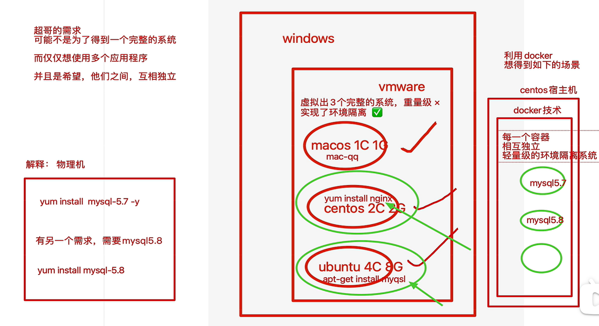
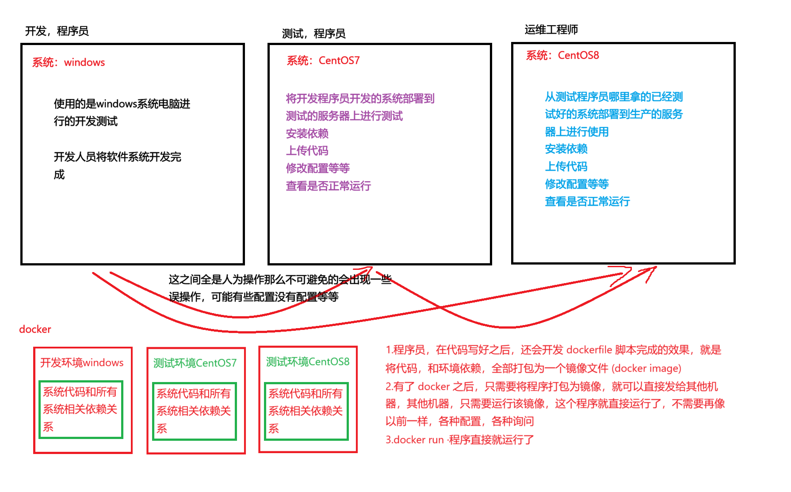
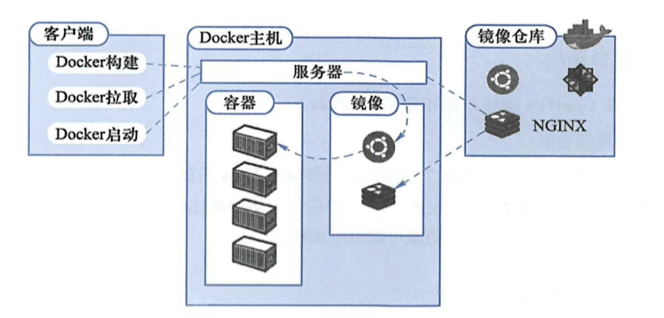

[toc]

# Docker+k8s

##  基础

* 纯物理服务器部署缺点

   * 部署非常慢
   * 成本非常高
   * 资源浪费
   * 难于迁移和扩展
   * 可能会被限定硬件厂商

* 虚拟机的部署形式

   * 一个物理机可以部署多个app
      * 一台物理机可以通过 vmware 虚拟化安装多个操作系统,每个操作系统可以运行单独的 app,因此一个物理机可以部署多个 app
   * 每个 app 独立运行在一个 VM 里

* 虚拟化与容器的对比

   
   
   

Docker 是一个开源的平台，用于自动化开发、部署和运行应用程序。它利用容器化技术来打包应用程序及其所有依赖项（如库、配置文件、环境变量等），使得应用程序可以在任何支持 Docker 的环境中一致地运行，无论是在开发人员的笔记本电脑上、测试服务器上还是生产环境中。以下是 Docker 的主要作用和优势：

1. **环境一致性**：通过将应用程序和其运行时环境打包在一起，Docker 确保了应用在不同环境中的一致性，从而解决了“在我的机器上能正常工作”的问题。

2. **快速部署和扩展**：Docker 容器启动非常快，几乎可以立即开始运行。这使得开发者能够迅速部署新版本的应用程序，并根据需要轻松扩展服务。

3. **资源隔离**：每个 Docker 容器都是独立的，拥有自己的文件系统、CPU、内存、网络接口等资源。这种隔离有助于防止一个容器中的问题影响到其他容器或宿主机。

4. **轻量级和高效**：与虚拟机相比，Docker 容器更轻量级，因为它们共享宿主机的操作系统内核，不需要为每个容器单独安装一个完整的操作系统。这提高了资源利用率，允许在同一台机器上运行更多的容器。

5. **易于分发**：Docker 提供了 Docker Hub 和其他类似的仓库服务，用户可以从这些地方下载预构建的镜像，也可以上传自己创建的镜像。这简化了软件的分发和共享过程。

6. **微服务架构支持**：Docker 对于实现微服务架构非常有用。它可以轻松地将大型应用程序分解成多个小型、独立的服务，每个服务都可以独立开发、部署和扩展。

7. **持续集成/持续部署 (CI/CD)**：Docker 与 CI/CD 工具链很好地集成，可以帮助团队更快地进行代码更改的测试和发布，同时减少了环境设置的时间和复杂度。

8. **安全性**：虽然容器之间是隔离的，但 Docker 也提供了额外的安全层，比如通过命名空间和控制组（cgroups）限制容器对系统资源的访问，以及通过安全策略和配置强化容器的安全性。

9. **多云和跨平台兼容性**：Docker 支持多种操作系统和云计算平台，包括 AWS、Azure、Google Cloud 等，使你能够灵活选择最适合你的基础设施。

### 图解docker部署

==利用 Docker 可以实现开发，测试，生产环境的部署一致性，极大的减少运维成本。==



* 使用docker的优点
   * 容器内的应用程序直接运行在宿主机的内核上，容器内没有自己的内核，也没有对硬件进行虚拟，因此容器比起虚拟机更为轻便。
* 容器对比 KVM 的好处
   * 容器能够提供宿主机的性能，而 kvm 虚拟机是分配宿主机硬件资源，性能较弱
   * 同样配置的宿主机，最多可以启动 10 个虚拟机的话，可以启动 100 +的容器数量。
   * 启动一个 KVM 虚拟机，得有一个完整的开机流程，花费时间较长，或许得 20S ，而启动一个容器只需要IS。
   * KVM 需要硬件 CPU 的虚拟化支持，而容器不需要。

### docker基础组件

<svg width="1500" height="500">
  <!-- 第三个园，面积最大 -->
  <circle cx="500" cy="250" r="250" fill="hsl(214, 33%, 82%)" opacity="0.5"/>
  <!-- 第二个园，面积是第一个的一倍 -->
  <circle cx="500" cy="300" r="200" fill="hsl(218, 29%, 67%)" opacity="0.5"/>
  <!-- 第一个园，面积最小 -->
  <circle cx="500" cy="350" r="150" fill="hsl(225, 27%, 45%)" opacity="0.5"/>
  <rect x="70" y="50" width="200" height="70" fill="white" stroke="black" stroke-width="1" />
  <rect x="" y="300" width="200" height="70" fill="white" stroke="black" stroke-width="1" />
  <rect x="730" y="50" width="200" height="70" fill="white" stroke="black" stroke-width="1" />
  <rect x="800" y="300" width="200" height="70"  fill="white" stroke="black" stroke-width="1"/>
    <text x="50" y="20" text-anchor="middle" dominant-baseline="central" font-size="20" fill="black">
        Docker 引擎
  </text>
    <text x="180" y="20" text-anchor="middle" dominant-baseline="central" font-size="14" fill="black">
        Docker Engine是C/S架构
  </text>
    <text x="500" y="400" text-anchor="middle" dominant-baseline="central" font-size="14" fill="black">
        服务器端 Docker进程 (Server Docker Daemon)
  </text>
    <text x="500" y="170" text-anchor="middle" dominant-baseline="central" font-size="14" fill="black">
    API接口 (REST API)
  </text>
    <text x="500" y="70" text-anchor="middle" dominant-baseline="central" font-size="14" fill="black">
    Docker客户端命令行 (Client Docker CLI)
  </text>
    <text x="170" y="90" text-anchor="middle" dominant-baseline="central" font-size="14" fill="black">
    容器 (Containers)
  </text>
    <text x="100" y="340" text-anchor="middle" dominant-baseline="central" font-size="14" fill="black">
    网络 (Networks)
  </text>
    <text x="830" y="90" text-anchor="middle" dominant-baseline="central" font-size="14" fill="black">
    镜像 (Images)
  </text>
    <text x="900" y="340" text-anchor="middle" dominant-baseline="central" font-size="14" fill="black">
    数据卷 (Data Volumes)
  </text>
    <line x1="270" y1="90" x2="310" y2="90" stroke="black" stroke-width="1" />
    <line x1="200" y1="340" x2="270" y2="340" stroke="black" stroke-width="1" />
    <line x1="690" y1="90" x2="730" y2="90" stroke="black" stroke-width="1" />
    <line x1="730" y1="340" x2="800" y2="340" stroke="black" stroke-width="1" />
</svg>

**Docker Daemon**

* 安装使用 Docker ，得先运行 Docker Daemon 进程，用于管理 docker ，如
   * 镜像 images
   * 容器 containers
   * 网络 network
   * 数据卷 Data V0lumes

**Rest 接口**

* 提供和Daemon交互的API接口

**Docker Client**

* 客户端使用的REST API和Docker Daemon进行访问。

**docker 平台组成**



* 客户端
   1. Docker构建：基于dockerfile构建镜像
   2. Docker拉取：下载别人的镜像docker pull
   3. Docker启动：启动docker 容器
* 镜像厂库
   1. 在网络中的一个仓库，用于管理docker的镜像image
   2. 运行image生成容器
* Docker主机：从镜像中拉取到容器中
* 核心组件
   * image 镜像，构建容器（我们讲应用程序运行所需的环境，打包为镜像文件）
   * Container ，容器（你的应用程序，就跑在容器中）
   * 镜像仓库 (dockerhub) （保存镜像文件，提供上传，下载镜像）作用好比 github
   * Dockerfi1e ，将你部署项目的操作，写成一个部署脚本，这就是 dockerfile, 且该脚本还能够构建出镜像文件

## docker-ce安装启动

* 准备一个宿主机（vmware创建一个linux机器，然后安装docker去使用）
  * Docker 引主要有两个版本：企业版（ (E) 和社区版 (CE)
  * 每个季度（1-3 ， 4-6 ， 7-9 ， 10-12） 企业版和社区版都会发布一个稳定版本（Stable)。 社区版本会提供 4 个月的支持，而企业版本会提供 12 个月的支持
  * 每个月社区版还会通过 Edge 方式发布月度版
  
* 安装初始环境：虚拟化 + 容器

  1. 更新yum源==阿里云==

     ```shell
     # 阿里云源
     wget -O /etc/yum.repos.d/CentOS-Base.repo https://mirrors.aliyun.com/repo/Centos-vault-8.5.2111.repo
     # 安装 epel 配置包
     yum install -y https://mirrors.aliyun.com/epel/epel-release-latest-8.noarch.rpm
     # 将 repo 配置中的地址替换为阿里云镜像站地址
     sed -i 's|^#baseurl=https://download.example/pub|baseurl=https://mirrors.aliyun.com|' /etc/yum.repos.d/epel*
     sed -i 's|^metalink|#metalink|' /etc/yum.repos.d/epel*
     
     # 清理缓存
     yum clean all
     # 从新加载yum缓存
     yum makecache
     
     # 查看所有已启用和禁用的仓库：
     yum repolist all
     # 只查看已启用的仓库：
     yum repolist enabled
     # 只查看已禁用的仓库：
     yum repolist disabled
     # 启用禁用的仓库：如果你想启用一个禁用的仓库，可以通过编辑相应的 .repo 文件将 enabled 设置为 1，或者使用命令行工具如 yum-config-manager 来更改仓库的状态。对于 EPEL 仓库，你可以使用如下命令来启用它：位置/etc/yum.repos.d/
     yum-config-manager --enable epel
     ```
  
  2. 安装常用工具
  
     ```
     yum install -y bash-completion vim lrzsz wget expect net-tools nc nmap tree dos2unix htop iftop iotop unzip telnet sl psmisc nethogs glances bc openldap-devel
     ```
  
     * **`bash-completion`**: 提供 Bash shell 的命令行补全功能，增强命令行体验。
     * **`vim`**: 一个强大的文本编辑器，广泛用于 Linux 系统管理和编程。
     * **`lrzsz`**: 提供 `rz` 和 `sz` 命令，用于通过串口或 SSH 传输文件。
     * **`wget`**: 一个非交互式的网络下载工具，支持 HTTP、HTTPS 和 FTP 协议。
     * **`expect`**: 一个用于自动化交互式应用程序的工具，常用于脚本编写。
     * **`net-tools`**: 包含传统的网络工具，如 `ifconfig`、`arp` 等。
     * **`nc` (Netcat)**: 一个网络工具，用于读写网络连接，常用于端口扫描和数据传输。
     * **`nmap`**: 一个网络扫描和安全审计工具，用于发现网络上的主机和服务。
     * **`tree`**: 以树状格式显示目录结构的命令行工具。
     * **`dos2unix`**: 用于将 DOS/Windows 格式的文本文件转换为 Unix 格式。
     * **`htop`**: 一个交互式的进程查看器，提供比 `top` 更友好的界面。
     * **`iftop`**: 显示当前网络连接的带宽使用情况。
     * **`iotop`**: 一个类似于 `top` 的工具，用于监控磁盘 I/O 使用情况。
     * **`unzip`**: 用于解压 `.zip` 文件的工具。
     * **`telnet`**: 一个简单的远程登录工具，虽然不推荐用于生产环境，但在某些情况下仍然有用。
     * **`sl`**: 一个有趣的命令行火车动画，常用于娱乐或作为 `ls` 命令的替代品（如果你经常误打 `sl`）。
     * **`psmisc`**: 包含一些有用的进程管理工具，如 `killall` 和 `pstree`。
     * **`nethogs`**: 一个按进程显示网络流量的工具。
     * **`glances`**: 一个跨平台的系统监控工具，提供 CPU、内存、磁盘、网络等资源的实时监控。
     * **`bc`**: 一个任意精度的计算器语言，常用于命令行计算。
     * **`ntpdate`**: 用于同步系统时间的工具（注意：在较新的系统中，建议使用 `chrony` 或 `systemd-timesyncd` 来替代 `ntpdate`）。
     * **`openldap-devel`**: 提供 OpenLDAP 开发库和头文件，用于开发与 LDAP 相关的应用程序。
  
     ==**禁用firewalld管理网络流量，使用disabled，以免和docker发生冲突**==
  
  3. 操作防火墙
  
     ```shell
     # 禁止开机自启
     systemctl disable firewalld
     # 关闭防火墙
     systemctl stop firewalld
     ```
  
  4. 修改 `/etc/selinux/config` 文件中的 SELinux 状态，将其从 `enforcing`（强制模式）更改为 `disabled`（禁用模式）。这个操作通常是为了调整系统的安全策略，特别是当你遇到与 SELinux 相关的问题或需要运行某些不兼容 SELinux 的应用程序时。
  
     ```shell
     sed -i.bak 's/SELINUX=enforcing/SELINUX=disabled/g' /etc/selinux/config
     ```
  
  5. 通过规则链（chains）来管理网络流量的处理方式。
  
     ```shell
     iptables -F：清空指定链中的所有规则，但不删除链本身或改变默认策略。
     iptables -X：删除用户自定义的空链，不能删除内置链或非空链。
     iptables -Z：重置指定链或所有链的包计数器和字节计数器。
     iptables-save：保存当前的 iptables 规则到文件中，方便后续恢复或备份。
     ```
  
* **安装docker**

  1. 开启linux内核流量转发、支持 Docker 的网络功能==在/etc/sysctl.d/docker.conf创建文件，将配置以行的形式写入docker.conf文件，以便docker管理网络==

     ```shell
     cat <<EOF > /etc/sysctl.d/docker.conf
     net.bridge.bridge-nf-call-ip6tables = 1
     net.bridge.bridge-nf-call-iptables = 1
     net.ipv4.conf.default.rp_filter = 0
     net.ipv4.conf.all.rp_filter = 0
     net.ipv4.ip_forward = 1
     EOF
     # 加载内核参数
     sysctl -p /etc/sysctl.d/docker.conf
     # 报错
     root@localhost sysctl.d]# sysctl -p /etc/sysctl.d/docker.conf
     sysctl: cannot stat /proc/sys/net/bridge/bridge-nf-call-ip6tables: No such file or directory
     sysctl: cannot stat /proc/sys/net/bridge/bridge-nf-call-iptables: No such file or directory
     # 执行
     modprobe br_netfilter
     # modprobe br_netfilter 命令用于加载 br_netfilter 内核模块，该模块使得通过桥接接口的 IPv4 和 IPv6 流量可以被 iptables 和 ip6tables 规则过滤。这对于使用 Docker 或其他需要桥接网络的虚拟化技术非常重要，因为它确保了容器之间的通信可以受到防火墙规则的控制，并且可以实现 NAT 和端口转发等功能。
     # 再次执行
     sysctl -p /etc/sysctl.d/docker.conf
     ```

     1. `net.bridge.bridge-nf-call-ip6tables = 1`
        - **作用**：启用 IPv6 流量通过桥接接口时调用 `ip6tables` 进行过滤。
        - **背景**：Docker 使用桥接网络来管理容器之间的通信。默认情况下，Linux 内核不会将 IPv6 流量传递给 `ip6tables` 进行处理。启用此选项后，IPv6 流量也会受到 `ip6tables` 规则的控制。
        - **适用场景**：如果你需要对 IPv6 流量进行防火墙控制，或者你有 IPv6 网络环境，建议启用此选项。
     2. `net.bridge.bridge-nf-call-iptables = 1`
        * **作用**：启用 IPv4 流量通过桥接接口时调用 `iptables` 进行过滤。**
        * **背景**：与上一条类似，Docker 使用桥接网络来管理容器之间的通信。默认情况下，Linux 内核不会将 IPv4 流量传递给 `iptables` 进行处理。启用此选项后，IPv4 流量也会受到 `iptables` 规则的控制。**
        * **适用场景**：如果你需要对 IPv4 流量进行防火墙控制，或者你有复杂的网络策略，建议启用此选项。这对于确保 Docker 容器的流量能够被 `iptables` 规则正确处理非常重要。

     3. `net.ipv4.conf.default.rp_filter = 0`
        * **作用**：禁用默认接口的逆路径过滤（Reverse Path Filtering, RP Filter）。
        * **背景**：RP Filter 是一种安全机制，用于防止 IP 欺骗攻击。它会检查数据包的源 IP 地址是否可以通过接收该数据包的接口返回到源地址。如果不能，数据包将被丢弃。禁用 RP Filter 可能会降低安全性，但它也可以解决某些网络拓扑中的问题，例如当系统处于多个网络之间时。
        * **适用场景**：如果你的网络拓扑较为复杂，或者你遇到与 RP Filter 相关的网络连接问题，可以考虑禁用它。然而，禁用 RP Filter 会增加遭受 IP 欺骗攻击的风险，因此在生产环境中应谨慎使用。

     4. `net.ipv4.conf.all.rp_filter`
        * **作用**：`net.ipv4.conf.all.rp_filter` 是一个 Linux 内核参数，用于控制所有网络接口的逆路径过滤（Reverse Path Filtering, RP Filter）。它决定了系统如何处理接收到的数据包，并检查这些数据包的源 IP 地址是否可以通过接收该数据包的接口返回到源地址。RP Filter 的主要目的是防止 IP 欺骗攻击，即防止恶意用户伪造源 IP 地址发送数据包。
          * `0`：禁用所有接口的 RP Filter。
          * `1`：启用严格模式的 RP Filter。
          * `2`：启用松散模式的 RP Filter。
        * **背景**：逆路径过滤（RP Filter）是一种安全机制，旨在防止 IP 欺骗攻击。IP 欺骗攻击是指攻击者通过伪造源 IP 地址发送数据包，试图绕过防火墙或其他安全措施。RP Filter 通过检查数据包的源 IP 地址是否可以通过接收该数据包的接口返回到源地址来识别和丢弃伪造的数据包。在默认情况下，Linux 内核会启用 RP Filter，以增强系统的安全性。然而，在某些网络环境中，特别是当系统处于多个网络之间时，RP Filter 可能会导致合法流量被错误地丢弃。因此，有时需要根据具体的网络拓扑和需求调整 RP Filter 的行为。
        * **适用场景**：Docker 使用桥接网络来管理容器之间的通信。在某些情况下，Docker 容器的流量可能会通过多个网络接口传输，导致 RP Filter 误判并丢弃合法流量。禁用 RP Filter 可以确保 Docker 容器之间的通信正常工作。

     5. `net.ipv4.ip_forward = 1`
        * **作用**：启用 IPv4 数据包转发。
        * **背景**：IP 转发允许系统充当路由器，将数据包从一个网络接口转发到另一个网络接口。Docker 需要启用 IP 转发，以便容器之间的通信能够正常工作，尤其是在使用桥接网络时。
        * **适用场景**：这是 Docker 正常运行所必需的配置。如果你没有启用 IP 转发，Docker 容器可能无法与其他容器或外部网络通信。

  2. **利用yum安装docker**

     * **配置yum仓库**

       ```shell
       # 查看yum源中docker的可用版本
       yum list docker-ce --showduplicates | sort -r
       # 配置阿里云的repo文件
       wget -O /etc/yum.repos.d/CentOS-Base.repo https://mirrors.aliyun.com/repo/Centos-vault-8.5.2111.repo
       # 配置docker的repo文件
       yum-config-manager --add-repo https://mirrors.aliyun.com/docker-ce/linux/centos/docker-ce.repo
       # 清理缓存
       yum clean all && yum makecache
       # 安装docker
       yum -y install docker-ce-[version]
       ```

     * 执行`yum-config-manager --add-repo https://mirrors.aliyun.com/docker-ce/linux/centos/docker-ce.repo`

       1. 解决方案

          ```shell
          # 检查当前的语言环境
          locale
          # 安装必要的语言包
          yum install langpacks-en
          # 配置语言环境
          # 编辑 /etc/locale.conf 文件，设置你想要的语言环境。例如，设置为 en_US.UTF-8：
          localectl set-locale LANG=en_US.UTF-8
          # 或者直接编辑 /etc/locale.conf 文件：
          vi /etc/locale.conf
          LANG=en_US.UTF-8
          ```

     * **CentOS （使用 yum 进行安装)**

       ```shell
       # step 1: 安装必要的一些系统工具
       sudo yum install -y yum-utils
       
       # Step 2: 添加软件源信息
       yum-config-manager --add-repo https://mirrors.aliyun.com/docker-ce/linux/centos/docker-ce.repo
       
       # Step 3: 安装Docker
       sudo yum install docker-ce docker-ce-cli containerd.io docker-buildx-plugin docker-compose-plugin
       
       # Step 4: 开启Docker服务
       sudo service docker start
       
       # 注意：
       # 官方软件源默认启用了最新的软件，您可以通过编辑软件源的方式获取各个版本的软件包。例如官方并没有将测试版本的软件源置为可用，您可以通过以下方式开启。同理可以开启各种测试版本等。
       # vim /etc/yum.repos.d/docker-ce.repo
       #   将[docker-ce-test]下方的enabled=0修改为enabled=1
       #
       # 安装指定版本的Docker-CE:
       # Step 1: 查找Docker-CE的版本:
       # yum list docker-ce.x86_64 --showduplicates | sort -r
       #   Loading mirror speeds from cached hostfile
       #   Loaded plugins: branch, fastestmirror, langpacks
       #   docker-ce.x86_64            17.03.1.ce-1.el7.centos            docker-ce-stable
       #   docker-ce.x86_64            17.03.1.ce-1.el7.centos            @docker-ce-stable
       #   docker-ce.x86_64            17.03.0.ce-1.el7.centos            docker-ce-stable
       #   Available Packages
       # Step2: 安装指定版本的Docker-CE: (VERSION例如上面的17.03.0.ce.1-1.el7.centos)
       # sudo yum -y install docker-ce-[VERSION]
       ```

     * **配置docker镜像**

       ==使用 docker 首要操作就是获取镜像文件，默认下是从 Docker Hub 下栽，网速较慢，国内很多云服务商都提供了加速器服务，阿里云加速器， DaocIoud 加速器，灵雀云加速器。==

       ```shell
       # 创建docker配置文件
       mkdir /etc/docker
       touch /etc/docker/daemon.json
       # 添加配置
       vim /etc/docker/daemon.json
       {
         "registry-mirrors": ["https://qpr2tvq3.mirror.aliyuncs.com","http://hub-mirror.c.163.com","https://registry.docker-cn.com"]
       }
       curl -v https://qpr2tvq3.mirror.aliyuncs.com
       # 重启，设置开机自启
       systemctl daemon-reload # 重新加载systemctl服务
       systemctl enable docker # 启动docker服务，开机自启动
       systemctl restart docke
       ```

  3. **启动测试docker**

     1. 启动docker服务
  
        ```shell
        systemctl start docker
        ```

     2. 查看docker服务状态
  
        ```shell
        systemctl status docker
        ```

     3. 停止docker
  
        ```shell
        # 关闭docker开机自启
        systemctl disable docker
        systemctl disable docker.socket
        # 关闭docker
        systemctl stop docker.socket && systemctl stop docker
        ps -ef | grep docker
        ```
  
        * `docker.socket` 是 Docker 服务的一个重要组成部分，它允许 Docker 守护程序按需启动，而不是一直运行在后台。通过 `docker.socket`，你可以提高系统的效率，同时确保 Docker 在需要时能够快速响应。你可以根据自己的需求选择是否启用或禁用 `docker.socket`，并使用 `systemctl` 命令来管理它的状态。

### docker用法

1. 第一个docker容器：运行nginx

   * 查看镜像

      ```
      docker search 名称
      # 查看你nginx镜像
      docker search nginx
      ```

      

## docker生命周期详解

## 用docker使用三种操作系统

## docker让老王早点下班

## 详解docker镜像原理(一)
## docker镜像原理详解（二）
## docker镜像管理一
## 获取docker镜像
## 查看docker镜像
## 删除docker镜像
## docker镜像综合管理
## 玩转docker容器
## 知识回顾与dockerfile学习
## 应该如何使用dockerfile
## 趣学dockerfile指令
## 再看dockerfile指令用法
## 面试题：cmd和entrypoint区别
## 指令ENV和VOLUME玩法
## 其他指令
## docker部署python网站
## docker小结（一）
## docker小结（二）
## docker小结（三）
## docker小结（四）
## 如何学习新容器技术
## 物理机演进到虚拟化部署时代
## 图解名称空间三大块
## Docker使用原理流程
## 传统虚拟机部署模式
## 容器化部署架构一
## 基于docker的交付模式
## 理解学k8s的本质需求
## 该如何学习k8s组件
## K8s为了解决容器部署难题
## 解读官网k8s特性
## K8s是容器管理平台
## 容器平台的几大特性
## K8s核心组件的作用
## 面试题pod创建流程
## 图解pod作用
## 图解k8s几大概念作用
## K8s-Master部署
## K8s-Node部署
## K8s-网络插件部署与pod实践