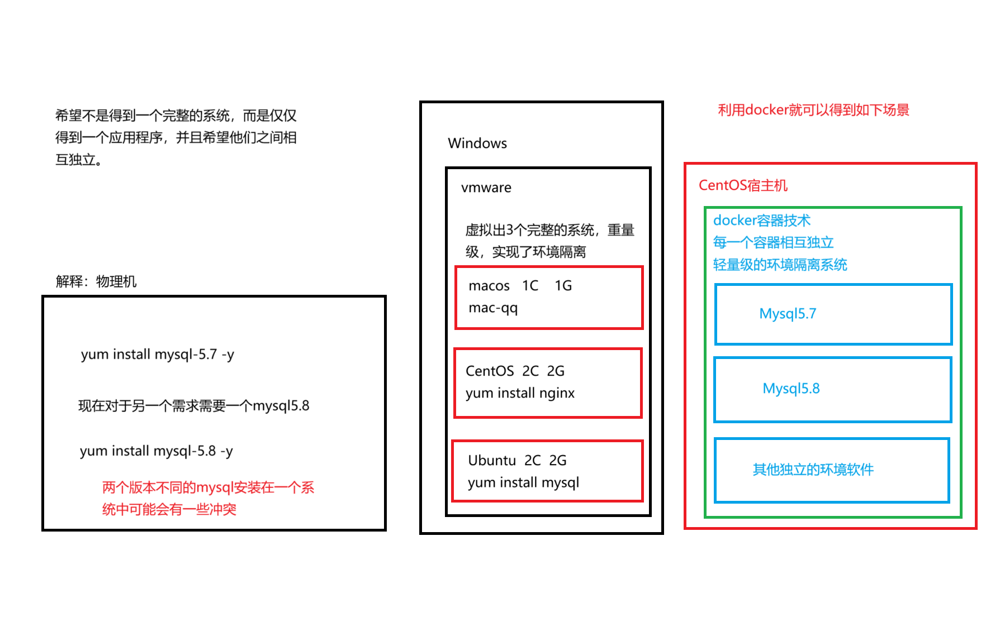
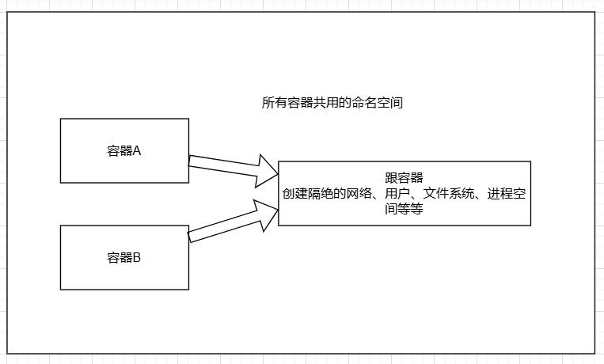
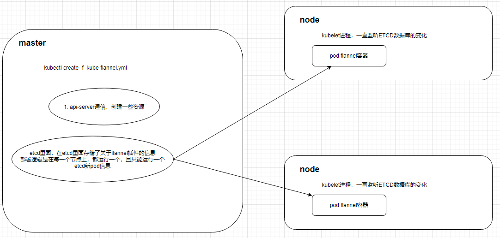

[toc]

# Docker+k8s

##  基础


* 纯物理服务器部署缺点

   * 部署非常慢
   * 成本非常高
   * 资源浪费
   * 难于迁移和扩展
   * 可能会被限定硬件厂商

* 虚拟机的部署形式

   * 一个物理机可以部署多个app
      * 一台物理机可以通过 vmware 虚拟化安装多个操作系统,每个操作系统可以运行单独的 app,因此一个物理机可以部署多个 app
   * 每个 app 独立运行在一个 VM 里

* 虚拟化与容器的对比

   

   

Docker 是一个开源的平台，用于自动化开发、部署和运行应用程序。它利用容器化技术来打包应用程序及其所有依赖项（如库、配置文件、环境变量等），使得应用程序可以在任何支持 Docker 的环境中一致地运行，无论是在开发人员的笔记本电脑上、测试服务器上还是生产环境中。以下是 Docker 的主要作用和优势：

1. **环境一致性**：通过将应用程序和其运行时环境打包在一起，Docker 确保了应用在不同环境中的一致性，从而解决了“在我的机器上能正常工作”的问题。

2. **快速部署和扩展**：Docker 容器启动非常快，几乎可以立即开始运行。这使得开发者能够迅速部署新版本的应用程序，并根据需要轻松扩展服务。

3. **资源隔离**：每个 Docker 容器都是独立的，拥有自己的文件系统、CPU、内存、网络接口等资源。这种隔离有助于防止一个容器中的问题影响到其他容器或宿主机。

4. **轻量级和高效**：与虚拟机相比，Docker 容器更轻量级，因为它们共享宿主机的操作系统内核，不需要为每个容器单独安装一个完整的操作系统。这提高了资源利用率，允许在同一台机器上运行更多的容器。

5. **易于分发**：Docker 提供了 Docker Hub 和其他类似的仓库服务，用户可以从这些地方下载预构建的镜像，也可以上传自己创建的镜像。这简化了软件的分发和共享过程。

6. **微服务架构支持**：Docker 对于实现微服务架构非常有用。它可以轻松地将大型应用程序分解成多个小型、独立的服务，每个服务都可以独立开发、部署和扩展。

7. **持续集成/持续部署 (CI/CD)**：Docker 与 CI/CD 工具链很好地集成，可以帮助团队更快地进行代码更改的测试和发布，同时减少了环境设置的时间和复杂度。

8. **安全性**：虽然容器之间是隔离的，但 Docker 也提供了额外的安全层，比如通过命名空间和控制组（cgroups）限制容器对系统资源的访问，以及通过安全策略和配置强化容器的安全性。

9. **多云和跨平台兼容性**：Docker 支持多种操作系统和云计算平台，包括 AWS、Azure、Google Cloud 等，使你能够灵活选择最适合你的基础设施。

### 图解docker部署

==利用 Docker 可以实现开发，测试，生产环境的部署一致性，极大的减少运维成本。==


* 使用docker的优点
   * 容器内的应用程序直接运行在宿主机的内核上，容器内没有自己的内核，也没有对硬件进行虚拟，因此容器比起虚拟机更为轻便。
* 容器对比 KVM 的好处
   * 容器能够提供宿主机的性能，而 kvm 虚拟机是分配宿主机硬件资源，性能较弱
   * 同样配置的宿主机，最多可以启动 10 个虚拟机的话，可以启动 100 +的容器数量。
   * 启动一个 KVM 虚拟机，得有一个完整的开机流程，花费时间较长，或许得 20S ，而启动一个容器只需要IS。
   * KVM 需要硬件 CPU 的虚拟化支持，而容器不需要。

### docker基础组件

<svg width="1500" height="500">
  <!-- 第三个园，面积最大 -->
  <circle cx="500" cy="250" r="250" fill="hsl(214, 33%, 82%)" opacity="0.5"/>
  <!-- 第二个园，面积是第一个的一倍 -->
  <circle cx="500" cy="300" r="200" fill="hsl(218, 29%, 67%)" opacity="0.5"/>
  <!-- 第一个园，面积最小 -->
  <circle cx="500" cy="350" r="150" fill="hsl(225, 27%, 45%)" opacity="0.5"/>
  <rect x="70" y="50" width="200" height="70" fill="white" stroke="black" stroke-width="1" />
  <rect x="" y="300" width="200" height="70" fill="white" stroke="black" stroke-width="1" />
  <rect x="730" y="50" width="200" height="70" fill="white" stroke="black" stroke-width="1" />
  <rect x="800" y="300" width="200" height="70"  fill="white" stroke="black" stroke-width="1"/>
    <text x="50" y="20" text-anchor="middle" dominant-baseline="central" font-size="20" fill="black">
        Docker 引擎
  </text>
    <text x="180" y="20" text-anchor="middle" dominant-baseline="central" font-size="14" fill="black">
        Docker Engine是C/S架构
  </text>
    <text x="500" y="400" text-anchor="middle" dominant-baseline="central" font-size="14" fill="black">
        服务器端 Docker进程 (Server Docker Daemon)
  </text>
    <text x="500" y="170" text-anchor="middle" dominant-baseline="central" font-size="14" fill="black">
    API接口 (REST API)
  </text>
    <text x="500" y="70" text-anchor="middle" dominant-baseline="central" font-size="14" fill="black">
    Docker客户端命令行 (Client Docker CLI)
  </text>
    <text x="170" y="90" text-anchor="middle" dominant-baseline="central" font-size="14" fill="black">
    容器 (Containers)
  </text>
    <text x="100" y="340" text-anchor="middle" dominant-baseline="central" font-size="14" fill="black">
    网络 (Networks)
  </text>
    <text x="830" y="90" text-anchor="middle" dominant-baseline="central" font-size="14" fill="black">
    镜像 (Images)
  </text>
    <text x="900" y="340" text-anchor="middle" dominant-baseline="central" font-size="14" fill="black">
    数据卷 (Data Volumes)
  </text>
    <line x1="270" y1="90" x2="310" y2="90" stroke="black" stroke-width="1" />
    <line x1="200" y1="340" x2="270" y2="340" stroke="black" stroke-width="1" />
    <line x1="690" y1="90" x2="730" y2="90" stroke="black" stroke-width="1" />
    <line x1="730" y1="340" x2="800" y2="340" stroke="black" stroke-width="1" />
</svg>

**Docker Daemon**

* 安装使用 Docker ，得先运行 Docker Daemon 进程，用于管理 docker ，如
   * 镜像 images
   * 容器 containers
   * 网络 network
   * 数据卷 Data V0lumes

**Rest 接口**

* 提供和Daemon交互的API接口

**Docker Client**

* 客户端使用的REST API和Docker Daemon进行访问。

**docker 平台组成**


* 客户端
   1. Docker构建：基于dockerfile构建镜像
   2. Docker拉取：下载别人的镜像docker pull
   3. Docker启动：启动docker 容器
* 镜像厂库
   1. 在网络中的一个仓库，用于管理docker的镜像image
   2. 运行image生成容器
* Docker主机：从镜像中拉取到容器中
* 核心组件
   * image 镜像，构建容器（我们讲应用程序运行所需的环境，打包为镜像文件）
   * Container ，容器（你的应用程序，就跑在容器中）
   * 镜像仓库 (dockerhub) （保存镜像文件，提供上传，下载镜像）作用好比 github
   * Dockerfi1e ，将你部署项目的操作，写成一个部署脚本，这就是 dockerfile, 且该脚本还能够构建出镜像文件

## docker-ce安装启动

* 准备一个宿主机（vmware创建一个linux机器，然后安装docker去使用）
  * Docker 引主要有两个版本：企业版（ (E) 和社区版 (CE)
  * 每个季度（1-3 ， 4-6 ， 7-9 ， 10-12） 企业版和社区版都会发布一个稳定版本（Stable)。 社区版本会提供 4 个月的支持，而企业版本会提供 12 个月的支持
  * 每个月社区版还会通过 Edge 方式发布月度版
  
* 安装初始环境：虚拟化 + 容器

  1. 更新yum源==阿里云==

     ```shell
     # 备份
     mv /etc/yum.repos.d/ /etc/yum.repos.d_bak && mkdir /etc/yum.repos.d/
     # 阿里云源
     wget -O /etc/yum.repos.d/CentOS-Base.repo https://mirrors.aliyun.com/repo/Centos-vault-8.5.2111.repo
     # 安装 epel 配置包
     yum install -y https://mirrors.aliyun.com/epel/epel-release-latest-8.noarch.rpm
     # 将 repo 配置中的地址替换为阿里云镜像站地址
     sed -i 's|^#baseurl=https://download.example/pub|baseurl=https://mirrors.aliyun.com|' /etc/yum.repos.d/epel*
     sed -i 's|^metalink|#metalink|' /etc/yum.repos.d/epel*
     
     # 清理缓存
     yum clean all
     # 从新加载yum缓存
     yum makecache
     
     # 查看所有已启用和禁用的仓库：
     yum repolist all
     # 只查看已启用的仓库：
     yum repolist enabled
     # 只查看已禁用的仓库：
     yum repolist disabled
     # 启用禁用的仓库：如果你想启用一个禁用的仓库，可以通过编辑相应的 .repo 文件将 enabled 设置为 1，或者使用命令行工具如 yum-config-manager 来更改仓库的状态。对于 EPEL 仓库，你可以使用如下命令来启用它：位置/etc/yum.repos.d/
     yum-config-manager --enable epel
     ```
  
  2. 安装常用工具
  
     ```
     yum install -y bash-completion vim lrzsz wget expect net-tools nc nmap tree dos2unix htop iftop iotop unzip telnet sl psmisc nethogs glances bc openldap-devel
     ```
  
     * **`bash-completion`**: 提供 Bash shell 的命令行补全功能，增强命令行体验。
     * **`vim`**: 一个强大的文本编辑器，广泛用于 Linux 系统管理和编程。
     * **`lrzsz`**: 提供 `rz` 和 `sz` 命令，用于通过串口或 SSH 传输文件。
     * **`wget`**: 一个非交互式的网络下载工具，支持 HTTP、HTTPS 和 FTP 协议。
     * **`expect`**: 一个用于自动化交互式应用程序的工具，常用于脚本编写。
     * **`net-tools`**: 包含传统的网络工具，如 `ifconfig`、`arp` 等。
     * **`nc` (Netcat)**: 一个网络工具，用于读写网络连接，常用于端口扫描和数据传输。
     * **`nmap`**: 一个网络扫描和安全审计工具，用于发现网络上的主机和服务。
     * **`tree`**: 以树状格式显示目录结构的命令行工具。
     * **`dos2unix`**: 用于将 DOS/Windows 格式的文本文件转换为 Unix 格式。
     * **`htop`**: 一个交互式的进程查看器，提供比 `top` 更友好的界面。
     * **`iftop`**: 显示当前网络连接的带宽使用情况。
     * **`iotop`**: 一个类似于 `top` 的工具，用于监控磁盘 I/O 使用情况。
     * **`unzip`**: 用于解压 `.zip` 文件的工具。
     * **`telnet`**: 一个简单的远程登录工具，虽然不推荐用于生产环境，但在某些情况下仍然有用。
     * **`sl`**: 一个有趣的命令行火车动画，常用于娱乐或作为 `ls` 命令的替代品（如果你经常误打 `sl`）。
     * **`psmisc`**: 包含一些有用的进程管理工具，如 `killall` 和 `pstree`。
     * **`nethogs`**: 一个按进程显示网络流量的工具。
     * **`glances`**: 一个跨平台的系统监控工具，提供 CPU、内存、磁盘、网络等资源的实时监控。
     * **`bc`**: 一个任意精度的计算器语言，常用于命令行计算。
     * **`ntpdate`**: 用于同步系统时间的工具（注意：在较新的系统中，建议使用 `chrony` 或 `systemd-timesyncd` 来替代 `ntpdate`）。
     * **`openldap-devel`**: 提供 OpenLDAP 开发库和头文件，用于开发与 LDAP 相关的应用程序。
  
     ==**禁用firewalld管理网络流量，使用disabled，以免和docker发生冲突**==
  
  3. 操作防火墙
  
     ```shell
     # 禁止开机自启
     systemctl disable firewalld
     # 关闭防火墙
     systemctl stop firewalld
     ```
  
  4. 修改 `/etc/selinux/config` 文件中的 SELinux 状态，将其从 `enforcing`（强制模式）更改为 `disabled`（禁用模式）。这个操作通常是为了调整系统的安全策略，特别是当你遇到与 SELinux 相关的问题或需要运行某些不兼容 SELinux 的应用程序时。
  
     ```shell
     sed -i.bak 's/SELINUX=enforcing/SELINUX=disabled/g' /etc/selinux/config
     ```
  
  5. 通过规则链（chains）来管理网络流量的处理方式。
  
     ```shell
     iptables -F：清空指定链中的所有规则，但不删除链本身或改变默认策略。
     iptables -X：删除用户自定义的空链，不能删除内置链或非空链。
     iptables -Z：重置指定链或所有链的包计数器和字节计数器。
     iptables-save：保存当前的 iptables 规则到文件中，方便后续恢复或备份。
     ```
  
* **安装docker**

  1. 开启linux内核流量转发、支持 Docker 的网络功能==在/etc/sysctl.d/docker.conf创建文件，将配置以行的形式写入docker.conf文件，以便docker管理网络==

     ```shell
     cat <<EOF > /etc/sysctl.d/docker.conf
     net.bridge.bridge-nf-call-ip6tables = 1
     net.bridge.bridge-nf-call-iptables = 1
     net.ipv4.conf.default.rp_filter = 0
     net.ipv4.conf.all.rp_filter = 0
     net.ipv4.ip_forward = 1
     EOF
     # 加载内核参数
     sysctl -p /etc/sysctl.d/docker.conf
     # 报错
     root@localhost sysctl.d]# sysctl -p /etc/sysctl.d/docker.conf
     sysctl: cannot stat /proc/sys/net/bridge/bridge-nf-call-ip6tables: No such file or directory
     sysctl: cannot stat /proc/sys/net/bridge/bridge-nf-call-iptables: No such file or directory
     # 执行
     modprobe br_netfilter
     # modprobe br_netfilter 命令用于加载 br_netfilter 内核模块，该模块使得通过桥接接口的 IPv4 和 IPv6 流量可以被 iptables 和 ip6tables 规则过滤。这对于使用 Docker 或其他需要桥接网络的虚拟化技术非常重要，因为它确保了容器之间的通信可以受到防火墙规则的控制，并且可以实现 NAT 和端口转发等功能。
     # 再次执行
     sysctl -p /etc/sysctl.d/docker.conf
     ```

     1. `net.bridge.bridge-nf-call-ip6tables = 1`
        - **作用**：启用 IPv6 流量通过桥接接口时调用 `ip6tables` 进行过滤。
        - **背景**：Docker 使用桥接网络来管理容器之间的通信。默认情况下，Linux 内核不会将 IPv6 流量传递给 `ip6tables` 进行处理。启用此选项后，IPv6 流量也会受到 `ip6tables` 规则的控制。
        - **适用场景**：如果你需要对 IPv6 流量进行防火墙控制，或者你有 IPv6 网络环境，建议启用此选项。
     2. `net.bridge.bridge-nf-call-iptables = 1`
        * **作用**：启用 IPv4 流量通过桥接接口时调用 `iptables` 进行过滤。**
        * **背景**：与上一条类似，Docker 使用桥接网络来管理容器之间的通信。默认情况下，Linux 内核不会将 IPv4 流量传递给 `iptables` 进行处理。启用此选项后，IPv4 流量也会受到 `iptables` 规则的控制。**
        * **适用场景**：如果你需要对 IPv4 流量进行防火墙控制，或者你有复杂的网络策略，建议启用此选项。这对于确保 Docker 容器的流量能够被 `iptables` 规则正确处理非常重要。

     3. `net.ipv4.conf.default.rp_filter = 0`
        * **作用**：禁用默认接口的逆路径过滤（Reverse Path Filtering, RP Filter）。
        * **背景**：RP Filter 是一种安全机制，用于防止 IP 欺骗攻击。它会检查数据包的源 IP 地址是否可以通过接收该数据包的接口返回到源地址。如果不能，数据包将被丢弃。禁用 RP Filter 可能会降低安全性，但它也可以解决某些网络拓扑中的问题，例如当系统处于多个网络之间时。
        * **适用场景**：如果你的网络拓扑较为复杂，或者你遇到与 RP Filter 相关的网络连接问题，可以考虑禁用它。然而，禁用 RP Filter 会增加遭受 IP 欺骗攻击的风险，因此在生产环境中应谨慎使用。

     4. `net.ipv4.conf.all.rp_filter`
        * **作用**：`net.ipv4.conf.all.rp_filter` 是一个 Linux 内核参数，用于控制所有网络接口的逆路径过滤（Reverse Path Filtering, RP Filter）。它决定了系统如何处理接收到的数据包，并检查这些数据包的源 IP 地址是否可以通过接收该数据包的接口返回到源地址。RP Filter 的主要目的是防止 IP 欺骗攻击，即防止恶意用户伪造源 IP 地址发送数据包。
          * `0`：禁用所有接口的 RP Filter。
          * `1`：启用严格模式的 RP Filter。
          * `2`：启用松散模式的 RP Filter。
        * **背景**：逆路径过滤（RP Filter）是一种安全机制，旨在防止 IP 欺骗攻击。IP 欺骗攻击是指攻击者通过伪造源 IP 地址发送数据包，试图绕过防火墙或其他安全措施。RP Filter 通过检查数据包的源 IP 地址是否可以通过接收该数据包的接口返回到源地址来识别和丢弃伪造的数据包。在默认情况下，Linux 内核会启用 RP Filter，以增强系统的安全性。然而，在某些网络环境中，特别是当系统处于多个网络之间时，RP Filter 可能会导致合法流量被错误地丢弃。因此，有时需要根据具体的网络拓扑和需求调整 RP Filter 的行为。
        * **适用场景**：Docker 使用桥接网络来管理容器之间的通信。在某些情况下，Docker 容器的流量可能会通过多个网络接口传输，导致 RP Filter 误判并丢弃合法流量。禁用 RP Filter 可以确保 Docker 容器之间的通信正常工作。

     5. `net.ipv4.ip_forward = 1`
        * **作用**：启用 IPv4 数据包转发。
        * **背景**：IP 转发允许系统充当路由器，将数据包从一个网络接口转发到另一个网络接口。Docker 需要启用 IP 转发，以便容器之间的通信能够正常工作，尤其是在使用桥接网络时。
        * **适用场景**：这是 Docker 正常运行所必需的配置。如果你没有启用 IP 转发，Docker 容器可能无法与其他容器或外部网络通信。

  2. **压缩包安装docker**

     * 下载压缩包`download.docker.com`，上传到服务器，解压到`/usr/bin`目录下

     * 在`/etc/docker`目录下创建配置文件
  
       ```json
       # 创建docker配置文件
       mkdir /etc/docker
       touch /etc/docker/daemon.json
       # 添加配置
       vim /etc/docker/daemon.json
       {
         "registry-mirrors": ["https://qpr2tvq3.mirror.aliyuncs.com"],//公共仓库地址
         "exec-opts": ["native.cgroupdriver=systemd"],// 指定容器运行时的执行选项。
         "insecure-registries": ["192.168.31.96:80"]// 允许 Docker 使用非安全的私有镜像仓库。
         "data-root":"/home/docker"//数据文件存放地址
       }
       ```
  
     * 到`/etc/systemd/system`目录下创建一个docker系统服务`docker.service`然后就可以启动docker了
  
  3. **利用yum安装docker**
  
     * **配置yum仓库**
  
       ```shell
       # 查看yum源中docker的可用版本
       yum list docker-ce --showduplicates | sort -r
       # 配置阿里云的repo文件
       wget -O /etc/yum.repos.d/CentOS-Base.repo https://mirrors.aliyun.com/repo/Centos-vault-8.5.2111.repo
       # 配置docker的repo文件
       yum-config-manager --add-repo https://mirrors.aliyun.com/docker-ce/linux/centos/docker-ce.repo -y
       # 清理缓存
       yum clean all && yum makecache
       # 安装docker20.10.6
       yum -y install docker-ce-[version]
       ```
  
     * 执行`yum-config-manager --add-repo https://mirrors.aliyun.com/docker-ce/linux/centos/docker-ce.repo`
  
       1. 解决方案
  
          ```shell
          # 检查当前的语言环境
          locale
          # 安装必要的语言包
          yum install langpacks-en
          # 配置语言环境
          # 编辑 /etc/locale.conf 文件，设置你想要的语言环境。例如，设置为 en_US.UTF-8：
          localectl set-locale LANG=en_US.UTF-8
          # 或者直接编辑 /etc/locale.conf 文件：
          vi /etc/locale.conf
          LANG=en_US.UTF-8
          ```
  
     * **CentOS （使用 yum 进行安装)**
  
       ```shell
       # step 1: 安装必要的一些系统工具
       sudo yum install -y yum-utils
       
       # Step 2: 添加软件源信息
       yum-config-manager --add-repo https://mirrors.aliyun.com/docker-ce/linux/centos/docker-ce.repo
       
       # Step 3: 安装Docker
       sudo yum install docker-ce docker-ce-cli containerd.io docker-buildx-plugin docker-compose-plugin
       
       # Step 4: 开启Docker服务
       sudo service docker start
       
       # 注意：
       # 官方软件源默认启用了最新的软件，您可以通过编辑软件源的方式获取各个版本的软件包。例如官方并没有将测试版本的软件源置为可用，您可以通过以下方式开启。同理可以开启各种测试版本等。
       # vim /etc/yum.repos.d/docker-ce.repo
       #   将[docker-ce-test]下方的enabled=0修改为enabled=1
       #
       # 安装指定版本的Docker-CE:
       # Step 1: 查找Docker-CE的版本:
       # yum list docker-ce.x86_64 --showduplicates | sort -r
       #   Loading mirror speeds from cached hostfile
       #   Loaded plugins: branch, fastestmirror, langpacks
       #   docker-ce.x86_64            17.03.1.ce-1.el7.centos            docker-ce-stable
       #   docker-ce.x86_64            17.03.1.ce-1.el7.centos            @docker-ce-stable
       #   docker-ce.x86_64            17.03.0.ce-1.el7.centos            docker-ce-stable
       #   Available Packages
       # Step2: 安装指定版本的Docker-CE: (VERSION例如上面的17.03.0.ce.1-1.el7.centos)
       # sudo yum -y install docker-ce-[VERSION]
       ```
  
     * **配置docker镜像**
  
       ==使用 docker 首要操作就是获取镜像文件，默认下是从 Docker Hub 下栽，网速较慢，国内很多云服务商都提供了加速器服务，阿里云加速器， DaocIoud 加速器，灵雀云加速器。==
  
       ```shell
       # 创建docker配置文件
       mkdir /etc/docker
       touch /etc/docker/daemon.json
       # 添加配置
       vim /etc/docker/daemon.json
       {
         "registry-mirrors": ["https://qpr2tvq3.mirror.aliyuncs.com"]
       }
       # 重启，设置开机自启
       systemctl daemon-reload # 重新加载systemctl服务
       systemctl enable docker # 启动docker服务，开机自启动
       systemctl restart docke # 重启
       ```
       
     * SHELL
  
       ```shell
       yum install -y bash-completion vim lrzsz wget expect net-tools nc nmap tree dos2unix htop iftop iotop unzip telnet sl psmisc nethogs glances bc openldap-devel yum-utils
       systemctl disable firewalld
       systemctl stop firewalld
       cat <<EOF > /etc/sysctl.d/docker.conf
       net.bridge.bridge-nf-call-ip6tables = 1
       net.bridge.bridge-nf-call-iptables = 1
       net.ipv4.conf.default.rp_filter = 0
       net.ipv4.conf.all.rp_filter = 0
       net.ipv4.ip_forward = 1
       EOF
       modprobe br_netfilter
       sysctl -p /etc/sysctl.d/docker.conf
       wget -O /etc/yum.repos.d/CentOS-Base.repo https://mirrors.aliyun.com/repo/Centos-vault-8.5.2111.repo
       yum-config-manager --add-repo https://mirrors.aliyun.com/docker-ce/linux/centos/docker-ce.repo -y
       yum clean all && yum makecache
       yum -y install docker-ce-26.1.3
       docker version
       ```
  
  4. **启动测试docker**
  
     1. 启动docker服务
  
        ```shell
        systemctl start docker
        ```
  
     2. 查看docker服务状态
  
        ```shell
        systemctl status docker
        ```
  
     3. 停止docker
  
        ```shell
        # 关闭docker开机自启
        systemctl disable docker
        systemctl disable docker.socket
        # 关闭docker
        systemctl stop docker.socket && systemctl stop docker
        ps -ef | grep docker
        ```
  
        * `docker.socket` 是 Docker 服务的一个重要组成部分，它允许 Docker 守护程序按需启动，而不是一直运行在后台。通过 `docker.socket`，你可以提高系统的效率，同时确保 Docker 在需要时能够快速响应。你可以根据自己的需求选择是否启用或禁用 `docker.socket`，并使用 `systemctl` 命令来管理它的状态。

### docker用法

1. 第一个docker容器：运行nginx

   * 查看镜像

      ```shell
      docker search 名称
      # 查看nginx镜像，搜索镜像文件是否存在
      docker search nginx
      ```
      
   * 步骤

      1. 获取镜像
      2. 运行镜像，生成容器，想要的容器就运行在容器中
      

2. 使用自己的docker阿里云私有仓库

   * 登录

      ```shell
      docker login --username=lisuxin crpi-qo0vvg6tfj5fe102.us-west-1.personal.cr.aliyuncs.com
      # 密码w}+tK6UB
      ```

3. 使用命令

   * 拉取镜像：`docker pull 需要的镜像:版本号`

      * 自己的镜像`docker pull crpi-qo0vvg6tfj5fe102.us-west-1.personal.cr.aliyuncs.com/lisuxin/nginx:版本号`

   * 查看本地docker镜像有哪些`docker image ls`

      ```shell
      厂库地址                                                                  标签       镜像ID          创建时间         大小
      REPOSITORY                                                               TAG       IMAGE ID       CREATED         SIZE
      crpi-qo0vvg6tfj5fe102.us-west-1.personal.cr.aliyuncs.com/lisuxin/nginx   1.24      6c0218f16876   20 months ago   142MB
      ```

   * 删除镜像`docker rmi 镜像ID`

   * 删除docker镜像引用标签`docker rmi 仓库地址:标签`

   * 运行镜像`dockers run 参数`
   
      * 参数：镜像名字或ID
      * `docker run -d -p 80:80 nginx`
      * `-d`：后台运行
      * `-p 80:80`：端口映射，访问宿主机端口也就访问容器内端口
      * `–v`：数据目录映射
      * 运行容器后会返回容器ID
   
   * 查看docker容器有哪些在运行`docker ps`
   
      ```
      容器ID          镜像ID         容器启动时执行的默认命令      创建时间          状态          端口映射                            （名称）docker为容器分配的名称
      CONTAINER ID   IMAGE          COMMAND                   CREATED         STATUS         PORTS                               NAMES
      697111ff423a   6c0218f16876   "/docker-entrypoint.…"   2 minutes ago   Up 2 minutes   0.0.0.0:80->80/tcp, :::80->80/tcp   trusting_robinson
      ```
   
   * 查看linux所有被占用的端口`netstat -tunlp`
   
   * 停止容器`docker stop 容器ID`
   
   * 重启容器`docker start 容器ID`

## docker生命周期详解


### docker镜像原理

==我们再获取镜像的时候，发现是下载了多行信息，最终又得到了一个完整的镜像文件==

* linux系统的组成：linux内核加发行版
  * linux内核:所有linux解析命令后运行硬件的系统
  * 发行版：centos、ubuntu、suse
  * 基于`aipine`操作系统的镜像是超级轻量的linux操作系统,基础版只占用5M空间
* docker运行linux系统原理：使用本身宿主机的linux的内核、加上docker下载的镜像
  * 运行`docker run -it 镜像ID bash`
  * `-i`交互式操作、发送一个命令立马可以得到一个结果
  * `-t`开启一个终端
  * `bash`进入容器后执行命令
* 退出容器空间`exit`
* docker进入容器内:`docker exec -it 容器ID bash`

**docker解决的问题**

* 开发

* 如果你直接在宿主机上，安裝这工具，那受限于宿主机的环境

  

* 可能会遇到到的麻烦

  1. 环境不兼容，比如软件需要运行在linux下·但是你是windows，只能去安装一个vmware虚拟机，或者再去买一个云服务器，安装
  2. 会将你当前的系统环境，搞得一团糟
  3. 比如你想卸载这些工具。。。麻烦了，不会卸载

* docker怎么解决的

  

  1. 解决了环境的兼容问题，在容器中运行linux发行版，以及各种软件，【windows + docker +容器 1 (centos) +容器 2 (ubuntu) 】
  2. 环境很干净，你安装的所有内容．都在容器里，不想要了，就直接删除容器，不影的你宿主机
  3. 比如你想把mysql容器内的数据，配置，全部迁移到服务器上，只需要提交该容器，生成镜像，镜像放到服务器上，docker run，就运行了！！！

**docker镜像，分层原理**


1. 当通过一个 image 启动容器时， docker 会在该 image 最顶层，添加一个读写文件系统作为容器，然后运行该容器。
2. docker 镜像本质是基于 UnionFS 管理的分层文件系统
3. docker 镜像为什么才几百兆？
   * 答：因为 docker 镜像只有 rootfs 和其他镜像层，共用宿主机的 linux 内核 (bootfs) ，因此很小！
4. 为什么下载一个docker的nginx镜像，需要133MB？nginx 安装包不是才几兆吗？
   * 答因为 docker 的nginx镜像是分层的，安装包的确就几M，但是一个用于运行nginx的镜像文件，依赖于父镜像（上一层），和基础镜像〈发行版），所以下载的nginx镜像有一百多兆


## docker镜像管理

1. 下载安 docker 工具
2. 获取该软件的 docker 镜像（你以后想要用的各种工具，基本上都能够搜素到合适的镜像去用），下载nginx镜像，docker pull nginx
3. 运行该镜像，然后就启动了一个容器，这个 nginx 服务就运行在容器中
4. 停止容器，删除该镜像，OK了，你的电脑上，好像就没有使用过 nginx— 样
5. 就好比沙箱一样的环境基于镜像的增删改查维护

### 获取docker镜像

1. 拉取：`docker pull 需要的镜像:版本号`
   * 自己的`docker pull crpi-qo0vvg6tfj5fe102.us-west-1.personal.cr.aliyuncs.com/lisuxin/nginx:版本号`
   * 自己的仓库地址：`crpi-qo0vvg6tfj5fe102.us-west-1.personal.cr.aliyuncs.com/lisuxin/`
2. 查看docker镜像的存储路径
   * 查看docker信息：`docker info`
   * 查看存储路径：`docker info|grep Root`
   * 位置centos：` Docker Root Dir: /var/lib/docker`
   * 镜像存储位置：`ls /var/lib/docker/image/overlay2/imagedb/content/sha256/ -l`
   * 是一个json类型的的文件，作用是：记录镜像和容器的配置关系
3. 使用不同的镜像生成容器
   * `docker run -it -rm 容器ID bash`
   * `-rm`：容器退出时删除容器
4. 查看镜像文件标签信息`https://hub.docker.com/_/`
5. 本地镜像导入导出
6. 私有docker仓库

### 制作一个docker基础镜像

1. 下载linux系统压缩包`https://dl-cdn.alpinelinux.org/alpine/v3.18/releases/x86_64/`

2. `alpine-minirootfs-3.18.2-x86_64.tar.gz`

3. 解压文件`tar -xzf alpine-minirootfs-3.18.0-x86_64.tar.gz -C alpine-rootfs`

4. 创建dockerfile

   ```dockerfile
   # 使用 scratch 作为基础（完全空白的基础镜像）
   FROM scratch
   # 将解压的 Alpine 根文件系统复制到镜像中
   ADD alpine-rootfs/ /
   # 设置默认命令（可选）
   CMD ["/bin/sh"]
   ```

5. 构建镜像`docker build -t custom-alpine:3.18 .`

6. dockerfile

   ```dockerfile
   # 使用 Alpine Linux 作为基础镜像
   FROM alpine:3.18
   # 维护者信息（可选）
   LABEL maintainer="your-email@example.com"
   # 安装必要的依赖
   RUN apk add --no-cache bash && \
       mkdir /opt/jdk
   # 将本地的 JDK 8 压缩包复制到镜像中
   COPY jdk-8u362-linux-x64.tar.gz /tmp/jdk-8u362-linux-x64.tar.gz
   # 解压 JDK 到 /opt/jdk
   RUN tar -xzf /tmp/jdk-8u362-linux-x64.tar.gz -C /opt/jdk --strip-components=1 && \
       rm -rf /tmp/jdk-8u362-linux-x64.tar.gz
   # 设置环境变量
   ENV JAVA_HOME=/opt/jdk
   ENV PATH=$JAVA_HOME/bin:$PATH
   # 验证 JDK 安装
   RUN java -version
   # 设置默认命令（可选）
   CMD ["/bin/sh"]
   ```

### 查看docker镜像

* 查看本地docker镜像：`docker images`
  * docker查看时看到的镜像大小，如果底层有一样的就会复用，不会有实际看见的大
* 查看具体的镜像：`docker images 镜像名称/镜像ID:标签TAG`
* 只列出镜像ID：`docker images -q`或`docker image -quiet`
* 格式化显示镜像：`docker images --formar "{{.ID}}--{{.Repository}}"`
  * `{{}}`：大括号内为自己需要显示的信息
  * 这是docker的模板语言`--formar`
* 以表格形式展示：`docker images --formar "table{{}}"`
* 搜索远程仓库的镜像：`docker search 镜像名`
  * 全部`docker search 仓库地址/镜像名`

### 删除docker镜像

* 根据镜像的ID、名字、摘要等
  * `docker rmi ID`：id可以只要前三位
  * `docker rmi 名字`
  * `docker rmi 摘要`

### docker镜像综合管理

* 批量删除镜像`docker image -aq`
  * `a`：显示所有
  * `q`：显示镜像ID
  * 删除所有镜像docker rmi `docker image -aq`
* 前面加：echo `docker image -ag`：打印所有镜像ID
* 删除所有容器：docker rm `docker ps -aq`
* 清理 Docker 环境中未被使用的悬空镜像：`docker image prune -f`
* 提交该镜像、导出镜像
  * 导出的镜像其他人可以直接使用
  * `docker image save 镜像ID或者镜像名加标签 > 导出地址/镜像名称标签.tgz`
  * `save`：保存
  * `.tgz`：压缩
* 导入镜像：`docker image load -i 镜像文件地址/镜像文件`
  * `load`：导入
* 查看镜像详细信息：`docker image inspect 镜像ID`
* 清除空镜像`docker image prune -f`

### 镜像管理

- **`docker images [OPTIONS]`** 
  列出本地镜像。使用 `-a` 显示所有镜像（包括中间层），`-q` 只显示镜像ID。

- **`docker pull [IMAGE]`** 
  从仓库拉取镜像到本地。

- **`docker build [OPTIONS] PATH | URL | -`** 
  使用 Dockerfile 构建镜像。可以使用 `-t` 标记镜像名称和标签。

- **`docker rmi [IMAGE]`** 
  删除一个或多个本地镜像。使用 `-f` 强制删除，即使有容器在使用该镜像。

- **`docker tag [SOURCE_IMAGE] [TARGET_IMAGE]`** 
  给镜像添加新的标签。

### 卷管理

- **`docker volume ls`** 
  列出所有 Docker 卷。

- **`docker volume create [VOLUME]`** 
  创建一个新的卷。

- **`docker volume inspect [VOLUME]`** 
  查看卷的详细信息。

- **`docker volume rm [VOLUME]`** 
  删除一个或多个卷。

### 其他命令

- **`docker system prune [OPTIONS]`** 
  清理未使用的数据，包括停止的容器、未打标签的镜像、未使用的网络和卷。使用 `-a` 选项还可以清理所有未使用的镜像。

- **`docker stats [OPTIONS] [CONTAINERS]`** 
  实时查看容器的资源使用情况，如 CPU、内存、网络 I/O 和块 I/O。

- **`docker info`** 
  显示系统范围的信息，包括 Docker 版本、存储驱动、插件等。

- **`docker version`** 
  显示 Docker 客户端和服务器的版本信息。

- `docker [command] --help` 来查看详细的帮助文档。

## docker容器管理

* `docker run`等于创建+启动
  * 注意：容器内的进程必须处于前台运行状态，否则容器就会直接退出、前台运行会卡住一个终端
  * 我们运行nginx基础镜像，没有运行任何程序，因此容器直接挂掉
  * `docker run 镜像ID`：这个写法，会产多条独立的容器记录，且容器内没有程序在跑，因此挂了
* 生成容器并进入容器内`docker run -it 容器ID bash`
* 生成容器并在容器内执行一个命令：`docker run 容器ID linux命令`
* 运行一个活着的容器
  * `-d`加参数：对于宿主机而言返回容器id
  * `docker run -d 容器ID`
* 给运行的容器加名称：`docker run -d --rm --name 名称 容器ID`
  * `--rm`容器挂掉后自动删除容器
* 查看容器日志
  * `docker logs 容器ID`：打印所有的记录
  * `docker logs -f 容器ID`：实时刷新日志
* docker进入容器内:`docker exec -it 容器ID bash`
  * `exec`进入到容器内
* 查看容器详细信息：`docker container inspect 容器ID`
* 容器的端口映射：`-p 宿主机端口:容器内镜像`
  * 直接`-p`会随机分配一个空闲宿主机端口：映射到容器内端口
* 容器的提交：`docker commit 容器ID 新镜像名字`
  * 在容器内进行了更改，保存对容器的更改，你需要将当前容器的状态提交为一个新的镜像
* 查看正在运行的容器`docker ps`
* 结束容器运行`docker stop`
* **`docker run [OPTIONS] IMAGE [COMMAND] [ARG...]`** 
  创建并启动一个新的容器。可以使用 `-d` 后台运行，`-p` 映射端口，`-v` 挂载卷等选项。
* **`docker start [CONTAINER]`** 
  启动一个或多个已经停止的容器。

* **`docker stop [CONTAINER]`** 
  停止一个或多个正在运行的容器。发送 `SIGTERM` 信号给容器内的主进程，默认等待 10 秒后强制停止。

* **`docker restart [CONTAINER]`** 
  重启一个或多个容器。

* **`docker rm [CONTAINER]`** 
  删除一个或多个已停止的容器。使用 `-f` 强制删除正在运行的容器。

* **`docker ps [OPTIONS]`** 
  列出所有正在运行的容器。使用 `-a` 显示所有容器（包括已停止的），`-q` 只显示容器ID。

* **`docker exec [OPTIONS] CONTAINER COMMAND [ARG...]`** 
  在运行中的容器内执行命令。常用 `-it` 选项以交互模式运行命令。

* **`docker logs [CONTAINER]`** 
  查看容器的日志输出。使用 `-f` 实时跟踪日志。

* **`docker inspect [CONTAINER|IMAGE]`** 
  获取容器或镜像的详细信息，包括配置和状态。

### 网络管理

- **`docker network ls`** 
  列出所有 Docker 网络。

- **`docker network create [OPTIONS] NETWORK`** 
  创建自定义网络。

- **`docker network connect [NETWORK] [CONTAINER]`** 
  将容器连接到指定网络。

- **`docker network disconnect [NETWORK] [CONTAINER]`** 
  将容器从指定网络断开。

- **`docker network inspect [NETWORK]`** 
  查看网络的详细信息。

## dockerfile学习

==用于构建 docker 镜像==

==部署一个用于运行你所需的容器环境==

==相当于一个脚本，通过 docke e 自己的指令，来构建软件依赖，文件依赖，存储，等等等。==

### 使用dockerfile

**创建镜像的两个方法**

1. 手动修改容器内容，然后 docker commit 提交容器为新的镜像
2. 通过在 dockerfile 中定义一系列的命令和参数构成的脚本，然后这些命令应用于基础镜像，依次添加层，最终生成一个新的镜像。极大的简化了部署工作。

**dockerfile主要组成部分**

* 基础镜像信息 `FROM centos:6.8`
  * ` FROM 基础镜像`
* 制作镜像操作指令 `RUN yum insatll openssh-server -Y`
  * `RUN 在容器内下载的一些软件和执行的一些操作`
* 容器启动时执行指令 `CMD ["/bin/bash"]`
  * `CMD 在容器内启动一个程序`

==官方提供的 dockerfile 实例==`https://github.com/CentOS/CentOS-Dockerfi1es`

**dockerfile文件创建及使用**

1. 创建 Dockerfile, 注意文件名，必须是这个`dockerfile`
   * 新建一个存储dockerfile文件的目录`mkdir /learn_docker/docker_file`
   * 进入到dockerfile目录下`cd /learn_docker/docker_file`
2. 编写dockerfile文件`vim dockerfile`
3. 构建dockerfile命令`docker build .`
   * 会将本地就有的镜像直接拿来使用
   * `docker build -t '镜像名字:版本'`
   * `docker build --no-cache -t '镜像名字:版本'`
   * `--no-cache`:不使用之前的缓存
4. 修改镜像名称`docker tag 镜像ID 镜像名称：版本tag`
5. 运行该镜像`docker run -d -p 80:80 镜像ID`

### dockerfile指令

* `FROM`指定基础镜像
* `MAINTAINER` 指定维护者信息，可以没有
* `RUN` 你想让它干啥（在命令前面加上 RUN 即可）
  * `RUN yum -y install vim`：安装vim编辑器
* `ADD` 添加宿主机的文件到容器内(COPY 文件，会自动解压)
* `WORKDIR`  cd 设置当前工作目录
* `VOLUME` 设置卷，挂载主机目录；让宿主机所在目录、可以访问到容器内的目录
* `EXPOSE` 指定对外的端囗
* `CMD` 指定容器启动后的要干的事情

**其他指令**

* `COPY` 复制文件(只会拷贝不会解压):文件如果不是绝对路径会默认寻找 dockerfile 文件的同级目录下
* `ENV` 环境变量：ENV 无论是在镜像构建时，还是容器运行，该变量都可以使用
* `ARG` 设置环境变量：ARG 只是用于构建镜像需要设首的变量，容器运行时就消失了
* `ENTRYPOINT` 容器启动后执行的命令
* `USER`用于切换用户的

### dockerfile指令用法

**指令语法**

* FROM

  * 语法`FROM 基础镜像名:版本`

* MAINTAINER

  * 语法`MAINTAINER 个人信息`

* RUN

  * 语法`RUN linux相关命令`

* ADD

  * 语法`ADD 宿主机文件地址/文件名 容器内存放地址/`：特性和 COPY 基本一致，不过多了些功能
  * 源文件是一个 URL ，此时 docker 引擎会下载该链接，放入目标路径，且权限自动设为 6 ，若这不是期望结果，还得增加一层 RUN 指令
  * 源文件是一个 URL ，且是一个压缩包，不会自动解压，也得单独用 RUN 指令解压
  * 源文件是一个压缩文件，且是 gzip ， bzip2 ， xz ， tar 情况， ADD 指令会自动解压缩该文件到目标路径

* WORKDIR

  * 语法`WORKDIR 目录`
  * 相当于cd命令

* VOLUME

  * 语法`VOLUME ["/目录","/目录"]`
  * 将容器内的 `/目录` 文件夹，在容器运行时，该目录自动挂载为匿名卷，任何向该目录中写入的操作，都不会被容器记录，保证容器存储层无状态理念
  * 在宿主机上的目录会自动生成，使用`docker inspect 容器ID`查看
  * 容器在运行时，应该保证在存储层不写入任何数据，运行在容器内产生的据，我们推荐是挂载，写入到宿主机上，进行维护。
  * **两种挂载方式**
    1. 容器数据挂载的方式，通过 dockerfile ，指定 VOLUME 目录
    2. 通过`docker run - v 参数`，直接设置需要映射挂载的目录

* EXPOSE

  * 语法`EXPOSE 容器映射端口`

  * 指定容器运行时对外提供的端囗服务，帮助使用该镜像的人，快速理解该容器的一个端囗业务

    ```shell
    docker port 容器 #查看容器所有端口 
    docker run -p 宿主机端囗:容器端囗
    docker run -P #作用是随机宿主机端口：容器内端口
    ```

* CMD

  * 语法`CMD ["参数1","参数2"]`
  * 在指定了 entrypoint 指令后，用 CMD 指定具体的参数
  * docker 不是虚拟机，容器就是一个进程，既然是进程，那么程序在启动的时候需要指定些运行爹数，这就是 CMD 指令作用
  * CMD 运行 shell 命令，也会被转化为 shell 形式
  * CMD 启动程序
    1. 错误写法`RUN systemctl start nginx`：因为容器内程序必须是前台运行
    2. 正确写法`CMD ["nginx","-g","daemon off"]`

* COPY

  * 语法`COPY 宿主机文件地址/文件名 容器内存放地址/`
  * 支持多文件传输，语法满足通配符和G0lang 的 filepath.Match
  * COPY 指令能够保留源文件的元数据，如权限，访问时间等等，这点很重要
  * 如果目标路径是一个文件，并且该文件已经存在于容器中，`COPY` 会用新的文件替换它。

* ENV

  * 语法`ENV 变量名="值"`
  * 后续所有的臊作，通过 `$变量名` 就可以直接获取变量值操作了，维护 dockerfile 脚本时更友好，方便

* ARG

  * 语法`ARG 变量名="值"`

* ENTRYPOINT

  * 语法`ENTRYPOINT ["参数1","参数2"]`
  * **cmd和entrypoint区别**
  * 作和 CMD 一样。都是在指定容器启动程序以及参数。
  * 当指 定了 ENTRYPOINT 之后，CMD 指令的语义就有了变化，而是吧 CMD 的内容当作爹数传递给ENTRYPOINT 指令
  * 使用CMD 命令，在命令行中运行容器时在后面加参数，那么他就会覆盖掉当前CMD后面的命令
  * 使用ENTRYPOINT，在命令行中运行容器时在后面加参数，就会当成参数传入

* USER

  * 语法`USER 用户名`

**dockerfile文件**

```shell
FROM centos:7.9.2009
MAINTAINER akuya<123456@qq.com>

# 宿主机目录下文件拷贝到容器内，文件如果不是绝对路径会默认寻找 dockerfile 文件的同级目录下，所以最好所有文件都在同一个目录下
COPY readme.md /usr/local/readme.md

# 添加我们自己的安装包
ADD jdk-8u11-linux-x64.tar.gz /usr/local
ADD apache-tomcat-9.0.22.tar.gz /usr/local

#安装vim编辑器
RUN yum -y install vim

# 配置工作目录
ENV MYPATH /usr/local
WORKDIR $MYPATH

# 配置环境变量
ENV JAVA_HOME /usr/local/jdk1.8.0_11
ENV CLASSPATH $JAVA_HOME/lib/dt.jar:$JAVA_HOME/lib/tools.jar
ENV CATALINA_HOME /usr/local/apache-tomcat-9.0.22
ENV CATALINA_BASE /usr/local/apache-tomcat-9.0.22
ENV PATH $PATH:$JAVA_HOME/bin:$CATALINA_HOME/lib:$CATALINA_HOME/bin

# 暴露端口
EXPOSE 8080

# 启动的时候自动运行tomcat，打印日志
CMD /usr/local/apache-tomcat-9.0.22/bin/startup.sh && tail -F /usr/local/apache-tomcat-9.0.22/bin/logs/catalina.out
```

* 自己的dockerfile

  * 一个`springboot+nginx+jdk17+mysql+vue3`暴露端口80

    ```shell
    #dockerfile
    # 使用的系统
    FROM centos:7.9.2009
    
    # 维护者信息
    MAINTAINER lisuxin<19522116610@189.cn>
    
    # 复制本机文件
    COPY /export/server/shell/mysql80.sh /export/server/shell/
    COPY /export/server/shell/nginx.sh /export/server/shell/
    COPY /export/server/shell/login.sh /export/server/shell/
    
    # 复制软件压缩包到容器里
    COPY /export/server/jdk-17.0.13_linux-x64_bin.tar.gz /export/server/
    COPY /export/server/nginx-1.20.2.tar.gz /export/server/
    
    # 解压压缩包
    RUN tar -zxvf /export/server/jdk-17.0.13_linux-x64_bin.tar.gz -C /export/server/
    RUN tar -zxvf /export/server/nginx-1.20.2.tar.gz -C /export/server/
    
    # 设置jdk环境变量
    ENV export JAVA_HOME=/usr/local/jdk/jdk1.8.0_181
    ENV export CLASSPATH=$:CLASSPATH:$JAVA_HOME/lib/
    ENV export PATH=$PATH:$JAVA_HOME/bin
    RUN source /etc/profile
    
    # 给脚本可执行权限
    RUN chmod +x /export/server/shell/mysql80.sh
    RUN chmod +x /export/server/shell/nginx.sh
    RUN chmod +x /export/server/shell/login.sh
    
    # 执行脚本
    RUN /export/server/shell/mysql80.sh
    RUN /export/server/shell/nginx.sh
    
    # mysql持久化挂载卷，启动容器时执行，可以显示的指定数据挂载目录
     
    
    # 复制我的代码jar包，和vue3的前端文件到指定位置
    COPY /usr/local/java/rlsb_zxks-0.0.1-SNAPSHOT.jar /usr/local/java/
    COPY /usr/local/nginx/html/dist /usr/local/nginx/html/
    
    # 清理不必要的文件
    RUN rm -rf /export/server/shell/mysql80.sh
    RUN rm -rf /export/server/shell/nginx.sh
    RUN rm -rf /export/server/jdk-17.0.13_linux-x64_bin.tar.gz
    RUN rm -rf /export/server/nginx-1.20.2.tar.gz
    
    # 暴露80端口
    EXPOSE 80
    # 启动是执行脚本
    CMD ["/export/server/shell/login.sh"]
    ```
    
  * 写完dockerfile看使用dockerfile
  
  * 说明文档
  
    ```shell
    # 容器内所有脚本存放地址 
    /export/server/shell/
    jdk.sh #jdk安装和环境配置脚本
    mysql80.sh # mysql 8.0的安装和初始密码配置初始数据库
    nginx.sh # nginx安装的配置的脚本，安装我的压缩包的nginx
    login.sh # 启动docker容器时执行的脚本,主要是所有服务不设置开机自启，而是在启动docker该容器时启动
    
    # 本地存放软件压缩包的地方
    /export/server/
    
    # 启动容器时设置mysql的挂载卷
    docker run -d \
      --name my-mysql-container \
      -v /path/on/host/mysql-data:/var/lib/mysql \
      -e MYSQL_ROOT_PASSWORD=my-secret-pw \
      mysql:8.0
    ```
  
  * `docker run`
  
    * 作用：`docker run` 是 Docker 的核心命令之一，用于创建并启动一个新的容器。它会基于指定的镜像创建一个容器实例，并根据提供的选项进行配置。
    * 语法：`docker run [OPTIONS] IMAGE [COMMAND] [ARG...]`
  
  *  `-d`
  
    * 作用：`-d`（或 `--detach`）选项表示以 分离模式（detached mode）运行容器。这意味着容器将在后台运行，不会占用当前终端窗口。你可以继续在终端中执行其他命令，而不会受到容器的影响。
    * 场景：适用于长时间运行的服务（如数据库、Web 服务器等），因为你不需要一直保持终端连接来维持容器的运行。
  
  *  `--name my-mysql-container`
  
    * 作用：`--name` 选项用于为容器指定一个自定义的名称。默认情况下，Docker 会为每个容器生成一个随机名称，但通过 --name 你可以给容器一个有意义的名字，方便后续管理和引用。
    * 参数：`my-mysql-container` 是你为容器指定的名称。你可以根据需要选择任何名称，但要确保名称在当前 Docker 主机上是唯一的。
    * 场景：为容器命名有助于你在后续操作中更容易识别和管理容器，例如使用 `docker start`、`docker stop` 或 `docker exec` 等命令时。
  
  *  `-v /path/on/host/mysql-data:/var/lib/mysql`
  
    * 作用：-v（或 --volume）选项用于将宿主机上的目录或文件挂载到容器内的指定路径。这允许你在宿主机和容器之间共享数据，并确保容器内的数据可以持久化到宿主机上。
    * 参数：
      * `/path/on/host/mysql-data`：这是宿主机上的目录路径，表示你希望存储 MySQL 数据的地方。你可以根据需要选择任何路径。
      * `:/var/lib/mysql`：这是容器内的路径，表示 MySQL 数据库的默认数据目录。MySQL 会将所有数据存储在这个目录中。
    * 场景：通过绑定挂载，你可以确保 MySQL 的数据不会随着容器的删除而丢失。即使你删除了容器，宿主机上的数据仍然会保留，下次启动容器时可以继续使用这些数据。
  
  *  `-e MYSQL_ROOT_PASSWORD=my-secret-pw`
  
    * 作用：`-e`（或 `--env`）选项用于设置容器的环境变量。环境变量可以在容器启动时传递给应用程序，通常用于配置服务的行为。
    * 参数：`MYSQL_ROOT_PASSWORD=my-secret-pw` 设置了 MySQL 的 root 用户密码。`my-secret-pw` 是你为 root 用户设置的密码。你可以根据需要更改这个密码。
    * 场景：MySQL 镜像会在启动时检查 `MYSQL_ROOT_PASSWORD` 环境变量，并使用该值作为 root 用户的初始密码。如果你不设置这个环境变量，MySQL 将无法正常启动，或者会生成一个随机密码（具体行为取决于 MySQL 版本）。
  
  *  `mysql:8.0`
  
    * 作用：这是你要使用的 Docker 镜像的名称和标签。`mysql:8.0` 表示你希望使用官方的 MySQL 8.0 版本镜像。
    * 参数：
      * `mysql`：镜像的名称，表示你希望使用的是 MySQL 镜像。
      * `8.0`：镜像的标签，表示你希望使用的是 MySQL 8.0 版本。Docker Hub 上有多个版本的 MySQL 镜像可供选择，例如 5.7、8.0 等。
    * 场景：Docker 会从 Docker Hub 下载指定的镜像（如果本地没有缓存），然后基于该镜像创建并启动容器。你可以根据需要选择不同的 MySQL 版本，或者使用其他镜像（如 Redis、Nginx 等）。

## docker使用原理流程


### 关于进程空间、网络空间、文件系统空间


## docker-compose

1. 安装
   1. 在github上下载(可执行文件)
   2. 放到linux上，然后将整个文件放到`usr/bin/`目录下
   3. `chmod 0+rw `：付权

### 核心语法与示例

```yaml
version: '3.8'  # 指定 Compose 版本（必须）

services:
  web:           # 服务名称（自定义）
    image: nginx:latest  # 使用的镜像
    container_name: my-nginx  # 容器名称（可选）
    ports:
      - "80:80"           # 端口映射（宿主机:容器）
    volumes:
      - ./html:/usr/share/nginx/html  # 挂载本地目录到容器
    environment:
      - TZ=Asia/Shanghai  # 环境变量
    networks:
      - app-network      # 加入自定义网络
    depends_on:           # 依赖其他服务
      - redis

  redis:
    image: redis:alpine
    networks:
      - app-network

networks:                # 定义网络
  app-network:
    driver: bridge

volumes:                 # 定义卷（可选）
  db-data:
    driver: local
```

### 关键字段说明

| 字段          | 说明                                                     |
| :------------ | :------------------------------------------------------- |
| `version`     | 指定 Compose 文件版本（不同版本支持的功能不同）。        |
| `services`    | 定义所有需要运行的容器服务。                             |
| `image`       | 指定容器使用的镜像（本地或远程仓库）。                   |
| `ports`       | 端口映射，格式为 `宿主机端口:容器端口`。                 |
| `volumes`     | 数据卷挂载，支持宿主机目录或命名卷。                     |
| `networks`    | 自定义网络，实现容器间通信。                             |
| `environment` | 设置容器内的环境变量。                                   |
| `depends_on`  | 定义服务启动顺序（仅控制启动顺序，不等待依赖服务就绪）。 |

### `docker-compose.yml`语法指南

Docker Compose 是一个用于定义和运行多容器 Docker 应用的工具，其核心配置文件为 `docker-compose.yml`。

#### 文件结构

```yaml
version: '3.8'  # 使用docker-compose文件格式版本3.8，确保兼容性
services:       # 定义服务（容器）集合
  service1:     # 第一个服务名称
    image: nginx  # 使用nginx镜像
    ports:
      - "80:80"  # 将主机的80端口映射到容器的80端口
    networks:
      my-network:
        ipv4_address: 172.28.1.2 # ip地址
  service2:
    build: ./dir  # 使用指定目录下的Dockerfile构建镜像
    environment:
      - ENV_VAR=value  # 设置环境变量

networks:       # 定义网络以便服务间通信
  my-network:
    driver: bridge  # 使用桥接网络驱动

volumes:        # 定义数据卷，便于持久化存储或共享数据
  my-volume:
    driver: local  # 使用本地驱动管理卷
```

#### 核心字段详解

- **`version`**：指定 Compose 文件格式版本。
  ```yaml
  version: '3.8'
  ```

- **`services`**：定义所有需要运行的容器服务。
  ```yaml
  services:
    web:
      image: nginx  # nginx容器服务
    db:
      image: postgres # 数据库容器服务
  ```

- **`image`**：指定容器使用的镜像。
  ```yaml
  image: nginx:latest # 使用的镜像
  ```

- **`build`**：使用 Dockerfile 构建镜像。
  ```yaml
  build: ./app  # 指定 Dockerfile 所在目录
  build:
    context: ./app
    dockerfile: Dockerfile.dev
  ```

- **`ports`**：映射宿主机端口到容器端口。
  ```yaml
  ports:
    - "8080:80"  # 宿主机:容器
  ```

- **`volumes`**：挂载宿主机目录或命名卷到容器内。
  ```yaml
  volumes:
    - ./data:/app/data  # 宿主机目录:容器目录
    - my-volume:/app/data  # 命名卷
  ```

- **`environment`**：设置容器内的环境变量。
  ```yaml
  environment:
    - ENV_VAR=value
  ```

- **`networks`**：定义容器连接的网络。
  ```yaml
  networks:
    - my-network
          ipv4_address: 172.28.1.2 # ip地址
  ```
  
- **`depends_on`**：定义服务启动顺序。
  ```yaml
  depends_on:
    - db
  ```

- **`restart`**：设置容器重启策略。
  ```yaml
  restart: always
  ```

  * **`no`**：这是默认的重启策略，意味着 Docker 不会自动重启容器。
  * **`always`**：无论容器因何原因停止（包括正常退出和异常情况），Docker 都会重启它。如果 Docker 守护进程重启了，也会尝试重启所有标记为 `always` 的容器。
  * **`on-failure`**：仅当容器以非零退出代码（即发生错误）退出时，Docker 才会重启该容器。你可以指定一个可选的最大重试次数，如 `on-failure: 5` 表示最多尝试重启5次。
  * **`unless-stopped`**：与 `always` 类似，但有一个例外：如果容器被手动停止（使用 `docker stop` 命令或其他方式），则不会自动重启它，即使 Docker 守护进程重启了也不会重启这个已经被手动停止的容器。
  
- **`command`**：覆盖容器启动时的默认命令。
  ```yaml
  command: ["python", "app.py"]
  ```

- **`entrypoint`**：覆盖容器的默认入口点。
  ```yaml
  entrypoint: /app/start.sh
  ```

- **`healthcheck`**：定义容器健康检查。
  ```yaml
  healthcheck:
    test: ["CMD", "curl", "-f", "http://localhost"]
    interval: 30s
    timeout: 10s
    retries: 3
  ```

- **`logging`**：配置容器日志。
  ```yaml
  logging:
    driver: json-file
    options:
      max-size: "10m"
      max-file: "3"
  ```

#### 高级配置

- **`configs`**：将配置文件挂载到容器内。
  ```yaml
  configs:
    - my-config
  ```

- **`secrets`**：将敏感数据挂载到容器内。
  ```yaml
  secrets:
    - my-secret
  ```

- **`extends`**：复用其他服务的配置。
  ```yaml
  extends:
    file: common.yml
    service: base-service
  ```

- **`labels`**：为容器添加元数据。
  ```yaml
  labels:
    com.example.description: "My Web App"
  ```

#### 完整示例

```yaml
# 定义版本，这里使用的是3.8，确保兼容性
version: '3.8'

services:
  # 定义web服务
  web:
    image: nginx:latest  # 使用nginx的最新镜像
    ports:  # 映射端口，使得可以通过主机访问web服务
      - "80:80"  # 将主机的80端口映射到容器的80端口
    volumes:  # 挂载html目录到nginx的默认html目录，便于静态网页展示
      - ./html:/usr/share/nginx/html  # 将当前目录下的html文件夹挂载到容器内的指定路径
    networks:  # 连接到自定义网络，方便与db服务通讯
      - app-network  # 应用将使用名为app-network的网络
    depends_on:  # 确保db服务先于web服务启动
      - db  # 表示web服务依赖于db服务

  # 定义数据库服务
  db:
    image: postgres:13  # 使用PostgreSQL 13的镜像
    environment:  # 设置数据库密码，保护数据库安全
      POSTGRES_PASSWORD: example  # 设置环境变量POSTGRES_PASSWORD为example
    volumes:  # 数据库数据持久化
      - db-data:/var/lib/postgresql/data  # 将名为db-data的数据卷挂载到容器内的指定路径
    networks:  # 连接到自定义网络，与web服务通讯
      - app-network  # 应用将使用名为app-network的网络

networks:
  app-network:  # 定义一个名为app-network的网络
    driver: bridge  # 使用桥接网络驱动，适合单机部署

volumes:
  db-data:  # 定义一个名为db-data的数据卷
    driver: local  # 使用本地卷驱动，保存数据库数据
```

#### **常用命令**

```bash
# 启动服务（后台运行）
docker-compose up -d

# 停止并删除容器
docker-compose down

# 查看服务状态
docker-compose ps

# 查看日志
docker-compose logs -f

# 重新构建镜像并启动服务
docker-compose up --build
```

## k8s容器编排系统

>K8s是谷歌几十年来研发的一套系统，更新了运维领域的玩法，维护容器的
>
>安装、应用部署、不断加入组件、理解组件能解决什么问题
>
>解决容器与容器之间的通信、单机与非单机之间，使用遵循YAML语法的`.yml`文件进行维护：`解决容器化部署的问题`
>
>网络连接、数据共享卷、容器内的监控：容器资源使用率以及容器内服务监控

* 什么叫微服务
  *   将一个系统拆分为多个小的组件，运行在一个一个的容器里面，称之为微服务

**K8s是什么**


* Kubernetes 也称为 K8s ，是用于自动部署、扩缩和管理容器化应用程序的开源系统。
* 它将组成应用程序的容器组合成逻辑单元，以便于管理和服务发现

### k8s特性

**官网**：`[Kubernetes](https://kubernetes.io/zh-cn/)`官网上都有

1. 自动化上线和回滚
   * Kubernetes 会分步地将针对应用或其配置的更改上线，同时监视应厍程序运行状况以确保你不会同时终止所有实例。如果出现问题， Kubernetes 会为你回滚所作更改。你应该充分利用不断成长的部署方案生态系统。
2. 服务发现与负载均衡
   * 你无需修改应用来使用陌生的服务发现机制。 Kubernetes 为每个 Pod 提供了自己的 IP 地址并为一组 Pod 提供一个 DNS名称，并且可以在它们之间实现负载均衡。
3. 自我修复
   * 重新启动失败的容器，在节点死亡时替换并重新调度容器，杀死不响应用户定义的健康检查的容器，并且在它们准备好服务之前不会将它们公布给客户端。
4. 存储编排
   * 自动挂载所选存储系统，包括本地存储、公有云提供商所提供的存储或者渚如 iSCSl 或 NFS 这类网络存储系统。
5. Secret 和配置管理
   * 部署和更新 Secret 和应用程序的配置而不必重新构建容器镜像，且不必将软件堆栈配置中的秘密信息暴出来。
6. 自动装箱
   * 根据资源需求和其他限制自动放置容器，同时避免影响可用性。将关踺性的和尽力而为性质的工作负载进行混合放置，以提高资源利用率并节省更多资源。
7. 批量执行
   * 除了服务之外， Kubernetes 还可以管理你的批处理和 CI 工作负载，在期望时替掉失效的容器。
8. IPv4/IPv6 双协议栈
   * 为Pod 和 Service 分配 IPv4 和 lPv6 地址
9. 水平扩缩
   * 使用一个简单的命令、一个 UI 或基于 CPU 使用情况自动对应厍程序进行扩缩。
10. 为扩展性设计
    * 无需更改上游源码即可扩展你的 Kubernetes 集群

### 核心架构组件

> **设计容器管理平台(功能)**

* 集群架构，管理节点分发容器到数据节点
* 如何部署业务容器到各数据节点
*  N个数据节点，业务容器如何选择部署在最合理的节点
* 容器如何实现多副本，如何满足每个机器部署一个容器的模型
* 多副本如何实现集群内负载均衡

分布式系统，两类角色：`管理节点`和`工作节点`

```shell
系统架构来看，k8s分为两个节点

master 控制节点、工头
node 工作节点、工人
```

**运维业务部署场景**

1. 集群架构，至少 2 台机器，master主节点， node 工作节点。master 更具维护者写的yaml，对容器的运行描述、创建具体的容器，到node工作节点。
2. 该客器管理平台，应该自动识别，目标节点的，状态，选择最合适的节点部署新容器
3. 客器管理平台，能实现确保，应用的副本数是健康的，正确的，后端的容器数量。
4. 容器内的负载均衡，反向代理，如何配置（k8s的组件就可以实现）

> **核心组件**

**Kutbernetes 主由以下几个心也成:**

* etcd 保存了整个集群的状态，分布式高性能数据库
* api-server 提供了资源操作的唯一入口，并提供认证、授权、访问控制、 API 注册和发现等机制；
* controller manager 负责维护集群的状态，比如故障检测、自动扩展、滚动更新等；
  * Replication ControIIer
  * Node controller
  * ResourceQuota Controller
  * Namespace Controller
  * ServiceAccount Controller
  * Token Controller
  * Service Controller
  * Endpoints Controller
* scheduler 负责资源的调度，按照预定的调度策将 Pod 调度到相应的 Node 机器上；
* kubelet 负责维护容器的生命周期，同时也负责 Volume (CVI) 和网络 (CNI) 的管理;
  * 运行在每一个 node 节点上的`代理软件`，脏活累活都是它干；
  * pod 管理：
    * kubelet 定期从所监听的数据源获取节点上 pod/container 的期望状态（运行什么容器、运行的副本数量、网络或者存储如何配置等等），并调用对应的容器平台接口达到这个状态。
  * 容器健康检查
    * kubelet 创建了容器之后还要查看容器是否正常运行，如果容器运行出错，就要根据 pod 设置的重启策酪进行处理
  * 容器监控
    * kubelet 会监控所在节点的资源使用情况，并定时向 master 报告，资源使用数据都是涌过cAdvisor 获取的。知道整个集群所有节点的资源情况，对于 pod 的调度和正常运行至关重要
* Container runtime 负责镜像管理以及 Pod 和容器的真正运行 (CRI)；
* kube-proxy 负责为 service 提供 cluster 内部的服务发现和负载均衡，主要提供 iptables 、 ipvs 规则
* kubectl
  * 命令行接口，用于对 Kubernetes 集群运行命令`https://kubernetes.io/zh/docs/referencefkubectl/`

**核心组件作用**

* etcd：k8s内部运行组件，存储所有节点信息，都存储在数据库：key-value redis一个用户
* api-server：处理校验对集群中的所有请求、所有组件的请求都经过api-server组件校验
* controller manager：具体部署容器，到目标节点、使用的控制器
* scheduler：决定容器部署到那个节点上的组件
* kubelet：容器的生命周期、目标节点上的进程
* Container runtime：主要负责管理和运行容器
* kube-proxy：确保了服务可以透明地发现和路由到正确的后端 Pod，同时也提供了必要的负载均衡功能，以提高应用的可用性和性能
* kubectl：在master节点上敲打的命令、客户端命令和api-server交互的

### 组件架构图

==Pod是最小的可部署单元，是Kubernetes对象模型中的一种资源对象，用于封装、运行和管理一个或多个容器。Pod是一个抽象的概念，它将一个或多个容器封装在一起作为一个单元来运行应用程序，并且这些容器共享存储、网络以及如何运行的规范。==

**pod创建流程**(K8s的所有组件以容器化运行)

* k8s 集群是被一组称之为 Node 的节点机器组成，这些节点上运行 k8s 管理的容器进程。

* 具体 Node 节点机器上运行的容器被一个叫做 pod 的组件管理；

* 在你安装完毕 k8s 之后，就得到了一个集群环境；

  * 集群是指有一堆 Node 节点机器，并且这些节点运行 pod ，也就是容器了(==一下是对pod流程的解释==)

    1. K8s至少需要两台ECS机器。
    
    2. K8s本身，也是以容器运行在目标机器上：目标机器在K8s里面被称为（Node节点）。
    
    3. K8s不在直接操作容器、而是K8s提供一个叫Pod的组件，封装了一组容器，所有的容器都被Pod进行管理。
    
       * 管理容器需要为容器命名之类、但是在Pod中的容器共同使用Pod内的名称空间
    
         
    
       * Pod实现的的是master节点到node节点的通信
    
  * K8s工作流程图：
  
    
    
    > pod是如何被创建到目标机器上的、组件走向
    
    1. 在master节点，写yaml描述对容器的运行要求
    2. 使用kubectl命令去创建，应用这个资源的描述文件，才会涉及到K8s组件间的交互（等于发出请求，创建Pod）
    3. **api-server**：验证kubectl命令，是否本允许利用本地http证书、直接写入Kubectl配置文件；该请求被允许后才会执行
    4. **ETCD**：api-server将yaml的创建信息，记录到etcd数据库中（记录的创建信息）
    5. **scheduler**：api-server会通知调度器组件（准备pod调度）、决定将pod部署到那个机器上、查看远程node节点的资源使用率，根据一个最良好的机器去部署
    6. scheduler会去 etcd 里面查询，部署的 pod 信息到底是些什么东西， scheduler调度器，判定出一个合适的 node 节点去部署 pod （选择好了具体的机器，还未执行）
    7. scheduler调度器会告诉 api-server 自己决定将 pod 部署到哪台 node 节点上
    8. api-server会将这个信息、在写入etcd中，那么在etcd中就会有（yaml本身的信息+绑定关系、部署到哪台服务器）
    9. 此时api-server会通知具体的远程机器、上的node工作进程，kubelet去读取etcd里面的信息、根据这些信息，创建镜像、创建Pod（容器）

```shell
nginx.yml
# 执行yml
kubectl create -f nginx.yml
```

### Pod

1. Pod是在K8s集群中运行部署应用或服务的最小单元、他可以支持多容器。
2. Pod的IP是随机变化的,删除pod，IP变化
3. Pod内都有一个根容器
4. 一个Pod内可以有一个、多个容器
5. 一个Pod内的所有容器，共享根容器的网络名称，文件系统,进程资源
6. 一个Pod内的容器网络地址，由根容器提供。

**Pod部署多形态**

1. 无状态、没有数据卷
2. 有持久化容器内数据，以卷的形式存放到宿主机上（这就是K8s-node节点了）
3. 一个Pod下运行多个容器，且多个容器共享一个卷的数据
   * 卷的数据以NFS的形式部署
4. 多个容器读取多个数据卷

**管理pod命令**

1. 通过yaml运行pod`kubectl create -f ./kube-flannel.yml  或者  kubectl apply -f ./kube-flannel.yml`
2. 检查Pod状态`kubectl get pods -o wide`
3. 查看命名空间`kubectl get ns`、查看命名空间内的资源`kubectl get all -n 命名空间`
   * 没有设置命名空间，默认`default`命名空间下
   * 删除命名空间及其所有资源`kubectl delete namespace kuboard`
4. 检查服务状态： 确认GitLab服务是否正确创建并分配了端口。`kubectl get svc`
5. 查看Pod事件和详细信息：获取特定GitLab Pod的详细信息，包括最近的事件和状态`kubectl describe pod <gitlab-pod-name>`
6. 查看容器日志`kubectl logs <gitlab-pod-name>`如果容器曾经崩溃过，你可能还需要查看之前实例的日志：`kubectl logs <gitlab-pod-name> --previous`
7. 检查网络配置和服务端点：
   * 确保Kubernetes服务正确地指向了Pod，并且端口转发设置无误：
     - 验证Service是否正确选择了你的Pod：`kubectl get endpoints gitlab-service`
     - 在节点上使用`curl`测试从本地访问GitLab服务：`curl http://localhost:30081/`
8. 查看集群中运行的所有容器：`kubectl get pods -A`

**删除pod并停止k8s自动创建**

1. k8s默认主节点为污点无法将
2. 检查所有Deployments`kubectl get deployments --all-namespaces`
   * 查询Deployments的名称`kubectl get deployments`
3. 删除Deployment`kubectl delete deployment gitlab`
4. 查看 Service 端口映射`kubectl get svc gitlab-service`
5. 删除Service`kubectl delete service gitlab-service`
6. 确认资源已被删除`kubectl get deployments、 kubectl get services`
7. 删除pod`kubectl delete pod 名称`

**容器**

1. 进入容器`kubectl exec -it 容器名 -- /bin/bash`
1. 检查Kubernetes 集群的 DNS 服务`kubectl get pods -n kube-system | grep coredns`
1. 重启节点`systemctl reboot`
1. 删除正在运行的容器`kubectl delete -f kuboard-v3.yml`

**Deployment**

1. 启动多个 Pod 实例：
   * 调整yml文件中 Deployment 中的 `replicas` 字段即可，然后apply
   * 通过命令调整副本数(扩缩容)`kubectl scale deployment my-app --replicas=5`
   * 如果已经有对应的 Service，它会自动将流量分发到所有这些 Pod 上（默认是轮询方式，除非你更改了服务的 `sessionAffinity` 或使用其他代理策略）。

## K8s集群安装部署

### 理解名词

1. 运行状态：发出请求
   * runing：镜像被正确下载、镜像被创建出容器、容器正常运行（运行中）
   * Waiting：在创建到运行过程中出现错误（等待）
2. 标签
   * lable：给对应pod或者服务器、或者相应的资源、加上（key:value）形式的相应标识、以便写yaml的时候、可以注入相应条件进行选择
3. 名称空间
   * namespace：K8s在创建资源的时候，可以单独创建一个资源组
     * 所用到的Pod都放在一个资源组下面

### kubernetes分类

1. 安装方式分类
   1. 手动二进制安装、使用大量自动化工具
   2. kubeadm容器化安装方式、运行多个容器
2. 部署方式分类
   1. 单主分布式
   2. 多主分布式
3. 环境分类（网络）
   1. 主机节点(物理节点网络)网络（10.0.0.0/24）：基础：本地网络
   2. pod本身环境（10.244.0.0/16）：容器应用访问：pod网络
   3. 应用服务环境（10.96.0.0/12）：集群内外通信：service网络
4. 角色
   1. master
   2. node
5. 集群版本、操作容器
   1. 1.23：集群自己直接操作容器
   2. 1.24：集群需要加入`cri-xxx`服务，使用服务来操作容器

### 部署

准备三台服务器

* 192.168.31.98：K8s-master 拥有基本组件etcd、kube-apiserver、kube-controller-manager、 kubectl、kubeadm、kubelet、kube-proxy、flannel
* 192.168.31.97：K8s-node1 拥有的基本组件kubectl、kubelek、 kube-proxy、 flannel、docker
* 192.168.31.96：K8s-node2 拥有的基本组件kubectl、kubelek、 kube-proxy、 flannel、docker
* 确保三台机器，的跨节点的容器互相信，装网络插件 flannel

#### 环境初始化

1. 查看host环境

   ```shell
   cat /etc/hosts
   ```

2. 将master和node节点的对应关系写入到每一台服务器的hosts文件内：192.168.31.98 K8s-master-98相应的主机名对应相应的IP地址

   ```shell
   cat >>/etc/hosts <<'EOF'
   192.168.31.98 K8s-master-98
   192.168.31.96 K8s-node-96
   EOF
   192.168.31.97 K8s-node1-97
   ```

3. 修改linux主机名

   1. 查看当前主机名`hostnamectl`
   2. 修改主机名`hostnamectl set-hostname 新主机名`
   3. 或者修改`/etc/hosts的127.0.1.1后面的跟随名字`

4. 测试网络是否通畅（一定要与当前主机名匹配）

   ```
   ping -c 2 K8s-master-98
   ping -c 2 K8s-node1-97
   ping -c 2 K8s-node2-96
   ```

5. 设置安全组开放端口

   如果节点间无安全组限制（内网机器间可以任意访问），可以忽諂，否则．至少保证如下端口可通：

   * k8s-master节点： TCP: 6443 ， 2379 ， 2380 ， 60080 ， 60081 UDP 协议端口全部打开

   * k8s-slave 节点： UDP 协议端口全部打开

     ```shell
     firewall-cmd --permanent --add-port=8080/tcp # 开放端口
     firewall-cmd --reload # 重新加载防火墙
     ```

6. 设置iptables(初始化防火墙对每一台服务器)

   ```shell
   systemctl stop firewalld NetworkManager
   systemctl disable firewalld NetworkManager
   sed -ri 's#(SELINUX=).*#\1disabled#' /etc/selinux/config
   setenforce 0
   systemctl disable firewalld && systemctl stop firewalld
   getenforce
   iptables -F
   iptables -X
   iptables -Z
   iptables -P FORWARD ACCEPT
   
   # 注释
   # 停止 firewalld 和 NetworkManager 服务
   systemctl stop firewalld NetworkManager
   
   # 禁用 firewalld 和 NetworkManager 服务，防止它们在系统启动时自动运行
   systemctl disable firewalld NetworkManager
   # 使用 sed 命令编辑 SELinux 的配置文件，将 SELINUX 设置为 disabled
   sed -ri 's#(SELINUX=).*#\1disabled#' /etc/selinux/config
   
   # 立即设置 SELinux 为宽容模式（不强制执行安全策略）
   setenforce 0
   
   # 再次确保 firewalld 已被禁用并停止（可能是重复以确保更改生效）
   systemctl disable firewalld && systemctl stop firewalld
   
   # 检查 SELinux 的当前模式
   getenforce
   
   # 清空所有规则
   iptables -F
   
   # 删除所有自定义链
   iptables -X
   
   # 将计数器清零
   iptables -Z
   
   # 设置转发策略为接受
   iptables -P FORWARD ACCEPT
   ```
   
7. 关闭swap、k8s默认禁用该规则

   ```shell
   swapoff -a
   # 防止开机自动挂载 swap 分区
   # 备份
   cp /etc/fstab /etc/fstab-1
   sed -i '/ swap / s/^\(.*\)$/#\1/g' /etc/fstab
   ```

   1. swap两种方式

      1. 临时禁用`swapoff -a`关闭：防止开机自动挂载 swap 分区

      2. 永久禁用`sed -i '/ swap / s/^\(.*\)$/#\1/g' /etc/fstab`

      3. 调整内核参数(在所有主机执行)

         ```bash
         cat >> /etc/sysctl.d/k8s.conf << EOF
         vm.swappiness=0
         EOF
         sysctl -p /etc/sysctl.d/k8s.conf
         ```

8. 设置yum源（阿里云）

   ```shell
   # 备份
   mv /etc/yum.repos.d/ /etc/yum.repos.d_bak1 && mkdir /etc/yum.repos.d/
   # 阿里云源
   wget -O /etc/yum.repos.d/CentOS-Base.repo https://mirrors.aliyun.com/repo/Centos-vault-8.5.2111.repo
   # 安装 epel 配置包
   yum install -y https://mirrors.aliyun.com/epel/epel-release-latest-8.noarch.rpm
   # 将 repo 配置中的地址替换为阿里云镜像站地址
   sed -i 's|^#baseurl=https://download.example/pub|baseurl=https://mirrors.aliyun.com|' /etc/yum.repos.d/epel*
   sed -i 's|^metalink|#metalink|' /etc/yum.repos.d/epel*
   
   # 清理缓存
   yum clean all
   # 从新加载yum缓存
   yum makecache
   ```

9. 确保ntp、网络正确(确认时间)

   ```shell
   yum install chrony -y
   systemctl start chrony
   systemctl enable chrony
   date
   hwclock -w
   yum install ntp -y
   ntpdate -u ntp.aliyun.com
   ping -c 2 baidu.com
   
   #注释
   # 安装 chrony 时间同步服务，并自动确认安装过程中的所有提示（-y）
   yum install chrony -y
   # 启动 chrony 服务
   systemctl start chrony
   # 设置 chrony 服务开机自启动
   systemctl enable chrony
   # 显示时间
   date
   # 将系统时间写入硬件时钟，确保在重启后系统还能保持正确的时间
   hwclock -w
   # 安装ntp
   yum install ntp -y
   # 修改配置文件，加入 ntp.aliyun.com 上游地址即可（同步时间）
   ntpdate -u ntp.aliyun.com
   # 测试与百度服务器的连通性，执行2次ping操作。这可以用来检查网络连接是否正常。
   # 如果能收到回复，说明网络配置正确且能够访问外部网站。
   ping -c 2 baidu.com
   ```

10. 修改内核参数（容器夸主机通通信，底层是走的 iptables, 内核级别的数据包转发）

    ```shell
    cat <<EOF > /etc/sysctl.d/k8s.conf
    net.bridge.bridge-nf-call-ip6tables = 1
    net.bridge.bridge-nf-call-iptables = 1
    net.ipv4.ip_forward = 1
    EOF
    
    modprobe br_netfilter
    # 加载读取内核配置文件
    sysctl -p /etc/sysctl.d/k8s.conf
    ```

#### 安装docker基础环境

==（docker都是开机自启）==

```shell
#安装常用工具
yum install -y bash-completion vim lrzsz wget expect net-tools nc nmap tree dos2unix htop iftop iotop unzip telnet sl psmisc nethogs glances bc openldap-devel yum-utils
#禁用防火墙
systemctl disable firewalld
systemctl stop firewalld
cat <<EOF > /etc/sysctl.d/docker.conf
net.bridge.bridge-nf-call-ip6tables = 1
net.bridge.bridge-nf-call-iptables = 1
net.ipv4.conf.default.rp_filter = 0
net.ipv4.conf.all.rp_filter = 0
net.ipv4.ip_forward = 1
EOF
# 加载 br_netfilter 内核模块
modprobe br_netfilter
# 从指定的文件中加载内核参数设置
sysctl -p /etc/sysctl.d/docker.conf
wget -O /etc/yum.repos.d/CentOS-Base.repo https://mirrors.aliyun.com/repo/Centos-vault-8.5.2111.repo
# 配置docker的repo文件（docker源）
yum-config-manager --add-repo https://mirrors.aliyun.com/docker-ce/linux/centos/docker-ce.repo -y
yum clean all && yum makecache
# 安装docker
yum -y install docker-ce-26.1.3
docker version

# 设置开机自启
systemctl enable docker
```

**修改docker的驱动为systemd**

1. 查看当前docker使用的驱动cgroup`docker info | grep -i cgroup`

2. 修改 Docker 使用 `systemd` 作为 cgroup 驱动程序

3. 编辑或创建 Docker 的配置文件 `/etc/docker/daemon.json`（如果文件不存在，则创建它），添加或修改以下内容

   ```shell
   {
     "exec-opts": ["native.cgroupdriver=systemd"]
   }
   ```

4. 然后重启 Docker 服务以应用更改`systemctl restart docker`

#### cri-docker

1. 下载解压cri-docker

   ```bash
   wget http://mirrors.aliyun.com/docker-ce/linux/static/stable/x86_64/cri-dockerd-<version>.tar.gz
   tar -zxvf cri-dockerd-<version>.tar.gz
   ```

2. 将软件放到`/usr/local/bin`目录下

3. 检查测试版本`cri-docker --version`

4. 定制配置文件：文件链接`https://github.com/Mirantis/cri-dockerd/tree/master/packaging/systemd`

5. cri-docker启动文件

   1. `/usr/lib/systemd/`**作用**：此目录包含由软件包管理器安装的单元文件（如服务、套接字、设备、挂载点等）。这些单元文件是由软件包提供者预先定义好的默认配置。
   2. `/etc/systemd/`**作用**：此目录用于存放系统管理员为自定义需求而创建或修改的单元文件和服务配置。它允许管理员覆盖或扩展默认设置。

   ```bash
   [root@vms41 ~]# cat /etc/systemd/system/cri-docker.service
   [Unit]
   Description=CRI Interface for Docker Application Container Engine
   Documentation=https://docs.mirantis.com
   After=network-online.target firewalld.service docker.service
   Wants=network-online.target
   Requires=cri-docker.socket
   
   [Service]
   Type=notify
   ExecStart=/usr/bin/cri-dockerd --network-plugin=cni --pod-infra-container-image=registry.aliyuncs.com/google_containers/pause:3.7
   ExecReload=/bin/kill -s HUP $MAINPID
   TimeoutSec=0
   RestartSec=2
   Restart=always
   StartLimitBurst=3
   StartLimitInterval=60s
   LimitNOFILE=infinity
   LimitNPROC=infinity
   LimitCORE=infinity
   TasksMax=infinity
   Delegate=yes
   KillMode=process
   [Install]
   WantedBy=multi-user.target
   EOF
   ```

6. 定制配置(创建启动文件)

   ```bash
   [root@vms41 ~]# cat /etc/systemd/system/cri-docker.socket
   [Unit]
   Description=CRI Docker Socket for the API
   PartOf=cri-docker.service
   [Socket]
   ListenStream=%t/cri-dockerd.sock
   SocketMode=0660
   SocketUser=root
   SocketGroup=docker
   [Install]
   WantedBy=sockets.target
   ```

7. 设置开机自启

   ```
   systemctl daemon-reload
   systemctl enable cri-dockerd.service
   systemctl restart cri-dockerd.service
   ```

#### master

1. **安装k8s的初始化工具kubeadm**（所有机器执行）

   ```shell
   cat << EOF > /etc/yum.repos.d/kubernetes.repo
   [kubernetes] 
   name=Kubernetes
   baseurl=https://mirrors.aliyun.com/kubernetes/yum/repos/kubernetes-el7-x86_64 
   enabled=1 
   gpgcheck=0 
   repo_gpgcheck=0 
   gpgkey=https://mirrors.aliyun.com/kubernetes/yum/doc/yum-key.gpg https://mirrors.aliyun.com/kubernetes/yum/doc/rpm-package-key.gpg 
   EOF
   
   yum clean all && yum makecache
   # yum list kubeadm --showduplicates、查看阿里云有哪些看k8s版本
   
   # 安装指定版本的 kubeadm-26.1.3 就是决定拉取什么版本的k8s集群版本的镜像
   yum install -y kubelet-1.23.17 kubeadm-1.23.17 kubectl-1.23.17
   
   # 卸载k8s
   dnf remove -y kubelet kubeadm kubectl
   dnf autoremove -y
   dnf clean all
   dnf list installed | grep -E 'kubelet|kubeadm|kubectl'
   # 重启配置
   systemctl daemon-reload
   # 删除残留文件
   sudo rm -f /usr/lib/systemd/system/kubelet.service
   sudo rm -rf /etc/systemd/system/kubelet.service.d/
   # 清理残留的配置文件和目录
   sudo rm -rf /etc/kubernetes/
   sudo rm -rf /var/lib/kubelet/
   sudo rm -rf /var/lib/etcd/
   sudo rm -rf /var/lib/cni/
   sudo rm -rf /etc/cni/
   ```

2. 设置所有节点的kubelet开机自启（为什么要开机自启）

   * master：开机后所有组件运行、etcd存储的所有的pod信息通过api-server，通知给具体的目标节点，告知运行pod

   * node：kubelet和master通信后确认当前机器pod状态维护更新、pod运行

   * kubelet工具作用，master和node之间联系通信的

     ```shell
     # kubeadm version
     
     # GitVersion版本信息
     [root@localhost ~]# kubeadm version
     kubeadm version: &version.Info{Major:"1", Minor:"26", GitVersion:"v1.26.1", GitCommit:"8f94681cd294aa8cfd3407b8191f6c70214973a4", GitTreeState:"clean", BuildDate:"2023-01-18T15:56:50Z", GoVersion:"go1.19.5", Compiler:"gc", Platform:"linux/amd64"}
     
     # 设置卡机自启
     systemctl enable kubelet
     ```

3. 初始化master

   * 保存没有进行master初始化节点的端口信息、查看初始化之后端口信息情况

     ```shell
     # netstat -tunlp
     Active Internet connections (only servers)
     Proto Recv-Q Send-Q Local Address           Foreign Address         State       PID/Program name    
     tcp        0      0 0.0.0.0:111             0.0.0.0:*               LISTEN      1/systemd           
     tcp        0      0 192.168.122.1:53        0.0.0.0:*               LISTEN      1714/dnsmasq        
     tcp        0      0 0.0.0.0:22              0.0.0.0:*               LISTEN      1023/sshd           
     tcp        0      0 127.0.0.1:631           0.0.0.0:*               LISTEN      1120/cupsd          
     tcp6       0      0 :::111                  :::*                    LISTEN      1/systemd           
     tcp6       0      0 :::22                   :::*                    LISTEN      1023/sshd           
     tcp6       0      0 ::1:631                 :::*                    LISTEN      1120/cupsd          
     udp        0      0 192.168.122.1:53        0.0.0.0:*                           1714/dnsmasq        
     udp        0      0 0.0.0.0:67              0.0.0.0:*                           1714/dnsmasq        
     udp        0      0 0.0.0.0:111             0.0.0.0:*                           1/systemd           
     udp        0      0 127.0.0.1:323           0.0.0.0:*                           993/chronyd         
     udp        0      0 0.0.0.0:35772           0.0.0.0:*                           949/avahi-daemon: r 
     udp        0      0 0.0.0.0:5353            0.0.0.0:*                           949/avahi-daemon: r 
     udp6       0      0 :::48765                :::*                                949/avahi-daemon: r 
     udp6       0      0 :::111                  :::*                                1/systemd           
     udp6       0      0 ::1:323                 :::*                                993/chronyd         
     udp6       0      0 :::5353                 :::*                                949/avahi-daemon: r 
     ```

   * 初始化主节点（只在master节点执行）

     ```shell
     # kubeadm init 初始化加入一些参数
     kubeadm init \
     --apiserver-advertise-address=192.168.31.98 \  # 指定API服务器广播的IP地址，这里使用的是主节点的内部IP地址。
     --image-repository registry.aliyuncs.com/google_containers \  # 设置从阿里云镜像仓库拉取Kubernetes所需容器镜像，而不是默认的Google仓库，适用于国内用户以加快下载速度。
     --kubernetes-version v1.23.17 \  # 指定要安装的Kubernetes版本，确保集群中的组件与此版本匹配。
     --service-cidr=10.1.0.0/16 \  # 定义Kubernetes服务的IP地址范围，默认是10.96.0.0/12，可以根据需要调整。server网段
     --pod-network-cidr=10.2.0.0/16 \  # 定义Pod网络的IP地址范围，需要与您计划使用的CNI（容器网络接口）插件兼容。pod拿到的地址应该是10.244.0.0/16之间的一个地址
     --service-dns-domain=cluster \  # 自定义服务的DNS域，默认是"cluster.local"，这里设置为"cluster"。k8s服务发现网段设置、server资源的域名后缀
     --ignore-preflight-errors=Swap \  # 忽略交换内存检查错误，允许在启用了swap的机器上运行Kubernetes。忽略swap报错
     --ignore-preflight-errors=NumCPU  # 忽略CPU数量检查错误，即使不满足官方推荐的最低CPU核心数要求也继续进行安装。忽略cpu数量报错
     
     kubeadm init \
     --apiserver-advertise-address=主节点IP地址
     --image-repository registry.aliyuncs.com/google_containers \  # 设置从阿里云镜像仓库拉取Kubernetes所需容器镜像，而不是默认的Google仓库，适用于国内用户以加快下载速度。
     --kubernetes-version 与kubeadm版本一致、版本号
     --service-cidr=10.96.0.0/12 \  # 定义Kubernetes服务的IP地址范围，默认是10.96.0.0/12，可以根据需要调整。
     --pod-network-cidr=pod创建后的运行网段
     --service-dns-domain=cluster \  # 自定义服务的DNS域，默认是"cluster.local"，这里设置为"cluster"。
     --ignore-preflight-errors=Swap \  # 忽略交换内存检查错误，允许在启用了swap的机器上运行Kubernetes。
     --ignore-preflight-errors=NumCPU  # 忽略CPU数量检查错误，即使不满足官方推荐的最低CPU核心数要求也继续进行安装。
     
     # k8s版本1.24以后不在默认支持docker、需要支持docker需要安装cri-dockerd
     # 1.24以后初始化需要加入、node节点在加入集群的时候也需要容器引擎
     --cri-socket=unix:///var/run/cri-dockerd.sock
     # docker和Kubelet使用的驱动程序必须一致
     kubeadm init \
     --apiserver-advertise-address=192.168.31.98 \
     --image-repository registry.aliyuncs.com/google_containers \
     --kubernetes-version v1.23.17 \
     --service-cidr=10.1.0.0/16 \
     --pod-network-cidr=10.2.0.0/16 \
     --service-dns-domain=cluster \
     --ignore-preflight-errors=Swap,NumCPU
     
     # 清理之前的 Kubernetes 集群
     kubeadm reset
     # 手动删除相关目录和文件
     rm -rf /etc/kubernetes/
     rm -rf /var/lib/kubelet/
     rm -rf /var/lib/etcd
     ```

   * k8s以将组件以镜像的形式下载下来、最终只需要以容器的形式进行运行起来(看到以下这段话表示初始化完成)

     ```shell
     # 中间为组件创建过程，以及ssl证书创过程
     
     Your Kubernetes control-plane has initialized successfully!
     
     To start using your cluster, you need to run the following as a regular user:
     
     # 创建k8s集群配置文件
     # 制定了，默认的ssl 证书在那里， api-server 的地址，等
     # 就是执行下面三段命令
       mkdir -p $HOME/.kube
       sudo cp -i /etc/kubernetes/admin.conf $HOME/.kube/config
       sudo chown $(id -u):$(id -g) $HOME/.kube/config
     ========================================================================================
     Alternatively, if you are the root user, you can run:
     # 如果您是以 root 用户操作，可以直接导出环境变量来访问集群
       export KUBECONFIG=/etc/kubernetes/admin.conf
     ========================================================================================
     # pod分布再多个机器上，pod互相之间链接，部署，集群网络，选用 flannel 网络插件
     # 安装，使用运行“kubectl apply -f [podnetwork].yaml”这个命令安装网络插件
     You should now deploy a pod network to the cluster.
     =========================================================================================
     Run "kubectl apply -f [podnetwork].yaml" with one of the options listed at:
       https://kubernetes.io/docs/concepts/cluster-administration/addons/
     
     # 使用如下命令、将k8s-node加入节点即可
     Then you can join any number of worker nodes by running the following on each as root:
     =========================================================================================
     kubeadm join 192.168.31.98:6443 --token xrm89c.zr177t414q60mky3 \
             --discovery-token-ca-cert-hash sha256:e666659ce327b5619a6d65a7d426eb50fcc3c006a8eb251316210987913a5b6a 
     ```

     ```shell
     #让非 root 用户能够管理 Kubernetes 集群，您需要将管理员 kubeconfig 文件复制到用户的主目录，并设置正确的权限
     # 创建 .kube 目录
     mkdir -p $HOME/.kube
     # 将管理员 kubeconfig 文件复制到用户主目录下的 .kube 目录中
     cp -i /etc/kubernetes/admin.conf $HOME/.kube/config
     # 修改文件的所有者为当前用户
     chown $(id -u):$(id -g) $HOME/.kube/config
     ```

     - `mkdir -p $HOME/.kube`：创建 `.kube` 目录，如果目录已存在则不会报错。
     - `sudo cp -i /etc/kubernetes/admin.conf $HOME/.kube/config`：将 `/etc/kubernetes/admin.conf` 复制到用户的 `$HOME/.kube/config`，以便通过 `kubectl` 命令行工具访问集群。
     - `sudo chown $(id -u):$(id -g) $HOME/.kube/config`：修改 `$HOME/.kube/config` 的所有者为当前用户，确保用户有权限读取和写入该文件。

     ```shell
     # 如果您是以 root 用户操作，可以直接导出环境变量来访问集群
     export KUBECONFIG=/etc/kubernetes/admin.conf
     ```

     * `export KUBECONFIG=/etc/kubernetes/admin.conf`：直接设置环境变量 `KUBECONFIG` 指向管理员的 kubeconfig 文件路径，使得在当前 shell 会话中可以使用 `kubectl` 管理集群

     ```shell
     # 为了使 Pods 能够跨节点通信，您需要部署一个 Pod 网络插件（CNI）。您可以选择多种网络插件，例如 Calico、Flannel、Canal 等等。运行以下命令安装网络插件：
     kubectl apply -f [podnetwork].yaml
     # 您可以通过运行以下命令将工作节点加入集群。请确保在每个工作节点上以 root 用户身份执行此命令
     kubeadm join 192.168.31.98:6443 --token xrm89c.zr177t414q60mky3 \
             --discovery-token-ca-cert-hash sha256:e666659ce327b5619a6d65a7d426eb50fcc3c006a8eb251316210987913a5b6a
     # 1.24版本以后需要加入容器引擎
      kubeadm join 192.168.31.98:6443 --token xrm89c.zr177t414q60mky3 \
             --discovery-token-ca-cert-hash sha256:e666659ce327b5619a6d65a7d426eb50fcc3c006a8eb251316210987913a5b6a --cri-socket=unix:///var/run/cri-dockerd.sock
     ```
     
     - `kubeadm join`：用于将节点加入现有的 Kubernetes 集群。
     - `192.168.31.98:6443`：API Server 的地址和端口。
     - `--token xrm89c.zr177t414q60mky3`：加入集群时使用的令牌。这个令牌是在 `kubeadm init` 输出中提供的。
     - `--discovery-token-ca-cert-hash sha256:e666659ce327b5619a6d65a7d426eb50fcc3c006a8eb251316210987913a5b6a`：用于验证 API Server 的 CA 证书哈希值，确保安全连接。

4. master运行组件查看、平面控制查看

   ```shell
   [root@localhost ~]# netstat -tunlp
   Active Internet connections (only servers)
   Proto Recv-Q Send-Q Local Address           Foreign Address         State       PID/Program name             
   tcp        0      0 0.0.0.0:111             0.0.0.0:*               LISTEN      1/systemd            
   tcp        0      0 192.168.122.1:53        0.0.0.0:*               LISTEN      1894/dnsmasq        
   tcp        0      0 0.0.0.0:22              0.0.0.0:*               LISTEN      1104/sshd           
   tcp        0      0 127.0.0.1:631           0.0.0.0:*               LISTEN      1236/cupsd
   ==========================================================================================================
   # 调度pod的
   tcp        0      0 127.0.0.1:10248         0.0.0.0:*               LISTEN      818033/kubelet
   tcp        0      0 127.0.0.1:45417         0.0.0.0:*               LISTEN      818033/kubelet
   tcp6       0      0 :::10250                :::*                    LISTEN      818033/kubelet  
   ==========================================================================================================
   # 自动更具应用部署逻辑生成iptables的
   tcp        0      0 127.0.0.1:10249         0.0.0.0:*               LISTEN      819012/kube-proxy         
   ==========================================================================================================
   # 存储k8s所有资源信息
   tcp        0      0 127.0.0.1:2381          0.0.0.0:*               LISTEN      817691/etcd
   tcp        0      0 192.168.31.98:2379      0.0.0.0:*               LISTEN      817691/etcd         
   tcp        0      0 127.0.0.1:2379          0.0.0.0:*               LISTEN      817691/etcd         
   tcp        0      0 192.168.31.98:2380      0.0.0.0:*               LISTEN      817691/etcd
   ===========================================================================================================
   # 控制器管理器、管理pod部署类型
   tcp        0      0 127.0.0.1:10257         0.0.0.0:*               LISTEN      817682/kube-control
   ============================================================================================================
   # 决定pod部署到那个机器上的
   tcp        0      0 127.0.0.1:10259         0.0.0.0:*               LISTEN      817689/kube-schedul
   ============================================================================================================
   # 集群的访问入口
   tcp6       0      0 :::6443                 :::*                    LISTEN      817702/kube-apiserv
   =============================================================================================================
   tcp6       0      0 :::111                  :::*                    LISTEN      1/systemd           
   tcp6       0      0 :::10256                :::*                    LISTEN      819012/kube-proxy   
   tcp6       0      0 :::22                   :::*                    LISTEN      1104/sshd           
   tcp6       0      0 ::1:631                 :::*                    LISTEN      1236/cupsd          
   tcp6       0      0 :::33060                :::*                    LISTEN      2202/mysqld             
   tcp6       0      0 :::3306                 :::*                    LISTEN      2202/mysqld         
    
   udp        0      0 192.168.122.1:53        0.0.0.0:*                           1894/dnsmasq        
   udp        0      0 0.0.0.0:67              0.0.0.0:*                           1894/dnsmasq        
   udp        0      0 0.0.0.0:111             0.0.0.0:*                           1/systemd           
   udp        0      0 0.0.0.0:32952           0.0.0.0:*                           1045/avahi-daemon:  
   udp        0      0 0.0.0.0:5353            0.0.0.0:*                           1045/avahi-daemon:  
   udp        0      0 127.0.0.1:323           0.0.0.0:*                           1062/chronyd        
   udp6       0      0 :::111                  :::*                                1/systemd           
   udp6       0      0 :::5353                 :::*                                1045/avahi-daemon:  
   udp6       0      0 ::1:323                 :::*                                1062/chronyd        
   udp6       0      0 :::37415                :::*                                1045/avahi-daemon:  
   ```

5. 此时k8s主节点已经可以使用

   ```shell
   # 客户端命令
   # 直接和api-server交互、查询 你要的信息
   # 命令会默认加载ssl证书，确保安全
   # 在主节点直接使用
   kubectl get nodes# 查询节点信息
   # 显示详细信息
   kubectl get nodes -owide
   ```

#### node节点加入k8s集群

1. 如果防火墙没有关闭那么需要打开相应端口

   * master节点上的`6443、2379、2380、10250、10251、10252`；node节点上的`10250、30000-3276之间`

     ```shell
     # 6443端口主要是在master节点上api-server使用
     firewall-cmd --zone=public --add-port=6443/tcp --permanent
     ```

2. 在node节点执行(加入集群)

   ```shell
   kubeadm join 192.168.31.98:6443 --token dhkil0.jheqvgeyou5gp2pl \
           --discovery-token-ca-cert-hash sha256:0fc55b18c2dd70eb7e8de52c769392b164336bf5c6b1fc71ab22996bb86e4de8
   ```

   * 如果丢失了初始的加入命令，您可以创建一个新的令牌并获取相应的加入命令；这条命令会生成一个新的令牌，并打印出完整的 `kubeadm join` 命令，您可以直接复制并在新的节点上运行此命令来将其加入集群。

     ```shell
     kubeadm token create --print-join-command
     ```

   * 查看现有的令牌

     ```shell
     kubeadm token list
     ```

   * 然后，需要结合 CA 证书哈希值构建 `kubeadm join` 命令

     ```shell
     openssl x509 -pubkey -in /etc/kubernetes/pki/ca.crt | openssl rsa -pubin -outform der 2>/dev/null | openssl dgst -sha256 -hex | sed 's/^.* //'
     ```

   * 使用列表中的某个令牌和上述命令得到的 CA 证书哈希值，您可以构造如下格式的 `kubeadm join` 命令

     ```sshell
     kubeadm join <control-plane-host>:<control-plane-port> --token <token> --discovery-token-ca-cert-hash sha256:<hash>
     ```

3. 加入k8s集群报错清理之前的kubeadm join信息、清理之后在尝试加入集群

   ```shell
   rm -f /etc/kubernetes/kubelet.conf
   rm -f /etc/kubernetes/bootstrap-kubelet.conf
   rm -f /etc/kubernetes/pki/ca.crt
   
   kubeadm reset
   ```

4. 查看node节点kubelet运行情况

   ```shell
   systemctl status kubelet
   # 启动的kubetlet
   systemctl start kubelet
   # 重启kubelet
   systemctl restart kubelet
   # 设置开机自启
   systemctl enable kubelet
   ```

5. 此时node节点的端口信息(此时 node 机器就可以和 master 机器通信了，走的kubelet进程)

   * 宿主机之间以 1 号进程， systemd 去启动的 kubelet 进程

   ```shell
   [root@K8s-master-97 ~]# netstat -tunlp
   Active Internet connections (only servers)
   Proto Recv-Q Send-Q Local Address           Foreign Address         State       PID/Program name    
   tcp        0      0 127.0.0.1:10248         0.0.0.0:*               LISTEN      3428/kubelet        
   tcp        0      0 127.0.0.1:10249         0.0.0.0:*               LISTEN      4391/kube-proxy     
   tcp        0      0 0.0.0.0:111             0.0.0.0:*               LISTEN      1/systemd           
   tcp        0      0 192.168.122.1:53        0.0.0.0:*               LISTEN      1855/dnsmasq        
   tcp        0      0 0.0.0.0:22              0.0.0.0:*               LISTEN      1019/sshd           
   tcp        0      0 127.0.0.1:631           0.0.0.0:*               LISTEN      1159/cupsd          
   tcp        0      0 127.0.0.1:46459         0.0.0.0:*               LISTEN      3428/kubelet        
   tcp6       0      0 :::10250                :::*                    LISTEN      3428/kubelet        
   tcp6       0      0 :::111                  :::*                    LISTEN      1/systemd           
   tcp6       0      0 :::10256                :::*                    LISTEN      4391/kube-proxy     
   tcp6       0      0 :::22                   :::*                    LISTEN      1019/sshd           
   tcp6       0      0 ::1:631                 :::*                    LISTEN      1159/cupsd          
   udp        0      0 0.0.0.0:53872           0.0.0.0:*                           978/avahi-daemon: r 
   udp        0      0 0.0.0.0:5353            0.0.0.0:*                           978/avahi-daemon: r 
   udp        0      0 192.168.122.1:53        0.0.0.0:*                           1855/dnsmasq        
   udp        0      0 0.0.0.0:67              0.0.0.0:*                           1855/dnsmasq        
   udp        0      0 0.0.0.0:111             0.0.0.0:*                           1/systemd           
   udp        0      0 127.0.0.1:323           0.0.0.0:*                           993/chronyd         
   udp6       0      0 :::41461                :::*                                978/avahi-daemon: r 
   udp6       0      0 :::5353                 :::*                                978/avahi-daemon: r 
   udp6       0      0 :::111                  :::*                                1/systemd           
   udp6       0      0 ::1:323                 :::*                                993/chronyd 
   ```

6. 此时就可以在组节点查看所有工作节点信息、也就是集群有哪些机器(此时的集群状态还是未就绪`NotReady`)

   ```shell
   [root@K8s-master-98 ~]# kubectl get nodes -owide
   NAME                    STATUS     ROLES                  AGE     VERSION    INTERNAL-IP      EXTERNAL-IP   OS-IMAGE         KERNEL-VERSION          CONTAINER-RUNTIME
   k8s-node1-96           NotReady   <none>                 30s     v1.23.17   192.168.31.144   <none>        CentOS Linux 8   4.18.0-348.el8.x86_64   docker://26.1.3
   k8s-node2-97           NotReady   <none>                 2m27s   v1.23.17   192.168.31.40    <none>        CentOS Linux 8   4.18.0-348.el8.x86_64   docker://26.1.3
   localhost.localdomain   NotReady   control-plane,master   20h     v1.23.17   192.168.31.98    <none>        CentOS Linux 8   4.18.0-348.el8.x86_64   docker://20.10.6
   ```

7. 删除节点，重新加入节点

   ```shell
   # 1. 从集群中移除节点
   # 首先，您需要将节点安全地从集群中移除。这包括驱逐该节点上的所有 Pods 并更新 Kubernetes 的内部记录以反映这一变化。
   # 使用 kubectl drain 命令可以优雅地将节点从服务中移除，它会驱逐所有的 Pods（除了那些被标记为禁止驱逐的）。
   kubectl drain <node-name> --ignore-daemonsets --delete-local-data
   <node-name>: 您想要移除的节点名称。
   --ignore-daemonsets: 忽略 DaemonSet 管理的 Pods。
   --delete-local-data: 允许删除本地存储的数据。
   # 删除节点
   # 在成功排空节点后，您可以使用以下命令将其从集群中删除：
   kubectl delete node <node-name>
   # 2. 在node节点上
   # 停止 kubelet 服务：
   systemctl stop kubelet
   # 移除旧的 Kubernetes 安装目录：这些目录包含了与 Kubernetes 相关的配置文件和证书。
   rm -rf /etc/kubernetes/
   rm -rf $HOME/.kube/config # 如果存在的话
   # 清理 CNI 插件配置：删除 /etc/cni/net.d/ 目录下的所有内容，这是为了确保没有残留的网络插件配置干扰新安装。
   rm -rf /etc/cni/net.d/*
   # 清理 Docker 或其他容器运行时的数据（可选，根据实际情况决定是否需要）：如果您的容器运行时是 Docker，可以考虑清理 Docker 的缓存或重置状态。注意：此操作会删除所有容器和镜像。
   docker system prune -af
   # 对于其他容器运行时，请参考相应的文档进行清理。使用 kubeadm reset 命令;kubeadm reset 命令可以帮助自动完成大部分清理工作，它会停止 kubelet 服务，删除相关的配置文件，并重置 iptables 规则等。
   kubeadm reset -f
   -f 参数用于强制执行，无需用户确认。
   ```

8. 配置k8s命令补全

   ```shell
   yum install bash-completion -y
   source /usr/share/bash-completion/bash_completion
   source <(kubectl completion bash)
   echo 'source <(kubectl completion bash)' >> ~/.bashrc
   ```

#### K8s-网络插件部署与pod实践

==(让集群就绪)==

1. 下载网络插件，配置文件（flannel）；yaml以及配置文件（在master节点上）

   * 在k8s主节点上应用yaml，基于yaml，创建具体的pod过程

   ```shell
   # 在github上下载后上传到服务器
   git clone --depth 1 https://github.com/coreos/flannel.git
   # 上传后解压
   unzip 压缩包
   # 进入解压缩后的文件夹
   cd /root/flannel-master/Documentation
   ```

2. 修改网络插件信息(修改pod网络运行环境)

   ```shell
   # 修改的文件kube-flannel.yml
   # 修改 pod 网络的网段地址， 根据kubeadm init 初始化时，设置的地址来
   # 创建k8s资源都是写yml文件
   vim kube-flannel.yml
   # 打开行数显示
   :set nu
   # 找到net-conf.json,修改Network
   /Network
      net-conf.json: |
        {
          "Network": "10.244.0.0/16",
          "EnableNFTables": false,
          "Backend": {
            "Type": "vxlan"
          }
        }
   # 修改Network与初始化命令中--pod-network-cidr=10.2.0.0/16相同
   net-conf.json: |
        {
          "Network": "10.2.0.0/16",
          "EnableNFTables": false,
          "Backend": {
            "Type": "vxlan"
          }
        }
    # 修改物理网卡
    # 这个网络插件以容器形式，运行在master节点上，以及设置运行参数
    containers:
          - name: kube-flannel
            image: ghcr.io/flannel-io/flannel:v0.26.3 # flannel镜像源
            command:
            - /opt/bin/flanneld
            args:
            - --ip-masq
            - --kube-subnet-mgr
    # 使用ifconfig查看对外提供网络访问的
    containers:
          - name: kube-flannel
            image: swr.cn-north-4.myhuaweicloud.com/ddn-k8s/ghcr.io/siderolabs/flannel:v0.26.1# 修改镜像源
            command:
            - /opt/bin/flanneld
            args:
            - --ip-masq
            - --kube-subnet-mgr
            - --flags=ens160 # 加入的物理网卡  
   # 查看当前宿主机情况是否有flannel容器
   docker ps
   # 基于kubectl命令，应用这个yml文件,读取,以及创建pod资源
   kubectl create # 显示所有可以创建的资源
   kubectl create -- # 显示了所有可以使用的资源
   kubectl create -f ./kube-flannel.yml # 创建网络插件 Flannel 的命令
   # kubectl: Kubernetes 的命令行工具，用于与集群交互。
   # create: 创建资源的操作。
   # -f ./kube-flannel.yml: 指定要应用的 YAML 文件路径
   # 得到的结果
   [root@K8s-master-98 Documentation]# kubectl create -f ./kube-flannel.yml
   namespace/kube-flannel created
   clusterrole.rbac.authorization.k8s.io/flannel created
   clusterrolebinding.rbac.authorization.k8s.io/flannel created
   serviceaccount/flannel created
   configmap/kube-flannel-cfg created
   daemonset.apps/kube-flannel-ds created
   # 再次查询关于flannel的容器
   docker ps |grep flannel
   ```
   
   * 也可以先拉取镜像在执行`kubectl create -f ./kube-flannel.yml`确保在 `kube-flannel.yml` 文件中指定的镜像地址与您手动拉取的镜像地址完全相同。需要在集群中的每一个节点（包括主节点如果它们也被配置为工作节点）上拉取所需的 Flannel 镜像
   
   * 当创建资源错误时
   
     ```shell
     # 检查flannel状态
     kubectl get pods -n kube-flannel
     # 检查日志
      kubectl describe pod kube-flannel-ds-5q92p -n kube-flannel
     # 删除所有已创建的资源
     kubectl delete -f ./kube-flannel.yml
     # 强制删除： Terminating 状态的 Pod
     kubectl delete pod kube-flannel-ds-bb2r5 -n kube-flannel --grace-period=0 --force
     # 当删除时删除不完善、可以清理命名空间
     #启动 kubectl proxy：首先，在终端中运行以下命令启动代理服务器，它将 Kubernetes API 暴露到本地的 8001 端口。
     kubectl proxy &
     # 获取并修改命名空间的 JSON 描述：获取 kube-flannel 命名空间的详细信息，并将 finalizers 字段清空。可以使用 jq 工具来处理 JSON 数据。如果您的系统上没有安装 jq，可以通过包管理器安装（例如：yum install jq 或 apt-get install jq）。
     kubectl get namespace kube-flannel -o json | jq '.spec.finalizers = null' > tmp.json
     # 发送修改后的 JSON 数据以更新命名空间：使用 curl 发送 PUT 请求，以更新命名空间对象并移除 Finalizers。
     curl -k -H "Content-Type: application/json" -X PUT --data-binary @tmp.json http://localhost:8001/api/v1/namespaces/kube-flannel/finalize
     # 检查命名空间是否已被删除：最后，检查命名空间列表，确认 kube-flannel 是否已经被成功删除。
     kubectl get namespaces
     # 创建错误，或是镜像没有下载那么更改镜像的地址、更新资源
     kubectl create -f ./kube-flannel.yml  或者  kubectl apply -f ./kube-flannel.yml
     ```
   
   * flannel容器运行原理(所有节点都运行lflannel)
   
     
   
   * 集群通信成功、可以pod部署
   
     ```bash
     [root@K8s-master-98 Documentation]# kubectl get nodes -owide
     NAME            STATUS   ROLES                  AGE     VERSION    INTERNAL-IP     EXTERNAL-IP   OS-IMAGE         KERNEL-VERSION          CONTAINER-RUNTIME
     k8s-master-98   Ready    control-plane,master   20m     v1.23.17   192.168.31.98   <none>        CentOS Linux 8   4.18.0-348.el8.x86_64   docker://20.10.6
     k8s-node1-97    Ready    <none>                 8m47s   v1.23.17   192.168.31.97   <none>        CentOS Linux 8   4.18.0-348.el8.x86_64   docker://26.1.3
     k8s-node2-96    Ready    <none>                 8m59s   v1.23.17   192.168.31.96   <none>        CentOS Linux 8   4.18.0-348.el8.x86_64   docker://26.1.3
     ```
   
3. 运行一个pod

   ```shell
   # 查看帮助命令
   kubectl run --help
   # 基于特定镜像创建一个 Pod
   kubectl run pod名称 --image=镜像名称
   # 后台运行一个nginx
   kubectl run pod-nginx --image=nginx镜像名称
   # 在 Docker 中，给镜像打标签（tagging）实际上是指为该镜像指定一个可读的名称和版本号
   # 查看pod详细信息
   kubectl get pods -owide
   # pod 的 ip 是 k8s 集群，才能访问通的一个 ip ，无法再外部访问，外部访可得设置更多网络规则
   # 在 Kubernetes 中，你不能直接“停止”一个容器，因为容器是作为 Pod 的一部分来管理的。不过，你可以通过操作 Pod 来间接地停止容器。
   kubectl delete pod pod-nginx-1-22
   ```

4. 只有镜像id创建pod

   ````shell
   # 创建一个新的 YAML 文件（例如 pod-definition.yaml），并在其中定义你的 Pod 和容器，使用镜像 ID 替代镜像名称
   apiVersion: v1
   kind: Pod
   metadata:
     name: my-pod
   spec:
     containers:
     - name: my-container
       image: <your-image-id> # 替换为你的镜像 ID
   #然后应用该 YAML 文件来创建 Pod
   kubectl apply -f pod-definition.yaml
   ````

### 手动安装etcd

1. github上下载`https://github.com/etcd-io/etcd/releases/download/`

   ```bash
   ETCD_VER=v3.5.4
   
   # 下载并解压
   rm -f /tmp/etcd-${ETCD_VER}-linux-amd64.tar.gz
   rm -rf /tmp/test-etcd && mkdir -p /tmp/test-etcd
   
   wget https://github.com/etcd-io/etcd/releases/download/${ETCD_VER}/etcd-${ETCD_VER}-linux-amd64.tar.gz -O /tmp/etcd-${ETCD_VER}-linux-amd64.tar.gz
   tar xzvf /tmp/etcd-${ETCD_VER}-linux-amd64.tar.gz -C /tmp/test-etcd --strip-components=1
   
   # 将 etcdctl 移动到系统路径中
   sudo cp /tmp/test-etcd/etcdctl /usr/local/bin/
   ```

2. 验证安装是否成功`etcdctl --version`

### 命名空间

资源隔离

* 查看命名空间`kubectl get ns`

* 默认命名空间`default`

* yaml创建命名空间

  ```yaml
  apiVersion: v1
  kind/XMLSchema: Namespace
  metadata:
    name: your-namespace-name #命名空间名称
  ```

* 资源对象在yaml里面使用`---`进行隔离

###  `pod-definition.yml` 语法指南

Kubernetes 使用 YAML 文件定义资源（如 Pod、Deployment、Service 等），以下是启动镜像的核心语法及其详细说明：

#### 核心资源类型

Kubernetes 中常用的资源类型包括：
- **Pod**：最小的部署单元，包含一个或多个容器。
- **Deployment**：管理 Pod 的副本和更新策略。
- **Service**：暴露 Pod 的网络服务。
- **ConfigMap**：存储配置数据。
- **Secret**：存储敏感数据。

#### 完整 YAML 语法

```yaml
# Pod
# 定义 API 版本
apiVersion: v1
# 资源类型是 Pod
kind: Pod
metadata:
  name: my-pod  # Pod 名称
spec:
  containers:
  - name: my-container  # 容器名称
    image: nginx:latest  # 镜像名称
    ports:
    - containerPort: 80  # 容器暴露的端口
    env:
    - name: ENV_VAR     # 环境变量名称
      value: "value"    # 环境变量值
    volumeMounts:
    - name: config-volume  # 挂载卷名称
      mountPath: /etc/config  # 在容器内的挂载路径
  volumes:
  - name: config-volume   # 定义卷名称
    configMap:
      name: my-config     # 使用 ConfigMap 名称
```

```yaml
# Deployment
# 定义 API 版本
apiVersion: apps/v1
# 资源类型是 Deployment
kind: Deployment
metadata:
  name: my-deployment  # Deployment 名称
spec:
  replicas: 3          # Pod 副本数
  selector:
    matchLabels:
      app: my-app      # 匹配 Pod 标签
  template:
    metadata:
      labels:
        app: my-app    # Pod 标签
    spec:
      containers:
      - name: my-container
        image: nginx:latest
        ports:
        - containerPort: 80
        env:
        - name: ENV_VAR
          value: "value"
        volumeMounts:
        - name: config-volume
          mountPath: /etc/config
      volumes:
      - name: config-volume
        configMap:
          name: my-config
```

```yaml
# Service
# 定义 API 版本
apiVersion: v1
# 资源类型是 Service
kind: Service
metadata:
  name: my-service  # Service 名称
spec:
  selector:
    app: my-app     # 关联 Pod 标签
  ports:
    - protocol: TCP
      port: 80      # Service 端口
      targetPort: 80  # 容器端口
  type: ClusterIP   # 服务类型（ClusterIP、NodePort、LoadBalancer）
# 使用 ClusterIP 可以方便地让集群内的其他服务发现并通信。
# NodePort 为从集群外部访问服务提供了一种简单的方式，但可能需要额外处理端口冲突和负载均衡问题。
# LoadBalancer 自动与云环境集成，简化了对外暴露服务的过程，但可能会产生额外成本。
# ExternalName 提供了一种轻松连接到外部服务的方法，无需手动管理服务端点。
```

```yaml
# ConfigMap
# 定义 API 版本
apiVersion: v1
# 资源类型是 ConfigMap
kind: ConfigMap
metadata:
  name: my-config  # ConfigMap 名称
data:
  config.key: value  # 配置数据键值对
```

```yaml
# Secret
# 定义 API 版本
apiVersion: v1
# 资源类型是 Secret
kind: Secret
metadata:
  name: my-secret  # Secret 名称
type: Opaque
data:
  username: dXNlcm5hbWU=  # Base64 编码的数据
  password: cGFzc3dvcmQ=
```

#### 核心字段详解

- **`apiVersion`**：指定 Kubernetes API 版本。常用值包括 `v1`（用于 Pod、Service、ConfigMap、Secret）和 `apps/v1`（用于 Deployment、StatefulSet）。

- **`kind`**：定义资源类型。常用值包括 `Pod`、`Deployment`、`Service`、`ConfigMap` 和 `Secret`。

- **`metadata`**：定义资源的元数据（如名称、标签）。例如：
  ```yaml
  metadata:
    name: my-pod
    labels:
      app: my-app
  ```

- **`spec`**：定义资源的期望状态。例如：
  ```yaml
  spec:
    containers:
    - name: my-container
      image: nginx
  ```

- **`containers`**：定义容器配置。关键字段包括 `image`（容器镜像）、`ports`（容器暴露的端口）、`env`（环境变量）和 `volumeMounts`（挂载卷到容器内）。

- **`volumes`**：定义存储卷。常用类型包括 `configMap`（挂载 ConfigMap）、`secret`（挂载 Secret）、`emptyDir`（临时存储卷）和 `persistentVolumeClaim`（挂载持久化存储）。

- **`replicas`**：定义 Pod 副本数（仅适用于 Deployment 和 StatefulSet）。例如：
  ```yaml
  replicas: 3
  ```

- **`selector`**：定义资源的选择器（用于匹配 Pod）。例如：
  ```yaml
  selector:
    matchLabels:
      app: my-app
  ```

- **`type`（Service）**：定义 Service 类型。常用值包括 `ClusterIP`（集群内部访问，默认）、`NodePort`（通过节点端口暴露服务）和 `LoadBalancer`（通过云服务商的负载均衡器暴露服务）。

#### 完整示例
以下是一个完整的 YAML 文件示例，包含 Deployment 和 Service：

```yaml
# 定义 API 版本，使用 apps/v1 表示适用于 Deployment 资源
apiVersion: apps/v1
# 资源类型是 Deployment，用于管理应用的部署和更新
kind: Deployment
metadata:
  # 给这个 Deployment 资源指定一个名称
  name: my-app
spec:
  # 声明希望运行的 Pod 实例数量（副本数）
  replicas: 3
  selector:
    # 定义如何选择要管理的 Pods，通过标签匹配
    matchLabels:
      app: my-app
  template:
    metadata:
      # 模板中定义的每个 Pod 都会带有这个标签
      labels:
        app: my-app
    spec:
      containers:
      - # 容器的名字
        name: my-container
        # 使用的 Docker 镜像
        image: nginx:latest
        ports:
        - # 容器内部暴露的端口号
          containerPort: 80
        env:
        - # 设置环境变量名
          name: ENV_VAR
          # 环境变量值
          value: "production"
        volumeMounts:
        - # 卷的名称，需与 volumes 下定义的卷名称对应
          name: config-volume
          # 在容器内的挂载路径
          mountPath: /etc/config
      volumes:
      - # 卷的名称
        name: config-volume
        # 使用 ConfigMap 类型的卷，将配置数据挂载到容器内
        configMap:
          # 关联的 ConfigMap 名称
          name: my-config
---
# 定义 API 版本，v1 适用于 Service 和其他一些核心资源
apiVersion: v1
# 资源类型是 Service，用于定义网络访问规则
kind: Service
metadata:
  # 给这个 Service 资源指定一个名称
  name: my-service
spec:
  selector:
    # 标签选择器，决定哪些 Pod 将被此服务路由流量
    app: my-app
  ports:
    - # 使用的协议，默认为 TCP
      protocol: TCP
      # 服务暴露的端口
      port: 80
      # 目标端口，即转发到后端 Pod 的端口
      targetPort: 80
  # 服务类型，ClusterIP 表示仅在集群内部可访问
  type: ClusterIP
```

#### 常用命令

```bash
# 部署资源
kubectl apply -f my-app.yaml

# 查看资源状态
kubectl get pods
kubectl get deployments
kubectl get services

# 删除资源
kubectl delete -f my-app.yaml
```

#### 注意事项
1. **YAML 格式**：使用空格缩进（不能使用 Tab）。确保字段名称和值正确。

2. **资源命名**：名称需唯一，且符合 DNS 命名规则（小写字母、数字、`-`）。

3. **镜像拉取策略**：默认使用 `IfNotPresent`，若需强制拉取最新镜像，可设置 `imagePullPolicy: Always`。

4. **调试工具**：使用 `kubectl describe pod <pod-name>` 查看 Pod 事件日志。使用 `kubectl logs <pod-name>` 查看容器日志。

#### 总结
- **核心资源**：Pod、Deployment、Service、ConfigMap、Secret。
- **核心字段**：`apiVersion`、`kind`、`metadata`、`spec`、`containers`、`volumes`。
- **适用场景**：定义容器化应用的部署、网络、配置和存储。

通过灵活组合这些语法，可以轻松定义复杂的 Kubernetes 应用环境。

## k8s图形化

### buboard(图形化软件)

1. 安装kuboard(Kuboard官方推荐使用Helm来安装Kuboard。如果你还没有安装Helm，请先安装Helm。然后添加Kuboard的chart仓库，并安装Kuboard。)

   ```bash
   # 添加Kuboard chart仓库
   helm repo add kuboard https://kuboard.cn/chart-repo/
   
   # 更新本地chart仓库缓存
   helm repo update
   
   # 安装Kuboard
   helm install kuboard kuboard/kuboard --namespace kube-system --create-namespace
   ```

2. 获取访问地址

   ```bash
   export NODE_PORT=$(kubectl get --namespace kube-system -o jsonpath="{.spec.ports[0].nodePort}" services kuboard)
   export NODE_IP=$(kubectl get nodes --namespace kube-system -o jsonpath="{.items[0].status.addresses[0].address}")
   echo http://$NODE_IP:$NODE_PORT
   ```

3. 使用令牌进行登录

   ```bash
   kubectl -n kube-system describe secret $(kubectl -n kube-system get secret | grep admin-user | awk '{print $1}')
   ```

## K8s常用命令

### 基本操作

1. **获取集群信息**`kubectl cluster-info`
2. **查看节点列表**`kubectl get nodes`
3. **查看命名空间列表**`kubectl get namespaces`
4. **切换当前上下文的命名空间**`kubectl config set-context --current --namespace=<NAMESPACE_NAME>`

### 资源管理

1. **创建资源**`kubectl create -f <RESOURCE_YAML_FILE>`
   
2. **应用配置更改**`kubectl apply -f <RESOURCE_YAML_FILE>`
   
3. **删除资源**
   
   ```bash
   kubectl delete -f <RESOURCE_YAML_FILE>
   # 或者通过类型和名称删除
   kubectl delete pod <POD_NAME>
   ```
   
4. **获取资源列表**
   
   ```bash
   kubectl get pods
   kubectl get deployments
   kubectl get services
   ```
   
5. **查看特定资源的详细信息**
   ```bash
   kubectl describe pod <POD_NAME>
   kubectl describe deployment <DEPLOYMENT_NAME>
   kubectl describe service <SERVICE_NAME>
   ```

### 日志和故障排查

1. **查看容器日志**
   ```bash
   kubectl logs <POD_NAME>
   # 查看特定容器的日志（适用于多容器Pod）
   kubectl logs <POD_NAME> -c <CONTAINER_NAME>
   ```

2. **实时跟踪日志**
   ```bash
   kubectl logs -f <POD_NAME>
   ```

3. **执行进入容器的shell**
   ```bash
   kubectl exec -it <POD_NAME> -- /bin/sh
   # 或者对于使用bash的容器
   kubectl exec -it <POD_NAME> -- /bin/bash
   ```

### 高级功能

1. **端口转发**
   ```bash
   kubectl port-forward <POD_NAME> <LOCAL_PORT>:<POD_PORT>
   ```

2. **标签管理**
   ```bash
   kubectl label pods <POD_NAME> <LABEL_KEY>=<LABEL_VALUE>
   ```

3. **注解管理**
   ```bash
   kubectl annotate pods <POD_NAME> <ANNOTATION_KEY>=<ANNOTATION_VALUE>
   ```

4. **滚动更新**
   ```bash
   kubectl set image deployment/<DEPLOYMENT_NAME> <CONTAINER_NAME>=<NEW_IMAGE_NAME>:<TAG>
   ```

5. **回滚更新**
   ```bash
   kubectl rollout undo deployment/<DEPLOYMENT_NAME>
   ```

6. **查看更新状态**
   ```bash
   kubectl rollout status deployment/<DEPLOYMENT_NAME>
   ```

### 上下文和配置

1. **查看当前上下文**
   ```bash
   kubectl config current-context
   ```

2. **列出所有上下文**
   ```bash
   kubectl config get-contexts
   ```

3. **切换上下文**
   ```bash
   kubectl config use-context <CONTEXT_NAME>
   ```
