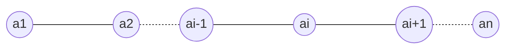

[toc]

# 数据结构

## 线性表

1. 知识框架

$$线性表 \begin{cases} 顺序存储 ---顺序表 \\ 链式存储 \begin{cases} \left.\begin{matrix} 单链表 \\ 双链表 \\ 循环链表 \end{matrix} \right\}指针实现 \\ 静态链表(借助数组实现)\end{cases} \end{cases}$$

2. 定义
   1. 线性表的数据集合为{a1,a2,…,an}，假设每个元素的类型均为DataType。其中，除第一个元素a1外，每一个元素有且只有一个直接前驱元素，除了最后一个元素an外，每一个元素有且只有一个直接后继元素。数据元素之间的关系是一对一的关系。
   2. 在较复杂的线性表中，一个数据元素可以由若干个数据项组成。在这种情况下，常把数据元素称为**==记录==**，含有大量记录的线性表又称为**==文件==**



## 栈

* 栈：stack，又称堆栈，它是运算受限的线性表，其限制是仅允许在标的一端进行插入和删除操作，不允许在其他任何位置进行添加、查找、删除等操作。
   ==简单的说：采用该结构的集合，对元素的存取有如下的特点==

* 先进后出(即,存进去的元素,要在后它后面的元素依次取出后,才能取出该元素)。例如,子弹压进弹夹,先压进去的子弹在下面,后压进去的子弹在上面,当开枪时,先弹出上面的子弹,然后才能弹出下面的子弹。

* 栈的入口、出口的都是栈的顶端位置。

## 队列

* 队列: queue,简称队,它同堆栈一样,也是一种运算受限的线性表,其限制是仅允许在表的一端进行插入,而在表的另一端进行删除。

* 简单的说,采用该结构的集合,对元素的存取有如下的特点：先进先出(即，存进去的元素，要在后它前面的元素依次取出后，才能取出该元素)。例如，小火车过山洞,素车头先进去，车尾后进去；车头先出来，车尾后出来。

* 队列的入口、出口各占一侧。

## 数组

* 数组:Array,是有序的元素序列,数组是在内存中开辟一段连续的空间,并在此空间存放元素。就像是一排出租屋,有100个房间,从001到100每个房间都有固定编号,通过编号就可以快速找到租房子的人。
   ==简单的说,采用该结构的集合,对元素的存取有如下的特点：==
* 查找元素快：通过索引，可以快速访问指定位置的元素
* 数组特点：查询快，增删慢。
   * 初始化一个数组：在内存中,数组的数据连续存放,数据长度固定,这样知道数组开头位置和偏移量就可以直接算出数据地址
* 增删元素慢
   * 指定索引位置增加元素：需要创建一个新数组，将指定新元素存储在指定索引位置，再把原数组元素根据索引,复制到新数组对应索引的位置。

## 链表

### 单向链表

单向链表：链表中只有一条链子，不能保证元素的顺序（存储元素和取出元素的顺序有可能不一致）

* **链表:linked list**,由一系列结点node (链表中每一个元素称为结点)组成,结点可以在运行时i动态生成。每个结点包括两个部分:一个是存储数据元素的数据域,另一个是存储下一个结点地址的指针域。我们常说的链表结构有单向链表与双向链表，那么这里给大家介绍的是单向链表。

   ==简单的说,采用该结构的集合,对元素的存取有如下的特点:==

* 多个结点之间，通过地址进行连接。例如，多个人手拉手，每个人使用自己的右手拉住下个人的左手，依次类推，这样多个人就连在一起了。

* 查找元素慢：想查找某个元素，需要通过连接的节点，依次向后直找指定元素

* 增删元素快：增加/删除元素：只需要修改连接下个元素的地址即可。

### 双向链表

双向链表：链表中有两条链子，有一条链子是专门记录元素的顺序，是一个有序的集合

## 红黑树

* 二叉树：binary tree，是每个结点不超过2的有序树（tree）。

   简单的理解,就是一种类似于我们生活中树的结构,只不过每个结点上都最多只能有两个子结点。二叉树是每个节点最多有两个子树的树结构。顶上的叫根结点,两边被称作"左子树"和"右子树"。

# 算法

## 冒泡排序

```java
public class Test {
    public static void main(String[] args) {
        int[] array = new int[]{46,74,53,14,26,38,86,65,27,34};
        for (int i = 0; i < array.length; i++) {
            for (int j = 1; j < array.length; j++) {
                if (array[j - 1] < array[j]) {
                    int array1 = array[j];
                    array[j] = array[j - 1];
                    array[j - 1] = array1;
                }
            }
        }
        for (int i = 0; i < array.length; i++) {
            if (i == 0) {
                System.out.print("[" + array[i]);
            } else {
                System.out.print("," + array[i]);
            }
        }
        System.out.println("]");
    }
}
```

## 快速排序

快速排序算法步骤：

1. 在数组中选一个基准数（通常为数组第一个）；

2. 将数组中小于基准数的数据移到基准数左边，大于基准数的移到右边；

3. 对于基准数左、右两边的数组，不断重复以上两个过程，直到每个子集只有一个元素，即为全部有序。

   例：有无序数列：13,45,76,10,19要球队数列进行快速排序

   1. 第一步：选择13作为基准数
   2. 第二步：将45与13进行比较，45>13，故将45移到数列右边，此时数列为13,76,10,19,45
   3. 第三步：将76与13进行比较，76>13，故将76移到数列右边，此时数列为13,10,19,45,76
   4. 第四步：将10与13进行比较，10<13，故将10移到数列左边，此时数列为10,13,19,45,76
   5. 第五步：将将19与13进行比较，19>13，故将19移到数列右边，此时数列为10,13,45,76,19
   6. 得到最终结果是10,13,45,76,19

```java
 for (int i = 1; i < quicksort.length; i++) {
            if (quicksort[i-1] <= quicksort[i]){
                int as = quicksort[10];
                quicksort[10] = quicksort[i];
                for (int j = i; j < quicksort.length; j++) {
                    if (j<quicksort.length) {
                        quicksort[j] = quicksort[j + 1];
                    }else if(j == quicksort.length){
                        quicksort[j] = as;
                    }
                }
            }else if(quicksort[i-1] > quicksort[i]){
                int as = quicksort[0];
                quicksort[0] = quicksort[i];
                for (int j = 0; j < i; j++) {
                    if (j < i) {
                        quicksort[j+1] = quicksort[j];
                    }else if(j == i-1){
                        quicksort[j] = as;
                    }else if(j==1){
                        quicksort[i]=quicksort[i-1];
                    }
                }
            }
            System.out.print(quicksort[i]);
        }
```

