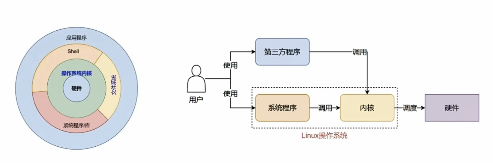
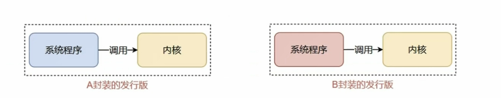
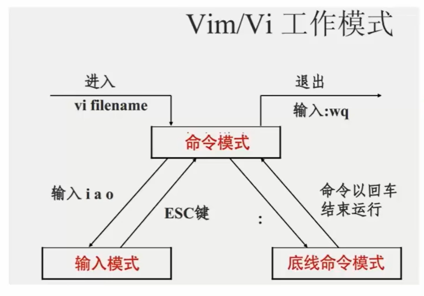
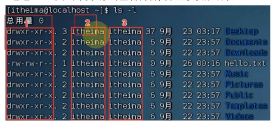
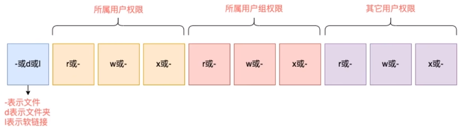
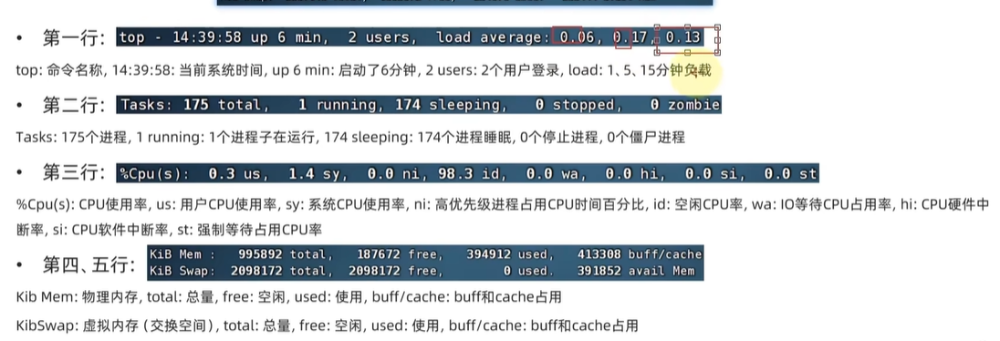
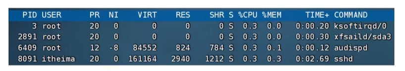
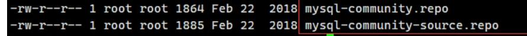

[toc]

# linux

## 初识Linux

### 初识

1. linux诞生

   * Linux 创始人 ： 林纳斯托瓦兹
   * Linux 诞生于 1991 年作者上大学期间
   * 因为创始人在上大学期间经常需要浏览新闻和处理邮件发现现有的操作系统不好用 ， 于是他决心自己写一个保护模式下的操作系统 ， 这就是 Linu × 的原型 ， 当时他 21 岁 ， 后来经过全世界网友的支持 ， 现在能够兼容多种硬件 ， 成为最为流行的服务器操作系统之一

2. 内核

   * Linu× 系统的组成如下 ：

     1. Linux 系统内核;系统级应用程序两部分组成 。

        

     2. 内核提供系统最核心的功能 ， 如 ： 调度 CPU 、 调度内存 、 调度文件系统 、 调度网络通讯 、 调度旧等 。

     3. 系统级应用程序 ， 可以理解为出厂自带程序 ， 可供用户快速上手操作系统 ， 如 ，文件管理器 、 任务管理器 、 图片查看 、 音乐播放等 。

3. 常见发行版本

   1. 可以看出 / 内核是 Linux 操作系统最核心的所在 ， 系统级应用程序只是锦上添花 。
      * Linux 内核是免费开源的 ， 任何人都可以下载内核源码并查看且修改 。
      * 可以通过 ： `https://www.kernel.org` 去下载 Linux内核
      
   2. 内核是免费 、 开源的 / 这也就代表了 ：
   
      * 任何人都可以获得并修改内核 / 并且自行集成系统级程序
      * 提供了内核 + 系统级程序的完整封装 / 称之为 Linu × 发行版
   
      

### 虚拟机

==借助虚拟化技术 , 我们可以在系统中 ,通过软件 ： 模拟计算机硬件 , 并给虚拟硬件安装真实的操作系统 。这样 , 就可以在电脑中 ,虚拟出一个完整的电脑以供我们学习 Linux系统 。==

1. **安装VMware WorkStation**

   * 下载地址 ： `https://www.vmware.com/cn/products/workstation-pro.html`

   * 打开网卡设置---`win+r`--->`ncpa.cpl`

2. **吏用 VMware 安装 Linux 虚拟机**
   *  Cent OS下载地址:`https://vault.centos.org/7.6.1810/isos/x86_64/CentOS-7-x86_64_DVD-1810.iso`

3. **远程链接Linux系统**

   1. 掌握操作系统的图形化 、 命令行 2 种操作模式
      1. 对于操作系统的使用 ， 有 2 种使用形式 ：
         * 图形化页面使用操作系统:使用操作系统提供的图形化页面 ， 以获得图形化反馈的形式去使用操作系统 。
         * 以命令的形式使用操作系统:使用操作系统提供的各类命令 / 以获得字符反馈的形式去使用操作系统 。
   2. 理解为什么使用命令行操作 Linux 系统
   3. 掌握使用 FinaISheII 软件连接 Linux 操作系统
      1. 下载finalshell并安装--安装依赖
      2. 输入`ifconfig`查看服务器ip
      3. 点击finalshell的文件夹图标---点击代加号的白色文件夹---SSH链接（Linux），创建远程链接
      4. 输入名称---自取
      5. 输入IP---账号密码
   4. WSL(在win中的Linux系统)
      1. 点击`win`--`启用或关闭win功能`--勾选`适用于Linux的win子系统`---重新启动
      1. 然后在win上自带的应用商店获取Ubuntu
      1. 开启虚拟化
      1. 安装Terminal
   5. 虚拟机快照

      1. 通过快照将当前虚拟机的状态保存下来，在以后可以通过快照恢复虚拟机到保存的状态

         * VMware Workstation 制作快照
           1. 确保虚拟机关机，找到快照管理器
           2. 找到虚拟机鼠标右击---快照---快照管理器---拍摄快照----给名字、描述---拍摄快照
         * VMware Fusion 制作快照
           1. 快照可以保存虚拟机的状态 ， 当虚拟机出现问题的时候 ， 可以通过预先制作的快照恢复到制作时候的状态用作备份用 。
           2. VMware Workstation 和 VMware Fusion 都支持制作快照去使用

4. **如何让局域网中的其他主机访问虚拟机**

   ==前提：==同一局域网主机1，主机2都为Windows系统，主机1上安装了VMware Workstation 14 Pro，并创建了一台虚拟机1，使用CentOS 7系统。

   1. 虚拟机1的网络适配器设置为NAT模式。

   2. 启动虚拟机1，用命令“ip addr”查看虚拟机的ip地址。

      1. 如果没有看到ip地址，则进入目录“cd /etc/sysconfig/network-scripts”，用命令“ls | grep 'ifcfg-*'”来找到配置文件ifcfg-ens33（这个名称不同的虚拟机不一样）。

      2. 编辑这个配置文件ifcfg-ens33，重点修改（增加）这两行：

         ```
         BOOTPROTO=dhcp
         ONBOOT=yes
         ```

      3. 用命令重启网络服务“service network restart”。再次用命令“ip addr”查看ip地址，可以看到虚拟机的ip.

   3. 可以通过ping命令，互相ping通主机1和虚拟机1，并且虚拟机1能ping通www.baidu.com。主机1也能访问虚拟机1的网页，但是主机2并不能访问到虚拟机1的网页。接下来打开VMware Workstation，从菜单栏中选择“编辑-->虚拟网络编辑器”,点击“更改设置”。

   4. 选中“VMnet8”——输入端口——类型选择TCP——输入虚拟机ip——输入端口“确定”

      1. 同一网络下两台==win==主机无法ping通：
         1. 第一步：启用规则
            1. 打开 **控制面板**，查看方式选择 **类别**，选择 **系统和安全**，选择 **Windows Defender 防火墙**打开左边的 **高级设置**，选择 **入站规则**，找到这两条规则，右键 **启用规则**（远程地址也就是作用域改为任何）
         2. 第二步：修改高级共享设置
            1. 打开 **控制面板**，查看方式选择 **类别**，选择 **网络和 Internet**，选择 **网络和共享中心**，打开左边的 **更改高级共享设置**，按图中选择：**启用网络发现** 和 **启用文件和打印机共享** 后点击下方的 **保存更改**

5. 配置桥接网络锁定IP

   1. 查询本地网卡配置信息

      ```
      ip addr
      ```

   2. 打开网卡配置文件

      ```
      vi /etc/sysconfig/network-scripts/ifcfg-ens160
      ```

   3. 需要修改的网卡配置

      ```
      BOOTPROTI=static
      ONBOOT=yes 
      ```

      - BOOTPROTI
         * dhcp: DHCP动态地址协议 。
         * static：静态地址协议。

      - ONBOOT
         * 系统启动时是否激活网卡接口，yes为激活，no为不激活。

   4. 添加的内容

      ```
      IPADDR=192.168.31.98                   #静态ip地址，需要确保在局域网中的唯一性,锁定的IP地址
      NETMASK=255.255.255.0                  #子网掩码
      GATEWAY=192.168.31.1                   #网关地址
      ```

      保存退出

   5. 手动添加IP网关

      ```
      ip addr add 192.168.31.98/24 dev ens160
      ip route add default via 192.168.31.1
      ```

   6. 重启网络服务

      ```
      systemctl restart network
      ```

   7. 遇到问题`Failed to start LSB: Bring up/down networking.`解决办法

      ```
      systemctl stop NetworkManager
      systemctl disable NetworkManager
      ```

   8. 重新启用 `NetworkManager`：

      ```
      systemctl enable NetworkManager
      systemctl start NetworkManager
      ```

   9. 查询`NetworkManager`网络状态

      ```
      systemctl status NetworkManager
      ```

   10. 手动开启（关闭）网络接口

      ```
      ip link set dev ens160 down     #（关闭）
      ip link set dev ens160 up       #（开启）
      ```

6. 配置数据源

   ```bash
   #查看本机yum数据源
   yum repolist
   #备份
   mv /etc/yum.repos.d/ /etc/yum.repos.d_bak 
   #创建新的 YUM 配置文件夹
   mkdir /etc/yum.repos.d/
   #下载阿里云的 CentOS 8.5.2111 镜像源配置文件
   wget -O /etc/yum.repos.d/CentOS-Base.repo https://mirrors.aliyun.com/repo/Centos-vault-8.5.2111.repo
   ```

7. 报错

   ```bash
   Errors during downloading metadata for repository 'appstream':
     - Curl error (6): Couldn't resolve host name for http://mirrorlist.centos.org/?release=8&arch=x86_64&repo=AppStream&infra=stock [Could not resolve host: mirrorlist.centos.org]
   Error: Failed to download metadata for repo 'appstream': Cannot prepare internal mirrorlist: Curl error (6): Couldn't resolve host name for http://mirrorlist.centos.org/?release=8&arch=x86_64&repo=AppStream&infra=stock [Could not resolve host: mirrorlist.centos.org]
   ```

   1. 测试 DNS 解析

      ```bash
      nslookup mirrors.aliyun.com
      # 或者
      dig mirrors.aliyun.com
      ```

   2. 在文件内配置网关(添加)

      ```bash
      nameserver 网关地址
      ```

## Linux基础命令

1. Linux目录结构

   1. 在 Linux 系统中 / 路径之间的层级关系 ， 使用 ： / 来表示
   2. 在 Windows 系统中 ， 路径之间的层级关系 ， 使用 ： \ 来表示

2. 命令

   1. 学习 Linux, 本质上是学习在命令行下熟练使用 Linux的各类命令 。

      * 命令行 ： 即 Linux 终端 (Terminal), 是一种命令提示符页面 。 以纯 “ 字符 “ 的形式操作系统 ， 可以使用各种字符化命令对系统发出操作指令 。
      * 命令 ： 即 Linux 程序 。 一个命令就是一个 Linux的程序 。 命令没有图形化页面 / 可以在命令行 （ 终端中 ） 提供字符化的反馈。

   2. Linux命令基础格式

      * 无论是什么命令 / 用于什么用途 ， 在 Linux 中，命令有其通用的格式 ：
        ==command [-options] [parameter]==

        * command: 命令本身
        * -options: [ 可选 ， 非必填 ] 命令的一些选项 ， 可以通过选项控制命令的行为细节
        * paramete: [ 可选 ， 非必填 ] 命令的参数 ， 多数用于命令的指向目标等
          ==语法中的[], 表示可选的意思==

      * 示例 ：

        * ls /home/itheima, [ s 是命令本身 ， 是选项 / /home/itheima 是参数
          ==意思是以列表的形式 ， 显示 /home/itheima 目录内的内容==

        * cp -r testl test2 , cp 是命令本身 ， -r 是选项 ， test1 和 test2 是参数

          ==意思是复制文件夹 test1 成为 test2==

   3. ls命令

      1. ls 命令的作用是列出目录下的内容，语法细节如下 ：
      2. `ls [-a -l -h] [Linux路径]`
      3. -a -l -h是可选的选项
      4. Linux 路径是此命可选的参数
         ==当不使用选项和参数，直接使用 ls 命令本体,表示 :以平铺形式,列出当前工作目录下的内容==
      5. 头的文件或文件夹默认被隐藏 ，需一来彐选项 ， 以列表的形式展示内容 ， 并展示更多细节
      6. 参数和选项
         1. 当 ls 不使用参数 , 表示列出 ： 当前工作目录的内容 ， 即用户的 HOME 目录
         2. 当使用参数 ， ls 命令的参数表示 ： 指定一个 Linu × 路径 , 列出指定路径的内容
         3. -a选顶表示 :all 的意思即列出全部文件 （ 包含隐藏的文件 / 文件夹 ）
            * 图中以`.`开头的表示是 Linux系统的隐藏文件 / 文件夹 （ 只要以 `.`开头,就能自动藏 ）
            * 只有通过 -a 选项 ， 才能看到这些喼藏的文件 / 文件夹
         4. -l 选项表示:以列表（ 竖向排列 ）的形式展示内容 / 并展示更多信息
            * -l选项其实和图形化中 / 文件夹以列表形式排列是一个意思
            * 给出了[权限--用户和用户组--大小--创建时间]
            * 语法中的选项是可以组合使用的 ， 比如学习的 -a 和 -l 可以组合应用
            * 写法 ：`ls -a`、`ls -la`、`ls -al`
            * 上述三种写法 ， 都是一样的 ， 表示同时应用-l 和-a的功能
         5. -h 表示以易于阅读的形式 ，列出文件大小 ，如 K 、 M 、 G
         6. -h 选项必须要`-l`搭配一起使用

   4. cd-pwd命令

      1. 我们可以通过cd命令,更改当前所在的工作目录 。
         * cd 命令来自英文 ： change Directory
           `语法 ：cd [Linux 路径 ]`
           * cd 命令无需选项 ， 只有参数 ， 表示要切换到哪个目录下
           * cd 命令直接执行 ， 不写参数 ， 表示回到用户的 HOME 目录
      2. 我们可以通过 pwd 命令 ， 来查看当前所在的工作目录 。
         * pwd 命令来自 ： Print Work Di rectory
           `语法 ： pwd`
           * pwd 命令 ， 无选顶 ， 无参数 ， 直接输入 pwd 即可

   5. 相对路径、绝对路径和特殊路径

      1. 绝对路径 ： 以根目录为起点 ， 描述路径的一种写法 ， 路径描述以 / 开头
      2. 相对路径 ： 以为起点 ， 描述路径的一种写法 ， 路径描述无需以 / 开头
      3. 特殊路径符
         * `.`     表示当前目录 ， 比如 `cd ./Desktop` 表示切换到当前目录下的 Desktop 目录内 ， 和 cd Desktop 效果一致
         * `..`   表示上一级目录 / 比如 ： `cd..`即可切换到上一级目录 / cd “ / “ 切换到上二级的目录
         * `~`     表示 HOME 目录 / 比如 ： `cd~` 即可切换到 HOME 目录或 cd /Desktop, 切换到 HOME 内的 Desktop 目录

   6. 创建目录命令（mkdir）

      1. 通过 mkdir 命令可以创建新的目录 （ 文件夹 ）
         * mkdir 来自英文 ： Make Directory
         * 语法 ：`mkdir [-p] Linnux路径`
           * 参数==必填==，表示 Linux 路径，即要创建的文件夹的路径 ， 相对路径或绝对路径均可
           * `-p`选项可选 ，表示自动创建不存在的父目录，适用于创建连续多层级的目录
   
   7. 文件操作命令part1(touch、cat、more)
   
      1. touch创建文件
         1. 可以通过 touch 命令创建文件
            * 语法：`touch Linux路径`
            * touch 命令无选项，参数必填，表示要创建的文件路径，相对、绝对、特殊路径符均可以使用
   
      2. cat、more查看文件内容
         1. 准备好文件内容后，可以通过 cat 查看内容 。
            1. 语法 ： `cat Linux路径`
               * cat 同样没有选项，只有必填参数，参数表示：被查看的文件路径，相对、绝对、特殊路径符都可以使用
         2. more 命令同样可以查看文件内容，同 cat 不同的是 ：
            * cat 是直接将内容全部显示出来
            * more 支持翻页 ， 如果文件内容过多 ， 可以一页页的展示
              * 语法 ：`more Linux路径`
              * 同样没有选项 ， 只有必填参数，参数表示，被查看的文件路径，相对 、 绝对 、 特殊路径符都可以使用
              * 在查看的过程中 ， 通过空格翻页
              * 通过 q 退出查看
   
      3. cp--mv--rm
   
         1. cp 命令可以用于复制文件\文件夹,cp 命令来自英文单词：copy
   
         * 语法：`cp [-r] 参数1 参数2`
           * -r 选顶，可选，用于复制文件夹使用，表示递归
           * 参数1,Linux 路 径， 表示被复制的文件或文件夹
           * 参数2,Linux 路径，表示要复制去的地方
   
         2. mv命令可以用于移动文件\文件夹 ，mv 命令来自英文单词：move
   
         * 语法：`mv 参数1 参数2`
           * 参数1 Linux径，表示被移动的文件或文件夹参数乙 Linux%ß, 表示要移动去的地方，如果目标不存在,则进行改名确保目标在
   
         3. rm 命令可用于删除文件、文件夹，rm 命令来自英文单词：remove
   
         * 语法：`rm [-r -f] 参数1 参数2......参数n`
           * 同cp命令一样，-r 选顶用于删除文件夹
           * -f 表示 force, 强制删除（不会弹出提示确认信息）
           * 普通用户删除内宕不会弹出提示，只有 root 管理员用户删除内容会有提示
           * 所以一般普通用户用不到-f 选顶
         * 参数 1 、参数 2 、......参数 N 表示要删除的文件或文件夹路按照空格隔开
         * rm 命令支持通配`*`符用来做模糊匹配
           * 符号`*`表示通配符，即匹配任意内容（包含空），示例:
           * test`* `,表示匹配任何以test开头的内容
           * `*`test,表示匹配任何以test结尾的内容
           * `*`test`*`表示匹配任何包含test 的内容
         * `-f`
           * 可以通过 su -root, 并输入密码
           * 通过输入exit命令退回普通用户。
   
      4. which--find
   
         1. which:我们可以通过which命令，查看所使用的一系列命令的程序文件存放在哪里
            * 语法：`which 要查找的命令`
         2. find 在Linux系统中我们可以通过 find 命令去搜索指定的文件。
            * 语法：`find 起始路径 -name "查找文件名"`
            * find 命令-按文件大小查找文件
               * 语法：`find 起始路径 -size + l-n[kMG]`
               * +、-表示大于和小于
               * n表示大小数字
               * kMG 表示大小单位，k(小写字母）表kb,M表示mb,G 表示 GB
   
      5. grep--wc管道符
   
         1. 可以通过 grep 命令，从文件中通过关键字过滤文件行。
   
         * 语法： `grep [-n ] 关键字 文件路径` 
            * 选项`-n` 可选，表示在结果中显示匹配的行的行号。
            * 参数，关键字，必填，表示过滤的关腱字，带有空格或其它特殊符号，建议使用`“ ”`将关键字包围起来
            * 参数，文件路径，必填，表示要过滤内容的文件路径，==可作为内容输入端口==
   
         2. 可以通过 wc命令统计文件的行数、单词数量等
   
         * 语法：`wc [-c -m -l -w]文件路径`
            * 选项， -c, 统计 bytes 数量
            * 选项， -m, 统计字符数量
            * 选项，-l,统计行数
            * 选项， -w, 统计单词数量
            * 参数文件路径，被统计的文件,可作为内容输入端口
   
         3. 学习了 grep 命令后，我们在来学习一个新的特殊符号，管道符：`|`管道符的含义是：将管道符左边命令的结果，作为右边命令的输入
   
      6. echo--tail重定向符
   
         1. 掌握使用echo命令输出内容
            * 可以使用 echo 命令在命令行内输出指定内容
            * 语法： `echo 输出内容`
               * 无需选项，只有一个参数,表示要输出的内容，复杂内容可以用`““`包围
         2. 掌拥反引号的使用
            * 我们可以通过将命令用反引号（通常也称之为飘号）、将其包围被包围的内容，会被作为命令执行，而非普通字符
         3. 掌握tail命令跟踪文件更改
            * 使用 tail命令，可以查看文件尾部内容，跟踪文件的最新更改，
            * 语法：`tail [-f -num] Linux路径`
               * 参数，Linux路径，表示被跟踪的文件路径选项
               * 选项，`-f`表示持续跟踪
               * 选项，`-num`, 表示，查看尾部多少行，不填默认10行
         4. 掌握重定向符号的使用
            * 重定向符：`>`和`>>`
               * `>`将左侧命令的结果，==覆盖==写入到符号右侧指定的文件夹中
               * `>>`将左侧命令的结果，==追加==写入到符号右侧指定的文件夹中
   
      7. vi编辑器
         1. vi\vim是 visual interface 的简称，是 Linux中最经典的文本编辑器,同图形化界面中的文本编辑器一样， vi 是命令行下对文本文件进行编辑的绝佳选择。vim 是 vi 的加强版本，兼容 vi 的所有指令，不仅能编辑文本，而且还具有 shell 程序编辑的功能，可以不同颜色的字体来辨别语法的正确性，极大方便了程序的设计和编辑性。
   
         2. `vi\vim`编辑器的三种工作模式
   
            * 命令模式 (Command mode)
   
               * 命令模式下，所敲的按键编辑器都理解为命令，以命令驱动执行不同的功能。此模型下，不能自由进行文本编辑。
               * 如果需要通过 vi / vim 编辑器编辑文件，请通过如下命令：vim 而兼容全部的 vi 功能，后续全部使用 vim 命令
               * `vi 文件路径\vim 文件路径`
                  * 如果文件路径表示的文件不存在，那么此命令会用于编辑新文件
                  * 如果文件路径表示的文件存在，那么此命令用于编辑已有文件
   
            * 输入模式 (lnsert mode)
   
               * 也就是所渭的编辑模式、插入模式。此模式下，可以对文件内容进行自由编辑。
   
            * 底线命令模式（ Last line mode)以：
   
               * 开始，通常用于文件的保存、退出。
   
               
         
         3. 通过 `vi/vim` 命令编辑文件，会打开一个新的窗口，此时这个窗口就是：命令模式窗口，命令模式是 vi 编辑器的入口和出口，
         
            * 进入vi 编辑器会进入命令模式
            * 通过命令模式输入键盘指令，可以进入输入模式输入模式
            * 需要退回到命令模式，然后通过命令可以进入底线命令模
         
         * |     模式     |      命令      | 描述                                |
            | :----------: | :------------: | ----------------------------------- |
            |   命令模式   |     ==i==      | 在当前光标位置进入==输入模式==      |
            |   命令模式   |     ==a==      | 在当前光标位置之后进入==输入模式==  |
            |   命令模式   |     ==I==      | 在当前行的开头进入==输入模式==      |
            |   命令模式   |     ==A==      | 在当前行的结尾进入==输入模式==      |
            |   命令模式   |     ==o==      | 在当前光标下一行进入==输入模式==    |
            |   命令模式   |     ==O==      | 在当前光标上一行进入==输入模式==    |
            |   输入模式   |    ==esc==     | 任何情况下输入`esc`都能回到命令模式 |
            | 底线命令模式 |    ==:wq==     | 保存并退出                          |
            | 底线命令模式 |     ==:q==     | 仅退出                              |
            | 底线命令模式 |    ==:q!==     | 强制退出                            |
            | 底线命令模式 |     ==:w==     | 仅保存                              |
            | 底线命令模式 |  ==:set nu==   | 显示行号                            |
            | 底线命令模式 | ==:set paste== | 设置粘贴模式                        |
   
   8. 在Linux系统中想要查看本机IP地址
   
      1. 使用ifconfig命令：这将显示网络接口的详细信息，包括IP地址。
   
      ```
      ifconfig
      ```
   
      2. 使用ip命令：这将显示网络接口的详细信息，包括IP地址。
   
      ```
      ip addr show
      ```
   
      3. 使用hostname命令：这将显示本机的所有IP地址。
   
      ```
      hostname -I
      ```
   
      4. 使用curl命令：这将使用curl命令从ifconfig.me网站获取本机的公共IP地址。
   
      ```
      curl ifconfig.me
      ```
   
   9. service sshd restart重启sshd服务
   
   10. ifconfig:查看网络接口详情
   
   11. ping：查看与某主机是否能联通
   
   12. ps：列出系统中正在运行的各种进程的状态信息，包括但不限于进程ID（PID）、父进程ID（PPID）、用户、内存使用情况、CPU占用率等。
   
       - `-a`：显示所有用户的进程（不包括会话领导进程）。
   
       - `-u`：根据用户名或UID显示进程。
   
       - `-x`：显示没有控制终端的进程。
   
       - `-f`：全格式输出，显示更详细的信息。
   
       - `-l`：长格式输出。
   
       - `-t`：指定终端显示进程。
   
       - `--forest`：以树状图显示进程之间的父子关系。
   
       - `--sort`：按照指定的字段排序输出结果。
   
         ```bash
         ps -ef | grep 进程名称 # 查看进程号
         ps aux --forest       # 列出所有用户的所有进程，并以树形结构显示
         ps aux --sort=-%mem   # 按照内存使用率降序排列进程
         ps -u username        # 显示特定用户的进程
         ```
   
   13. lost -i 端口 ：查看端口占用情况
   
   14. top:查看系统负载情况，包括系统时间、系统所有进程状态、cpu情况
   
   15. free:查看内存占用情况
   
   16. kill:正常杀死进程，发出的信号可能会被阻塞
   
   17. kill -9:强制杀死进程，发送的是exit命令，不会被阻塞
   
   18. tail:查看文件末尾内容`tail 选项 文件`
   
       ```bash
       # 选项	                          描述
       -n                     NUM 或 -NUM	显示文件的最后 NUM 行
       -c                     NUM	显示文件的最后 NUM 字节
       -f	                   实时监控文件的变化，显示新添加的内容
       --follow=name	       即使文件被删除或重命名，也继续监控同名的新文件
       --follow=descriptor	   只监控当前打开的文件描述符，不跟踪新文件
       -q	                   不显示文件名前缀（适用于多个文件）
       -v	                   总是显示文件名前缀（即使只有一个文件）
       ```
   
   19. 清理屏幕`ctrl+l`

## Linux权限管理

1. Linux的root用户
   1. 无论是 Windows 、 MacOS 、 Linux均采用多用户的管理模式进行权限管理。
      * 在 Linu ×系统中事拥有最大权限的账户名为： root （超级管理员）
      * root 用户拥有最大的系统操作权限，而普通用户在许多地方的权限是受限的
      * 普通用户的权限，一般在其 HOME 目录内是不受限的
      * 一旦出了 HOME 目录，大多数地方，普通用户仅有只读和执行权限，无修改权限
   2. su 命令就是用于账户切换的系统命令其来源英文单词： Switch User
      * 语法： `su [-] [用户名]`
      * `-`符号是可选的，表示是否在切换用户后加载环境变量（后续讲解 ), 建议带上
      * 参数：用户名，表示要切换的用户，用户名也可以省略，省略表示切换到==root==
      * 切换用户后，可以通过 ==exit== 命令退回上一个用户，也可以使用快捷键：`ctrl+d`
      * 使用普通用户，切换到其它用户需要输入密码，如切换到 root 用户
      * 使用 root 用户切换到其它用户,无需密码,可以直接切换
   3. 我们可以使用sudo命令，为普通的命令授权，临时以 root 身份执行。
      * 语法： `sudo 其它命令`
      * 在其它命令之前，带上sudo, 即可为这一条命令临时赋予 root 授权
      * 但是并不是所有的用户，都有权利使用`sudo`我们需要为普通用户配置 sudo 认证
        * 为普通用户配置 sudo 认证
          1. 切换到 root 用户，执行 visudo 命令，会自动通过 vi 编辑器打开： `/etc/sudoers`
          2. 在文件的最后添加：`普通用户名 ALL=(ALL)  NOPASSWD:ALL`
          3. 其中最后的 NOPASSWD:ALL 表示使用 sudo 命令无需输入密码最后通过 wq 保存
   
2. 用户和用户组

   1. 用户、用户组的概念
      * Linux系统中可以：==配置多个用户、配置多个用户组、用户可以加入多个用户组中==
      * Linux中关于权限的管控级别有 2 个级别，分别是：==针对用户的权限控制、针对用户组的权限控制==
   2. 用户、用户组管理的相关命令==以下命令需 root 用户执行==
      * 用户组管理
        1. 创建用户组`groupadd 用户组名`
        2. 删除用户组`groupdel 用户组名`
      * 用户管理
        1. 创建用户`useradd [-g -d] 用户名`
           * 选项：`-g`指定用户的组，不指定`-g`，会创建同名组并自动加入，指定`-g`需要组己经存在，如己存在同名组，必须使用`-g`
           * 选项：`-d`指定用户 HOME 路径，不指定，HOME 目录默认在： /home/ 用户名
        2. 删除用户`userdel [-r] 用户名`
           * 选项： `-r` ，删除用户的 HOME 目录，不使用`-r` ，删除用户时， HOME 目录保留
        3. 查看用户所属组`id [用户名]`
           * 参数：用户名，被查看的用户，如果不提供则查看自身
        4. 修改用户所属组`usermod -aG 用户组 用户名`
           * 将指定用户加入指定用户组
      * 使用 getent 命令，可以查看当前系统中有哪些用户语法：` getent passwd`
        * 共有 7 份信息，分别是：用户名：密码（×）：用户旧：组旧：描述信息（无用）： HOME 目录：执行终端（默认 bash ）
      * 使用 getent 命令，同样可以查看当前系统中有哪些用户组语法:`getent group`
        * 包含 3 份信息，组名称：组认证（显示为x）：组ID

3. 查看权限控制信息

   1. 查看 Linux 文件的权限管控信息

      * 通过`ls -l`可以以列表形式查看内容，并显示权限细节

        

      * 序号 1, 表示文件、文件夹的权限控制信息

        1. 序号 1, 权限细节

        2. 权限细节总共分为] 0 个槽位

           

        3. 举例：`drwxr-xr-x`, 表示：

           * 这是一个文件夹，首字母 d 表示
           * 所属用户（右上角图序号 2 ）的权限是：有 r 有 w 有 x, rwx
           * 所属用户组（右上角图序号 3 ）的权限是：有 r 无 w 有 r-x （-表示无此权限）
           * 其它用户的权限是：有 r 无有 x ， r-x

      * 序号 2,表示文件、文件夹所属用户

      * 序号 3 ，表示文件、文件夹所属用户组

   2. 读、写、执行三种权限的含义

      1. `RWX`
         * r 表示读权限
           1. 针对文件可以查看文件内容
           2. 针对文件夹，可以查看文件夹内容，如 ls 命令
         * w 表示写权限 
           1. 针对文件表示可以修改此文件
           2. 针对文件夹，可以在文件夹内：创建、删除、改名等操作
         * x 表示执行权
           1. 针对文件表示可以将文件作为程序执行
           2. 针对文件夹，表示可以更改工作目录到此文件夹，即 cd 进入

4. chmod命令

   1. 使用 chmod 修改权限信息

      * 我们可以使用 chmod 命令，修改文件、文件夹的权限信息。==注意，只有文件、文件夹的所属用户或 root 用户可以修改==
      * 语法：` chmod [-R] 权限 文件或文件夹`
        * 选项：`-R`对文件夹内的全部内容应用同样的操作
      * 示例：·`chmod u=rwx,g=rx,o=x hello.txt`, 将文件权限修改为:`rwxr-x--x`
      * 其中： u 表示 user 所属用户权限， g 表示 group 组权限， 0 表示 other 其它用户权限

   2. 使用数字序号标记权限

      * 权限可以用 3 位数字来代表，第一位数字表示用户权限，第二位表示用户组权限，第三位表示其它用户权限。

      * 数字的细节如下： r 记为生 w 记为乙 x 记为 I, 可以有：

        | 0    | 无任伺权限 | `---` |
        | ---- | ---------- | ----- |
        | 1    | 仅有×权限  | `--x` |
        | 2    | 仅有w权限  | `-w-` |
        | 3    | 有w和×权限 | `-wx` |
        | 4    | 仅有r权限  | `r--` |
        | 5    | 有r和×权限 | `r-x` |
        | 6    | 有r和w权限 | `rw-` |
        | 7    | 有全部权限 | `rwx` |

5. chown命令

   * 使用 chown 命令，可以修改文件、文件夹的所属用户和用户组==普通用户无法修改所属为其它用户或组，所以此命令只适用于 root 用户执行==
   * 语法：`chown [-R ][用户][:][用户组]文件或文件夹`
     * 选顶， -R, 同chmod, 对文件夹内全部内容应用相同规则
     * 选项，用户，修改所属用户
     * 选项，用户组，修改所属用户组
     * `：`用于分隔用户和用户组

## Linux实用操作

1. 各类快捷键

   * 强制停止:`ctrl+c`
   * 退出、登出:`ctrl+d`
   * 历史命令搜索
      1. `history`
      2. ==`！`命令前缀，自动执行上一次匹配前缀的命令==
      3. `ctrl+r`:输入内容去匹配历史命令
         * 回车键可以直接执行
         * 键盘左右键，可以得到此命令（不执行）
   * 光标移动
      1. ctrl + a, 跳到命令开头
      2. ctrl + e, 跳到命令结尾
      3. ctrl +键盘左键，向左跳一个单词
      4. ctrl +腱盘右键，向右跳一个单词
   * 清屏
      1. 通过快捷键 ctrl + l, 可以清空终端内容
      2. 通过命令 clear 得到同样效果

2. 软件安装

   * 使用 yum 为 CentOS 系统安装软件
      * yum 命令
      * yum: RPM 包软件管理器，用于自动化安装配置 Linux软件，并可以自动解决依赖问题。
      * 语法： `yum [-y ] (install | remove | search] 软件名称`
      * 选项：`-y`自动确认，无需手动确认安装或卸载过程
      * install: 安装
      * remove: 卸载
      * search: 搜索
      * yum 命令需要 root 权限哦，可以 su 切换到 root, 或使用 sudo 提权。yum 命令需要朕网
   * 使用 apt 为 Ubuntu 安装软件（扩展）
      * 语法： `apt [-y ] (install | remove | search] 软件名称`

3. systemctl控制软件启动关闭

   * Linu ×系统很多软件（内置或第三方）均支持使用 systemctl 命令控制：启动、停止、开机自启
   * 能够被 systemctl 管理的软件，一般也称之为：服务
   * 语法： `systemctl [start | stop | status | enable | disable] 服务名`
   * `start 启动`、`stop 关闭`、`status 查看状态`、`enable 开启开机自启`、`disable 关闭开机自启`
   * 系统内置的服务比较多，比如：
      * NetworkManager, 主网络服务
      * network, 副网络服务
      * firewalld, 防火墙服务
      * sshd, ssh 服务（ Fina [ Shell 远程登录 Linu ×使用的就是这个服务）

4. 软链接

   * 使用 ln 命令创建软连接
   * 在系统中创建软链接，可以将文件、文件夹链接到其它位置。类似 Windows 系统中的《快捷方式》
   * 语法： `ln -s 参数1 参数2`
      * -s 选项，创建软连接
      * 参数 1 ：被链接的文件或文件夹
      * 参数 2 ：要链接去的目的地

5. 日期和时区

   * date 命令查看日期时间

      * 通过 date 命令可以在命令行中查看系统的时间
      * 语法： `date [-d][+格式化字符串]`
      * d 按照给定的字符串显示日期，一般用于日期计算
      * 格式化字符串：通过特定的字符串标证来控制显示的日期格式
      * `%Y 年`、`%y 年份后两位数字（00..99）`、`%m 月份（01..12）`、`%d 日（01..31）`、`%H 小时（00..23）`、`%M 分钟（00..59）`、`%S 秒（00..60）`、`%s 自1970-01-01 00：00：00 UTC 到现在的秒数`

   * 修改 Linux 系统的时区

      * 使用 root 权限，执行如下命令，修改时区为东八区时区

         ```
         rm -f /etc/localtime 
         ln -S /usr/share/zoneinfo/Asia/Shanghai /etc/localtime
         ```

   * 使用 ntp 进行时间同步和校准

      * 我们可以通过 ntp 程序自动校准系统时间
      * 安装 ntp: `yum -y install ntp`
      * 启动并设置开机自启：
         * systemctl start ntpd
         * systemctl enable ntpd
         * 当 ntpd 启动后会定期的帮助我们联网校准系统的时间
         * 也可以手动校准（需 root 权限）： `ntpdate -u ntp.aliyun.com`
         * 通过阿里云提供的服务网址配合 ntpdate （安装 ntp 后会附带这个命令）命令自动校准

6. IP地址和主机名

   * IP 地址`ipconfig`
   * 主机名`hostname`修改主机名`hostnamectl set-hostname 主机名，修改主机名`（需root）
   * 域名解析

7. 配置 Linux 固定 IP 地址

   * 在 VMware Workstation 中配置 Linux 系统的固定IP地址（用于 Windows 系统）
      1. 在 VMwa re W0rkstation （或 Fusion ）中配置IP地址网关和网段（IP地址的范围）
      2. 在 Linux系统中手动修改配置文件，固定IP
         1. 使用vim编辑==/etc/sysconfig/network-scripts/ifcfg-ens33==
         2. 修改`BOOTPROTO="static"`、`IPADDR="IP地址"`、`NETMASK="子网掩码255.255.255.0"`、`GATEWAY='网关与VM虚拟网络编辑器中一致'`、`DNS1='网关'`
         3. 网卡启停`systemctl start network`、`systemctl stop network`
   * 在 VMware Fusion 中配置 Linux 系统的固定 IP 地址（用于 MacOS 系统）

8. 网络请求和下载

   1. 使用 ping 命令检查服务器是否可联通
      * 可以通过 ping 命令，检查指定的网络服务器是否是可朕通状态
      * 语法： `ping [-c num] -p或主机名`
         * 选顶：-c，检查的次数，不使用-c选项，将无限次数持续检查
         * 参数： ip 或主机名，被检查的服务器的 ip 地址或主机名地址
   2. 使用 wget 命令下载文件
      * wget 是非交互式的文件下载器，可以在命令行内下载网络文件
      * 语法：`wget [-b] url`
         * 选项： -b, 可选，后台下载，会将日志写入到当前工作目录的wget-log 文件
         * 参数：url, 下载链接
   3. 使用 cur [命令发起网络请求
      * curl 可以发送 http 网络请求可用于：下载文件、获取信息等
      * 语法：`curl [-O] url`
         * 选项：-O ，用于下载文件，当 url 是下载链接时，可以使用此选项保存文件
         * 参数： url, 要发起请求的网络地址

9. 端口

   * 端口的概念
      * 端口，是设备与外界通讯交流的出入口。端口可以分为：物理端口和虚拟端口两类
         * 物理端口：又可称之为接口，是可见的端口，如 USB 接口， RJ45 网 HDMI 端口等
         * 虚拟端口：是指计算机内部的端口，是不可见的，是用来操作系统和外部进行交互使用的
      * Linux系统是一个超大号小区，可以支持 65535 个端口，这 6 万多个端口分为 3 类进行使用：
         * 公认端口： 1~1023，通常用于一些系统内置或知名程序的预留使用，如 SSH 服务的 22 端口， HTTPS 服务的 443非特殊需要，不要占用这个范围的端口
         * 注册端口：1024~49151， 通常可以随意使用，用于松散的绑定一些程序\服务
         * 动态端口：54152~65535 通常不会固定绑定程序，而是当程序对外进行网络链接时，用于临时使用。
   * netstat命令的基本使用
      * 使用 nmap 命令，安装 `nmap: yum -y install nmap`
      * 语法 `nmap 被查看的IP地址`
      * 可以通过 netstat 命令，查看指定端口的占用情况
      * 语法： `netstat -anp | grep 端口号`，安装 netstat: `yum -y install net-tools`

10. 进程管理

    1. 进程的概念
       * 程序运行在操作系统中，是被操作系统所管理的。
       * 为管理运行的程序，每一个程序在运行的时候，便被操作系统注册为系统中的一个：进程
       * 并会为每一个进程都分配一个独有的：进程旧（进程号）
    2. 如何查看进程、关闭进程
       * 可以通过 ps 命令查看 Linu ×系统中的进程信息
       * 语法： `PS [-e -f]`
       * 选项： -e, 显示出全部的进程
       * 选顶： -f, 以完全格式化的形式展示信息（展示全部信息）
       * 一般来兑固定用法就是： ps -ef 列出全部进程的全部信息
          * UDP 进程所属的用户ID
          * PID 进程的进程号 ID
          * PPID 进程的父 ID （启动此进程的其它进程）
          * C：此进程的CPU占用率（百分比）
          * STIME ：进程的启动时间
          * TTY ，启动此程的终端序号，加显示？，表示非终端启动
          * TIMF：进程占用CPU的时间
          * CMD：进程对应名称或启动路径或启动命令
       * 关闭进程语法`kill [-9] 进程ID`
       * 选顶：-9，表示强制关闭进程，不使用此选项会向进程发送信号要求其关闭，但是否关闭看进程自身的处理机制。

11. 主机状态监控

    * **查看主机运行状态的监控命令**

    * `top`:查看 CPU 、内存使用情况；默认每 5 秒刷新一次，语法：直接输入 top 即可，按 q 或 ctrl + c 退出

       * 选项
       * -P：只显示某个进程的信息
       * -d：设置刷新时间，默认是 5s
       * -c：显示产生进程的完整命令，默认是进程名
       * -n：指定刷新次数，比如 top - n 3 ，刷新输出 3 次后退出 
       * -b：以非交互非全屏模式运行，以批次的方式执行 top ，一般配合 -n 指定输出几次统计信息，将输出重定向到指定文件，比如 top -b -n 3 > /tmp/top.tmp
       * -i：不显示任何闲置 (idle) 或无用 (zombie) 的进程
       * -u：查找特定用户启动的进程
       * top 交互式选项==当 top 以交互式运行（非． b 选项启动 ), 可以用以下交互式命令进行控制==
       * h键，按下 h 键，会显示帮助画而
       * c键，按下 c 键，会显示产生进程的完整命令，等同于 -c 参数，再次按下 c ，变为默认显示
       * f键，按下 f 键，可以选择需要展示的项目
       * M键，按下 M 键，根据驻留内存大小 (RES) 排序
       * P键，按下 P 键，根据 CPU 使用百分比大小进行排序
       * T键，按下 T 键，根据时间/累计时间进行排序
       * E键，按下 E 键，切换顶部内存显示单位
       * e键，按下 e 键，切换进程内存显示单位
       * l键，按下 l 键，切换显示平均负载和启动时间信息
       * i键，按下 i 键，不显示闲置或无用的进程，等同于-i参数，再次按下，变为默认显示
       * t键，按下 t 键，切换显示 CPU 态信息
       * m键，按下 m 键，切换显示内存信息
       
       
       
       
       
    * PID: 进程id

    * USER: 进程所属户

    * PR: 进程优先骁越小,越高

    * NI：负值表示高优先级，正表示低优先级

    * VIRT: 进程使用虚拟内存，单位 KB

    * RES: 进程使用物理内存，单位 KB

    * SHR: 进程使用共享内存，单位 KB

    * S: 进程状态（ S 休眠， R 运行， Z 僵死状态， N 负数优先级，I空闲状态）

    * %CPU: 进程占用（ CPU 率 ）

    * %MEM: 进程占用内存率

    * TIME+: 进程使用 CPU 时间总计，单位 10 毫秒

    * COMMAND: 进程的命令或名称或程序文件路径

    * **磁盘信息监控**

    * 使用 df 命令可以查看硬盘的使用情况

       * 语法： `df [-h]`

       * 选顶： -h, 以更加人性化的单位显示

    * 使用 iostat 查看 CPU 、磁盘的相关信息

       * 语法： `iostat [-x] [num1] [num2]`

       * 选项：-x，显示更多信息
       * num1: 数字，刷新间隔， num2: 数字，刷新几次

    * **网络信息监控**

    * 使用 sar 命令查看网络的相关统计（ sar 命令非常复杂，这里仅简单用于统计网络）

       * 语法： `sar -n DEV numl num2`
       * 选项： -n, 查看网络，DEV 表示查看网络接口
       * num1: 刷新间隔〈不填就查看一次结束 ), num2: 查看次数（不填无限次数）

12. 环境变量

    1. 在 Linux 系统中执行： env 命令即可查看当前系统中记录的环境变量
    2. 在 Linux 系统中，`$`符号被用于取"变量“的值。`echo $`
    3. 自行设置环境变量
       * Linux 环境变量可以用户自行设置，其中分为
          * 临时设置，语法：`export 变量名=变量值`
          * 永久生效
          * 针对当前用户生效，配置在当前用户的：~/.bashrc
          * 针对所有用户生效，配置在系的：/etc/profile 文件中
          * 并过通过语法`source 配置文件`，进行立刻生效、或重新录 FinalSheII生效
       * path环境变量添加
          * /etc/profile加入`export PATH=$PATH:/路径`

13. Linux文件的上传和下载

    1. scp命令

       * 拷贝本机/home/administrator/test整个目录至远程主机192.168.1.100的/root目录下代码如下:

          ```
          scp -r /home/administrator/test/ root@192.168.1.100:/root/
          ```

          2、拷贝单个文件至远程主机代码如下:

          ```
          scp /home/administrator/test/test.txt root@192.168.1.100:/root/
          ```

          ==其实上传文件和文件夹区别就在参数 -r， 跟cp, rm的参数使用差不多， 文加价多个 -r==

          3、远程文件/文件夹下载

          举例，把192.168.0.10上面的/root/文件夹，下载到本地的/home/administrator/new/下，使用远程端的root登陆代码如下:

          ```
          scp -r root@192.168.1.100:/root/ /home/administrator/new
          ```

       * scp命令详解

          语法：

          ```
          scp [-1246BCpqrv] [-c cipher] [-F ssh_config] [-i identity_file]
          [-l limit] [-o ssh_option] [-P port] [-S program]
          [[user@]host1:]file1 [...] [[user@]host2:]file2
          ```

       * 参数说明：

          * -1： 强制scp命令使用协议ssh1
          * -2： 强制scp命令使用协议ssh2
          * -4： 强制scp命令只使用IPv4寻址
          * -6： 强制scp命令只使用IPv6寻址
          * -B： 使用批处理模式（传输过程中不询问传输口令或短语）
          * -C： 允许压缩。（将-C标志传递给ssh，从而打开压缩功能）
          * -p：保留原文件的修改时间，访问时间和访问权限。
          * -q： 不显示传输进度条。
          * -r： 递归复制整个目录。
          * -v：详细方式显示输出。scp和ssh(1)会显示出整个过程的调试信息。这些信息用于调试连接，验证和配置问题。
          * -c cipher： 以cipher将数据传输进行加密，这个选项将直接传递给ssh。
          * -F ssh_config： 指定一个替代的ssh配置文件，此参数直接传递给ssh。
          * -i identity_file： 从指定文件中读取传输时使用的密钥文件，此参数直接传递给ssh。
          * -l limit： 限定用户所能使用的带宽，以Kbit/s为单位。
          * -o ssh_option： 如果习惯于使用ssh_config(5)中的参数传递方式，
          * -P port：注意是大写的P, port是指定数据传输用到的端口号
          * -S program： 指定加密传输时所使用的程序。此程序必须能够理解ssh(1)的选项

    2. rz、sz

       * 需要安装`yum -y install lrzsz`
       * sz 下载文件名
       * rz 找到文件

14. 压缩和解压

    1. linux压缩格式tar、gzip
    2. tar命令
       * .tar, 称之为 tarball, 归档文件，即简单的将文件组装到一个.tar 的文件内，并没有太多文件体积的减少，仅仅是简单的封装
       * .gz, 也常见为，`.tar.gz `，gzip 格式压缩文件，即使用 gzip 压缩算法将文件压缩到一个文件札可以极大的减少压缩后的体积
       * 针对这两种格式，使用 tar 命令均可以进行压缩和解压缩的操作
       * 语法：`tar [-c -v -x -f -z -C]参数1 参数2 ....参数N`
          * -c：创建压缩文件，用于压缩模式
          * -v：显示压缩、解压过程，用于查看进度
          * -x：解压模式
          * -f： 要创建的文件，或要解压的文件，-f 选项必须在所有选项中位置处于最后一个
          * -z：gzip 模式，不使用-z就是普通的tarball格式
          * -C：选择解压的目的地用于解压模式
       * **示例：**
       * 压缩
       * `tar -cvf test.tar 1.txt 2.txt 3.txt`
       * 将 1.txt 2.txt 3.txt 压缩到 test.tar 文件内
       * `tar -zcvf test.tar.gz 1.txt 2.txt 3.txt`
       * 将 1.txt 2.txt 3.txt 压缩到 test.tar.gz 文件内，使用 gzip 模式
       * 解压
       * `tar -xvf test.tar`
       * 解压 test.tar, 将文件解压至当前目录
       * `tar -xvf test.tar -C /home/itheima`
       * 解压 test.tar, 将文件解压至指定目录 (/home/itheima ）
       * `tar -zxvf test.tar.gz -C /home/itheima`
       * 以 Gzip 模式解压 test.tar.gz, 将文件解压至指定目录（ /home/itheima ）
    3. zip 命令压缩文件
       * 使用 zip 命令，压缩文件为 zip 压缩包
       * 语法：`zip [-r] 参数1 参数2 ....参数N`
          * -r：被压缩的包含文件夹的时候，需要使用-r 选和 rm 、 cp 等命令的 -r 效果一致
       * **示例：**
       * `zip test.zip a.txt b.txt c.txt`
       * 将 a.txt b.txt c.txt 压缩到 test.zip 文件内
       * `zip -r test.zip test itheima a.txt`
       * 将 test 、 itheima 两个文件夹和 a.txt 文件，压缩到 test.zip文件内
    4. unzip 命令解压文件
       * 使用 unzip 命令，可以方便的解压 zip 压缩包
       * 语法：`unzip [-d] 参数`
          * -d：指定要解压去的位置，同 tar 的 -C 选项
          * 参数，被解压的 zip 压缩包文件
       * **示例：**
       *  `unzip test.zip`, 将 test .zip 解压到当前目录
       * `unzip test.zip -d /home/itheima`, 将 test.zip 解压到指定文件夹内 (/home/itheima)

## 软件安装

安装软件需要==root==权限

### mysql

1. 检查是否安装mysql

   ```properties
   rpm -qa|grep mysql
   ```

2. 清理仓库的mysql软件包(查出来后有东西)

   ```properties
   ## 卸载mariadb，mariadb是mysql数据库的分支，mariadb和mysql一起安装会有冲突，所以需要卸载掉
   rpm -qa | grep mariadb
   rpm -e --nodeps mysql80-community-release-el8-3.noarch   #删除mysql的包
   ```

3. 因为mysql并不存在与yum的远程仓库，所以需要配置额外的yum仓库

   ```sh
   #更新密钥
   curl -O https://dev.mysql.com/repo/mysql80-community-release.gpg.key
   #安装mysql 的yum包
   rpm -Uvh https://dev.mysql.com/get/mysql80-community-release-el8-3.noarch.rpm
   #安装mysql源
   yum localinstall -y mysql80-community-release-el7-8.noarch.rpm
   #就可以安装MySQL
   yum -y install mysql80-community-server-<特定的版本号>26
   #使用 yum info 命令查看 MySQL 的详细信息，包括可用版本。
   yum info mysql-community-server
   ```

4. 更换数据源（更换 CentOS 的 YUM 源，以便使用阿里云的镜像源）

   ```properties
   #查看本机yum数据源
   yum repolist
   #备份
   mv /etc/yum.repos.d/ /etc/yum.repos.d_bak 
   #创建新的 YUM 配置文件夹
   mkdir /etc/yum.repos.d/
   #下载阿里云的 CentOS 8.5.2111 镜像源配置文件
   wget -O /etc/yum.repos.d/CentOS-Base.repo https://mirrors.aliyun.com/repo/Centos-vault-8.5.2111.repo
   #导入 MySQL 的 GPG 密钥
   rpm --import https://repo.mysql.com/RPM-GPG-KEY-mysql
   #或者禁用gpg
   yum -y install mysql-community-server --nogpgcheck
   ```

5. 清理并更新仓库(验证阿里源和清理yum缓存)

   ```sh
   #模块过滤可能会阻止某些包的显示。禁用模块过滤
   yum module disable mysql
   #清理缓存
   yum clean all
   #从新加载yum缓存
   yum makecache
   ```

6. 下载并安装 MySQL 官方的 Yum Repository（yum仓库）

   ```properties
   #用wget方式进行安装
   wget https://repo.mysql.com//mysql80-community-release-el7-1.noarch.rpm
   #用repo方式进行安装
   rpm -ivh https://repo.mysql.com/get/mysql80-community-release-el7-1.noarch.rpm
   ```

7. 完成后会(在这个目录下)产生两个文件

   ```properties
   cd /etc/yum.repos.d/
   ```

   

8. 使用yum安装mysql

   ```sh
   yum install mysql-community-server-8.0.*
   yum install mysql-server
   ```

9. 安装步骤

   ```bash
   # 检查是否安装mysql
   rpm -qa|grep mysql
   # 检查安装下载工具wget
   wget --version
   yum install -y wget
   # 备份 yum 源源文件
   mv /etc/yum.repos.d/CentOS-Base.repo /etc/yum.repos.d/CentOS-Base.repo.bak
   # 下载阿里云的 yum 源文件，里面的下载镜像网址全部为阿里云服务器
   wget -O /etc/yum.repos.d/CentOS-Base.repo http://mirrors.aliyun.com/repo/Centos-7.repo
   # 清理yum缓存，重新生成
   yum clean all
   yum makecache
   # 下载 mysql 源安装包
   wget http://dev.mysql.com/get/mysql80-community-release-el7-8.noarch.rpm
   # 安装mysql源
   yum localinstall -y mysql80-community-release-el7-8.noarch.rpm
   # 检查源是否安装成功
   yum repolist enabled | grep mysql
   # 使用 yum 安装 mysql
   yum install -y mysql-community-server
   # GPG密钥验证问题，禁掉GPG验证检查
   yum -y install mysql-community-server --nogpgcheck
   # 再次执行
   yum install -y mysql-community-server
   # 启动mysql
   systemctl start mysqld
   ```

10. 启动mysql并设置开机自启动

   ```properties
   systemctl start mysqld.service
   ```

11. 检查MySQL运行状态

    ```properties
    systemctl status mysqld.service
    ```

12. 查看进程

    ```properties
    ps -ef|grep mysqld
    ```

13. 进入终端、第一次不需要密码

    ```properties
    mysql -u root -p
    #找到临时密码 -----'root'@'localhost后面的是密码
    grep 'temporary password' /var/log/mysqld.log
    ```

14. 设置密码

    ```properties
    #进入数据库
    use user
    #修改密码
    ALTER USER '用户名'@'localhost' IDENTIFIED BY '密码';
    ```

    1. 修改mysql密码级别

       ```properties
       #编辑配置文件
       vi /etc/my.cnf
       #在 [mysqld] 部分
       validate_password.policy=LOW
       #查看密码策略
       SHOW VARIABLES LIKE 'validate_password%';
       # 密码级别
       set global validate_password.policy=low;
       # 密码长度
       set global validate_password.length=4;
       ```

15. 设置远程

    1. 开启防火墙

       ```properties
       查看防火墙状态  systemctl status firewalld
       开启防火墙      systemctl start firewalld  
       关闭防火墙      systemctl stop firewalld
       ```

    2. 开放端口

       ```properties
       添加指定需要开放的端口：
       firewall-cmd --zone=public --add-port=3306/tcp --permanent
       重载入添加的端口：
       firewall-cmd --reload
       查询指定端口是否开启成功：
       firewall-cmd --query-port=3306/tcp
       ```

    3. 远程链接授权

       1. 进入数据库后，使用mysql数据库

          ```sql
          use mysql;
          ```

       2. 查看用户表

          ```sql
          select 'Host','User' from user;
          ```

       3. 更新root用户；%表示为：允许任何ip都可登录

          ```sql
          UPDATE user SET Host= '%' WHERE User= 'root' LIMIT 1;
          ```

       4. 强制刷新权限

          ```sql
          flush privileges;
          ```

16. 更改端口

    1. 查找 MySQL 配置文件

       MySQL 的配置文件通常位于 `/etc/my.cnf` 或 `/etc/mysql/my.cnf`。你可以使用以下命令来查找配置文件的位置：

       ```sh
       find / -name my.cnf
       ```

       通常情况下，你应该关注 `/etc/my.cnf` 或 `/etc/mysql/my.cnf`。

    2. 修改配置文件

       打开 MySQL 的配置文件，编辑 `[mysqld]` 部分，添加或修改 `port` 选项。例如，如果你想将 MySQL 的端口更改为 3307：

       ```ini
       [mysqld]
       port = 3307
       ```

       确保在 `[mysqld]` 段落中添加或修改这一行。

    3. 创建新的 socket 文件（如果需要）

       如果 MySQL 服务使用 Unix socket 文件进行本地连接，你也需要确保 socket 文件路径与新的端口号对应。可以在配置文件中指定 `socket` 的路径：

       ```ini
       [mysqld]
       socket = /var/lib/mysql/mysql.sock
       ```

       确保这个路径与你的系统配置相符。

    4. 重启 MySQL 服务

       保存配置文件后，需要重启 MySQL 服务以使新的配置生效：

       ```sh
       systemctl restart mysqld
       ```

    5. 检查 MySQL 服务状态

       确保 MySQL 服务已经成功重启，并且正在监听新的端口：

       ```sh
       netstat -tuln | grep 3307
       ```

       如果输出包含类似 `LISTEN` 的信息，说明 MySQL 已经开始监听新的端口。

    6. 测试 MySQL 连接

    7. 你可以使用 MySQL 客户端工具来测试新的端口是否可用：

       ```sh
       mysql -u root -p -P 3307
       ```

       输入密码后，你应该能够成功连接到 MySQL 服务器。

    7. 更新防火墙规则

       如果防火墙正在运行，你需要更新防火墙规则来允许新的端口：

       ```sh
       firewall-cmd --permanent --remove-port=3306/tcp
       firewall-cmd --permanent --add-port=3307/tcp
       firewall-cmd --reload
       ```

    8. 更新应用程序配置

       确保所有依赖 MySQL 的应用程序都更新了连接字符串，指明新的端口号。

17. 卸载

    卸载 MySQL 的过程涉及多个步骤，包括停止服务、删除相关文件和目录、以及删除系统中的包。以下是详细的步骤：

    步骤一：停止 MySQL 服务

    1. **停止 MySQL 服务**：
       
       ```bash
       sudo systemctl stop mysqld
       ```

    步骤二：删除 MySQL 包

    2. **删除 MySQL 相关的包**：
       使用 `yum` 或 `dnf`（取决于你的 Linux 发行版）来删除 MySQL 相关的包。

       对于 CentOS/RHEL：
       ```bash
       sudo yum remove mysql mysql-server mysql-client mysql-libs
       ```

       对于 Fedora：
       ```bash
       sudo dnf remove mysql mysql-server mysql-client mysql-libs
       ```

    步骤三：删除 MySQL 数据目录和配置文件

    3. **删除 MySQL 数据目录**：
       默认情况下，MySQL 的数据目录位于 `/var/lib/mysql`。

       ```bash
       sudo rm -rf /var/lib/mysql
       ```

    4. **删除 MySQL 配置文件**：
       删除 MySQL 的配置文件 `/etc/my.cnf` 和 `/etc/mysql/` 目录。

       ```bash
       sudo rm -f /etc/my.cnf
       sudo rm -rf /etc/mysql
       ```

    步骤四：删除 MySQL 用户和组

    5. **删除 MySQL 用户和组**：
       删除 MySQL 用户和组（如果存在）。

       ```bash
       sudo userdel mysql
       sudo groupdel mysql
       ```

    步骤五：清理残留文件

    6. **清理残留文件**：
       删除其他可能存在的 MySQL 相关文件和目录。

       ```bash
       sudo find / -name "mysql*" -exec rm -rf {} \;
       ```

    步骤六：验证卸载

    7. **验证 MySQL 是否已完全卸载**：
       检查 MySQL 是否已从系统中完全卸载。

       ```bash
       rpm -qa | grep mysql
       ```

### Tomcat

1. 安装JDK环境
   1. 外部下载linux版本jdk,后缀名为`tar.gz`

   2. 上传到home目录，root链接才能上传文件上传到root用户的home目录，就是点击root文件夹上传

   3. 新建文件夹存放解压文件，和以后安装文件目录

      ```bash
      # mkdir -p /路径/文件名 新建
      mkdir -p /export/server
      # 解压文件到新建文件夹
      tar -zxvf jdk-8u181-linux-x64.tar.gz -C /解压缩后存放位置
      ```
   
   4. 可以指定安装目录的所有文件地址都安装到这个地址`mkdir -p /export/server`
   
   5. 构建文件名软连接
   
      ```bash
      # 方便进入文件夹
      ln -s /export/server/jdk-17.0.12 /export/server/jdk17
      ```

   6. 查看当前目录下所有文件及文件夹所有信息
   
      ```
      ls -l
      ```

   7. 配置环境变量`vim /etc/profile`
   
      1. 全局目录，搜索目录

         ```properties
         export JAVA_HOME=/usr/local/jdk/jdk1.8.0_181
         export CLASSPATH=$:CLASSPATH:$JAVA_HOME/lib/
         export PATH=$PATH:$JAVA_HOME/bin
         ```
   
      2. 生效
   
         ```properties
         source /etc/profile
         ```
   
      3. 查看是否修改成功
   
         ```properties
         echo $PATH
         ```
   
      4. 删除系统自带的jdk
   
         ```properties
         # 查询系统自带的jdk位置
         which java
         #删除
         rm -f /usr/bin/java
         # 将自己安装的jdk放到/usr/bin/java目录下
         ln -s /export/server/jdk17/bin/java /usr/bin/java
         ```
   
2. 解压部署tomcat：建议使用非root用户安装

   1. 首先,放行toncat需要使用8080端口的外部访问权限：有两种方式

      1. 关闭防火墙
   
         ```bash
         systemctl Stop firewalld      #关闭防火墙
         systemctl disable firewalld   #停止防火墙开机自启动
         ```
   
      2. 配置防火墙放行端口
   
         ```bash
         # --add-port=8080/tcp表示放行8080端口的tcp访问，--permanent表示永久生效
         firewall-cmd --zone=public --add-port=8080/tcp --permanent
         #重新载入防火墙规则使其生效
         firewall-cmd --reload
         # 查询指定端口是否开启成功：
         firewall-cmd --query-port=8080/tcp
         ```
   
      3. 使用root账户创建账户
   
         ```bash
         # 创建用户名
         useradd 用户名
         创建密码
         passwd 密码
         ```
   
   2. 下载安装包
   
      ```properties
      # 下载tomcat
      wget https://dlcdn.apache.org/tomcat/tomcat-10/v10.1.33/bin/apache-tomcat-10.1.33.tar.gz
      #报错https,使用--no-check-certificate不检查证书
      wget --no-check-certificate https://archive.apache.org/dist/tomcat/tomcat-10/v10.0.21/bin/apache-tomcat-10.0.21.tar.gz
      # 也可以外部下载上传
      ```
   
   3. 解压文件到安装文件的文件夹
   
      ```bash
      # 切换回root账户解压
      logout或者exit
      # 解压到指定文件夹
      tar -zxvf apache-tomcat-10.1.33.tar.gz -C /export/server
      ```
   
   4. 构建软连接方便进入文件夹
   
      ```bash
      ln -s /export/server/apache-tomcat-10.1.33 /export/server/tomcat
      ```
   
   5. 修改tomcat的所属者（对用户进行赋权，变更操作者）
   
      ```bash
      chown -R 用户：用户组 文件夹
      chown -R lisuxing:lisuxing tomcat
      chown -R lisuxing:lisuxing apache-tomcat-10.1.33
      ```
   
   6. 切换用户启动tomcat
   
      ```bash
      # 切换用户
      su lisuxing
      # 启动
      /export/server/tomcat/bin/startup.sh         启动./startup.sh
      ```
   
   7. 检查8080端口是否启动成功
   
      ```
      netstat -anp|grep 8080
      ```

### RabbitMQ


### Elasticsearch


# 数据结构

## 线性表

1. 知识框架

$$线性表 \begin{cases} 顺序存储 ---顺序表 \\ 链式存储 \begin{cases} \left.\begin{matrix} 单链表 \\ 双链表 \\ 循环链表 \end{matrix} \right\}指针实现 \\ 静态链表(借助数组实现)\end{cases} \end{cases}$$

2. 定义
   1. 线性表的数据集合为{a1,a2,…,an}，假设每个元素的类型均为DataType。其中，除第一个元素a1外，每一个元素有且只有一个直接前驱元素，除了最后一个元素an外，每一个元素有且只有一个直接后继元素。数据元素之间的关系是一对一的关系。
   2. 在较复杂的线性表中，一个数据元素可以由若干个数据项组成。在这种情况下，常把数据元素称为**==记录==**，含有大量记录的线性表又称为**==文件==**


## 栈

* 栈：stack，又称堆栈，它是运算受限的线性表，其限制是仅允许在标的一端进行插入和删除操作，不允许在其他任何位置进行添加、查找、删除等操作。
  ==简单的说：采用该结构的集合，对元素的存取有如下的特点==

* 先进后出(即,存进去的元素,要在后它后面的元素依次取出后,才能取出该元素)。例如,子弹压进弹夹,先压进去的子弹在下面,后压进去的子弹在上面,当开枪时,先弹出上面的子弹,然后才能弹出下面的子弹。

* 栈的入口、出口的都是栈的顶端位置。

## 队列

* 队列: queue,简称队,它同堆栈一样,也是一种运算受限的线性表,其限制是仅允许在表的一端进行插入,而在表的另一端进行删除。

* 简单的说,采用该结构的集合,对元素的存取有如下的特点：先进先出(即，存进去的元素，要在后它前面的元素依次取出后，才能取出该元素)。例如，小火车过山洞,素车头先进去，车尾后进去；车头先出来，车尾后出来。

* 队列的入口、出口各占一侧。

## 数组

* 数组:Array,是有序的元素序列,数组是在内存中开辟一段连续的空间,并在此空间存放元素。就像是一排出租屋,有100个房间,从001到100每个房间都有固定编号,通过编号就可以快速找到租房子的人。
  ==简单的说,采用该结构的集合,对元素的存取有如下的特点：==
* 查找元素快：通过索引，可以快速访问指定位置的元素
* 数组特点：查询快，增删慢。
  * 初始化一个数组：在内存中,数组的数据连续存放,数据长度固定,这样知道数组开头位置和偏移量就可以直接算出数据地址
* 增删元素慢
  * 指定索引位置增加元素：需要创建一个新数组，将指定新元素存储在指定索引位置，再把原数组元素根据索引,复制到新数组对应索引的位置。

## 链表

### 单向链表

单向链表：链表中只有一条链子，不能保证元素的顺序（存储元素和取出元素的顺序有可能不一致）

* **链表:linked list**,由一系列结点node (链表中每一个元素称为结点)组成,结点可以在运行时i动态生成。每个结点包括两个部分:一个是存储数据元素的数据域,另一个是存储下一个结点地址的指针域。我们常说的链表结构有单向链表与双向链表，那么这里给大家介绍的是单向链表。

  ==简单的说,采用该结构的集合,对元素的存取有如下的特点:==

* 多个结点之间，通过地址进行连接。例如，多个人手拉手，每个人使用自己的右手拉住下个人的左手，依次类推，这样多个人就连在一起了。

* 查找元素慢：想查找某个元素，需要通过连接的节点，依次向后直找指定元素

* 增删元素快：增加/删除元素：只需要修改连接下个元素的地址即可。

### 双向链表

双向链表：链表中有两条链子，有一条链子是专门记录元素的顺序，是一个有序的集合

## 红黑树

* 二叉树：binary tree，是每个结点不超过2的有序树（tree）。

  简单的理解,就是一种类似于我们生活中树的结构,只不过每个结点上都最多只能有两个子结点。二叉树是每个节点最多有两个子树的树结构。顶上的叫根结点,两边被称作"左子树"和"右子树"。

# 算法

## 冒泡排序

```java
public class Test {
    public static void main(String[] args) {
        int[] array = new int[]{46,74,53,14,26,38,86,65,27,34};
        for (int i = 0; i < array.length; i++) {
            for (int j = 1; j < array.length; j++) {
                if (array[j - 1] < array[j]) {
                    int array1 = array[j];
                    array[j] = array[j - 1];
                    array[j - 1] = array1;
                }
            }
        }
        for (int i = 0; i < array.length; i++) {
            if (i == 0) {
                System.out.print("[" + array[i]);
            } else {
                System.out.print("," + array[i]);
            }
        }
        System.out.println("]");
    }
}
```

## 快速排序

快速排序算法步骤：

1. 在数组中选一个基准数（通常为数组第一个）；

2. 将数组中小于基准数的数据移到基准数左边，大于基准数的移到右边；

3. 对于基准数左、右两边的数组，不断重复以上两个过程，直到每个子集只有一个元素，即为全部有序。

   例：有无序数列：13,45,76,10,19要球队数列进行快速排序

   1. 第一步：选择13作为基准数
   2. 第二步：将45与13进行比较，45>13，故将45移到数列右边，此时数列为13,76,10,19,45
   3. 第三步：将76与13进行比较，76>13，故将76移到数列右边，此时数列为13,10,19,45,76
   4. 第四步：将10与13进行比较，10<13，故将10移到数列左边，此时数列为10,13,19,45,76
   5. 第五步：将将19与13进行比较，19>13，故将19移到数列右边，此时数列为10,13,45,76,19
   6. 得到最终结果是10,13,45,76,19

```java
 for (int i = 1; i < quicksort.length; i++) {
            if (quicksort[i-1] <= quicksort[i]){
                int as = quicksort[10];
                quicksort[10] = quicksort[i];
                for (int j = i; j < quicksort.length; j++) {
                    if (j<quicksort.length) {
                        quicksort[j] = quicksort[j + 1];
                    }else if(j == quicksort.length){
                        quicksort[j] = as;
                    }
                }
            }else if(quicksort[i-1] > quicksort[i]){
                int as = quicksort[0];
                quicksort[0] = quicksort[i];
                for (int j = 0; j < i; j++) {
                    if (j < i) {
                        quicksort[j+1] = quicksort[j];
                    }else if(j == i-1){
                        quicksort[j] = as;
                    }else if(j==1){
                        quicksort[i]=quicksort[i-1];
                    }
                }
            }
            System.out.print(quicksort[i]);
        }
```
