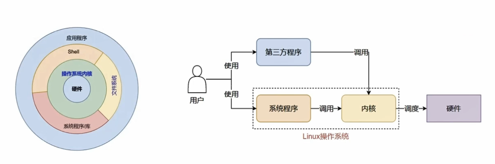
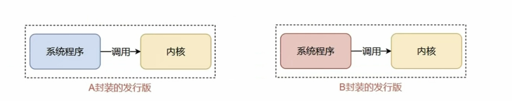
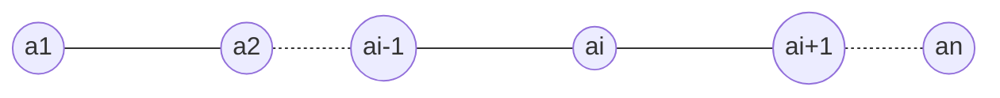

[toc]

# linux

## 初识Linux

### 初识

1. linux诞生

   * Linux 创始人 ： 林纳斯托瓦兹
   * Linux 诞生于 1991 年作者上大学期间
   * 因为创始人在上大学期间经常需要浏览新闻和处理邮件发现现有的操作系统不好用 ， 于是他决心自己写一个保护模式下的操作系统 ， 这就是 Linu × 的原型 ， 当时他 21 岁 ， 后来经过全世界网友的支持 ， 现在能够兼容多种硬件 ， 成为最为流行的服务器操作系统之一

2. 内核

   * Linu× 系统的组成如下 ：

     1. Linux 系统内核;系统级应用程序两部分组成 。

        

     2. 内核提供系统最核心的功能 ， 如 ： 调度 CPU 、 调度内存 、 调度文件系统 、 调度网络通讯 、 调度旧等 。

     3. 系统级应用程序 ， 可以理解为出厂自带程序 ， 可供用户快速上手操作系统 ， 如 ，文件管理器 、 任务管理器 、 图片查看 、 音乐播放等 。

3. 常见发行版本

   1. 可以看出 / 内核是 Linux 操作系统最核心的所在 ， 系统级应用程序只是锦上添花 。
      * Linux 内核是免费开源的 ， 任何人都可以下载内核源码并查看且修改 。
      * 可以通过 ： https://www.kernel.org 去下载 Linu × 内核
      
   2. 内核是免费 、 开源的 / 这也就代表了 ：
   
      * 任何人都可以获得并修改内核 / 并且自行集成系统级程序
      * 提供了内核 + 系统级程序的完整封装 / 称之为 Linu × 发行版
   
      

### 虚拟机

==借助虚拟化技术 , 我们可以在系统中 ,通过软件 ： 模拟计算机硬件 , 并给虚拟硬件安装真实的操作系统 。这样 , 就可以在电脑中 ,虚拟出一个完整的电脑以供我们学习 Linux系统 。==

1. **安装VMware WorkStation**

   * 下载地址 ： `https://www.vmware.com/cn/products/workstation-pro.html`

   * 打开网卡设置---`win+r`--->`ncpa.cpl`
   
2. **吏用 VMware 安装 Linux 虚拟机**
   *  Cent OS下载地址:`https://vault.centos.org/7.6.1810/isos/x86_64/CentOS-7-x86_64_DVD-1810.iso`
   
3. **远程链接Linux系统**
   1. 掌握操作系统的图形化 、 命令行 2 种操作模式
      1. 对于操作系统的使用 ， 有 2 种使用形式 ：
         * 图形化页面使用操作系统:使用操作系统提供的图形化页面 ， 以获得图形化反馈的形式去使用操作系统 。
         * 以命令的形式使用操作系统:使用操作系统提供的各类命令 / 以获得字符反馈的形式去使用操作系统 。
   2. 理解为什么使用命令行操作 Linux 系统
   3. 掌握使用 FinaISheII 软件连接 Linux 操作系统
      1. 下载finalshell并安装--安装依赖
      2. 输入`ifconfig`查看服务器ip
      3. 点击finalshell的文件夹图标---点击代加号的白色文件夹---SSH链接（Linux），创建远程链接
      4. 输入名称---自取
      5. 输入IP---账号密码
   4. WSL(在win中的Linux系统)
      1. 点击`win`--`启用或关闭win功能`--勾选`适用于Linux的win子系统`---重新启动
      1. 然后在win上自带的应用商店获取Ubuntu
      1. 开启虚拟化
      1. 安装Terminal
   5. 虚拟机快照
   
      1. 通过快照将当前虚拟机的状态保存下来，在以后可以通过快照恢复虚拟机到保存的状态
   
         * VMware Workstation 制作快照
           1. 确保虚拟机关机，找到快照管理器
           2. 找到虚拟机鼠标右击---快照---快照管理器---拍摄快照----给名字、描述---拍摄快照
         * VMware Fusion 制作快照
           1. 快照可以保存虚拟机的状态 ， 当虚拟机出现问题的时候 ， 可以通过预先制作的快照恢复到制作时候的状态用作备份用 。
           2. VMware Workstation 和 VMware Fusion 都支持制作快照去使用
   
4. **如何让局域网中的其他主机访问虚拟机**

   ==前提：==同一局域网主机1，主机2都为Windows系统，主机1上安装了VMware Workstation 14 Pro，并创建了一台虚拟机1，使用CentOS 7系统。

   1. 虚拟机1的网络适配器设置为NAT模式。

   2. 启动虚拟机1，用命令“ip addr”查看虚拟机的ip地址。

      1. 如果没有看到ip地址，则进入目录“cd /etc/sysconfig/network-scripts”，用命令“ls | grep 'ifcfg-*'”来找到配置文件ifcfg-ens33（这个名称不同的虚拟机不一样）。

      2. 编辑这个配置文件ifcfg-ens33，重点修改（增加）这两行：

         ```
         BOOTPROTO=dhcp
         ONBOOT=yes
         ```

      3. 用命令重启网络服务“service network restart”。再次用命令“ip addr”查看ip地址，可以看到虚拟机的ip.

   3. 可以通过ping命令，互相ping通主机1和虚拟机1，并且虚拟机1能ping通www.baidu.com。主机1也能访问虚拟机1的网页，但是主机2并不能访问到虚拟机1的网页。接下来打开VMware Workstation，从菜单栏中选择“编辑-->虚拟网络编辑器”,点击“更改设置”。

   4. 选中“VMnet8”——输入端口——类型选择TCP——输入虚拟机ip——输入端口“确定”

      1. 同一网络下两台==win==主机无法ping通：
         1. 第一步：启用规则
            1. 打开 **控制面板**，查看方式选择 **类别**，选择 **系统和安全**，选择 **Windows Defender 防火墙**打开左边的 **高级设置**，选择 **入站规则**，找到这两条规则，右键 **启用规则**（远程地址也就是作用域改为任何）
         2. 第二步：修改高级共享设置
            1. 打开 **控制面板**，查看方式选择 **类别**，选择 **网络和 Internet**，选择 **网络和共享中心**，打开左边的 **更改高级共享设置**，按图中选择：**启用网络发现** 和 **启用文件和打印机共享** 后点击下方的 **保存更改**

## Linux基础命令

1. Linux目录结构

   1. 在 Linux 系统中 / 路径之间的层级关系 ， 使用 ： / 来表示
   2. 在 Windows 系统中 ， 路径之间的层级关系 ， 使用 ： \ 来表示

2. 命令

   1. 学习 Linux, 本质上是学习在命令行下熟练使用 Linux的各类命令 。

      * 命令行 ： 即 Linux 终端 (Terminal), 是一种命令提示符页面 。 以纯 “ 字符 “ 的形式操作系统 ， 可以使用各种字符化命令对系统发出操作指令 。
      * 命令 ： 即 Linux 程序 。 一个命令就是一个 Linux的程序 。 命令没有图形化页面 / 可以在命令行 （ 终端中 ） 提供字符化的反馈。

   2. Linux命令基础格式

      * 无论是什么命令 / 用于什么用途 ， 在 Linux 中，命令有其通用的格式 ：
        ==command [-options] [parameter]==

        * command: 命令本身
        * -options: [ 可选 ， 非必填 ] 命令的一些选项 ， 可以通过选项控制命令的行为细节
        * paramete: [ 可选 ， 非必填 ] 命令的参数 ， 多数用于命令的指向目标等
          ==语法中的[], 表示可选的意思==

      * 示例 ：

        * ls /home/itheima, [ s 是命令本身 ， 是选项 / /home/itheima 是参数
          ==意思是以列表的形式 ， 显示 /home/itheima 目录内的内容==

        * cp -r testl test2 , cp 是命令本身 ， -r 是选项 ， test1 和 test2 是参数

          ==意思是复制文件夹 test1 成为 test2==

   3. ls命令

      1. ls 命令的作用是列出目录下的内容，语法细节如下 ：
      2. `ls [-a -l -h] [Linux路径]`
      3. -a -l -h是可选的选项
      4. Linu × 路径是此命可选的参数
         ==当不使用选项和参数，直接使用 ls 命令本体,表示 :以平铺形式,列出当前工作目录下的内容==
      5. 头的文件或文件夹默认被隐藏 ，需一来彐选项 ， 以列表的形式展示内容 ， 并展示更多细节
      6. 参数和选项
         1. 当 ls 不使用参数 , 表示列出 ： 当前工作目录的内容 ， 即用户的 HOME 目录
         2. 当使用参数 ， ls 命令的参数表示 ： 指定一个 Linu × 路径 , 列出指定路径的内容
         3. -a选顶表示 :all 的意思即列出全部文件 （ 包含隐藏的文件 / 文件夹 ）
            * 图中以`.`开头的表示是 Linux系统的隐藏文件 / 文件夹 （ 只要以 `.`开头,就能自动藏 ）
            * 只有通过 -a 选项 ， 才能看到这些喼藏的文件 / 文件夹
         4. -l 选项表示:以列表（ 竖向排列 ）的形式展示内容 / 并展示更多信息
            * -l选项其实和图形化中 / 文件夹以列表形式排列是一个意思
            * 给出了[权限--用户和用户组--大小--创建时间]
            * 语法中的选项是可以组合使用的 ， 比如学习的 -a 和 -l 可以组合应用
            * 写法 ：`ls -a`、`ls -la`、`ls -al`
            * 上述三种写法 ， 都是一样的 ， 表示同时应用-l 和-a的功能
         5. -h 表示以易于阅读的形式 ，列出文件大小 ，如 K 、 M 、 G
         6. -h 选项必须要`-l`搭配一起使用

   4. cd-pwd命令

      1. 我们可以通过cd命令,更改当前所在的工作目录 。
         * cd 命令来自英文 ： change Directory
           `语法 ：cd [Linux 路径 ]`
           * cd 命令无需选项 ， 只有参数 ， 表示要切换到哪个目录下
           * cd 命令直接执行 ， 不写参数 ， 表示回到用户的 HOME 目录
      2. 我们可以通过 pwd 命令 ， 来查看当前所在的工作目录 。
         * pwd 命令来自 ： Print Work Di rectory
           `语法 ： pwd`
           * pwd 命令 ， 无选顶 ， 无参数 ， 直接输入 pwd 即可

   5. 相对路径、绝对路径和特殊路径

      1. 绝对路径 ： 以根目录为起点 ， 描述路径的一种写法 ， 路径描述以 / 开头
      2. 相对路径 ： 以为起点 ， 描述路径的一种写法 ， 路径描述无需以 / 开头
      3. 特殊路径符
         * `.`     表示当前目录 ， 比如 `cd ./Desktop` 表示切换到当前目录下的 Desktop 目录内 ， 和 cd Desktop 效果一致
         * `..`   表示上一级目录 / 比如 ： `cd..`即可切换到上一级目录 / cd “ / “ 切换到上二级的目录
         * `~`     表示 HOME 目录 / 比如 ： `cd~` 即可切换到 HOME 目录或 cd /Desktop, 切换到 HOME 内的 Desktop 目录

   6. 创建目录命令（mkdir）

      1. 通过 mkdir 命令可以创建新的目录 （ 文件夹 ）
         * mkdir 来自英文 ： Make Directory
         * 语法 ：`mkdir [-p] Linnux路径`
           * 参数==必填==，表示 Linux 路径，即要创建的文件夹的路径 ， 相对路径或绝对路径均可
           * `-p`选项可选 ，表示自动创建不存在的父目录，适用于创建连续多层级的目录
   
      清理屏幕`ctrl+l`
   
   7. 文件操作命令part1(touch、cat、more)
   
      1. touch创建文件
         1. 可以通过 touch 命令创建文件
            * 语法：`touch Linux路径`
            * touch 命令无选项，参数必填，表示要创建的文件路径，相对、绝对、特殊路径符均可以使用
      2. cat、more查看文件内容
         1. 准备好文件内容后，可以通过 cat 查看内容 。
            1. 语法 ： `cat Linux路径`
               * cat 同样没有选项，只有必填参数，参数表示：被查看的文件路径，相对、绝对、特殊路径符都可以使用
         2. more 命令同样可以查看文件内容，同 cat 不同的是 ：
            * cat 是直接将内容全部显示出来
            * more 支持翻页 ， 如果文件内容过多 ， 可以一页页的展示
              * 语法 ：`more Linux路径`
              * 同样没有选项 ， 只有必填参数，参数表示，被查看的文件路径，相对 、 绝对 、 特殊路径符都可以使用
              * 在查看的过程中 ， 通过空格翻页
              * 通过 q 退出查看
      3. cp--mv--rm
      4. which--find
      5. grep--wc管道符
      6. echo--tail重定向符
      7. vi编辑器
         1. 在 Vi 编辑器中，要退出并保存文件，可以按照以下步骤操作：
            1. 确保你处于 "命令模式"，可以通过按下 `Esc` 键来进入命令模式。
            2. 输入 `:wq`，表示保存并退出。按下 `Enter` 键执行该命令。
            3. Vi 将会保存你的文件并退出编辑器。
            4. 另外，如果你想退出编辑器但不保存文件，可以在步骤2中输入 `:q!`，然后按下 `Enter` 键执行该命令。这会强制退出编辑器且不保存修改。
      
   8. 在Linux系统中想要查看本机IP地址
   
      1. 使用ifconfig命令：这将显示网络接口的详细信息，包括IP地址。
   
      ```
      ifconfig
      ```
   
      2. 使用ip命令：这将显示网络接口的详细信息，包括IP地址。
   
      ```
      ip addr show
      ```
   
      3. 使用hostname命令：这将显示本机的所有IP地址。
   
      ```
      hostname -I
      ```
   
      4. 使用curl命令：这将使用curl命令从ifconfig.me网站获取本机的公共IP地址。
   
      ```
      curl ifconfig.me
      ```
   
   9. service sshd restart重启sshd服务
   
   10. ifconfig:查看网络接口详情
   
   11. ping：查看与某主机是否能联通
   
   12. ps -ef|grep 进程名称：查看进程号
   
   13. lost -i 端口 ：查看端口占用情况
   
   14. top:查看系统负载情况，包括系统时间、系统所有进程状态、cpu情况
   
   15. free:查看内存占用情况
   
   16. kill:正常杀死进程，发出的信号可能会被阻塞
   
   17. kill -9:强制杀死进程，发送的是exit命令，不会被阻塞

## Linux权限管理

1. Linux的root用户
   1. sudo
2. 用户和用户组
3. 查看权限控制信息
4. chmod命令
5. chown命令

## Linux实用操作

1. 各类快捷键
2. 软件安全
3. systemctl控制软件启动关闭
4. 软链接
5. 日期和时区
6. IP地址和主机名
7. 配置 Linux 固定 IP 地址
8. 网络请求和下载
9. 端口
10. 进程管理
11. 主机状态监控
12. 环境变量
13. Linux文件的上传和下载
14. 压缩和解压

## 实战软件部署


## 脚本&自动化

## 项目实战

## 云平台技术

# 数据结构

## 线性表

1. 知识框架

$$线性表 \begin{cases} 顺序存储 ---顺序表 \\ 链式存储 \begin{cases} \left.\begin{matrix} 单链表 \\ 双链表 \\ 循环链表 \end{matrix} \right\}指针实现 \\ 静态链表(借助数组实现)\end{cases} \end{cases}$$

2. 定义
   1. 线性表的数据集合为{a1,a2,…,an}，假设每个元素的类型均为DataType。其中，除第一个元素a1外，每一个元素有且只有一个直接前驱元素，除了最后一个元素an外，每一个元素有且只有一个直接后继元素。数据元素之间的关系是一对一的关系。
   2. 在较复杂的线性表中，一个数据元素可以由若干个数据项组成。在这种情况下，常把数据元素称为**==记录==**，含有大量记录的线性表又称为**==文件==**


```mermaid
graph LR
a((a1))
b((a2))
c((ai-1))
d((ai))
e((ai+1))
f((an))
a----b-.-c----d----e-.-f
```

## 栈

* 栈：stack，又称堆栈，它是运算受限的线性表，其限制是仅允许在标的一端进行插入和删除操作，不允许在其他任何位置进行添加、查找、删除等操作。
  ==简单的说：采用该结构的集合，对元素的存取有如下的特点==

* 先进后出(即,存进去的元素,要在后它后面的元素依次取出后,才能取出该元素)。例如,子弹压进弹夹,先压进去的子弹在下面,后压进去的子弹在上面,当开枪时,先弹出上面的子弹,然后才能弹出下面的子弹。

* 栈的入口、出口的都是栈的顶端位置。

## 队列

* 队列: queue,简称队,它同堆栈一样,也是一种运算受限的线性表,其限制是仅允许在表的一端进行插入,而在表的另一端进行删除。

* 简单的说,采用该结构的集合,对元素的存取有如下的特点：先进先出(即，存进去的元素，要在后它前面的元素依次取出后，才能取出该元素)。例如，小火车过山洞,素车头先进去，车尾后进去；车头先出来，车尾后出来。

* 队列的入口、出口各占一侧。

## 数组

* 数组:Array,是有序的元素序列,数组是在内存中开辟一段连续的空间,并在此空间存放元素。就像是一排出租屋,有100个房间,从001到100每个房间都有固定编号,通过编号就可以快速找到租房子的人。
  ==简单的说,采用该结构的集合,对元素的存取有如下的特点：==
* 查找元素快：通过索引，可以快速访问指定位置的元素
* 数组特点：查询快，增删慢。
  * 初始化一个数组：在内存中,数组的数据连续存放,数据长度固定,这样知道数组开头位置和偏移量就可以直接算出数据地址
* 增删元素慢
  * 指定索引位置增加元素：需要创建一个新数组，将指定新元素存储在指定索引位置，再把原数组元素根据索引,复制到新数组对应索引的位置。

## 链表

### 单向链表

单向链表：链表中只有一条链子，不能保证元素的顺序（存储元素和取出元素的顺序有可能不一致）

* **链表:linked list**,由一系列结点node (链表中每一个元素称为结点)组成,结点可以在运行时i动态生成。每个结点包括两个部分:一个是存储数据元素的数据域,另一个是存储下一个结点地址的指针域。我们常说的链表结构有单向链表与双向链表，那么这里给大家介绍的是单向链表。

  ==简单的说,采用该结构的集合,对元素的存取有如下的特点:==

* 多个结点之间，通过地址进行连接。例如，多个人手拉手，每个人使用自己的右手拉住下个人的左手，依次类推，这样多个人就连在一起了。

* 查找元素慢：想查找某个元素，需要通过连接的节点，依次向后直找指定元素

* 增删元素快：增加/删除元素：只需要修改连接下个元素的地址即可。

### 双向链表

双向链表：链表中有两条链子，有一条链子是专门记录元素的顺序，是一个有序的集合

## 红黑树

* 二叉树：binary tree，是每个结点不超过2的有序树（tree）。

  简单的理解,就是一种类似于我们生活中树的结构,只不过每个结点上都最多只能有两个子结点。二叉树是每个节点最多有两个子树的树结构。顶上的叫根结点,两边被称作"左子树"和"右子树"。

# 算法

## 冒泡排序

```java
public class Test {
    public static void main(String[] args) {
        int[] array = new int[]{46,74,53,14,26,38,86,65,27,34};
        for (int i = 0; i < array.length; i++) {
            for (int j = 1; j < array.length; j++) {
                if (array[j - 1] < array[j]) {
                    int array1 = array[j];
                    array[j] = array[j - 1];
                    array[j - 1] = array1;
                }
            }
        }
        for (int i = 0; i < array.length; i++) {
            if (i == 0) {
                System.out.print("[" + array[i]);
            } else {
                System.out.print("," + array[i]);
            }
        }
        System.out.println("]");
    }
}
```

## 快速排序

快速排序算法步骤：

1. 在数组中选一个基准数（通常为数组第一个）；

2. 将数组中小于基准数的数据移到基准数左边，大于基准数的移到右边；

3. 对于基准数左、右两边的数组，不断重复以上两个过程，直到每个子集只有一个元素，即为全部有序。

   例：有无序数列：13,45,76,10,19要球队数列进行快速排序

   1. 第一步：选择13作为基准数
   2. 第二步：将45与13进行比较，45>13，故将45移到数列右边，此时数列为13,76,10,19,45
   3. 第三步：将76与13进行比较，76>13，故将76移到数列右边，此时数列为13,10,19,45,76
   4. 第四步：将10与13进行比较，10<13，故将10移到数列左边，此时数列为10,13,19,45,76
   5. 第五步：将将19与13进行比较，19>13，故将19移到数列右边，此时数列为10,13,45,76,19
   6. 得到最终结果是10,13,45,76,19

```java
 for (int i = 1; i < quicksort.length; i++) {
            if (quicksort[i-1] <= quicksort[i]){
                int as = quicksort[10];
                quicksort[10] = quicksort[i];
                for (int j = i; j < quicksort.length; j++) {
                    if (j<quicksort.length) {
                        quicksort[j] = quicksort[j + 1];
                    }else if(j == quicksort.length){
                        quicksort[j] = as;
                    }
                }
            }else if(quicksort[i-1] > quicksort[i]){
                int as = quicksort[0];
                quicksort[0] = quicksort[i];
                for (int j = 0; j < i; j++) {
                    if (j < i) {
                        quicksort[j+1] = quicksort[j];
                    }else if(j == i-1){
                        quicksort[j] = as;
                    }else if(j==1){
                        quicksort[i]=quicksort[i-1];
                    }
                }
            }
            System.out.print(quicksort[i]);
        }
```


# 部署

# 项目运行管理

[toc]

1. 定义：部署也就是所谓的上线，将我们本地开发好的项目部署到远程服务器上，使得任何机器都可以通过我们远程服务器的公网`ip`或者域名加上端口号访问到我们的项目。

## 部署

### 流程

**将笔记本电脑作为服务器需要安装服务器软件和进行一定的配置。以下是一些基本的步骤：**

1. 选择服务器软件：您需要选择适合您需求的服务端软件，比如Tomcat、Apache HTTP Server等。
2. 安装服务器软件：下载并安装所选的服务器软件，可通过官方网站或者第三方运营商获取。
3. 确定监听端口：在启动服务器之前，您需要确定您在服务器上要使用的端口号。一些常用的HTTP端口包括80、8080和443。
4. 配置网络：您需要确保随后可以以正确的方式进入您的网络并访问您的服务器。 您需要设置路由器来转发到正在运行服务器软件的计算机（于此同时确保防火墙的端口开放）并配置动态DNS以允许外部用户对您的服务器的访问。
5. 启动服务器：启动您的服务器软件，以便它侦听客户端连接。只要它成功侦听请求，您就可以从其他设备上的浏览器中访问该服务器了。
6. 请注意，在旧的或较低规格的计算机上建议不要使用过多的后台任务或应用程序，这可能会使性能降级。为了获得最佳性能建议使用最新可用的硬件设施和提供良好的冷却机制以保持温度稳定。

**项目部署**
$$
项目部署 \begin{cases} 环境准备 \begin{cases} 多台Linux服务器节点 \\ 各种工具、软件环境、基础设施\end{cases}\\ 代码准备--前后端分离项目\\ 本地导入和运行--导入IDEA运行\\修改配置 \begin{cases}改数据库配置\\改Redis配置\\改日志配置   \end{cases}\\项目上传、构建、打包\begin{cases}上传\\前端项目构建打包\\后端项目后构建打包\begin{cases}打包jar\\打包war\end{cases}\end{cases}\\项目服务部署\begin{cases}前端项目部署--配置Nginx代理\\后端项目部署\begin{cases}jar包部署\\war包部署\\配置Nginx代理转发\\多实例集群部署\end{cases}\end{cases} \end{cases}
$$

#### 1.环境准备

1. Java环境

   1. `jdk`

2. 数据库环境

   1. `mysql`

3. `vue`环境

   1. `node.js`
   2. 相关`vue`插件

4. Web服务器和应用服务器

   ==Web服务器，是指一台在互联网上具有独立`IP`地址的高性能计算机，可以向互联网上的用户提供“WWW（万维网）、Email（电子邮件）和FTP（文件传输）”等各种互联网服务。根据Web服务器提供的服务类型的不同，Web服务器又可以分为`Http`服务器，Email服务器和FTP服务器等。
   一般的Web服务器只提供页面浏览，文件下载和邮件等服务。如果要产生一些动态的响应，Web服务器一般不会自己处理，而是会委托给一些其它的程序例如`CGI`脚本，`JSP(JavaServer Pages）`脚本，`servlets`和`ASP(Active Server Pages）`等脚本。这些能处理动态响应的服务器就称为应用服务器。==

   ```mermaid
   flowchart RL
       id1((用户))
       id2(客户端浏览器)
       id1 ---->|1.输入URL地址| id2
       id2 ----->|7.显示HTML| id1
       subgraph D
       A[服务器]
       B[CGI程序生成所需的html文件]
       C[(数据库)]
       B<---->|4.读取数据库或者文件|C
       A---3.请求运行某个CG程序-->B
       A---5.输出生成HTML界面--->B
       end
       id2----->|2.向服务器发送请求|D
       D----->|6.返回HTML页面做出响应|id2
   ```


   1. **tomcat**

      >Tomcat是一款Apache下面的开源的`Servlet`容器，实现了对`Servlet和JSP`规范的支持。另外 Tomcat 本身内含了一个 HTTP 服务器，所以也可以被当作一个 Web 服务器来使用。但是Tomcat作为一个Web服务器，它对静态资源的处理能力要比Apache或者`Nginx`这类的Web服务器差很多，所以我们经常将Apache和Tomcat（或者是`Nginx`和Tomcat）组合使用，Apache来充当Web服务器处理静态资源的请求，Tomcat充当`Servlet`容器来处理动态请求。

      1. 优缺点：Tomcat**开源，免费**， 经过长时间的发展（先发优势），它已经广泛的被市场接受和认可，相对 Jetty 和 Undertow来说 Tomcat 还是更加**稳定和成熟**的

   2. **`Weblogic`和`Websphere`**

      这边可以将`Weblogic`和`Websphere`归为一类，他们都是收费软件，而且价格不菲。但是收费肯定有收费的原因，`WebLogic 与 WebSphere` 对业内多种标准有全面支持， 包括 `EJB、 JSB、 JMS、 JDBC、XML 和 WML`，使 Web 应用系统的实施更为简单，并且保护了投资，同 时也使基于标准的解决方案的开发更加简便。另外他们的安全性也非常高。`WebLogic 和 WebSphere` 的技术文档和相关服务也很到位，如果你的服务器哪一天 出问题了，只要你能出的起钱，他们的技术工程师立刻就能出现在你面前。

   3. `JBOSS`

      `JBoss` 是一个管理 `EJB` 的容器和服务器，支持 `EJB 1.1、EJB 2.0 和 EJB3.0 `的 规范。但 `JBoss `核心服务不包括支持 `servlet/JSP `的 WEB 容器，一般与 Tomcat 或 Jetty 绑定使用。`JBOSS`也是免费的。

      > 为什么`Weblogic、Websphere和JBOSS`等服务器在我们平时开发中很少被用到？
      >
      > 经过上面的介绍我们发现`Weblogic和Websphere`有很多优点：对业界标准全方位的支持、安全性高、对并发的支持量大以及到位的技术支持。但是为什么我们在开发过程中很少使用呢？最重要的原因还是因为这些软件价格昂贵。现在开发过程中我们对`EJB`这种规范使用越来越少，而且软件开发人员的水平逐渐提升，硬件价格下降。我们发现`Weblogic和Websphere`给我们带来的优势我们完全可以通过其他途径获得，为什么还要花大价钱呢？另外非开源的资料也较少，这些原因加在一起导致`Weblogic和Websphere`在我们平时开发中几乎不会使用。当然如果你们公司是一个不缺钱的公司的话，完全可以使用。
      >
      > 至于`JBoss`我们发现它是通过集成Tomcat来获得`Servlet`容器功能的，而它本身的`EJB`功能也越来越式微，`JBoss`的使用量自然上不去。因为现在都只需要`Servlet`容器功能，为什么不直接使用Tomcat呢？

   4. `Jetty`

      Jetty也是一个`Servlet`引擎，和Tomcat相比，Jetty的架构设计更加简单。在性能上两者有各自的使用场景。从架构上来看 Tomcat 在处理少数非常繁忙的连接上更有优势，也就是说连接的生命周期如果短的话，Tomcat 的总体性能更高。而 Jetty 刚好相反，Jetty 可以同时处理大量连接而且可以长时间保持这些连接。例如像一些 web 聊天应用非常适合用 Jetty 做服务器，像淘宝的 web 旺旺就是用 Jetty 作为 `Servlet` 引擎。

   5. `Undertow`

      和Jetty类似，Undertow也是一个`Servlet`容器。

   6. `Apache`

      Apache是一款高性能的Web服务器，和Tomcat相比，Apache更加专注于提供高性能的Web服务，而Tomcat是最主要的还是被当做`Servlet`容器来使用的，虽然它也有Web服务的功能，但这不是Tomcat的主要功能也不是它擅长的功能。所以Apache和Tomcat能搭配成一个好的组合：Apache提供Web服务，处理静态资源，Tomcat作为`Servlet`容器处理动态请求。

   7. `Nginx`

      `Nginx`和Tomcat的关系和`Apche`和Tomcat的关系差不多。`Nginx`也是一个高性能的Web服务器，同时我们还经常拿`Nginx`当做反向代理服务器和负载均衡服务器。

#### 2.前后端代码准备

#### 3.导入IDEA运行

#### 4.修改配置

1. 更改数据库配置
2. 更改Redis配置


## 前端软件及后台管理功能描述

1. 场景：介绍项目的背景
2. 任务：在项目中承担的角色
3. 行动：做了什么，使用了什么技术，做出了什么功能
4. 结果：项目有什么成效

## 数据备份

### 数据全自动备份

1. 

## 系统还原恢复


# shell

