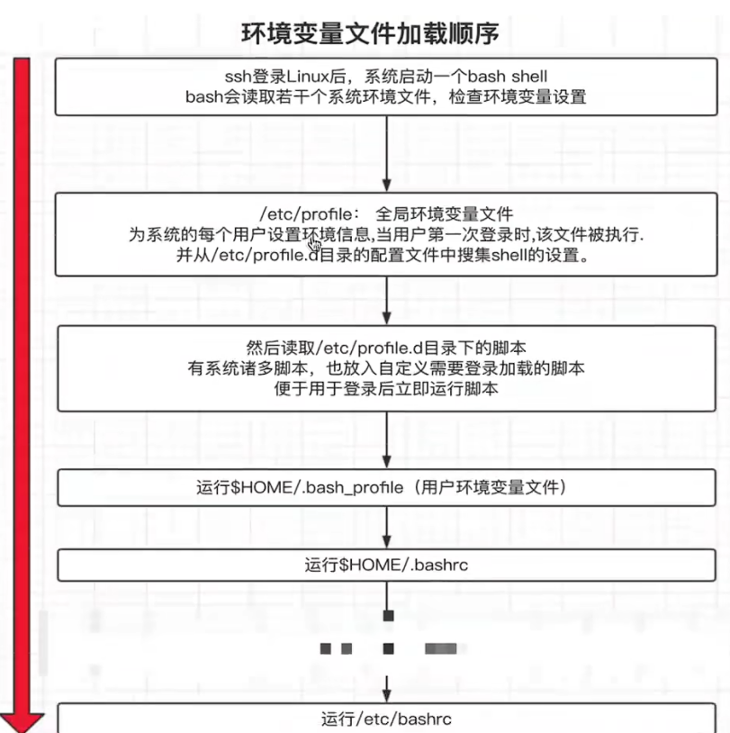

[toc]

# shell


## shell概念

**shell 的作用是**

* 解释执行用户输入的命令或程序等
* 用户输入一条命令， shell 就解释一条
* 键盘输入命令，Linux 给与响应的方式，称之为交互式
* shell 是一块包裹着系统核心的壳，处于操作系统的最外层，与用户直接对话，把用户的输入，解释给操作系统，然后处理操作系统的输出结果，输出到屏幕给与用户看到结果。
* 从我们登录 Linux ，输入账号密码到进入 Linux 交互式界面，所有的操作，都是交给 shell 解释并执行

**什么是 shell 脚本**

* shell 脚本语言属于一种弱类型语言无需声明变量类型，直接定义使用
* 当命令或者程序语句写在文件中，我们执行文件，读取其中的代码，这个程序文件就称之为 shell 脚本。
* 在 shell 脚本里定义多条 Linux 命令以及循环控制语句，然后将这些 Linux 命令一次性执行完毕，执行脚本文件的方式称之为，非交互式方式。
  * windows 中存在，`.bat` 批处理脚本
  * Linux 中常用，`.sh` 脚本文件
* shell 脚本规则
  * 在 Linux 系统中， shell 脚本或者称之为（ bash shell 程序）通常都是 vim 编辑，由 Linux 命令、 bash shell 指令、逻辑控制语句和注释信息组成。

### Shebang的正确玩法

计算机程序中，shebang 指的是出现在文本文件的第一行前两个字符`#!`

在 lJn 仅系统中，程序会分析 shebang 后面的内容，作为解释器的指令，

* 在所有shell脚本前，第一行都必须加上这个`#!`，后面跟解释器地址，是告诉系统此文件使用什么解析器解释编译

* 例如

  * 以 `#! /bin/sh` 开头的文件，程序在执行的时候会调用 `/bin/ sh` ，也就是 bash 解释器
  * 以 `#! /usr/bin/python` 开头的文件，代表指定 python 解释器去执行
  * 以 `#! /usr/bin/env` 解释器名称，是一种在不同平台上都能正确找到解释器的办法

* 注意事项

  * 如果脚本未指定 shebang ，脚本执行的时候，默认用当前 shell 去解释脚本，即 `$SHELL`
  * 如果 shebang 指定了可执行的解释器，如 `/bin/bash /usr/bin/python` ，脚本在执行时，文件名会作为数传递给解释器
  * 如果`#!` 指定的解释程序没有可执行权限，则会报错"bad interpreter ： Permission denied ”。
  * 如果 `#!`指定的解释程序不是一个可执行文件，那么指定的解释程序会被忽略，转而交给当前的 SHELL 去执行这个本
  * 如果 `#!`指定的解释程序不存在，那么会报错“ bad interpreter: No such file or directory ”。
  * `#!`之后的解释程序，需要写其绝对路径（如：`#!/bin/bash` ），它是不会自动到`$PATH` 中寻找解释器的。
  * 如果你使用 `bash test.sh` 这样的命令来执行脚本，那么#！这一行将会被忽略掉，解释器当然是用命令行中显式指定的 bash 。

* 示例

  ```shell
  #! /bin/sh # 这里是指定解释器
  echo "aaa" # 执行的操作
  #!/bin/sh 这里就是注释
  ```

* 执行 shell 脚本的方式

  * `bash scrip.sh`或`sh script.sh`文件本身没权限执行，没 x 权限，则使用的方法，或脚本未指定 shebang，重点推荐的方式
  * 使用`绝对/相对`路径执行本，需要文件含有 x 权限
  * `source script.sh` 或者`．script.sh`代表`执行的含义,source 等于点．`
  * 少见的用法，`sh < script.sh`
  * ==不同的执行方式，不同的 shell 环境==
    1. 每次调用 `bash /sh `解释器执行脚本，都会开启一个子 shell 环境，因此不保留当前的 shell 环境变量，通过`pstree`命令检查进程树
    2. 调用 `source` 或者点`.`符号，是在当前 shell 环境加载脚本。
    3. 开启子shell环境，那么必须使用exit退出子shell环境，才能上层shell环境，否则就会一直存在与子shell环境

### Bash特性

* bash 是一个命令处理器，运行在文本窗囗中，并能执行用户直接输入的命令

* bash 还能从文件中读取 Linxu 命令，称之为脚本

* bash 支持通配符、管道、命令替换，条件判断等逻辑控制语句

* Shell 会保留其会话中用户提交执行的命令

  ```shell
  history # #命令，查看历史命令记录，注意[包含文件中和内存中的历史记录],写在命令行
  
  echo $HISTSIZE # shell 进程可保留的命令历史的条数
  
  ls -a ~/.bash_history # 存放历史命令的文件
  ```

* history

  ```shell
  history # 命令 及参数
  -c # 清空内存中的历史命令
  -r # 从文件中恢复历史命令
  数字 # 显示最近n条命令 history 10
  ```

* 调用历史命令

  ```shell
  !历史id号 # 执行命令
  !! # 执行上条命令
  ```

* 特性

  * 文件路径 tab 键补全
  * 命令补全
  * 快捷键ctrl+a,e,u,k,l
  * 通配符
  * 历史命令
  * 命令别名
  * 命令行展开

## Shell变量

**定义**

* `变量名="值"`：变量与值之间不能有空格

  * 单引号变量，不识别特殊语法

  * 双引号变量，能识别特殊符号

  * 反引号：将变量值，执行的结果赋值给变量名

    ```shell
    [root@localhost ~]# name=`ll`
    [root@localhost ~]# echo $name
    total 20 -rw-------. 1 root root 2809 Dec 23 08:52 anaconda-ks.cfg -rw-r--r-- 1 root root 11320 Jul 25 2023 mysql80-community-release-el7-8.noarch.rpm -rw-------. 1 root root 2127 Dec 23 08:52 original-ks.cfg
    ```

* 调用变量`$变量名`或者`${变量名}`

* 变量类型， bshh 默认把所有变量都认为是字符串

**变量名命名规则**

* 名称定义要做到见名知意，切按照规则来，切不得引用保留关键字（ help 检查保留字）
* 只能包含数字、字母、下划线
* 不能以数字开头
* 不能用标点符号
* 变量名严格区分大小写

**变量的作用域**

* 本地变量，只对当前的 shell 进程

  ```shell
  pstree # 检查进程树
  ```

* 环境变量，也称为全局变量，针对当前 shell 以及其任意子进程，环变量也分`自定义、内置`两种环境变量

* 局部变量，针对在` shell 函数`或是 `shell 脚本`中定义

* 位置参数变量：用于 `shell 脚本`中传递的参数

* 特殊变量： shell 内置的特殊功效变量

  * `$?`
    * 0：成功
    * 1-255：失败
    * `echo $?`：判断上一条命令是否执行成功

* 自定义变量

  * 变量赋值：`varName=vaIue`

  * 变量引用：`${varName}、$varName`

  * 双引号，==变量名会替换为变量值==

  * 单引号，识别为普通字符串

    ```shell
    [root@localhost ~]# n1=1
    [root@localhost ~]# n2=2
    [root@localhost ~]# 
    [root@localhost ~]# n3="$n1"
    [root@localhost ~]# echo $n3
    1
    [root@localhost ~]# n4='$n2'
    [root@localhost ~]# echo $n4
    $n2
    ```

* 反引号：将变量值，执行的结果赋值给变量名

### 环境变量设置

==环境变量一般指的是用 export 内置命令导出的变量，用于定义 shell 的运行环境、保证 shell 命令的正确执行==

shell 通过环境变量确定登录的用户名、 PATH 路径、文件系统等各种应用。

环境变量可以在命令行中临时创建，但是用户退出 shell 终端，变量即丢失，如要永久生效，需要修改`环境变量配置文件`

* 用户个人配置文件 `~/.bash-profile` 、`～/.bashrc` 远程登录用户特有文件
  * 环境变量以当前登录用户的配置文件优先生效
* 全局配置文件 `/etc/profile`、`/etc/bashrc`且系统建议最好创建在 `/etc/profile.d/`，而非直接修改主文件，修改全局配置文件，影响所有登录系统的用户

**检查系统环境变量的命令**

* set：输出所有变量，包括全局变量、局部变量
* env：只显示全局变量
* declare：输出所有的变量，如同 set
* export：显示和设置环境变量值

**撤销环境变量**

* `unset 变量名`，删除变量或函数。

**设置只读变量**

* readonly ，只有 shell 结束，只读变量失效：`readonly password="132"`
* 直接readonly显示当前系统只读变量`readonly`

**系统保留环境变量关键字**

* bash 内嵌了诸多环境变量，用于定义 bash 的工作环境

  ```shell
  export | awk -F '[ :=]' '{print $3}'
  ```

**bash 多命令执行**

```shell
ls /data/;cd /tmp/;cd /home;cd /data
```

**环境变量初始化与加载顺序**



### shell特殊参数变量

==shell 的特殊变量，用在如脚本，函数传递参数使用，有如下特殊的，位置参数变量==

* `$0`：获取 shell 脚本文件名，以及脚本路径
* `$n`：获取 shell 脚本的第 n 个参数，n 在 1~9 之间，如`$1,$2,$9` ，大于 9 则需要写，`${ 10 }`，参数空格隔开
* `$#`：获取执行的 shell 脚本后面的参数总个数
* `$*`：获取 shell 脚本所有参数，不加引号等同于` $@`作 用，加上引号`"$*"`作用是接收所有参数为单个字符串，`"$1 $2 ..`
* `$@`：不加引号，效果同上，加引号，是接收所有参数为独立字符串，如`“$1” "$2" $3 ...`空格保留

**特殊变量实践**

```shell
[root@localhost ~]# sh shijian.sh q w e r t
$0 $1 $2
shijian.sh q w
$#
5
$*
q w e r t
$@
q w e r t
[root@localhost ~]# cat shijian.sh
#! /bin/sh
echo '$0 $1 $2'
echo $0 $1 $2
echo '$#'
echo $#
echo '$*'
echo $*
echo '$@'
echo $@
```

* `$*`和`$@` 都表示传递给函数或脚本的所有参数

* 不被双引号`""`包围时，它们之间没有任何区别，都是将接收到的每个参数看做一份数据，彼此之间以空格来分隔。

* 但是当它们被双引号`“”`包含时

  * `$*`：将所有的参数从整体上看做一份数据，而不是吧每个参数都看做一份数据。
  * `$@`：仍然将每个参数都看作一份数据，彼此之间是独立的。

* 可以使用shell的for循环查看

  ```shell
  for var in "$*"
  do
    echo "$var"
  done
  
  for var in "$@"
  do
    echo "$var"
  done
  
  # 开始一个for循环，"$@" 是一个特殊变量，它代表所有传递给脚本或函数的参数。
  # 每次迭代中，$var 将依次被赋予 "$@" 中的每个值（即每个参数）。
  for var in "$@"
  do
    # echo 命令输出 $var 的值到标准输出（通常是终端）。这里的 $var 在每次循环时都会被替换为当前迭代的实际参数值。
    echo "$var"
  done
  ```

  1. **`for var in "$@"`**: 这是循环的开始。`"$@"` 是一个包含所有传递给脚本或函数的位置参数的列表。在双引号内的使用确保了即使参数中包含空格或其他特殊字符也能被正确处理。`var` 是循环变量，在每次循环时被赋值为 `"$@"` 中的一个元素。
  2. **`do`**: 标志着循环体的开始。循环体是指那些需要对 `$@` 中的每个元素执行的命令集合。
  3. **`echo "$var"`**: 在循环体内，`echo` 命令用于输出变量 `$var` 的值。由于 `$var` 在每次迭代中都被赋值为 `"$@"` 列表中的下一个参数，因此这行代码会按顺序打印出所有传入脚本或函数的参数。
  4. **`done`**: 标志着循环体的结束。当到达 `done` 时，如果 `"$@"` 中还有未处理的元素，循环将继续；否则，循环结束，程序继续执行循环后面的命令。

### shell特殊状态变量

* `$?`：上一次命令执行状态返回值， 0 正确，非 0 失败
* `$$`：当前 shell 脚本的进程号
* `$!`：上一次后台进程的 PID
* `$_`：上次执行命令的最后一个参数
* 查找方式`man bash`搜索`/Special Parameters`

**脚本控制返回值**

==这个脚本执行完毕了，会返回一个数字 id ，称之为返回值==

## 内置shell命令

命令使用分号隔开，进行语句结束

* `echo`：打印输出

  * 参数
  * `-n`：不换行输出
  * `-e`：解析字符串中的特殊符号
    * 特殊符号：`\n`：换行；`\r`：回车；`\t`：制表符 四个空格；`\b`：退格

* `printf ""`：打印输出，自动识别特殊符号

* `eval`：执行多个命令

  * 语法`ecal 命令1;命令2;命令3.....`

* `exec`：不创建子进程，执行后续命令，且执行完毕后，自动 exit，退出进程

* `export`：为当前shell及其子shell设置环境变量

  * 语法`export 环境变量名="值"`

* `read`：用于从标准输入（通常是键盘）读取一行数据，并将读取的数据分配给一个或多个shell变量

  * 示例：

    ```bash
    read -p "Enter your name: " NAME
    echo "Hello, $NAME!"
    ```

  * 这段脚本提示用户输入名字，并将输入的名字存储在变量`NAME`中，然后打印一条问候消息。

* `shift`：用于改变位置参数的位置。它使得原本的2变为2变为1，3变为3变为2，以此类推，而原始的$1则被丢弃。这个命令通常用于处理脚本中的命令行参数列表。

  * 示例：

    ```bash
    while [ "$#" -gt 0 ]; do
        echo "Argument $1"
        shift
    done
    ```

  * 这个循环会遍历所有的命令行参数，每次迭代后执行`shift`，使得下一个参数成为1，直到没有参数为止（即‘1，直到没有参数为止（即‘#`变为0）。

### 变量子串的语法

```bash
${变量}                           返回变量值
${#变量}                          返回变量长度,字符串长度
${变量:start}                     返回变量start数值之后的字符,包括start        ${name:4}
${变量:start:length}              提取start之后的length限制的字符
${变量#woed}                      从变量开头删除最短匹配的word子串,            word:值的一部分
${变量##word}                     从变量开头删除最长匹配的word子串
${变量%word}                      从变量从前向后删除最短的word
${变量%%word}                     从变量结尾开始删除最长匹配的word
${变量/pattern/string}            用string代替第一个匹配的pattern
${变量//pattern/string}           用string代替所有的pattern
```

**统计变量子串的长度**

* `wc -L`：统计最长的一行的字符数
* `expr length "$变量名"`：统计字符串的长度
* `awk '{print length($0)}'`：统计一整行
* `${#变量名}`：最快方法

**统计命令执行的时长**

* time命令

  ```bash
  time 命令
  ```

* for循环

  ```bash
  for 变量 in 序列
  do
      在循环中执行的语句
  done
  # 写为一行
  for 变量 in {1..5};do 在循环中执行的语句;done# 循环{1..5}循环5次
  ```

* 统计时间

  ```bash
  time for n in {1..5};do char=`seq -s "qqwe" 100`;echo ${#char} &>/dev/null;done
  
  char=`seq -s "qqwe" 100`;
  # 使用 seq 命令生成一个字符串，并将其赋值给变量 char。让我们拆分这条命令来理解它的含义：
  # `...`：这是反引号，用于命令替换。它会执行其中的命令，并将输出结果替换到当前命令行中。
  # seq -s "qqwe" 100：这里的 seq 命令用来生成数字序列。通常情况下，seq 的基本用法是 seq [选项]... 尾数 或者 seq [选项]... 首数 尾数 [增量] 来生成一系列数字。然而，在这个例子中，通过 -s 参数（separator），指定了数字之间的分隔符为 "qqwe"，并且只提供了一个参数 100，这意味着从 1 开始到 100 结束，默认每个数递增 1。
  ```

* shell编程，尽量使用 linux 内置的命令，内置的操作，和内置的函数，效率最高 c 语言开发，效率最高，尽可能的减少管道符的操作

**批量修改文件名**

* `touch qw_{1..5}_aq.txt`：批量新建文件

* 批量修改

  ```bash
  for n in ls *.txt
  do 
    mv $n echo ${n//_qa/}
  done
  # 一行
  for n in `ls *.txt`;do mv $n `echo ${n//_aq/}`;done
  for n in `ls *.txt`;do mv $n ${n//_aq/};done
  ```

**Shell扩展变量**:对变量的值进行判断、处理

* 如果 parameter 变量值为空，返回 word 字符串
* `${parameter:-word}`
* 如果 para 变量为空，则 word 替代变量值，且返回其值
* `${parameter:=word}`
* 如果 para 变量为空， word 当作 stderr 输出，否则输出变量值；用于设置变量为空导致错误时，返回的错误信息
* `${parameter:?word}`
* 如果 para 变量为空，什么都不做，否则(不为空) word 返回
* `${parameter:+word}`

### 实践shell扩展变量


**为什么需要父子shell**

### Shell内置、外置命令


## Shell编程内容回顾

## Shell数学运算与双小括号
## 进阶：数值计算脚本开发
## Let命令计算
## 进阶：开发nginx存活检测脚本
## Expr命令实战
## Expr命令案例
## 数学计算命令完结
## Shell条件测试开篇
## Shell测试语法参数解释
## Test命令与-E测试用法
## Test命令讲解二
## 条件测试与中括号详解
## 如何阅读优秀的脚本
## 字符串值判断逻辑
## 数值比较符号
## 逻辑运算符号
## 逻辑运算脚本一
## 趣谈逻辑脚本开发
## 趣谈if语法
## 开发内存检测脚本
## If实战一
## 如何检测服务状态
## 提升：学习php和python连接mysql
## Shell脚本检测mysql服务状态
## 轻松学习rsync专业脚本开发
## 理解为什么用函数
## 使用函数的关键点
## 如何使用函数一
## 提升：详解shell环境与函数执行
## 提升：图解函数脚本处理传入参数
## 函数脚本开发：检测网站存活
## 趣谈rsync起停脚本开发

## 常用脚本

### 快速安装MySQL

### 快速安装nginx

### 快速安装redis

