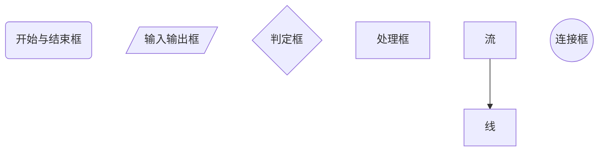

# python

[toc]


```
IDLE python自带的简单的开发环境
python 3.10(64-bit) python的交互式命令行
第三个带问号的是官方技术文档
第四给是已安装的模块文档
```

## 变量

**Python属于动态数据类型语言，变量没有类型不需要先定义后使用**

```
python执行赋值语句是过程分三步
1.在内存中创建对象
2.检查变量是否存在，不存在则创建
3.建立变量与对象引用之间的关系，也就是变量指向相应对象的引用。
```

## 标识符

```
标识符是指用来标识某个实体的符号，标识符用来标识变量，函数，模块，文件，类等
```

### 标识符命名规则

```
1.标识符以非数字字符开头，后跟空格外的任意字符
2.python默认关键字不能作为标识符
3.区分大小写
```

## 查看关键字

```python
查看关键字help("keywords")
Here is a list of the Python keywords.  Enter any keyword to get more help.
下面是Python关键字的列表。 输入任何关键字以获得更多帮助。  
False               class               from                or
None                continue            global              pass
True                def                 if                  raise
and                 del                 import              return
as                  elif                in                  try
assert              else                is                  while
async               except              lambda              with
await               finally             nonlocal            yield
break               for                 not 
```

## 数值

### 整形（int）

```
python3.X中的整形可以表示任意大的整数，不在区分int和long
type()可以查看对象的类型
```

### 浮点型(float)

```
带小数的数
```

### 复数(complex)

```
跟数学中复数定义一样，由实部和虚部构成
复数是什么意思. 我们把形如z=a+bi（a，b均为实数）的数称为复数，其中a称为实部，b称为虚部，i称为虚数单位。. 当z的虚部等于零时，常称z为实数；当z的虚部不等于零时，实部等于零时，常称z为纯虚数。
```

### 布尔型（`bool`)

```
只有True和False两个，TRUE在进行数学运算时表示1，false在进行数学运算是表示0
```

## 字符串

```
Python中字符串就是用单引号，双引号，三个单引号，和三个双引号括起来的字符序列
```

### 转义字符

| 转义字符 |         含义         | 转义字符 |             含义              |
| :------: | :------------------: | :------: | :---------------------------: |
|   `\n`   |         换行         |   `\\`   |       字符串中的“\”本身       |
|   `\t`   |    制表符（Tab）     |   `\"`   |     字符号中的双引号本身      |
|   `\r`   |         回车         |  `\ddd`  | 3位八进制数对应的ASCII码字符  |
|   `\'`   | 字符串中的单引号本身 |  `\xhh`  | 两位八进制数对应的ASCII码字符 |

### 字符串运算

```python
字符串可以使用“+”“*”运算符进行运算
sentence = "Python"+"is a programming language"
print(sentence)
srt="Python" * 3
print(srt)
```

### 字符串操作方法

| 方法                             | 功能描述                                                     |
| :------------------------------- | :----------------------------------------------------------- |
| `string.capitalize()`            | 将字符串中第一个字母大写                                     |
| `string.count(sub[start[,end]])` | 统计字符串中某一字符从start位置开始到end位置为止出现的个数   |
| `string. find(sub[start[,end]])` | 返回某一字符串出现的起始位置，无则返回-1                     |
| `string.isalnum()`               | 检测字符串中是否包含0\~9，a\~z                               |
| `string.isalpha()`               | 检测字符串中是否只包含a\~Z、A~Z                              |
| `string.isdigit()`               | 检测字符串中是否只包含0~9                                    |
| `string.islow()`                 | 检测字符串是否均为小写字母                                   |
| `string.isspace()`               | 检测字符串中是否均为空白字符                                 |
| `string.istitle()`               | 检测字符串中的单词是否均为首字母大写                         |
| `string.issupper()`              | 检测字符串中是否均为大写字母                                 |
| `string.join(iterable)`          | 连接字符串                                                   |
| `string.lower()`                 | 将字符串中的字母全部转换为小写                               |
| `string.split(sep=None)`         | 分割字符串,默认用空格分割                                    |
| `string.swapcase()`              | 将字符串中的大写字母转换为小写,将小写字母转换为大写          |
| `string.title()`                 | 将字符串中单词的首字母大写                                   |
| `string.upper()`                 | 将字符串中的全部字母大写                                     |
| `len(string)`                    | 返回字符串的长度                                             |
| `string.strip([chars])`          | 去除字符串首尾的空格、\n、\r、\t,如果指定，则去除首尾指定的字符 |

## 列表

```python
使用赋值符号“=”：将一个列表赋值给一个变量即可创建一个列表
alist=[1,2,3,4,5]
type(alist) #查看列表类型
```

### 列表操作方法

| 方法                               | 功能描述                                                     |
| ---------------------------------- | ------------------------------------------------------------ |
| `list.append(object)`              | 在列表的尾部追加元素                                         |
| `list.count(value)`                | 返回列表中某元素出现的次数                                   |
| `list.extend(iterable)`            | 在列表的尾部追加另一个列表                                   |
| `list.index(value,[start[,stop]])` | 返回某元素在列表中的位置                                     |
| `list.insert(index,object)`        | 在列表的某个位置插入一个元素                                 |
| `ist.pop([index])`                 | 返回列表中index位置的元素,并删除该元素;省略index则指返回列表尾部元素,并删除该元素 |
| `list.remove(value)`               | 删除列表中指定元素,若有多个,则删除第一个                     |
| `list.reverse()`                   | 将列表中元素的顺序颠倒                                       |
| `list.sort(reverse=False)`         | 将列表中的元素默认按升序排序                                 |

### 列表访问

```python
切片适用于列表，元组，字符串，range,切片是截取列表中的任何部分来获取一个新的列表，也可以对元素进行增删改
python中序列的序号可以从右向左可以从0开始增加，也可而已从右向左一-1开始依次减少
len()是python的内置函数，用于获取列表中元素的个数
```

$$
切片操作\\
\begin{array}{c|lcr} 
    \rm alist & \text{0} &\text{1} &\text{2} &\text{3} &\text{4} &\text{5} &\text{（从右到左从0开始增加）} \\
    \hline
    \rm alist & \text{p} & \text{y} & \text{t} &\text{h} &\text{0} &\text{n}\\
    \hline
     \rm alist & -6 & -5 & -4 & -3 & -2 & -1 &\text{（从右到左以-1开始减少）}\\
\end{array}
$$


```python
alist = [3,4,2,9]
print(alist[0]) #输出左边第0个位置的元素
print(len(alist))#查看列表的元素个数
print(alist[3]) #输出左边的第3个元素
print(alist[-1]) #输出最右边的元素
print(alist[2],alist[-2]) #输出左边第二个元素
alist[0]=88
print(alist[0]) #修改元素列表的值
```

### 列表切片

切片是为了获取序列某个区间的元素序列。切片通过两个冒号分隔3个数字来实现，省略步长时，可以同时省略后一个冒号。

```python
alist = [3,4,2,9,12,6,18,-6]
alist = [x:y:z]
```

| x    | 第一个数字表示切片开始的位置                         | 默认为0          |
| ---- | ---------------------------------------------------- | ---------------- |
| y    | 第二个数字表示切片的终止位置（但不包含该位置的元素） | 默认为列表的长度 |
| z    | 第三个数字为切片的步长                               | 默认为1          |

```python
alist = [3, 4, 2, 9, 12, 6, 18, -6]
print(alist[:])  # 取全部元素
print(alist[0:])
print(alist[:-1])  # 取除最后一个元素的所有的元素
print(alist[2:5])  # 从第二个开始取到第五个，不包含第五个
print(alist[::2])  # 从0开始每隔一个取一个元素
print(alist[1:5:2])  # 从第一个开始取到第五个每隔一个取一个，不包含第五个
print(alist[::-1])  # 从右向左取全部
print(alist[5:0:-2])  # 从第五个开始，从右向左隔一个取一个到0为止不包含0
```

### 切片应用

```python
alist = [3, 4, 2, 9, 12, 6, 18, -6]
alist_s=alist[1:6:2]#获得子列表
alist[1:6:2] =[28,38,48] #修改元素值
del alist[3:5]#删除元素
```

字符串也可以按切片来操作，字符串是不可变序列，即不能修改其值

## 元组

元组是python内置的一个数据结构，元组属于不可变序列，元组一旦创建，用任何方法都不可修改其元素的值，元组用“（）”将数据元素括起来，元素之间用“，”进行分割，一个元组的元素是可以不同类型的。

```python
tuple=(123,'k','Python')
tuple_2 = (8,)#创建只含一个元素的元组时要注意，元素后要加“，”
tuple_2 = (8)#未加“，”则视为一个括号表达式
del tuple #删除元组
```

元组的访问也是通过下标和切片来进行访问的

元组的运算

```python
tuple = (1,2,3,'k','Python')
language = ("java","c#","PHP")
merge = tuple + language #链接运算
language*3#重复运算
```

元组的操作方法只有两个

```python
# tuple.index(value,[start[,top]])返回某元素在元组中的位置
# tuple.count(value)返回列表中某元素出现的次数
mager.index('java')
mager.count('c#')
```

## 字典

字典是python中一个内置的数据类型，每个元素都以键：值对的形式存在，用“{}”将所有元素括起来，各元素之间用“，”分割，字典是无序的元素访问是通过“键“来是现实现的，字典中的键不能重复

```python
dict = {}#创建一个空字典
#dict={'键':值,}
dict = {'a':1,'b':2,'c':3,'d':4,'e':5}
print(dict)
lag = {'python':1,'c':2,'java':3}
print(lag['java'])#通过见访问元素
print(dict['a'])
#字典的键可以是字符串数值，逻辑值，字典的值可以是单个的值也可以是列表，元组等
#修改值
lag["java"]=4 # 直接将值赋给键
#增加值
lag["c#"] =3#直接将值赋给一个新的键
print(lag)
del lag["c#"] #删除元素
print(lag)
del lag#删除元组
print(lag)
```

字典的操作方法

| 方法                         | 功能描述                                                     |
| ---------------------------- | ------------------------------------------------------------ |
| dict.clear()                 | 清空字典                                                     |
| dict.copy()                  | 复制字典                                                     |
| dict.get(k,[default])        | 获得k(键)对应的值，不存在则返回default                       |
| dict.items()                 | 获得由键和值组成的元组，作为元素的列表                       |
| dict.keys()                  | 获得键的迭代器                                               |
| dict.pop(k[,d])              | 删除k（键）对应的键：值对                                    |
| dict.update(adict)           | 删际K(键)对应的键:值对从另一个字典更新字典元素的值,如果不存在,则添加此元素 |
| dict.values()                | 获取值的迭代器                                               |
| dict.fromkeys(iter,value)    | 以列表或元组中给定的键建立字典,默认值为value                 |
| dict.popitem()               | 从字典中删除任一k:v元素,并返回它                             |
| dict.setdefault(k[,default]) | 若字典中存在键为k的元素,则返回其对应的值,否则在字典中建立一个k:default的元素 |

## 运算符

### 算术运算符

| 运算符 | 功能描述           | 运算符 | 功能描述 |
| ------ | ------------------ | ------ | -------- |
| +      | 加法运算           | /      | 除法运算 |
| -      | 减法运算           | //     | 整除运算 |
| *      | 乘法运算           | %      | 取余运算 |
| **     | 幂运算（指数运算） |        |          |

### 位运算符

| 运算符 | 功能描述 | 运算符 |   功能描述   |
| :----: | :------: | :----: | :----------: |
|   ^    | 异或运算 |   <<   |   左移运算   |
|   &    |  与运算  |   >>   |   右移运算   |
|   \|   |  或运算  |   ~    | 按位取反运算 |

逻辑运算都是按位进行，依据二进制形式进行运算。==sep=','表示多个输出项之间用','分割==

* `&`	与	两个位都为1时，结果才为1
* `|`	或	两个位都为0时，结果才为0
* `^`	异或	两个位相同为0，相异为1
* `~`	取反	0变1，1变0
* `<<`	左移	各二进位全部左移若干位，高位丢弃，低位补0
* `>>`  右移	各二进位全部右移若干位，对无符号数，高位补0，有符号数，各编译器处理方法不一样，有的补符号位（算术右移），有的补0（逻辑右移）

按位取反，正数取反为负数，负数在按补码规则转换为实际原码

### 逻辑运算

| 逻辑运算符 | 含义                           | 基本格式 | 说明                                                         |
| :--------- | ------------------------------ | :------- | ------------------------------------------------------------ |
| and        | 逻辑与运算，等价于数学中的“且” | a and b  | 当 a 和 b 两个表达式都为真时，a and b 的结果才为真，否则为假。 |
| or         | 逻辑或运算，等价于数学中的“或” | a or b   | 当 a 和 b 两个表达式都为假时，a or b 的结果才是假，否则为真。 |
| not        | 逻辑非运算，等价于数学中的“非” | not a    | 如果 a 为真，那么 not a 的结果为假；如果 a 为假，那么 not a 的结果为真。相当于对 a 取反。 |

```python
print(3 and 4)  # 进行与运算结果为真，取后一个值
print(3 or 4)  # 进行或运算，结果为真，取前一个值
print(not 3)  # 真为假，假为真
```

### 比较运算符

| 运算符 | 意义 | 运算符 | 意义     |
| ------ | ---- | ------ | -------- |
| >      | 大于 | >=     | 大于等于 |
| <      | 小于 | <=     | 小于等于 |
| ==     | 等于 | !=     | 不等于   |

```python
print(3>4)#结果为逻辑值true或false
print(3!=4)
print(5>4<3)#等价与5>4 and 4<3
```

### 比较运算符

| 运算符 | 意义         | 运算符 | 意义         |
| ------ | ------------ | ------ | ------------ |
| =      | 基本赋值运算 | *=     | 乘法赋值运算 |
| -=     | 减法赋值运算 | /=     | 除法赋值运算 |
| +=     | 加法赋值运算 | %=     | 取余赋值运算 |
| **=    | 幂赋值运算   | //=    | 整除赋值运算 |

* =	简单的赋值运算符	c = a + b 将 a + b 的运算结果赋值为 c
* +=	加法赋值运算符	c += a 等效于 c = c + a
* -=	减法赋值运算符	c -= a 等效于 c = c - a
* *=	乘法赋值运算符	c *= a 等效于 c = c * a
* /=	除法赋值运算符	c /= a 等效于 c = c / a
* %=	取模赋值运算符	c %= a 等效于 c = c % a
* \**=	幂赋值运算符	c `**= `a 等效于 c = c ** a
* //=	取整除赋值运算符	c //= a 等效于 c = c // a

```python
print(27 // -5)  # 向下取整
```

### 其他运算符

#### in 和 not in

这两个是成员运算符，用于检查某个数据对象是否存在与具有多个元素的数据对象中，运算结果为真

```python
alist = [1,2,3,4]
3 in alist#true
3 not in alist#false 
```

#### is 和 is not

这是两个实例对象，同一性测试运算符，用于判断左右变量是否指向同一个实例，结果为true或false

```python
x=5
y=6
x is y # false
x is not y #true
```

## 编码规范

1. 缩进

python是通过代码的缩进来体现代码之间的逻辑关系层次结构，python的代码块从尾部带“：”的行开始。“：”及其后所有缩进的行，表示一个代码块。同一级别代码块的缩进量必须相同

2. 代码注释

第一种：以“#”号开头，单行注释

第二种：用三个单引号，或者三个双引号

其他规范

1. 语句太长可以在行尾使用“\”来续行
2. 一般来说一个import只导入一个模块
3. 使用必要的空格及空行，建议在运算符的两侧，在代码块之间

## 控制流程

==顺序结构、分支（选择）结构(if...[else]...)、循环结构（while和for）==

### 顺序结构

算法描述的方法==自然语言、伪代码、控制流图、NS控制流图==



#### print()函数的格式符及含义

| 格式符 | 含义                                                    |
| ------ | ------------------------------------------------------- |
| d/i    | 带符号的十进制整数格式                                  |
| o      | 不带符号的八进制格式                                    |
| u      | 不带符号的十进制格式                                    |
| X/x    | 不带符号的十六进制格式                                  |
| E/e    | 科学技术法表示的浮点数                                  |
| F/f    | 十进制浮点数                                            |
| G/g    | 如果指数大于4或者小于精度值，则E/e相同，其他情况F/f相同 |
| C      | 单字符（接收整数或者单字符字符串）                      |
| r      | 字符串(使用repr转换任意Python对象)                      |
| s      | 字符串(使用str转换任意python对象)                       |

* 控制输出项分隔符即换行设置通过参数"sep"和"end"的设置来实现。
* 1. "sep"是设置输出项的分隔符，如sep=','：表示输出项之间用","分隔
  2. "end"是用来设置结束符的，print默认是进行换行的，如果设置了end="X"则不换行，以所设置的符号作为结束
  3. input()也是python的内置函数。其功能是从控制台获取（输入的字符串）、input()输入的是一个字符串
  4. python的对象、函数、模块等都可以用help()函数来查看其功能和参数：例help(print)
  5. `dir(__builtins__)`查看python所有的内置对象和内置函数

print()函数有4个默认参数,即==sep=''、end='\n'、file=sys.stdout、flush=False.== 

* sep=''表示各输出项目之间用空格分隔; 
* end='\n'表示一个 print()函数输出后,默认回车换行;
*  file=sys.stdout表示默认输出信息输出到标准设备上(一般就是显示器);
*  flush表示是否将输出结果立即刷新到file所指的文件里, True表示立即刷新,False表示到关闭file所指的文件时才刷新。
* "value, ..”表示多个输出项。print()函数的功能是将一个或多个value输出到一个数据流文件,默认输出到标准输出设备上(sys.stdout )。 

### 分支结构

表达式：就是用运算符将运算量链接起来的式子

* 算术表达式、关系表达式、逻辑表达式、复杂表达式

#### 单分支

```python
if 表达式：
   语句块
```

#### 双分支

```python
if 表达式：
   语句块A
else：
   语句块B
```

#### 多分支

```python
if 表达式：
   语句块A
elif 表达式B：
   语句块B
elif 表达式C：
   语句块C
elif 表达式D：
   语句块D
    ....
else:
    语句块N
```

### 循环结构

#### while语句

```
while 表达式：
      语句块
```

* 如果表达式的值为True（非空值/非0），则执行语句块，如果表达式的值为False（空/0）,则结束while语句

#### for语句

```python
for <取值> in <序列或迭代对象>:
    语句块A
[else:
     语句块B]
```

* 从序列或迭代对象中依次去一个值，直到序列或迭代对象全部取完。然后如果有else则执行其后面的语句
* break结束循环
* reage()函数原型`reang([start,]stop,[step])` 功能是从start值开始，step为步长，直到stop为止。产生的序列不包含stop
* start省略时，表示为0；step省略时，表示为1，当步长不为1时start不能省略

```python
for i in reage(1,5,1)
print(i,sep=',')#1,2,3,4
```

#### break和continue

1. break功能结束当前循环，也就是跳出循环
2. continue功能是结束本次循环，进入下一次循环

## 函数

方法是在类里面定义的，属于某个对象或类，并且必须有一个self参数；函数是相对独立的，方法与函数在调用时基本没有什么区别

函数定义格式

```python
def 函数名([形式参数]):
    '''
    多行注释
    '''
    函数体
```

函数定义的第一行以def关键字开始，多个形式参数用","隔开

函数的第一行代码上面的，注释存储在`__doc__`属性中，可以使用`help(函数名)`、`函数名__doc__`查看

```python
def fun(a):
    """hahaha"""
    print(a)
    
fun(1)
print(fun.__doc__)
print(help(fun))
```

return是函数结束及相关值的返回语句，return要与函数体对其

### lambda表达式

常用来表达匿名函数，即没有名称的零时使用的小函数，不能复用

```python
#语法形式
lambdda params:expr
#params:表示参数；exper:函数要返回值的表达式
```

### 函数的调用

```python
函数名（实参列表）
```

### 函数参数

有几个形参，就必须传几个实参，形参和实参是需要一一对应的

报错`positional argument`证明参数是位置参数

#### 默认参数

```python
def 函数名（...形参名=默认值[,...]）
```

传入实际参数则使用实际参数，不传入实际参数，则使用默认参数

默认参数要放在位置参数后面

#### 关键参数

函数有多个参数，不想按顺序提供值可以用形参名=实参来调用函数，这种参数传递方式称为关键参数

#### 可变长度参数

意思就是传入的参数的个数是可变的，两种方式：`*args`、`*kwds`

* *args用来接收任意多个实际参数并将其放在一个元组中
* *kwds用来接收类使用显示赋值形式的多个实际参数并存放入字典中

```python
def 函数名（*args）:
```

```python
def 函数名（**kwds）:
```

调用可变长度参数的函数时，可以使用列表、元组、集合、字典及其他可迭代序列（对象），作为实际参数 

如果是'*args'形式参数，则需要在实参前加一个"`*`"，如果是`**kwds`是形式参数，则需要在实参前加'**',以将实际参数解包为序列，然后传递个形式参数变量

```python
def sum(*args):
    """*args传递实参"""
list=[1,2,3,4]
sum(*list)#将list解包为序列,然后传值
def sum(**kwds):
    """*kwds传递实参"""
d={"abab":"acac","adad":"aeae","afaf":"agag"}
sum(**d)#将字典转换为序列，然后传值
```

函数定义可以使用多种参数组合，但需要主要定义顺序：位置参数、默认参数、可变长度参数

```python
def deff(a,b,c=0,*args,**kwds):
```

如果实际参数是不可变对象，则是值的传递；

如果实际参数是可变参数，则是引用传递

* id():返回对象的内存地址
* dir(object):查看实例对象的属性和方法
* del：删除一个实例对象
* len():获取序列中元素的个数

### 在 Python 中使用 Pi

使用 `math.pi()` 函数在 Python 中获取 Pi 值

使用 `numpy.pi()` 函数在 Python 中获取 Pi 值

使用 `scipy.pi()` 函数在 Python 中获取 Pi 值

使用 `math.radians()` 函数在 Python 中获取 Pi 值

Python 有很多对象和模块可用于数学和科学计算。

在本教程中，我们将在 Python 中查找并使用 pi 值。

### 使用 `math.pi()` 函数在 Python 中获取 Pi 值

为此，我们将使用 `math` 模块。`math` 模块提供对 Python 编程语言中数学函数的访问。

这个模块有很多相关的功能。`pi` 函数用于在 Python 中访问 pi 的值。首先，导入 `math` 模块以访问 `pi` 函数。

例如，

```python
import math
math.pi
```

输出：

```text
3.141592653589793
```

我们现在可以将此值用于我们的计算和表达式。

#### 使用 `numpy.pi()` 函数在 Python 中获取 Pi 值

`numpy.pi()` 也可以在 Python 中返回 pi 的值。

例如，

```python
import numpy
print(numpy.pi)
```

输出：

```text
3.141592653589793
```

#### 使用 `scipy.pi()` 函数在 Python 中获取 Pi 值

来自 `scipy` 模块的 `pi()` 函数也可以返回 pi 的值。

```python
import scipy
print(scipy.pi)
```

输出：

```text
3.141592653589793
```

所有三个模块都返回相同的值。这个函数存在于三个模块中的唯一原因是它允许我们在不导入任何其他模块的情况下使用 pi 值。例如，在使用 `NumPy` 时，我们不必导入 `math` 或 `scipy` 来获取 pi 的值。

#### 使用 `math.radians()` 函数在 Python 中获取 Pi 值

这是一种非常规的方法，几乎从未使用过。还有另一种方法可以在 Python 中将度数转换为弧度，而无需针对特定情况直接处理 pi。在 `math` 模块中有一个名为 `radians()` 的函数将度数转换为弧度。

```python
import math
math.radians(90)
```

输出：

```text
1.5707963267948966
```

我们可以使用这个函数来获取 pi 的值，如下图。

```python
import math
math.radians(180)
```

输出：

```text
3.141592653589793
```

如你所见，当我们将 180 度转换为弧度时，我们得到了 pi 的值


## 变量作用域

局部变量、全局变量

修改全局变量的值需要使用关键字global列：`global 全局变量名`

## 异常

异常处理的几种结构

### try...except...结构

语法格式

```python
try:
    #可能引发异常的代码块
except Exception:
    #用来处理异常的代码块
```

### try...except...else...结构

语法格式

```python
try:
    #可能引发异常的代码块
except Exception:
    #用来处理异常的代码块
else:
    #如果try中的代码块没有发生异常则执行这里的代码块
```

### 带多个except...的try...结构

```python
try:
    #可能引发异常的代码块
except Exception1:#可能出现的第一种异常
    #用来处理Exception1异常的代码块
except Exception2:#可能出现的第一种异常
    #用来处理Exception2异常的代码块
    ...
[else: #可以没有else代码块
    #如果try中的代码块没有发生异常则执行这里的代码块]
```

### try...except...finally...结构

语法格式

```python
try:
    #可能引发异常的代码块
except Exception:
    #用来处理异常的代码块
finally:
    #无论是否发生异常都会执行此处代码
```

## 类

类是对一类具有共同特征对象的抽象

## 对象

定义一个类就产生一个类对象，类对象可以进行两种操作：一种是引用，另一种是实例化

实例对象创建和使用的一般格式

```python
实例对象名 = 类名（[实参列表]）#通过类名来实例化对象
实例化对象创建之后，可以使用"."来访问实例对象源的，属性、方法
实例对象名.属性名
实例对象名.函数名（）#访问实例对象方法
```

## 属性与方法

### 类属性

类属性就是类中定义的属性（即类对象）：有==公有==和==私有==两种

属性名前加==`__`==两个下划线，即为是有属性

如果给已存在的类属性赋新值，则类的默认值和实例对象的值都变为新值

实例对象，增加的产地属性，为该实例对象特有，其他对类实例的没有的

### 实例属性

实例属性一般在`__init__()`构造函数中定义的，定义时以self作为构造函数的第一个形式参数其中函数体中的属性前缀时self，即self.实例属性，实例属性只能通过实例对象进行访问，一般用来做初始化工作

### 方法

类的方法就是对类的数据进行操作的函数，已完成相应的功能

类中的方法定义与函数基本相同

* 类方法的第一个参数必须是self,而且不能省略
* 方法调用是使用"实例对象.方法"的形式进行的
* 类的方法属于类函数是独立的

```python
class Car:
    __distance = 0  # 私有类属性

    def __init__(self, name):
        self.__name = name
        Car.__distance += 1

    def show(self):
        print("self.__name", self.__name)
        print("Car.distance", Car.__distance)

    @classmethod  # 修饰器声明类方法，类方法是类所拥有的方法，第一个参数必须是类对象一般将cls作为类方法第一个参数名称，调用该方法时不需要传值
    def classShowdistance(cls):
        print(cls.__distance)

    @staticmethod  # 修饰器，修饰静态方法
    def staticShowmethod():
        print(Car.__distance)


car1 = Car('passat')
print(car1.classShowdistance())
print(car1.classShowdistance())
print(car1.show())
car2 = Car('benz')
print(Car.classShowdistance())
print(Car.classShowdistance())
print(Car.show(car1))
print(Car.show(car2))
```

​       Python中类的构造函数(即构造方法)是`__init__(self,…)`,一般用来为对象属性设置初值或进行其他必要的初始化工作,在创建对象时被自动调用和执行。如果用户没有在类中显式设计构造函数,Python将提供一个默认的构造函数来进行必要的初始化工作。除构造函数之外,Python还支持析构函数、运算符重载等大量的特殊方法。

​        类方法是类所拥有的方法,需要用修饰器@classmethod来声明。第一个参数必须是类对象,一般将cls作为类方法的第一个参数名称,但也可以使用其他名称作为参数,并且在调用类方法时不需要为该参数传递值。

​        静态方法需要用修饰器@staticmethod来声明,静态方法可以没有参数,但如果要在静态方法中引用类属性,则必须通过类。类方法和静态方法都可以通过类名和对象名调用,但不能直接访问属于实例对象的属性,只能访问属于类的属性。

​        实例对象可以调用公有的实例方法、类方法和静态方法;类对象只能调用类方法和静态方法,要调用公有的实例方法,必须为self参数显式传递实例对象名,即以实例对象为参数。 

### 继承

继承是为代码复用和设计复用而设计的,是面向对象程序设计的重要特性之一。在继承关系中,已有的、设计好的类称为父类、超类或基类,新设计的类称为子类或派生类。派生类可以继承父类的==公有属性和方法==,但不能继承其私有属性和方法(即以两个下划线`__`开头,不以两个下划线`__`结尾的属性和方法)。如果要在派生类中调用基类的方法(包括构造方法),则可以使用内置函数`super()`或者通过"父类名.方法名"的方式来实现。 

格式

```python
class 子类名（父类名）
    类体
```

类体在定义一个类时,关键字class与子类名间要有空格,子类名首字母一般大写,子类名后的小括号中可有多个父类,各父类间用英文的逗号分开。

Python支持多重继承。所谓“多重继承”,是指子类有两个或两个以上的父类。如果基类有相同的方法名,而在子类中使用时没有指定基类名,则Python解释器将按从左到右的顺序搜索,执行第一个搜索到的父类中同名方法。

```python
class A():
    def show(self):
        print("I come from class A")


class B(A):
    def show(self):
        print("I come from class B")


class C(A):
    def show(self):
        print("I come from class C")


class D(B, C):
    pass  # 占位作用不执行


d = D()
print(d.show())
```

### 多态

多态指的是一类事物有多种形态,一个抽象类有多个子类,因而多态的概念依赖于继承。例如,Animal (动物)类,又有子类Dog (狗)类、Cat (猫)类、Tiger (虎)类。

通过上述示例可以看到,基类的同一个方法在不同派生类中具有不同的表现和行为。派生类继承了基类的方法和属性之后,还会增加某些特定的方法和属性,同时还可能会对继承来的某些方法进行一定的改变,这都是多态的表现形式。下述示例代码可以看到多态的不同表现形式。

```python
class Animal(object):  # 定义父类，父类本身也继承自Python中的Object类
    def __init__(self, name):
        self.name = name

    def saymyself(self):
        print('In_Animal_class:I am a %s.' % self.name)


class Cat(Animal):  # 定义子类
    def saymyself(self):  # 同名的方法实现不同的功能
        print('In_Cat_class:I am a %s.' % self.name)


class Dog(Animal):  # 定义子类
    def saymyself(self):  # 同名的方法实现不同的功能
        print('In_Dog_class:I am a %s.' % self.name)


class Tiger(Animal):  # 定义子类
    def saymyself(self):  # 同名的方法实现不同的功能
        print('In_Tiger_class:I am a %s.' % self.name)


def testfunc(obj):  # 定义一个调用函数
    print('%s say:' % obj.name)
    obj.saymyself()


animal1 = Animal('animal')
cat1 = Cat('cat')
dog1 = Dog('dog')
tiger1 = Tiger('tiger')

lst = [animal1, cat1, dog1, tiger1]
for i in lst:
    print(i.name)
    testfunc(i)

print(isinstance(animal1, Animal))
print(isinstance(cat1, Animal))
print(isinstance(cat1, Cat))
print(isinstance(dog1, Animal))
print(isinstance(dog1, Dog))
print(isinstance(dog1, Cat))
```

多态体现在以下方面。

1. 方法的多态性。上面所定义的Car、Dog、Tiger类都继承了Animal类,但是每个子类都对父类的saymyself()进行了重新定义,从而体现了方法的多态性。
2. 变量的多态性。通过isinstance()函数的测试可以看到, dog1既是Animal的实例,又是Dog的实例,由此可以看到变量的多态性。
3. 参数的多态性。def testfunc(obj):所定义函数的参数obj可以是任何的对象,因此在下面的语句中调用testfunc()时,分别传递了animal1、cat1、dog1和tiger1实例对象,从而体现了参数的多态性。其实,在第3章函数部分就已经体现了参数的多态性。当时定义了fun(a,b)函数,可以对整数、实数、复数、列表、元组和字符串求和,所求的和是根据输入参数来确定的。

## 模块

Python中的模块实际上就是包含函数和类的Python程序,它以.py为扩展名。对于一个大型系统,人们会经常将功能细化,将实现不同功能的代码放在不同的程序文件中,在其他程序文件中以模块的形式使用,以便于程序的维护与复用。因此模块的创建就是建立.py程序文件。

```python
def narcissistic_number(x):
    z = x
    Series = []
    while x:
        i = x % 10
        Series.append(i)
        x = x // 10
    y = 0
    for i in Series:
        y = y + i ** 3
    if y == z:
        return True
    else:
        return False


if __name__ == "__main__":
    print(narcissistic_number(153))
    print(narcissistic_number(161))
```

### 命名空间

​        在Python 中,每个模块都会维护一个独立的命名空间。在模块外使用标识符时,需要加上模块名,如math.pi。当然,也需要结合模块的导入方式,如果使用“from 模块名import函数名/属性/子模块名”方式导入,一定要注意,不同的模块里不要存在相同的标识符。
​        Python命名空间采用字典进行管理,键为变量名,值是变量的值。各个命名空间是独立的，是没有关系的,一个命名空间中不能有重名的空间对象,但是不同的命名空间中可以有重名的空间对象。
​        Local Namespace:局部命名空间,每个函数所拥有的命名空间记录了函数中定义的所有变量,包括函数的形参、内部定义的局部变量。
​       Global Namespace:全局命名空间,是每个模块加载执行时创建的,记录了模块中定义的变量,包括模块中定义的函数、类、其他导入的模块、模块级的变量与常量。
​       Build-in Namespace: Python 自带的内建命名空间,任何模块均可以访问,存储了内置的函数和异常。当Python中的某段代码要访问一个变量x时, Python会在所有的命名空间中寻找这个变量,查找的顺序为: Local Namespace. Global Namespace, Build-in Namespace 

1.  Local Namespace:指的是当前函数或者当前类的方法。如果在当前函数中找到了变量x,则停止搜索。
2. Global Namespace:指的是当前模块。如果在当前模块中找到了变量x,则停止搜索。
3. Build-in Namespace:如果在之前两个命名空间中都找不到变量x, Python会假设x是Build-in的函数或者变量。如果x不是内置函数或者变量, Python会报NameError错。 

### 模块导入和路径

#### python提供了三种导入模式

```python
import 模块名
import 模块名 as 模块别名
from 模块名 import 函数名/子模块名/属性
```

不同的导入方式对于模块内的方法和属性的调用是有区别的。使用“import模块名”方式导入时,调用方法和属性格式为“模块名.属性/方法”。例如:

```python
import math
print(math.pi)#调用属性
#模块名.属性/方法
print(math.pow(3,5))#调用pow方法
```

使用"import 模块名as模块别名”方式导入时,使用“模块别名.属性/方法”调用。例如:

```python
import math as shuxue
#模块名别.属性/方法
print(shuxue.pi)
```

一般在模块导入时添加别名,以方便操作。可以为长的模块起一个简短的别名,也可以为了方便记忆用拼音命名,如对math不太熟悉时,起名为拼音的shuxue。

使用“from 模块名import函数名/子模块名/属性”方式导入时,可以有针对性地导入某个函数或者子模块,当然,如果用“from模块名import*”导入,则导入模块的全部。例如:

```python
from math import*
#可以直接调用模块中所有的模块
```

#### 模块的路径

对于Python 自带的模块或者第三方库,在安装时,系统自动将模块的存储路径记录在sys.path列表中;在导入时, Python解释器会根据sys.path记录的路径去寻找要导入的模块。

那么自己编写的模块,如何能让解释器知道路径呢?

有两种方法:

1. 第一种方法是在sys.path列表里添加自己所写模块的路径;
2. 第二种方法是设置系统的环境变量,使其包含模块的路径。

## 包

大型复杂的项目通常会有多个模块,为了更好地管理这些模块,避免命名空间的冲突, Python中采用包进行管理。包其实就是一个文件夹或者目录,但其中必须包含一个名为init.py的文件。

init_.py文件的内容可以为空,仅用于表示该目录是一个包。另外,包可以嵌套,即把子包放在某个包内。有了包之后,导入模块时需要加上包的名称,即包名.模块名.

## Python内置模块

### Math模块

可以用`dir(库名)`查看模块所具有的属性和方法

```python
#所有的math属性方法
'__doc__', '__loader__', '__name__', '__package__', '__spec__', 'acos', 'acosh', 'asin', 'asinh', 'atan', 'atan2', 'atanh', 'ceil', 'comb', 'copysign', 'cos', 'cosh', 'degrees', 'dist', 'e', 'erf', 'erfc', 'exp', 'expm1', 'fabs', 'factorial', 'floor', 'fmod', 'frexp', 'fsum', 'gamma', 'gcd', 'hypot', 'inf', 'isclose', 'isfinite', 'isinf', 'isnan', 'isqrt', 'lcm', 'ldexp', 'lgamma', 'log', 'log10', 'log1p', 'log2', 'modf', 'nan', 'nextafter', 'perm', 'pi', 'pow', 'prod', 'radians', 'remainder', 'sin', 'sinh', 'sqrt', 'tan', 'tanh', 'tau', 'trunc', 'ulp'
```

部分属性/方法意义

```python
sin()、cos()、tan()#三角函数
asin()、acos()、atan()#反三角函数
log()、log10、log2()#对数函数
#还有数学常量，如pi、e
```

### random模块

random主要是用来生成随机数的；包括random()、randint(a,b)、choice(seq)等函数

random()生成0~1之间的随机数

```python
import random
print(random.random())
```

randint()生成a到b之间的随机整数

```python
import random
print(random.randint(1, 20))
```

choice(seq)从seq序列中随机地选取一个元素

```python
import random
seq = [1, 2, 3, 4, 5, 6]
print(random.choice(seq))
```

### time模块

time是和时间相关的库

time()函数。为时间戳函数，表示从1970年1月1日0时0分0秒起到当前时间的总秒数

```python
import time
print(time.time())
```

localtime()函数，获取本地时间

```python
import time
print(time.localtime())
#结果
time.struct_time(tm_year=2022, tm_mon=5, tm_mday=17, tm_hour=16, tm_min=58, tm_sec=22, tm_wday=1, tm_yday=137, tm_isdst=0)
```

时间元组各项含义

| 索引 |   属性   |               含义               |
| :--: | :------: | :------------------------------: |
|  0   | tm_year  |                年                |
|  1   |  tm_mon  |                月                |
|  2   | tm_mday  |                日                |
|  3   | tm_hour  |                时                |
|  4   |  tm_min  |                分                |
|  5   |  tm_sec  |                秒                |
|  6   | tm_wday  | 一周中的第几天(0~6，0代表星期一) |
|  7   | tm_yday  |          一年中的第几天          |
|  8   | tm_isdst |            是否夏令时            |

通过索引（或属性）也可以获取相应的值

```python
import time
print(time.localtime()[0])
print(time.localtime()[1])
print(time.localtime().tm_year)
print(time.localtime().tm_mom)
```

### ctime()函数

将时间以字符串的格式显示

```python
print(time.ctime())#Tue May 17 17:15:04 2022
```

### strftime()

将时间以格式化形式显示

```python
print(time.strftime("%y", time.localtime()))
print(time.strftime("%Y", time.localtime()))
print(time.strftime("%Y,%B,%b", time.localtime()))
```

时间格式化参数及其含义

| 格式 | 含义                                                         |
| ---- | ------------------------------------------------------------ |
| %a   | 本地简化星期名称                                             |
| %A   | 本地完整星期名称                                             |
| %b   | 本地简化月份名称                                             |
| %B   | 本地完整月份名称                                             |
| %c   | 本地相应的日期和时间表示                                     |
| %d   | 一个月中的第几天（01~31）                                    |
| %H   | 一天中的第几个小时（24小时制，00~23）                        |
| %I   | 一天中的第几个小时（12小时制，01~12）                        |
| %J   | 一年中的第几天（001~366）                                    |
| %m   | 月份（01~12）                                                |
| %M   | 分钟数（00~59）                                              |
| %p   | 本地am或者om的相应符                                         |
| %S   | 秒（00~61）                                                  |
| %U   | 一年中的星期数（00~53，星期天是一个星期的开始）。<br>一年的第一个星期天之前所有 的天数都放在第0周 |
| %w   | 一个星期天中的第几天（0~6，0代表星期天）                     |
| %W   | 和%U基本相同，不同的是%W以星期一为一个星期的开始             |
| %x   | 本地相应日期                                                 |
| %X   | 本地相应时间                                                 |
| %y   | 去掉世纪的年份（00~99）                                      |
| %Y   | 完整年份                                                     |
| %Z   | 时区的名称（不存在为空字符）                                 |
| %%   | “%”字符                                                      |

### datetime模块

虽然time模块可以实现有关时间方面的所有功能,但是使用起来略显烦琐,所以又出现了datetime模块。在Python 中 datetime 模块也用来处理时间和日期。

* datetime 模块定义了以下几个类来处理时间和日期。
  1. datetime.date:表示日期的类。常用的属性有 year、month、day。
  2. datetime.time: 表示时l的类 常用的属性有 hour, minute, second, microsecond。
  3. datetime.datetime:表示日期和时间的类。
  4. datetime.timedelta:表示时间间隔,即两个时间点之间的长度。 

当前时间`now()`函数

```python
print(datetime.datetime.now())
```

当前时间`today()`函数

```python
print(datetime.datetime.today())
```

当前日期`date()`函数

```python
print(datetime.datetime.now().date())
```

时间元组timetuple()函数

```python
print(datetime.datetime.now().timetuple())
```

时间计算timedlta()函数

```python

```

格式转换strftime()函数

```python

```

当前时间today()函数（date）子库

```python
```

## calendar模块

## python文件和数据库

### 文件基基本操作

按文件中数据的存储形式可以把文件分为文本文件和二进制文件两大类型。

(1)==文本文件==。文本文件是一种顺序结构文件,文件中存储的是每个字符的编码,因此任何字处理软件都可以直接打开文本文件。用户可在每一段落后加换行符“\n”,文件结束处有结束标志EOF。在Windows系统中,扩展名为.txt、.log、.ini的文件都是文本文件。

(2)==二进制文件==。二进制文件简单地说就是除文本文件以外的文件,可将文件内容以字节串的形式进行存储,需要使用对应的文件打开工具打开,然后才可进行读取、显示、修改等,二进制文件包括图形图像文件、音频文件、视频文件、可执行文件等。

### 内置函数open()

功能是打开文件或创建文件：格式

```
open(filename[,mode='r'])
```


