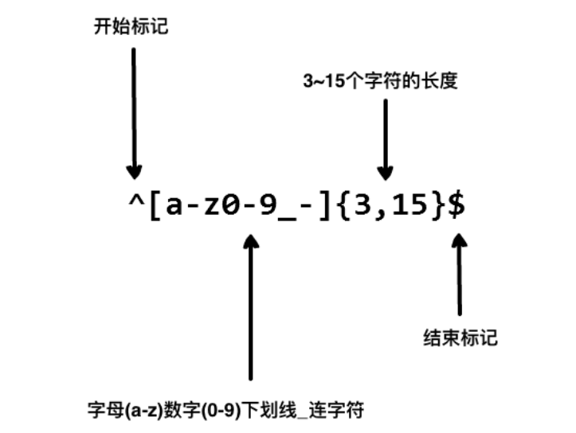

# HTML

[toc]

B/S

B:Browser浏览器

S:Server服务器

## 基础语法

```html
<!--
    HTML
        超文本标记语言
        基础语法
             标签
                  单标签
                       无属性<标签名/>
                       有属性<标签名属性名="属性值” />
                  双标签
                       无属性<标签名></标签名>
                       有属性<标签名属性名-"属性值"></标签名>
              整体结构
                   <html></html>表示当前是一个网页
                   <head></head>头部信息
                   <body</body>身体部分
              doctype
                    <doctype html> htm15版本声明,需要写在文档的第一行
-->
<!--网页区域-->
<html>
    <doctype html>
    <!--头部区域-->
    <head>
        <meta charset="utf-8" />
        <title>基础语法</title><!-页面的标题,也是收藏网页时默认的名字->
        <link rel="stylesheet" href="引入的css文件的路径" />
        <script src="引入的js文件的路径" type="text/javascript" charset="utf-8"</script
    </head>
    <!--内容区域:浏览器可见内容-->
    <body>
        hello
    </body>
</html>
```

常用标签

上级目录

…/表示源文件所在目录的上一级目录，…/…/表示源文件所在目录的上上级目录，以此类推。

所有标签都有的属性

| 属性  | 作用                             |
| ----- | -------------------------------- |
| id    | 用来标识元素的唯一性             |
| name  | 提交数据时的参数名               |
| style | 设置元素的行内样式（具体的样式） |
| class | 设置元素的样式名                 |

标签之间的属性要以空格隔开

### body标签属性

| 属性    | 作用     | 值                                |
| ------- | -------- | --------------------------------- |
| bgcolor | 背景颜色 | 1.颜色名 <br>2.RGB <br>3.16进制   |
| text    | 字体颜色 | 1.颜色名 <br/>2.RGB <br/>3.16进制 |

### 标题标签

```html
<h1></h1>~~~~<h6></h6>
<!--不建议写多个h1-->
```

### 水平线标签

```html
<hr>
默认居中
```

| 属性  | 作用     | 值                                    |
| ----- | -------- | ------------------------------------- |
| width | 定义宽度 | 1.百分百<br>2.px                      |
| align | 对齐方式 | 1.left左<br>2.right右<br>3.center居中 |
| size  | 线的粗细 |                                       |

段落标签

```html
<p>段落会自动换行
```

| 属性  | 作用     | 值                                                         |
| ----- | -------- | ---------------------------------------------------------- |
| align | 对齐方式 | 1.left左<br>2.right右<br>3.center居中<br>4.justify两端对齐 |

### 换行标签

```html
<br>
```

### 列表

#### 有序列表

```
<ol>
    <li></li>
    <li></li>
</ol>
```

| 属性 | 作用         | 值                                                           |
| ---- | ------------ | ------------------------------------------------------------ |
| type | 定义列表样式 | 1.1数字序号（默认）<br>2.a小写字母<br>3.A大写字母<br>4.i小写罗马字符<br>5.I大写罗马字符 |

#### 无序列表

```html
<ul>
    <li></li>
    <li></li>
</ul>
```

| 属性 | 作用         | 值                                                          |
| ---- | ------------ | ----------------------------------------------------------- |
| type | 定义列表样式 | 1.square 实心方块<br>2.circle空心圆<br>3.dise实心圆（默认） |

### 块级标签

```html
<div></div>
```

| 属性  | 作用     | 值                                                         |
| ----- | -------- | ---------------------------------------------------------- |
| align | 对齐方式 | 1.left左<br>2.right右<br>3.center居中<br>4.justify两端对齐 |

```html
<spean></spean><!--块、行类元素、标签不会自动换行-->
```

### 格式化标签

```html
<font></font>
```

| 属性  | 作用     | 值                                |
| ----- | -------- | --------------------------------- |
| color | 字体颜色 | 1.颜色名 <br/>2.RGB <br/>3.16进制 |
| face  | 更改字体 | 字体                              |
| size  | 字体大小 | 1-7                               |

```html
<pre></pre><!--保留文本中的换行和空格字符-->
```

```html
加粗<b></b>或者<strong></strong>
斜体<i></i>
下划线<u></u>
中划线<del></del>
下标<sub></sub>
上标<sup></sup>
```

### a标签

```html
超链接<a></a>
```

| 属性   | 作用                                                         | 值                                                           |
| ------ | ------------------------------------------------------------ | ------------------------------------------------------------ |
| herf   | 可能是其他或当前页面<br/>1.可以被点击<br/>2.点击后跳转到指定URL<br/>保留1去掉2,：`href="javascript:void(0)"` | url                                                          |
| target | 规定在何处打开链接文档。<br/>blank:开启新页面显示页面; <br/>self:当前页面显示跳转到页面,默认值。<br/>top:用于有frameset布局的页面,想要覆盖整个页面显示。<br/>Framename:这里framename与上边的值不同,具体以为frame起了什么样的名字为准,该值指示要连接的页面跳转后将在相应名称的框架中显示。 | blank <br/>parent<br/>self<br/>top<br/>Framename作为锚点的a标签的name值 |

锚点

```html
<!--回到当前页面的顶端herf的值等于#-->
<a herf="#"></a>
<!--herf属性指向a标签的name属性值-->
<a name="top"></a>
<a herf="#top"></a>
<!--herf属性指向其他标签的id属性值-->
<p id="top"></p>
<a herf="#top"></a>
```

### 图片标签

```html

```

| 属性   | 作用                                             | 值                                                 |
| ------ | ------------------------------------------------ | -------------------------------------------------- |
| alt    | 规定图像的替代文本，一般在图片无法显示占位得文字 | text                                               |
| src    | 规定显示图像的url                                | url                                                |
| align  | 规定如何根据周围的文本来排列图像                 | 1.top<br>2.bottom<br>3.middle<br>4.left<br>5.right |
| border | 定义图像周围的边框                               | px                                                 |
| height | 定义图像的高度                                   | px,%                                               |
| width  | 定义图像的宽度                                   | px,%                                               |
| title  | 当鼠标咋子图片上时显示的文字                     | 文本                                               |

### 表格

```html
<table style="border-collapse:collapse;">
    <!--border-collapse:collapse;css样式合并边框-->
    <tr>
        <!--标签定义表格的行,tr元素包含一个或多个th或td元素-->
        <th><!--定义表格内的表头单元格。--></th>
    </tr>
    <tr>
        <td><!--标签定义HTML表格中的标准单元格。--></td>
    </tr>
</table>
```

| 属性   | 作用             | 值                |
| ------ | ---------------- | ----------------- |
| algin  | 表格对齐方式     | right,center,left |
| border | 规定表格边框宽度 | px                |
| width  | 规定表格的宽度   | px,%              |

`<tr>`属性

| 属性    | 作用                 | 值                |
| ------- | -------------------- | ----------------- |
| align   | 定义表格横向对齐方式 | right,left,center |
| bgcolor | 定义背景颜色         | rgb,#,colorname   |
| valgin  | 定义纵向对齐方式     | top,middil,bottom |
| colspan | 横向合并单元格       | 数字              |
| rowspan | 纵向合并单元格       | 数字              |

### 表单

```html
<from></from>
```

| 属性   | 作用                             | 值                                     |
| ------ | -------------------------------- | -------------------------------------- |
| action | 规定提交表单时向何处发送表单数据 | URL                                    |
| method | 规定表单发送form-data的http方法  | get,post                               |
| name   | 规定表单的名称                   | from_name                              |
| target | 规定在何处打开action URL         | \_biank,\_self\_parent,_\top framename |

**method:表单提交方式：get,post**

* get:默认,主动的获取方式,数据放在url上,数据的容量有限,安全性差,有缓存git比post快两倍
* post:数据放在请求实体中,数据量理论上没有限制,相对安全,没有缓存 

### input元素

```html
<input>
```

| 属性      | 作用                                                         | 值                                                           |
| --------- | ------------------------------------------------------------ | ------------------------------------------------------------ |
| disabled  | 禁用提交                                                     | disabled                                                     |
| alt       | 定义图像输入的替代文本                                       | text                                                         |
| checked   | 规定input元素首次加载时应当被选中                            | checked                                                      |
| disabled  | 当input元素加载时禁用此元素                                  | disabled                                                     |
| readonly  | 规定输入字段为只读                                           | readonly                                                     |
| maxlength | 规定输入字段中的字符的最大长度                               | number                                                       |
| value     | 规定input元素的值                                            | value                                                        |
| type      | 规定input元素的类型，按钮复选框文件隐藏<br/>域或图像形按钮密码单选框重置按钮提交按钮文本 | 1.button普通按钮<br>2.checkbox<br/>3.file<br/>4.hidden隐藏域<br/>5.image<br/>6.password<br/>7.radio<br/>8.text<br/>9.submit提交按钮<br/>10.reset重置按钮<br/>11.date日期框 |

* 单选框需要使用name属性设置为一组
* 如果上传文件的表单，则表单需要设置一个属性值enctype="nultipart/form-data",提交方式为post请求
* 没有name属性无法提交数据

### textarea

```html
<textarea></textarea>
多行文本输入控件
```

| 属性 | 作用     | 值   |
| ---- | -------- | ---- |
| cols | 可见宽度 | px   |
| rows | 可见行数 | px   |

### lable

```html
<lable for="uname"><input type="text" name="uname" id="uname"/></lable>
```

* 当for属性与元素的id属性值一致时，点击lable会自动元素聚焦
* 是for元素与id元素连接

### 按钮标签button

| 属性     | 作用             | 值                                                  |
| -------- | ---------------- | --------------------------------------------------- |
| disabled | 禁用该按钮       | disabled                                            |
| type     | 规定按钮的类型   | button普通按钮<br/>submit提交按钮<br/>reset重置按钮 |
| value    | 规定按钮的初始值 | text                                                |
| name     | 规定按钮的名称   | button_name                                         |

### select下拉列表

```html
<select name="color">
    <option value="red"></option>
</select>
```

| 属性《select》 | 作用     | 值                         |
| -------------- | -------- | -------------------------- |
| disabled       | disabled | 禁用该下拉框               |
| multiple       | multiple | 规定可选择多个选项         |
| name           | name     | 规定下拉列表的名称         |
| size           | namber   | 规定下拉列表可见选项的数目 |

| 属性《option》 | 作用         | 值                                             |
| -------------- | ------------ | ---------------------------------------------- |
| disabled       | disabled     | 禁用该下拉框                                   |
| selected       | selected默认 | 规定选项（在首次显示在列表中时）表现为选中状态 |
| value          | text         | 定义送往服务器的选项值                         |

### 常用字符实体

| 显示结果 | 描述   | 实体名称 | 实体编号 |
| -------- | ------ | -------- | -------- |
|          | 空格   | \&nbsp;  | \&#160   |
| <        | 小于号 | \&lt;    | \&#60    |
| >        | 大于号 | \&gt;    | \&#38    |
| ©        | 版权   | \&copy   | \&#169   |

### 标签分类

* 块状元素
* 行内元素
* 行内块状元素

# 正则表达式

构造正则表达式的方法和创建数学表达式的方法一样。也就是用多种元字符与运算符可以将小的表达式结合在一起来创建更大的表达式。正则表达式的组件可以是单个的字符、字符集合、字符范围、字符间的选择或者所有这些组件的任意组合。

- **^** 为匹配输入字符串的开始位置。
- **[0-9]+**匹配多个数字， **[0-9]** 匹配单个数字，**+** 匹配一个或者多个。
- `abc$`匹配字母 `abc` 并以 `abc`结尾，**$** 为匹配输入字符串的结束位置。
- 只允许用户名包含字符、数字、下划线和连接字符 `-`
- {最少多少个字符,最多多少个字符}$结束符
- **+** 号代表前面的字符必须至少出现一次（1次或多次）
- ***** 号代表前面的字符可以不出现，也可以出现一次或者多次（0次、或1次、或多次）。
- **?** 问号代表前面的字符最多只可以出现一次（0次或1次）。



## `java正侧表达式`

正则表达式定义了字符串的模式。

正则表达式可以用来搜索、编辑或处理文本。

正则表达式并不仅限于某一种语言，但是在每种语言中有细微的差别。

在其他语言中，**\\** 表示：**我想要在正则表达式中插入一个普通的（字面上的）反斜杠，请不要给它任何特殊的意义。**

在 Java 中，**\\** 表示：**我要插入一个正则表达式的反斜线，所以其后的字符具有特殊的意义。**

所以，在其他的语言中（如 Perl），一个反斜杠 **\** 就足以具有转义的作用，而在 Java 中正则表达式中则需要有两个反斜杠才能被解析为其他语言中的转义作用。也可以简单的理解在 Java 的正则表达式中，两个 **\\** 代表其他语言中的一个 **\**，这也就是为什么表示一位数字的正则表达式是 **\\d**，而表示一个普通的反斜杠是 **\\**。

| 正侧表达式    | 描述                                                         |
| ------------- | ------------------------------------------------------------ |
| `.`           | 它匹配任何一个字符                                           |
| ` \s+`        | 可以匹配多个空格                                             |
| `^`           | 定义了以什么开始                                             |
| `\d+`         | 匹配一个或多个数字                                           |
| `?`           | 放在括号后面，设置括号内的选项是可选的                       |
| `\.`          | 匹配 "."                                                     |
| \             | 将下一字符标记为特殊字符、文本、反向引用或八进制转义符。例如， **n**匹配字符 **n**。**\n** 匹配换行符。序列 **\\\\** 匹配 **\\** ，**\\(** 匹配 **(**。 |
| ^             | 匹配输入字符串开始的位置。如果设置了 `RegExp` 对象的 `Multiline` 属性，^ 还会与"\n"或"\r"之后的位置匹配。 |
| $             | 匹配输入字符串结尾的位置。如果设置了 ``RegExp`` 对象的 `Multiline` 属性，$ 还会与"\n"或"\r"之前的位置匹配。 |
| *             | 零次或多次匹配前面的字符或子表达式。例如，zo* 匹配"z"和"zoo"。* 等效于 {0,}。 |
| +             | 一次或多次匹配前面的字符或子表达式。例如，"zo+"与"zo"和"zoo"匹配，但与"z"不匹配。+ 等效于 {1,}。 |
| ?             | 零次或一次匹配前面的字符或子表达式。例如，"do(es)?"匹配"do"或"does"中的"do"。? 等效于 {0,1}。 |
| {*n*}         | *n* 是非负整数。正好匹配 *n* 次。例如，"o{2}"与"Bob"中的"o"不匹配，但与"food"中的两个"o"匹配。 |
| {*n*,}        | *n* 是非负整数。至少匹配 *n* 次。例如，"o{2,}"不匹配"Bob"中的"o"，而匹配"`foooood`"中的所有 o。"o{1,}"等效于"o+"。"o{0,}"等效于"o*"。 |
| {*n*,*m*}     | *m* 和 *n* 是非负整数，其中 *n* <= *m*。匹配至少 *n* 次，至多 *m* 次。例如，"o{1,3}"匹配"`fooooood`"中的头三个 o。'o{0,1}' 等效于 'o?'。注意：您不能将空格插入逗号和数字之间。 |
| ?             | 当此字符紧随任何其他限定符（*、+、?、{*n*}、{*n*,}、{*n*,*m*}）之后时，匹配模式是"非贪心的"。"非贪心的"模式匹配搜索到的、尽可能短的字符串，而默认的"贪心的"模式匹配搜索到的、尽可能长的字符串。例如，在字符串"`oooo`"中，"o+?"只匹配单个"o"，而"o+"匹配所有"o"。 |
| .             | 匹配除"\r\n"之外的任何单个字符。若要匹配包括"\r\n"在内的任意字符，请使用诸如"[\s\S]"之类的模式。 |
| (*pattern*)   | 匹配 *pattern* 并捕获该匹配的子表达式。可以使用 **$0…$9** 属性从结果"匹配"集合中检索捕获的匹配。若要匹配括号字符 ( )，请使用"\("或者"\)"。 |
| (?:*pattern*) | 匹配 *pattern* 但不捕获该匹配的子表达式，即它是一个非捕获匹配，不存储供以后使用的匹配。这对于用"or"字符 (\|) 组合模式部件的情况很有用。例如，'`industr(?:y|ies)` 是比 'industry\|industries' 更经济的表达式。 |
| (?=*pattern*) | 执行正向预测先行搜索的子表达式，该表达式匹配处于匹配 *pattern* 的字符串的起始点的字符串。它是一个非捕获匹配，即不能捕获供以后使用的匹配。例如，'Windows (?=95\|98\|NT\|2000)' 匹配"Windows 2000"中的"Windows"，但不匹配"Windows 3.1"中的"Windows"。预测先行不占用字符，即发生匹配后，下一匹配的搜索紧随上一匹配之后，而不是在组成预测先行的字符后。 |
| (?!*pattern*) | 执行反向预测先行搜索的子表达式，该表达式匹配不处于匹配 *pattern* 的字符串的起始点的搜索字符串。它是一个非捕获匹配，即不能捕获供以后使用的匹配。例如，'Windows (?!95\|98\|NT\|2000)' 匹配"Windows 3.1"中的 "Windows"，但不匹配"Windows 2000"中的"Windows"。预测先行不占用字符，即发生匹配后，下一匹配的搜索紧随上一匹配之后，而不是在组成预测先行的字符后。 |
| *x*\|*y*      | 匹配 *x* 或 *y*。例如，'z\|food' 匹配"z"或"food"。'`(z|f)ood'` 匹配"`zood`"或"food"。 |
| [*xyz*]       | 字符集。匹配包含的任一字符。例如，"`[abc]`"匹配"plain"中的"a"。 |
| [^*xyz*]      | 反向字符集。匹配未包含的任何字符。例如，"[^abc]"匹配"plain"中"p"，"l"，"i"，"n"。 |
| [*a-z*]       | 字符范围。匹配指定范围内的任何字符。例如，"[a-z]"匹配"a"到"z"范围内的任何小写字母。 |
| [^*a-z*]      | 反向范围字符。匹配不在指定的范围内的任何字符。例如，"[^a-z]"匹配任何不在"a"到"z"范围内的任何字符。 |
| \b            | 匹配一个字边界，即字与空格间的位置。例如，"er\b"匹配"never"中的"er"，但不匹配"verb"中的"er"。 |
| \B            | 非字边界匹配。"er\B"匹配"verb"中的"er"，但不匹配"never"中的"er"。 |
| \c*x*         | 匹配 *x* 指示的控制字符。例如，\cM 匹配 Control-M 或回车符。*x* 的值必须在 A-Z 或 a-z 之间。如果不是这样，则假定 c 就是"c"字符本身。 |
| \d            | 数字字符匹配。等效于 [0-9]。                                 |
| \D            | 非数字字符匹配。等效于 [^0-9]。                              |
| \f            | 换页符匹配。等效于 \x0c 和 \cL。                             |
| \n            | 换行符匹配。等效于 \x0a 和 \cJ。                             |
| \r            | 匹配一个回车符。等效于 \x0d 和 \cM。                         |
| \s            | 匹配任何空白字符，包括空格、制表符、换页符等。与 [ \f\n\r\t\v] 等效。 |
| \S            | 匹配任何非空白字符。与 [^ \f\n\r\t\v] 等效。                 |
| \t            | 制表符匹配。与 \x09 和 \cI 等效。                            |
| \v            | 垂直制表符匹配。与 \x0b 和 \cK 等效。                        |
| \w            | 匹配任何字类字符，包括下划线。与"[A-Za-z0-9_]"等效。         |
| \W            | 与任何非单词字符匹配。与"[^A-Za-z0-9_]"等效。                |
| \x*n*         | 匹配 *n*，此处的 *n* 是一个十六进制转义码。十六进制转义码必须正好是两位数长。例如，"\x41"匹配"A"。"\x041"与"\x04"&"1"等效。允许在正则表达式中使用 ASCII 代码。 |
| \*num*        | 匹配 *num*，此处的 *num* 是一个正整数。到捕获匹配的反向引用。例如，"(.)\1"匹配两个连续的相同字符。 |
| \*n*          | 标识一个八进制转义码或反向引用。如果 \*n* 前面至少有 *n* 个捕获子表达式，那么 *n* 是反向引用。否则，如果 *n* 是八进制数 (0-7)，那么 *n* 是八进制转义码。 |
| \*nm*         | 标识一个八进制转义码或反向引用。如果 \*nm* 前面至少有 *nm* 个捕获子表达式，那么 *nm* 是反向引用。如果 \*nm* 前面至少有 *n* 个捕获，则 *n* 是反向引用，后面跟有字符 *m*。如果两种前面的情况都不存在，则 \*nm* 匹配八进制值 *nm*，其中 *n* 和 *m* 是八进制数字 (0-7)。 |
| \nml          | 当 *n* 是八进制数 (0-3)，*m* 和 *l* 是八进制数 (0-7) 时，匹配八进制转义码 *nml*。 |
| \u*n*         | 匹配 *n*，其中 *n* 是以四位十六进制数表示的 Unicode 字符。例如，\u00A9 匹配版权符号 (©)。 |

