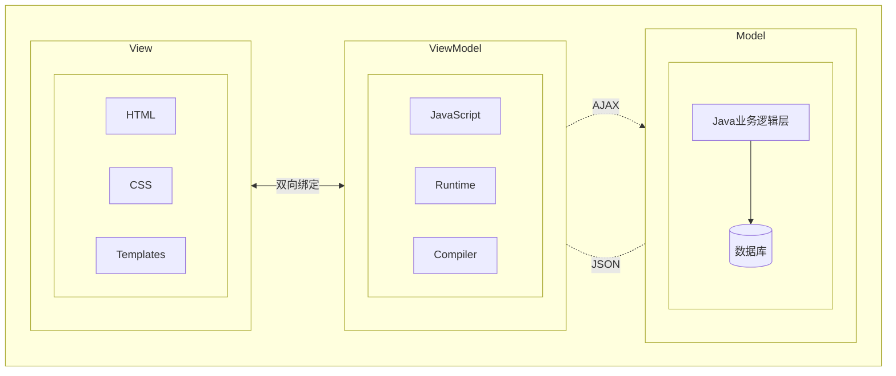

# VUE

[toc]

> ## 一、概述

Vue (读音/vju/,类似于view)是一套用于构建用户界面的渐进式框架,发布于2014年2月。与其它大型框架不同的是，Vue被设计为可以自底向上逐层应用。Vue的核心库只关注视图层，不仅易于上手，还便于与第三方库(如: vue-router:跳转， vue-resource:通信， vuex:管理)或既有项目整合。

* 官网: https://cn.vuejs.org/v2/guide/

> ## 二、前端三要素

* HTML（结构） 超文本标记语言，决定网页的结构和内容
* CSS（表现） 层叠样式表，决定网页的表现样式
* JavaScript（行为）  是一种弱类型的脚本语言，其原码不需要经过编译，由浏览器解释运行，用于控制网页的行为

1. **UI框架**
   1. Ant-Design:阿里巴巴出品,基于React的U1框架
   2. ElementUl, iview,ice:饿了么出品,基于Vue的Ul框架
   3. Bootstrap: Twitter推出的一个用于前端开发的开源工具包
   4. AmazeUl: 又叫 “妹子 UI”, 一款 HTML5 跨屏前端框架
2. **构建工具**
   1. Babel: JS 编译工具,主要用于浏览器不支持的ES 新特性,比如用于编译
   2. TypeScriptWebPack:模块打包器，主要作用是打包、压缩、合并及按序加载

> ## 三、MVVM

**MVVM组成部分**

* Model:模型层，在这里表示 JavaScript 对象
* View:视图层,在这里表示DOM (HTML操作的元素)
* ViewModel:连接视图和数据的中间件, Vue.js 就是 MVVM 中的ViewModel 层的实现者

在 MVVM架构中，是不允许 数据 和 视图 直接通信的，只能通过ViewModel 来通信，而ViewModel 就是定义了一个 Observer 观察者

* ViewModel 能够观察到数据的变化,并对视图对应的内容进行更新
* ViewModel能够监听到视图的变化，并能够通知数据发生改变

至此,我们就明白了, Vue.js就是一个MVVM的实现者，他的核心就是实现了DOM监听与数据绑定



> 

## 下载地址

* 开发版本
  * 包含完整的警告和调试模式：`https://vuejs.org/js/vue.js`
  * 删除了警告，30.96kb min+gzip: `https://vuejs.org/js/vue.min.js`
* CDN
  * `<script src="https://cdnjsdelivr.net/npm/vue@2.5.21/dist/vue.js"></script>`
  * `<script src="https://cdnjsdelivr.net/npm/vue@2.5.21/dist/vue.min.js"></script>`

## Vue环境搭建

* vue安装方式一个有三种：

  1. 脚手架安装

  2. 通过 CDN 使用 Vue:你可以借助 script 标签直接通过 CDN 来使用 Vue：

     ```vue
     <script src="https://unpkg.com/vue@3/dist/vue.global.js"></script>
     ```

     * 解决控制台报错：`You are running a development build of Vue.Make sure to use the production build (*.prod.js) when deploying for production.`
     * 添加``

  3. 使用 ES 模块构建版本

     ```vue
     <div id="app">{{ message }}</div>
     
     <script type="module">
       import { createApp } from 'https://unpkg.com/vue@3/dist/vue.esm-browser.js'
       
       createApp({
         data() {
           return {
             message: 'Hello Vue!'
           }
         }
       }).mount('#app')
     </script>
     ```

  4. 启用 Import maps

     ```vue
     import { createApp } from 'vue'
     
     <script type="importmap">
       {
         "imports": {
           "vue": "https://unpkg.com/vue@3/dist/vue.esm-browser.js"
         }
       }
     </script>
     
     <div id="app">{{ message }}</div>
     
     <script type="module">
       import { createApp } from 'vue'
     
       createApp({
         data() {
           return {
             message: 'Hello Vue!'
           }
         }
       }).mount('#app')
     </script>
     
     ```

     

1. 安装node.js

2. 打开命令行窗口（cmd），执行（`npm -v`）he(`node -v`)查看npm版本号、和node.js版本号

3. 安装编辑器

4. 安装vue

   1. 使用npm进行安装
   2. 使用淘宝镜像`npm install -g cnpm --registry=https://registry.npm.taobao.org`
   3. 安装vue脚手架`npm install -g @vue/cli`

5. 创建vue项目

   1. 新建文件夹：项目文件夹名字

   2. 在VScode中cd到该目录下

   3. 输入`vue create 文件夹名字`

   4. 选择配置信息

      1. 选择`Manually select features`

      2. 按空格选择要配置的资源

      3. 选择版本vue2

      4. 路径模式选择n

      5. 选择css预处理语言选择Less
      
      6. 如何存放配置选择In package.json
      
      7. 是否保存本地配置n
      
         
      
      8. 搭建完毕
      
      9. cd到项目文件夹下CD：回到根目录`cd/` 回到上层目录`cd..` 到下层目录`cd 文件夹名` 进入指定盘符`盘符：`,`cd /盘符`
      
      10. 运行 `npm run serve`

### 项目文件结构

```turtle
├──node_modules
├──public
│   ├──favicon.ico： 页签图标
│   └──index.html：主页面
├──src
│   ├──assets：存放静态资源
│   │   └──logo.png
│   ├──component:存放组件
│   │   └──HelloWorld.vue
│   ├──App.vue：汇总所有组件
│   ├──main.js：入口文件
├──.gitignore: git版本管制忽略的配置
├──babel.config.js: babel的配置文件
├──package.json:应用包配置文件
├──README.md:应用描述文件
└──package-lock.json：包版本控制文件
```

- `.eslintrc.js`: 这个是 eslint 的配置文件，可以通过它来管理你的校验规则。
- `babel.config.js`: 这个是 Babel 的配置文件，可以在开发中使用 JavaScript 的新特性，并且将其转换为在生产环境中可以跨浏览器运行的旧语法代码。你也可以在这个里配置额外的 babel 插件。
- `.browserslistrc`: 这个是 Browserslist 的配置文件，可以通过它来控制需要对哪些浏览器进行支持和优化。
- `public`: 这个目录包含一些在 Webpack 编译过程中没有加工处理过的文件（有一个例外：index.html 会有一些处理）。
  
  * `favicon.ico`: 这个是项目的图标，当前就是一个 Vue 的 logo。
  * `index.html`: 这是应用的模板文件，Vue 应用会通过这个 HTML 页面来运行，也可以通过 lodash 这种模板语法在这个文件里插值。
  * **备注：** 这个不是负责管理页面最终展示的模板，而是管理 Vue 应用之外的静态 HTML 文件，一般只有在用到一些高级功能的时候才会修改这个文件。
- src这个是 Vue 应用的核心代码目录
  * `main.js`：这是应用的入口文件。目前它会初始化 Vue 应用并且制定将应用挂载到 `index.html` 文件中的哪个 HTML 元素上。通常还会做一些注册全局组件或者添额外的 Vue 库的操作。
  - `App.vue`：这是 Vue 应用的根节点组件，往下看可以了解更多关注 Vue 组件的信息。
  - `components`：这是用来存放自定义组件的目录，目前里面会有一个示例组件。
  - `assets`：这个目录用来存放像 CSS、图片这种静态资源，但是因为它们属于代码目录下，所以可以用 webpack 来操作和处理。意思就是你可以使用一些预处理比如 Sass/SCSS 或者 Stylus。

### Vue工程引入element UI

1. 进入项目目录终端输入`npm i element-ui -S`

2. 在main.js中完整引入

   ```vue
   import Vue from 'vue'
   import App from './App.vue'
   import router from './router'
   import store from './store'
   
   Vue.config.productionTip = false
   
   new Vue({
     router,
     store,
     render: h => h(App)
   }).$mount('#app')
   ```

3. 引入element-ui

4. 增加了三个

   ```vue
   import Elenentui from 'element-ui'; //引入elementui
   import 'element-ui/lib/theme-chalk/index.css'; //引入elementui
   Vue.use(ElementUI); //引入elementui
   ```

5. 去elementui官网复制代码测试

   ```
   https://element.eleme.cn/
   ```

### Vue引入Axios

## vue基础

### 第一个程序

* App.vue

  * 打开 App.vue 文件，可以看到由 <template>、<script> 和 <style> 三部分组成，分别包含了组件的模板、脚本和样式相关的内容。所有的单文件组件都是这种类似的基本结构。
  * `<template>` 包含了所有的标记结构和组件的展示逻辑。template 可以包含任何合法的 HTML，以及一些我们接下来要讲的 Vue 特定的语法。
  *  通过设置 `<template>` 标签的 `lang` 属性，例如可以通过设置 `<template lang="pug">` 就可以在使用 Pug 模板来替代标准 HTML。
  * `<script>` 包含组件中所有的非显示逻辑，最重要的是, <script> 标签需要默认导出一个 JS 对象。该对象是您在本地注册组件、定义属性、处理本地状态、定义方法等的地方。在构建阶段这个包含 template 模板的对象会被处理和转换成为一个有 render() 函数的 Vue 组件

* 代码写在components下面

  * template：里面写html
  * script:写业务逻辑

* 文本插值

  * 最基本的数据绑定形式是文本插值，它使用的是“Mustache”语法 (即双大括号)：`<span>Message: {{ msg }}</span>`

    ```vue
    <template>
      <div class="hello">
        <h3>学习:vue</h3>
        <h4>{{msg}}</h4>
      </div>
    </template>
    
    <script>
    export default {
      name: 'HelloWorld',
      data(){
        return{
          msg:"测试"
        }
      }
    }
    </script>
    ```

  * 原始HTML

    * 双大括号会将数据解释为普通文本,而非 HTML 代码。为了输出真正的 HTML,你需要使用 v-html指令

    * `v-html`:双大括号会将数据解释为纯文本，而不是 HTML。若想插入 HTML，你需要使用 v-html 指令

      ```vue
      <div v-bind:id="dynamicId"></div>
      简写：<div :id="dynamicId"></div>
      ```

  * Attribute 属性:

    * `v-bind`可以操作HTMl标签中的属性

      ```vue
      <template>
        <div class="hello">
          <h3>学习:vue</h3>
          <div>{{msg}}</div>
          <div v-html="rawHtml"></div>
          <div v-bind:id="rawId" :class="rawClass"></div>
        </div>
      </template>
      
      <script>
      export default {
        name: 'HelloWorld',
        data(){
          return{
            msg:"学习测试",
            rawHtml:"<a href='baidu.com'>百度</a>",
            rawClass:"1002",
            rawId:"1001"
      
          }
        }
      }
      </script>
      ```

    * 使用 JavaScript 表达式

    * 但是 Vue 实际上在所有的数据绑定中都支持完整的 JavaScript 表达式：

    * 这些表达式会在当前活动实例的数据作用域下作为JavaScript 被解析。有个限制就是,每个绑定都只能包含单个表达式。

      ```vue
      {{ number + 1 }}
      {{ ok ? 'YES' : 'NO' }}
      {{ message.split('').reverse().join('') }}
      <div :id="`list-${id}`"></div>
      ```

* 条件渲染

* 列表渲染

1. v-bind:单项数据绑定
2. v-model:双向数据绑定
   * v-model只能应用在表单类元素（输入类元素）上

## 数据代理

1. Object.defineproperty方法

   * 当有人读取person的age属性时，get函数（getter）就会被调用，且返回值就是age的值

   * 当有人修改person(的age属性时，set函数(setter)就会被调用，且会收到修改的具体值

     ```javascript
     <script>
         let number=18
         let person = {
             name:"jke",
             sex:"男"，
         }
         Object.defineproperty(person,'age'{
             get(){
             return number
         }
             set(value){
             number = value
             }
         })
         </script>
     ```

2. 数据代理：通过一个对象代理对另一个对象中属性的操作（读/写）

3. 事件处理：

   1. v-on:click:简写@click

   2. 事件绑定：methods

   3. 事件的基本使用：1.使用v-on：xxx 或 @xxx 绑定事件，其中xxx是事件名；2.事件的回调需要配置在methods对象中，最终会在vm上；3.methods中配置的函数,不要用箭头函数！否则this就不是vm了;4.methods中配置的函数，都是被Vue所管理的函数，this的指向是vm 或 组件实例对象；5.@click="demo" 和 @click="demo($event）" 效果一致，但后者可以传参；

      ```vue
      <body>
      <button @click="anniu">按钮</button>
      </body>
      <script>
      new Vue({
          el:'root'
          methods:{
              anniu(){
                  alert('同学你好')
              }
          }
      })
      </script>
      ```

   4. 参数传递:anniu()后面小括号就是传递的参数，在下方anniu处顺序一致接收

      ```vue
      <body>
      <button @click="anniu(27)">按钮</button>
      </body>
      <script>
      new Vue({
          el:'root'
          methods:{
              anniu(number){
                  alert('同学你好')
              }
          }
      })
      </script>
      ```

4. 时间修饰符

   * prevent：阻止默认事件

   * stop:阻止事件冒泡

   * once：事件只触发一次

   * capture：使用事件的捕获模式

   * self：只有event.target是当前操作的元素是才触发事件；

   * passive：事件的默认行为立即执行，无需等待事件回调执行完毕；

     ```vue
     <！-- 准备好一个容器-->
         <div id="root">
             <h2>欢迎来到{{name}}学习</h2>
             <！-- 阻止默认事件（常用） -->
                 <a href="http://www.atguigu.com" @click.prevent="showInfo">点我提示信息</a>
             <！-- 阻止事件冒泡（常用） -->
                 <div class="demo1" @click="showInfo">
                     <button @click.stop="showInfo">点我提示信息</button>
                 </div>
             <！-- 事件只触发一次（常用）
                  <button @click.once="showInfo">点我提示信息</button>
             <！-- 使用事件的捕获模式 -->
                 <div class="box1" @click.capture="showMsg(1)">
                     div1
                     <div class="box2" @click="showMsg(2)">
                         div2
                     </div>
                 </div>
                 <！-- 只有event.target是当前操作的元素时才触发事件；-->
                     <div class="demo1" @click.self="showInfo">
                         <button @click="showInfo">点我提示信息</button>
                     </div>
                 <！-- 事件的默认行为立即执行，无需等待事件回调执行完毕；-->
                     <ul @wheel.passive="demo" class="list">
                         <li>1</li>
                         <li>2</li>
                         <li>3</li>
                         <li>4</li>
                     </ul>
                     </div>
     ```

5. 键盘事件

   * keydown:按下按键不需要抬起触发事件
   * keyup：按下按键抬后才触发事件
   * Vue中常用的按键别名：
     * 回车 => enter
     * 删除 => delete (捕获“删除”和“退格”)
     * 退出=> esc
     * 空格 => space
     * 换行=> tab
     * 上 => up
     * 下 => down
     * 左 => left
     * 右 => right
   * Vue未提供别名的按键，可以使用按键原始的key值去绑定，但注意要转为kebab-case（短横线命名）
   * 系统修饰键（用法特殊）：ctrl、alt、shift、meta
     * 配合keyup使用：按下修饰键的同时，再按下其他键，随后释放其他键，事件才被触发。
     * 配合keydown使用：正常触发事件。
   * 也可以使用keyCode去指定具体的按键（不推荐）
   * Vue.config.keyCodes.自定义键名 = 键码，可以去定制按键别名

5. 计算属性：computed

   * 定义：要用的属性不存在，要通过已有属性计算得来。
   
   * 原理：底层借助了Objcet.defineproperty方法提供的getter和setter.
   
   * get函数什么时候执行？
   
     * 初次读取时会执行一次。
     * 当依赖的数据发生改变时会被再次调用。
   
   * 优势：与methods实现相比，内部有缓存机制（复用)，效率更高，调试方便。
   
   * 备注：
   
     * 计算属性最终会出现在vm上，直接读取使用即可。
     * 如果计算属性要被修改,那必须写set函数去响应修改,且set中要引起计算时依赖的数据发生
   
     ```vue
     <body>
         <div id="root">
         姓: <input type="text" v-model="firstName"> <br/><br/>
         名: <input type="text" v-model="lastName"> <br/><br/>
         全名:<span>{{fullName}}</span> <br/><br/>
         </div>
     </body>
     <script>
     new Vue({
         el:'#rppt',
         data:{
             firstName:'张',
             lastName:'三'
         },
         computde:{
             fullName:{
                 get(){
                     return:this.firstName+'-'+this.lastName
                 },
                 set(value){
                     const arr[] = value.split('-')
                     this.firstName = arr[0]
                     this.lastName = arr[1]
                 }
             }
         }
     })
     </script>
     ```
   
   * 简写:只考虑显示，不考虑修改才能用简写
   
     ```vue
     fullName(){
     return:this.firstName+'-'+this.lastName
     }
     ```
   
7. 监视属性:watch

   * 当被监视的属性变化时,阿调函数自动调用，进行相关操作

   * 监视的属性必须存在，才能进行监视！！

   * 监视的两种写法：(1).new Vue时传入watch配置通过um tuntch火询

     ```vue
     <div>
     <h2>今天天气{{hat}}<h2>
     <button @clikl="chg"></button>
     </div>
     <script>
         const vm = nuw Vue({
             el:'root',
             data:{
                 isNum:true,
                 isNam:{
                     a:1,
                     b:2
                 }
             },
             computed:{
                 hat(){
                     return:this.isNum ? '炎热' ：'凉爽'
                 }
             },
             methods:{//事件绑定
                 chg(){
                     this.isNum = !this.isNum
                 }
             },
             watch:{
                 isNum:{
                     deep：true;//监视多级结构中某个属性的变化：深度监视
                     immediate:true,//默认值false,初始化时调用一下handler
                     // handler当isNum发生变化时被调用,newValue新的值，oldValue旧的值
                     handler(newValue,oldValue){}
                 }
                 'isNam.a'{}//监视某级下的某一个数据发生变化
                 //简写：isNum直接当handler
             }
         })
             //在外面监视
             vm.$watch('isHum',{
             immediate:true,//默认值false,初始化时调用一下handler
             // handler当isNum发生变化时被调用,newValue新的值，oldValue旧的值
             handler(newValue,oldValue){}
         })
     </script>
     ```

   * computed和watch之间的区别：

     1. computed能完成的功能 watch都可以完成。

     2. watch能完成的功能，computed不一定能完成，

        例如：watch可以进行异步操作。

   * 两个重要的小原则：

     1. 所被Vue管理的函数，最好写成普通函数，这样this的指向才是vm 或 组件实例对象。
     2. 所有不被Vue所管理的函数（定时器的回调函数、ajax的回调函数等），最好写成箭头函数，这样this的指向才是vm 或 组件实例对象。

8. 绑定class样式

   ```vue
   <div class="" :class="可以是字符串、数组、对象"></div>
   ```

   1. class样式写法：class="xxx"
      * xxx可以是字符串、对象、数组。
      * 字符串写法适用于：类名不确定，要动态获取。对象写法适用于：要绑定多个样式，个数不确定，名字也不确定。
      * 数组写法适用于：要绑定多个样式，个数确定，名字也确定，但不确定用不用。
   2. style样式
      1. :style="{fontSize： xxx}"其中xxx是动态值。
      2. :style="[a,b]"其中a、b是样式对象。

9. 绑定style样式

   ```vue
   <div :style="可以是数组、对象"></div>
   ```

10. 条件渲染

    * v-show:元素的显示与隐藏
    * v-if:v-else-if：显示判断展示
    * template:不影响结构

11. 列表渲染

    * v-for:`v-for="p of persons :key"` `v-for="形参 in 数组名 :key="唯一值"` 
    
      ```vue
      <div id="ass">
          <ul>
              <li v-for="p,index in Shuzhu" :key="index">{{p.id}}-{{p.name}}-{{p.age}}</li>
          </ul>
      </div>
      <script>
      Vue.config.productionTip = false;
      new Vue({
          el:'#ass',
          data:{                  
              Shuzhu:[
                  {id:'001',name:'张三',age:'18'},
                  {id:'002',name:'三五',age:'20'},
                  {id:'003',name:'李五',age:'16'},
                  {id:'004',name:'李丽',age:'21'}
              ]
          },  
      })
      </script>
      ```
    
    * key:给节点一个标识
    
      1. 虚拟DOM中key的作用：
    
         * key是虚拟DOM对象的标识，当数据发生变化时，Vue会根据【新数据】生成【新的虚拟DOM】，随后Vue进行【新虚拟DOM】 与【旧虚拟DOM】的差异比较，比较规则如下：
    
      2. 对比规则：
    
         * 旧虚拟DOM中找到了与新虚拟DOM相同的key:
    
           * 若虚拟DOM中内容没变，直接使用之前的真实DOM！
    
           * 若虚拟DOM中内容变了，则生成新的真实DOM，随后替换掉页面中之前的真实DOM。
    
         * 旧虚拟DOM中未找到与新虚拟DOM相同的key:
    
           * 创建新的真实DOM，随后渲染到到页面。
    
      3. 用index作为key可能会引发的问题：
    
         1. 若对数据进行：逆序添加、逆序删除等破坏顺序操作：
            * 会产生没有必要的真实DOM更新 ==> 界面效果没问题，但效率低。
         2. 如果结构中还包含输入类的DOM：
            * 会产生错误DOM更新 ==>界面有问题。
    
      4. 开发中如何选择key?
    
         1. 最好使用每条数据的唯一标识作为key，比如id、手机号、身份证号、学号等唯一值。
         2. 如果不存在对数据的逆序添加、逆序删除等破坏顺序操作,仅用于渲染列表用于展示,使用index作为key是没有问题的。
    
    * 过滤
    
      ```vue
      <div id="root">
          <input type="text" placeholder="请输入名字" v-model="keyssm">
          <ul>
              <li v-for="(p,index) of filly" :key="p.id">{{p.id}}-{{p.name}}-{{p.age}}</li>
          </ul>
      </div>
      <script>
      Vue.config.productionTip = false;
      new Vue({
          el:'#root',
          data:{
              keyssm:'',                  
              Shuzhu:[
                  {id:'001',name:'张三',age:'18'},
                  {id:'002',name:'三五',age:'20'},
                  {id:'003',name:'李五',age:'16'},
                  {id:'004',name:'李丽',age:'21'}
              ]
           },
          computed:{
              immediate:true,
              filly(){
                  return this.Shuzhu.filter((p)=>{
                      return p.name.indexOf(this.keyssm) !== -1
                  })
              }
          }
      })
      </script>
      ```
    
    * 排序
    
      ```vue
      <div id="root">
              <input type="text" placeholder="请输入名字" v-model="keyssm">
             <button @click="ssy = 1">升序</button>
             <button @click="ssy = 2">降序</button>
             <button @click="ssy = 0">原序</button>
              <ul>
              <li v-for="(p,index) of filly" :key="p.id">{{p.id}}-{{p.name}}-{{p.age}}</li>
             </ul>
          </div>
      <script>
      Vue.config.productionTip = false;
      new Vue({
          el:'#root',
          data:{
              keyssm:'',
              ssy:'',                  
              Shuzhu:[
                  {id:'001',name:'张三',age:'18'},
                  {id:'002',name:'三五',age:'20'},
                  {id:'003',name:'李五',age:'16'},
                  {id:'004',name:'李丽',age:'21'}
              ]
           },
          computed:{
              immediate:true,
              filly(){
                  const arr = this.Shuzhu.filter((p)=>{
                      return p.name.indexOf(this.keyssm) !== -1
                  })
                  if(this.ssy !== 0){
                      arr.sort((a,b)=>{
                          return this.ssy === 1 ? a.age -b.age : b.age - a.age
                      })
                  }
                  return arr
              }
          }
      })
      </script>
      ```
    
12. Vue.set

    * Vue.set(data下面对象位置，对象名字，值)===vm.$set(data下面对象位置，对象名字，值)

    * const vm = new Vue({})

    * 对象不能是Vue实例，或者Vue实例的跟数据对象

    * Vue 能够侦听响应式数组的变更方法，并在它们被调用时触发相关的更新。这些变更方法包括：

      - `push()`
      - `pop()`
      - `shift()`
      - `unshift()`
      - `splice()`
      - `sort()`
      - `reverse()`

    * 替换一个数组

      变更方法，顾名思义，就是会对调用它们的原数组进行变更。相对地，也有一些不可变 (immutable) 方法，例如 `filter()`，`concat()` 和 `slice()`，这些都不会更改原数组，而总是**返回一个新数组**。当遇到的是非变更方法时，我们需要将旧的数组替换为新的：`this.items = this.items.filter((item) => item.message.match(/Foo/))`

13. Vue监视数据的原理：

    1. vue会监视data中所有层次的数据

    2. 如何监测对象中的数据？

       * 通过setter实现监视，且要在new Vue时就传入要监测的数据。

         * 对象中后追加的属性，Vue默认不做响应式处理

         * 如需给后添加的属性做响应式，请使用如下API：

           `Vue.set(target, prepertyName/index, value)` 或`vm.$set(target, propertyName/index, value)`

    3. 如何监测数组中的数据？

       * 通过包裹数组更新元素的方法实现，本质就是做了两件事：
         1. 调用原生对应的方法对数组进行更新。
         2. 重新解析模板，进而更新页面。

    4. 在Vue修改数组中的某个元素一定要用如下方法：

       1. 使用这些API:`push()、pop()、shift()、unshift()、splice()、sort()、reverse()`
       2. `Vue.set()`或 `vm.$set()`

    5. 特别注意：Vue.set（）和 vm.$set（）不能给vm 或 vm的根数据对象 添加属性！！！

14. 收集表单数据

    * 若：`<input type="text"/>`，则v-model收集的是value值，用户输入的就是value值。
    * 若：`<input type="radio"/>`，则v-model收集的是value值，且要给标签配置value值。
    * 若: `<input type="checkbox"/>`
      1. 没有配置input的value属性。那么收集的就是checked（勾选 or 未勾选，是布尔值）
      2. 配置input的value属性：
         1. v-model的初始值是非数组，那么收集的就是checked （勾选 or 未勾选，是布尔值）
         2. v-model的初始值是数组，那么收集的的就是value组成的数组
    * 备注： v-model的三个修饰符：
      * lazy：失去焦点再收集数据
      * number：输入字符串转为有效的数字
      * trim：输入首尾空格过滤

15. 过滤器

    1. 定义：对要显示的数据进行特定格式化后再显示（适用于一些简单逻辑的处理）。
    2. 语法：
       1. 注册过滤器：Vue.filter(name,callback) 或 new Vue{filters:{}}
       2. 使用过滤器： {{ xxx | 过滤器名}} 或 v-bind:属性 = "xxx | 过滤器名"
    3. 备注：
       1. 过滤器也可以接收额外参数、多个过滤器也可以串联2.
       2. 并没有改变原本的数据，是产生新的对应的数据

16. 内置指令：

    * v-bind ：单向绑定解析表达式，可简写为 ：xxx
    *  v-model ：双向数据绑定
    * v-for ：遍历数组/对象/字符串
    * v-on ：绑定事件监听，可简写为@
    * v-if ：条件渲染（动态控制节点是否存存在）
    * v-else ：条件渲染（动态控制节点是否存存在）
    * v-show ：条件渲染（动态控制节点是否展示)
    * v-text : 替换div中的内容（全部）
    * v-html ：
      1. 作用：向指定节点中渲染包含html结构的内容。
      2. 与插值语法的区别：
         * v-html会替换掉节点中所有的内容，{{xx}}则不会。
         * v-html可以识别html结构。
      3. 严重注意：v-html有安全性问题！！！！
         * 在网站上动态渲染任意HTML是非常危险的，容易导致XSS攻击。
         * 一定要在可信的内容上使用v-html，永不要用在用户提交的内容上！
    * v-cloak :
      * Cloak指令（没有值）：
        1. 本质是一个特殊属性，Vue实例创建完毕并接管容器后，会删掉v-cloak属性。
        2. 使用css配合v-cloak可以解决网速慢时页面展示出{{xxx}}的问题。
    * v-once ：
      1. v-once所在节点在初次动态渲染后，就视为静态内容了。
      2. 以后数据的改变不会引起v-once所在结构的更新，可以用于优化性能。
    * v-pre
      1. 跳过其所在节点的编译过程。
      2. 可利用它跳过：没有使用指令语法、没有使用插值语法的节点，会加快编译。

17. 自定义指令

    * 函数式
    * 对象式

18. 生命周期

    1. 又名：生命周期回调函数、生命周期函数、生命周期钩子。
    2. 是什么：Vue在关键时刻帮我们调用的一些特殊名称的函数。
    3. 生命周期函数的名字不可更改，但函数的具体内容是程序员根据需求编写的。
    4. 生命周期函数中的this指向是vm 或 组件实例对象

    * 挂载流程
    * 跟新流程
    * 销毁流程
    * 将要创建 ===>调用beforeCreate函数。
    * 创建完毕 ===>调用created函数。
    * 将要挂载 ===>调用beforeMount函数。
    * （重要）挂载完毕 ===调用mounted函数。－－－－－－－－＞【重要的钩子】
    * 将要更新 ===>调用beforeUpdate函数。
    * 更新完毕 ===>调用updated函数。
    * （重要）将要销毁 ===> 调用beforeDestroy函数。
    * 销毁完毕 ===>调用destroyed函数。－－－－－－－－－－>【重要的钩子】
    * 常用的生命周期钩子：
      1. mounted：发送ajax请求、启动定时器、绑定自定义事件、订阅消息等【初始化操作】。
      2. beforeDestroy：清除定时器、解绑自定义事件、取消订阅消息等 【收尾工作】。
    * 关于销毁Vue实例
      1. 销毁后借助Vue开发者工具看不到任何信息。
      2. 销毁后自定义事件会失效，但原生DOM事件依然有效。
      3. 一般不会再beforeDestroy操作数据,因为即便操作数据,也不会再触发更新流程了。

19. 组件

    * 组件的定义实现应用中局部功能代码和资源的集合

    * 创建：`new.extend({})`:使用组件：1.创建；2.组测；3.使用

    * 非单文件组件

      * 一个文件中包含有N个组件

        ```vue
        <body>
            <div id="root">
                <!-- 组件标签-->
                <xuexiao></xuexiao>
            </div>
            <script src="./js/index.js"></script>
        </body>
        <script>
        Vue.config.productionTip = false;
        //1.创建
        const xuexiao = Vue.extend({
            //3html结构
            template: 
            `
            <div>
            <h2>{{shool}}---{{student}}</h2>
            </div>
            `,
            data(){
                return {
                    shool: 'ji',
                    student: 'hh'
                }
            }
        })
        //2.组测
        //全局组测
        Vue.component('组件名',组件名)
        new Vue({
            el: '#root',
            //局部组测
            components: {
                xuexiao: xuexiao
            }
        })
        </script>
        
        ```
      
      * Vue中使用组件的三大步骤：

        1. 定义组件(创建组件)
        2. 注册组件
        3. 使用组件(写组件标签）
      
      * 如何定义一个组件？

        * 使用Vue.extend(options)创建,其中options和new Vue(options)时传入的那个options几乎一样,但也有点区别区别如下：
          1. el不要写，为什么？ -------------最终所有的组件都要经过一个vm的管理，由vm中的el决定服务哪个容器。
          2. data必须写成函数，为什么？-------避免组件被复用时，数据存在引用关系。
        * 备注：使用template可以配置组件结构。
      
      * 如何注册组件？

        1. 局部注册：靠new Vue的时候传入components选项
        2. 全局注册：靠Vue.component('组件名'，组件）
      
      * 编写组件标签：`<school></school>`

      * 组件嵌套

        ```vue
        <script>
        Vue.config.productionTip = false;
        //1.创建
        
        const xuesheng = Vue.extend({
            //3html结构
            template:
                `
            <div>
            <h2>{{shool}}---{{student}}</h2>
            </div>
            `,
            data() {
                return {
                    shool: 'cc',
                    student: 'cc'
                }
            }
        })
        const xuexiao = Vue.extend({
            components: {
                xuesheng,
            },
            //3html结构
            template:
                `
            <div>
            <h2>{{shool}}---{{student}}</h2>
            <xuesheng></xuesheng>
            </div>
            `,
            data() {
                return {
                    shool: 'aa',
                    student: 'aa'
                }
            }
        })
        const xuexi = Vue.extend({
            //3html结构
            template:
                `
            <div>
            <h2>{{shool}}---{{student}}</h2>
            </div>
            `,
            data() {
                return {
                    shool: 'bb',
                    student: 'bb'
                }
            }
        })
        const app = Vue.extend({
            template:`
            <div>
            <xuexiao></xuexiao>
            <xuexi></xuexi>
            </div>
            `,
            components:{
                xuexi,
                xuexiao
            }
        })
        //2.组测
        new Vue({
            el: '#root',
            //局部组测
            components: {
                app
            }
        })
        </script>
        ```
      
      * VueComponent函数
      
        1. school组件本质是一个名为VueComponent的构造函数，且不是程序员定义的，是Vue.extend生成的。
        2. 我们只需要写`<school/>`或`<school></school>`, Vue解析时会帮我们创建school组件的实例对象
           * 即Vue帮我们执行的：new VueComponent(options)。
        3. 特别注意：每次调用Vue.extend，返回的都是一个全新的VueComponent!
        4. 关于this指向：
           1. 组件配置中：
              * data函数、methods中的函数、watch中的函数、computed中的函数 它们的this均是【VueComponent实例对象】。
           2. new Vue()配置中：
              * data函数、methods中的函数、watch中的函数、computed中的函数 它们的this均是 【Vue实例对象】。
        5. VueComponent的实例对象，以后简称vc（也可称之为：组件实例对象）。
        6. Vue的实例对象，以后简称vm。
      
      1. 单文件组件
      
         * 一个文件中只包含有1个组件
      
         * 结构
      
           ```vue
           <template>
               <!-- 组件结构 -->
           </template>
           <script>
               //组件交换代码（数据、方法）
               //模块需要暴露
           </script>
           <style>
               /* 组件样式 */ 
           </style>
           ```
      
         * 三种方式暴露
      
           1. 分别暴露：写在模块前面
      
              `export const 组件名 = Vue.extend({})`
      
           2. 统一暴露：写在模块外面
      
              `export {组件名}`
      
           3. 默认暴露：写在模块的外面的下面（一般使用）
      
              `export default 组件名`

## 脚手架：

1. index.hrml

```html
<!DOCTYPE html>
<html lang="">
  <head>
    <meta charset="utf-8">
      <!-- 针对IE浏览器的一个特殊配置，含义是让IE浏览器以最高的渲染级别渲染页面 -->
    <meta http-equiv="X-UA-Compatible" content="IE=edge">
      <!-- 开启移动端的理想视口 -->  
    <meta name="viewport" content="width=device-width,initial-scale=1.0">
      <!-- 配置页签图标 -->
    <link rel="icon" href="<%= BASE_URL %>favicon.ico">
      <!-- 配置网页标题 -->
    <title><%= htmlWebpackPlugin.options.title %></title>
  </head>
  <body>
      <!-- 当浏览器不支持is时noscript中的元素就会被渲染 -->
    <noscript>
      <strong>
          We're sorry but <%= htmlWebpackPlugin.options.title %> doesn't work properly without JavaScript enabled. Please enable it to continue.</strong>
    </noscript>
        <!-- 容器 -->
    <div id="app"></div>
    <!-- built files will be auto injected -->
  </body>
</html>
```

1. render函数

   1. vue.js与vue.runtime.xxx.js的区别：
      1. vue.js是完整版的Vue，包含：核心功能+模板解析器。
      2. vue.runtime.xxx.js是运行版的Vue，只包含：核心功能；没有模板解析器。
   2. 因为vue.runtime.xxx.js没有模板解析器,所以不能使用template配置项，需要使用render函数接收到的createElement函数去指定具体内容。

2. 修改默认配置

   1. Vue脚手架隐藏了所有 webpack 相关的配置，若想查看具体的 webpakc 配置，请执行： `vue inspect > output.js`
   2. 使用vue inspect > output.js可以查看到Vue脚手架的默认配置。
   3. 使用vue.config.js可以对脚手架进行个性化定制，详情见：`https://cli.vuejs.org/zh`

3. _ref属性

   1. 被用来给元素或子组件注册引用信息（id的替代者）
   2. 应用在htm]标签上获取的是真实DOM元素，应用在组件标签上是组件实例对象(vc)
   3. 使用方式：
      * 打标识：`<h1 ref="xxx">....</h1>` 或 `<School ref="xxx"></School>`
      * 获取：`this.$refs.xxx`

4. _props配置

   1. 功能：让组件接收外部传过来的数据

      1. 传递数据：`<Demo hame="xxx"/>`

      2. 接收数据：

         * 第一种方式（只接收）：`props: ['name']`

         * 第二种方式（限制类型）：`props:{name:Number}`

         * 第三种方式（限制类型、限制必要性、指定默认值）：

           ```vue
           <script>
           props:{
               name:{
                   type:String`, //类型
                   required:true, //必要性
                   default:'老王' //默认值
                   }
           }
           </script>
           ```

         * 备注： props是只读的，Vue底层会监测你对props的修改，如果进行了修改，就会发出警告，若业务需求确实需要修改，那么请复制props的内容到data中一份，然后去修改data中的数据。

5. mixin混入

   1. 功能：可以把多个组件共用的配置提取成一个混入对象使用方式：
      * 第一步定义混合，例如：
        1. 一个新的js
        2. data(){....},methods:{.}
      * 第二步使用混入例如：
        1. 全局混入：Vue.mixin(xxx)
        2. 局部混入： mixins:['xxx']

6. 插件

   * 功能：用于增强Vue

   * 本质：包含install方法的一个对象，install的第一个参数是Vue，第二个以后的参数是插件使用者传递的数据。

   * 定义插件：

     ```vue
     <script>
     对象.install = function (Vue, options){
         // 1. 添加全局过滤器
         Vue.filter(...)
         //2. 添加全局指令
         Vue.directive(..)
         //3. 配置全局混入（合）
         Vue.mixin(.)
         // 4. 添加实例方法
         Vue.prototype.$myMethod = function () {….}
         Vue.prototype.$myProperty = xxxx}
     </script>
     ```

   * 使用插件： Vue.use()

7. _scoped样式

   * 作用：让样式在局部生效，防止冲突。
   * 写法： `<style scoped>`

1. .组件化编码流程（通用）

   1. 实现静态组件:抽取组件,使用组件实现静态页面效果
   2. 展示动态数据:
      1. 数据的类型、名称是什么？
      2. 数据保存在哪个组件？
   3. 交互——从绑定事件监听开始

2. TodoList案例

   * props适用于：
     1. `父组件==>子组件 通信==`
     2. `子组件==>父组件通信(要求父先给子一个函数)`
   * 使用v-model时要切记： v-model绑定的值不能是props传过来的值，因为props是不可以修改的！
   * props传过来的若是对象类型的值，修改对象中的属性时Vue不会报错，但不推荐这样做。

   1. 本地存储

      1. 浏览器本地存储

         * localStorage

           ```html
           <!DOCTYPE html>
           <html lang="en">
           <head>
               <title>localStorage</title>
               </head>
           <body>
               <h2>localStorage</h2>
               <button onclick="saveData()">点我保存一个数据</button>
               <button onclick="readData()">点我读取一个数据</button>
               <button onclick="deleteData()">点我删除一个数据</button>
               <button onclick="deleteAllData()">点我清空一个数据</button>
               <script>
               let p = {name:'张三',age:18}
               function saveData(){
                   localStorage.setItem('msg', 'hello!!!')
                   localStorage.setItem('msg2',666)
                   localStorage.setItem('person',JSON.stringify(p))
               }
               function readData(){ 
                   console.log(localStorage.getItem('msg')) 
                   console.log(localStorage.getItem('msg2'))
                   const result = localStorage.getItem('person4') 
                   console.log(JSON.parse(result))
                   console.log(localStorage.getItem('msg3'))
               }
               function deleteData(){
                   localStorage.removeItem('msg2')
               }
               function deleteAllData(){
                   localStorage.clear()
               }
               </script>
            </body>
           </html>
           
           ```

         * sessionStorage

           1. 与localStorage用法一样
           2. localStorage关闭浏览器保存；sessionStorage关闭浏览器保存

         * webStorage

           1. 存储内容大小一般支持5MB左右(不同浏览器可能还不一样)
           2. 浏览器端通过Window.sessionStorage和Window.localStorage属性来实现本地存储机制)
           3. 相关API:
              1. `xxxxxStorage.setItem('key', 'value');`该方法接受一个键和值作为参数,会把键值对添加到存储中,如果键名存在,则更新其对应的值。
              2. `xxxxxStorage.getItem('person');`该方法接受一个键名作为参数,返回键名对应的值。
              3. `xxxxxStorage.removeItem('key');`该方法接受一个键名作为参数，并把该键名从存储中删除。
              4. `xxxxxStorage.clear()`该方法会清空存储中的所有数据。
           4. 备注：
              1. SessionStorage存储的内容会随着浏览器窗口关闭而消失。
              2. LocalStorage存储的内容，需要手动清除才会消失。
              3. `xxxxxStorage.getItem(xxx)`如果xxx对应的value获取不到，那么getltem的返回值是null.
              4. `JSON.parse(null)`的结果依然是null。

      2. TodoList_本地存储

3. 组件自定义事件

   1. 绑定

   2. 解绑

   3. 总结

      1. 一种组件间通信的方式，适用于(子组件===>父组件）

      2. 使用场景: A是父组件，B是子组件，B想给A传数据，那么就要在A中给B绑定自定义事件(`事件的回调在A中`) 。

      3. 绑定自定义事件:

         1. 第一种方式，在父组件中: `<Demo @atguigu="test"/> 或<Demo v-on:atguigu="test"/>`

         2. 第二种方式，在父组件中：

            ```vue
            <Demo ref="demo"/>
            mounted(){
            this.$refs.xxx.$on('atguigu',this.test)
            }
            ```

         3. 若想让自定义事件只能触发一次，可以使用 `once` 修饰符，或 `$once` 方法。英）

      4. 触发自定义事件:` this.$emit('atguigu',数据)`

      5. 解绑自定义事件`this.$off('atguigu')`

      6. 组件上也可以绑定原生DOM事件，需要使用native修饰符。

      7. 注意:通过`this.$refs.xxx.$on('atguigu',回调)`绑定自定义事件时,回调要么配置在methods中,要么用箭头函数,否则this指向会出问题！

11. 全局事件总线

    1. 一种组件间通信的方式，适用于任意组件间通信。

    2. 安装全局事件总线：

       ```vue
       new Vue({
       beforeCreate() {
       Vue.prototype.$bus = this //安装全局事件总线，$bus就是当前应用的vm
       },
       }
       ```

    3. 使用事件总线：

       1. 接收数据: A组件想接收数据,则在A组件中给$bus绑定自定义事件,事件的`回调留在A组件自身`。

          ```vue
          methods (){
          demo(data){.....}
          .....
          mounted(){
          this.$bus.$on('xxxx',this.demo)
          }
          ```

       2. 提供数据: `this.$bus.$emit("xxxx',数据)`

    4. 最好在beforeDestrpy钩子中,用$off去解绑`当前组件所用到的事件`。

12. 消息订阅与发布_pubsub

    1. 一种组件间通信的方式,适用于任意组件间通信。

    2. 使用步骤：

       1. 安装pubsub: `npm i pubsub-js`
       2. 引入: `import pubsub from 'pubsub-js'`

    3. 接收数据: A组件想接收数据，则在A组件中订阅消息，订阅的回调留在A组件自身。

       ```vue
       methods(){ 
       demo(data){.....}
       mounted() {
       this.pid = pubsub.subscribe('xxx',this.demo) //订阅消息
       }
       ```

    4. 提供数据： `pubsub.publish('xxx",数据)`

    5. 最好在beforeDestroy钩子中，用`PubSub.unsubscribe(pid)`去取消订阅。
    
12. $nextTick

    1. 语法： `this.$nextTick(回调函数)`
    
2. 作用：在下一次DOM 更新结束后执行其指定的回调。
    3. 什么时候用:当改变数据后,要基于更新后的新`DOM`进行某些操作时,要在nextTick所指定的回调函数中执行。

15. 过度与动画

       1. 作用:在插入、更新或移除DOM元素时在合适的时候给元素添加样式类名。

       2. 图示：

          
          
       3. 写法：

          1. 准备好样式：

             * 元素进入的样式：
               1. v-enter：进入的起点
               2. v-enter-active：进入过程中
               3. v-enter-to：进入的终点
             * 元素离开的样式：
               1. v-leave：离开的起点
               2. v-leave-active：离开过程中
               3. v-leave-to：离开的终点

          2. 使用 `<transition>` 包裹要过度的元素，并配置name属性：

             ```vue
             <transition name="hello">
                 <h1 v-show="isShow">你好啊! </h1>
             </transition>
             ```

          3. 备注:若有多个元素需要过度，则需要使用: `<transition-group>`，且每个元素都要指定`key`值。

16. 配置代理

      1. 在`vue.cofig.js`中添加（方式一）

         ```javascript
         devSeruer:{
             proxy:'代理服务器' //只能做单个服务器代理
         }
         
         axios.get('获取数据地址<端口号为自己服务器端口号>').then(
             response =>{
                 response.data//获取到的数据
             }，
             error =>{
                  error.message//没有数据返回
             }
         )
         ```

         1. 优点：配置简单，请求资源时直接发给前端（8080)即可。
         2. 缺点：不能配置多个代理，不能灵活的控制请求是否走代理。
         3. 工作方式：若按照上述配置代理，当请求了前端不存在的资源时，那么该请求会转发给服务器（优先匹配前端资源）

      2. 在`vue.cofig.js`中添加（方式二）

         ```javascript
         module.exports = {
             devServer: {
                 proxy: {
                     '/api1': {//匹配所有以'/api1'开头的请求路径
                         target: 'http://localhost:5000',// 代理目标的基础路径
                         changeOrigin: true,
                         pathRewrite: {'^/api1': ''}
                     },
                     '/api2': {//匹配所有以'/api2'开头的请求路径
                         target: 'http://localhost:5001',// 代理目标的基础路径
                         changeOrigin: true,
                         pathRewrite: {'^/api2': ''}
                     }
                 }
             }
         }
         /*
         changeOrigin设置为true时，服务器收到的请求头中的host为:localhost:5000
         changeOrigin设置为false时，服务器收到的请求头中的host为：localhost:8080
         changeOrigin默认值的true
         */
         ```

         1. 优点：可以配置多个代理，且可以灵活的控制请求是否走代理。
         2. 缺点：配置略微繁琐，请求资源时必须加前缀。

17. vue-resource通信

18. 插槽

     1. 作用：让父组件可以向子组件指定位置插入html结构，也是一种组件间通信的方式1 适用于 父组件 ===> 子组件。

     2. 分类：默认插槽、具名插槽、作用域插槽

     3. 使用方式：

        1. 默认插槽：

           ```vue
           父组件中：
           <Category>
               <div>html结构1</div>
           </Category>
           子组件中：
           <template>
               <div>
               <！-- 定义插槽 -->
                   <slot>插槽默认内容...</slot>
               </div>
           </template>
           ```

        2. 具名插槽：

           ```vue
           父组件中：
           <Category>
               <template slot="center">
                    <div>html结构1</div>
               </template>
               <template v-slot:footer>
                    <div>html结构2</div>
               </template>
           </Category>
           子组件中：
           <template>
               <div>
               <！-- 定义插槽 -->
                   <slot name="center">插槽默认内容...</slot>
                   <slot name="footer">插槽默认内容...</slot>
               </div>
           </template>
           ```

        3. 作用域插槽：

           1. 理解:数据在组件的自身,但根据数据生成的结构需要组件的使用者来决定。(games数据在Category组件中,但使用数据所遍历出来的结构由App组件决定)
           2. 具体编码：

           ```vue
           父组件中：
           <Category>
               <template scope="scopeData">
           <！-- 生成的是u1列表 -->
               <ul>
                   <li v-for="g in scopeData.games" :key="g">{{g}}</li>
                   </ul>
               </template>
           </Category>
           <Category>
               <template slot-scope="scopeData">
           <！-- 生成的是h4标题 -->
               <h4 v-for="g in scopeData.games" :key="g">{{g}}</h4>
               </template>
           </Category>
           子组件中：
           <template> 
               <div>
                   <slot :games="games"></slot>
               </div>
           </template>
           <script>
               export default {
                   name: 'Category',
                   props:['title'],//数据在子组件自身
                   data() {
                       return {
                           games:['红色警戒','穿越火线','劲舞团','超级玛丽']
                       }
                   },
               }
           </script>
           ```

## Vuex

1. vuex是什么

   1. 概念：专门在 Vue 中实现集中式状态（数据）管理的一个Vue 插件，对 vue 应用中多个组件的共享状态进行集中式的管理(读/写) ,也是一种组件间通信的方式,且适用于任意组件间通信。
   2.  Github 地址: `https://github.com/vuejs/vuex`

2. 什么时候使用Vuex

   1. 多个组件依赖于同—状态
   2. 来自不同组件的行为需要变更同一状态

3. vuex工作原理

   

4. 搭建环境

   1. 何时使用`多个组件共享数据时`

   2. 创建文件:`src/store/index.js`

      ```js
      //引入Vue核心库
      import Vue from 'vue'
      //引入Vuex
      import Vuex from 'vuex
      //应用Vuex插件
      Vue.use(Vuex)
      //准备actions对象-响应组件中用户的动作
      const actions = {}
      //准备mutations对象—修改state中的数据
      const mutations = {}
      //准备state对象-保存具体的数据
      const state = {}
      //创建并暴露store
      export default new Vuex.Store({
          factions,
          mutations,
          state
      })
      ```

   3. 在`main.js`中创建vm时传入`store`配置项

      ```js
      .....
      //引入store
      import store from './store/insex.js'
      //创建vm
      new Vue({
          el: '#app',
          render: h => h(App),
          store
      })
      ```

5. 基本使用

   1. 初始化数据、配置`actions`配置`mutations` ,操作文件store.js

      ```js
      //引入Vue核心库
      import Vue from 'vue'
      //引入Vuex
      import Vuex from 'vuex"
      //引用Vuex
      Vue.use(Vuex)
      
      const actions = {
          //响应组件中加的动作
          jia(context,value){
              // console.log('actions中的jia被调用了'，miniStore,value)
              context.commit('JIA',value)
          },
      }
      
      const mutations = {
          //执行加
          JIA(state,value){
              // console.log('mutations中的JIA被调用了',state,value)
              state.sum += value
          },
      }
      
      //初始化数据
      const state = {
          sum:0
      }
      //创建并暴露store
      export default new Vuex.Store({ 
          state,
          actions,
          mutations,
      })
      ```

   2. 组件中读取vuex中的数据：`$store.state.sum` 

   3. 组件中修改vuex中的数据：`$store.dispatch('action中的方法名',数据)`或`$store.commit('mutations中的方法名',数据)`

   4. 备注:==若没有网络请求或其他业务逻辑,组件中也可以越过actions,即不写dispatch,直接编写commit==

6. getters配置

   1. 概念:当state中的数据需要经过加工后再使用时,可以使用getters加工。

   2. 在 `store.js` 中追加 `getters` 配置

      ```js
      const getters = {
          bigSum(state){
              return state.sum * 10
          }
      }
      //创建并暴露store
      export default new Vuex.Store({
          getters
      })
      ```

   3. 组件中读取数据：`$store.getters.bigSum`

7. vuex生成代码的函数

   1. mapState与mapGetters

      1. mapState方法:用于帮助我们映射state中的数据为计算属性

         ```js
         computed: {
             //借助mapState生成计算属性: sum、 school、subject (对象写法)
             ...mapState({sum: 'sum', school: 'school',subject: 'subject'}),
             //借助mapState生成计算属性: sum、 school、subject (数组写法)
             ...mapState(['sum', 'school', 'subject']),
         }
         ```

      2. mapGetters方法:用于帮助我们映射getters中的数据为计算属性

         ```js
         computed: {
             //借助mapGetters生成计算属性: bigSum (对象写法)
             ...mapGetters({bigSum: 'bigSum'}),
             //借助mapGetters生成计算属性：bigSum（数组写法）
             ...mapGetters (['bigSum'])
         }
         ```

   2. mapActions与mapMutations

      1. mapActions方法:用于帮助我们生成与 actions对话的方法,即:包含`$store.dispatch(xxx)`的函数

         ```js
         methods:{
             //靠mapActions生成：incrementOdd、incrementWait（对象形式）
             ...mapActions(fincrementOdd: 'jiaOdd', incrementWait: 'jiaWait'})
             //靠mapActions生成: incrementOdd、incrementWait （数组形式)
             ...mapActions(['jiaOdd','jiaWait'])
         }
         ```

      2. mapMutations方法:用于帮助我们生成与mutations对话的方法,即:包含`$store.commit(xxx)`的函数

         ```js
         methods:{
             //靠mapActions生成：increment、decrement（对象形式）
             ...mapMutations ({increment: 'JIA',decrement: 'JIAN'}),
             //靠mapMutations生成: JIA、JIAN (对象形式)
             ...mapMutations(['JIA', 'JIAN']),
         }
         ```

      3. 备注: mapActions与mapMutations使用时,若需要传递参数需要:在模板中绑定事件时传递好参数,否则参数是事件对象。}

8. 多组件共享数据

9. 模块化命名+空间命名

   1. 目的:让代码更好维护,让多种数据分类更加明确。

   2. 修改 `store.js`

      ```javascript
      const countAbout = {
          namespaced: true,//开启命名空间
          state:{x:1},
          mutations:{ ... },
          actions: {... },
          getters: {
              bigSum(state){
                  return state.sum * 10
              }
          }
      }
      const personAbout = {              
          namespaced:true,//开启命名空间
          state:{ ... },
          mutations: {... },
          actions: { …..}
      }
      const store = new Vuex.Store({
          modules: {
          countAbout,
          personAbout,
      }
      })
      ```

   3. 开启命名空间后，组件中读取state数据：

      ```js
      //方式一：自己直接读取
      this.$store.state.personAbout.list
      //方式二:借助mapState读取:
      ...mapState('countAbout',['sum','school', 'subject']),
      ```

   4. 开启命名空间后，组件中读取getters数据：

      ```js
      //方式一：自己直接读取
      this.$store.getters['personAbout/firstPersonName']
      //方式二：借助mapGetters读取：
      ...mapGetters('countAbout', ['bigSum'])
      ```

   5. 开启命名空间后,组件中调用dispatch

      ```js
      //方式一：自己直接dispatch
      this.$store.dispatch('personAbout/addPersonWang',person)
      //方式二：借助mapActions：
      ...mapActions ('countAbout', fincrementOdd: 'jiaOdd', incrementWait: 'jiaWait'})
      ```

   6. 开启命名空间后,组件中调用commit

      ```js
      //方式一：自己直接commit
      this.$store.commit('personAbout/ADD_PERSON',person)
      //方式二：借助mapMutations：
      ...mapMutations ('countAbout', fincrement: 'JIA',decrement: 'JIAN'}),
      ```

## 路由

1. 理解：一个路由（route）就是一组映射关系（key-value），多个路由需要路由器（router）进行管理。

2. 前端路由: key是路径, value是组件。

3. 基本使用

   1. 安装vue-router,命令: npm i vue-router@3

   2. 应用插件：Vue.use(VueRouter)

   3. 编写router配置项：

      ```js
      //引入VueRouter
      import VueRouter from 'vue-router'
      //引入Luyou 组件
      import About from '../components/About' 
      import Home from '../components/Home'
      //创建router实例对象，去管理一组一组的路由规则
      const router = new VueRouter({
        routes:[
            {
                path:'/about',
                component: About },
            {
                path:'/home',
                component:Home
            },  
      })
      ```

   4. 实现切换(active-class可配置高亮样式)

      ```vue
      <router-link active-class="active" to="/about">About</router-link>.
      ```

   5. 指定展示位置

      ```vue
      <router-view></router-view>
      ```

4. 注意

   1. 路由组件通常存放在pages文件夹,一般组件通常存放在components文件夹。
   2. 通过切换，“隐藏”了的路由组件，默认是被销毁掉的，需要的时候再去挂载。
   3. 每个组件都有自己的 `$route` 属性，里面存储着自己的路由信息。
   4. 整个应用只有一个router，可以通过组件的 `$router` 属性获取到。

5. 多级路由

   1. 配置路由规则,使用children配置项:

      ```js
      routes:[
          {
              path:'/about',
              component:About,
          },
          {
              path:'/home',
              component:Home,
              children:[ //通过children配置子级路由
                  {
                      path:'news', //此处一定不要写: /news
                      component:New,
                  },
                  {
                      path:'message',//此处一定不要写: /message
                      component:Message
                  }
              ]
          }
      ]
      ```

   2. 跳转（要写完整路径)：

      `<router-link to="/home/news">News</router-link>`

6. 路由传参

   1. 路由的query参数

      1. 传递参数

         ```js
         <!-- 跳转并携带query参数，to的字符串写法 -->
         <router-link :to="/home/message/detail?id=666&title=你好">跳转</router-link>
         
         <!--跳转并携带query参数， to的对象写法-->
         <router-link
             :to="{
                   path:'/home/message/detail', 
                   query:{
                         id:666,
                         title:'你好'
             }"
         >跳转</router-link>
         ```

      2. 接收参数

         ```js
         $route.query.id 
         $route.query.title
         ```

   2. 命名路由

      1. 作用：可以简化路由的跳转。

      2. 如何使用

         1. 给路由命名：

            ```js
            {
                path:'/demo',
                component:Demo,
                children:[
                    {
                        path: 'test',
                        component:Test,
                        children:[
                            {
                                name:'hello' //给路由命名
                                path:'welcome',
                                component:Hello,
                            }
                        ]
                    }
                ]
            }
            ```

         2. 简化跳转：

            ```js
            <！--简化前，需要写完整的路径 -->
            <router-link to="/demo/test/welcome">跳转</router-link>
            <！--简化后，直接通过名字跳转-->
            <router-link :to="{name:'hello'}">跳转</router-link>
            <！--简化写法配合传递参数 -->
            <router-link 
                :to="{
                      name: 'hello',
                      query:{
                             id:666,
                             title:'你好'
                      }
            }"
            >跳转</router-link>
            ```

7. props

   1. 作用：让路由组件更方便的收到参数

      ```js
      {
          name: 'xiangqing',
          path:'detail/:id',
          component:Detail,
          //第一种写法： props值为对象，该对象中所有的key-value的组合最终都会通过props传给Detail组件
          //props:{a:900}
          //第二种写法+props值为布尔值,布尔值为true,则把路由收到的所有params参数通过props传给Detail组件
          // prptrue:true
          //第三种写法：props值为函数，该函数返回的对象中每一组key-value都会通过props传给Detail组件
            props(route){
              return {
                  id:route.query.id,
                  title:route.query.title
              }
          }
      }
      ```

8. `<router-link>` 的replace属性

   1. 作用：控制路由跳转时操作浏览器历史记录的模式
   2. 浏览器的历史记录有两种写入方式：分别为 `push` 和 `replace`，`push` 是追加历史记录，`replace` 是替换当前记录。路由跳转时候默认为`push`
   3. 如何开启`replace`模式:` <router-link replace ......>News</router-link>`

9. 编程式路由导航

   1. 作用：不借助 `<router-link>`实现路由跳转，让路由跳转更加灵活

   2. 具体编码：

      ```js
      //$router的两个API
      this.$router.push({ 
          name: 'xiangqing',
          params:
          {
              id:xxx,
              title:xxx
          }
      })
      this.$router.replace({
          name: 'xiangqing',
          params:{
              id:xxx, 
              title:xxx
          }
      })
      
      this.$router.forward() //前进
      this.$router.back()//后退 
      this.$router.go()//可前进也可后退
      ```

10. 缓存路由组件

    1. 作用:让不展示的路由组件保持挂载,不被销毁。
    2. 具体编码：`<keep-alive include="News"><router-view></router-view></keep-alive>`

