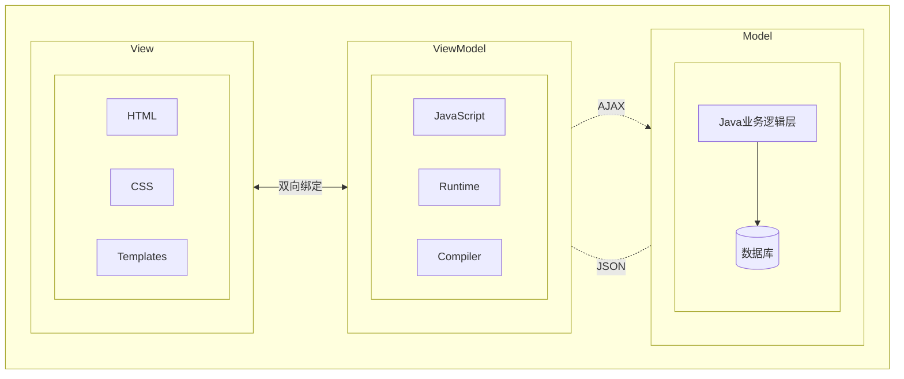
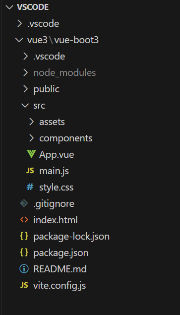
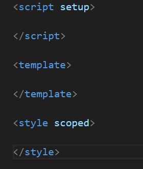

[toc]

# VUE2

> ## 一、概述

Vue (读音/vju/,类似于view)是一套用于构建用户界面的渐进式框架,发布于2014年2月。与其它大型框架不同的是，Vue被设计为可以自底向上逐层应用。Vue的核心库只关注视图层，不仅易于上手，还便于与第三方库(如: vue-router:跳转， vue-resource:通信， vuex:管理)或既有项目整合。

* 官网: https://cn.vuejs.org/v2/guide/

> ## 二、前端三要素

* HTML（结构） 超文本标记语言，决定网页的结构和内容
* CSS（表现） 层叠样式表，决定网页的表现样式
* JavaScript（行为）  是一种弱类型的脚本语言，其原码不需要经过编译，由浏览器解释运行，用于控制网页的行为

1. **UI框架**
   1. Ant-Design:阿里巴巴出品,基于React的U1框架
   2. ElementUl, iview,ice:饿了么出品,基于Vue的Ul框架
   3. Bootstrap: Twitter推出的一个用于前端开发的开源工具包
   4. AmazeUl: 又叫 “妹子 UI”, 一款 HTML5 跨屏前端框架
2. **构建工具**
   1. Babel: JS 编译工具,主要用于浏览器不支持的ES 新特性,比如用于编译
   2. TypeScriptWebPack:模块打包器，主要作用是打包、压缩、合并及按序加载

> ## 三、MVVM

**MVVM组成部分**

* Model:模型层，在这里表示 JavaScript 对象
* View:视图层,在这里表示DOM (HTML操作的元素)
* ViewModel:连接视图和数据的中间件, Vue.js 就是 MVVM 中的ViewModel 层的实现者

在 MVVM架构中，是不允许 数据 和 视图 直接通信的，只能通过ViewModel 来通信，而ViewModel 就是定义了一个 Observer 观察者

* ViewModel 能够观察到数据的变化,并对视图对应的内容进行更新
* ViewModel能够监听到视图的变化，并能够通知数据发生改变

至此,我们就明白了, Vue.js就是一个MVVM的实现者，他的核心就是实现了DOM监听与数据绑定



> 

## 下载地址

* 开发版本
  * 包含完整的警告和调试模式：`https://vuejs.org/js/vue.js`
  * 删除了警告，30.96kb min+gzip: `https://vuejs.org/js/vue.min.js`
* CDN
  * `<script src="https://cdnjsdelivr.net/npm/vue@2.5.21/dist/vue.js"></script>`
  * `<script src="https://cdnjsdelivr.net/npm/vue@2.5.21/dist/vue.min.js"></script>`

## Vue环境搭建

* vue安装方式一个有三种：

  1. 脚手架安装

  2. 通过 CDN 使用 Vue:你可以借助 script 标签直接通过 CDN 来使用 Vue：

     ```vue
     <script src="https://unpkg.com/vue@3/dist/vue.global.js"></script>
     ```

     * 解决控制台报错：`You are running a development build of Vue.Make sure to use the production build (*.prod.js) when deploying for production.`
     * 添加``

  3. 使用 ES 模块构建版本

     ```vue
     <div id="app">{{ message }}</div>
     
     <script type="module">
       import { createApp } from 'https://unpkg.com/vue@3/dist/vue.esm-browser.js'
       
       createApp({
         data() {
           return {
             message: 'Hello Vue!'
           }
         }
       }).mount('#app')
     </script>
     ```

  4. 启用 Import maps

     ```vue
     import { createApp } from 'vue'
     
     <script type="importmap">
       {
         "imports": {
           "vue": "https://unpkg.com/vue@3/dist/vue.esm-browser.js"
         }
       }
     </script>
     
     <div id="app">{{ message }}</div>
     
     <script type="module">
       import { createApp } from 'vue'
     
       createApp({
         data() {
           return {
             message: 'Hello Vue!'
           }
         }
       }).mount('#app')
     </script>
     
     ```

     

1. 安装node.js

2. 打开命令行窗口（cmd），执行（`npm -v`）he(`node -v`)查看npm版本号、和node.js版本号

3. 安装编辑器

4. 安装vue

   1. 使用npm进行安装
   2. 使用淘宝镜像`npm install -g cnpm --registry=https://registry.npm.taobao.org`
   3. 安装vue脚手架`npm install -g @vue/cli`

5. 创建vue项目

   1. 新建文件夹：项目文件夹名字

   2. 在VScode中cd到该目录下

   3. 输入`vue create 文件夹名字`

   4. 选择配置信息

      1. 选择`Manually select features`

      2. 按空格选择要配置的资源

      3. 选择版本vue2

      4. 路径模式选择n

      5. 选择css预处理语言选择Less

      6. 如何存放配置选择In package.json

      7. 是否保存本地配置n

         

      8. 搭建完毕

      9. cd到项目文件夹下CD：回到根目录`cd/` 回到上层目录`cd..` 到下层目录`cd 文件夹名` 进入指定盘符`盘符：`,`cd /盘符`

      10. 运行 `npm run serve`

### 项目文件结构

```turtle
├──node_modules
├──public
│   ├──favicon.ico： 页签图标
│   └──index.html：主页面
├──src
│   ├──assets：存放静态资源
│   │   └──logo.png
│   ├──component:存放组件
│   │   └──HelloWorld.vue
│   ├──App.vue：汇总所有组件
│   ├──main.js：入口文件
├──.gitignore: git版本管制忽略的配置
├──babel.config.js: babel的配置文件
├──package.json:应用包配置文件
├──README.md:应用描述文件
└──package-lock.json：包版本控制文件
```

- `.eslintrc.js`: 这个是 eslint 的配置文件，可以通过它来管理你的校验规则。

- `babel.config.js`: 这个是 Babel 的配置文件，可以在开发中使用 JavaScript 的新特性，并且将其转换为在生产环境中可以跨浏览器运行的旧语法代码。你也可以在这个里配置额外的 babel 插件。

- `.browserslistrc`: 这个是 Browserslist 的配置文件，可以通过它来控制需要对哪些浏览器进行支持和优化。

- `public`: 这个目录包含一些在 Webpack 编译过程中没有加工处理过的文件（有一个例外：index.html 会有一些处理）。

  * `favicon.ico`: 这个是项目的图标，当前就是一个 Vue 的 logo。
  * `index.html`: 这是应用的模板文件，Vue 应用会通过这个 HTML 页面来运行，也可以通过 lodash 这种模板语法在这个文件里插值。
  * **备注：** 这个不是负责管理页面最终展示的模板，而是管理 Vue 应用之外的静态 HTML 文件，一般只有在用到一些高级功能的时候才会修改这个文件。

- src这个是 Vue 应用的核心代码目录

  * `main.js`：这是应用的入口文件。目前它会初始化 Vue 应用并且制定将应用挂载到 `index.html` 文件中的哪个 HTML 元素上。通常还会做一些注册全局组件或者添额外的 Vue 库的操作。

  - `App.vue`：这是 Vue 应用的根节点组件，往下看可以了解更多关注 Vue 组件的信息。
  - `components`：这是用来存放自定义组件的目录，目前里面会有一个示例组件。
  - `assets`：这个目录用来存放像 CSS、图片这种静态资源，但是因为它们属于代码目录下，所以可以用 webpack 来操作和处理。意思就是你可以使用一些预处理比如 Sass/SCSS 或者 Stylus。

### Vue工程引入element UI

1. 进入项目目录终端输入`npm i element-ui -S`

2. 在main.js中完整引入

   ```vue
   import Vue from 'vue'
   import App from './App.vue'
   import router from './router'
   import store from './store'
   
   Vue.config.productionTip = false
   
   new Vue({
     router,
     store,
     render: h => h(App)
   }).$mount('#app')
   ```

3. 引入element-ui

4. 增加了三个

   ```vue
   import Elenentui from 'element-ui'; //引入elementui
   import 'element-ui/lib/theme-chalk/index.css'; //引入elementui
   Vue.use(ElementUI); //引入elementui
   ```

5. 去elementui官网复制代码测试

   ```
   https://element.eleme.cn/
   ```

### Vue引入Axios

## vue基础

### 第一个程序

* App.vue

  * 打开 App.vue 文件，可以看到由 <template>、<script> 和 <style> 三部分组成，分别包含了组件的模板、脚本和样式相关的内容。所有的单文件组件都是这种类似的基本结构。
  * `<template>` 包含了所有的标记结构和组件的展示逻辑。template 可以包含任何合法的 HTML，以及一些我们接下来要讲的 Vue 特定的语法。
  * 通过设置 `<template>` 标签的 `lang` 属性，例如可以通过设置 `<template lang="pug">` 就可以在使用 Pug 模板来替代标准 HTML。
  * `<script>` 包含组件中所有的非显示逻辑，最重要的是, <script> 标签需要默认导出一个 JS 对象。该对象是您在本地注册组件、定义属性、处理本地状态、定义方法等的地方。在构建阶段这个包含 template 模板的对象会被处理和转换成为一个有 render() 函数的 Vue 组件

* 代码写在components下面

  * template：里面写html
  * script:写业务逻辑

* 文本插值

  * 最基本的数据绑定形式是文本插值，它使用的是“Mustache”语法 (即双大括号)：`<span>Message: {{ msg }}</span>`

    ```vue
    <template>
      <div class="hello">
        <h3>学习:vue</h3>
        <h4>{{msg}}</h4>
      </div>
    </template>
    
    <script>
    export default {
      name: 'HelloWorld',
      data(){
        return{
          msg:"测试"
        }
      }
    }
    </script>
    ```

  * 原始HTML

    * 双大括号会将数据解释为普通文本,而非 HTML 代码。为了输出真正的 HTML,你需要使用 v-html指令

    * `v-html`:双大括号会将数据解释为纯文本，而不是 HTML。若想插入 HTML，你需要使用 v-html 指令

      ```vue
      <div v-bind:id="dynamicId"></div>
      简写：<div :id="dynamicId"></div>
      ```

  * Attribute 属性:

    * `v-bind`可以操作HTMl标签中的属性

      ```vue
      <template>
        <div class="hello">
          <h3>学习:vue</h3>
          <div>{{msg}}</div>
          <div v-html="rawHtml"></div>
          <div v-bind:id="rawId" :class="rawClass"></div>
        </div>
      </template>
      
      <script>
      export default {
        name: 'HelloWorld',
        data(){
          return{
            msg:"学习测试",
            rawHtml:"<a href='baidu.com'>百度</a>",
            rawClass:"1002",
            rawId:"1001"
      
          }
        }
      }
      </script>
      ```

    * 使用 JavaScript 表达式

    * 但是 Vue 实际上在所有的数据绑定中都支持完整的 JavaScript 表达式：

    * 这些表达式会在当前活动实例的数据作用域下作为JavaScript 被解析。有个限制就是,每个绑定都只能包含单个表达式。

      ```vue
      {{ number + 1 }}
      {{ ok ? 'YES' : 'NO' }}
      {{ message.split('').reverse().join('') }}
      <div :id="`list-${id}`"></div>
      ```

* 条件渲染

* 列表渲染

1. v-bind:单项数据绑定
2. v-model:双向数据绑定
   * v-model只能应用在表单类元素（输入类元素）上

## 数据代理

1. Object.defineproperty方法

   * 当有人读取person的age属性时，get函数（getter）就会被调用，且返回值就是age的值

   * 当有人修改person(的age属性时，set函数(setter)就会被调用，且会收到修改的具体值

     ```javascript
     <script>
         let number=18
         let person = {
             name:"jke",
             sex:"男"，
         }
         Object.defineproperty(person,'age'{
             get(){
             return number
         }
             set(value){
             number = value
             }
         })
         </script>
     ```

2. 数据代理：通过一个对象代理对另一个对象中属性的操作（读/写）

3. 事件处理：

   1. v-on:click:简写@click

   2. 事件绑定：methods

   3. 事件的基本使用：1.使用v-on：xxx 或 @xxx 绑定事件，其中xxx是事件名；2.事件的回调需要配置在methods对象中，最终会在vm上；3.methods中配置的函数,不要用箭头函数！否则this就不是vm了;4.methods中配置的函数，都是被Vue所管理的函数，this的指向是vm 或 组件实例对象；5.@click="demo" 和 @click="demo($event）" 效果一致，但后者可以传参；

      ```vue
      <body>
      <button @click="anniu">按钮</button>
      </body>
      <script>
      new Vue({
          el:'root'
          methods:{
              anniu(){
                  alert('同学你好')
              }
          }
      })
      </script>
      ```

   4. 参数传递:anniu()后面小括号就是传递的参数，在下方anniu处顺序一致接收

      ```vue
      <body>
      <button @click="anniu(27)">按钮</button>
      </body>
      <script>
      new Vue({
          el:'root'
          methods:{
              anniu(number){
                  alert('同学你好')
              }
          }
      })
      </script>
      ```

4. 时间修饰符

   * prevent：阻止默认事件

   * stop:阻止事件冒泡

   * once：事件只触发一次

   * capture：使用事件的捕获模式

   * self：只有event.target是当前操作的元素是才触发事件；

   * passive：事件的默认行为立即执行，无需等待事件回调执行完毕；

     ```vue
     <！-- 准备好一个容器-->
         <div id="root">
             <h2>欢迎来到{{name}}学习</h2>
             <！-- 阻止默认事件（常用） -->
                 <a href="http://www.atguigu.com" @click.prevent="showInfo">点我提示信息</a>
             <！-- 阻止事件冒泡（常用） -->
                 <div class="demo1" @click="showInfo">
                     <button @click.stop="showInfo">点我提示信息</button>
                 </div>
             <！-- 事件只触发一次（常用）
                  <button @click.once="showInfo">点我提示信息</button>
             <！-- 使用事件的捕获模式 -->
                 <div class="box1" @click.capture="showMsg(1)">
                     div1
                     <div class="box2" @click="showMsg(2)">
                         div2
                     </div>
                 </div>
                 <！-- 只有event.target是当前操作的元素时才触发事件；-->
                     <div class="demo1" @click.self="showInfo">
                         <button @click="showInfo">点我提示信息</button>
                     </div>
                 <！-- 事件的默认行为立即执行，无需等待事件回调执行完毕；-->
                     <ul @wheel.passive="demo" class="list">
                         <li>1</li>
                         <li>2</li>
                         <li>3</li>
                         <li>4</li>
                     </ul>
                     </div>
     ```

5. 键盘事件

   * keydown:按下按键不需要抬起触发事件
   * keyup：按下按键抬后才触发事件
   * Vue中常用的按键别名：
     * 回车 => enter
     * 删除 => delete (捕获“删除”和“退格”)
     * 退出=> esc
     * 空格 => space
     * 换行=> tab
     * 上 => up
     * 下 => down
     * 左 => left
     * 右 => right
   * Vue未提供别名的按键，可以使用按键原始的key值去绑定，但注意要转为kebab-case（短横线命名）
   * 系统修饰键（用法特殊）：ctrl、alt、shift、meta
     * 配合keyup使用：按下修饰键的同时，再按下其他键，随后释放其他键，事件才被触发。
     * 配合keydown使用：正常触发事件。
   * 也可以使用keyCode去指定具体的按键（不推荐）
   * Vue.config.keyCodes.自定义键名 = 键码，可以去定制按键别名

6. 计算属性：computed

   * 定义：要用的属性不存在，要通过已有属性计算得来。

   * 原理：底层借助了Objcet.defineproperty方法提供的getter和setter.

   * get函数什么时候执行？

     * 初次读取时会执行一次。
     * 当依赖的数据发生改变时会被再次调用。

   * 优势：与methods实现相比，内部有缓存机制（复用)，效率更高，调试方便。

   * 备注：

     * 计算属性最终会出现在vm上，直接读取使用即可。
     * 如果计算属性要被修改,那必须写set函数去响应修改,且set中要引起计算时依赖的数据发生

     ```vue
     <body>
         <div id="root">
         姓: <input type="text" v-model="firstName"> <br/><br/>
         名: <input type="text" v-model="lastName"> <br/><br/>
         全名:<span>{{fullName}}</span> <br/><br/>
         </div>
     </body>
     <script>
     new Vue({
         el:'#rppt',
         data:{
             firstName:'张',
             lastName:'三'
         },
         computde:{
             fullName:{
                 get(){
                     return:this.firstName+'-'+this.lastName
                 },
                 set(value){
                     const arr[] = value.split('-')
                     this.firstName = arr[0]
                     this.lastName = arr[1]
                 }
             }
         }
     })
     </script>
     ```

   * 简写:只考虑显示，不考虑修改才能用简写

     ```vue
     fullName(){
     return:this.firstName+'-'+this.lastName
     }
     ```

7. 监视属性:watch

   * 当被监视的属性变化时,阿调函数自动调用，进行相关操作

   * 监视的属性必须存在，才能进行监视！！

   * 监视的两种写法：(1).new Vue时传入watch配置通过um tuntch火询

     ```vue
     <div>
     <h2>今天天气{{hat}}<h2>
     <button @clikl="chg"></button>
     </div>
     <script>
         const vm = nuw Vue({
             el:'root',
             data:{
                 isNum:true,
                 isNam:{
                     a:1,
                     b:2
                 }
             },
             computed:{
                 hat(){
                     return:this.isNum ? '炎热' ：'凉爽'
                 }
             },
             methods:{//事件绑定
                 chg(){
                     this.isNum = !this.isNum
                 }
             },
             watch:{
                 isNum:{
                     deep：true;//监视多级结构中某个属性的变化：深度监视
                     immediate:true,//默认值false,初始化时调用一下handler
                     // handler当isNum发生变化时被调用,newValue新的值，oldValue旧的值
                     handler(newValue,oldValue){}
                 }
                 'isNam.a'{}//监视某级下的某一个数据发生变化
                 //简写：isNum直接当handler
             }
         })
             //在外面监视
             vm.$watch('isHum',{
             immediate:true,//默认值false,初始化时调用一下handler
             // handler当isNum发生变化时被调用,newValue新的值，oldValue旧的值
             handler(newValue,oldValue){}
         })
     </script>
     ```

   * computed和watch之间的区别：

     1. computed能完成的功能 watch都可以完成。

     2. watch能完成的功能，computed不一定能完成，

        例如：watch可以进行异步操作。

   * 两个重要的小原则：

     1. 所被Vue管理的函数，最好写成普通函数，这样this的指向才是vm 或 组件实例对象。
     2. 所有不被Vue所管理的函数（定时器的回调函数、ajax的回调函数等），最好写成箭头函数，这样this的指向才是vm 或 组件实例对象。

8. 绑定class样式

   ```vue
   <div class="" :class="可以是字符串、数组、对象"></div>
   ```

   1. class样式写法：class="xxx"
      * xxx可以是字符串、对象、数组。
      * 字符串写法适用于：类名不确定，要动态获取。对象写法适用于：要绑定多个样式，个数不确定，名字也不确定。
      * 数组写法适用于：要绑定多个样式，个数确定，名字也确定，但不确定用不用。
   2. style样式
      1. :style="{fontSize： xxx}"其中xxx是动态值。
      2. :style="[a,b]"其中a、b是样式对象。

9. 绑定style样式

   ```vue
   <div :style="可以是数组、对象"></div>
   ```

10. 条件渲染

    * v-show:元素的显示与隐藏
    * v-if:v-else-if：显示判断展示
    * template:不影响结构

11. 列表渲染

    * v-for:`v-for="p of persons :key"` `v-for="形参 in 数组名 :key="唯一值"` 

      ```vue
      <div id="ass">
          <ul>
              <li v-for="p,index in Shuzhu" :key="index">{{p.id}}-{{p.name}}-{{p.age}}</li>
          </ul>
      </div>
      <script>
      Vue.config.productionTip = false;
      new Vue({
          el:'#ass',
          data:{                  
              Shuzhu:[
                  {id:'001',name:'张三',age:'18'},
                  {id:'002',name:'三五',age:'20'},
                  {id:'003',name:'李五',age:'16'},
                  {id:'004',name:'李丽',age:'21'}
              ]
          },  
      })
      </script>
      ```

    * key:给节点一个标识

      1. 虚拟DOM中key的作用：

         * key是虚拟DOM对象的标识，当数据发生变化时，Vue会根据【新数据】生成【新的虚拟DOM】，随后Vue进行【新虚拟DOM】 与【旧虚拟DOM】的差异比较，比较规则如下：

      2. 对比规则：

         * 旧虚拟DOM中找到了与新虚拟DOM相同的key:

           * 若虚拟DOM中内容没变，直接使用之前的真实DOM！

           * 若虚拟DOM中内容变了，则生成新的真实DOM，随后替换掉页面中之前的真实DOM。

         * 旧虚拟DOM中未找到与新虚拟DOM相同的key:

           * 创建新的真实DOM，随后渲染到到页面。

      3. 用index作为key可能会引发的问题：

         1. 若对数据进行：逆序添加、逆序删除等破坏顺序操作：
            * 会产生没有必要的真实DOM更新 ==> 界面效果没问题，但效率低。
         2. 如果结构中还包含输入类的DOM：
            * 会产生错误DOM更新 ==>界面有问题。

      4. 开发中如何选择key?

         1. 最好使用每条数据的唯一标识作为key，比如id、手机号、身份证号、学号等唯一值。
         2. 如果不存在对数据的逆序添加、逆序删除等破坏顺序操作,仅用于渲染列表用于展示,使用index作为key是没有问题的。

    * 过滤

      ```vue
      <div id="root">
          <input type="text" placeholder="请输入名字" v-model="keyssm">
          <ul>
              <li v-for="(p,index) of filly" :key="p.id">{{p.id}}-{{p.name}}-{{p.age}}</li>
          </ul>
      </div>
      <script>
      Vue.config.productionTip = false;
      new Vue({
          el:'#root',
          data:{
              keyssm:'',                  
              Shuzhu:[
                  {id:'001',name:'张三',age:'18'},
                  {id:'002',name:'三五',age:'20'},
                  {id:'003',name:'李五',age:'16'},
                  {id:'004',name:'李丽',age:'21'}
              ]
           },
          computed:{
              immediate:true,
              filly(){
                  return this.Shuzhu.filter((p)=>{
                      return p.name.indexOf(this.keyssm) !== -1
                  })
              }
          }
      })
      </script>
      ```

    * 排序

      ```vue
      <div id="root">
              <input type="text" placeholder="请输入名字" v-model="keyssm">
             <button @click="ssy = 1">升序</button>
             <button @click="ssy = 2">降序</button>
             <button @click="ssy = 0">原序</button>
              <ul>
              <li v-for="(p,index) of filly" :key="p.id">{{p.id}}-{{p.name}}-{{p.age}}</li>
             </ul>
          </div>
      <script>
      Vue.config.productionTip = false;
      new Vue({
          el:'#root',
          data:{
              keyssm:'',
              ssy:'',                  
              Shuzhu:[
                  {id:'001',name:'张三',age:'18'},
                  {id:'002',name:'三五',age:'20'},
                  {id:'003',name:'李五',age:'16'},
                  {id:'004',name:'李丽',age:'21'}
              ]
           },
          computed:{
              immediate:true,
              filly(){
                  const arr = this.Shuzhu.filter((p)=>{
                      return p.name.indexOf(this.keyssm) !== -1
                  })
                  if(this.ssy !== 0){
                      arr.sort((a,b)=>{
                          return this.ssy === 1 ? a.age -b.age : b.age - a.age
                      })
                  }
                  return arr
              }
          }
      })
      </script>
      ```

12. Vue.set

    * Vue.set(data下面对象位置，对象名字，值)===vm.$set(data下面对象位置，对象名字，值)

    * const vm = new Vue({})

    * 对象不能是Vue实例，或者Vue实例的跟数据对象

    * Vue 能够侦听响应式数组的变更方法，并在它们被调用时触发相关的更新。这些变更方法包括：

      - `push()`
      - `pop()`
      - `shift()`
      - `unshift()`
      - `splice()`
      - `sort()`
      - `reverse()`

    * 替换一个数组

      变更方法，顾名思义，就是会对调用它们的原数组进行变更。相对地，也有一些不可变 (immutable) 方法，例如 `filter()`，`concat()` 和 `slice()`，这些都不会更改原数组，而总是**返回一个新数组**。当遇到的是非变更方法时，我们需要将旧的数组替换为新的：`this.items = this.items.filter((item) => item.message.match(/Foo/))`

13. Vue监视数据的原理：

    1. vue会监视data中所有层次的数据

    2. 如何监测对象中的数据？

       * 通过setter实现监视，且要在new Vue时就传入要监测的数据。

         * 对象中后追加的属性，Vue默认不做响应式处理

         * 如需给后添加的属性做响应式，请使用如下API：

           `Vue.set(target, prepertyName/index, value)` 或`vm.$set(target, propertyName/index, value)`

    3. 如何监测数组中的数据？

       * 通过包裹数组更新元素的方法实现，本质就是做了两件事：
         1. 调用原生对应的方法对数组进行更新。
         2. 重新解析模板，进而更新页面。

    4. 在Vue修改数组中的某个元素一定要用如下方法：

       1. 使用这些API:`push()、pop()、shift()、unshift()、splice()、sort()、reverse()`
       2. `Vue.set()`或 `vm.$set()`

    5. 特别注意：Vue.set（）和 vm.$set（）不能给vm 或 vm的根数据对象 添加属性！！！

14. 收集表单数据

    * 若：`<input type="text"/>`，则v-model收集的是value值，用户输入的就是value值。
    * 若：`<input type="radio"/>`，则v-model收集的是value值，且要给标签配置value值。
    * 若: `<input type="checkbox"/>`
      1. 没有配置input的value属性。那么收集的就是checked（勾选 or 未勾选，是布尔值）
      2. 配置input的value属性：
         1. v-model的初始值是非数组，那么收集的就是checked （勾选 or 未勾选，是布尔值）
         2. v-model的初始值是数组，那么收集的的就是value组成的数组
    * 备注： v-model的三个修饰符：
      * lazy：失去焦点再收集数据
      * number：输入字符串转为有效的数字
      * trim：输入首尾空格过滤

15. 过滤器

    1. 定义：对要显示的数据进行特定格式化后再显示（适用于一些简单逻辑的处理）。
    2. 语法：
       1. 注册过滤器：Vue.filter(name,callback) 或 new Vue{filters:{}}
       2. 使用过滤器： {{ xxx | 过滤器名}} 或 v-bind:属性 = "xxx | 过滤器名"
    3. 备注：
       1. 过滤器也可以接收额外参数、多个过滤器也可以串联2.
       2. 并没有改变原本的数据，是产生新的对应的数据

16. 内置指令：

    * v-bind ：单向绑定解析表达式，可简写为 ：xxx
    * v-model ：双向数据绑定
    * v-for ：遍历数组/对象/字符串
    * v-on ：绑定事件监听，可简写为@
    * v-if ：条件渲染（动态控制节点是否存存在）
    * v-else ：条件渲染（动态控制节点是否存存在）
    * v-show ：条件渲染（动态控制节点是否展示)
    * v-text : 替换div中的内容（全部）
    * v-html ：
      1. 作用：向指定节点中渲染包含html结构的内容。
      2. 与插值语法的区别：
         * v-html会替换掉节点中所有的内容，{{xx}}则不会。
         * v-html可以识别html结构。
      3. 严重注意：v-html有安全性问题！！！！
         * 在网站上动态渲染任意HTML是非常危险的，容易导致XSS攻击。
         * 一定要在可信的内容上使用v-html，永不要用在用户提交的内容上！
    * v-cloak :
      * Cloak指令（没有值）：
        1. 本质是一个特殊属性，Vue实例创建完毕并接管容器后，会删掉v-cloak属性。
        2. 使用css配合v-cloak可以解决网速慢时页面展示出{{xxx}}的问题。
    * v-once ：
      1. v-once所在节点在初次动态渲染后，就视为静态内容了。
      2. 以后数据的改变不会引起v-once所在结构的更新，可以用于优化性能。
    * v-pre
      1. 跳过其所在节点的编译过程。
      2. 可利用它跳过：没有使用指令语法、没有使用插值语法的节点，会加快编译。

17. 自定义指令

    * 函数式
    * 对象式

18. 生命周期

    1. 又名：生命周期回调函数、生命周期函数、生命周期钩子。
    2. 是什么：Vue在关键时刻帮我们调用的一些特殊名称的函数。
    3. 生命周期函数的名字不可更改，但函数的具体内容是程序员根据需求编写的。
    4. 生命周期函数中的this指向是vm 或 组件实例对象

    * 挂载流程
    * 跟新流程
    * 销毁流程
    * 将要创建 ===>调用beforeCreate函数。
    * 创建完毕 ===>调用created函数。
    * 将要挂载 ===>调用beforeMount函数。
    * （重要）挂载完毕 ===调用mounted函数。－－－－－－－－＞【重要的钩子】
    * 将要更新 ===>调用beforeUpdate函数。
    * 更新完毕 ===>调用updated函数。
    * （重要）将要销毁 ===> 调用beforeDestroy函数。
    * 销毁完毕 ===>调用destroyed函数。－－－－－－－－－－>【重要的钩子】
    * 常用的生命周期钩子：
      1. mounted：发送ajax请求、启动定时器、绑定自定义事件、订阅消息等【初始化操作】。
      2. beforeDestroy：清除定时器、解绑自定义事件、取消订阅消息等 【收尾工作】。
    * 关于销毁Vue实例
      1. 销毁后借助Vue开发者工具看不到任何信息。
      2. 销毁后自定义事件会失效，但原生DOM事件依然有效。
      3. 一般不会再beforeDestroy操作数据,因为即便操作数据,也不会再触发更新流程了。

19. 组件

    * 组件的定义实现应用中局部功能代码和资源的集合

    * 创建：`new.extend({})`:使用组件：1.创建；2.组测；3.使用

    * 非单文件组件

      * 一个文件中包含有N个组件

        ```vue
        <body>
            <div id="root">
                <!-- 组件标签-->
                <xuexiao></xuexiao>
            </div>
            <script src="./js/index.js"></script>
        </body>
        <script>
        Vue.config.productionTip = false;
        //1.创建
        const xuexiao = Vue.extend({
            //3html结构
            template: 
            `
            <div>
            <h2>{{shool}}---{{student}}</h2>
            </div>
            `,
            data(){
                return {
                    shool: 'ji',
                    student: 'hh'
                }
            }
        })
        //2.组测
        //全局组测
        Vue.component('组件名',组件名)
        new Vue({
            el: '#root',
            //局部组测
            components: {
                xuexiao: xuexiao
            }
        })
        </script>
        
        ```

      * Vue中使用组件的三大步骤：

        1. 定义组件(创建组件)
        2. 注册组件
        3. 使用组件(写组件标签）

      * 如何定义一个组件？

        * 使用Vue.extend(options)创建,其中options和new Vue(options)时传入的那个options几乎一样,但也有点区别区别如下：
          1. el不要写，为什么？ -------------最终所有的组件都要经过一个vm的管理，由vm中的el决定服务哪个容器。
          2. data必须写成函数，为什么？-------避免组件被复用时，数据存在引用关系。
        * 备注：使用template可以配置组件结构。

      * 如何注册组件？

        1. 局部注册：靠new Vue的时候传入components选项
        2. 全局注册：靠Vue.component('组件名'，组件）

      * 编写组件标签：`<school></school>`

      * 组件嵌套

        ```vue
        <script>
        Vue.config.productionTip = false;
        //1.创建
        
        const xuesheng = Vue.extend({
            //3html结构
            template:
                `
            <div>
            <h2>{{shool}}---{{student}}</h2>
            </div>
            `,
            data() {
                return {
                    shool: 'cc',
                    student: 'cc'
                }
            }
        })
        const xuexiao = Vue.extend({
            components: {
                xuesheng,
            },
            //3html结构
            template:
                `
            <div>
            <h2>{{shool}}---{{student}}</h2>
            <xuesheng></xuesheng>
            </div>
            `,
            data() {
                return {
                    shool: 'aa',
                    student: 'aa'
                }
            }
        })
        const xuexi = Vue.extend({
            //3html结构
            template:
                `
            <div>
            <h2>{{shool}}---{{student}}</h2>
            </div>
            `,
            data() {
                return {
                    shool: 'bb',
                    student: 'bb'
                }
            }
        })
        const app = Vue.extend({
            template:`
            <div>
            <xuexiao></xuexiao>
            <xuexi></xuexi>
            </div>
            `,
            components:{
                xuexi,
                xuexiao
            }
        })
        //2.组测
        new Vue({
            el: '#root',
            //局部组测
            components: {
                app
            }
        })
        </script>
        ```

      * VueComponent函数

        1. school组件本质是一个名为VueComponent的构造函数，且不是程序员定义的，是Vue.extend生成的。
        2. 我们只需要写`<school/>`或`<school></school>`, Vue解析时会帮我们创建school组件的实例对象
           * 即Vue帮我们执行的：new VueComponent(options)。
        3. 特别注意：每次调用Vue.extend，返回的都是一个全新的VueComponent!
        4. 关于this指向：
           1. 组件配置中：
              * data函数、methods中的函数、watch中的函数、computed中的函数 它们的this均是【VueComponent实例对象】。
           2. new Vue()配置中：
              * data函数、methods中的函数、watch中的函数、computed中的函数 它们的this均是 【Vue实例对象】。
        5. VueComponent的实例对象，以后简称vc（也可称之为：组件实例对象）。
        6. Vue的实例对象，以后简称vm。

      1. 单文件组件

         * 一个文件中只包含有1个组件

         * 结构

           ```vue
           <template>
               <!-- 组件结构 -->
           </template>
           <script>
               //组件交换代码（数据、方法）
               //模块需要暴露
           </script>
           <style>
               /* 组件样式 */ 
           </style>
           ```

         * 三种方式暴露

           1. 分别暴露：写在模块前面

              `export const 组件名 = Vue.extend({})`

           2. 统一暴露：写在模块外面

              `export {组件名}`

           3. 默认暴露：写在模块的外面的下面（一般使用）

              `export default 组件名`

## 脚手架：

1. index.hrml

```html
<!DOCTYPE html>
<html lang="">
  <head>
    <meta charset="utf-8">
      <!-- 针对IE浏览器的一个特殊配置，含义是让IE浏览器以最高的渲染级别渲染页面 -->
    <meta http-equiv="X-UA-Compatible" content="IE=edge">
      <!-- 开启移动端的理想视口 -->  
    <meta name="viewport" content="width=device-width,initial-scale=1.0">
      <!-- 配置页签图标 -->
    <link rel="icon" href="<%= BASE_URL %>favicon.ico">
      <!-- 配置网页标题 -->
    <title><%= htmlWebpackPlugin.options.title %></title>
  </head>
  <body>
      <!-- 当浏览器不支持is时noscript中的元素就会被渲染 -->
    <noscript>
      <strong>
          We're sorry but <%= htmlWebpackPlugin.options.title %> doesn't work properly without JavaScript enabled. Please enable it to continue.</strong>
    </noscript>
        <!-- 容器 -->
    <div id="app"></div>
    <!-- built files will be auto injected -->
  </body>
</html>
```

1. render函数

   1. vue.js与vue.runtime.xxx.js的区别：
      1. vue.js是完整版的Vue，包含：核心功能+模板解析器。
      2. vue.runtime.xxx.js是运行版的Vue，只包含：核心功能；没有模板解析器。
   2. 因为vue.runtime.xxx.js没有模板解析器,所以不能使用template配置项，需要使用render函数接收到的createElement函数去指定具体内容。

2. 修改默认配置

   1. Vue脚手架隐藏了所有 webpack 相关的配置，若想查看具体的 webpakc 配置，请执行： `vue inspect > output.js`
   2. 使用vue inspect > output.js可以查看到Vue脚手架的默认配置。
   3. 使用vue.config.js可以对脚手架进行个性化定制，详情见：`https://cli.vuejs.org/zh`

3. _ref属性

   1. 被用来给元素或子组件注册引用信息（id的替代者）
   2. 应用在htm]标签上获取的是真实DOM元素，应用在组件标签上是组件实例对象(vc)
   3. 使用方式：
      * 打标识：`<h1 ref="xxx">....</h1>` 或 `<School ref="xxx"></School>`
      * 获取：`this.$refs.xxx`

4. _props配置

   1. 功能：让组件接收外部传过来的数据

      1. 传递数据：`<Demo hame="xxx"/>`

      2. 接收数据：

         * 第一种方式（只接收）：`props: ['name']`

         * 第二种方式（限制类型）：`props:{name:Number}`

         * 第三种方式（限制类型、限制必要性、指定默认值）：

           ```vue
           <script>
           props:{
               name:{
                   type:String`, //类型
                   required:true, //必要性
                   default:'老王' //默认值
                   }
           }
           </script>
           ```

         * 备注： props是只读的，Vue底层会监测你对props的修改，如果进行了修改，就会发出警告，若业务需求确实需要修改，那么请复制props的内容到data中一份，然后去修改data中的数据。

5. mixin混入

   1. 功能：可以把多个组件共用的配置提取成一个混入对象使用方式：
      * 第一步定义混合，例如：
        1. 一个新的js
        2. data(){....},methods:{.}
      * 第二步使用混入例如：
        1. 全局混入：Vue.mixin(xxx)
        2. 局部混入： mixins:['xxx']

6. 插件

   * 功能：用于增强Vue

   * 本质：包含install方法的一个对象，install的第一个参数是Vue，第二个以后的参数是插件使用者传递的数据。

   * 定义插件：

     ```vue
     <script>
     对象.install = function (Vue, options){
         // 1. 添加全局过滤器
         Vue.filter(...)
         //2. 添加全局指令
         Vue.directive(..)
         //3. 配置全局混入（合）
         Vue.mixin(.)
         // 4. 添加实例方法
         Vue.prototype.$myMethod = function () {….}
         Vue.prototype.$myProperty = xxxx}
     </script>
     ```

   * 使用插件： Vue.use()

7. _scoped样式

   * 作用：让样式在局部生效，防止冲突。
   * 写法： `<style scoped>`

8. .组件化编码流程（通用）

   1. 实现静态组件:抽取组件,使用组件实现静态页面效果
   2. 展示动态数据:
      1. 数据的类型、名称是什么？
      2. 数据保存在哪个组件？
   3. 交互——从绑定事件监听开始

9. TodoList案例

   * props适用于：
     1. `父组件==>子组件 通信==`
     2. `子组件==>父组件通信(要求父先给子一个函数)`
   * 使用v-model时要切记： v-model绑定的值不能是props传过来的值，因为props是不可以修改的！
   * props传过来的若是对象类型的值，修改对象中的属性时Vue不会报错，但不推荐这样做。

   1. 本地存储

      1. 浏览器本地存储

         * localStorage

           ```html
           <!DOCTYPE html>
           <html lang="en">
           <head>
               <title>localStorage</title>
               </head>
           <body>
               <h2>localStorage</h2>
               <button onclick="saveData()">点我保存一个数据</button>
               <button onclick="readData()">点我读取一个数据</button>
               <button onclick="deleteData()">点我删除一个数据</button>
               <button onclick="deleteAllData()">点我清空一个数据</button>
               <script>
               let p = {name:'张三',age:18}
               function saveData(){
                   localStorage.setItem('msg', 'hello!!!')
                   localStorage.setItem('msg2',666)
                   localStorage.setItem('person',JSON.stringify(p))
               }
               function readData(){ 
                   console.log(localStorage.getItem('msg')) 
                   console.log(localStorage.getItem('msg2'))
                   const result = localStorage.getItem('person4') 
                   console.log(JSON.parse(result))
                   console.log(localStorage.getItem('msg3'))
               }
               function deleteData(){
                   localStorage.removeItem('msg2')
               }
               function deleteAllData(){
                   localStorage.clear()
               }
               </script>
            </body>
           </html>
           
           ```

         * sessionStorage

           1. 与localStorage用法一样
           2. localStorage关闭浏览器保存；sessionStorage关闭浏览器保存

         * webStorage

           1. 存储内容大小一般支持5MB左右(不同浏览器可能还不一样)
           2. 浏览器端通过Window.sessionStorage和Window.localStorage属性来实现本地存储机制)
           3. 相关API:
              1. `xxxxxStorage.setItem('key', 'value');`该方法接受一个键和值作为参数,会把键值对添加到存储中,如果键名存在,则更新其对应的值。
              2. `xxxxxStorage.getItem('person');`该方法接受一个键名作为参数,返回键名对应的值。
              3. `xxxxxStorage.removeItem('key');`该方法接受一个键名作为参数，并把该键名从存储中删除。
              4. `xxxxxStorage.clear()`该方法会清空存储中的所有数据。
           4. 备注：
              1. SessionStorage存储的内容会随着浏览器窗口关闭而消失。
              2. LocalStorage存储的内容，需要手动清除才会消失。
              3. `xxxxxStorage.getItem(xxx)`如果xxx对应的value获取不到，那么getltem的返回值是null.
              4. `JSON.parse(null)`的结果依然是null。

      2. TodoList_本地存储

10. 组件自定义事件

    1. 绑定

    2. 解绑

    3. 总结

       1. 一种组件间通信的方式，适用于(子组件===>父组件）

       2. 使用场景: A是父组件，B是子组件，B想给A传数据，那么就要在A中给B绑定自定义事件(`事件的回调在A中`) 。

       3. 绑定自定义事件:

          1. 第一种方式，在父组件中: `<Demo @atguigu="test"/> 或<Demo v-on:atguigu="test"/>`

          2. 第二种方式，在父组件中：

             ```vue
             <Demo ref="demo"/>
             mounted(){
             this.$refs.xxx.$on('atguigu',this.test)
             }
             ```

          3. 若想让自定义事件只能触发一次，可以使用 `once` 修饰符，或 `$once` 方法。英）

       4. 触发自定义事件:` this.$emit('atguigu',数据)`

       5. 解绑自定义事件`this.$off('atguigu')`

       6. 组件上也可以绑定原生DOM事件，需要使用native修饰符。

       7. 注意:通过`this.$refs.xxx.$on('atguigu',回调)`绑定自定义事件时,回调要么配置在methods中,要么用箭头函数,否则this指向会出问题！

11. 全局事件总线

    1. 一种组件间通信的方式，适用于任意组件间通信。

    2. 安装全局事件总线：

       ```vue
       new Vue({
       beforeCreate() {
       Vue.prototype.$bus = this //安装全局事件总线，$bus就是当前应用的vm
       },
       }
       ```

    3. 使用事件总线：

       1. 接收数据: A组件想接收数据,则在A组件中给$bus绑定自定义事件,事件的`回调留在A组件自身`。

          ```vue
          methods (){
          demo(data){.....}
          .....
          mounted(){
          this.$bus.$on('xxxx',this.demo)
          }
          ```

       2. 提供数据: `this.$bus.$emit("xxxx',数据)`

    4. 最好在beforeDestrpy钩子中,用$off去解绑`当前组件所用到的事件`。

12. 消息订阅与发布_pubsub

    1. 一种组件间通信的方式,适用于任意组件间通信。

    2. 使用步骤：

       1. 安装pubsub: `npm i pubsub-js`
       2. 引入: `import pubsub from 'pubsub-js'`

    3. 接收数据: A组件想接收数据，则在A组件中订阅消息，订阅的回调留在A组件自身。

       ```vue
       methods(){ 
       demo(data){.....}
       mounted() {
       this.pid = pubsub.subscribe('xxx',this.demo) //订阅消息
       }
       ```

    4. 提供数据： `pubsub.publish('xxx",数据)`

    5. 最好在beforeDestroy钩子中，用`PubSub.unsubscribe(pid)`去取消订阅。

13. $nextTick

    1. 语法： `this.$nextTick(回调函数)`

14. 作用：在下一次DOM 更新结束后执行其指定的回调。

    3. 什么时候用:当改变数据后,要基于更新后的新`DOM`进行某些操作时,要在nextTick所指定的回调函数中执行。

15. 过度与动画

       1. 作用:在插入、更新或移除DOM元素时在合适的时候给元素添加样式类名。

       2. 图示：

          

       3. 写法：

          1. 准备好样式：

             * 元素进入的样式：
               1. v-enter：进入的起点
               2. v-enter-active：进入过程中
               3. v-enter-to：进入的终点
             * 元素离开的样式：
               1. v-leave：离开的起点
               2. v-leave-active：离开过程中
               3. v-leave-to：离开的终点

          2. 使用 `<transition>` 包裹要过度的元素，并配置name属性：

             ```vue
             <transition name="hello">
                 <h1 v-show="isShow">你好啊! </h1>
             </transition>
             ```

          3. 备注:若有多个元素需要过度，则需要使用: `<transition-group>`，且每个元素都要指定`key`值。

16. 配置代理

      1. 在`vue.cofig.js`中添加（方式一）

         ```javascript
         devSeruer:{
             proxy:'代理服务器' //只能做单个服务器代理
         }
         
         axios.get('获取数据地址<端口号为自己服务器端口号>').then(
             response =>{
                 response.data//获取到的数据
             }，
             error =>{
                  error.message//没有数据返回
             }
         )
         ```

         1. 优点：配置简单，请求资源时直接发给前端（8080)即可。
         2. 缺点：不能配置多个代理，不能灵活的控制请求是否走代理。
         3. 工作方式：若按照上述配置代理，当请求了前端不存在的资源时，那么该请求会转发给服务器（优先匹配前端资源）

      2. 在`vue.cofig.js`中添加（方式二）

         ```javascript
         module.exports = {
             devServer: {
                 proxy: {
                     '/api1': {//匹配所有以'/api1'开头的请求路径
                         target: 'http://localhost:5000',// 代理目标的基础路径
                         changeOrigin: true,
                         pathRewrite: {'^/api1': ''}
                     },
                     '/api2': {//匹配所有以'/api2'开头的请求路径
                         target: 'http://localhost:5001',// 代理目标的基础路径
                         changeOrigin: true,
                         pathRewrite: {'^/api2': ''}
                     }
                 }
             }
         }
         /*
         changeOrigin设置为true时，服务器收到的请求头中的host为:localhost:5000
         changeOrigin设置为false时，服务器收到的请求头中的host为：localhost:8080
         changeOrigin默认值的true
         */
         ```

         1. 优点：可以配置多个代理，且可以灵活的控制请求是否走代理。
         2. 缺点：配置略微繁琐，请求资源时必须加前缀。

17. vue-resource通信

18. 插槽

     1. 作用：让父组件可以向子组件指定位置插入html结构，也是一种组件间通信的方式1 适用于 父组件 ===> 子组件。

     2. 分类：默认插槽、具名插槽、作用域插槽

     3. 使用方式：

        1. 默认插槽：

           ```vue
           父组件中：
           <Category>
               <div>html结构1</div>
           </Category>
           子组件中：
           <template>
               <div>
               <！-- 定义插槽 -->
                   <slot>插槽默认内容...</slot>
               </div>
           </template>
           ```

        2. 具名插槽：

           ```vue
           父组件中：
           <Category>
               <template slot="center">
                    <div>html结构1</div>
               </template>
               <template v-slot:footer>
                    <div>html结构2</div>
               </template>
           </Category>
           子组件中：
           <template>
               <div>
               <！-- 定义插槽 -->
                   <slot name="center">插槽默认内容...</slot>
                   <slot name="footer">插槽默认内容...</slot>
               </div>
           </template>
           ```

        3. 作用域插槽：

           1. 理解:数据在组件的自身,但根据数据生成的结构需要组件的使用者来决定。(games数据在Category组件中,但使用数据所遍历出来的结构由App组件决定)
           2. 具体编码：

           ```vue
           父组件中：
           <Category>
               <template scope="scopeData">
           <！-- 生成的是u1列表 -->
               <ul>
                   <li v-for="g in scopeData.games" :key="g">{{g}}</li>
                   </ul>
               </template>
           </Category>
           <Category>
               <template slot-scope="scopeData">
           <！-- 生成的是h4标题 -->
               <h4 v-for="g in scopeData.games" :key="g">{{g}}</h4>
               </template>
           </Category>
           子组件中：
           <template> 
               <div>
                   <slot :games="games"></slot>
               </div>
           </template>
           <script>
               export default {
                   name: 'Category',
                   props:['title'],//数据在子组件自身
                   data() {
                       return {
                           games:['红色警戒','穿越火线','劲舞团','超级玛丽']
                       }
                   },
               }
           </script>
           ```

## Vuex

1. vuex是什么

   1. 概念：专门在 Vue 中实现集中式状态（数据）管理的一个Vue 插件，对 vue 应用中多个组件的共享状态进行集中式的管理(读/写) ,也是一种组件间通信的方式,且适用于任意组件间通信。
   2. Github 地址: `https://github.com/vuejs/vuex`

2. 什么时候使用Vuex

   1. 多个组件依赖于同—状态
   2. 来自不同组件的行为需要变更同一状态

3. vuex工作原理

   

4. 搭建环境

   1. 何时使用`多个组件共享数据时`

   2. 创建文件:`src/store/index.js`

      ```js
      //引入Vue核心库
      import Vue from 'vue'
      //引入Vuex
      import Vuex from 'vuex
      //应用Vuex插件
      Vue.use(Vuex)
      //准备actions对象-响应组件中用户的动作
      const actions = {}
      //准备mutations对象—修改state中的数据
      const mutations = {}
      //准备state对象-保存具体的数据
      const state = {}
      //创建并暴露store
      export default new Vuex.Store({
          factions,
          mutations,
          state
      })
      ```

   3. 在`main.js`中创建vm时传入`store`配置项

      ```js
      .....
      //引入store
      import store from './store/insex.js'
      //创建vm
      new Vue({
          el: '#app',
          render: h => h(App),
          store
      })
      ```

5. 基本使用

   1. 初始化数据、配置`actions`配置`mutations` ,操作文件store.js

      ```js
      //引入Vue核心库
      import Vue from 'vue'
      //引入Vuex
      import Vuex from 'vuex"
      //引用Vuex
      Vue.use(Vuex)
      
      const actions = {
          //响应组件中加的动作
          jia(context,value){
              // console.log('actions中的jia被调用了'，miniStore,value)
              context.commit('JIA',value)
          },
      }
      
      const mutations = {
          //执行加
          JIA(state,value){
              // console.log('mutations中的JIA被调用了',state,value)
              state.sum += value
          },
      }
      
      //初始化数据
      const state = {
          sum:0
      }
      //创建并暴露store
      export default new Vuex.Store({ 
          state,
          actions,
          mutations,
      })
      ```

   2. 组件中读取vuex中的数据：`$store.state.sum` 

   3. 组件中修改vuex中的数据：`$store.dispatch('action中的方法名',数据)`或`$store.commit('mutations中的方法名',数据)`

   4. 备注:==若没有网络请求或其他业务逻辑,组件中也可以越过actions,即不写dispatch,直接编写commit==

6. getters配置

   1. 概念:当state中的数据需要经过加工后再使用时,可以使用getters加工。

   2. 在 `store.js` 中追加 `getters` 配置

      ```js
      const getters = {
          bigSum(state){
              return state.sum * 10
          }
      }
      //创建并暴露store
      export default new Vuex.Store({
          getters
      })
      ```

   3. 组件中读取数据：`$store.getters.bigSum`

7. vuex生成代码的函数

   1. mapState与mapGetters

      1. mapState方法:用于帮助我们映射state中的数据为计算属性

         ```js
         computed: {
             //借助mapState生成计算属性: sum、 school、subject (对象写法)
             ...mapState({sum: 'sum', school: 'school',subject: 'subject'}),
             //借助mapState生成计算属性: sum、 school、subject (数组写法)
             ...mapState(['sum', 'school', 'subject']),
         }
         ```

      2. mapGetters方法:用于帮助我们映射getters中的数据为计算属性

         ```js
         computed: {
             //借助mapGetters生成计算属性: bigSum (对象写法)
             ...mapGetters({bigSum: 'bigSum'}),
             //借助mapGetters生成计算属性：bigSum（数组写法）
             ...mapGetters (['bigSum'])
         }
         ```

   2. mapActions与mapMutations

      1. mapActions方法:用于帮助我们生成与 actions对话的方法,即:包含`$store.dispatch(xxx)`的函数

         ```js
         methods:{
             //靠mapActions生成：incrementOdd、incrementWait（对象形式）
             ...mapActions(fincrementOdd: 'jiaOdd', incrementWait: 'jiaWait'})
             //靠mapActions生成: incrementOdd、incrementWait （数组形式)
             ...mapActions(['jiaOdd','jiaWait'])
         }
         ```

      2. mapMutations方法:用于帮助我们生成与mutations对话的方法,即:包含`$store.commit(xxx)`的函数

         ```js
         methods:{
             //靠mapActions生成：increment、decrement（对象形式）
             ...mapMutations ({increment: 'JIA',decrement: 'JIAN'}),
             //靠mapMutations生成: JIA、JIAN (对象形式)
             ...mapMutations(['JIA', 'JIAN']),
         }
         ```

      3. 备注: mapActions与mapMutations使用时,若需要传递参数需要:在模板中绑定事件时传递好参数,否则参数是事件对象。}

8. 多组件共享数据

9. 模块化命名+空间命名

   1. 目的:让代码更好维护,让多种数据分类更加明确。

   2. 修改 `store.js`

      ```javascript
      const countAbout = {
          namespaced: true,//开启命名空间
          state:{x:1},
          mutations:{ ... },
          actions: {... },
          getters: {
              bigSum(state){
                  return state.sum * 10
              }
          }
      }
      const personAbout = {              
          namespaced:true,//开启命名空间
          state:{ ... },
          mutations: {... },
          actions: { …..}
      }
      const store = new Vuex.Store({
          modules: {
          countAbout,
          personAbout,
      }
      })
      ```

   3. 开启命名空间后，组件中读取state数据：

      ```js
      //方式一：自己直接读取
      this.$store.state.personAbout.list
      //方式二:借助mapState读取:
      ...mapState('countAbout',['sum','school', 'subject']),
      ```

   4. 开启命名空间后，组件中读取getters数据：

      ```js
      //方式一：自己直接读取
      this.$store.getters['personAbout/firstPersonName']
      //方式二：借助mapGetters读取：
      ...mapGetters('countAbout', ['bigSum'])
      ```

   5. 开启命名空间后,组件中调用dispatch

      ```js
      //方式一：自己直接dispatch
      this.$store.dispatch('personAbout/addPersonWang',person)
      //方式二：借助mapActions：
      ...mapActions ('countAbout', fincrementOdd: 'jiaOdd', incrementWait: 'jiaWait'})
      ```

   6. 开启命名空间后,组件中调用commit

      ```js
      //方式一：自己直接commit
      this.$store.commit('personAbout/ADD_PERSON',person)
      //方式二：借助mapMutations：
      ...mapMutations ('countAbout', fincrement: 'JIA',decrement: 'JIAN'}),
      ```

## 路由

1. 理解：一个路由（route）就是一组映射关系（key-value），多个路由需要路由器（router）进行管理。

2. 前端路由: key是路径, value是组件。

3. 基本使用

   1. 安装vue-router,命令: npm i vue-router@3

   2. 应用插件：Vue.use(VueRouter)

   3. 编写router配置项：

      ```js
      //引入VueRouter
      import VueRouter from 'vue-router'
      //引入Luyou 组件
      import About from '../components/About' 
      import Home from '../components/Home'
      //创建router实例对象，去管理一组一组的路由规则
      const router = new VueRouter({
        routes:[
            {
                path:'/about',
                component: About },
            {
                path:'/home',
                component:Home
            },  
      })
      ```

   4. 实现切换(active-class可配置高亮样式)

      ```vue
      <router-link active-class="active" to="/about">About</router-link>.
      ```

   5. 指定展示位置

      ```vue
      <router-view></router-view>
      ```

4. 注意

   1. 路由组件通常存放在pages文件夹,一般组件通常存放在components文件夹。
   2. 通过切换，“隐藏”了的路由组件，默认是被销毁掉的，需要的时候再去挂载。
   3. 每个组件都有自己的 `$route` 属性，里面存储着自己的路由信息。
   4. 整个应用只有一个router，可以通过组件的 `$router` 属性获取到。

5. 多级路由

   1. 配置路由规则,使用children配置项:

      ```js
      routes:[
          {
              path:'/about',
              component:About,
          },
          {
              path:'/home',
              component:Home,
              children:[ //通过children配置子级路由
                  {
                      path:'news', //此处一定不要写: /news
                      component:New,
                  },
                  {
                      path:'message',//此处一定不要写: /message
                      component:Message
                  }
              ]
          }
      ]
      ```

   2. 跳转（要写完整路径)：

      `<router-link to="/home/news">News</router-link>`

6. 路由传参

   1. 路由的query参数

      1. 传递参数

         ```js
         <!-- 跳转并携带query参数，to的字符串写法 -->
         <router-link :to="/home/message/detail?id=666&title=你好">跳转</router-link>
         
         <!--跳转并携带query参数， to的对象写法-->
         <router-link
             :to="{
                   path:'/home/message/detail', 
                   query:{
                         id:666,
                         title:'你好'
             }"
         >跳转</router-link>
         ```

      2. 接收参数

         ```js
         $route.query.id 
         $route.query.title
         ```

   2. 命名路由

      1. 作用：可以简化路由的跳转。

      2. 如何使用

         1. 给路由命名：

            ```js
            {
                path:'/demo',
                component:Demo,
                children:[
                    {
                        path: 'test',
                        component:Test,
                        children:[
                            {
                                name:'hello' //给路由命名
                                path:'welcome',
                                component:Hello,
                            }
                        ]
                    }
                ]
            }
            ```

         2. 简化跳转：

            ```js
            <！--简化前，需要写完整的路径 -->
            <router-link to="/demo/test/welcome">跳转</router-link>
            <！--简化后，直接通过名字跳转-->
            <router-link :to="{name:'hello'}">跳转</router-link>
            <！--简化写法配合传递参数 -->
            <router-link 
                :to="{
                      name: 'hello',
                      query:{
                             id:666,
                             title:'你好'
                      }
            }"
            >跳转</router-link>
            ```

7. props

   1. 作用：让路由组件更方便的收到参数

      ```js
      {
          name: 'xiangqing',
          path:'detail/:id',
          component:Detail,
          //第一种写法： props值为对象，该对象中所有的key-value的组合最终都会通过props传给Detail组件
          //props:{a:900}
          //第二种写法+props值为布尔值,布尔值为true,则把路由收到的所有params参数通过props传给Detail组件
          // prptrue:true
          //第三种写法：props值为函数，该函数返回的对象中每一组key-value都会通过props传给Detail组件
            props(route){
              return {
                  id:route.query.id,
                  title:route.query.title
              }
          }
      }
      ```

8. `<router-link>` 的replace属性

   1. 作用：控制路由跳转时操作浏览器历史记录的模式
   2. 浏览器的历史记录有两种写入方式：分别为 `push` 和 `replace`，`push` 是追加历史记录，`replace` 是替换当前记录。路由跳转时候默认为`push`
   3. 如何开启`replace`模式:` <router-link replace ......>News</router-link>`

9. 编程式路由导航

   1. 作用：不借助 `<router-link>`实现路由跳转，让路由跳转更加灵活

   2. 具体编码：

      ```js
      //$router的两个API
      this.$router.push({ 
          name: 'xiangqing',
          params:
          {
              id:xxx,
              title:xxx
          }
      })
      this.$router.replace({
          name: 'xiangqing',
          params:{
              id:xxx, 
              title:xxx
          }
      })
      
      this.$router.forward() //前进
      this.$router.back()//后退 
      this.$router.go()//可前进也可后退
      ```

10. 缓存路由组件

    1. 作用:让不展示的路由组件保持挂载,不被销毁。
    2. 具体编码：`<keep-alive include="News"><router-view></router-view></keep-alive>`

# VUE3

## 基于vite创建vue3

### 创建

1. 步骤
   1. 进入项目终端
   2. `npm init vite@latest`：初始化项目
   3. `项目名称`：输入项目名称后回车
   4. 选择基于`vite`创建项目的名称
   5. 通过方向键选择顶目的编程语言，配置编程环境
   6. 安装默认依赖
   7. `cd 项目名称`切换到项目目录
   8. `npm install`：安装依赖
   9. `npm run dev`：启动项目
   10. `loca`：项目访问地址

### 创建常见异常处理

1. `ideaITree:npm: sill ideaITree buiIdDeps`：npm镜像问题更换镜像
   1. 更换：`pm config set registry 镜像地址`
   2. 查看：`npm config get registry`

### 项目结构



1. `vue-boot3`：项目名称
2. `node_modules`：项目创建时的依赖
3. `public`：公共资源
   * 图标名字：`favicon.ico`
4. `src`：工作区
   1. `assets`：静态资源、如图片等
   2. `components`：vue的组件
   3. `App.vue`：根组件
   4. `main.js`：全局配置文件
   5. `style.css`：样式文件
5. `.gitignore`：协同开发互联文件
6. `index.html`：项目首页入口
7. `package-lock.json`：固定模块的版本
8. `package.json`：导包、相当于`pom.xml`
9. `reanme.md`：项目说明文件
10. `vite.config.js`：vite的配置文件、可以做跨域用

### 组件调用

1. 删除不需要的文件

   1. `style.css`：样式文件

   2. `main.js`：中引入样式文件的代码

   3. `App.vue`根组件只保留结构

      

      1. `script`：写行为动作
      2. `template`：写HTML、显示标签、在template中的标签必须包裹在一个根元素中
      3. `style`：写样式、`scoped`：该样式只对当前组件起作用

2. 在根组件中引入其他组件

   1. 在components文件夹下新建其他组件
   2. 在跟组件的script中引入`import HelloWorld from './components/HelloWorld.vue';`
      1. `import 引入组件名称 from '从根组件到引入组件地址';`

### 插值表达式

==插值表达式是一种将数据绑定到模板的方式，它使用双花括号`{{}}`来包裏==

例：

`<div>{{ mages }}</div>`

1. 导入函数：使用插值表达式必须导入到组件

   `import {ref,reactive} from 'vue';`

   1. 要想变量原始值发生改变必须是响应式数据`let deom = ref("asafa")`

   2. 定义方法

      ```js
      const 方法名=() =>{
          方法体;
      };
      ```

   3. 试例
   
      ```vue
      <script setup>
      import {ref,reactive} from 'vue';
      let mage = ref("boot");
      const updated=() =>{
          mage.value="vue";
      };
      </script>
      <template>
      <div>
          <h1>{{mage}}</h1>
          <button @click="updated">Update Mage</button>
      </div>
      </template>
      ```
   
   4. `v-mode`：双向绑定、响应式数据
   

### 响应式数据

==vue3 的响应式数据是通过组合式 API 中的 ref 、 reactive 等方法直接构建的。通过 ref 、reactlve 方法，可以将数据包装成一个响应式副本，当数据变化时，副本也会自动更新。==

1. 响应式数据需要导入组件

   ```vue
   import {ref,reactive} from 'vue';
   ```

2. 对数据的修改

   1. 简单数据使用ref

   2. 复杂数据使用reactive

      ```vue
      <script setup>
      import {ref,reactive} from 'vue';
      let updatedd = reactive({
          id:"vue",
          name:"Vue.js",
          age:20
      });
      const updatede = () =>{
          updatedd.id="vue3";
          updatedd.name="Vue3.js";
          updatedd.age=18;
      };
      </script>
      <template>
      <div>
          <h2>=={{updatedd.id}} == {{updatedd.name}} == {{updatedd.age}}</h2>
          <button @click="updatede">Update updatedd</button>
      </div>
      </template>
      ```

3. toRef和toRefs函数

   1. 引入

      ```js
      import {ref,reactive,toRef,toRefs} from 'vue';
      ```

   2. 用于数据解构、将复杂对象里面的数据改为响应式数据

      ```js
      let {id,name,age} = toRefs(updatedd);
      let id = toRef(updatedd,"id");//对单个属性解构
      let {id:d,name,age} = toRefs(updatedd);//id:d、起别名，id的别名为d
      ```

   3. 式例

      ```vue
      <script setup>
      import {ref,reactive,toRef,toRefs} from 'vue';
      let updatedd = reactive({
          id:"vue",
          name:"Vue.js",
          age:20
      });
      let {id,name,age} = toRefs(updatedd);
      const updatede = () =>{
          id.value="vue3";
          name.value="Vue3.js";
          age.value=18;
      };
      </script>
      
      <template>
      <div>
          <h2>=={{updatedd.id}} == {{updatedd.name}} == {{updatedd.age}}</h2>
          <button @click="updatede">Update updatedd</button>
      </div>
      </template>
      ```

## 常用指令

vue 指令 (Directives) 是 vue.js 的一项核心功能，它们可以在 HTML 模板中以 v- 开头的特殊属性形式使用，用于将响应式数据绑定到 DOM 元素上或在 DOM 元素上进行一些操作； vue 指令是带有前缀 v- 的特殊 HTML 属性，它赋予 HTML 标签额外的功能；与传统的 JavaScript 方法相比，使用 vue 创建响应式页面要容易得多，并且需要的代码更少。以下是常用的 vue 指令：

### v-text和v-html

1. v-text 用于输出纯文本内容；v-html 用于解析包含标签元素的内容

   ```vue
   <script setup>
   import {ref,reactive,toRef,toRefs} from 'vue';
   let context = ref("可能");
   let content = ref("<p style='color:red'>可能</p>");
   </script>
   
   <template>
   <div>
       <p v-text="context"></p><!-- 输出为纯文本 -->
       <p v-html="context"></p>
       <p>==============</p>
       <p v-text="content"></p><!-- 输出为纯文本 -->
       <p v-html="content"></p>
   </div>
   </template>
   ```

### v-model

1. 双向绑定、相当于绑定文本框的value值、v-mode使用场景

2. 用于表单输入元素如 `<input>`, `<textarea>`, `<select>` 等。

   ```vue
   <script setup>
   import { ref,reactive } from 'vue';
   let setup = ref("vue3");
   let database = reactive({
       sex:18,
       checkbox:[],
       remeber:false,
       select:""
   })
   </script>
   <template>
       <div>
           <h1>{{setup}}</h1><br>
           <p>{{database.sex}}</p><br>
           <p>{{database.checkbox}}</p><br>\
           <p>{{database.remeber}}</p><br>
           <p>{{database.select}}</p><br>
           <p>=====================================</p>
           <input type="text" v-model="setup"><br>
           <input type="radio" v-model="database.sex" value="20"/> <input type="radio" v-model="database.sex" value="21"/><br>
           <input type="checkbox" v-model="database.checkbox" value="01"/> <input type="checkbox" v-model="database.checkbox" value="02"/>
           <input type="checkbox" v-model="database.checkbox" value="03"/> <input type="checkbox" v-model="database.checkbox" value="04"/><br>
           <input type="checkbox" v-model="database.remeber"/><br>
           <select v-model="database.select">
               <option value="">--请选择 --</option>
               <option value="1">Option 1</option>
               <option value="2">Option 2</option>
               <option value="3">Option 3</option>
               <option value="4">Option 4</option>
           </select>
       </div>
   </template>
   ```

3. 提交数据到后端

   ```vue
   const response = await api.getddengluid({ username: username.value, password: password.value });
   ```

### v-bind

1. 单向绑定v-bind可以简写为`:`

2. 动态绑定一个或多个特性，或一个组件 prop 到表达式。

   ```vue
   <script setup>
   import { ref,reactive } from 'vue';
   let setup = ref("vue3");
   </script>
   <template>
       <div>
           <h1>{{ setup }}</h1>
           <input type="text" v-bind:value="setup"/>
       </div>
   </template>
   ```

### v-if

- 条件性渲染一个块。
- 示例：`<div v-if="ok">OK!</div>`
- 条件为真着展示标签、为flase则不展示

### v-else

- 与 `v-if` 结合使用，作为 `v-if` 的补丁。
- 示例：`<div v-else>Not OK!</div>`
- `v-if`为true、`v-else`所在标签不展示；`v-if`为flase、`v-else`所在标签展示

### v-else-if

- 可以连续使用与 `v-if` 结合，作为另一个条件分支。
- 示例：`<div v-else-if="age > 18">Adult</div>`

### v-for

- 循环遍历一个数组或对象的属性。
- 示例：`<li v-for="item in items" :key="item.id">{{ item.text }}</li>`

### v-on` 或简写为 `@

- 添加一个事件监听器到元素。
- 示例：`<button @click="doSomething">Click me</button>`

### v-show

- 通过切换元素的 CSS 属性 `display` 来控制显示/隐藏。
- 示例：`<div v-show="ok">Show me!</div>`

### v-pre

- 跳过该元素和其子元素的编译过程。
- 示例：`<div v-pre>This will not be compiled.</div>`

### v-once

- 指令只执行一次，之后不会再响应数据变化。
- 示例：`<span v-once>{{ message }}</span>`

### 组件相关指令

1. **`v-slot`** 或简写为 `#`
   - 用于定义作用域插槽。
   - 示例：`<template v-slot:item="{ item }">{{ item.title }}</template>`
2. **`v-app`**
   - 用于标记根组件，虽然不是必须的，但在 Vue 2 中用于一些全局样式和特性，如过渡效果。

### 重要注意事项

- `v-if` 和 `v-for` 不应该在同一元素上同时使用，因为 `v-for` 优先级高于 `v-if`。
- 使用 `v-model` 时，对于复杂的数据类型，如数组或对象，你可能需要使用 `.sync` 修饰符或使用计算属性。
- `v-bind` 和 `v-on` 的缩写分别是 `:` 和 `@`，这可以让你的模板更简洁。

### 计算属性computed

计算属性的特点是，当依赖的属性发生变化时，计算属性会自动重新计算并更新其值。这意味着我们不需要手动去监听属性的变化，也不需要手动去更新计算属性的值， Vue 会自动帮我们完成这些操作。计算属性的另一个特点是，它会进行缓存。也就是说，只要依赖的属性没有发生变化，计算属性就会返回之前计算好的值，而不会重新计算。这样可以提高性能，避免不必要的计算。

1. 下面是一个 Vue 3 的计算属性 `computed` 的基本使用实例：

   ```html
   <template>
     <div>
       <p>First Name: <input v-model="firstName"></p>
       <p>Last Name: <input v-model="lastName"></p>
       <p>Full Name: {{ fullName }}</p>
     </div>
   </template>
   
   <script setup>
   import { ref, computed } from 'vue';
   
   const firstName = ref('John');
   const lastName = ref('Doe');
   
   // 使用 computed 创建一个计算属性
   const fullName = computed(() => {
     return `${firstName.value} ${lastName.value}`;
   });
   </script>
   ```

   1. 在这个例子中：
      * 我们有两个响应式状态变量 `firstName` 和 `lastName`，它们是由 `ref` 函数创建的。
      * 我们定义了一个计算属性 `fullName`，它依赖于 `firstName` 和 `lastName`。
      * 当 `firstName` 或 `lastName` 的值发生变化时，`fullName` 的值也会自动更新。

2. 计算属性不仅限于 getter，还可以定义 setter。下面的例子展示了如何使用计算属性的 setter：

   ```html
   <template>
     <div>
       <p>First Name: <input v-model="firstName"></p>
       <p>Last Name: <input v-model="lastName"></p>
       <p>Full Name: <input v-model="fullName"></p>
     </div>
   </template>
   
   <script setup>
   import { ref, computed } from 'vue';
   
   const firstName = ref('John');
   const lastName = ref('Doe');
   
   // 使用 computed 创建一个读写计算属性
   const fullName = computed({
     get() {
       return `${firstName.value} ${lastName.value}`;
     },
     set(value) {
       const parts = value.split(' ');
       firstName.value = parts[0];
       lastName.value = parts[1];
     }
   });
   </script>
   ```

   1. 在这个例子中：

      - 我们定义了一个计算属性 `fullName`，它有一个 getter 和一个 setter。
      - 当 `fullName` 的值被更新时，setter 会被调用，将 `fullName` 的新值分割成两部分，然后分别赋值给 `firstName` 和 `lastName`。

      ==注意，计算属性是基于它们的依赖进行缓存的，这意味着除非它们的依赖发生变化，否则计算属性不会重新计算。这可以提高应用的性能，特别是在处理大量数据或复杂的计算逻辑时==

### 监听属性

监听器 (watch) 是 Vue.js 的一种响应数据变化的技术，监听器允许开发人员监听 Vue 实例中的数据变化，并在数据变化时执行特定的动作。监听器可以作为 Vue 实例的方法，它们接收与被监听的数据相关的属性作为参数。当监听的数据发生变化时， Vue.js 会自动调用监听器函数。

Vue 3 中的 `watch` 是一个非常有用的 API，用于观察响应式引用（由 `ref` 创建的）或响应式对象（由 `reactive` 创建的）。`watch` 可以帮助你在数据变化时执行某些操作。

下面是一个使用 `watch` 的简单示例，这个例子展示了如何监听一个 `ref` 的变化，并在变化时执行一个函数：

```html
<template>
  <div>
    <p>Count: {{ count }}</p>
    <button @click="increment">Increment</button>
  </div>
</template>

<script setup>
import { ref, watch } from 'vue';

const count = ref(0);

// 监听 count 的变化
watch(count, (newValue, oldValue) => {
  console.log(`Count changed from ${oldValue} to ${newValue}`);
});

function increment() {
  count.value++;
}
</script>
```

在这个例子中：
- 我们定义了一个 `ref` 对象 `count` 并初始化为 `0`。
- 使用 `watch` 函数来监听 `count` 的变化。`watch` 接收两个参数：要监听的引用和一个回调函数。回调函数接收两个参数，`newValue` 和 `oldValue`，分别代表新的值和旧的值。
- 在模板中，我们显示了 `count` 的值，并且有一个按钮用于调用 `increment` 函数，这个函数会增加 `count` 的值。
- 每次 `count` 的值改变时，`watch` 的回调函数会被调用，并在控制台打印出变化的信息。

此外，如果你想监听一个对象的多个属性，你可以使用 `reactive` 而不是 `ref`，并使用更复杂的 `watch` 配置。例如：

```html
<template>
  <div>
    <p>Name: {{ person.name }}</p>
    <p>Age: {{ person.age }}</p>
    <button @click="updatePerson">Update Person</button>
  </div>
</template>

<script setup>
import { reactive, watch } from 'vue';

const person = reactive({
  name: 'John Doe',
  age: 30
});

// 监听 person 的变化
watch(person, (newVal, oldVal) => {
  console.log('Person changed:', newVal, oldVal);
}, { deep: true });

function updatePerson() {
  person.name = 'Jane Doe';
  person.age = 28;
}
</script>
```

在这个例子中：
- 我们使用 `reactive` 创建了一个包含 `name` 和 `age` 属性的对象 `person`。
- 使用 `watch` 监听整个 `person` 对象的变化，通过设置 `{ deep: true }` 来启用深度监听，这样就可以监听到对象内部属性的变化。
- 在模板中，我们显示了 `person` 的 `name` 和 `age` 属性。
- 点击按钮时，`updatePerson` 函数会更改 `person` 的属性值，触发 `watch` 的回调函数，从而在控制台上记录变化的信息。

## 组件间通信

在 Vue 3 中，组件间通信是一个关键的概念，它允许不同组件之间共享数据和事件。Vue 提供了多种机制来实现这一目标，以下是一些主要的通信方式：

1. **Props (父组件向子组件通信)**
   父组件可以向子组件传递数据，这通常通过 `props` 来完成。可以使用`definProps`进行接收、按属性名称接收
   
   ```html
   <!-- 子组件 -->
   <template>
     <div>{{ message }}</div>
   </template>
   <script>
   export default {
     props: ['message']
   };
   </script>
   
   <!-- 父组件 -->
   <template>
     <ChildComponent :message="parentMessage"/>
   </template>
   <script>
   import ChildComponent from './ChildComponent.vue';
   export default {
     components: { ChildComponent },
     data() {
       return {
         parentMessage: 'Hello from Parent'
       };
     }
   };
   </script>
   ```
   
2. **Events (子组件向父组件通信)**
   子组件可以通过触发事件来向父组件发送信息，父组件可以监听这些事件。通过`emits`把数据传给父组件的自定义函数，然后在父组件中的子标签中绑定方法，来获取自定义函数传过来的数据。
   
   ```html
   <!-- 子组件 -->
   <template>
     <button @click="sendMessage">Send Message</button>
   </template>
   <script>
   export default {
     methods: {
       sendMessage() {
         this.$emit('message-sent', 'Hello from Child');
       }
     }
   };
   </script>
   
   <!-- 父组件 -->
   <template>
     <ChildComponent @message-sent="handleMessage"/>
   </template>
   <script>
   import ChildComponent from './ChildComponent.vue';
   export default {
     components: { ChildComponent },
     methods: {
       handleMessage(message) {
         console.log(message);
       }
     }
   };
   </script>
   ```
   
3. **Refs 和 Custom Elements**
   使用 `ref` 和 `CustomElementsAPI`（如果适用）可以访问子组件的实例和方法。

4. **Provide / Inject**
   这是一种在组件树中向下传递数据的方法，而不必逐层传递 props。
   ```javascript
   // 父组件
   provide() {
     return {
       theme: 'dark'
     };
   }
   
   // 子组件或更深的组件
   inject: ['theme']
   ```

5. **Vuex**
   Vuex 是 Vue 的状态管理库，适合管理全局状态和复杂的状态流。

6. **Event Bus**
   一个全局的事件中心，可以用于没有直接父子关系的组件间通信。

7. **Teleport**
   Teleport 允许你将一个元素或一个片段“传送”到当前组件树之外的位置，这可以作为一种间接的通信方式。

8. **Composition API 中的组合逻辑**
   使用 `useFetch`, `useStore`, `useRouter` 等组合式函数可以提供组件间共享的逻辑。

9. **Global State Management**
   除了 Vuex，还有 Pinia 等替代方案，提供更现代的状态管理解决方案。

10. **Context 和 Props Drilling**
    尽管这不是 Vue 特有的，但在使用 Composition API 时，可以利用 ES6 的 Context API 来传递 prop 和 state。

## 插槽

在 Vue3 中，插槽 (slot) 是一个极为强大的功能，可以让我们更好地组织和重用组件。 Vue3 中的插槽分为三种类型：默认插槽、具名插槽和作用域插槽。每种类型的插槽都有各自的用处。通过使用插槽，我们可以将复杂的组件拆分成更小的、更独立的组件，并且将它们组合在一起，从而实现更高效灵活的开发。

### 默认插槽

在 Vue3 中，默认插槽是指在组件中没有特定命名的槽，也就是没有使用 `v-slot` 指令进行命名的插槽。默认插槽可以用来传递组件的内容，对于需要在组件中嵌入不同内容的情况非常有用。

1. 组件模板

   ```vue
   <template>
       <div>
           <slot></slot>
       </div>
   </template>
   ```

2. 父组件使用组件

   ```vue
   <template>
       <div>
           <MyComponent>
               <p>第一个插槽</p>
               <p>第二个插槽</p>
           </MyComponent>
       </div>
   </template>

### 具名插槽

Vue3中的具名插槽 (named slots) 是一种允许我们在组件中定义多个插槽，并根据名称将内容插入到相应的插槽位置上的功能。

具名插槽的使用场景通常是一个组件需要接受多个不同的内容，而这些内容在组件中的位置是不固定的。具名插槽可以让我们在组件的模板中定义不同名称的插槽然后在组件使用时，动态地向不同的插槽中插入相应的内容。

1. 父组件

   ```vue
   <template>
       <div>
           <chacao>
               <template v-slot:header>header/header</template>
               <template #footer>footer/footer</template>
               qwer
           </chacao>
       </div>
   </template>
   ```

2. 子组件

   ```vue
   <template>
     <div>
       <header>
           <slot name="header"></slot>
       </header>
       <main>
           <slot></slot>
       </main>
       <footer>
           <slot name="footer"></slot>
       </footer>
     </div>
   </template>
   ```

### 作用域插槽

作用域插槽 其实就是带数据的插槽@ 即带参数的插槽，简单的来说就是子组件提供给父组件的参数，该参数仅限于插槽中使用，父组件可根据子组件传过来的插槽数据来进行不同的方式展现和填充插槽内容。

1. 父组件

   ```vue
   <template>
       <div>
           <chacao>
               <template v-slot="slotPrpos">{{slotPrpos.text}}===={{slotPrpos.url}}</template>
           </chacao>
       </div>
   </template>
   ```

2. 子组件

   ```vue
   <template>
     <div>
       <slot :text="msg" url="www.baidu.com"></slot>
     </div>
   </template>
   ```

### 总结

 Vue3中的届槽是一个非常方便、强大、高效的功能。通过使用不同类型的插槽，我们可以将大型组件分解成更小、更可维护的子组件，同时可以极大地提高代码的可重用性和可扩展性。Vue3中的插槽可以帮助我们更好地组织代码、提高开发效率、优化用户 体验，是Vue3中不可或缺的一个特性。

## 生命周期

1. 生命周期钩子函数

   * setup ：组件实例创建之初，此时组件实例已经被创建，但 data 、 props 等属性还未初始化。可以在该钩子函数中进行一些数据初始化操作。
   * beforeMount: 组件即将被挂载到 DOM 树中，此时组件的模板已经编译完成。
   * onMounted: 组件成功地挂载到 DOM 树中，此时可以对 DOM 进行操作。
   * onBeforeUpdate: 组件的数据即将更新，重新渲染前调用。
   * onUPdated: 组件的数据已经更新完成， DOM 已经重新渲染。
   * onUnmounted: 组件即将被卸载，此时可以进行一些清理工作，比如取消定时器、解绑事件等。
   * onErrorCaptured：当捕获到来自子孙组件的错误时调用。
   * beforeUnmount: 在组件卸载之前调用，可以在这里做一些最后的清理工作。
   * unmounted: 组件已经被销毁，此时组件的所有内容都已经从 DOM 树中移除。
   * 需要注意的是，在 vue3 中， beforecreate 和 created 钩子函数合并为了 setup ，而且在 setup 函数中不能使用this 关键字，而是采用了新的响应式API。

2. 组件

   ```vue
   <template>
     <div>
       <h1>{{ message }}</h1>
     </div>
   </template>
   
   <script>
   import { onMounted, onUpdated, onBeforeUnmount, ref } from 'vue';
   
   export default {
     setup() {
       const message = ref('');
   
       // 在组件挂载完成后执行
       onMounted(() => {
         fetch('https://api.example.com/data')
           .then(response => response.json())
           .then(data => {
             message.value = data.message;
           });
       });
   
       // 在组件更新之前执行
       onUpdated(() => {
         console.log('Component has been updated');
       });
   
       // 在组件卸载前执行
       onBeforeUnmount(() => {
         console.log('Component is about to be unmounted');
       });
   
       return { message };
     }
   }
   </script>
   ```

3. 调整

   Vue 3 对生命周期钩子进行了一些调整，引入了组合式API（Composition API）来替代原有的选项式API（Options API），使得状态管理和逻辑复用更加灵活。不过，Vue 3 仍然支持传统的基于选项的组件形式，但同时也提供了基于组合式的生命周期函数。

   在传统的基于选项的组件中，Vue 3 的生命周期钩子如下：

   1. **beforeCreate**: 在实例初始化之后，数据观测 (data observer) 和事件/ watcher 事件配置之前被调用。
   2. **created**: 实例创建完成后被立即调用。此时，实例已完成以下的配置：数据观测、属性和方法的运算，watch/event 事件回调。然而，挂载阶段还没开始，$el 属性目前不可见。
   3. **beforeMount**: 在挂载开始之前被调用：相关的 render 函数首次被调用。
   4. **mounted**: el 被新创建的 vm.$el 替换，并挂载到实例上去之后调用该钩子。如果 root 实例挂载了一个文档内元素，当 mounted 被调用时 vm.$el 也在文档内。
   5. **beforeUpdate**: 数据更新时调用，发生在虚拟 DOM 打补丁之前。这里适合在更新之前访问现有的 DOM，比如手动移除已添加的事件监听器。
   6. **updated**: 组件 DOM 更新后调用，指令 / 组件自定义数据已更新。
   7. **activated**: 当 keep-alive 组件激活时调用。
   8. **deactivated**: 当 keep-alive 组件停用时调用。
   9. **beforeUnmount**: 实例销毁之前调用。在这一步，实例仍然完全可用。
   10. **unmounted**: 实例销毁后调用。调用后，Vue 完全卸载实例，解绑所有的指令，移除事件监听器。

   而在组合式API中，使用的是`setup()`函数，可以使用以下的组合式生命周期函数：

   - **onBeforeMount()**: 在 `beforeMount` 钩子中执行。
   - **onMounted()**: 在 `mounted` 钩子中执行。
   - **onBeforeUpdate()**: 在 `beforeUpdate` 钩子中执行。
   - **onUpdated()**: 在 `updated` 钩子中执行。
   - **onBeforeUnmount()**: 在 `beforeUnmount` 钩子中执行。
   - **onUnmounted()**: 在 `unmounted` 钩子中执行。
   - **onActivated()**: 在 `activated` 钩子中执行。
   - **onDeactivated()**: 在 `deactivated` 钩子中执行。

   组合式API还提供了其他一些功能，如`ref`, `reactive`, `computed`等，这些可以帮助开发者更好地管理组件的状态和副作用逻辑。
   
   

## router（路由）

vue-router 是 Vue 官方准出的路由管理器主要用于管理 URL ，实现 URL 和组件的对应，以及通过 URL 进行组件之间的切换，从而使构建单页面应用变得更加简单。

### 路由的安装及配置

1. 安装路由

   ```
   npm i vue-router@3//指定具体版本添加路由
   npm install --save vue-router//安装最新的路由
   ```

2. 配置独立路由文件

   1. 在src目录下新建路由文件夹`router`、和路由配置文件`index.js`

      ```js
      //引入VueRouter
      import { createRouter,createWebHashHistory } from 'vue-router';
      //引入Luyou 组件
      import About from '../components/About' 
      import Home from '../components/Home'
      //创建router实例对象，去管理一组一组的路由规则
      const routes=[
            {
                path:'/about', //url路径这里是默认地址
                component: About //到达的组件
            },
            {
                path:'/home',
                component:Home
            },]  
      //注册路由
      const router = createRouter({
          history:createWebHashHistory(),//路由模式，这个是哈希模式：加上参数process.env.BASE_URL，可以去除访问前的#号、history:createWebHashHistory(process.env.BASE_URL)
          routes
      })
      //导出路由实例
      export default router;
      ```
   
   2. 在main.js中引入路由配置文件
   
      ```js
      import router from './router/index.js'
      
      createApp(App).use(router).mount('#app')
      ```
   
   3. 实现切换(active-class可配置高亮样式)
   
      ```vue
      <router-link active-class="active" to="/about">About</router-link>
      <router-link to="/about">About</router-link>
      <!-- to="" 里面是访问路径-->
      ```
   
   4. 指定展示位置
   
      ```vue
      <router-view></router-view>
      ```

### 路由跳转


### 动态路由

上面讲到的路由，都是严格匹配的，只有 route-link 中的 to 属性和 js 中定义的路由中的 path 一样时，才会显示对应的 componento 但实际开发时，这种方式是明显不足的，例如当用户去访问网站并登录成功之后，在页面中会显示"欢迎您“+用户名，不同的登录用户，只有"用户名“部分不同，其它部分一样，这就相当于一个组件，这里假设为是 User 用户组件；此时不同的用户（使用 id 来区分）都会导航到同一个 User 组件，这种情况下在配置路由的时候，需要把用户 id 作为参数传入，这就需要利用动态路由来实现；动态路由传参分两种： query 方式和 params 方式。

1. **query方式传参**

   步骤：

   1. 在跳转过程中携带参数

      ```vue
      <router-link  to="/about?name=baidu">About</router-link>//问号之后
      ```

   2. 在详情页读取路由携带的参数

      ```vue
      <p>{{ $route.query.name }} 不等于baidu</p>
      router.push("地址")

2. **params方式传参**

   步骤

   1. 在跳转过程中携带

      ```vue
      <router-link  to="/about/baidu">About</router-link>
      ```

   2. 在路由配置文件中携带

      ```js
      {path:"/about/:name",
      component:About },
      ```
      
   3. 在详情页读取
   
      ```vue
      <p>{{ this.$route.params.name }} 不等于baidu</p>
      ```

### 嵌套路由

配置路由规则,使用children配置项:redirect可以设置默认路由地址

是否是嵌套路由主要是由页面结构来决定的，实际项目中的应用页面，通常由多层嵌套的组件组合而成。简而言之，嵌套路由就是在路由里面嵌套它的子路由；嵌套子路由的关键属性是 children，children 也是一组路由，相当于前面讲到的 routes。children 可以像 routes 一样去配置路由数组，每一个子路由里面可以嵌套多个组件，子组件又有路由导航和路由容器。嵌套路由案例如下．

```js
routes:[
    {
        path:'/about',
        component:About,
    },
    {
        path:'/home',
        component:Home,
        redirect:"/home/news"//重定向第一个展示的页面
        children:[ //通过children配置子级路由
            {
                path:'news', //此处一定不要写: /news
                component:New,
            },
            {
                path:'message',//此处一定不要写: /message
                component:Message
            }
        ]
    }
]
```

### 命名路由

1. 作用：可以简化路由的跳转。

   1. 如何使用

      1. 给路由命名：

         ```js
         {
             path:'/demo',
             component:Demo,
             children:[
                 {
                     path: 'test',
                     component:Test,
                     children:[
                         {
                             name:'hello' //给路由命名
                             path:'welcome',
                             component:Hello,
                         }
                     ]
                 },
                 {
                   path:"/about/:name",
                   name:"about",
                   component:About }
             ]
         }
         ```

      2. 简化跳转：

         ```vue
         <！--简化前，需要写完整的路径 -->
         <router-link to="/demo/test/welcome">跳转</router-link>
         <！--简化后，直接通过名字跳转-->
         <router-link :to="{name:'hello'}">跳转</router-link>
         <！--简化写法配合传递参数 -->
         <router-link 
             :to="{
                   name: 'hello',
                   query:{
                          id:666,
                          title:'你好'
                   }
         }"
         >跳转</router-link>
         //跳转
         <router-link  :to="{name:'about',params:{name:'baidu'}}">About</router-link>
         //接收
         <p>{{ this.$route.params.name }} 不等于baidu</p>    
         ```

### 命名视图

在开发中，有时候想同时或同级展示多个视图，而不是嵌套展示，则可以在页面中定义多个单独命名的视图。例如创建一个布局有 header( 头部区域）、 sidebar (侧导航区域）和 mainBox（主体区域） 3 个视图，这时候就可以用命名视图来实现。使用`<router-view>`可以为视图进行命名，它主要用来负责路由跳转后组件的展示。在`<router-view>`上定义 name 属性表示视图的名字，然后就可以根据不同的 name 值展示不同的页面，例如：left、main等，如果`<router—V1ew>`没有设置名字，那么默认为 default。

1. 分别创建 header （头部区域）、 sidebar （侧导航区域）和 mainBox（主体区域）组件

   ```vue
   //头
   <script setup>
   import { ref,reactive } from 'vue';
   </script>
   <template>
       <div class="square">header</div>
   </template>
   <style scoped>
   .square {
       width: 150px; /* 宽度 */
       height: 50px; /* 高度 */
       background-color: #777; /* 背景颜色 */
   }
   </style>
   //左
   <script setup>
   import { ref,reactive } from 'vue';
   </script>
   <template>
       <div class="square">left</div>
   </template>
   <style scoped>
   .square {
       width: 50px; /* 宽度 */
       height: 100px; /* 高度 */
       background-color: #f00; /* 背景颜色 */
   }
   </style>
   //主体
   <script setup>
   import { ref,reactive } from 'vue';
   </script>
   <template>
       <div class="square">left</div>
   </template>
   <style scoped>
   .square {
       width: 100px; /* 宽度 */
       height: 100px; /* 高度 */
       background-color: #f7893f; /* 背景颜色 */
   }
   </style>
   ```

2. 路由配置文件

   ```js
   import { createRouter,createWebHashHistory } from 'vue-router';
   
   import About from '../components/About.vue'
   import Header from '../components/Header.vue';
   import Left from '../components/Left.vue';
   import Mainbox from '../components/Mainbox.vue';
   
   const routes=[
         {
             path:"/about/:name",
             name:"about",
             component:About },
         {
             path:"/home",
             components:{//命名
               'default':Header,
               'left':Left,
               'main':Mainbox
             }          
         },]  
   
   const router = createRouter({
       history:createWebHashHistory(),
       routes
   })
   
   export default router;
   ```

3. App.vue组件

   ```vue
   <script setup>
   </script>
   
   <template>
     <div>
       <router-link  :to="{name:'about',params:{name:'baidu'}}">About</router-link>
       <router-link to="/home">Home</router-link>
       <router-view>
   
       </router-view>
       <div class="con">
         <router-view name="left"></router-view>
         <router-view name="main"></router-view>
       </div>
     </div>
   </template>
   
   <style scoped>
   .con{
     display: flex;
   }
   </style>
   ```

### 路由守卫

路由守卫就是路由跳转过程中的一些钩子函数，在路由啭的时候，做一些判断或其它的操作。类似于组件生命周期钩子函数。

在Vue 3中，路由守卫是一种控制导航流程的方法，可以在导航发生之前、之后执行一些逻辑，例如验证用户身份、保存表单数据、重定向等。Vue Router 提供了几种类型的路由守卫，包括全局守卫、单个路由守卫和组件内的守卫。

#### 全局守卫

全局守卫是在整个应用级别设置的，它们可以作用于任何路由。主要有以下几种：

1. **全局前置守卫 (`beforeEach`)**: 在路由转换之前调用。
2. **全局解析守卫 (`beforeResolve`)**: 在路由解析之前调用。
3. **全局后置守卫 (`afterEach`)**: 在路由转换完成后调用。

**示例：全局前置守卫**

```javascript
import { createRouter, createWebHistory } from 'vue-router';
import store from './store';

const router = createRouter({
  history: createWebHistory(),
  routes: [
    // 路由配置...
  ],
});

// 全局前置守卫
router.beforeEach((to, from, next) => {
  // 检查用户是否登录
  if (to.meta.requiresAuth && !store.state.isLoggedIn) {
    next({ name: 'login' }); // 重定向到登录页
  } else {
    next();
  }
});

// 全局后置守卫
router.afterEach(() => {
  // 导航完成后执行的操作
  console.log('Navigation completed.');
});

export default router;
```

1. **`to`**: 是一个Route对象，表示目标路由。它包含了即将进入的目标路由的信息，比如路径、查询参数等。
2. **`from`**: 同样也是一个Route对象，表示当前导航正要离开的路由。这包含了当前正在离开的路由的信息。
3. **`next`**: 是一个回调函数，必须被调用来完成路由跳转。它的调用方式决定了导航的行为：
   - 调用 `next()` 表示无条件地允许导航。
   - 调用 `next(false)` 会取消当前的导航，并确保当前的路由不会改变。
   - 调用 `next('/somepath')` 或者 `next({ path: '/somepath' })` 会重定向到一个新的位置。

#### 单个路由守卫

单个路由守卫只针对特定的路由配置，可以定义在路由配置对象的 `beforeEnter` 属性中。

**示例：单个路由守卫**

```javascript
const router = createRouter({
  history: createWebHistory(),
  routes: [
    {
      path: '/secret',
      name: 'secret',
      component: SecretComponent,
      beforeEnter: (to, from, next) => {
        // 检查用户是否有权限访问此路由
        if (store.state.userRole === 'admin') {
          next();
        } else {
          next({ name: 'home' }); // 重定向到主页
        }
      },
    },
    // 其他路由...
  ],
});
```

#### 组件内的守卫

组件内的守卫是在组件内定义的，用于控制组件级别的导航。

1. **`beforeRouteEnter`**: 在进入该组件的对应路由前调用。
2. **`beforeRouteUpdate`**: 在当前路由改变，但是该组件被复用时调用。
3. **`beforeRouteLeave`**: 在离开该组件的对应路由时调用。

**示例：组件内的守卫**

```javascript
// SecretComponent.vue
export default {
  name: 'SecretComponent',
  beforeRouteEnter(to, from, next) {
    // 在进入组件前执行
    if (store.state.isLoggedIn) {
      next();
    } else {
      next(false); // 中断导航
    }
  },
  beforeRouteUpdate(to, from, next) {
    // 在当前路由改变，但是该组件被复用时调用
    console.log('Route updated but the component was reused.');
    next();
  },
  beforeRouteLeave(to, from, next) {
    // 在离开该组件的对应路由时调用
    const answer = window.confirm('Are you sure you want to leave?');
    if (answer) {
      next();
    } else {
      next(false); // 中断离开操作
    }
  },
};
```

这些守卫可以帮助你更好地管理应用的导航流程，确保只有经过验证的用户才能访问某些页面，并且可以在导航发生前后执行必要的逻辑。如果你有更具体的需求或者想了解更复杂的用例，请随时提问。

## Axios（异步请求）

`axios` 是一个基于 Promise 的 HTTP 客户端，用于浏览器和 Node.js 中的 AJAX 请求。它被广泛用于与 RESTful API 进行交互。`axios` 提供了许多有用的功能，例如拦截请求和响应、转换请求数据和响应数据、取消请求等。

### 安装 Axios

要在项目中使用 `axios`，首先需要安装它。可以通过 npm 或 yarn 进行安装：

```bash
npm install axios
npm install --save axios
# 或者
yarn add axios
```

### 基本使用

#### 发送 GET 请求

发送一个 GET 请求以获取数据：

```javascript
import axios from 'axios';//在组件中引入axios

axios.get('https://api.example.com/data')
  .then(response => {
    console.log(response.data);
  })
  .catch(error => {
    console.error("Error fetching data:", error);
  });
```

#### 发送 POST 请求

发送一个 POST 请求以提交数据：

```javascript
import axios from 'axios';

const data = {
  username: 'john_doe',
  password: 'secret'
};

axios.post('https://api.example.com/login', data)
  .then(response => {
    console.log(response.data);
  })
  .catch(error => {
    console.error("Error logging in:", error);
  });
```

**例：**

```vue
<script setup>
import {  reactive, onMounted } from "vue";
import axios from "axios";

let emp = reactive({
  id: 0,
  username: "",
  password: "",
  classg: ""
});

onMounted(() => {
  axios({
    method: "get", //请求方式
    url: "http://localhost:8080/web/axioss",
  }).then((res) => {
    emp.id = res.data.id;
    emp.username = res.data.username;
    emp.password = res.data.password;
    emp.classg = res.data.classg;
    console.log(res.data);
  });
});
</script>
<template>
  <div>
    <p>{{ emp.id }}</p><br />
    <p>{{ emp.username }}</p><br />
    <p>{{ emp.password }}</p><br />
    <p>{{ emp.classg }}</p><br />
  </div>
</template>
<style scoped>
</style>
```

### 	Axios的网络封装

在日常应用过程中，一个项目中的网络请求会很多，此时一般采取的方案是将网络请求封装起来

1. 安装 

   1. axios ：` npm install axios` ； 
   1. querystring: `npm install querystring`
      * 用于解析和构建 URL 查询字符串的模块。它可以帮助你处理 URL 中 `?` 后面的那一部分，这部分通常用来传递参数给服务器。例如，在 URL `http://example.com/page?name=JohnDoe&age=30` 中，`name=JohnDoe&age=30` 就是查询字符串。

2. 创建src/utils/request.js

   ```js
   import axios from 'axios';
   import querystring from 'querystring';
   
   // 错误处理函数，根据HTTP状态码输出相应的错误信息
   const errorHandle = (status, info) => {
       switch (status) {
           case 400:
               console.log("语义错误");
               break;
           case 401:
               console.log("服务器认证失败");
               break;
           case 403:
               console.log("服务器拒绝访问");
               break;
           case 404:
               console.log("地址错误");
               break;
           case 500:
               console.log("服务器报出异常");
               break;
           case 502:
               console.log("服务器报无响应");
               break;
       }
   };
   
   // 创建一个axios实例，并配置一些公共属性
   const instance = axios.create({
       // 设置请求超时时间为5秒
       timeout: 5000,
   });
   
   // 请求拦截器
   instance.interceptors.request.use(
       config => {
           // 如果请求方式是 POST，则将请求体转换为查询字符串格式
           if (config.method === "post") {
               config.data = querystring.stringify(config.data);
           }
           // 返回配置对象，以便继续执行请求
           return config;
       },
       error => {
           // 如果请求发送失败，可以在这里处理错误
           // 通常不需要返回任何值，因为错误会被传递给响应拦截器
       }
   );
   
   // 响应拦截器
   instance.interceptors.response.use(
       response => {
           // 如果HTTP响应状态码为200，则返回Promise解析后的响应对象
           return response.status === 200 ? Promise.resolve(response) : Promise.reject(response);
       },
       error => {
           // 如果HTTP响应状态码不是200，则返回Promise拒绝，并调用错误处理函数
           const { response } = error;
           errorHandle(response.status, response.data);
           return Promise.reject(error);
       }
   );
   
   // 导出axios实例供其他模块使用
   export default instance;
   ```

   1.  **说明**
      1. **错误处理函数** (`errorHandle`):
         - 该函数接收两个参数：HTTP状态码 (`status`) 和错误信息 (`info`)。
         - 根据状态码输出相应的错误信息。
      2. **创建axios实例** (`instance`):
         - 使用 `axios.create()` 创建一个axios实例。
         - 设置了请求超时时间为5秒。
      3. **请求拦截器** (`request interceptor`):
         - 对于POST请求，使用 `querystring.stringify()` 将请求体转换为查询字符串格式。
         - 最终返回配置对象，继续执行请求。
      4. **响应拦截器** (`response interceptor`):
         - 如果HTTP响应状态码为200，则返回Promise解析后的响应对象。
         - 如果HTTP响应状态码不是200，则返回Promise拒绝，并调用错误处理函数。
      5. **导出axios实例**:
         - 通过 `export default instance;` 将自定义的axios实例导出，以便在其他模块中使用。

3. 创建src/api/path.js和src/api/index.js

   ```js
   //src/api/path.js
   
   const base ={
       //请求前公共部分
       baseUrl:"http://localhost:8080",
       //ResquestMapping地址
       jtr:"/web/axioss"
   }
   export default base;
   ```

   ```js
   // src/api/index.js
   import instance from "../utils/request"
   import base from "./path";
   
   const api = {
       getWeb(){
           return instance.get(base.baseUrl+base.jtr);
       }
   }
   
   export default api;
   ```
   
4. 组件使用

   ```vue
   <script setup>
   import {  reactive, onMounted } from "vue";
   import api from "../api";
   
   let emp = reactive({
     id: 0,
     username: "",
     password: "",
     classg: ""
   });
   
   onMounted(() => {
       api.getWeb().then((res) => {
       emp.id = res.data.id;
       emp.username = res.data.username;
       emp.password = res.data.password;
       emp.classg = res.data.classg;
       console.log(res.data);
     });
   });
   </script>
   <template>
     <div>
       <p>{{ emp.id }}</p><br />
       <p>{{ emp.username }}</p><br />
       <p>{{ emp.password }}</p><br />
       <p>{{ emp.classg }}</p><br />
     </div>
   </template>
   <style scoped>
   </style>
   ```

### 配置选项

`axios` 允许你通过配置选项来自定义请求行为。例如，你可以设置超时、身份验证、请求头等。

```javascript
axios({
  method: 'post',
  url: 'https://api.example.com/login',
  data: {
    username: 'john_doe',
    password: 'secret'
  },
  headers: {
    'Content-Type': 'application/x-www-form-urlencoded'
  },
  auth: {
    username: 'admin',
    password: 'password'
  },
  timeout: 5000 // 设置超时为5秒
})
.then(response => {
  console.log(response.data);
})
.catch(error => {
  console.error("Error logging in:", error);
});
```

### 拦截器

`axios` 支持请求和响应拦截器，可以用来添加一些通用逻辑，例如自动添加认证令牌或处理错误响应。

```javascript
axios.interceptors.request.use(
  config => {
    // 在发送请求之前做些什么
    return config;
  },
  error => {
    // 对请求错误做些什么
    return Promise.reject(error);
  }
);

axios.interceptors.response.use(
  response => {
    // 对响应数据做点什么
    return response;
  },
  error => {
    // 对响应错误做点什么
    return Promise.reject(error);
  }
);
```

### 创建实例

为了复用相同的配置，你可以创建一个 `axios` 实例：

```javascript
const instance = axios.create({
  baseURL: 'https://api.example.com',
  timeout: 1000,
  headers: {'X-Custom-Header': 'foobar'}
});

instance.get('/data')
  .then(response => {
    console.log(response.data);
  })
  .catch(error => {
    console.error("Error fetching data:", error);
  });
```

### 提取`axios` 中将 URL 的公共部分

 要在 `axios` 中将 URL 的公共部分（如 `localhost` 或其他基础 URL）提取到一个公共配置文件中，你可以按照以下步骤操作：

1. **创建配置文件**

首先，创建一个配置文件，例如 `config.js`，并在其中定义基础 URL：

```javascript
// config.js
export const API_BASE_URL = 'http://localhost:3000/api';
```

2. **导入配置文件**

在你的应用中导入这个配置文件，以便可以在需要的地方使用它。

3. **创建 `axios` 实例**

接着，你可以创建一个 `axios` 实例，并将基础 URL 设置为实例的默认值。这样，在所有的请求中都可以使用这个基础 URL。

```javascript
// axiosInstance.js
import axios from 'axios';
import { API_BASE_URL } from './config';

const instance = axios.create({
  baseURL: API_BASE_URL,
  // 其他配置...
});

export default instance;
```

4. **使用 `axios` 实例**

在你的组件或其他地方使用这个 `axios` 实例来发送请求。

```javascript
// Example.vue
import axiosInstance from './axiosInstance';

export default {
  methods: {
    fetchData() {
      axiosInstance.get('/data')
        .then(response => {
          console.log(response.data);
        })
        .catch(error => {
          console.error("Error fetching data:", error);
        });
    }
  }
};
```

5. **使用环境变量**

如果你希望在不同的环境中使用不同的基础 URL（例如开发环境使用 `localhost`，而生产环境使用实际的服务器地址），你可以使用环境变量来动态设置基础 URL。这通常通过 `.env` 文件来实现。

首先，你需要安装 `dotenv` 库来加载环境变量：

```bash
npm install dotenv
```

然后，在项目的根目录下创建一个 `.env` 文件，例如：

```plaintext
VUE_APP_API_BASE_URL=http://localhost:3000/api
```

接下来，修改你的配置文件，使其读取环境变量：

```javascript
// config.js
import dotenv from 'dotenv';
dotenv.config();

export const API_BASE_URL = process.env.VUE_APP_API_BASE_URL;
```

最后，在 `axiosInstance.js` 中使用配置文件中的 `API_BASE_URL`：

```javascript
// axiosInstance.js
import axios from 'axios';
import { API_BASE_URL } from './config';

const instance = axios.create({
  baseURL: API_BASE_URL,
  // 其他配置...
});

export default instance;
```

这样，无论是在开发环境还是生产环境，你都可以通过更改 `.env` 文件中的值来轻松切换基础 URL。同时，由于 `axios` 实例已经使用了配置文件中的基础 URL，所以你的代码不需要做出任何改变。

请注意，在生产环境中部署时，你需要确保 `.env` 文件不在版本控制系统中，并且在生产环境中正确设置了相应的环境变量。

### axios跨域

（cors）跨域支持

1. 在 Vite 的配置文件中，可以通过 proxy 选项来配置代理，使得前端代码与接口请求在同一域下。例如：

2. `vite.config.js`

   ```js
   import { defineConfig } from 'vite'
   import vue from '@vitejs/plugin-vue'
   
   // https://vitejs.dev/config/
   export default defineConfig({
     plugins: [vue()],
     server:{
       proxy:{
         '/api':{
           target:'http://localhost:8080',
           changeOrigin:true,
           rewrite:path => path.replace(/^\/api/,'')
         }
       }
     }
   })
   ```

3. 组件

   ```vue
   <script setup>
   import {  reactive, onMounted } from "vue";
   import axios from "axios";
   
   
     axios.get('http://localhost:5173/api/web/axioss').then(res => {
       console.log(res.data);
     }).catch(error => {
       console.error("Error fetching data:", error);
     });
   </script>
   <template>
     <div>
       
     </div>
   </template>
   <style scoped>
   </style>
   ```

4. 在main.js中引入axios

   ```js
   import axios from 'axios';
   app.provide("axios",axios);
   ```

   

### Aixos发送接收后端数据

需要axios支持

1. Axios.vue==组件==

2. vite.config.js==vite构建vue发送axios需要的设立==

3. path.js==新建文件夹api作为项目访问地址分类使用==

4. index.js==新建api文件夹,在里面拼接访问路径==

5. request.js==返回值接收信息处理、新建utils文件夹==

   1. Axios

      ```vue
      <script lang="ts" setup>
      import { ref, onMounted } from "vue";
      import api from "../api";
      
      const tableData = ref([]);
      
      onMounted(() => {
        fetchData();
      });
      
      const fetchData = async () => {
        let data = {
          id: 5,
          username: "张三",
          password: "123654",
          classg: "2",
        };
      
        try {
          const response = await api.getMvca(data);
          tableData.value = response.data.date;
          console.log(tableData.value);
        } catch (error) {
          console.error("Error fetching data:", error);
        }
      };
      </script>
      <template>
        <div>
          <el-table :data="tableData" style="width: 100%">
            <el-table-column prop="id" label="ID" width="180" />
            <el-table-column prop="username" label="Name" width="180" />
            <el-table-column prop="password" label="密码" width="180" />
            <el-table-column prop="classg" label="班级" />
          </el-table>
        </div>
      </template>
      <style scoped>
      </style>
      ```

   2. vite.config.js、解决跨域

      ```js
      import { defineConfig } from 'vite'
      import vue from '@vitejs/plugin-vue'
      
      // https://vitejs.dev/config/
      export default defineConfig({
        plugins: [vue()],
        server:{
          proxy:{
            '/api':{
              target:'http://localhost:8080',
              changeOrigin:true,
              rewrite:path => path.replace(/^\/api/,'')
            }
          }
         }
      })
      ```

   3. path.js

      ```js
      const base ={
          //请求前公共部分
          baseUrl:"http://localhost:5173/api",
          //ResquestMapping地址
          jtr:"/web/axioss",
          jts:"/web/b/",
          jta:"/web/a"
      }
      
      
      export default base;
      ```

   4. index.js

      ```js
      //import instance from "../utils/request"
      import axios from 'axios';
      import base from "./path";
      const instance = axios.create({
          baseURL: 'http://localhost:5173/api', // 替换为您的 API 基础 URL
          headers: {
            'Content-Type': 'application/json' // 设置 Content-Type 为 JSON
          }
        });
      
      const api = {
          getWeb(){
              return instance.get(base.jtr);
          },
          getMvc(id){
              return instance.get(base.baseUrl+base.jts+id);
          },
          getMvca(data){
              return instance.post(base.baseUrl+base.jta,data)
          }
      }
      
      export default api;
      ```

   5. request.js

      ```js
      import axios from 'axios';
      import querystring from 'querystring'
      
      const errorHandle = (status, info) => {
          switch (status) {
              case 400:
                  console("语义错误")
                  break;
              case 401:
                  console("服务器认证失败")
                  break;
              case 403:
                  console("服务器拒绝访问")
                  break;
              case 404:
                  console("地址错误")
                  break;
              case 500:
                  console("服务器报出异常")
                  break;
              case 502:
                  console("服务器报无响应")
                  break;
          }
      }
      
      
      
      const instance = axios.create({
          timeout: 5000, //请求超时时间
      });
      //拦截器最常用的
      
      //发送数据之前
      instance.interceptors.request.use(
          config => {
              if (config.method == "post") {
                  config.data = querystring.stringify(config.data)
              }
              //包含网络请求的所有信息
              return config
          },
          error => {
              return Promise.reject(error)
              //异常
          }
      );
      
      //获取数据之前
      instance.interceptors.response.use(
          response => {
              return response.status == 200 ? Promise.resolve(response) : Promise.reject(response)
          },
          error => {
              const { response } = error;
              errorHandle(response.status, response.info)
          }
      );
      
      export default instance;
      ```

## 集成Element

在 Vue 3 中结合使用 Element Plus 是一个常见的需求，尤其是当你希望利用 Element Plus 提供的丰富的 UI 组件库时。下面是详细的步骤来演示如何在 Vue 3 项目中集成并使用 Element Plus。

### 步骤 1: 安装必要的依赖

确保你已经在项目中安装了 Vue 3 和 Element Plus。如果你还没有安装，可以通过 npm 或 yarn 来安装：

```bash
npm install vue@next element-plus
npm install element-plus
# 或者使用 yarn
yarn add vue@next element-plus
```

1. **`npm install vue@next element-plus`**:
   - 这条命令安装的是 Vue.js 的下一个主要版本（通常是指最新的稳定版或即将发布的版本），以及 Element Plus 的最新版本。
   - 使用 `@next` 标签通常意味着安装的是 Vue.js 的最新稳定版本，或者是即将到来的主要版本（如果有 alpha/beta/rc 版本发布的话）。
   - Element Plus 会安装其最新版本。
2. **`npm install element-plus`**:
   - 这条命令仅安装 Element Plus 的最新版本。
   - 默认情况下，不会指定 Vue.js 的版本，这意味着您需要确保已经安装了与 Element Plus 兼容的 Vue.js 版本。
3. 总结
   - 如果您想要安装 Vue 3 和 Element Plus 的最新版本，您应该使用 `npm install vue@next element-plus`。
   - 如果您已经安装了 Vue 3 或者打算使用 Vue 3，并且只想要安装 Element Plus 的最新版本，可以使用 `npm install element-plus`。

### 步骤 2: 引入 Element Plus

在你的主入口文件（通常是 `main.js` 或 `main.ts`）中引入并使用 Element Plus。你需要引入 Element Plus 的样式文件和组件。

```javascript
// main.js
import { createApp } from 'vue';
import App from './App.vue';
import ElementPlus from 'element-plus';// 引入 Element Plus
import 'element-plus/dist/index.css';//导入样式表

const app = createApp(App);
app.use(ElementPlus);
app.mount('#app');
```

### 步骤 3: 在组件中使用 Element Plus 组件

一旦你完成了以上步骤，你就可以在 Vue 3 的组件中使用 Element Plus 的组件了。例如，使用一个按钮组件：

```html
<!-- src/components/MyComponent.vue -->
<template>
  <el-button type="primary">Hello Element Plus</el-button>
</template>

<script>
export default {
  name: 'MyComponent',
};
</script>
```

### 步骤 4: 配置按需加载（可选）

为了优化你的应用程序，你可能希望只引入你需要的 Element Plus 组件，而不是整个库。这可以通过使用像 `unplugin-vue-components` 和 `unplugin-auto-import` 这样的插件来实现，它们可以自动按需导入 Element Plus 的组件和 Vue 的 API。

在你的 `vite.config.js` 或 `webpack.config.js` 文件中添加相应的插件配置。

1. 将数据插入表格

   ```vue
   <script lang="ts" setup>
   import { ref, onMounted } from "vue";
   import api from "../api";
   
   const tableData = ref([]);
   
   onMounted(() => {
     fetchData();
   });
   
   // 获取数据
   const fetchData = async () => {
     try {
       const response = await api.getWeb(); // 假设这是您的 API 调用
       tableData.value = [response.data]; // 假设 response.data 是符合格式的 JSON 数据
       console.log(tableData.value);
     } catch (error) {
       console.error('Error fetching data:', error);
     }
   };
   </script>
   <template>
     <div>
       <el-table :data="tableData" style="width: 100%">
         <el-table-column prop="id" label="ID" width="180" />
         <el-table-column prop="username" label="Name" width="180" />
         <el-table-column prop="password" label="密码" width="180" />
         <el-table-column prop="classg" label="班级" />
       </el-table>
     </div>
   </template>
   <style scoped>
   </style>
   ```

#### 对于 Vite:

```javascript
// vite.config.js
import { defineConfig } from 'vite';
import Components from 'unplugin-vue-components/vite';
import AutoImport from 'unplugin-auto-import/vite';
import { ElementPlusResolver } from 'unplugin-vue-components/resolvers';

export default defineConfig({
  plugins: [
    Components({
      resolvers: [ElementPlusResolver()],
    }),
    AutoImport({
      resolvers: [ElementPlusResolver()],
    }),
  ],
});
```

## 引入Bootstrap

要在 Vue 3 中使用 Bootstrap，你需要安装并配置 Bootstrap 和其相关的 JavaScript 插件。以下是详细的步骤：

### 1. 安装 Bootstrap 和相关依赖

首先，你需要安装 Bootstrap 和 Popper.js（Bootstrap 5 的必需依赖）以及一个可选的图标库如 Font Awesome。你可以使用 npm 或 yarn 来安装这些包。

```bash
npm install bootstrap popper.js font-awesome
# 或者使用 yarn
yarn add bootstrap popper.js font-awesome
```

### 2. 配置全局样式

接下来，在你的 Vue 项目的 `main.js` 或 `main.ts` 文件中引入 Bootstrap 的 CSS 和 JavaScript 文件。

#### 引入 CSS

在项目的入口文件（通常是 `src/main.js` 或 `src/main.ts`）中，添加以下代码以引入 Bootstrap 的 CSS：

```javascript
import 'bootstrap/dist/css/bootstrap.min.css';
// 如果你想使用 Font Awesome 图标，也需要引入它的 CSS
import 'font-awesome/css/font-awesome.min.css';
```

#### 引入 JavaScript

同时，引入 Bootstrap 的 JavaScript 文件和 Popper.js：

```javascript
import 'bootstrap/dist/js/bootstrap.bundle.min';
```

### 3. 使用 Bootstrap 组件

现在你可以在 Vue 组件中直接使用 Bootstrap 的 HTML 类。例如，创建一个按钮：

```vue
<template>
  <button type="button" class="btn btn-primary">Hello Bootstrap</button>
</template>
```

### 4. 使用 Vue 3 的 Composition API

Vue 3 推荐使用 Composition API 进行组件开发。你可以在 `<script setup>` 中使用 Vue 3 的 Composition API 特性。

### 5. 使用 Vue 3 的 TypeScript 支持

如果你的项目是基于 TypeScript 的，你可能还需要安装 `@types/bootstrap` 和 `@types/popper.js`。

```bash
npm install @types/bootstrap @types/popper.js
# 或者使用 yarn
yarn add @types/bootstrap @types/popper.js
```

### 6. 使用 Bootstrap Vue 3 (可选)

如果你希望使用专门针对 Vue 的 Bootstrap 组件库，你可以考虑使用 `bootstrap-vue-3`。

#### 安装 Bootstrap Vue 3

```bash
npm install bootstrap-vue-3
# 或者使用 yarn
yarn add bootstrap-vue-3
```

#### 配置 Bootstrap Vue 3

在 `main.js` 或 `main.ts` 中配置 Bootstrap Vue 3：

```javascript
import { createApp } from 'vue';
import { BootstrapVue3, BIcon } from 'bootstrap-vue-3';
import 'bootstrap/dist/css/bootstrap.min.css';

const app = createApp(App);

app.use(BootstrapVue3);
app.component('b-icon', BIcon);

app.mount('#app');
```

这样你就可以在 Vue 3 组件中使用 `bootstrap-vue-3` 提供的组件了。

以上步骤应该可以帮助你在 Vue 3 项目中成功地集成 Bootstrap。如果你遇到任何问题或有更具体的需求，请告诉我！

## 打包部署

在Vue 3中使用Vite创建的应用，打包和部署的过程相对简单。以下是基本的步骤：

### 1. 打包应用
首先，你需要使用Vite提供的构建命令来打包你的应用。确保你在项目的根目录下运行以下命令：

```bash
npm run build
```

或者如果你使用的是Yarn：

```bash
yarn build
```

这将会生成一个`dist`文件夹，里面包含了你的应用的静态资源，包括HTML、CSS和JavaScript文件。

### 2. 部署应用
一旦你有了`dist`文件夹，你就可以将其部署到任何支持静态文件托管的服务提供商上，比如GitHub Pages、Netlify、Vercel、AWS S3等等。

#### 部署到GitHub Pages
如果你打算将应用部署到GitHub Pages，你可以遵循以下步骤：

1. **确保你的GitHub仓库已经设置为包含一个`gh-pages`分支**，并且这个分支将用于部署你的应用。

2. **在你的`vite.config.js`文件中配置base路径**。如果应用将在子目录下部署，你需要在Vite配置文件中指定正确的`base`路径。

   ```javascript
   // vite.config.js
   import { defineConfig } from 'vite';
   import vue from '@vitejs/plugin-vue';

   export default defineConfig({
     plugins: [vue()],
     base: process.env.NODE_ENV === 'production' ? '/your-app-name/' : '/'
   });
   ```

3. **使用GitHub Actions进行自动化部署**。你可以创建一个GitHub Action来自动化构建和部署过程。下面是一个简单的示例`.github/workflows/deploy.yml`文件，用于自动部署到GitHub Pages：

   ```yaml
   name: Deploy to GitHub Pages

   on:
     push:
       branches:
         - main  # 你的主分支名称

   jobs:
     deploy:
       runs-on: ubuntu-latest
       steps:
         - uses: actions/checkout@v3
         - uses: actions/setup-node@v3
           with:
             node-version: 18
         - run: npm ci
         - run: npm run build
         - uses: peaceiris/actions-gh-pages@v3
           with:
             github_token: ${{ secrets.GITHUB_TOKEN }}
             publish_dir: ./dist
             user_name: 'github-actions[bot]'
             user_email: 'github-actions[bot]@users.noreply.github.com'
   ```

   这个配置文件会监听`main`分支上的提交，并在每次提交后自动运行构建和部署流程。

4. **推送更改**。确保你的`vite.config.js`和`.github/workflows/deploy.yml`文件已经被提交到你的GitHub仓库。

5. **等待部署完成**。一旦你的GitHub Action运行完成，你的应用就会被部署到GitHub Pages上。

6. **访问应用**。你的应用现在可以通过以下URL访问：
   ```
   https://<username>.github.io/<repo-name>/
   ```

   或者，如果你使用了子目录作为`base`路径，那么URL将是：
   ```
   https://<username>.github.io/<repo-name>/<your-app-name>/
   ```

这就是使用Vite创建的Vue 3应用打包和部署的基本步骤。当然，你可以根据自己的需求调整这些步骤。如果你有特定的部署目标或者需要更详细的配置，请告诉我，我可以提供更多的帮助。

