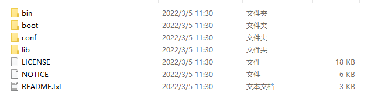
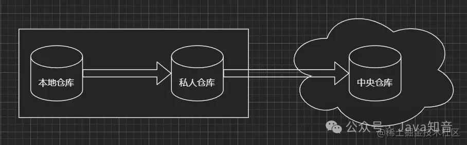
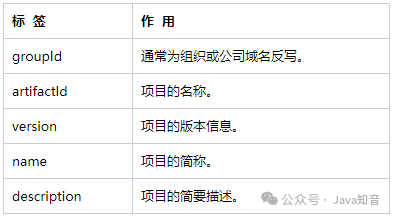
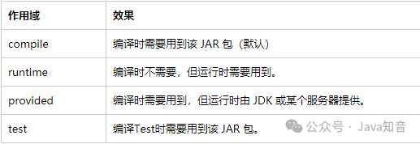
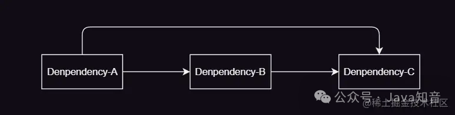
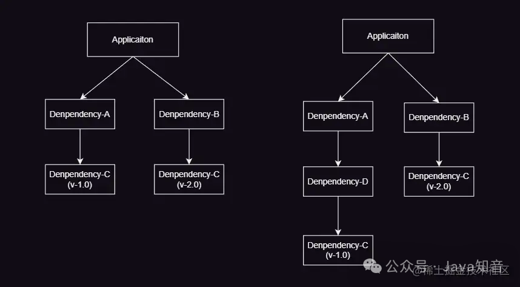
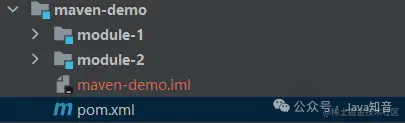
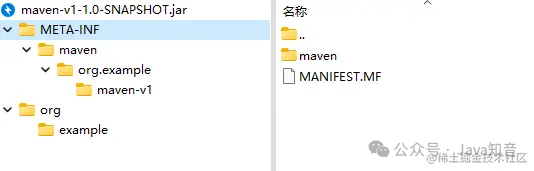
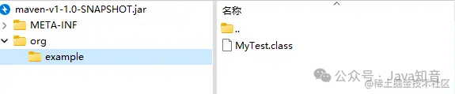
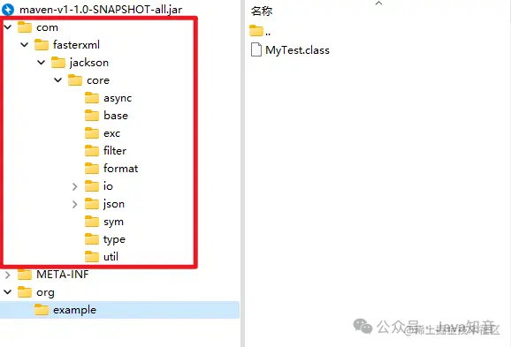

# maven自动化构建工具

[TOC]

#  简介

官网：`http://maven.apache.org/`

## 1.1 软技开发的阶段

需求分析：分析项目具体完成的功能，有什么要求，具体怎么实现。

设计阶段：根据分析结果，设计项目具体的使用什么项目，解决难点。

开发阶段：编码实现功能，编译代码，自我测试。

测试阶段：专业测试人员，测整个项目的功能是否符合设计要求，出一个测试报告。

##  1.2 maven能做什么

1. 项目的自动构建，帮助开发人员做项目代码的编译测试，打包，安装，部署等工作
2. 管理依赖

​    依赖：项目中需要使用的其他资源，常见的jar。

**构建**：项目的构建

构建是面向过程的，就是一些步骤，完成项目代码的编译，测试，运行，打包等等：maven支持的构建包括有

| 项目构建中的各个环节：清理、编译、测试、报告、打包、安装、部署 |
| :----------------------------------------------------------: |

1. 清理：把之前项目编译的东西删掉，为新编译的代码做准备
2. 编译：把程序源代码编译为可执行代码，`java-class` 文件批量的，maven可以同时把多个源文件编译为class文件，javac一次只能编译一个源文件。
3. 测试：maven可以执行测试程序代码，验证你的功能是否正确，maven可以同时执行多个测试文件。同时测试很多功能
4. 报告：生成测试结果的文件，测试通过没有
5. 打包：把你的项目中的所有的class文件，配置文件等所有资源放到一个压缩文件中，这个压缩文件就是项目的结果文件，通常java程序，压缩文件的扩展名是jar,对于web应用，压缩文件是.war
6. 安装：把5生成的文件`.jar.war`安装到本机仓库
7. 部署：把程序安装好可执行。

 ## 1.3 Maven 中的的概念

1. `POM` ：一个文件`pom`项目对象模型
2. 约定的目录结构：项目的目录和文件位置都是规定的
3. 坐标：是唯一的字符串，用来表示资源的。
4. 依赖管理：管理你的项目可以使用的jar文件
5. 仓库管理：你的资源存放的位置
6. 生命周期：maven构建项目的过程
7. 插件和目标：执行maven构建时使用的工具是插件
8. 继承
9. 聚合

## 1.4 Maven获取安装

安装：

1. 下载.zip文件。确定JAVA_HOME 安装目录
2. 解压缩到一个文件目录中。路径不要有中文，不要有空格
3. 吧maven安装目录下BIN的路径添加到path中
4. 测试maven的安装。在命令行执行 ==`mvn -v`==


###  1.4.1 maven解压后目录结构



`bin`：maven可执行文件，组要是`mvn.cmd`

`conf`：maven工具自己的配置文件,里面setting文件最重要

### 1.4.2 idea查看使用的maven是谁的，什么版本

1. file
2. Settings
3. 构建、
4. 自己的maven archetype需要自己创建骨架
5. 避免新建项目时使用的是ieda自己默认的maven
   * **Settings For New Projects**：新建项目设置

### 1.4.3 使用阿里云镜像

由于Maven自身的镜像库更新太慢，甚至失败，建议使用阿里与仓库
修改conf文件夹的settings.xml文件，找到`mirrors`,在里面加入下面的配置

```text
<mirror>
       <id>nexus-aliyun</id>
       <mirrorOf>*</mirrorOf>
       <name>Nexus aliyun</name>
       <url>http://maven.aliyun.com/nexus/content/groups/public</url>
</mirror>
```

# 2 maven的核心概念

## 2.1 约定的目录结构

maven大多数人遵循的目录结构，叫做约定目录结构。

一个maven项目是一个文件夹，比如项目叫做Hello。

```java
Hello 项目文件夹
    \src
         \main               叫做主程序目录（完成项目功能的代码和配置文件）
              \java          源代码（包和相关的类定义）
              \resources     配置文件
         \test...............放置测试程序代码的（开发人员自己写的测试代码）(可以没有)
              \java          测试代码的（junit）
              \resources     测试程序需要的配置文件
    \pom.xml                 maven的配置文件，核心文件（maven必须有的）
```

maven的使用方式

1) maven可以独立使用：创建项目，编译代码，测试程序，打包，部署等等
2)  maven和idea一起使用：通过idea借助maven，实现编码，测试，打包等等

编译main目录下所有的Java代码 `mvn compile`在根目录下使用;执行时需要在classes目录下面执行cmd

执行maven时会下载一些东西，因为maven工具执行的操做需要很多插件（下载的都是Java类），.jar文件在maven中叫做插件，插件是完成某些功能的，下载的东西默认存放在C:\Users\登录系统的用户名\\.m2\repository

中央仓库文件地址：Downloading

```
 https://repo.maven.apache.org/maven2/org/apache/maven/plugins/maven-resources-plugin/2.6/maven-resources-plugin-2.6.jar
```

出现BUILD SUCCESS表示插件下载成功

执行mvn compile结果在项目的根目录下生成target目录（结果目录）；maven编译的Java程序，最后的class文件都放在target目录中

## 2.2 修改本地仓库地址

1. 修改maven的配置文件，maven安装目录/conf/setting.xml
2. 先备份setstring.xml
3. 修改localRepository指定你的目录(不要中文目录)

```xml
<!-- 配置本地仓库-->
  <localRepository>D:/maven/mavenwarehouse</localRepository>
<!--D:/maven/mavenwarehouse本地仓库地址-->
```

## 2.3 仓库概念

1. 什么是仓库：仓库就是存放东西的，存放maven使用的jar和我们项目使用的jar

> > maven使用的插件（各种jar）
> >
> > 我项目使用的jar（第三方的工具）

2. 仓库的分类：

本地仓库，就是你的个人计算机上的文件夹，存放的各种jar

远程仓库，就是在互联网上的，需要使用网络才能使用的仓库

1. 中央仓库：最权威的，所有开发人员都共享的一个集中的仓库`http://repo.maven.apache.org`中央仓库地址
2. 中央仓库镜像：就是中央仓库的备份,在各大洲，重要城市都是镜像
3. 私服：在公司内部，在局域网中使用，不对外使用的。

仓库的使用：maven的使用不需要人为的参与

比如开发人员需要使用mysql驱动----->maven先查本地仓库（有就使用，没有就逐级向上查找）-------->私服(私服有就下载到本地仓库然后使用，没有就在相上查找)--------->镜像（镜像有就下载到私服在下载到本地仓库然后使用，没有就在相上查找）------------>中央仓库（中央仓库有就下载到镜像在下载到私服在下载到本地仓库然后使用）

## 2.4 `POM` 文件

```xml
<?xml version="1.0" encoding="UTF-8"?>
<project xmlns="http://maven.apache.org/POM/4.0.0" xmlns:xsi="http://www.w3.org/2001/XMLSchema-instance"
    xsi:schemaLocation="http://maven.apache.org/POM/4.0.0 http://maven.apache.org/maven-4.0.0.xsd">
    <modelVersion>4.0.0</modelVersion>
    <groupId>com.bjpowernode</groupId>
    <artifactId>ch01-maven</artifactId>
    <version>0.0.1-SNAPSHOT</version>
    <dependencies>
         <dependency>
              <groupId>junit</groupId>
              <artifactId>junit</artifactId>
              <version>4.11</version>
         </dependency>
    </dependencies>
<build>
     <!--配置插件-->
     <plugins>
          <!--配置具体的插件-->
          <plugin>
              <groupId>org.apache.maven.plugins</groupId>
              <!--插件的名称-->
              <artifactId>maven-compiler-plugin</artifactId>
              <!--插件的版本-->
              <version>3.8.1</version>
              <!--配置插件的信息-->
              <configuration>
                   <!--告诉Maven我们写的代码是在jdk1.8上编译的-->
                   <source>1.8</source>
                   <!--我们的程序应该运行在1.8的jdk上-->
                   <target>1.8</target>
              </configuration>
          </plugin>
     </plugins>
</build>
</project>
```

即Project Object Model项目对象模型,maven把项目当作模型处理，是一个pom.xml文件pom.xml是maven的灵魂

`pom`初识

<table>
    <tr><td colspan="3">基本信息</td></tr>
    <tr>
        <td>modelVersion</td>
        <td colspan="2">Mavem的版本，对于Maven2和Maven3来说他只能是4.0.0</td>
    </tr>
    <tr>
        <td>groupId</td>
        <td>组织id，一般为公司域名倒写。格式可以为：1.域名倒写。2.域名倒着写加项目名</td>
        <td rowspan="3">groupId、artifactId、version三个元素生成一个Maven的坐标，在众多Maven项目中可以唯一定位到某一个项目。坐标也决定着将来项目在仓库中的路径即名称
    </tr>
    <tr>
        <td>artifactId</td>
        <td>项目名称，也是模块名称，对应groupId中的子项目</td>
    </tr>
    <tr>
    <td>version</td>
    <td>项目的版本号。如果项目还在开发中，是不稳定版本，通常在版本后带—SNAPSHOTversion使用三位数字标识，例如1.1.0</td>
    </tr>
    <tr>
        <td>packaging</td>
        <td colspan="2">项目打包的类型，可以使jar、war、rar、ear、pom、默认jar</td>
    </tr>
    <tr><td colspan="3">依赖</td></tr>
    <tr>
        <td>dependencies和dependency</td>
        <td colspan="2">Maven的一个重要作用就是管理jar包,为了一个项目可以构建或运行,项目中不可避免的,会依赖很多其他的jar包,在Maven中,这些jar就被称为依赖,使用标签dependency来配置。而这种依赖的配置正是通过坐标来定位的,由此我们也不难看出,maven把所有的jar包也都视为项目存在了。</td>
    </tr>
    <tr><td colspan="3">配置属性</td></tr>
    <tr>
        <td>properties</td>
        <td colspan="2">properties 是用来定义-些配置属性的,例如project.build.sourceEncoding (项目构建源码编码方式),可以设置为,UTF-8,防止中文乱码,也可定义相关构建版本号,便于日后统一升级。</td>
    </tr>
    <tr><td colspan="3">构建</td></tr>
    <tr>
        <td>build</td>
        <td colspan="2">build表示与构建相关的配置,例如设置编译插件的jdk版本</td>
    </tr>
    <tr><td colspan="3">继承</td></tr>
    <tr>
        <td>packaging</td>
        <td colspan="2">项目打包的类型，可以使jar、war、rar、ear、pom、默认jar</td>
    </tr>
    <tr><td colspan="3">聚合</td></tr>
    <tr>
        <td>packaging</td>
        <td colspan="2">项目打包的类型，可以使jar、war、rar、ear、pom、默认jar</td>
    </tr>
</table>
**坐标**：唯一值吗，在互联网上唯一标识一个项目的 

```xml
<groupId>公司域名的倒写</groupId>
<artifactId>自定义项目名称</artifactId>
<version>自定义版本号</version>
```

`https://mvnrepository.com/`搜索使用的中央仓库，使用groupId或者artifactId做为搜索条件

packaging打包后的后缀名，默认jar

**依赖**：你的项目的中要使用的各种资源说明

```xml
<dependencies>
    <!--依赖相当于Java代码中的import-->
    <dependency>
        <groupId>mysql</groupId>
        <artifactId>mysql-connector-java</artifactId>
        <version>5.1.9</version>
    </dependency>
</dependencies>
```

**properties**：设置属性

```xml
<properties><!--测试属性的-->
    <java.version>1.8</java.version>
    <!--告诉maven jdk 使用的版本-->
    <maven.compiler.source>1.8</maven.compiler.source>
    <maven.compiler.target>1.8</maven.compiler.target>
</properties>
```

**build**:maven在进行项目构建时配置信息，例如指定编译Java代码使用的jdk的版本

### 2.4.1 maven的生命周期

就是maven构建项目的过程，清理编译，测试，报告，打包，安装，部署，

### 2.4.2 maven的命令

maven独立使用，通过命令，完成maven生命周期的执行

maven可以使用命令完成项目的清理，编译，测试等等

* mvn clean`清理`:会删除原来编译和测试的目录，即target目录，但是已经install到仓库里的包不会删除
* mvn compile`编译主程序`:会在当前目录下生成一个target，里面存放编译主程序之后的字节码文件
* mvn test-compile`编译测试程序`:会在当前目录下生成一个target,里面存放编译测试程序之后生成的字节码文件
* mvn test`测试`:会生成一个目录surefire-reports,保存测试结果
* mvn package`打包主程序`:会编译、编译测试、测试、并且按照pom.xml配置把主程序打包生成jar或者是war包
* mvn install`安装主程序`:会把本工程打包，并按照本工程的坐标保存到本地仓库中
* mvn deploy`部署主程序`:会把本工程打包，按照工程的坐标保存到本地库中，并且还会保存到私服仓库中。还会自动把项目部署到web容器中

执行上述命令必须在命令行进入pom.xml所在目录

`mvn compile`只编译main/java下的目录`mvn test-compile`编译test/Java下的`mvn test`执行test/Java下的目录

==mvn compile编译main/java目录下的Java为class文件，同时把class拷贝到target/class目录下面，把main/resources目录下的所有文件都拷贝到target/classes目录下==

### 2.4.3 插件

maven命令执行时，真正完成功能的是插件，插件就是一些jar文件，一些类

**单元测试**（测试方法）：用的是junit，junit是一个专门测试的框架（工具）。

junit测试的内容：测试的是类中的方法，每一个方法都是独立测试的，方法是测试的基本单位（单元）。

maven是借助单元测试，批量的测试你类中的方法是否符合预期。

**使用步骤**：1. 加入依赖，在单元测试中加入单元测试依赖

```xml
<dependency>
    <groupId>junit</groupId>
    <artifactId>junit</artifactId>
    <version>4.11</version>
    <scope>test</scope><!--<scope>compile</scope>设置在编译时运行-->
</dependency>
```

2. 在maven项目中的src/test/java目录下，创建测试程序

推荐的创建类和方法的提示：

1. 测试类的名称 是Test+你要测试的类名
2. 测试的方法名称：Test + 方法名称

例如：你要测试HelloMaven

```java
//测试类
public class TestHelloMaven{
    @test
    public void TestaddNumber(){
        
    }
}
/**TestAdd叫做测试方法，他的定义规则
    1.方法是public的，必须的
    2.方法没有返回值，必须的
    3.方法名称是自定义的，推荐Test + 方法名称
    4.方法的上面要加入@test
    **/
```

mvn compile编译main/java

maven执行测试阶段时前面都执行

测试报告生成在：D:\Users\lisuxin\mavenwork\Holle\target\surefire-reports

打包：也就是压缩文件的制作过程，打包只有src/main下面的东西

安装：是部署到你的本地仓库中去了

**build**:maven构建项目的参数设置

==编译器插件的目标绑定到构建生命周期中的相应阶段。因此，要编译源代码，您只需要告诉专家，直到执行哪个生命周期。以下内容将编译您的源代码==

==如果您的源代码使用非默认编码，则可以使用 `sourceEncoding` 参数来告诉 Maven 在读取 java 源代码时要使用哪种编码。另请注意排除要忽略的源的功能。==

```xml
<!--控制配置maven构建项目参数的设置，设置jdk的版本-->
<build>
     <!--配置插件-->
     <plugins>
          <!--配置具体的插件-->
          <plugin>
              <groupId>org.apache.maven.plugins</groupId>
              <!--插件的名称-->
              <artifactId>maven-compiler-plugin</artifactId>
              <!--插件的版本-->
              <version>3.8.1</version>
              <!--配置插件的信息-->
              <configuration>
                   <!--告诉Maven我们写的代码是在jdk1.8上编译的-->
                   <source>1.8</source>
                   <!--我们的程序应该运行在1.8的jdk上-->
                   <target>1.8</target>
              </configuration>
          </plugin>
     </plugins>
</build>
```

配置jdk有两种方式

您可能需要将某个项目编译为与当前使用的版本不同的版本。`javac` 可以使用 `-source 和 -``target` 接受此类命令。编译器插件也可以配置为在编译期间提供这些选项。

例如，如果要使用 Java 8 语言功能部件 （`-source 1.8`），并且还希望编译的类与 JVM 1.8 （`-target 1.8`） 兼容，则可以添加以下两个属性，它们是插件参数的缺省属性名称：

一、

```xml
<configuration>
    <!--告诉Maven我们写的代码是在jdk1.8上编译的-->
    <source>1.8</source>
    <!--我们的程序应该运行在1.8的jdk上-->
    <target>1.8</target>
</configuration>
```

二、

```xml
<project>
  <properties>
    <maven.compiler.source>1.8</maven.compiler.source>
    <maven.compiler.target>1.8</maven.compiler.target>
  </properties>
</project>
```

# 在IDEA中使用Maven

1. idea中内置了maven，一般不使用内置的，因为内置maven设置不方便，使用自己安装的maven，需要覆盖idae中的默认设置。让idea指定maven安装位置等信息。

配置入口file下

* Settings当前工程生效

* Othere Settings为以后工程生效

file------>Setting------->Build,Execution,Deployment------------->Bulid Tools----------->Maven

* Maven home directory:==Maven的安装目录==
* User setting file==用户的配置文件，就是maven安装目录下conf/setting.xml配置文件==
* Local repository==本地仓库的信息，本地仓库的目录位置==

Maven--->Runner

> VM Options:archetpyteCatalog=internal//为了下载maven模板时速度更快
> 
> jer:你项目的jdk

maven项目创建时，会联网下载模板文件，比较大，使用archetpyteCatalog=internal，不用下载，创建maven速度快

## 3.1 在idea中创建javase项目

使用模板创建项目


**-DarchetypeCatalog=internal**

**普通java项目的模板**


## 3.2 在idea中创建web项目

1. 使用骨架方式

   1. 在idea中骨架创建的结构？

      1. 骨架可以更快速的给我们创建出项目结构，idea给我们提供了很多的骨架模板，这样说大家还是不太理解。通俗来说就是用它可以更快的生成项目项目结构：
      2. 我们用了骨架以后还是发现距离一个完整的项目结构还差了一些东西：Maven Web项目缺失的目录结构，没有java和resources目录，需要手动完成创建补齐

   2. 使用骨架方式步骤

      1. 创建Maven项目，给项目取好名字

      2. 选择自己下载的jdk版本

      3. 选择使用Web项目骨架

      4. 确认Maven相关的配置信息

      5. 完成项目创建

      6. 删除pom.xml中多余内容，只留下面的这些内容，注意打包方式 jar和war的区别

         ```java
         <?xml version="1.0" encoding="UTF-8"?>
         <project xmlns="http://maven.apache.org/POM/4.0.0"
                  xmlns:xsi="http://www.w3.org/2001/XMLSchema-instance"
                  xsi:schemaLocation="http://maven.apache.org/POM/4.0.0 http://maven.apache.org/xsd/maven-4.0.0.xsd">
             <modelVersion>4.0.0</modelVersion>
         
             <groupId>org.example</groupId>
             <artifactId>glwc</artifactId>
             <version>1.0-SNAPSHOT</version>
             <packaging>war</packaging>
         
             <properties>
                 <maven.compiler.source>17</maven.compiler.source>
                 <maven.compiler.target>17</maven.compiler.target>
             </properties>
         
         </project>
         ```

      7. 目录结果如下：

      8. 补齐Maven Web项目缺失的目录结构，默认没有java和resources目录

      9. 需要手动完成创建补齐

      10. 创建成功

2. 不使用骨架的方式

   1. 不选择骨架创建的结构？个人推荐使用不用骨架的创建方式
   2. 无骨架创建方式也是需要一些步骤去补全的，仅仅是上图并未完成一个完整的项目创建，下图是我经过操作以后创建成功的项目结构：
   3. 不使用骨架步骤
      1. 创建Maven项目
      2. 选择不使用Web项目骨架，选择本地的jdk
      3. 完成项目的创建
      4. 在pom.xml设置打包方式为war
      5. 补齐Maven Web项目缺失webapp的目录结构
      6. 补充完后，调整一下项目结构，最终的项目结构如下:


## maven报错

1. 使用Maven打包项目的时候，出现错误:`webxml attribute is required (or pre-existing WEB-INF/web.xml if executing in update)`

2. 解决方案

   1. 方案一：

      ```xml
      <!--maven打包war支持依赖-->
          <build>
              <plugins>
                  <plugin>
                      <groupId>org.apache.maven.plugins</groupId>
                      <artifactId>maven-war-plugin</artifactId>
                      <version>3.3.2</version>
                      <!--不检擦是否有web.xml-->
                      <configuration>
                          <failOnMissingWebXml>false</failOnMissingWebXml>
                      </configuration>
                  </plugin>
              </plugins>
          </build>
      ```
      

### 中文乱码

1. 在idea中==Settings==-->==maven==--->===Runner==--->==VM Option==添加以下

```xml
-Dfile.encoding=GB2312
```

要更改Maven的默认平台编码为UTF-8，你可以通过设置环境变量的方式来实现。以下是具体步骤：

#### 设置 MAVEN_OPTS 环境变量

1. **打开环境变量设置**：

   - 在Windows上，右键点击“此电脑”或“计算机” > 选择“属性” > “高级系统设置” > “环境变量”。
   - 在Linux或MacOS上，编辑bash_profile或者profile文件，通常位于`~/.bash_profile`或`~/.profile`。

2. **新建或编辑 MAVEN_OPTS 变量**：

   - **新建**：如果不存在`MAVEN_OPTS`变量，点击“新建”按钮，变量名输入`MAVEN_OPTS`。
   - **编辑**：如果已存在，选中它并点击“编辑”。

3. **设置变量值**：
   输入以下值作为变量值：

   ```
   -Xms256m -Xmx512m -Dfile.encoding=UTF-8
   ```

   这里，`-Xms`和`-Xmx`是Java虚拟机的内存设置，分别代表初始内存和最大内存；`-Dfile.encoding=UTF-8`则指定了文件编码为UTF-8。

4. **保存并退出**：完成设置后，保存你的更改并关闭所有窗口。

5. **重启终端或命令提示符**：为了使新设置生效，需要关闭并重新打开你的命令行工具。

#### 验证设置

- 打开命令行工具，输入 `mvn -version` 命令，检查输出的信息中是否包含了UTF-8编码设置。这可以帮助确认Maven是否已正确应用了新的编码配置。

#### 修改 pom.xml

除了环境变量外，你还可以在项目的`pom.xml`文件中指定源代码和资源文件的编码，以确保Maven编译时使用正确的编码。在`<build>`标签内添加如下配置：

```xml
<build>
    <plugins>
        <plugin>
            <groupId>org.apache.maven.plugins</groupId>
            <artifactId>maven-compiler-plugin</artifactId>
            <version>3.8.1</version> <!-- 使用实际的最新版本 -->
            <configuration>
                <source>1.8</source> <!-- 指定JDK源代码版本 -->
                <target>1.8</target> <!-- 指定目标JDK版本 -->
                <encoding=UTF-8</encoding> <!-- 指定编译编码 -->
            </configuration>
        </plugin>
    </plugins>
</build>
```

确保这些步骤后，Maven应该会使用UTF-8作为默认的平台编码，从而避免中文乱码等问题。

# POM

```xml
<?xml version="1.0" encoding="UTF-8"?>
<project xmlns="http://maven.apache.org/POM/4.0.0"
         xmlns:xsi="http://www.w3.org/2001/XMLSchema-instance"
         xsi:schemaLocation="http://maven.apache.org/POM/4.0.0 http://maven.apache.org/xsd/maven-4.0.0.xsd">
    <modelVersion>4.0.0</modelVersion>
    <!--当前项目版本-->
    <groupId>org.glwc</groupId>
    <artifactId>glwc</artifactId>
    <version>1.0-SNAPSHOT</version>
    <packaging>war</packaging>

    <dependencies>
        <!--spring的依赖-->
        <dependency>
            <groupId>org.springframework</groupId>
            <artifactId>spring-context</artifactId>
            <version>6.0.5</version>
        </dependency>
        <!--AOP增强方法的依赖、面向切面编程、动态代理-->
        <dependency>
            <groupId>org.aspectj</groupId>
            <artifactId>aspectjweaver</artifactId>
            <version>1.9.20.1</version>     
            <scope>runtime</scope>
        </dependency>
        <!--spring集成web-->
        <dependency>
            <groupId>org.springframework</groupId>
            <artifactId>spring-web</artifactId>
            <version>6.1.7</version>
        </dependency>
        <!--spring的单元测试-->
        <dependency>
            <groupId>org.springframework</groupId>
            <artifactId>spring-test</artifactId>
            <version>6.1.7</version>
            <scope>test</scope>
        </dependency>
        <!--springMvc的依赖-->
        <dependency>
            <groupId>org.springframework</groupId>   
            <artifactId>spring-webmvc</artifactId>  
            <version>6.1.7</version>    
        </dependency>
        <!--导入JSON格式转换工具-->
        <dependency>
            <groupId>com.fasterxml.jackson.core</groupId>
            <artifactId>jackson-core</artifactId>
            <version>2.14.0</version>
        </dependency>
        <dependency>
            <groupId>com.fasterxml.jackson.core</groupId>
            <artifactId>jackson-databind</artifactId>
            <version>2.14.0</version>
        </dependency>
        <dependency>
            <groupId>com.fasterxml.jackson.core</groupId>
            <artifactId>jackson-annotations</artifactId>
            <version>2.14.0</version>
        </dependency>
        <!--junit测试包-->
        <dependency>
            <groupId>junit</groupId>
            <artifactId>junit</artifactId>
            <version>4.13.2</version>
            <scope>test</scope>
        </dependency>
        <!--mysql驱动-->
        <dependency>
            <groupId>mysql</groupId>
            <artifactId>mysql-connector-java</artifactId>
            <version>8.0.28</version>
        </dependency>
        <!--C3P0数据源-->
        <dependency>
            <groupId>com.mchange</groupId>
            <artifactId>c3p0</artifactId>
            <version>0.9.5.5</version>
        </dependency>
        <!--druid数据源-->
        <dependency>
            <groupId>com.alibaba</groupId>
            <artifactId>druid</artifactId>
            <version>1.2.17</version>
        </dependency>
        <!--Spring集成junit-->
        <dependency>
            <groupId>org.springframework</groupId>
            <artifactId>spring-test</artifactId>
            <version>6.0.7</version>
            <scope>test</scope>
        </dependency>
        <!--10以上tomcat使用-->
        <!--TomcatApi-->
        <dependency>
            <groupId>org.apache.tomcat</groupId>
            <artifactId>tomcat-servlet-api</artifactId>
            <version>10.0.2</version>
        </dependency>
        <!--TomcatJsp-->
        <dependency>
            <groupId>org.apache.tomcat</groupId>
            <artifactId>tomcat-jsp-api</artifactId>
            <version>10.0.2</version>
        </dependency>
        <!--文件上传需要的坐标-->
        <dependency>
            <groupId>commons-fileupload</groupId>            
            <artifactId>commons-fileupload</artifactId>      
            <version>1.5</version>   
        </dependency>  
        <dependency>      
            <groupId>commons-io</groupId>    
            <artifactId>commons-io</artifactId>      
            <version>2.16.0</version>   
        </dependency>
        <!-- 适用于 Jakarta EE 10 的servlet-->
        <dependency>
            <groupId>jakarta.servlet</groupId>
            <artifactId>jakarta.servlet-api</artifactId>
            <version>6.0.0</version> 
            <scope>provided</scope>
        </dependency>
        <!--Jdbc Template的依赖坐标-->
        <dependency>
            <groupId>org.springframework</groupId>
            <artifactId>spring-tx</artifactId>      
            <version>6.1.7</version>    
        </dependency>    
        <dependency>      
            <groupId>org.springframework</groupId>    
            <artifactId>spring-jdbc</artifactId>     
            <version>6.1.7</version>  
        </dependency>
        <!--日志依赖-->            
        <dependency>
            <groupId>log4j</groupId>
            <artifactId>log4j</artifactId>
            <version>1.2.17</version>
        </dependency>
        <!--mybatis依赖-->  
        <dependency>      
            <groupId>org.mybatis</groupId>    
            <artifactId>mybatis</artifactId>      
            <version>3.5.15</version>    
        </dependency>
        <!--    PageHelper 是将分页的复杂的操作进行封装-->
        <dependency>      
            <groupId>com.github.pagehelper</groupId>      
            <artifactId>pagehelper</artifactId>      
            <version>6.0.0</version>    
        </dependency>
        <!--    分页助手解析器、版本尽量低一点-->    
        <dependency>      
            <groupId>com.github.jsqlparser</groupId>      
            <artifactId>jsqlparser</artifactId>      
            <version>0.9.1</version>
        </dependency>
        <!--    mybatis整合spring-->
        <dependency>
            <groupId>org.mybatis</groupId>
            <artifactId>mybatis-spring</artifactId>
            <version>3.0.1</version>
        </dependency>
    </dependencies>
    
    <!--maven打包war支持依赖-->
    <build>
        <plugins>
            <plugin>
                <groupId>org.apache.maven.plugins</groupId>
                <artifactId>maven-war-plugin</artifactId>
                <version>3.3.2</version>
                <!--不检擦是否有web.xml-->
                <configuration>
                    <failOnMissingWebXml>false</failOnMissingWebXml>
                </configuration>
            </plugin>
        </plugins>
    </build>
<!--编译器就会在编译过程中保存方法参数的名称信息-->
      <build>
    <plugins>
      <plugin>
        <groupId>org.apache.maven.plugins</groupId>
        <artifactId>maven-compiler-plugin</artifactId>
        <version>3.8.1</version>
        <configuration>
          <source>1.8</source>
          <target>1.8</target>
          <compilerArgs>
            <arg>-parameters</arg>
          </compilerArgs>
        </configuration>
      </plugin>
    </plugins>
  </build>


    <properties>
        <maven.compiler.source>17</maven.compiler.source>
        <maven.compiler.target>17</maven.compiler.target>
    </properties>

</project>
```

## Archetype选择

在Maven中创建一个J2EE项目并打算使用Spring框架，你可以选择以下几种Archetype之一：

1. **maven-archetype-j2ee-simple** 这个Archetype提供了一个基础的J2EE项目结构，它包含了基本的Web应用程序目录结构和一些必要的配置文件。但是，这个Archetype本身不会直接包含Spring框架的依赖或配置，你需要手动添加Spring的依赖并在`pom.xml`中配置。
2. **Spring Boot Starter Parent** 虽然Spring Boot不是传统的J2EE Archetype，但它非常适合快速搭建基于Spring的Web应用程序。Spring Boot提供了大量的自动化配置，使得开发者能够快速地开始编码而不必处理复杂的部署和配置细节。你可以选择创建一个Spring Boot项目，然后配置它以适应J2EE环境的需求。
3. **自定义Archetype** 如果以上Archetype都不能满足你的需求，你可以考虑创建自己的Archetype，或者找到一个更接近你需求的Archetype并进行修改。自定义Archetype可以包含Spring的依赖和一些预配置的Spring上下文文件，比如`applicationContext.xml`或基于注解的配置类。


# 详细使用

Maven 是一个项目管理工具，可以对 Java 项目进行构建、依赖管理。

## 一、基础配置

##### 1. 仓库配置

在 Maven 中引入了仓库的概念，开发人员将所编写的 JAR 按照相应格式推送到仓库中，当其他开发者需要引用这个 jar 包时在工程中引用相应依赖，则会先从中央仓库进行下载到本地仓库，此时项目将读取本地仓库的内容。

对于部分组织或机构通常会在此基础上额外搭建私人仓库，在引用依赖时会先从私人仓库进行读取，如果未找到再从中央仓库下载至私人仓库，最后再下载到本地仓库。



通过这种方式开发者则无需再手动管理繁杂的项目 JAR 包，从而实现更高的效率。

##### 2. 基本信息

一个最基本的 Maven 项目通常应包含如下内容，当我们引用一个模块时，也是通过 `groupId`、 `artifactId`、 `version` 三项内容进行确定。



下面是一个基本定义示例：

```
<?xml version="1.0" encoding="UTF-8"?>
<project ...>
    <!-- 固定 4.0.0, 指定了当前 POM 模型的版本 -->
    <modelVersion>4.0.0</modelVersion>

    <groupId>xyz.ibudai</groupId>
    <artifactId>maven-demo</artifactId>
    <version>1.0.0-SNAPSHOT</version>
    <version>maven demo</version>
    <description>This is maven demo.</description>
    
</project>
```

## 二、依赖管理

##### 1. 依赖引入

通过 `dependencies` 标签我们即可导入所需要的工程依赖。

```
<dependencies>
    <dependency>
        <groupId>mysql</groupId>
        <artifactId>mysql-connector-java</artifactId>
        <version>8.0.27</version>
        <scope>runtime</scope>
    </dependency>
</dependencies>
```

其中 `scope` 的可选值如下：



##### 2. 间接依赖

当项目需要引用到其它依赖时，只需指定所依赖的工程的基本信息即可，剩下的一切都交给 Maven 处理。即便是所要依赖的工程依赖了其它工程，我们也只需引入项目所直接的依赖的工程。

如下图示例中 `Dependency-A` 引用了 `Dependency-B` ，而 `Dependency-B` 又依赖于 `Dependency-C` ，在传统项目中若在 `Dependency-A` 中引用 `Dependency-B` 则需要同时手动添加 `Dependency-B` 与 `Dependency-C` 所对应的 JAR 包，但在 Maven 中我们只需要引入 `Dependency-B` 即可， Mavne 会自动将子模块所依赖的包导入。



**依赖顺序**

在 maven 工程中遵循先定义先导入的原则，即当存在多个相同间接依赖，优先导入其父依赖定义在前的简洁依赖。

举个例子，如工程中引入 `Dependency-A` 与 `Dependency-B` 两个依赖，二者又分别引用了不同版本的 `Dependency-C` ，但对于 Maven 而言最终编译时同一个依赖即便是不同的版本也只会选择一份。

其计算规则如下：若 `Dependency-A` 定义在 `Dependency-B` 之前则最终将导入 `Dependency-A` 中的 C-1.0 版本。而在右侧图例中虽然 `Dependency-A` 引入优先级高于 `Dependency-B` ，但是 C-2.0 的间接依赖层级高于 C-1.0，因此将导入 C-2.0 版本。



##### 3. 依赖排除

在引用多个模块时可能会发生版本兼容冲突问题，通过 `excludes` 标签即可实现依赖排除。

如下我们在工程中引入了 `demo-a` 依赖，但其又引用 `dependency-b` 依赖，如想要在当前工程中移除 `dependency-b` 依赖，此时即可通过 `excludes` 标签将 `dependency-b` 排除依赖。

```
<dependencies>
    <dependency>
        <groupId>xyz.ibudai</groupId>
        <artifactId>demo-a</artifactId>
        <version>1.0.0</version>
        <excludes>
            <exclude>
                <groupId>xyz.ibudai</groupId>
                <artifactId>dependency-b</artifactId>
                <version>1.0.0</version>
            </exclude>
        </excludes>
    </dependency>
</dependencies>
```

除了手动通过 `excludes` 标签排除依赖，被引模块也可以在导入依赖时通过 `optional` 标签禁用依赖传递。

上述示例中若在 `demo-a` 工程中引入 `dependency-b` 依赖时添加 `optional` 标签，那么其它工程在引入 `demo-a` 依赖时将不会将  `dependency-b` 作为间接依赖导入。

```
<dependencies>
    <dependency>
        <groupId>xyz.ibudai</groupId>
        <artifactId>demo-b</artifactId>
        <version>1.0.0</version>
        <optional>true</optional>
    </dependency>
</dependencies>
```

##### 4. 变量配置

当项目中引入了大量依赖，为了方便管理通常将引入依赖的版本通过变量进行统一配置，从而实现更直观的依赖管理。

通过 `properties` 标签即可自定义变量配置，然后使用 `${}` 引用变量。

```
<properties>
    <mysql.version>8.0.30</mysql.version>
    <junit.version>4.13.2</junit.version>
</properties>

<dependencies>
    <dependency>
        <groupId>mysql</groupId>
        <artifactId>mysql-connector-java</artifactId>
        <!-- 使用 "${}" 引用上述自定义变量 -->
        <version>${mysql.version}</version>
    </dependency>
    <dependency>
        <groupId>junit</groupId>
        <artifactId>junit</artifactId>
        <version>${junit.version}</version>
    </dependency>
</dependencies>
```

## 三、模块配置

##### 1. 模块管理

当我们项目包含多个子项目时，通过 `modules` 标签即可实现模块管理。

```
<!-- maven-demo pom.xml -->
<modules>
    <module>module-1</module>
    <module>module-2</module>
</modules>
```

如下在 `maven-demo` 中又包含了 `module-1` 和 `module-2` 两个工程。



##### 2. 模块继承

通过 `parent` 即可标记当前模块的父模块，且子模块将会继承父模块中的所有依赖配置。子模块若没有指定的 `groupId` 和 `version` 默认继承父模块中的配置。

其中 `relativePath` 用于指定父模块的 POM 文件目录，省略时默认值为 `../pom.xml` 即当前目录的上一级中，若仍未找到则会在本地仓库中寻找。

```
<!-- module-1 pom.xml -->
<parent>
    <groupId>xyz.ibudai</groupId>
    <artifactId>maven-demo</artifactId>
    <version>1.0-SNAPSHOT</version>
    <relativePath>../pom.xml</relativePath>
</parent>

<artifactId>module-1</artifactId>
```

## 四、统一管理

##### 1. 依赖管理

当一共项目包含多个模块，且多个模块引用了相同依赖时显然重复引用是不太合适的，而通过 `dependencyManagement` 即可很好的解决依赖共用的问题。

将项目依赖统一定义在父模块的 `dependencyManagement` 标签中，子模块只需继承父模块并在 `dependencies` 引入所需的依赖，便可自动读取父模块 `dependencyManagement` 所指定的版本。

`dependencyManagement` 既不会在当前模块引入依赖，也不会给其子模块引入依赖，但其可以被继承的，只有在子模块下同样声明了该依赖，才会引入到模块中，子模块中只需在依赖中引入 `groupId` 与 `artifactId` 即可, 也可以指定版本则会进行覆盖。

##### 2. 模块示例

接下来以下图中的模块层级关系进行举例：


**maven-demo**

在 `maven-demo` 的 `dependencyManagement` 定义 `mysql` 和 `junit` 两个依赖。

```
<dependencyManagement>
    <dependencies>
        <dependency>
            <groupId>mysql</groupId>
            <artifactId>mysql-connector-java</artifactId>
            <version>8.0.30</version>
        </dependency>
        <dependency>
            <groupId>junit</groupId>
            <artifactId>junit</artifactId>
            <version>4.13.2</version>
        </dependency>
    </dependencies>
</dependencyManagement>
```

**module-1**

在 `module-1` 中继承 `maven-demo` 工程，引入 mysql，无需指定版本，将会自动读取父模块中 `dependencyManagement` 中所指定的版本。当然你也可以选择指定版本，则将会进行覆盖，但并不建议这么操作，将提高项目维护难度。

`module-1` 的 pom 文件内容如下：

```
<parent>
    <groupId>xyz.ibudai</groupId>
    <artifactId>maven-demo</artifactId>
    <version>1.0-SNAPSHOT</version>
</parent>

<dependencies>
    <dependency>
        <groupId>mysql</groupId>
        <artifactId>mysql-connector-java</artifactId>
    </dependency>
</dependencies>
```

**module-2**

在 `module-2` 配置同 `module-1`，通过 `dependencyManagement` 我们即实现了项目依赖版本的统一管理。

```
<parent>
    <groupId>xyz.ibudai</groupId>
    <artifactId>maven-demo</artifactId>
    <version>1.0-SNAPSHOT</version>
</parent>

<dependencies>
    <dependency>
        <groupId>junit</groupId>
        <artifactId>junit</artifactId>
    </dependency>
</dependencies>
```

##### 3. 依赖导入

上面介绍了如何通过 `dependencyManagement` 实现全局的依赖版本管理，但如果工程中的两个子模块都需要配置相同的 `dependencyManagement` 配置时，当然你可以选择通过继承父模块来实现，也可以用笨办法直接复制粘贴一份。

在上述的 `maven-demo` 创建同级模块 `maven-demo1` ，如果要实现 `maven-demo` 中配置的 `dependencyManagement` 则在其 `dependencyManagement` 配置中导入 `maven-demo` 并将 `scope` 设置为 `import`，并将 `type` 设置为 `pom`。

通过导入即可实现更轻量化的模块信息继承，具体配置内容如下：

```
<dependencyManagement>
    <dependencies>
        <dependency>
            <groupId>xyz.ibudai</groupId>
            <artifactId>maven-demo</artifactId>
            <version>1.0.0-SNAPSHOT</version>
            <!-- 导入目标模块的 dependencyManagement -->
            <!-- 依赖范围为 import -->
            <scope>import</scope>
            <!-- 类型一般为 pom -->
            <type>pom</type>
        </dependency>
    </dependencies>
</dependencyManagement>
```

## 五、插件管理

经过前面的介绍相信对于 Maven 你已经有了一个初步的了解，但 Maven 除了依赖管理之外提供一系列强大的插件，插件对于 Maven 而言可谓时左膀右臂但却经常被人忽略。

今天就让我介绍一下 Maven 中常用的构建插件。

##### 1. Jar

在使用 Java 开发时通常情况下我们都会将工程打包为 JAR 文件，首先了解一下 JAR 的文件结构。

下图即为通过 Maven 打包后的 JAR 文件，其中 `org.example` 目录为工程中定义的包名，存在编译后的 `.class` 文件， `META-INF` 目录用于存放工程的元数据信息。



如上图中 `META-INF` 下的 `MANIFEST.MF` 文件内容如下：

```
Manifest-Version: 1.0
Archiver-Version: Plexus Archiver
Built-By: great
Created-By: Apache Maven 3.6.3
Build-Jdk: 1.8.0_202
```

而通过 `maven-jar-plugin` 插件我们即可在添加额外信息至打包后的 JAR 文件，插件配置信息如下：

```
<plugin>  
    <groupId>org.apache.maven.plugins</groupId>  
    <artifactId>maven-jar-plugin</artifactId>  
    <version>2.3.1</version>  
    <configuration>  
        <archive>  
            <manifest>  
    <mainClass>org.example.MyTest</mainClass> 
                <addDefaultSpecificationEntries>true</addDefaultSpecificationEntries>
    <addDefaultImplementationEntries>true</addDefaultImplementationEntries> 
            </manifest>
            <!-- 配置额外属性信息 -->
            <manifestEntries>  
                <Plugin-Id>demo-plugin</Plugin-Id>  
                <Plugin-Version>1.0.0</Plugin-Version>  
            </manifestEntries>  
        </archive>  
    </configuration>  
</plugin>
```

在之前的工程 POM 文件中添加上述构建插件重新进行打包，可以看到 `MANIFEST.MF` 文件中即添加了我们配置的额外属性。

```
Manifest-Version: 1.0
Archiver-Version: Plexus Archiver
Created-By: Apache Maven
Built-By: great
Build-Jdk: 1.8.0_202
# Specification entries
Specification-Title: maven-v1
Specification-Version: 1.0-SNAPSHOT
# Implementation entries
Implementation-Title: maven-v1
Implementation-Version: 1.0-SNAPSHOT
Implementation-Vendor-Id: org.example
# Manifest
Main-Class: org.example.MyTest
# ManifestEntries
Plugin-Id: demo-plugin
Plugin-Version: 1.0.0
```

##### 2. Assembly

在普通 Maven 工程打包时默认仅会编译工程中新建的 java 文件并存储其 `.class` 文件，对于 `POM` 文件中引用的第三方依赖并不会一同打包。

如新建一个 Maven 工程并在依赖中导入 `Jackson` 依赖库并进行打包编译，可以看到下图编译后的 JAR 文件中只有工程中新建的 `MyTest.class` 文件，项目中所导入的依赖并没有被一起打包。



而通过 `assembly` 插件即可将 POM 配置中的所有依赖一同打包编译至 JAR 文件中。

其中 `execution` 标签定义了 `assembly` 插件的作用阶段，如这里设置了在` Maven package` 即打包阶段生效。

```
<plugin>  
    <groupId>org.apache.maven.plugins</groupId>  
    <artifactId>maven-assembly-plugin</artifactId>  
    <version>3.1.0</version>  
    <configuration>  
        <descriptorRefs>  
            <descriptorRef>jar-with-dependencies</descriptorRef>  
        </descriptorRefs>  
        <!-- Set jar file name -->
        <finalName>${project.artifactId}-${project.version}-all</finalName>  
        <appendAssemblyId>false</appendAssemblyId>  
        <attach>false</attach>  
        <archive>  
            <manifest>  
    <mainClass>fully.qualified.MainClass</mainClass> 
                <addDefaultSpecificationEntries>true</addDefaultSpecificationEntries>
    <addDefaultImplementationEntries>true</addDefaultImplementationEntries> 
            </manifest>   
        </archive>  
    </configuration>  
    <executions>  
        <execution>  
         <!-- Set effect phase -->
            <id>make-assembly</id>  
            <phase>package</phase>  
            <goals>  
                <goal>single</goal>  
            </goals>  
        </execution>  
    </executions>  
</plugin>
```

在工程 POM 配置中添加上述信息并重新编译打包工程，可以看到此时 JAR 文件中除了自定义创建的 `MyTest.clss `文件外同时包含了依赖的第三方库。



##### 3. Shade

Shade 插件的功能更为强大，其提供了两个功能：第一个即与 `assembly` 类似可实现依赖的打包编译，与 `assembly` 不同的是 Shade 提供了更灵活的执行策略，可指定需要打包编译的依赖集合。

另一个即实现包的重命名功能，我们都知道 Maven 并不允许在一共工程中同时引入单个依赖的不同版本，而通过 Shade 插件即可实现二次包装从而绕开该限制。

下面介绍一个 Shade 插件中各标签的使用。

**artifactSet**

通过 `includes` 标签可以指定需要一同打包编译的第三方依赖。

定义的格式为：`groupId:artifactId`。

```
<artifactSet>  
    <includes>  
        <include>groupId:artifactId</include>  
    </includes>  
</artifactSet>  
```

**relocations**

通过 `relocations` 标签即可实现模块的重命名功能。

其中 `pattern` 为需要重命名的模块包， `shadedPattern` 为重命名后的模块名。

```
<relocations>  
    <relocation>  
        <pattern>old.package.name</pattern>  
        <shadedPattern>new.package.name</shadedPattern>  
    </relocation>
</relocations>  
```

**filters**

通过 `filters` 标签可以实现非必要文件的排除，如常见的协议文件等，可通过文件名或类型实现匹配。

```
<filters>  
    <filter>  
        <artifact>*:*</artifact>  
        <excludes>  
            <exclude>filename</exclude>  
            <exclude>file pattern</exclude>  
        </excludes>  
    </filter>  
</filters>  
```

**完整配置**

Shade 同样可以通过 `execution` 设置作用阶段，上述介绍标签的完整配置内容如下：

```
<plugins>  
    <plugin>  
        <groupId>org.apache.maven.plugins</groupId>  
        <artifactId>maven-shade-plugin</artifactId>  
        <version>3.2.0</version>  
        <executions>  
            <!-- Working phase -->  
            <execution>  
                <phase>package</phase>  
                <goals>  
                    <goal>shade</goal>  
                </goals>  
            </execution>  
        </executions>  
        <configuration>  
            <minimizeJar>true</minimizeJar>  
            <!-- Defined what dependencies to pull into the uber JAR -->  
            <artifactSet>  
                <includes>  
                    <include>com.fasterxml.jackson.core:jackson-core</include>  
                </includes>  
            </artifactSet>  
            <!-- Rename the package -->  
            <relocations>  
                <relocation>  
                    <!-- Old name -->  
                    <pattern>com.fasterxml.jackson.core</pattern>  
                    <!-- New name -->  
                    <shadedPattern>com.ibudai.fasterxml.jackson.core</shadedPattern>  
                </relocation>   
            </relocations>  
            <!-- Exclude the file that didn't want -->  
            <filters>  
                <filter>  
                    <artifact>*:*</artifact>  
                    <excludes>  
                        <exclude>META-INF/license/**</exclude>  
                        <exclude>META-INF/*</exclude>  
                        <exclude>LICENSE</exclude>  
                        <exclude>NOTICE</exclude>  
                    </excludes>  
                </filter>  
            </filters>  
        </configuration>  
    </plugin>  
</plugins>
```

在之前的工程中添加上述配置并重新打包，可以看到编译后的 Jackson 模块包层级已经变成我们自定义的内容，而 Java 的类加载即通过类的完成限定名（包名+类名）来区分是否为同一个类，因此通过 Shade 插件即可实现 Maven 的单一工程多版本引入。

## 六、构建配置

在上面介绍了工程的依赖管理与多模块的管理配置，下面介绍一下工程打包构建时涉及的配置。

注意以下所有配置项都是定义在`<build>`标签组内，下述不再重复说明。

##### 1. 版本指定

在`<plugin>`标签内可指定工程打包编译时使用的 JDK 版本，可根据服务器环境手动修改版本。

```
<plugins>
    <plugin>
        <!-- 编译时使用 JDK 版本 -->
        <groupId>org.apache.maven.plugins</groupId>
        <artifactId>maven-compiler-plugin</artifactId>
        <version>3.1</version>
        <configuration>
            <source>8</source>
            <target>8</target>
        </configuration>
    </plugin>
</plugins>
```

##### 2. 文件排除

默认项目打包后 `/resources` 目录下文件都将统一打包进编译后的 JAR 文件，但为了方便配置修改通常将配置文件排除打包，使用时只需将文件放置于 JAR 同级即可。

如下示例中将 `application.yml` 文件排除打包，后续若需要修改配置无需重新打包只需重启项目即可。

```
<resources>
    <resource>
        <!-- 设置编译去除 yml 配置文件 -->
        <directory>src/main/resources</directory>
        <excludes>
            <exclude>application.yml</exclude>
        </excludes>
    </resource>
</resources>
```

##### 3. 主类配置

在打包时可能出现无法识别工程主类的问题，导致编译后的文件无法正常运行，此时则可以在 pom 文件中手动设置工程的主类。

其中 `<mainClass>` 中配置的为项目主类的完成限定名。

```
<plugins>
    <plugin>
        <!-- 设置工程主类路径, 可略去 -->
        <groupId>org.springframework.boot</groupId>
        <artifactId>spring-boot-maven-plugin</artifactId>
        <configuration>
            <mainClass>xyz.ibudai.TestWebApplication</mainClass>
            <layout>JAR</layout>
        </configuration>
    </plugin>
</plugins>
```
