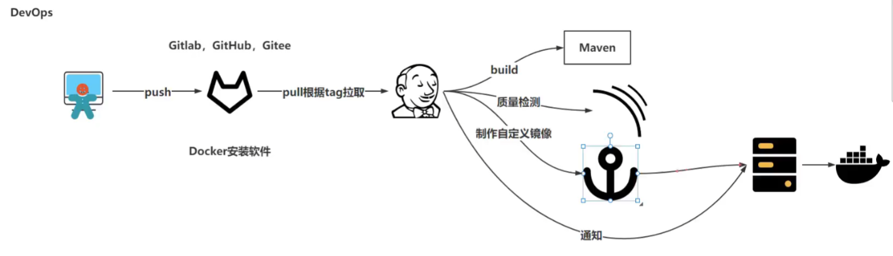
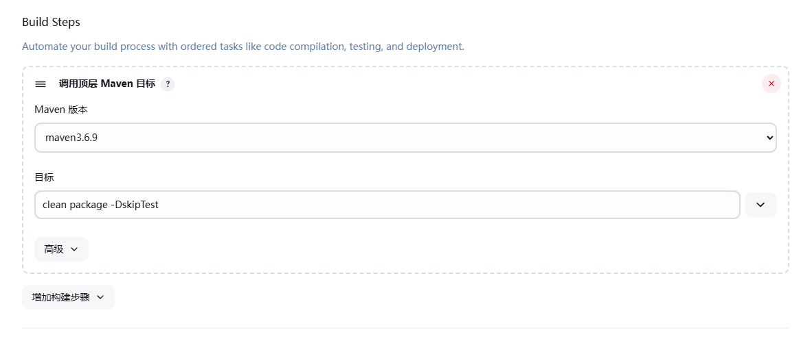
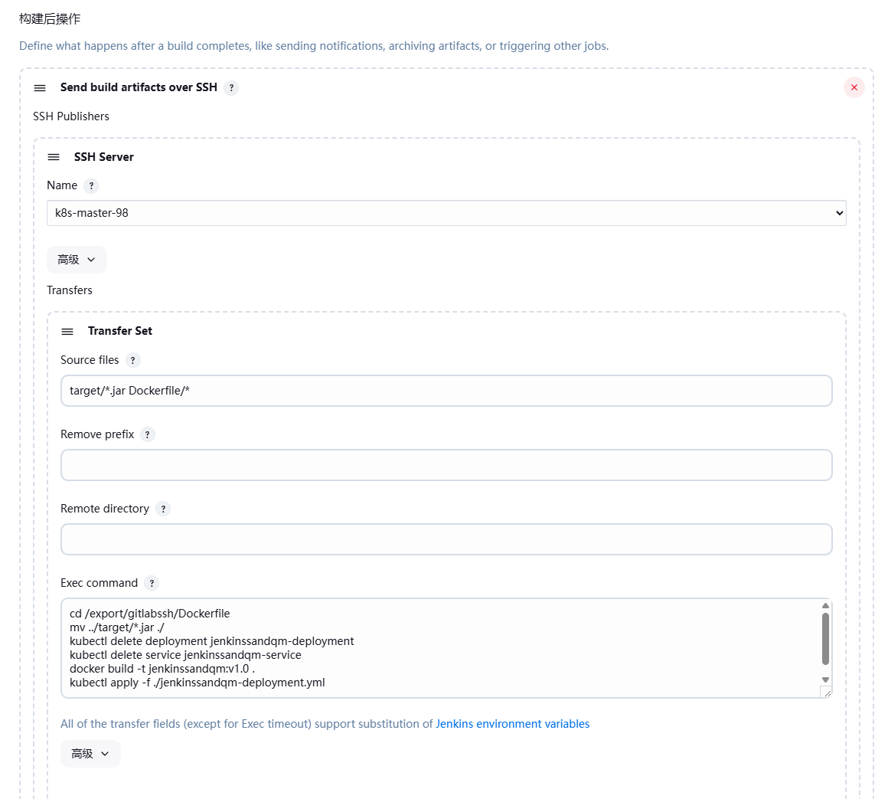
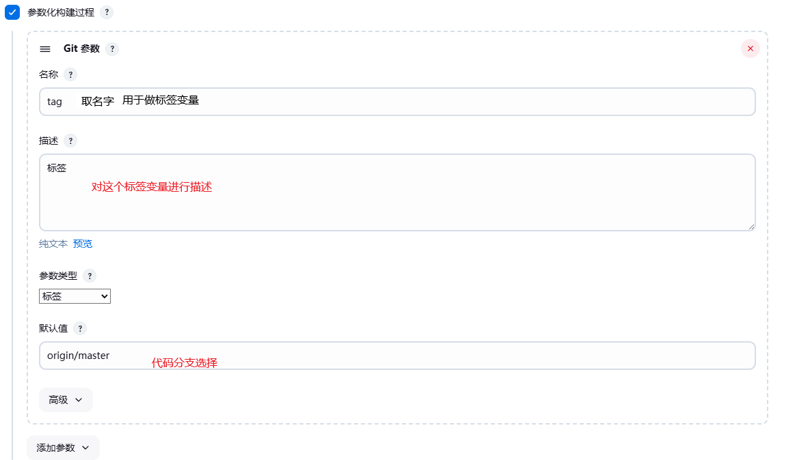
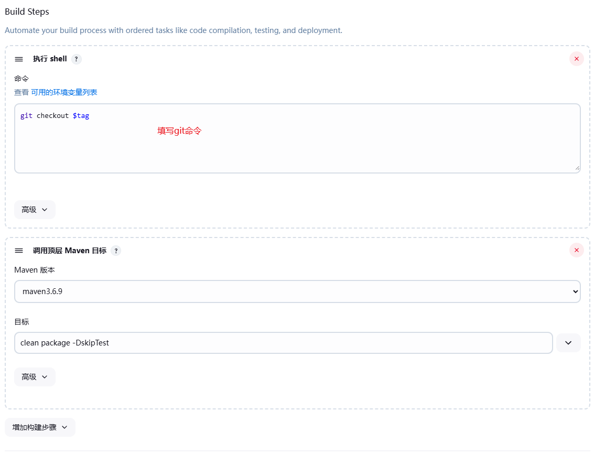

[toc]

==devops:开发运维一体化，解决开发与运维之间沟通问题==



## GitLab

* GitLab是利用Ruby on Rails一个开源的版本管理系统，实现一个自托管的Git项目仓库，可通过Web界面进行访问公开的或者私人项目。与Github类似，GitLab能够浏览源代码，管理缺陷和注释。可以管理团队对仓库的访问，它非常易于浏览提交过的版本并提供一个文件历史库。团队成员可以利用内置的简单聊天程序(Wall)进行交流。它还提供一个代码片段收集功能可以轻松实现代码复用，便于日后有需要的时候进行查找。

### **环境部署**

1. docker镜像部署直接拉取镜像

   1. 拉取镜像`docker pull swr.cn-north-4.myhuaweicloud.com/ddn-k8s/docker.io/twang2218/gitlab-ce-zh:latest`
   2. 编写yml、运行yml`kubectl apply -f gitlab-deployment.yaml`
   
2. 手动部署

   1. 配置yum源

      ```shell
      vim /etc/yum.repos.d/gitlab-ce.repo
      [gitlab-ce]
      name=gitlab-ce
      baseurl=http://mirrors.tuna.tsinghua.edu.cn/gitlab-ce/yum/el6
      Repo_gpgcheck=0
      Enabled=1
      Gpgkey=https://packages.gitlab.com/gpg.key
      # 或者
      curl -s https://packages.gitlab.com/install/repositories/gitlab/gitlab-ce/script.rpm.sh | sudo bash
      ```

   2. 更新本地缓存

      ```shell
      yum makecache
      ```

   3. 安装社区版

      ```shell
      yum install gitlab-ce        #自动安装最新版
      yum install gitlab-ce-x.x.x    #安装指定版本 
      ```

   4. 修改配置文件防止端口冲突

      1. 修改 `gitlab` 配置文件 `/etc/gitlab/gitlab.rb`

         ```shell
         external_url 'ip' -----> external_url 'http://ip:端口'
         ```

      2. `nginx`配置文件`/var/opt/gitlab/nginx/conf/gitlab-http.conf`

         ```shell
         # 将访问转发给对应端口
         listen *:端口;
         ```

      3. 重载配置生效，然后重启服务

         ```shell
         gitlab-ctl reconfigure
         gitlab-ctl restart
         ```

      4. 访问` http://ip:端口`
      
         * 用户名**root**，首次登陆需设定密码，而且密码至少**8**位
      
      5. 常用命令
      
         ```shell
         sudo gitlab-ctl start    # 启动所有 gitlab 组件；
         sudo gitlab-ctl stop        # 停止所有 gitlab 组件；
         sudo gitlab-ctl restart        # 重启所有 gitlab 组件；
         sudo gitlab-ctl status        # 查看服务状态；
         sudo gitlab-ctl reconfigure        # 启动服务；
         sudo vim /etc/gitlab/gitlab.rb        # 修改默认的配置文件；
         gitlab-rake gitlab:check SANITIZE=true --trace    # 检查gitlab；
         sudo gitlab-ctl tail        # 查看日志；
         ```

3. 链接git

   1. 在GitLab的主页中新建一个Project

   2. 添加ssh key导入步骤2中生成的密钥文件内容.

   3. 在linux配置个人使用git

      ```shell
      git config --global user.name "XXX"  
      git config --global user.email "XXX.com" 
      git clone git@ihjlsfhdkfx1gk8v3Z:root/test.git
      ```

### 基本操作

1. 登录：输入地址登录
2. 修改密码：`Profile Settings ------ Password -------修改密码-------Save password`
3. 项目管理
   1. 新建项目`projects-----项目名称-----New project------New project`
      * 创建时可以选择在自己用户下创建或者某个群组内创建
   2. 编辑或删除项目
      * `edit project---------Project`
4. 用户管理（管理员使用，非管理员跳过此步骤）
   1. 新建用户
      * 点击顶端的Admin Area按钮
   2. 编辑和删除用户
5. 组管理（管理员使用，非管理员跳过此步骤）
   1. 新建组
   2. 编辑或删除组
   3. 添加组成员
   4. 修改成员的权限（owner用户操作）
   5. 从组管理添加项目
6. 权限说明
   * Guest(匿名用户) - 创建项目、写留言薄
   * Reporter（报告人）- 创建项目、写留言薄、拉项目、下载项目、创建代码片段
   * Developer（开发者）- 创建项目、写留言薄、拉项目、下载项目、创建代码片段、创建合并请求、创建新分支、推送不受保护的分支、移除不受保护的分支 、创建标签、编写wiki
   * Master（管理者）- 创建项目、写留言薄、拉项目、下载项目、创建代码片段、创建合并请求、创建新分支、推送不受保护的分支、移除不受保护的分支 、创建标签、编写wiki、增加团队成员、推送受保护的分支、移除受保护的分支、编辑项目、添加部署密钥、配置项目钩子
   * Owner（所有者）- 创建项目、写留言薄、拉项目、下载项目、创建代码片段、创建合并请求、创建新分支、推送不受保护的分支、移除不受保护的分支 、创建标签、编写wiki、增加团队成员、推送受保护的分支、移除受保护的分支、编辑项目、添加部署密钥、配置项目钩子、开关公有模式、将项目转移到另一个名称空间、删除项目

## Jenkins

==Jenkins 是一个开源的 **自动化服务器**，主要用于实现软件开发中的 **持续集成（CI）** 和 **持续交付/部署（CD）**（CI/CD）。它通过自动化构建、测试、部署等流程，帮助开发团队快速交付高质量软件。==

* **CI/CD**
  * CI：持续集成
    * 开发————git————（构建）—————Jenkins————Docker镜像————Docker仓库—————测试
    * 自动触发代码提交后的构建和测试，确保代码变更不会破坏现有功能。
  * CD：持续交付
    * kubernetes———滚动更新
    * 将通过测试的代码自动部署到测试环境、预发布环境或生产环境。
* **典型工作流程**
  1. 代码提交：开发者推送代码到 Git 仓库。
  2. 触发构建：Jenkins 检测到代码变更，拉取最新代码。
  3. 构建与测试：执行编译、运行单元测试、代码扫描等。
  4. 生成制品：打包应用（如生成 JAR 文件或 Docker 镜像）。
  5. 部署：根据规则将制品部署到指定环境（测试/生产）。
  6. 通知：通过邮件、Slack 等通知团队构建结果。

### 安装

==全部使用镜像（容器）的方式==

1. 服务器准备（内存最少4G）

   * 本地自己电脑安装`git`
   
   * 在每一个服务器内都安装`docker`，创建k8s集群（master:192.168.31.98；node:31.96）
   
   * 31.96
     
     * 拉取`gitLab`（镜像）到当前节点
     
     * 使用K8s集群`pod-definition.yml`在当前节点上，使用当前宿主机暴露端口进行运行
     
       ```yaml
       apiVersion: apps/v1  # Kubernetes API版本定义
       kind: Deployment     # 资源类型：部署
       metadata:            # 元数据配置
         name: gitlab-ce-zh # 部署名称
         labels:           # 标签列表
           app: gitlab-ce-zh # 应用标签
       spec:               # 规格描述
         replicas: 1       # 副本数设置为1
         selector:         # 标签选择器配置
           matchLabels:    # 匹配带有以下标签的Pod
             app: gitlab-ce-zh
         template:         # Pod模板
           metadata:       # 模板元数据
             labels:       # Pod标签
               app: gitlab-ce-zh
           spec:           # 容器规格
             nodeSelector: # 节点选择器，指定运行该Pod的节点
               kubernetes.io/hostname: k8s-node-96  # 确保节点有此标签
             containers:   # 容器列表
             - name: gitlab  # 容器名
               image: swr.cn-north-4.myhuaweicloud.com/ddn-k8s/docker.io/twang2218/gitlab-ce-zh:latest  # 使用的镜像
               ports:       # 容器端口配置
               - containerPort: 80  # HTTP服务端口
                 name: http
               - containerPort: 443 # HTTPS服务端口
                 name: https
               - containerPort: 22  # SSH服务端口
                 name: ssh
               volumeMounts: # 卷挂载配置
               - mountPath: /etc/gitlab  # GitLab配置目录
                 name: gitlab-config
               - mountPath: /var/opt/gitlab  # GitLab数据目录
                 name: gitlab-data
               - mountPath: /var/log/gitlab  # GitLab日志目录
                 name: gitlab-logs
               resources:    # 资源限制和请求
                 limits:     # 最大资源限制
                   cpu: "2"  # CPU限制
                   memory: 4Gi  # 内存限制
                 requests:   # 请求的资源量
                   cpu: "1"  # CPU请求
                   memory: 2Gi  # 内存请求
             volumes:       # 卷列表
             - name: gitlab-config  # 配置卷名
               hostPath:    # 主机路径配置
                 path: /opt/gitlab/config  # 在主机上的路径
                 type: DirectoryOrCreate  # 如果不存在则创建目录
             - name: gitlab-data
               hostPath:
                 path: /opt/gitlab/data
                 type: DirectoryOrCreate
             - name: gitlab-logs
               hostPath:
                 path: /opt/gitlab/logs
                 type: DirectoryOrCreate
       
       ---
       apiVersion: v1      # Kubernetes API版本定义
       kind: Service       # 资源类型：服务
       metadata:           # 元数据配置
         name: gitlab-service  # 服务名称
       spec:               # 规格描述
         type: NodePort    # 服务类型：节点端口
         selector:         # 标签选择器配置
           app: gitlab-ce-zh  # 与部署匹配的标签
         ports:            # 服务端口配置
           - name: http    # HTTP服务
             port: 80      # 服务暴露端口
             targetPort: 80 # 目标端口（容器端口）
             nodePort: 30080  # 节点端口，范围30000-32767
           - name: https   # HTTPS服务
             port: 443     # 服务暴露端口
             targetPort: 443
           - name: ssh     # SSH服务
             port: 22      # 服务暴露端口
             targetPort: 22
       ```
     
     * 做`gitLab`初始化配置
     
       1. 第一次登录查看密码，进入容器在`/etc/exec/initial_root_password`用户名是`root`
     
          1. 无法找到密码，通过GitLab Rails控制台设置一个新的root密码
     
             * 进入容器`kubectl exec -it gitlab-ce-zh-756d69b6-bzvqc -- /bin/bash`
     
             * 运行`gitlab-rails console -e production`
     
             * 在打开的控制台中输入如下Ruby代码来更改密码：
     
               ```shell
               user = User.where(id: 1).first # 获取ID为1的用户，通常是root用户
               user.password = 'new_password' # 设置新密码
               user.password_confirmation = 'new_password' # 确认新密码
               user.save! # 保存更改
               exit # 退出控制台
               ```
     
       2. 浏览器访问修改密码
     
   * 31.98
     
     * 下载安装`jdk、maven`
     
       1. 下载上传解压`tar -zxvf 要解压的文件 -C`
       2. 修复maven中的配置文件
     
     * 拉取`Jenkins`镜像到当前节点运行容器（使用K8s集群`jenkins-deployment.yml`）
     
       ```yaml
       apiVersion: apps/v1
       kind: Deployment
       metadata:
         name: jenkins-deployment
         labels:
           app: jenkins
       spec:
         replicas: 1
         selector:
           matchLabels:
             app: jenkins
         template:
           metadata:
             labels:
               app: jenkins
           spec:
             # 强制调度到指定节点（需确认节点标签）
             nodeSelector:
               kubernetes.io/hostname: k8s-node-96
             # 配置 DNS 解析（核心修复点）
             dnsConfig:
               nameservers:
                 - 114.114.114.114  # 国内公共 DNS
                 - 8.8.8.8          # Google DNS
               options:
                 - name: ndots
                   value: "1"
             containers:
             - name: jenkins
               image: swr.cn-north-4.myhuaweicloud.com/ddn-k8s/docker.io/kubesphere/ks-jenkins:v3.4.1-2.319.3
               ports:
               - containerPort: 8080
                 name: http
               - containerPort: 50000
                 name: agent
               volumeMounts:
               - mountPath: /var/jenkins_home
                 name: jenkins-data
               resources:
                 limits:
                   cpu: "2"
                   memory: 2Gi
                 requests:
                   cpu: "0.5"
                   memory: 1Gi
             volumes:
             - name: jenkins-data
               hostPath:
                 path: /opt/jenkins
                 type: DirectoryOrCreate
       ---
       apiVersion: v1
       kind: Service
       metadata:
         name: jenkins-service
       spec:
         type: NodePort
         selector:
           app: jenkins
         ports:
           - name: http
             port: 8080
             targetPort: 8080
             nodePort: 30081
           - name: agent
             port: 50000
             targetPort: 50000
       ---
       # 允许所有出站流量的网络策略（按需使用）
       apiVersion: networking.k8s.io/v1
       kind: NetworkPolicy
       metadata:
         name: allow-egress
       spec:
         podSelector:
           matchLabels:
             app: jenkins
         policyTypes:
         - Egress
         egress:
         - {}
       ```
     
     * 浏览器访问`Jenkins`
     
     * 第一次访问需要输入密码、密码在日志中`kubectl logs`
     
       * 查看密码`cat /opt/jenkins/secrets/initialAdminPassword`
     
     * 配置jenkins使用国内镜像地址修改数据卷中`hudson.model.UpdateCenter.xml`文件（阿里云）
     
       ```xml
       <?xml version='1.1' encoding='UTF-8'?>
       <jenkins>
         <updateCenter>
           <sites>
             <site>
               <id>default</id>
               <url>https://mirrors.aliyun.com/jenkins/updates/current/update-center.json</url>
             </site>
           </sites>
         </updateCenter>
       </jenkins>
       ```
     
     * 选择插件安装（安装）新建用户名，配置实例直接保存
     
       * manage(选择安装插件)，选择Available；搜索安装==Git Parameter、publish Over SSH==勾选然后install安装
     
   * 配置jentins
   
     1. 将jdk和maven放在Jenkins数据持久化目录
     2. 配置jenkins
        1. maven—–jdk：manag jenkins———–tools配置
        2. ssh sever：manag jenkins—-System

### CI

1. 在gitlab上创建厂库、将代码提交到仓库

2. 在jenkins上新item——freestyle project

   1. 源码管理配置（source code management）配置git输入git仓库地址，添加用户名密码

   2. 配置maven打包（Buid Steps）选择maven版本，输入命令`clean package -DskipTest`打包跳过测试

      

   3. 在当前项目目录下新建dockerfile目录编写dockerflie、和k8syml

      ```yml
      FROM swr.cn-north-4.myhuaweicloud.com/ddn-k8s/docker.io/library/openjdk:17-jdk-slim
      COPY jenkinssandqm.jar /user/local/
      WORKDIR /user/local
      EXPOSE 8080
      ENTRYPOINT ["java", "-jar", "jenkinssandqm.jar"]
      # k8s
      version: '0.1'
      services:
        jenkinssandqm:
          build:
            context: ./
            dockerfile: dockerfile
          image: jenkinssandqm:v0.1
          container_name: jenkinssandqm
          ports:
            - 8080:8080
      ```
   
   4. 在jinkins中配置构建后操作，将dockerfile目录也复制到当前宿主机并且编写Exec  command
   
      * name选择配置的gitlab过来的文件存放路径
   
      * suorce files选择gitlab到本地需要的文件
   
      * 第一次构建镜像要在绝对路径上构建
   
        ```shell
        cd /export/gitlabssh/Dockerfile
        mv ../target/*.jar ./
        kubectl delete deployment jenkinssandqm-deployment
        kubectl delete service jenkinssandqm-service
        docker build -t jenkinssandqm:v1.0 . 
        kubectl apply -f ./jenkinssandqm-deployment.yml
        docker image prune -f
        ```
   
        
   
   5. 清理悬空镜像`docker image prune -f`

### CD

1. 配置参数化构建过程

   

2. 在Build Steps上加入增加构建步骤，放到maven前面

   

3. 在gitlab上给代码打标签

### Sonar Qube

==代码质量检查==

1. 安装
   1. 拉取镜像因为Sonar Qube需要PostgreSQL数据库支持所有需要拉取postgres镜像
   
   2. 拉取Sonar Qube镜像
   
   3. 创建k8s运行yml文件、需要先运行PostgreSQL在运行Sonar Qube镜像，因为Sonar Qube依赖与PostgreSQL
   
      ```yml
      apiVersion: apps/v1
      kind: Deployment
      metadata:
        name: qualityinspection-deployment
      spec:
        selector:
          matchLabels:
            app: qualityinspection
        template:
          metadata:
            labels:
              app: qualityinspection
          spec:
            nodeSelector:
              kubernetes.io/hostname: k8s-master-98
            containers:
            - name: qualityinspection
              image: swr.cn-north-4.myhuaweicloud.com/ddn-k8s/docker.io/bitnami/postgresql:latest
              resources:
                limits:
                  memory: "512Mi"
                  cpu: "500m"
              ports:
              - containerPort: 5432
                name: postgresq-port
              env:
              - name: POSTGRES_USER
                value: "sonaruser"
              - name: POSTGRES_PASSWORD
                value: "sonarpassword"
              - name: POSTGRES_DB
                value: "sonarqube"
              volumeMounts:
              - mountPath: /bitnami/postgresql
                name: postgresql-sql
              - mountPath: /docker-entrypoint-initdb.d
                name: postgresql-initdb
              - mountPath:  /docker-entrypoint-preinitdb.d
                name: postgresql-preinitdb
            volumes:
            - name: postgresql-sql
              hostPath:
                path: /opt/postgresql/sql
                type: DirectoryOrCreate
            - name: postgresql-initdb
              hostPath:
                path: /opt/postgresql/initdb
                type: DirectoryOrCreate
            - name: postgresql-preinitdb
              hostPath:
                path: /opt/postgresql/preinitdb
                type: DirectoryOrCreate
      ---
      apiVersion: v1
      kind: Service
      metadata:
        name: qualityinspection-service
      spec:
        type: NodePort
        selector:
          app: qualityinspection
        ports:
        - name: postgresq-port
          port: 5432
          targetPort: 5432
          nodePort: 30083
      ```
      
      ```yml
      apiVersion: apps/v1
      kind: Deployment
      metadata:
        name: sonarqube-deployment
      spec:
        selector:
          matchLabels:
            app: sonarqube
        template:
          metadata:
            labels:
              app: sonarqube
          spec:
            nodeSelector:
              kubernetes.io/hostname: k8s-node-96
            containers:
            - name: sonarqube
              image: swr.cn-north-4.myhuaweicloud.com/ddn-k8s/docker.io/sonarqube:8.9-community
              resources:
                limits:
                  memory: "1Gi"
                  cpu: "500m"
              ports:
              - containerPort: 9000
                name: sonarqube-port
              env:
              - name: SONARQUBE_JDBC_USERNAME
                value: "sonaruser"
              - name: SONARQUBE_JDBC_PASSWORD
                value: "sonarpassword"
              - name: SONARQUBE_JDBC_URL
                value: "jdbc:postgresql://Qualityinspection-service.default.svc.cluster.local:5432/sonarqub"
              volumeMounts:
              - mountPath: /opt/sonarqube
                name: sonarqube-data
            volumes:
            - name: sonarqube-data
              hostPath:
                path: /opt/sonarqube
                type: DirectoryOrCreate
      ---
      apiVersion: v1
      kind: Service
      metadata:
        name: sonarqube-service
      spec:
        type: NodePort
        selector:
          app: sonarqubeport
        ports:
        - name: sonarqube-port
          port: 9000
          targetPort: 9000
          nodePort: 30084
      ```
   
2. 


### Harbor

==镜像仓库==

### pipeline

==流水线构建模式==

### Kuoard

==图形化Kubernetes==