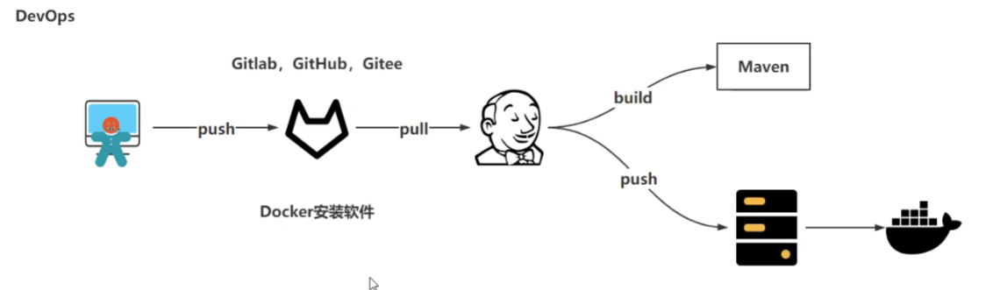

[toc]

==devops:开发运维一体化，解决开发与运维之间沟通问题==



## GitLab

* GitLab是利用Ruby on Rails一个开源的版本管理系统，实现一个自托管的Git项目仓库，可通过Web界面进行访问公开的或者私人项目。与Github类似，GitLab能够浏览源代码，管理缺陷和注释。可以管理团队对仓库的访问，它非常易于浏览提交过的版本并提供一个文件历史库。团队成员可以利用内置的简单聊天程序(Wall)进行交流。它还提供一个代码片段收集功能可以轻松实现代码复用，便于日后有需要的时候进行查找。

### **环境部署**

1. docker镜像部署直接拉取镜像

   1. 拉取镜像`docker pull swr.cn-north-4.myhuaweicloud.com/ddn-k8s/docker.io/twang2218/gitlab-ce-zh:latest`
   2. 编写yml
   3. 运行yml`kubectl apply -f gitlab-deployment.yaml`

2. 手动部署

   1. 配置yum源

      ```shell
      vim /etc/yum.repos.d/gitlab-ce.repo
      [gitlab-ce]
      name=gitlab-ce
      baseurl=http://mirrors.tuna.tsinghua.edu.cn/gitlab-ce/yum/el6
      Repo_gpgcheck=0
      Enabled=1
      Gpgkey=https://packages.gitlab.com/gpg.key
      # 或者
      curl -s https://packages.gitlab.com/install/repositories/gitlab/gitlab-ce/script.rpm.sh | sudo bash
      ```

   2. 更新本地缓存

      ```shell
      yum makecache
      ```

   3. 安装社区版

      ```shell
      yum install gitlab-ce        #自动安装最新版
      yum install gitlab-ce-x.x.x    #安装指定版本 
      ```

   4. 修改配置文件防止端口冲突

      1. 修改 `gitlab` 配置文件 `/etc/gitlab/gitlab.rb`

         ```shell
         external_url 'ip' -----> external_url 'http://ip:端口'
         ```

      2. `nginx`配置文件`/var/opt/gitlab/nginx/conf/gitlab-http.conf`

         ```shell
         # 将访问转发给对应端口
         listen *:端口;
         ```

      3. 重载配置生效，然后重启服务

         ```shell
         gitlab-ctl reconfigure
         gitlab-ctl restart
         ```

      4. 访问` http://ip:端口`
      
         * 用户名**root**，首次登陆需设定密码，而且密码至少**8**位
      
      5. 常用命令
      
         ```shell
         sudo gitlab-ctl start    # 启动所有 gitlab 组件；
         sudo gitlab-ctl stop        # 停止所有 gitlab 组件；
         sudo gitlab-ctl restart        # 重启所有 gitlab 组件；
         sudo gitlab-ctl status        # 查看服务状态；
         sudo gitlab-ctl reconfigure        # 启动服务；
         sudo vim /etc/gitlab/gitlab.rb        # 修改默认的配置文件；
         gitlab-rake gitlab:check SANITIZE=true --trace    # 检查gitlab；
         sudo gitlab-ctl tail        # 查看日志；
         ```

3. 链接git

   1. 在GitLab的主页中新建一个Project

   2. 添加ssh key导入步骤2中生成的密钥文件内容.

   3. 在linux配置个人使用git

      ```shell
      git config --global user.name "XXX"  
      git config --global user.email "XXX.com" 
      git clone git@ihjlsfhdkfx1gk8v3Z:root/test.git
      ```

### 基本操作

1. 登录：输入地址登录
2. 修改密码：`Profile Settings ------ Password -------修改密码-------Save password`
3. 项目管理
   1. 新建项目`projects-----项目名称-----New project------New project`
      * 创建时可以选择在自己用户下创建或者某个群组内创建
   2. 编辑或删除项目
      * `edit project---------Project`
4. 用户管理（管理员使用，非管理员跳过此步骤）
   1. 新建用户
      * 点击顶端的Admin Area按钮
   2. 编辑和删除用户
5. 组管理（管理员使用，非管理员跳过此步骤）
   1. 新建组
   2. 编辑或删除组
   3. 添加组成员
   4. 修改成员的权限（owner用户操作）
   5. 从组管理添加项目
6. 权限说明
   * Guest(匿名用户) - 创建项目、写留言薄
   * Reporter（报告人）- 创建项目、写留言薄、拉项目、下载项目、创建代码片段
   * Developer（开发者）- 创建项目、写留言薄、拉项目、下载项目、创建代码片段、创建合并请求、创建新分支、推送不受保护的分支、移除不受保护的分支 、创建标签、编写wiki
   * Master（管理者）- 创建项目、写留言薄、拉项目、下载项目、创建代码片段、创建合并请求、创建新分支、推送不受保护的分支、移除不受保护的分支 、创建标签、编写wiki、增加团队成员、推送受保护的分支、移除受保护的分支、编辑项目、添加部署密钥、配置项目钩子
   * Owner（所有者）- 创建项目、写留言薄、拉项目、下载项目、创建代码片段、创建合并请求、创建新分支、推送不受保护的分支、移除不受保护的分支 、创建标签、编写wiki、增加团队成员、推送受保护的分支、移除受保护的分支、编辑项目、添加部署密钥、配置项目钩子、开关公有模式、将项目转移到另一个名称空间、删除项目

## Jenkins

==Jenkins 是一个开源的 **自动化服务器**，主要用于实现软件开发中的 **持续集成（CI）** 和 **持续交付/部署（CD）**（CI/CD）。它通过自动化构建、测试、部署等流程，帮助开发团队快速交付高质量软件。==

* **CI/CD**
  * CI：持续集成
    * 开发————git————（构建）—————Jenkins————Docker镜像————Docker仓库—————测试
    * 自动触发代码提交后的构建和测试，确保代码变更不会破坏现有功能。
  * CD：持续交付
    * kubernetes———滚动更新
    * 将通过测试的代码自动部署到测试环境、预发布环境或生产环境。
* **典型工作流程**
  1. 代码提交：开发者推送代码到 Git 仓库。
  2. 触发构建：Jenkins 检测到代码变更，拉取最新代码。
  3. 构建与测试：执行编译、运行单元测试、代码扫描等。
  4. 生成制品：打包应用（如生成 JAR 文件或 Docker 镜像）。
  5. 部署：根据规则将制品部署到指定环境（测试/生产）。
  6. 通知：通过邮件、Slack 等通知团队构建结果。

### 安装

==全部使用镜像（容器）的方式==

1. 服务器准备（内存最少4G）

   * 本地自己电脑安装`git`
   * 在每一个服务器内都安装`docker`，创建k8s集群（master:192.168.31.98；node:31.96、31.97）
   * 31.96
     * 拉取`gitLab`（镜像）到当前节点
     * 使用K8s集群`pod-definition.yml`在当前节点上，使用当前宿主机暴露端口进行运行
     * 做`gitLab`初始化配置、在浏览器进行访问
   * 31.98
     * 下载安装`jdk、maven`
     * 拉取`Jenkins`镜像到当前节点运行容器（使用K8s集群`pod-definition.yml`）
     * 浏览器访问`Jenkins`
     * 创建k8s集群、master节点
   * 31.97
     * 作为应用服务、器跑服务作用
2. Jenkins安装（pod-definition.yml）运行
   * 拉取镜像`docker pull`
   * 新建文件夹`use/local/k8s/docker/jenkins/`

### CI

1. 进入Jenkins网页
2. 

### CD


### Sonar Qube

### Harbor

### pipeline

### Kuoard