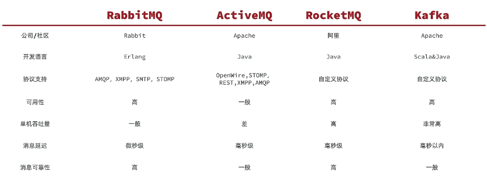

[toc]

# MQ

## MQ基础

### 调用

1. 同步调用：同步指的是任务按照顺序依次执行的方式
   * 同步调用的优势
      * 时效性强，等待到结果后才返回。
   * 同步调用的问题
      * 拓展性差
      * 性能下降
      * 级联失败问题
2. 异步调用：异步则是指不同的任务可以在不等待其他任务完成的情况下独立进行
   * 异调用的优势
      * 耦合度低，拓展性强
      * 异步调用，无需等待，性能好
      * 故障隔离，下游服务故障不影响上游业务
      * 缓存消息/流量削峰填谷
   * 异步调用的问题
      * 不能立即得到调用结果，时效性差
      * 不确定下游业务执行是否成功
      * 业务安全依赖于 Broker（代理） 的可靠性

### 技术选型



1. 认识和安装

   1. docker镜像拉取

   2. 使用k8s的yml运行

2. 快速入门

3. 数据隔离

   * 用户权限

### Java客户端

1. 快速入门

   * 加入`pom`依赖

      ```xml
      <dependency>
          <groupId>org.springframework.boot</groupId>
          <artifactId>spring-boot-starter-amqp</artifactId>
      </dependency>
      ```

   * 配置mq服务端信息

      ```yaml
      spring:
        rabbitmq:
          host:ip地址 #主机名
          port:端口
          virtual-lost:虚拟主机
          username:用户名
          password:密码
      ```

   * 使用工具类（发送消息）

      ```java
      //注入
      @Autowired
      private RabbitTemplate rabbitTemplate;
      
      @Test
      public void testSimp(){
          //队列名称
          String qu = "";
          //消息
          String message = "";
          //发送消息
          rabbitTemplate.convertAndSend(qu,message);
      }
      ```

   * 使用类（接收消息）无论接收还是发送都需要配置yaml

      ```Java
      //方法
      @RabbitListener(queues = "") //消息队列
      public void listenSimpleQueueMessage(String msg){
          System.out.println(msg)
      }
      ```

2. work模型

3. Fanout交换机

4. Direct交换机

5. Topic交换机

6. 声明队列和交换机的方式一

7. 声明队列和交换机的方式二

8. 消息转换器

9. 改造业务代码

## MQ高级

### 生产者可靠性

1. 生产者重连
2. 生产者确认原理
3. 生产者确认代码实现

### MQ的可靠性

1. 数据持久化
2. LazyQueue

### 消费者可靠性

1. 消费者确认
2. 失败重试机制
3. 业务幂等性

### 延迟消息

1. 什么是延迟消息
2. 死信交换机
3. 延迟消息插件
4. 取消超时订单的基本思路
5. 发送延迟检测订单的消息
6. 监听延迟消息

# kafka